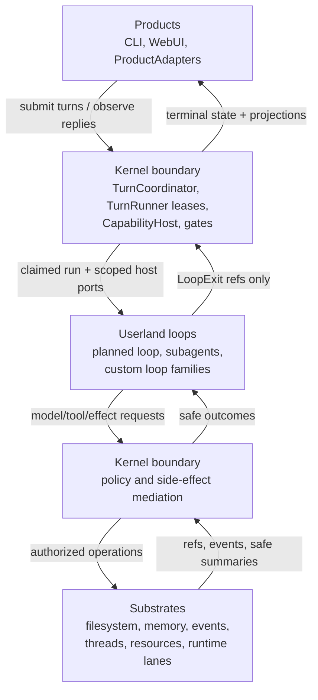
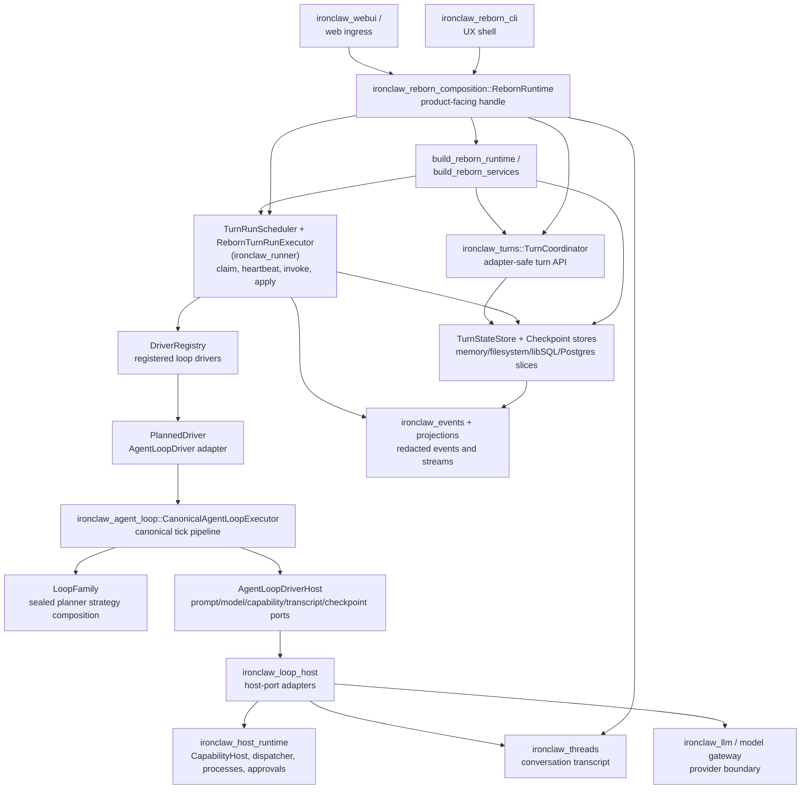
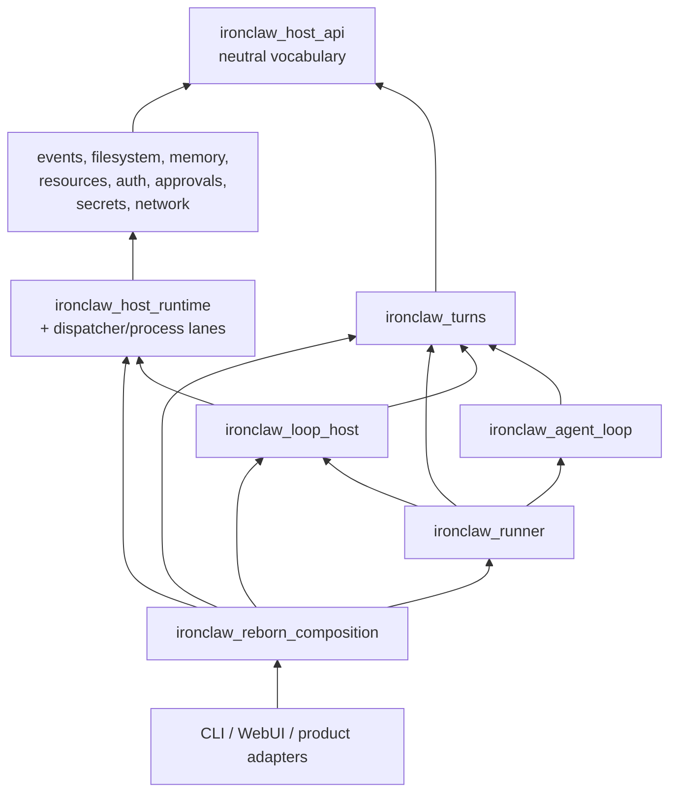
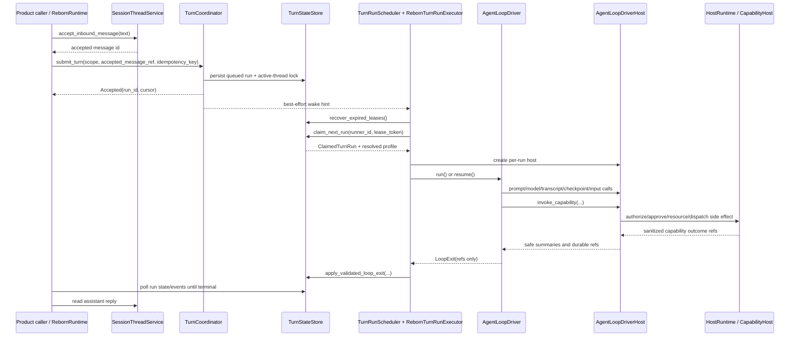
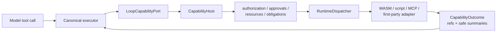
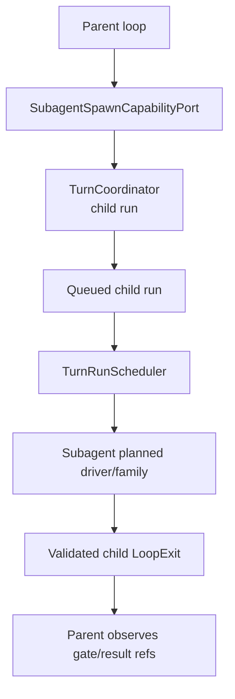

# Reborn Agent Architecture

This document maps the Reborn agent architecture as implemented in the `crates/`
workspace. It focuses on the crates-level shape: how a
user turn enters Reborn, how a runner executes it, how model and capability work
flow through host ports, and where each component is allowed to depend.

For behavior-changing work, prefer the contract docs in `docs/reborn/contracts/`
and crate-local `AGENTS.md` / `CLAUDE.md` files as the authoritative sources.

## Architecture Thesis

Reborn has one host/runtime architecture with replaceable products and
replaceable loops. The central design rule is:

```text
Products own UX.
Loops own agent behavior.
The kernel boundary owns authority, recovery, and side-effect mediation.
Substrates own durable, reusable primitives.
```

This gives Reborn a narrow place to enforce security and recovery without
hardcoding one agent brain or one product transport. A CLI, WebUI, Slack adapter,
Telegram adapter, or future ProductAdapter should all enter through the same
turn/runtime contracts. A planned loop, subagent loop, CodeAct loop, or custom
loop should all request effects through the same host ports and kernel-mediated
capability path.

### Non-Goals

Reborn should not grow:

- one host core per product, vendor, or transport;
- a privileged agent loop that bypasses `CapabilityHost`;
- product-specific orchestration inside substrate crates;
- direct dispatcher calls from loops or product entry points;
- ad-hoc persistence records carrying raw prompts, tool input, secrets, host
  paths, or backend diagnostics;
- separate subagent execution machinery outside the normal runner/driver loop;
- local-dev shortcuts that silently become hosted or production behavior.

### Relationship to the legacy v1 engine

`crates/ironclaw_engine` ("engine v2") is the **v1 monolith's** agent loop — a
complete parallel machinery with its own capability registry, lease manager,
and policy engine, consumed only by the root `ironclaw` crate through
`src/bridge/`. It is **not part of Reborn**: the dependency-boundary tests
forbid Reborn crates from importing it, and nothing else in this document
describes it. Do not build new Reborn behavior on it; it retires with the
monolith. `ironclaw_tui`, `ironclaw_gateway`, and `ironclaw_embeddings` are
in the same v1-only category despite living in `crates/`. The v1 loopback
OAuth transport is folded into `ironclaw_auth::oauth` until v1 retires.

## Mental Model

Reborn separates product entry points, durable turn coordination, replaceable
agent-loop behavior, and kernel-mediated side effects.

```text
Product/API surface
  accepts messages and exposes replies/events

Composition facade
  assembles storage, host runtime, drivers, workers, profiles, projections

Turn coordination
  owns turn/run records, active-thread lock, leases, wake hints, lifecycle

Runner worker
  claims queued runs, heartbeats leases, invokes one loop driver, applies exit

Agent-loop driver
  userland loop behavior; plans prompt/model/tool work and returns LoopExit

Agent-loop host ports
  scoped access to prompt, model, capabilities, transcript, checkpoints, input

Host runtime / substrates
  authorization, approvals, resources, filesystem, secrets, network, processes,
  runtime dispatch, events, memory, extensions
```

The loop is intentionally not the security perimeter. It asks for effects through
host ports, and those host ports eventually route privileged effects through the
host runtime and `CapabilityHost` boundary.

## High-Level Separation

Reborn is easiest to understand as four layers with different jobs:

```text
Products
  Own user experience and transport shape.
  Examples: CLI, WebUI, future Slack/Telegram/ProductAdapter surfaces.

Userland loops
  Own agent behavior.
  Examples: default planned loop, subagent loop family, text-only reference loop,
  future CodeAct or custom loop families.

Kernel boundary
  Own authority and durable coordination.
  Examples: turn coordination, runner leases, CapabilityHost, approvals,
  authorization, resources, scoped filesystems, network/secrets policy,
  event/audit emission, process control.

Substrates
  Own reusable storage and service primitives.
  Examples: filesystem, memory, events, projections, threads, run state,
  authorization stores, approval stores, resource governor, runtime lanes.
```

The important design choice is that these layers are not peers. Products and
loops are replaceable userland code. The kernel boundary is the narrow authority
surface they must use for side effects. Substrates are reusable building blocks
behind that boundary.

```text
              product/user request
                       |
                       v
              +------------------+
              | Products         |
              | UX + adapters    |
              +---------+--------+
                        |
                        | submit turn / read replies / observe events
                        v
              +------------------+
              | Kernel boundary  |
              | durable turns,   |
              | leases, gates,   |
              | capabilities     |
              +---------+--------+
                        |
                        | claimed run + scoped host ports
                        v
              +------------------+
              | Userland loops   |
              | plan, prompt,    |
              | model, tools     |
              +---------+--------+
                        |
                        | requested effects only through host ports
                        v
              +------------------+
              | Kernel boundary  |
              | authorize and    |
              | mediate effects  |
              +---------+--------+
                        |
                        v
              +------------------+
              | Substrates       |
              | stores, lanes,   |
              | services         |
              +------------------+
```



### Products

Products decide how humans and external systems interact with Reborn. A product
surface may create conversations, accept inbound messages, stream projections,
render approvals, or expose auth interactions. It should not own agent-loop
heuristics, tool authorization, runtime dispatch, or low-level persistence
policy.

In crates, product-facing assembly currently enters through
`ironclaw_reborn_composition::RebornRuntime`. CLI and WebUI code should treat
that facade as the public runtime handle instead of wiring `TurnStateStore`,
the `TurnRunScheduler`/`TurnRunExecutor` pair, `HostRuntimeServices`, or
concrete drivers directly.

### Userland Loops

Loops decide what the agent does next. They build prompt context from authorized
host data, call the model through a host model port, interpret model output,
request capability calls, checkpoint resumable state, and eventually return a
`LoopExit`.

Loops are userland because their choices are policy-constrained requests, not
authority. A loop can ask to call a capability, read context, write a reply, or
spawn a subagent, but the host decides whether that request is allowed and how it
is recorded. This is why `ironclaw_agent_loop` depends on neutral turn/host-port
contracts instead of importing the dispatcher, secrets, network, or product
adapters.

### Kernel Boundary

The kernel boundary is the security and recovery perimeter. It is not a single
`ironclaw_kernel` crate; it is the set of mediated services that enforce:

- scope and active-thread ownership;
- runner claim/heartbeat/recovery rules;
- exact capability invocation authorization and approvals;
- resource reservation and process ownership;
- scoped filesystem and memory access;
- network and secret policy;
- redacted event/audit emission;
- validated loop-exit application.

The kernel boundary keeps loops and products honest. If a driver returns
`LoopExit::Completed`, the runner still verifies durable reply/result refs
before releasing the active lock. If a loop asks for a tool call, the request
still passes through `CapabilityHost` and obligation handling before dispatch.

### Substrates

Substrates are reusable service and storage primitives. They are deliberately
less product-aware than the runtime facade and less behavior-aware than loops.
Examples include event logs, projection stores, filesystem roots, memory
services, approval/run-state stores, resource governors, thread services, and
runtime lanes.

Substrates should expose typed capabilities and durable records, not product UX
shortcuts. Product and loop behavior is assembled above them; policy-sensitive
access to them is mediated through the kernel boundary.

## Layer Ownership Matrix

Use this table when deciding where a new concern belongs.

| Layer | May call | Must not call | Owns | Typical crates |
| --- | --- | --- | --- | --- |
| Products | Composition facade, product workflow, projection/read APIs | Raw stores, `RuntimeDispatcher`, concrete loop drivers, substrate internals | UX, transport normalization, user-visible replies/events, approval/auth UI | `ironclaw_reborn_cli`, `ironclaw_webui`, product adapters |
| Composition | Turn coordinator, host runtime, loop driver registry, substrates through typed constructors | Product-specific branching in lower crates, test/dev escape hatches in production | Service graph, profile mode, readiness, facade handles | `ironclaw_reborn_composition`, `ironclaw_runner` |
| Userland loops | `AgentLoopDriverHost` ports only | `CapabilityHost`, `RuntimeDispatcher`, secret/network stores, product adapters | Prompt/model/tool strategy, retry/stop/gate decisions, loop-local checkpoints | `ironclaw_agent_loop`, loop families |
| Kernel boundary | Substrates and runtime lanes through typed policy/authority APIs | Product UX decisions, loop strategy internals | Authorization, approvals, exact invocation leases, active locks, runner leases, validated exits, resource/process ownership | `ironclaw_turns`, `ironclaw_host_runtime`, `ironclaw_authorization`, `ironclaw_approvals` |
| Substrates | Lower neutral contracts and storage backends | Product facade APIs, loop behavior, direct authority escalation | Durable records, files, memory, events, projections, threads, resource stores, runtime adapters | `ironclaw_filesystem`, `ironclaw_memory`, `ironclaw_events`, `ironclaw_threads`, runtime lane crates |

Short version:

```text
Product -> Composition facade
Composition -> Kernel boundary + substrates
Loop -> AgentLoopDriverHost ports
Kernel boundary -> Substrates and runtime lanes
Substrate -> neutral contracts only
Dispatcher -> already-authorized routing only
```

## Kernel Boundary vs Substrates

The kernel boundary is a mediation role, not a single crate. It contains the
services that decide whether work may proceed and how recovery remains safe.

```text
Kernel-facing mediators
  TurnCoordinator / TurnRunTransitionPort
  TurnRunScheduler + TurnRunExecutor + LoopExitApplier
  CapabilityHost + obligation handler
  authorization and approval services
  resource reservation and process ownership
  runtime policy, network policy, secret handoff
  event/audit publication gates

Substrate primitives
  TurnStateStore and checkpoint stores
  SessionThreadService
  DurableEventLog and projection streams
  RootFilesystem / ScopedFilesystem / memory services
  approval, authorization, run-state, resource stores
  WASM / script / MCP / first-party runtime adapters
```

Substrates can enforce local invariants such as containment, redaction, bounded
payload size, or transaction semantics, but they should not decide product
workflow or loop behavior. Kernel mediators compose those primitives into an
authority decision.

## Component Map



### Primary Crates

| Crate | Owns | Does not own |
| --- | --- | --- |
| `ironclaw_reborn_composition` | Product-facing runtime assembly, facade handles, local/prod profiles, WebUI/runtime integration, projection services. | Low-level policy internals or direct product traffic bypassing Reborn adapters. |
| `ironclaw_runner` | Trusted worker-side control plane: claiming/heartbeat scheduler (`TurnRunScheduler`), per-run executor (`RebornTurnRunExecutor`), concrete loop driver registry, planned/text driver adapters, loop host factory, and exit-applier wiring. | Loop strategy internals, neutral turn contracts, product idempotency/binding policy, or host-runtime service implementation. |
| `ironclaw_turns` | Turn/run IDs, scopes, coordinator API, runner transition ports, state machine contracts, loop-exit DTOs, run profiles, checkpoint contracts. | Runtime dispatch, product adapters, raw prompts/tool inputs/secrets. |
| `ironclaw_agent_loop` | Canonical executor, loop families, sealed strategy composition, resumable loop state. | Host services, runtime lanes, product transport, provider auth. |
| `ironclaw_loop_host` | Reusable adapters that implement loop host ports over threads, model gateways, capabilities, skills, checkpoints, cancellation, subagents. | Product-facing runtime facade or durable turn state ownership. |
| `ironclaw_host_runtime` | Kernel-facing host runtime services: capability host, dispatcher composition, approvals, resources, processes, secrets/network mediation. | Agent-loop planning or product conversation UX. |

## Dependency Direction

The dependency shape should flow from neutral contracts and substrates upward to
composition. Lower layers should not import product/runtime orchestration.

```text
host_api / common / prompt_envelope
  -> filesystem / memory / events / projections / streams / resources / trust
  -> auth / authorization / approvals / run_state / runtime_policy / secrets / network
  -> host_runtime / dispatcher / processes / runtime lanes
  -> turns / threads / loop_host / agent_loop / capabilities
  -> reborn / reborn_composition / product workflow / adapters
  -> reborn_cli / webui / gateway / TUI / product entry points
```



Boundary rules are mechanically checked in `ironclaw_architecture`, especially
for Reborn dependency edges and public-surface restrictions.

## Core Data Model

The architecture is durable-record driven. These are the important records and
refs that cross crate boundaries:

| Data | Purpose | Owner |
| --- | --- | --- |
| `TurnScope` | Canonical tenant/agent/project/thread scope. It is the active-lock and isolation key. | `ironclaw_turns` |
| `TurnActor` | Actor metadata for the accepted turn. It does not change the active-lock key. | `ironclaw_turns` |
| `AcceptedMessageRef` | Durable ref to the accepted inbound message in thread/transcript storage. | `ironclaw_turns` + thread service |
| `SourceBindingRef` / `ReplyTargetBindingRef` | Canonical product binding refs for source and reply target. | Product workflow / turns |
| `TurnId` | Accepted inbound turn identity. | `ironclaw_turns` |
| `TurnRunId` | Executable run identity. A turn may have resumed/child run behavior around this run record. | `ironclaw_turns` |
| `TurnRunState` | Current status, resolved run profile, runner lease metadata, checkpoint/gate refs, event cursor. | `TurnStateStore` |
| `TurnActiveLockRecord` | One-active-run-per-canonical-thread lock. | `TurnStateStore` |
| `TurnIdempotencyRecord` | Sanitized replay outcome for adapter-facing submit/resume/cancel mutations. | `TurnStateStore` |
| `LoopExecutionState` | Loop-owned resumable strategy state, serialized only as bounded checkpoint payload bytes. | `ironclaw_agent_loop` |
| `LoopCheckpointStateRef` / `TurnCheckpointId` | Opaque checkpoint payload ref and public checkpoint metadata id. | checkpoint stores + turns |
| `LoopExit` | Driver claim containing durable refs only; never trusted by itself. | loop driver / turns |
| `LoopMessageRef` / `LoopResultRef` / `LoopGateRef` | Host-minted evidence refs used to validate exits and blocked gates. | host ports / turns |
| `CapabilityInvocation` / `CapabilityOutcome` | Scoped tool/capability request and sanitized result refs/summaries. | loop host ports + host runtime |
| `EventCursor` | Replay/projection cursor for redacted lifecycle and progress events. | events / turns |

Persistence placement follows this split:

```text
TurnStateStore
  turn/run lifecycle, active locks, runner leases, idempotency, checkpoint refs

CheckpointStateStore
  bounded loop checkpoint payload bytes keyed by opaque refs and scope/run

SessionThreadService
  accepted inbound messages, assistant drafts/finals, transcript state

Event/audit logs
  redacted lifecycle, progress, capability, approval, and runtime metadata
```

Turn records and events store refs and metadata. Raw prompt text, raw assistant
drafts, tool input JSON, secrets, host paths, raw runtime output, provider
errors, and backend diagnostics stay out of turn persistence.

## Run Profiles And Policy Resolution

Run profiles are the bridge between product intent, loop behavior, and kernel
policy. A resolved run profile is captured on the run so execution can be
recovered without re-resolving a different driver or policy after restart.

```text
RunProfileRequest
  -> RunProfileResolver
  -> ResolvedRunProfile
      loop_driver id/version/checkpoint schema
      model profile
      capability surface profile
      context profile and personal-context policy
      checkpoint policy
      resource budget policy
      runtime constraints
      scheduling/concurrency class
      provenance and fingerprint
```

Profiles do not grant authority by themselves. They choose bounded surfaces and
policies that host/kernel services enforce later:

```text
profile selects visible capability surface
  but CapabilityHost still authorizes exact invocation

profile selects model/context policies
  but host ports still enforce safety, scope, and redaction

profile selects checkpoint policy
  but runner still validates durable checkpoint/result evidence

profile selects runtime constraints
  but deployment mode and host runtime policy may only reduce authority
```

Runtime deployment profiles are a separate outer envelope. For example,
`LocalDev`, `HostedDev`, and `EnterpriseDev` may all run the same loop and
capability contracts, but resolve to different filesystem, process, network,
secret, approval, and audit backends. Deployment mode may reduce requested
authority; it must not increase it.

## Turn Data Flow

The normal single-message flow is:

```text
1. Product/runtime caller writes user text to SessionThreadService.
2. Caller submits SubmitTurnRequest to TurnCoordinator.
3. TurnCoordinator persists turn/run state, enforces active-thread ownership,
   resolves the run profile, and emits a wake hint.
4. TurnRunScheduler (in ironclaw_runner) wakes or polls, recovers
   expired leases, and claims queued runs — concurrently, bounded by a
   semaphore plus per-user and per-inbound-type caps.
5. For each claimed run, RebornTurnRunExecutor (in ironclaw_runner) resolves
   the assigned AgentLoopDriver from DriverRegistry.
6. The executor builds a per-run AgentLoopDriverHost from the host factory
   and persists a model-route snapshot before invoking the driver.
7. PlannedDriver validates the request/profile and starts or resumes the
   CanonicalAgentLoopExecutor with LoopExecutionState.
8. Executor asks host ports for prompt context, model calls, tool/capability
   calls, transcript writes, checkpoints, input, progress, compaction, and
   cancellation.
9. Executor returns a LoopExit containing durable refs only.
10. The executor applies the LoopExit through LoopExitApplier (owned by
    `ironclaw_turns`) and trusted runner transition ports.
11. Product/runtime caller waits for terminal state, then reads the assistant
    reply from SessionThreadService and observes events/projections.
```



## Runner And Lease Flow

`TurnRunScheduler` plus `RebornTurnRunExecutor` (both in `ironclaw_runner`)
form the trusted worker-side control plane. It does not
accept traffic directly; the scheduler claims durable work already accepted by
`TurnCoordinator` and runs claimed executions concurrently under a bounded
semaphore with per-user and per-inbound-type caps.

```mermaid
stateDiagram-v2
    [*] --> Queued: submit_turn
    Queued --> Running: claim_next_run
    Running --> Running: heartbeat
    Running --> BlockedApproval: LoopExit::Blocked(approval)
    Running --> BlockedAuth: LoopExit::Blocked(auth)
    Running --> WaitingProcess: process/capability wait
    BlockedApproval --> Queued: resume_turn
    BlockedAuth --> Queued: resume_turn
    WaitingProcess --> Running: process completes
    Running --> Completed: validated Completed exit
    Running --> Failed: validated Failed exit
    Running --> Cancelled: validated Cancelled exit
    Running --> Failed: lease expired or unverifiable exit (sanitized)
    Completed --> [*]
    Failed --> [*]
    Cancelled --> [*]
```

Important invariants:

- `submit_turn` creates queued work, but no model/tool side effect runs before
  `claim_next_run` succeeds.
- Heartbeats require the matching runner id and lease token.
- Expired running leases move to terminal `Failed` (sanitized
  `lease_expired`); expired cancel-requested leases move to `Cancelled`.
  Never automatic retry of side-effecting work. (`TurnStatus::RecoveryRequired`
  survives only as a legacy variant.)
- `LoopExit` is a driver claim, not trusted durable state.
- `LoopExitApplier` validates host-owned evidence before mapping the exit to a
  trusted transition.

## Non-Happy-Path Flows

These flows are architecture-critical because they preserve recovery and avoid
duplicating side effects.

### Approval or Auth Block and Resume

```text
loop requests capability
  -> CapabilityHost requires approval/auth
  -> host writes gate/checkpoint refs
  -> driver returns LoopExit::Blocked
  -> LoopExitApplier verifies gate + checkpoint evidence
  -> run moves to blocked_* and keeps active-thread lock
  -> product approval/auth UI resolves the gate
  -> TurnCoordinator::resume_turn requeues the same run/checkpoint
  -> runner claims it and driver resumes from checkpoint payload
```

The product renders the interaction; it does not decide that the run is safe to
resume without the stored gate/checkpoint evidence.

### Cancellation

```text
product/caller requests cancel
  -> TurnCoordinator records cancellation intent
  -> running host ports expose cancellation to the loop
  -> driver returns LoopExit::Cancelled when observed safely
  -> runner validates cancellation evidence
  -> terminal cancellation releases active lock
```

If an interrupt races ahead of durable cancellation state, the runner must prefer
recovery over pretending the run was safely cancelled.

### Expired Lease Recovery

```text
runner crashes or stops heartbeating
  -> reconciler sees expired Running/CancelRequested lease
  -> Running          => terminal Failed (sanitized "lease_expired")
  -> CancelRequested  => terminal Cancelled
  -> the terminal transition releases the active-thread lock
```

Reborn does not automatically retry uncertain side-effecting work after a lost
lease — expiry is terminal, and the user resubmits explicitly. `RecoveryRequired`
is legacy-only and is not the Reborn lease-expiry path.

### Invalid Loop Exit

```text
driver returns LoopExit
  -> LoopExitApplier checks host-owned evidence
  -> valid refs map to Completed/Blocked/Failed/Cancelled
  -> missing or unverified evidence maps to a sanitized terminal failure
     (driver_protocol_violation / interrupted_unexpectedly)
```

A syntactically valid ref is not evidence by itself. The host/runner verifies the
referenced transcript, result, checkpoint, gate, cancellation, or failure
records before changing durable run state.

### Model or Provider Failure

```text
model call fails through LoopModelPort
  -> host returns stable sanitized error category and optional diagnostic ref
  -> loop may retry or checkpoint according to strategy/profile budget
  -> terminal failure returns LoopExit::Failed with safe failure kind
  -> runner validates and records sanitized failure
```

Provider raw errors, request payloads, credentials, and backend diagnostics stay
out of turn records and public events.

## Agent Loop Internals

The default planned loop is implemented as an adapter stack:

```text
ResolvedRunProfile.loop_driver
  -> DriverRegistry key
  -> PlannedDriver
      -> opaque LoopFamily from LoopFamilyRegistry
      -> CanonicalAgentLoopExecutor
          -> DefaultExecutorPipeline
              -> input stage
              -> prompt/context stage
              -> model stage
              -> capability stage
              -> gate/checkpoint stage
              -> stop/exit stage
```

`ironclaw_agent_loop` keeps strategy slots private. Downstream crates can hold a
`LoopFamily`, but cannot inspect or recompose the planner internals. The mutable
execution data is represented by whole-state values such as:

```text
LoopExecutionState
  iteration
  last_checkpoint
  assistant_refs
  result_refs
  last_gate
  input_cursor
  capability/model/context/recovery/stop/gate strategy slots
  bounded recent call/failure rings
```

Checkpoint payloads serialize `LoopExecutionState` bytes. Schema id and
checkpoint kind are store-side metadata, so resume code first validates the
checkpoint metadata through host/store ports and then rehydrates the state.

## Capability And Tool Flow

Capability execution is deliberately indirect:

```text
model tool call / loop capability candidate
  -> AgentLoopDriverHost::invoke_capability
  -> loop-host capability port
  -> host runtime CapabilityHost
      -> extension/capability lookup
      -> authorization, approval, leases, resources, network/secrets policy
      -> RuntimeDispatcher
      -> WASM / script / MCP / first-party runtime adapter
  -> sanitized outcome refs and safe summaries
  -> executor state and transcript refs
```

The loop never calls `RuntimeDispatcher` directly. The dispatcher is an
already-authorized adapter router below `CapabilityHost`, not the public workflow
gate.



## Prompt, Model, And Transcript Flow

Prompt assembly is loop/userland strategy over authorized host data:

```text
LoopPromptPort
  resolves run profile, identity/system context, personal-context policy,
  skill context, thread context, hook materialization, and safety context

LoopModelPort
  sends model requests through the configured model gateway and policy/budget
  guards; model route snapshots are persisted before side effects where present

LoopTranscriptPort
  writes draft/final assistant messages to thread storage and returns durable
  message refs used by LoopExit validation
```

Raw prompts, tool inputs, secrets, backend errors, and host paths must not be
stored in turn state or exposed in loop exits. Events and diagnostics carry
redacted metadata or durable refs.

## Security And Trust Model

Security-sensitive behavior must remain host-owned and fail closed.

```text
trust/source classification
  -> visibility and policy decisions
  -> exact invocation authorization
  -> approval/auth gates when required
  -> obligations prepared before side effects
  -> runtime dispatch only after authority is established
  -> redaction/output limits/audit after execution
```

Key rules:

- Trust class is assigned by the host, never by a loop, product adapter, or
  user-installed manifest.
- Visible capability surfaces are publication metadata, not grants. Direct
  invocation of a hidden or denied capability must still fail closed.
- Approval leases are exact-invocation scoped; broad reusable approval is not the
  default.
- Secrets are leased/staged for one runtime handoff and consumed before use.
  Raw secret material must not appear in logs, events, debug output, or command
  environments unless a profile explicitly allows that local-only behavior.
- Network access is host-mediated through policy and runtime egress adapters.
  Runtime lanes must not implement ad-hoc DNS/private-IP checks or direct HTTP
  clients.
- Scoped filesystems and mount views are authority boundaries. Runtime adapters
  receive narrowed mounts, not arbitrary host paths from callers.
- Prompt-injected and personal context is admitted by resolved run-profile
  policy and must produce safe metadata, not raw content events.
- Public errors use stable redacted categories.

## Runtime Lanes And Extensions

Extensions declare capabilities; they do not execute during discovery.

```text
ExtensionDiscovery / registry
  -> package/manifests/capability descriptors
  -> visible capability surface for a scoped run/profile
  -> exact capability invocation through CapabilityHost
  -> RuntimeDispatcher selects runtime kind
  -> runtime lane adapter executes with scoped host services
```

Runtime lanes:

| Lane | Role | Boundary |
| --- | --- | --- |
| WASM | Sandboxed extension/component execution. | Uses host imports for filesystem, HTTP, credentials, and output mediation. |
| Script/process | Host or sandbox process-backed work. | Process backend is selected by runtime policy; brokered network/secrets are host-owned. |
| MCP | External MCP server/tool integration. | HTTP/SSE egress must use host-mediated runtime HTTP where policy requires it. |
| First-party | Host-owned built-in handlers. | Still dispatches through `CapabilityHost` and `RuntimeDispatcher`; manifests cannot self-assign first-party/system authority. |
| System | Deferred stricter host-only lane. | Do not treat first-party as a shortcut to system authority. |

`RuntimeDispatcher` is intentionally below authorization. It routes an
already-authorized request to a runtime adapter and normalizes the result; it is
not a workflow or permission API.

## Subagents

Subagent work is modeled as child runs, not as a second private loop engine.

> **Status note (2026-07):** the machinery below is wired and tested, but the
> `builtin.spawn_subagent` capability is currently deny-filtered off in all
> shipped profiles (`TEMP(disable-spawn-subagents)` in
> `crates/ironclaw_runner/src/runtime.rs`) — the model cannot invoke it until
> that filter is lifted.

```text
parent loop capability
  -> subagent spawn capability port
  -> TurnCoordinator child-run reservation/submission
  -> queued child TurnRunId
  -> TurnRunScheduler claims child run
  -> subagent planned driver/family executes on the same host/runner contracts
  -> child LoopExit is validated and recorded
  -> parent observes gate/result refs
```

This keeps planning, execution, gates, checkpoints, retries, completion, and
recovery on the same Reborn runner/driver/executor path as parent work.



## Events, Projections, And Replies

Reborn distinguishes durable run state, transcript state, and transport-facing
event projections.

```text
TurnStateStore
  source of truth for turn/run lifecycle, locks, runner leases, checkpoints,
  idempotency, spawn tree state

SessionThreadService
  source of truth for accepted user messages and finalized assistant replies

DurableEventLog / TurnEventSink / projection services
  redacted progress, lifecycle, replay cursors, WebUI/event stream views
```

Event delivery failure must not corrupt turn state. Public projections should
prefer redacted refs and summaries over raw runtime payloads.

Observability surfaces should answer four different questions without collapsing
their data models:

| Surface | Answers | Must avoid |
| --- | --- | --- |
| Turn state | What durable lifecycle state is the run in? | Raw prompts, raw tool input, backend errors |
| Transcript/thread storage | What user-visible messages exist? | Treating progress metadata as transcript |
| Event/projection streams | What redacted progress happened, and where can clients resume? | Corrupting run state on delivery failure |
| Audit/debug/traces | What authority decision or runtime event occurred? | Secrets, host paths, private URLs, unredacted payloads |

## Composition Modes

`ironclaw_reborn_composition::build_reborn_runtime` is the intended assembled
entry point for CLI, WebUI, and harness callers. It:

- builds substrate services with `build_reborn_services`;
- wires thread, turn, checkpoint, event, approval, auth, skill, and projection
  services;
- builds the default planned runtime through `ironclaw_runner`;
- starts the `TurnRunScheduler` + `RebornTurnRunExecutor` pair;
- exposes task-level methods such as `new_conversation`, `send_user_message`,
  cancellation, approval/auth interactions, WebUI handles, and skill execution.

Entry-point crates should not wire lower-level turn stores, loop drivers, host
runtime handles, or runner workers directly unless a contract explicitly grants
that surface.

Composition mode changes which backends are legal, not the architecture:

| Mode | Shape | Important constraint |
| --- | --- | --- |
| Local dev / local single user | Local workspace, optional local host process, local-friendly approvals. | Local shortcuts must be explicit and must not leak into hosted production. |
| Product-live | Production service graph with real host runtime handles, durable events/audit, cancellation, policy guards, budgets, and safety context. | Missing handles fail closed during readiness/build. |
| Migration/dry-run | Reborn facade and stores used to validate compatibility without silently taking over live traffic. | No hidden bridge mode without migration contract. |
| CLI / REPL | UX shell over `RebornRuntime`. | Must not import lower-level Reborn crates directly. |
| WebUI | Route/transport layer over runtime/projection/auth/approval handles. | Must not bypass bearer/origin/rate/body/auth boundaries. |
| Tests/harnesses | In-memory or fixture-backed ports for contract coverage. | Test escape hatches must be clearly named and not become production constructors. |

## Change Recipes

Use these routes for common changes:

| Change | Start in | Also check | Avoid |
| --- | --- | --- | --- |
| Add product surface | Product adapter/WebUI/CLI crate, then `ironclaw_reborn_composition` facade if a new handle is needed. | Product workflow, projection/auth/approval APIs, e2e harness. | Direct store/worker/dispatcher imports from product code. |
| Add loop family | `ironclaw_agent_loop` family/planner/executor tests, then `ironclaw_runner` driver registration/profile wiring. | Checkpoint schema, run profile, loop-exit validation. | Exposing strategy slots or host runtime handles to loops. |
| Add capability | Descriptor/extension registry, capability surface, host runtime/handler or runtime lane. | Authorization, approvals, obligations, resource estimates, redaction, architecture tests. | Calling dispatcher directly or treating visibility as authority. |
| Add runtime lane | Owning runtime crate + `RuntimeDispatcher` adapter + host-runtime policy handoffs. | Network/secrets/resources/process/audit contracts. | Direct network/secrets/filesystem access inside the lane. |
| Add persistence | Owning domain trait first, then libSQL/PostgreSQL parity where production-facing. | Contract tests, migration/backfill, idempotency/recovery semantics. | Backend-only behavior divergence. |
| Add projection/event | Owning event/projection crate, then product read/stream surface. | Redaction, replay cursors, delivery failure semantics. | Raw runtime/user payloads in public streams. |
| Add security policy | Owning policy/host-runtime crate. | Fail-closed behavior, audit, tests through caller side effects. | Scattered product/loop conditionals. |

## Implementation Status And Known Gaps

This document describes the intended crates-level shape and the implemented
slices visible in this branch. It is not a blanket product-complete claim.

Implemented or strongly established:

- product-facing `RebornRuntime` facade for local CLI/WebUI/harness usage;
- `TurnCoordinator`, turn state contracts, active locks, idempotency, runner
  leases, terminal lease-expiry semantics, and the legacy
  `RecoveryRequired` terminal variant;
- planned loop driver path over `CanonicalAgentLoopExecutor`;
- loop-exit validation/application model;
- host-runtime capability path with authorization, approvals, obligations,
  dispatch, resource/process handoff, and redaction concepts;
- dependency-boundary tests in `ironclaw_architecture`.

Partial or evolving:

- durable production storage parity and service-graph wiring across every
  substrate;
- productized process/event projection read APIs;
- complete hosted/enterprise runtime profile coverage;
- generalized artifact references for large/sensitive/streaming outputs;
- richer recovery/fork/retry UX after terminal lease-expiry failures;
- full product adapter coverage beyond current local/WebUI/CLI slices;
- complete extension lifecycle/product installability semantics across all
  runtime lanes.

## Key Invariants

- One active run per canonical thread is enforced before model/tool side
  effects.
- Every capability effect goes through host-mediated authorization, approval,
  resource, filesystem, network, secret, and event boundaries.
- Loop drivers return refs through `LoopExit`; they do not mutate durable run
  state directly.
- Invalid or unverifiable loop exits must fail safely or require recovery.
- Run profiles select loop driver, checkpoint schema, model profile, capability
  surface, context policy, resource budget, and scheduling/concurrency class.
- Personal context is opt-in by resolved run profile policy, not by channel.
- Product-facing code enters Reborn through the composition facade, not by
  importing low-level substrate handles.
- Lower crates stay neutral; product/runtime composition depends downward.

## Evidence Pointers

- `docs/reborn/contracts/turns-agent-loop.md`
- `docs/reborn/contracts/turn-runner.md`
- `docs/reborn/contracts/loop-exit.md`
- `docs/reborn/contracts/turn-persistence.md`
- `docs/reborn/contracts/runtime-profiles.md`
- `docs/reborn/contracts/capabilities.md`
- `docs/reborn/contracts/host-runtime.md`
- `docs/reborn/contracts/events.md`
- `docs/reborn/contracts/events-projections.md`
- `docs/reborn/contracts/network.md`
- `docs/reborn/contracts/secrets.md`
- `crates/AGENTS.md`
- `crates/ironclaw_turns/src/lib.rs`
- `crates/ironclaw_turns/src/runner.rs`
- `crates/ironclaw_turns/src/run_profile/driver.rs`
- `crates/ironclaw_turns/src/run_profile/host.rs`
- `crates/ironclaw_agent_loop/src/executor.rs`
- `crates/ironclaw_agent_loop/src/family.rs`
- `crates/ironclaw_agent_loop/src/state.rs`
- `crates/ironclaw_runner/src/planned_driver.rs`
- `crates/ironclaw_runner/src/turn_runner.rs`
- `crates/ironclaw_runner/src/turn_run_executor.rs`
- `crates/ironclaw_runner/src/turn_scheduler.rs`
- `crates/ironclaw_runner/src/runtime.rs`
- `crates/ironclaw_runner/src/loop_driver_host.rs`
- `crates/ironclaw_reborn_composition/src/runtime.rs`
- `crates/ironclaw_architecture/tests/reborn_dependency_boundaries.rs`
