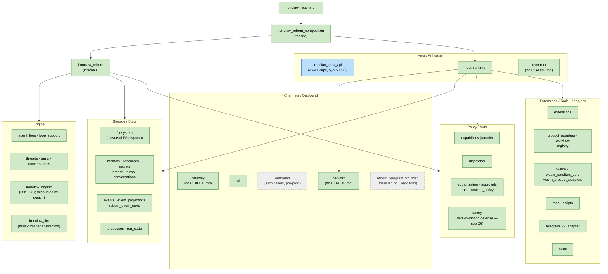
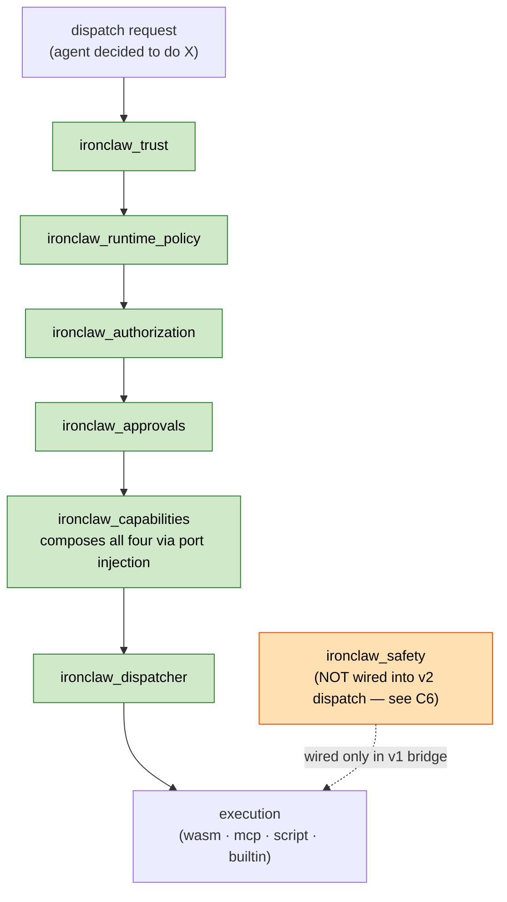
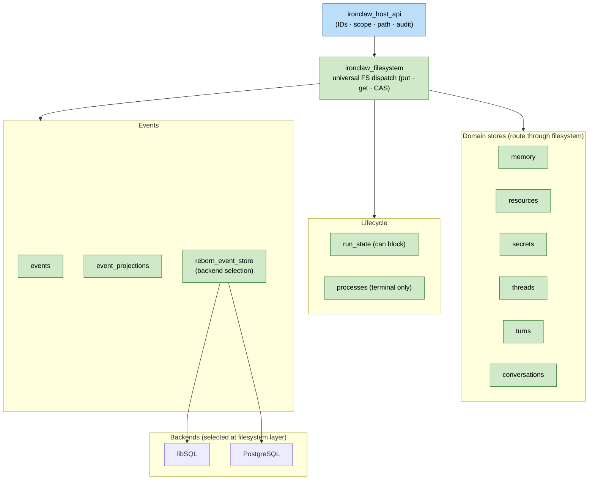
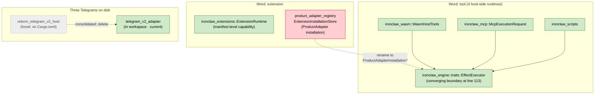
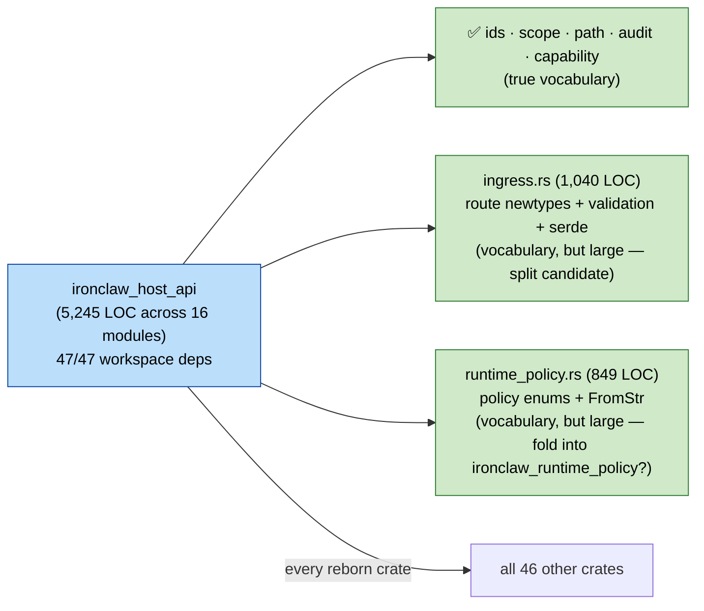

# Reborn Crate Boundary & Ownership Audit

**Date:** 2026-05-18
**Branch:** `reborn-integration`
**Scope:** the 47 `ironclaw_*` workspace crates and their internal boundaries. **Reborn-only — v1↔v2 migration drift between `src/` and `crates/` is out of scope for this audit** and belongs in a separate v1-sunset document.
**Purpose:** surface ambiguous ownership *between reborn crates* so the team can resolve it async, update each crate's CLAUDE.md/AGENTS.md, fix diagrams, and direct autonomous agents at clearly-scoped gaps.

Every "Proposed resolution" line is a starting position for team discussion, not a decided plan.

---

## TL;DR

- **One P0 finding** — the caller's `trust_decision` is silently dropped at the host-runtime layer (see **I2** below). Triage as a security ticket before anything else.
- **The architecture-test suite is more comprehensive than first credited.** 22 declared tests + 10 additional that this audit's first pass missed; many findings turn out to be already-enforced. The matrix below is corrected.
- **The biggest single coverage gap in earlier audit work is `ironclaw_llm`** (35,610 LOC, well-bounded reborn-canonical multi-provider abstraction) — it isn't named anywhere yet. Eight other reborn crates also lack a finding (turns, threads, conversations, product_workflow, resources, tui, telegram_v2_adapter, skills crate). None represent missing categories; each needs at least a one-paragraph scope entry.
- **Seven reborn crates are missing CLAUDE.md**: `ironclaw_common`, `ironclaw_reborn_config`, `ironclaw_reborn_cli`, `ironclaw_reborn_event_store`, `ironclaw_skills`, `ironclaw_safety`, `ironclaw_telegram_v2_adapter` (in addition to the previously named `ironclaw_gateway` and `ironclaw_network`).
- **The biggest documentation-drift bug in the workspace is not in any CLAUDE.md** — `crates/AGENTS.md` and `crates/README.md` both still list `ironclaw_storage` as an active crate. It was dissolved in `06090f4e6`. These are the first files a new contributor reads.
- **`ironclaw_outbound`** is fully specified with a comprehensive `CLAUDE.md` but has zero workspace consumers — pre-production scaffolding waiting on integration.
- **`crates/ironclaw_reborn_telegram_v2_host/`** is a fossil directory with no `Cargo.toml`, on disk since the consolidation in `af0ef699e`.
- **The `docs/reborn/contracts/` directory holds 37 boundary contracts** (filesystem, host-api, host-runtime, dispatcher, capabilities, approvals, events, memory, processes, resources, run-state, secrets, scripts, mcp, telegram-v2, turn-runner, turn-persistence, agent-loop-protocol, etc.) — none cited from earlier audit drafts. This audit cross-links to them where applicable; the team should treat them as the authoritative specs.

---

## Recommended order of work

The cheapest, most durable fixes first. Tests are permanent; CLAUDE.md text decays.

1. **Triage I2 as a security review item** — separate ticket, separate owner.
2. **Add the missing architecture tests.** Of the original 25 findings, 22 had no asserting test. The cheapest additions live in `crates/ironclaw_architecture/tests/`:
   - [ ] F1 (host_api LOC + dep-count census; agree a budget first — see F1)
   - [ ] D6 (`SessionThreadService` namespace collision check — see D5/D6)
   - [ ] D4 (Process/Run status type duplication)
   - [ ] G1 (`ironclaw_outbound` zero-callers reachability test)
   - [ ] H1 (no `impl RuntimeAdapter for *` allowed in `host_runtime` — covers WASM **and** MCP **and** Scripts; see H1)
3. **Fix `crates/AGENTS.md` + `crates/README.md`** — both still list dissolved `ironclaw_storage`. Highest-leverage docs fix because new contributors read these first.
4. **Convert the 3 deferred follow-ups from `24c7051d2` into tracked issues** — already scoped:
   1. `ironclaw_secrets` master-key decryptability check on `FilesystemSecretStore`.
   2. `ironclaw_authorization` `FilesystemCapabilityLeaseStore` move from `&'a ScopedFilesystem` to `Arc<ScopedFilesystem>`.
   3. `ironclaw_run_state` migration to unified filesystem dispatch.
5. **Add the 7 missing CLAUDE.md files.** Per-crate one-paragraph scope plus a forbidden-imports list pulled from `crates/ironclaw_architecture/tests/reborn_dependency_boundaries.rs`.
6. **Add scope-paragraph findings** for the 9 reborn crates absent from this audit (Theme J below). Each entry is one paragraph defining the crate's authority and its forbidden-direction boundary.
7. **Cross-link this audit to `docs/reborn/contracts/`** — the 37 specs already define many of the boundaries this audit re-discovered. Each finding should cite the matching contract.
8. **Status matrix** — single section in top-level `CLAUDE.md` or new `docs/CRATES.md` listing every `ironclaw_*` crate with one-line scope + maturity.

---

## Diagrams

Five diagrams (Diagram 2 from earlier drafts was 100% v1↔v2 and has been removed). Color legend:

| Style | Meaning |
| --- | --- |
| 🟩 Green solid | Canonical reborn crate |
| ⬜ Gray dashed | Orphan / fossil / zero workspace consumers |
| 🟦 Blue solid | Hub crate (every reborn crate depends on it) |
| 🟥 Red border | Boundary violation surfaced by audit |

### 1. Reborn workspace cluster map

### 2. Policy / auth decision pipeline

Logical decision order. The actual call order is composed via port injection in `CapabilityHost`; types are not unified by a shared trait but are sequenced by the composition root.

**Note on safety:** `ironclaw_safety` is imported by `host_runtime` (Cargo.toml) but its `wrap_for_llm` / `sanitize_tool_output` entry points are **not yet wired into the reborn capability dispatch path** — they currently only fire from the v1 bridge effect adapter. See finding **C6**.

### 3. Storage / state model

### 4. Extension / tool / adapter / channel concept map

### 5. `ironclaw_host_api` fan-in

Every reborn crate depends on `host_api`. Total 5,245 LOC across 16 modules. Contents are vocabulary (newtypes, enums, validation, serde) — but the size warrants a discussion.

---

## Priority 0 — Security ticket

### I2. Caller's `trust_decision` is destructured and dropped at host_runtime

`HostRuntimeLoopCapabilityPort::invoke_capability` (`crates/ironclaw_loop_support/src/capability_port.rs:817`) reads `provider_trust` and passes a `trust_decision` field into `RuntimeCapabilityRequest`. `DefaultHostRuntime::invoke_capability` (`crates/ironclaw_host_runtime/src/production.rs:248`) destructures it as `_caller_trust_decision` (the underscore = intentionally discarded) and re-evaluates trust locally via `self.evaluate_invocation_trust`.

The host being authoritative on trust is correct design. **But the public field is plumbed through the API and silently dropped at the consumer.** A future contributor wiring a custom `LoopCapabilityPort` could pass a carefully-constructed `trust_decision` and never see it applied — masking a downstream security regression.

**Proposed resolution.** Pick one:
1. Remove the `trust_decision` field from `RuntimeCapabilityRequest` entirely (preferred — fewer dead fields means fewer assumptions to maintain).
2. Rename to `_advisory_trust_decision` and add a `#[doc]` warning that the host re-evaluates and the field is for logging only.
3. Use the caller's decision when present and skip re-evaluation.

Cross-reference: `docs/reborn/contracts/trust-boundary-hardening.md`. Owner: host_runtime + security review.

---

## Architecture-test coverage matrix

`crates/ironclaw_architecture/tests/` contains **32 boundary tests** across two files (re-verified — the earlier figure of "22 tests" undercounted). Below is the corrected matrix of findings vs. tests.

| Finding | Status | Note |
|---|---|---|
| B1 substrate→`ironclaw_reborn` direct-import test | **ASSERTED** | `reborn_crate_dependency_boundaries_hold` (`reborn_dependency_boundaries.rs:71`) + `no_substrate_crate_depends_on_composition_root` (`reborn_composition_boundaries.rs:38`) cover both directions |
| B2 event-crate naming | NEITHER | Doc question, not enforcement |
| B3 RebornCompositionProfile re-export | NEITHER | See revised resolution — re-export from `reborn_config` would be circular |
| C1 capabilities DI pattern | n/a | Verified consistent (`ironclaw_dispatcher` is in `[dev-dependencies]`) |
| C2 policy composition order | NEITHER | No order-of-operations test |
| C3 lease ownership | NEITHER | Not asserted |
| C4 runtime_policy re-export asymmetry | NEITHER | Doc gap only |
| C5 capabilities optional-traits builder | NEITHER | Doc gap only |
| C6 safety not wired into v2 dispatch | NEITHER | New — see below |
| D4 ProcessStatus vs RunStatus | NEITHER | No unified-type test |
| D5/D6 `SessionThreadService` namespace collision | NEITHER | New — see below |
| E1 "extension" overload in `product_adapter_registry` | NEITHER | Mechanical rename |
| E3 fossil dirs | **ASSERTED** | `reborn_boundary_rules_active_crates_are_workspace_members` (`reborn_dependency_boundaries.rs:10`) — fixing this finding requires acting on the test's existing output, not adding a test |
| E4 three WASM crates split | **ASSERTED (7 tests)** | `reborn_dependency_boundaries.rs:621-857` |
| E5 `ironclaw_gateway` CLAUDE.md | NEITHER | Doc gap |
| F1 host_api LOC/dep census | NEITHER | No size-budget test |
| F2 host_api vs host_runtime | **ASSERTED** | `reborn_host_runtime_services_do_not_expose_lower_substrate_handles` (`reborn_dependency_boundaries.rs:172`) enforces full substrate-handle encapsulation |
| G1 outbound zero callers | NEITHER | No reachability test |
| H1 RuntimeAdapter in wrong crate | NEITHER | Test needs to forbid `impl RuntimeAdapter for *` in `host_runtime` for WASM, MCP, **and** Scripts |
| H2 capability double-lookup | NEITHER | Not asserted |
| H3 WasmHostTools wiring contract | NEITHER | Default deny works; production wiring undocumented |
| H4 dual event logs | NEITHER | Not asserted |
| H5 request-shape drift | NEITHER | No type-chain test |
| W1 `wit/channel.wit` orphan | NEITHER | No host-impl reachability check |
| W3 ProductAdapter http-egress stub | NEITHER | Documented as deferred in CLAUDE.md |

**10 bonus boundaries already asserted (not in the original 25 findings):**

- `reborn_boundary_rules_active_crates_are_workspace_members` — fossil-dir / unregistered-crate guard.
- `reborn_virtual_roots_match_storage_placement_contract` — 3-way parity between code, `storage-placement.md`, `filesystem.md`.
- `reborn_turns_public_surface_keeps_runner_api_explicit` — no `pub use runner::` re-exports.
- `reborn_loop_support_llm_wiring_stays_out_of_root_src` — LLM wiring confined to `ironclaw_reborn/model_gateway.rs`.
- `reborn_internal_crate_keeps_directory_of_modules_lib_rs` — `ironclaw_reborn/src/lib.rs` is directory-only.
- `reborn_turns_public_surface_uses_turn_ids_not_runtime_or_process_ids` — turn-layer ID-abstraction enforcement.
- `wasm_sandbox_core_is_standalone_v1_parity_kernel` — minimal WASI (no inherit_env/stdio/preopens/sockets).
- `wasm_product_adapter_wit_preserves_product_adapter_trust_boundary` — WIT types don't expose parsed envelopes.
- `wasm_product_adapter_wit_declares_egress_targets_as_paired_records` — egress targets are paired records.
- `reborn_runtime_http_egress_has_single_network_boundary` — single HTTP egress point.

---

## Findings by theme

### Theme B — Reborn-internal naming

#### B1. Inverse-direction test for `ironclaw_reborn` is already enforced

The 3 tests at `reborn_composition_boundaries.rs:38-105` plus `reborn_crate_dependency_boundaries_hold` together enforce both directions: nothing above the composition depends on it, AND substrate crates cannot import `ironclaw_reborn` directly without going through the facade. **No action required** — the original B1 was an audit error; tests already cover the case.

#### B2. Event-crate naming clarification

`ironclaw_events` (substrate), `ironclaw_event_projections` (read-model bridge), and `ironclaw_reborn_event_store` (backend selection) — three crates, only one prefixed `reborn_*`. Production wires only the reborn store; the names are accurate for design but unclear at a glance.

**Proposed resolution.** Add a 3-sentence canonical paragraph to all three CLAUDE.md files documenting the substrate / read-model / backend split. Cross-link `docs/reborn/contracts/events.md` and `docs/reborn/contracts/events-projections.md`. Do not rename.

#### B3. `RebornCompositionProfile` re-export needs a different resolution

`RebornCompositionProfile` (Disabled/LocalDev/Production/MigrationDryRun) lives in `ironclaw_reborn_composition::profile`. Earlier audit drafts proposed re-exporting it from `ironclaw_reborn_config` — but `reborn_config`'s boundary rule explicitly forbids depending on the composition crate (`reborn_dependency_boundaries.rs:1154`), so the re-export would create a circular dependency.

**Proposed resolution.** Either (a) move the enum into `ironclaw_reborn_config` (changes ownership from "composition profile" to "boot config" — minor design call), or (b) accept that callers needing only the enum must depend on the composition crate (status quo). Pick one.

### Theme C — Policy / auth concept layout

Six reborn crates (`safety`, `trust`, `authorization`, `capabilities`, `approvals`, `runtime_policy`, `dispatcher`) carry pieces of "what can run." The shared vocabulary is `ironclaw_host_api`. Composition order is sequenced in `CapabilityHost` via port injection.

#### C1. Document the port-injection DI pattern

`ironclaw_capabilities` composes `approvals + authorization + dispatcher + filesystem + events + resources` via port traits injected by the outer composition root. The concrete implementations only appear in `[dev-dependencies]` so tests can wire them. The pattern is healthy but the design intent isn't documented.

**Proposed resolution.** Add a "DI pattern" paragraph to `ironclaw_capabilities/CLAUDE.md`. Cross-reference: `docs/reborn/contracts/capabilities.md`.

#### C2. Document composition order

Three policy types (`EffectiveTrustClass`, `EffectiveRuntimePolicy`, `CapabilityLease`) live in `ironclaw_host_api`'s vocabulary. The composition order (trust → runtime policy → grant/lease) is encoded only in the caller's orchestration. A new policy layer could be added without authors knowing where it fits.

**Proposed resolution.** Add `crates/ironclaw_authorization/POLICY-COMPOSITION.md` documenting the order. Cross-link `docs/reborn/contracts/capability-access.md`.

#### C3. Formalize lease ownership

`CapabilityLease` is defined in `ironclaw_authorization/src/lib.rs:167-192`. `ironclaw_approvals::ApprovalResolver::approve_dispatch()` calls `leases.issue(...)`. If a new approval flavor wants a lease subtype, it's unclear which crate owns the definition.

**Proposed resolution.** Formalize in `ironclaw_authorization/CLAUDE.md`: all lease types are defined here; `ironclaw_approvals` depends on the `CapabilityLeaseStore` trait only, not on concrete lease construction. Cross-reference: `docs/reborn/contracts/approvals.md`.

#### C4. Note `runtime_policy` re-export asymmetry

`ironclaw_runtime_policy/src/lib.rs:44-47` re-exports only `EffectiveRuntimePolicy` (because it appears in the resolver's return type) while telling callers to import other vocab from `host_api`. The asymmetry is intentional but trips up new callers.

**Proposed resolution.** Add a banner comment at the top of `lib.rs` explaining the rule.

#### C5. Document `CapabilityHost` optional-traits builder pattern

`CapabilityHost` is composed via optional `with_*` builders (`ironclaw_capabilities/src/host.rs:73-130`). Traits fail soft when missing. The optional/required distinction isn't documented.

**Proposed resolution.** Add to `ironclaw_capabilities/CLAUDE.md`: traits passed via `with_*` builders are optional and must fail-soft when absent. Do not promote an optional trait to a required field without updating outer harnesses.

#### C6. `ironclaw_safety` is not wired into the v2 reborn dispatch pipeline (NEW)

`ironclaw_safety` is imported by `ironclaw_host_runtime/Cargo.toml:37` but its `wrap_for_llm` / `sanitize_tool_output` entry points are not invoked anywhere in the reborn capability dispatch chain (verified by grepping `ironclaw_loop_support`, `ironclaw_capabilities`, `ironclaw_dispatcher` for safety-layer imports — none). The only production callsite is `src/bridge/effect_adapter.rs:1582-1583` (v1 bridge).

Diagram 3 above shows the gap explicitly. This is either (a) an intentional decision to keep safety as v1-only and bake the prompt-injection / leak-detection responsibilities into a different reborn layer, or (b) a real wiring gap that means reborn dispatch currently has *no* prompt-injection or output-leak defense.

**Proposed resolution.** Decide. If (a), document the architectural rationale in `ironclaw_safety/CLAUDE.md` (which is missing — see Theme J) and remove the misleading "safety orthogonal" arrow in any earlier diagram. If (b), wire safety into `CapabilityHost::invoke_json` (post-tool-execution sanitization) and `ironclaw_loop_support` (pre-LLM context wrapping).

### Theme D — Storage / state crate layout

#### D4. `ProcessStatus` vs `RunStatus` semantic boundary

`ironclaw_processes::ProcessStatus` has 4 states (`Running/Completed/Failed/Killed`); `ironclaw_run_state::RunStatus` has 5 (`Running/BlockedApproval/BlockedAuth/Completed/Failed`). Both CLAUDE.md files document their scope but cross-references are missing.

**Proposed resolution.** Add a cross-reference paragraph to each CLAUDE.md: `run_state` owns invocation-wide lifecycle (can block on approval/auth); `processes` owns isolated capability process state (terminal-failure only). Composition fuses them via `(invocation_id, process_id)` tuples. Cross-link `docs/reborn/contracts/processes.md` and `docs/reborn/contracts/run-state.md`.

#### D5. `SessionThreadService` is two different traits with the same name (NEW)

Both `ironclaw_threads` and `ironclaw_conversations` define a public trait called `SessionThreadService` — **but they are not the same trait**:

- `ironclaw_threads::SessionThreadService` (`crates/ironclaw_threads/src/service.rs:16-95`) — 13 methods, full thread/transcript storage API (`ensure_thread`, `append_assistant_draft`, `load_context_window`, `redact_message`, etc.). Error type: `SessionThreadError`.
- `ironclaw_conversations::SessionThreadService` (`crates/ironclaw_conversations/src/traits.rs:33-64`) — 5 methods, inbound message turn submission only (`accept_inbound_message`, `replay_accepted_inbound_message`, `inbound_message_turn_submission`, `mark_inbound_message_turn_submitted`). Error type: `InboundTurnError`.

This is a namespace collision, not a re-export pattern. Importing `SessionThreadService` from either crate gives you a different contract.

**Proposed resolution.** Rename one. `conversations` should rename to something like `InboundConversationService` or `InboundTurnPort` — its scope is narrower and the new name is more accurate. Add an architecture test asserting unique trait names across the workspace.

#### D6. `ResourceManagedProcessStore::owned_reservations` lacks orphan cleanup (NEW)

`crates/ironclaw_processes/src/wrappers.rs:180` declares `owned_reservations: Mutex<HashMap<ProcessKey, ResourceReservationId>>`. Entries are inserted on `start()` (line 314) and removed on `complete()` (340), `fail()` (373), or `kill()` (405). If a process is orphaned (host crash, no terminal transition), the entry never expires.

**Proposed resolution.** Add a scope-cleanup hook that prunes `owned_reservations` entries whose `ProcessKey` no longer resolves in the `processes` table. Add a unit test simulating orphan accumulation.

### Theme E — Extension / tool / adapter

#### E1. Rename `Extension*` type names in `product_adapter_registry`

`ironclaw_product_adapter_registry` uses `Extension` in type names (`ExtensionInstallationStore`, `ExtensionActivationState`, `ExtensionCredentialBinding`) but the records describe *ProductAdapter installations*. The naming reads as a third meaning of "extension".

**Proposed resolution.** Rename to `ProductAdapterInstallationStore` / `ProductAdapterInstallationState` / `ProductAdapterCredentialBinding`. Impact: ~20 lines across tests + 1 projection path. Reserve "extension" for the manifest-level capability concept (`ironclaw_extensions::ExtensionRuntime`). Cross-reference: `docs/reborn/contracts/extensions.md`, `docs/reborn/contracts/product-adapters.md`.

#### E3. Delete the `reborn_telegram_v2_host` fossil directory

`crates/ironclaw_reborn_telegram_v2_host/` is on disk with only a `migrations/` subfolder and no `Cargo.toml`. The directory is not in `members` and not in `exclude`. Commit `af0ef699e` consolidated the host into the reborn binary but never deleted the directory. `reborn_boundary_rules_active_crates_are_workspace_members` already detects this class of fossil.

**Proposed resolution.** Delete the directory. Verify the test passes (it should already fire on this directory and be the reason it's been silent — investigate why if not).

#### E4. WASM crate split is asserted; add per-crate scope

Three WASM crates — `ironclaw_wasm` (tool runtime), `ironclaw_wasm_sandbox_core` (Wasmtime primitives), `ironclaw_wasm_product_adapters` (adapter host glue). The split is already enforced by 7 architecture tests at `reborn_dependency_boundaries.rs:621-857`. Per-crate CLAUDE.md files don't always make the split scope explicit.

**Proposed resolution.** Add one-paragraph "Scope" section to each of the three CLAUDE.md files restating the test-enforced boundary. Cross-reference: `docs/reborn/contracts/wasm.md`.

#### E5. Add `crates/ironclaw_gateway/CLAUDE.md`

`ironclaw_gateway` has only `AGENTS.md`. The crate owns frontend asset bundling + widget catalog — *not* a Channel implementation.

**Proposed resolution.** Add `CLAUDE.md` declaring scope. Optionally rename the crate to `ironclaw_frontend` to signal that it's UI assembly. (Renaming is a workspace-wide change; defer.)

### Theme F — `ironclaw_host_api` size

#### F1. `host_api` is 5,245 LOC depended on by every workspace crate

All 47 crates depend on `ironclaw_host_api`. The contents are vocabulary — newtypes, enums, validation helpers, serde — but two modules dominate the total: `ingress.rs` (1,040 LOC) and `runtime_policy.rs` (849 LOC). The size is not "concrete behavior creeping in"; it's vocabulary that *could* live elsewhere.

**Proposed resolution.** Decide whether the size is acceptable. If splitting:
- `ingress.rs` could move to a new `ironclaw_http_dispatch` crate (HTTP-shaped vocabulary).
- `runtime_policy.rs` could fold into `ironclaw_runtime_policy`.

Add an architecture test asserting `ironclaw_host_api` stays under a chosen LOC budget so the question doesn't recur silently. Cross-reference: `docs/reborn/contracts/host-api.md`.

#### F2. `host_api` vs `host_runtime` is asserted; document the split

`reborn_host_runtime_services_do_not_expose_lower_substrate_handles` (`reborn_dependency_boundaries.rs:172`) already enforces the boundary. The names just aren't intuitive.

**Proposed resolution.** Add a "Host Layer" section to top-level `CLAUDE.md` (10-line edit) explaining the split: `host_api` = shared constraint vocabulary; `host_runtime` = service composition. Do not rename.

### Theme G — Orphans

#### G1. `ironclaw_outbound` has a comprehensive CLAUDE.md but zero workspace consumers

The crate defines `OutboundPolicyService`, `ReplyTargetBindingValidator`, and migration plumbing. Workspace-wide grep finds zero callsites. The CLAUDE.md is detailed; the integration isn't done.

**Proposed resolution.** File a tracking issue for integration into the reborn composition / turn scheduler. Until integration lands, mark the crate's `lib.rs` with `#![doc(hidden)]` and a banner referencing the issue. Add a reachability architecture test.

### Theme H — Hidden boundaries inside the dispatch pipeline

Tracing a single capability invocation from `agent_loop` through to runtime execution surfaces six boundaries that per-cluster passes can't see. **I2 is in the P0 section above.**

#### H1. WASM, MCP, and Scripts `RuntimeAdapter` impls all live in `ironclaw_host_runtime`, not their owning crates

`dispatcher/src/lib.rs:84` defines the `RuntimeAdapter<F, G>` trait. By name and concern, the implementations belong in their respective runtime crates. Actually located:

- `WasmRuntimeAdapter` — `host_runtime/src/services.rs:2040` (~140 LOC of runtime-lane glue).
- `ScriptRuntimeAdapter` — `host_runtime/src/services.rs:1824` (~90 LOC).
- `McpRuntimeAdapter` — `host_runtime/src/services.rs:1874` (~48 LOC).

Earlier audit drafts named only WASM; the pattern is identical for all three.

**Proposed resolution.** Move each adapter into its owning runtime crate (`ironclaw_wasm`, `ironclaw_scripts`, `ironclaw_mcp`). Do *not* create a new `ironclaw_wasm_runtime_adapter` crate — that would worsen the WASM crate split (E4). Add an architecture test forbidding `impl RuntimeAdapter for *` in `host_runtime`. Cross-reference: `docs/reborn/contracts/dispatcher.md`.

#### H2. Capability lookup happens twice

`CapabilityHost::invoke_json` (`crates/ironclaw_capabilities/src/host.rs:171`) calls `self.registry.get_capability`. `RuntimeDispatcher::dispatch_json` (`crates/ironclaw_dispatcher/src/lib.rs:185`) then calls the same `ExtensionRegistry` again. Two reads of the same registry — if it's not snapshot-consistent, descriptors could differ.

**Proposed resolution.** Pass the descriptor down from `CapabilityHost` to the dispatcher (avoid the second read), or document that the registry must be snapshot-consistent and assert it.

#### H3. WIT `tool-invoke` re-enters the host outside CapabilityHost

`crates/ironclaw_wasm/src/host.rs:483` defines `WasmHostTools::invoke`, a WIT host import letting a guest WASM tool call another tool by alias. The default `DenyWasmHostTools` returns deny (`host.rs:491`). The production wiring contract — if anyone implements `WasmHostTools` to actually permit invocation — is undocumented.

**Proposed resolution.** Document in `crates/ironclaw_wasm/CLAUDE.md`: any production `WasmHostTools` implementation must route through `CapabilityHost::invoke_json` so the gating pipeline applies. Add an architecture test asserting the default-deny stays the only impl in production wiring until the contract is documented.

#### H4. Two parallel event logs

`crates/ironclaw_reborn/src/milestone_events.rs:207-215` suppresses `CapabilityInvoked`, `CapabilityBatchStarted`, `CapabilityBatchCompleted` (returns `Ok(None)`). The dispatcher emits `RuntimeEvent::dispatch_requested/selected/succeeded` to a separate `EventSink` composed at `host_runtime/src/services.rs:1599-1601`. Same logical event, two recording mechanisms.

**Proposed resolution.** Decide: either route dispatcher events through the milestone sink (single durable log), or document that dispatcher events are runtime-internal and milestone events are user-facing. Cross-link `event_projections/CLAUDE.md` and `docs/reborn/contracts/events.md`.

#### H5. Request-shape drift through six struct types

A single "invoke this capability" intent mutates through six distinct struct types: `RuntimeCapabilityRequest` → `CapabilityInvocationRequest` → `CapabilityDispatchRequest` → `RuntimeAdapterRequest<'a, F, G>` → `WitToolRequest { params_json, context_json }` → WIT-generated `bindings::Request`. Fields silently drop at boundaries: `invocation_id` is gone by layer 6; `idempotency_key` is advisory-only and not propagated; `context.trust` is overwritten (see I2).

**Proposed resolution.** Document the pipeline in a new `docs/reborn/contracts/dispatch-pipeline.md`. For each field, declare whether it's mandatory, derived, or droppable. Add an architecture test asserting the type-chain matches the contract.

### Theme W — WIT contracts

#### W1. `wit/channel.wit` has no host implementation in the reborn workspace

`wit/channel.wit:1-430` declares the `near:agent@0.3.0` `sandboxed-channel` world. Grep finds zero production wiring on the host side of the reborn workspace — only test fixtures. (Legacy `channels-src/*` consumers are out of scope for this audit.) The contract is either pre-implementation or post-deprecation depending on team direction.

**Proposed resolution.** Decide: build `ironclaw_wasm_channels` host runtime, or formally deprecate the WIT. Either way, document the decision in a `wit/STATUS.md` or in `crates/ironclaw_wasm_product_adapters/CLAUDE.md`.

#### W3. ProductAdapter `http-egress` is a documented stub

`product_adapter.wit:64-115` declares `http-egress` as an import; `ironclaw_wasm_product_adapters/src/store.rs:101-112` returns `EgressErrorKind::PolicyDenied` with message "host http egress is not wired for ProductAdapter components yet."

**Proposed resolution.** Track host-runtime egress wiring as a blocking dependency for any ProductAdapter production rollout. Add an architecture test asserting `http_egress` cannot be invoked without an explicit wiring hook in place.

(Earlier audit drafts also included **W2 — "tool WIT version not pinned"**. Retracted: `WIT_TOOL_VERSION = "0.3.0"` exists at `crates/ironclaw_wasm/src/config.rs:4`. The constant matches the WIT package declaration. No action required.)

### Theme J — Reborn crates absent from this audit (NEW)

Nine reborn crates appear in workspace members but had no boundary finding. None represent missing architectural categories, but each needs at least a one-paragraph scope entry so autonomous agents have direction. Adding these is part of "Recommended order of work" #6.

| Crate | Recommended scope statement |
|---|---|
| `ironclaw_llm` (35,610 LOC) | "Owns canonical multi-provider LLM abstraction (NEAR AI, OpenAI, Anthropic, GitHub Copilot, Bedrock, etc.) with retry/failover/circuit-breaker/cache composition. Intentionally decoupled from secrets/db storage via host trait adapters (`SessionDb`, `SessionSecrets`, `SessionRenewer`, `SessionKeyPersistor`). Does not own LLM model governance or token accounting." |
| `ironclaw_skills` (crate) | "Owns SKILL.md parsing, skill manifest contracts, and credential/gating validation. In v2, skill selection happens in the orchestrator; the crate is the parser/library layer. Does not own skill storage or manifest authoring." |
| `ironclaw_turns` | "Owns host-facing turn coordination contracts and turn lifecycle boundaries. Does not own thread lifecycle, message storage, or capability policy. Routes product turns into Reborn turn coordinator via stable port." |
| `ironclaw_threads` | "Owns reborn-era thread/message persistence and context-window API. Does not own turn lifecycle or message storage policy. Keeps turn/run references supplied by `TurnCoordinator`." |
| `ironclaw_conversations` | "Owns conversation↔thread binding contracts and inbound-message turn submission. Does not own thread state or message lifecycle. See D5 above re: namespace collision with `ironclaw_threads`." |
| `ironclaw_product_workflow` | "Sits between product adapters and host services. Owns inbound turn service, conversation binding, idempotency, busy/deferred, gate routing. Does not own dispatcher/runtime/engine concerns." |
| `ironclaw_resources` | "Enforces resource budgets before quota-limited work executes. Owns reservation→reconciliation→release lifecycle and scope cascade. Does not own policy decisions about *when* reservations are allowed." |
| `ironclaw_tui` | "Modular Ratatui TUI with widget system, layout engine, theme, event loop. Intentionally decoupled from main binary; channel bridge lives in `src/channels/tui.rs`." |
| `ironclaw_telegram_v2_adapter` | "Maps Telegram platform traffic into Reborn inbound-turn and product-adapter contracts. Does not own Telegram secret storage (delegates to `ironclaw_secrets`) or channel lifecycle (delegates to `ironclaw_extensions`)." |

Add each to its crate's CLAUDE.md once that file exists (some are in the missing-CLAUDE.md list below).

---

## End-to-end trace — capability invocation

For context on Theme H, the 8-layer trace through the reborn engine.

| # | Crate | Function | Type crossing out |
|---|---|---|---|
| 1 | `ironclaw_agent_loop` | `executor::DefaultExecutor::execute_capability_batch` (`executor.rs:665`) | `CapabilityBatchInvocation` |
| 2 | `ironclaw_turns::run_profile::host` | `LoopCapabilityPort::invoke_capability_batch` (`host.rs:1479`) | + `VisibleCapabilitySurface` precondition |
| 3 | `ironclaw_loop_support` | `HostRuntimeLoopCapabilityPort::invoke_capability` (`capability_port.rs:804`) | `RuntimeCapabilityRequest` |
| 4 | `ironclaw_host_runtime` | `DefaultHostRuntime::invoke_capability` (`production.rs:238`) | `CapabilityInvocationRequest` (drops trust — I2) |
| 5 | `ironclaw_capabilities` | `CapabilityHost::invoke_json` (`host.rs:135`) | `CapabilityDispatchRequest` (drops `context`, `trust_decision`, `invocation_id`) |
| 6 | `ironclaw_dispatcher` | `RuntimeDispatcher::dispatch_json` (`lib.rs:173`) | `RuntimeAdapterRequest<'a, F, G>` |
| 7 | `ironclaw_host_runtime::WasmRuntimeAdapter` | `RuntimeAdapter::dispatch_json` (`services.rs:2121`) | `WitToolRequest { params_json, context_json }` |
| 8 | `ironclaw_wasm` | `WitToolRuntime::execute` (`runtime.rs:58`) | `bindings::exports::near::agent::tool::Request` |

Cross-reference: `docs/reborn/contracts/dispatcher.md`, `docs/reborn/contracts/wasm.md`.

---

## Missing CLAUDE.md files (definitive list)

Seven reborn crates lack a CLAUDE.md (only have AGENTS.md):

- `crates/ironclaw_common/`
- `crates/ironclaw_reborn_config/`
- `crates/ironclaw_reborn_cli/`
- `crates/ironclaw_reborn_event_store/`
- `crates/ironclaw_skills/`
- `crates/ironclaw_safety/`
- `crates/ironclaw_telegram_v2_adapter/`

Plus the two already named in E5 and elsewhere: `crates/ironclaw_gateway/`, `crates/ironclaw_network/`.

Each needs one paragraph of scope + a forbidden-imports list pulled from `reborn_dependency_boundaries.rs`.

---

## Cross-references to existing reborn docs

This audit cites `docs/reborn/contracts/` specs inline where applicable. The full directory contains 37 boundary contracts; the most relevant to this audit's findings:

- `agent-loop-protocol.md` — Theme H trace
- `approvals.md` — C3
- `capabilities.md` — C1, C2, C5
- `capability-access.md` — C2
- `dispatcher.md` — A2, H1, H2
- `events.md`, `events-projections.md` — B2, H4
- `extensions.md` — E1
- `filesystem.md` — D1, D4
- `host-api.md`, `host-runtime.md` — F1, F2
- `memory.md`, `memory-profiles.md` — Theme D
- `processes.md`, `run-state.md` — D4, D6
- `product-adapters.md` — E1
- `resources.md` — D6
- `runtime-profiles.md`, `runtime-selection.md` — Theme H
- `secrets.md` — `24c7051d2` follow-up
- `trust-boundary-hardening.md` — I2
- `turn-runner.md`, `turn-persistence.md`, `turns-agent-loop.md` — Theme J entries for turns/threads/conversations
- `wasm.md` — E4, H1, H3

Also relevant: `docs/plans/2026-03-20-engine-v2-architecture.md`, `docs/plans/2026-03-22-crate-extraction-and-cleanup.md`, `docs/plans/2026-05-14-universal-fs-dispatch.md`.

---

## TODOs already in code referencing architectural intent

- `crates/ironclaw_reborn_composition/src/lib.rs` — `TODO(#3571)`
- `crates/ironclaw_host_runtime/src/memory_context.rs` — `TODO(reborn/#3333)`
- `crates/ironclaw_secrets/src/filesystem_store.rs` — `TODO(reborn/fs-secrets)` (blocks the `24c7051d2` secrets follow-up)

---

## How to engage

- Comment on the companion PR inline next to a finding you want to dispute or add context to.
- Tick the checkbox on the tracking issue when a finding has been landed or formally deferred.
- The themes are mostly independent; resolve in parallel.
- All "Proposed resolution" lines are starting positions for team discussion, not decisions.
