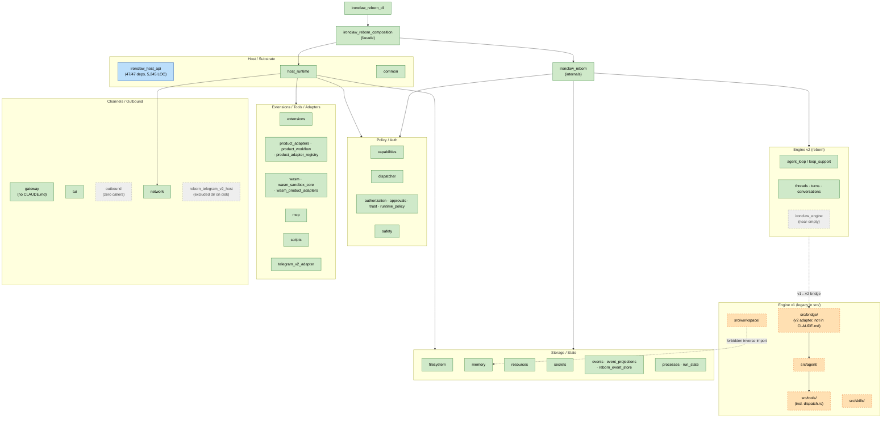
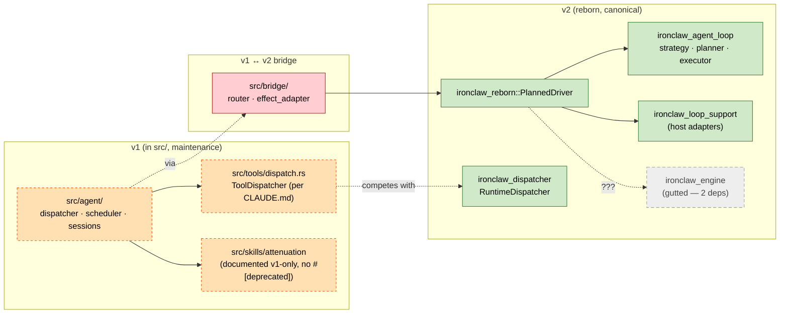
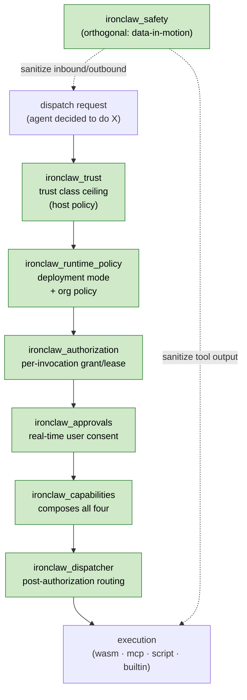
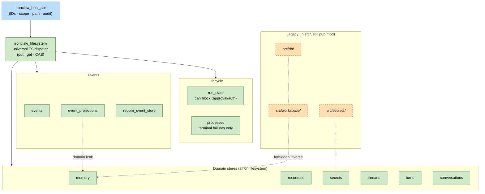
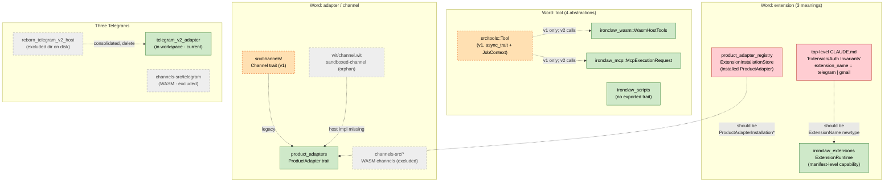
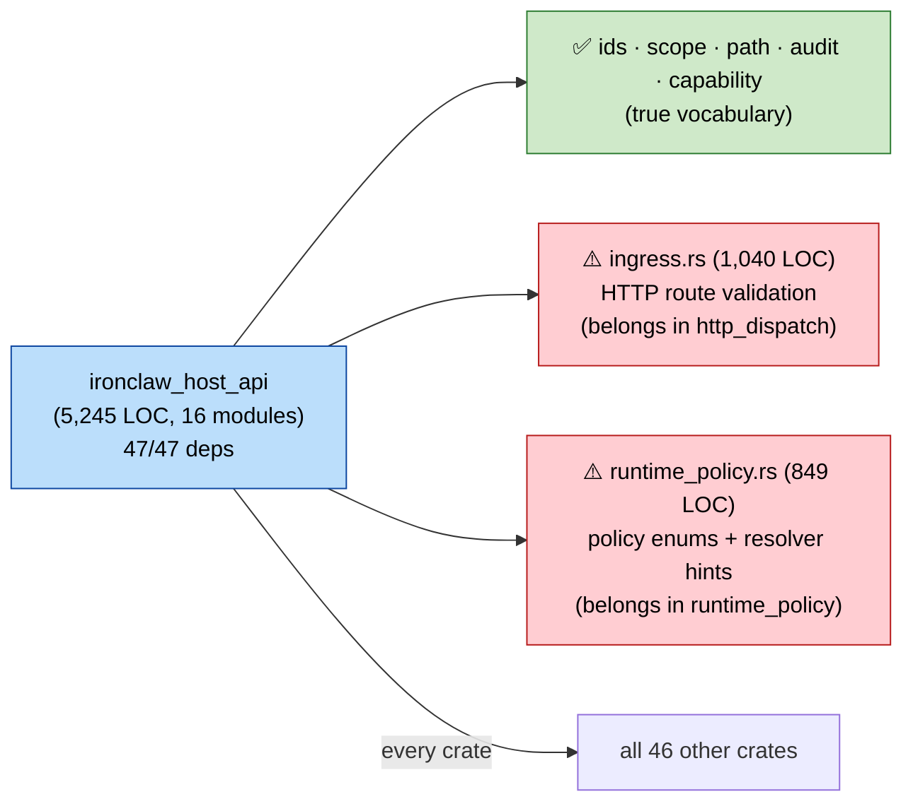

# Crate Boundary & Ownership Audit — reborn-integration

**Date:** 2026-05-18
**Branch:** `reborn-integration` (~690 commits ahead of `main`)
**Scope:** all 47 workspace crates + the legacy `src/` tree
**Method:** six parallel research passes (loop/orchestration, security/policy, extensions/tools, storage/state, src↔crates legacy, channels/host), one synthesis pass, deduplication into 8 themes
**Purpose:** surface ambiguous ownership so the team can resolve it async and update CLAUDE.md / AGENTS.md files, then send autonomous agents to fix the gaps with clear directions.

This audit is intentionally findings + proposed resolution. Each "Proposed resolution" is a *starting position* for team discussion, not a decided plan.

---

## TL;DR

- The reborn migration is roughly half-done. Many `src/<x>/` modules (`src/agent/`, `src/tools/`, `src/workspace/`, `src/skills/`) coexist with their reborn replacements, with no documented v1/v2 status matrix.
- Several concepts have **3–4 parallel names** across crates with no shared trait: "extension" vs "product_adapter" vs "channel" vs "tool"; "authorization" vs "trust" vs "capabilities" vs "approvals" vs "runtime_policy"; "memory" vs "workspace" vs "resources" vs "run_state".
- `ironclaw_host_api` is depended on by every workspace crate (47/47) and is starting to grow concrete behavior (1,040-line `ingress.rs`, 849-line `runtime_policy.rs`) — risk of god-crate.
- At least one crate is **orphaned with zero callers** (`ironclaw_outbound`) and one directory is on disk but excluded from the workspace (`crates/ironclaw_reborn_telegram_v2_host/`).
- Several crates breach their own declared guardrails (`src/workspace/reborn_identity_context.rs` imports from `ironclaw_memory` despite `ironclaw_memory/CLAUDE.md` forbidding the inverse).

8 themes, 25 individual findings, each with file-level evidence and a proposed resolution below. A **Deep Pass** appendix at the end adds architecture-test coverage data, documented-vs-delivered contradictions, an end-to-end trace, WIT contract drift, and git-history rationale.

---

## Diagrams

Color legend (used in every diagram):

| Style | Meaning |
| --- | --- |
| 🟩 Green solid | Canonical / current reborn-era owner |
| 🟧 Orange dashed | Legacy v1 (still in tree, partially active) |
| 🟨 Yellow dashed | Shim (re-export only, no logic) |
| ⬜ Gray dashed | Orphan / excluded / zero callers |
| 🟦 Blue solid | Hub crate (every crate depends on it) |

### 1. Workspace cluster map (high level)

The 47-crate workspace grouped by responsibility. Only the most representative crate per cluster is named; cross-cluster arrows show major composition lines.

### 2. Engine v1 ↔ v2 layering (Theme A)

What runs the agent loop today, and who owns which decision. The bridge layer is the v1↔v2 seam — and is **invisible** in the top-level `CLAUDE.md` (finding A5).

### 3. Policy / auth decision pipeline (Theme C)

The order policies fire in, and which crate owns each step. There is **no shared trait** spanning these — finding C2.

### 4. Storage / state model (Theme D)

The `filesystem` crate is the universal substrate as of the May 18 "universal FS dispatch" landing (`f95288c16`). `src/workspace/` and `src/db/` are still `pub mod` despite being slated for dissolution.

Red arrows are **boundary violations**: `src/workspace/reborn_identity_context.rs` imports `ironclaw_memory` types despite `ironclaw_memory/CLAUDE.md` forbidding the inverse; `ironclaw_event_projections` imports `MemorySignificantEventSink` / `PromptWriteSafetyEventSink` despite projections being declared backend-independent.

### 5. Extension / tool / adapter / channel concept map (Theme E)

Four names, several crates, three Telegram impls. Boxes show where each name is *defined*; arrows show "is sometimes used to mean."

### 6. `ironclaw_host_api` fan-in (Theme F)

Visualizing why this crate is the highest-leverage cleanup target: **every** workspace crate depends on it, and it has started growing concrete behavior (1,040-line `ingress.rs`, 849-line `runtime_policy.rs`) on top of the shared vocabulary.

---

## Theme A — Engine v1 ↔ v2 migration is mid-flight and undocumented

The most pervasive theme. Reborn is the v2 engine. `src/agent/`, `src/tools/dispatch.rs`, `src/skills/`, `src/bridge/` and several other modules are v1 — but nothing tells a new contributor (or an autonomous agent) which surface to extend.

### A1. Agent loop ownership: `src/agent/` vs `ironclaw_agent_loop` vs `ironclaw_engine` vs `ironclaw_reborn`

**Ambiguity.** Four crates / modules touch "the agent loop":
- `src/agent/` (~31 KB) is the fully implemented v1 agent (dispatcher, scheduler, session management).
- `ironclaw_engine` was the central crate on `main` but now declares only `ironclaw_common` + `ironclaw_skills` as deps — gutted.
- `ironclaw_agent_loop` owns framework state, strategies, planner, executor (~150 KB).
- `ironclaw_reborn::PlannedDriver` is the adapter that wires agent_loop into the runtime.

A contributor adding "fallback when a tool times out" has four plausible homes.

**Evidence.**
- `src/agent/mod.rs:1-16` — v1 "Core agent logic"
- `crates/ironclaw_engine/Cargo.toml:6` — claims "unified thread-capability-CodeAct execution engine" but dep set is empty
- `crates/ironclaw_agent_loop/Cargo.toml:6` — "framework state and strategy contracts"
- `crates/ironclaw_reborn/src/lib.rs:1-35` — assembly of agent_loop + drivers

**Proposed resolution.**
- Add a "v1 vs v2 engine status" section to project-level `CLAUDE.md` (after the Architecture section) declaring `src/agent/` as v1-maintenance-mode and `ironclaw_reborn` + `ironclaw_agent_loop` as v2-canonical.
- In each crate's `CLAUDE.md` state the layer: `ironclaw_engine` = execution mechanics (or delete if fully gutted), `ironclaw_agent_loop` = orchestration strategy, `ironclaw_reborn` = adapter. Engine and agent_loop must not import each other; only `ironclaw_reborn` (or its composition) imports both.
- Suggested owner: agent/loop team.

### A2. Tool dispatcher: `src/tools/dispatch.rs` vs `ironclaw_dispatcher`

**Ambiguity.** Project-level `CLAUDE.md` ("Everything Goes Through Tools", lines 212–230) declares `src/tools/dispatch.rs::ToolDispatcher::dispatch()` as the canonical entry point. A new `ironclaw_dispatcher` crate exists with its own `RuntimeDispatcher` / `CapabilityDispatcher` trait. They are not cross-referenced.

**Evidence.**
- `src/tools/dispatch.rs:1-50`
- `crates/ironclaw_dispatcher/src/lib.rs:1-6` and `crates/ironclaw_dispatcher/CLAUDE.md:1-2` ("Own already-authorized runtime routing only")
- Zero `ironclaw_dispatcher` imports anywhere in `src/`

**Proposed resolution.**
- Declare in `CLAUDE.md`: `src/tools/dispatch.rs` is v1; `ironclaw_dispatcher` (post-authorization) is v2. New code routes via `ironclaw_capabilities::CapabilityHost` → `ironclaw_dispatcher`.
- File a tracking issue to remove `src/tools/dispatch.rs` once v1 is retired.
- Suggested owner: dispatch/capabilities team.

### A3. Tool trait fragmentation — four parallel "Tool" abstractions

**Ambiguity.** No shared trait spans the four runtimes:
- `src/tools::Tool` (legacy, async_trait, `JobContext`)
- `WasmHostTools` in `ironclaw_wasm` (host-import seam only)
- `McpExecutionRequest` in `ironclaw_mcp` (request-shaped, no trait)
- script backend in `ironclaw_scripts` (not exported as a trait)

**Evidence.**
- `src/tools/tool.rs:1-100`
- `crates/ironclaw_wasm/src/host.rs`
- `crates/ironclaw_mcp/src/lib.rs:50-97`
- `crates/ironclaw_scripts/Cargo.toml`

**Proposed resolution.**
- Extract a shared `CapabilityExecutionRequest` in `ironclaw_host_api` (or a new `ironclaw_capability_execution` crate). Have wasm/mcp/scripts implement the same interface.
- Mark `src/tools::Tool` as v1-only.
- Suggested owner: tools/runtime team.

### A4. Skills shim contains v1-only deprecated submodules with no `#[deprecated]`

**Ambiguity.** `src/skills/mod.rs:13-26` documents that `attenuation` and `bundled` are v1-only and "can be deleted" once v1 is gone — but no `#[deprecated]` attribute, and `src/agent/dispatcher.rs` still calls `attenuate_tools()` unconditionally.

**Evidence.** `src/skills/mod.rs:13-26`, `src/agent/dispatcher.rs` (callsite of `attenuate_tools`).

**Proposed resolution.**
- Add module-level `#![deprecated(since = "v1-end-of-life", note = "...")]` and `#[allow(deprecated)]` at the v1 callsites with a link to a v1-sunset tracking issue.
- Suggested owner: skills team.

### A5. `src/bridge/` is invisible in project-level `CLAUDE.md`

**Ambiguity.** `src/bridge/` is the v2 engine→host adapter (auth, effects, LLM, store) with its own `CLAUDE.md`, but the project-level `CLAUDE.md` Project Structure section never mentions it. New contributors will wire engine output directly into handlers instead of through `src/bridge/router.rs`.

**Evidence.**
- `src/bridge/CLAUDE.md` exists (20 lines, declares the adapter contract)
- Top-level `CLAUDE.md:83-217` Project Structure does not list `src/bridge/`

**Proposed resolution.**
- Add a `src/bridge/` row to the Project Structure table in top-level `CLAUDE.md`.
- Add to Module Specs table.
- Suggested owner: whoever owns bridge.

---

## Theme B — Reborn-vs-non-reborn naming is inconsistent

### B1. Two composition crates: `ironclaw_reborn` vs `ironclaw_reborn_composition`

**Ambiguity.** Both crates own reborn assembly:
- `ironclaw_reborn` (`src/lib.rs` ≈ 35 lines, mostly `pub mod`) — low-level drivers and adapters
- `ironclaw_reborn_composition` (`src/lib.rs` ≈ 726 lines, full runtime build) — facade

A caller unsure whether to depend on `reborn` (drivers) or `reborn_composition` (full runtime) will find both plausible.

**Evidence.**
- `crates/ironclaw_reborn/Cargo.toml:6` — "Standalone Reborn composition and adapters"
- `crates/ironclaw_reborn_composition/Cargo.toml:6` — "Facade-shaped production composition root"
- `crates/ironclaw_architecture/tests/reborn_dependency_boundaries.rs` enforces some part of this already

**Proposed resolution.**
- Rename `ironclaw_reborn` → `ironclaw_reborn_internals` OR add a top-of-file note in `ironclaw_reborn/CLAUDE.md`: "Internal. Only `ironclaw_reborn_composition` is a sanctioned public dependency."
- Extend the architecture test to log a clear error for boundary violations.
- Suggested owner: reborn team.

### B2. Three event crates, two without the reborn prefix

**Ambiguity.** `ironclaw_events`, `ironclaw_event_projections`, `ironclaw_reborn_event_store` — the "reborn" prefix appears on only one, but production only wires the reborn store. Either the first two should be renamed or documented as reborn-only.

**Evidence.**
- `crates/ironclaw_events/src/lib.rs:1-8`
- `crates/ironclaw_event_projections/src/lib.rs:1-6` (mentions reborn in docstring; name doesn't)
- `crates/ironclaw_reborn_event_store/src/lib.rs:1-8`

**Proposed resolution.**
- Rename `ironclaw_events` and `ironclaw_event_projections` to `ironclaw_reborn_events*` to match the reborn-only-in-production reality, OR add explicit CLAUDE.md notes forbidding non-reborn dependencies.
- Suggested owner: events team.

### B3. `RebornCompositionProfile` lives in the composition crate, but is a config concern

**Ambiguity.** `RebornCompositionProfile` (Disabled/LocalDev/Production/MigrationDryRun) is defined in `ironclaw_reborn_composition::profile`. Outer harnesses or v1 AppBuilder that want to pick a profile must depend on the composition crate just for an enum.

**Evidence.**
- `crates/ironclaw_reborn_composition/src/profile.rs`
- `crates/ironclaw_reborn_composition/src/factory.rs:60-66`

**Proposed resolution.**
- Move `RebornCompositionProfile` to `ironclaw_reborn_config` (which already owns runtime identity + poll settings). Composition imports it; outer harnesses can depend on config alone.
- Suggested owner: reborn team.

---

## Theme C — Policy / auth concept overload (`safety`/`trust`/`authorization`/`capabilities`/`approvals`/`runtime_policy`)

Six crates carry a piece of "what is this thing allowed to do." No shared trait spans them; new policies risk reinventing the wheel.

### C1. ~~`ironclaw_capabilities` has Cargo dependency on `ironclaw_dispatcher` that its own CLAUDE.md forbids~~ — **CORRECTED on deep pass**

**Correction.** Verified `crates/ironclaw_capabilities/Cargo.toml`: `ironclaw_dispatcher` is in `[dev-dependencies]`, **not** `[dependencies]`. The CLAUDE.md guardrail ("use the neutral `CapabilityDispatcher` port; do not add a normal dependency on concrete `ironclaw_dispatcher`") is honored. Original first-pass claim was wrong — apologies.

**What's actually interesting here:** Capabilities composes approvals + dispatcher + filesystem + events + resources via **port traits injected by the outer composition root**; the concrete impls only appear in dev-deps so tests can wire them. That's a healthy DI pattern worth calling out in `ironclaw_capabilities/CLAUDE.md` explicitly as a model for other "kitchen-sink" facade crates.

**Proposed resolution.**
- Update `ironclaw_capabilities/CLAUDE.md` with a one-paragraph "DI pattern" note so the design intent is documented (the port-based composition is the design pattern, not an accidental dev-deps split).
- No code change.
- Suggested owner: capabilities team.

### C2. Three policy concepts with no shared interface — `authorization` vs `trust` vs `runtime_policy`

**Ambiguity.** Each crate has its own policy type (`CapabilityLease`, `EffectiveTrustClass`, `EffectiveRuntimePolicy`). Composition order matters (trust → runtime policy → grant/lease), but is not encoded in a trait. New policy layers can drift.

**Evidence.**
- `crates/ironclaw_trust/src/lib.rs:44-50`
- `crates/ironclaw_authorization/src/lib.rs:37-57`
- `crates/ironclaw_runtime_policy/src/lib.rs:1-47`

**Proposed resolution.**
- Add `crates/ironclaw_authorization/POLICY-COMPOSITION.md` documenting the ordering invariant and providing example flows.
- Consider a marker trait `trait PolicyResult: Send + Sync` as a hint that a new policy is "another in the chain".
- Suggested owner: security/policy team.

### C3. Lease type ownership crosses two crates ambiguously

**Ambiguity.** `CapabilityLease` is defined in `ironclaw_authorization` but issued by `ironclaw_approvals::ApprovalResolver::approve_dispatch()`. If a new approval flavor wants its own lease subtype, it's unclear which crate owns the definition.

**Evidence.**
- `crates/ironclaw_authorization/src/lib.rs:167-192` defines the lease
- `crates/ironclaw_approvals/src/lib.rs:6-7, 45-58` imports the store and calls `leases.issue(...)`

**Proposed resolution.**
- Formalize in `ironclaw_authorization/CLAUDE.md`: all lease types live in authorization; approvals may only extend the *store* trait.
- Suggested owner: authorization team.

### C4. `ironclaw_safety` scope is vague (4 concerns in one crate)

**Ambiguity.** Per `Cargo.toml:6`, `ironclaw_safety` covers prompt injection + input validation + secret-leak detection + safety policy enforcement. "Data exfiltration policy" or similar future features could plausibly belong here or in authorization/trust.

**Evidence.** `crates/ironclaw_safety/Cargo.toml:6`, `crates/ironclaw_safety/src/lib.rs:10-24`.

**Proposed resolution.**
- Document in `ironclaw_safety/CLAUDE.md` that scope is **data-in-motion defense** (inbound payloads, tool outputs); capability/grant/trust policy lives elsewhere.
- Optional: rename to `ironclaw_intake_safety` to signal scope.
- Suggested owner: safety team.

### C5. `ironclaw_runtime_policy` re-exports asymmetrically

**Ambiguity.** The crate re-exports `EffectiveRuntimePolicy` from `ironclaw_host_api` (because it's in the resolver's return type) but tells callers to import other vocab directly from `host_api`. A caller hits `ironclaw_runtime_policy::RuntimePolicy` (doesn't exist) before learning the rule.

**Evidence.** `crates/ironclaw_runtime_policy/src/lib.rs:40-47`.

**Proposed resolution.**
- Either re-export the full `ironclaw_host_api::runtime_policy::*` namespace, or add a `Note:` block at the top of `lib.rs` explaining the asymmetry.
- Suggested owner: runtime_policy team.

---

## Theme D — Storage / state crate overlap

### D1. `src/workspace/` vs `ironclaw_memory` boundary breached by a direct import

**Ambiguity.** `ironclaw_memory/CLAUDE.md` forbids depending on `src/workspace`. Yet `src/workspace/reborn_identity_context.rs` imports from `ironclaw_memory`. No CLAUDE.md says which layer owns `memory_write` routing.

**Evidence.**
- `src/workspace/reborn_identity_context.rs` — `use ironclaw_memory::DEFAULT_PROMPT_PROTECTED_PATHS;`
- `crates/ironclaw_memory/CLAUDE.md:1-5`
- `src/workspace/CLAUDE.md` (no mention of v2 coexistence)

**Proposed resolution.**
- Update `src/workspace/CLAUDE.md`: "v1-only. v2 memory uses `ironclaw_memory`. The `reborn_identity_context.rs` import is a temporary v1→v2 bootstrap; tracked in <issue>."
- File the tracking issue.
- Suggested owner: workspace/memory team.

### D2. `src/db/` + `src/workspace/` still `pub mod` despite "dissolution" commits

**Ambiguity.** Recent commits ("universal FS dispatch", "src/db/ dissolution pass") suggest these are being phased out, but they remain `pub mod` at `src/lib.rs`. Status (active, shimmed, frozen) is undeclared.

**Evidence.**
- `src/lib.rs` still exports `pub mod db` and `pub mod workspace`
- `crates/ironclaw_memory/CLAUDE.md` calls them "reference material only"
- `crates/ironclaw_reborn_event_store/src/lib.rs:18-19` mentions dissolution

**Proposed resolution.**
- Add a "Legacy modules" section to top-level `CLAUDE.md` enumerating modules by status: active / shimmed / frozen.
- Or move to `legacy_compat/` crate with deprecation attributes.
- Suggested owner: storage/state team.

### D3. `src/secrets/` and `crates/ironclaw_secrets/` coexist with no documented relationship

**Ambiguity.** Both have full implementations. Project-level `CLAUDE.md` does not declare which is authoritative.

**Evidence.** `src/lib.rs` (`pub mod secrets`), `crates/ironclaw_secrets/CLAUDE.md:1-5`.

**Proposed resolution.**
- Pick one as authoritative; mark the other as frozen reference (or migrate fully). Document in both CLAUDE.md files.
- Suggested owner: secrets team.

### D4. `ironclaw_processes` vs `ironclaw_run_state` — parallel "currently running" types

**Ambiguity.** `ProcessStatus` (4 states) and `RunStatus` (5 states) overlap semantically but share no type. A new contributor will not know which one to extend with a new state.

**Evidence.**
- `crates/ironclaw_processes/src/types.rs` (`ProcessStatus`)
- `crates/ironclaw_run_state/src/lib.rs:34-40` (`RunStatus`)
- Neither crate depends on the other

**Proposed resolution.**
- Document in both crates' `CLAUDE.md`: `run_state` owns invocation-wide lifecycle (can block); `processes` owns isolated capability process (terminal failures only).
- Composition fuses them via `(invocation_id, process_id)`.
- Suggested owner: runtime team.

### D5. `threads` vs `turns` vs `conversations` — chat-history three-way overlap

**Ambiguity.** `ironclaw_threads` (messages + redaction), `ironclaw_turns` (turn coordination + run state), `ironclaw_conversations` (binding + inbound dispatch). `SessionThreadService` is exported from both `threads` and `conversations`.

**Evidence.**
- `crates/ironclaw_threads/src/lib.rs:22`
- `crates/ironclaw_conversations/src/lib.rs:34`
- All three CLAUDE.md files describe their own scope but no cross-reference

**Proposed resolution.**
- Add a "Three-Layer Transcript Model" section to top-level `CLAUDE.md` or to all three crate CLAUDE.md files:
  - `threads` = message-level CRUD + redaction (no turn knowledge)
  - `turns` = turn state + run coordination (no message shape knowledge)
  - `conversations` = binding + inbound routing (no message internals)
- Remove the `SessionThreadService` re-export from `conversations`.
- Suggested owner: chat-history team.

---

## Theme E — Extension / tool / adapter / channel concept overload

### E1. "Extension" used at three layers with three meanings

**Ambiguity.** The word "extension" means three different things:
1. `ironclaw_extensions::ExtensionRuntime` — manifest-level capability metadata (WASM/Script/MCP/FirstParty/System)
2. `ironclaw_product_adapter_registry::ExtensionInstallationStore` / `ExtensionActivationState` — *ProductAdapter* installations
3. CLAUDE.md "Extension/Auth Invariants" — user-facing identity (`extension_name = telegram | gmail`) routed to setup UI

**Evidence.**
- `crates/ironclaw_extensions/src/lib.rs:78-99`
- `crates/ironclaw_product_adapter_registry/src/lib.rs`
- top-level `CLAUDE.md:35-57`

**Proposed resolution.**
- Rename `product_adapter_registry`'s `Extension*` types to `ProductAdapterInstallation*`.
- Reserve "extension" for the manifest-level capability concept (1).
- Add `ExtensionName` and `CredentialName` newtypes in `ironclaw_common`.
- Suggested owner: extensions/adapters team.

### E2. `ProductAdapter` vs `Channel` — which abstraction owns Telegram?

**Ambiguity.** `ironclaw_product_adapters` defines `ProductAdapter`. `channels-src/telegram/` compiles to a WASM `sandboxed-channel`. `ironclaw_telegram_v2_adapter` is a native Rust ProductAdapter. The WIT `wit/channel.wit` declares a separate `channel-host` interface. Which is authoritative for new integrations?

**Evidence.**
- `crates/ironclaw_telegram_v2_adapter/Cargo.toml:6`
- `channels-src/telegram/Cargo.toml:1-2`
- `wit/channel.wit:1-34`

**Proposed resolution.**
- Formalize `ProductAdapter` (`ironclaw.product_adapter/v1`) as the new contract; document `Channel` (`ironclaw.channel/v1`) as legacy. New integrations use ProductAdapter manifests. Document the migration path for `channels-src/*`.
- Suggested owner: extensions/adapters team.

### E3. Three Telegram implementations on disk

**Ambiguity.**
1. `crates/ironclaw_telegram_v2_adapter/` (WASM, in workspace) — current product adapter
2. `crates/ironclaw_reborn_telegram_v2_host/` (on disk, **excluded from workspace**, contains only a `migrations/` folder)
3. `channels-src/telegram/` (WASM channel, excluded)

Commit `af0ef699e` consolidated the host into the reborn binary but never deleted the directory.

**Evidence.**
- Top-level `Cargo.toml:2-44` workspace `members` + `exclude` lists
- `crates/ironclaw_reborn_telegram_v2_host/` — directory contents
- git log of `af0ef699e`

**Proposed resolution.**
- Delete `crates/ironclaw_reborn_telegram_v2_host/` (orphaned).
- Document in `ironclaw_reborn_composition/CLAUDE.md` which Telegram path is production (adapter vs legacy channel).
- Suggested owner: telegram/channels team.

### E4. Three WASM crates with unclear split rationale

**Ambiguity.** `ironclaw_wasm` (tool runtime), `ironclaw_wasm_sandbox_core` (Wasmtime primitives), `ironclaw_wasm_product_adapters` (adapter host glue). The split is not enforced by tests — a violation would compile.

**Evidence.**
- `crates/ironclaw_wasm/Cargo.toml:7-13`
- `crates/ironclaw_wasm_sandbox_core/Cargo.toml` (no `ironclaw_*` deps — clean core)
- `crates/ironclaw_wasm_product_adapters/Cargo.toml:13-27`

**Proposed resolution.**
- Add `crates/ironclaw_architecture/tests/wasm_crate_boundaries.rs` to assert:
  - `wasm_sandbox_core` has zero IronClaw deps
  - `wasm_product_adapters` does NOT depend on `ironclaw_wasm` directly
- Document each crate's scope in its `CLAUDE.md`.
- Suggested owner: wasm team.

### E5. Channel ownership scattered across four locations

**Ambiguity.** "Channel" lives in:
1. `src/channels/` (Channel trait + TUI/HTTP/REPL/webhook impls)
2. `crates/ironclaw_gateway/` (frontend assets + widgets — *not* transport)
3. `crates/ironclaw_tui/` (Ratatui library — not a Channel impl)
4. `channels-src/` (WASM channels: discord/slack/feishu/wechat/whatsapp, all excluded)

`ironclaw_gateway` lacks a CLAUDE.md. `src/channels/web/CLAUDE.md` claims web ownership.

**Evidence.**
- `src/channels/mod.rs:1-60`
- `crates/ironclaw_gateway/src/lib.rs:1-40`
- `crates/ironclaw_tui/Cargo.toml:1-15`
- top-level `Cargo.toml:3-9` (channels-src excluded)
- `src/channels/web/CLAUDE.md:1-34`

**Proposed resolution.**
- Add `crates/ironclaw_gateway/CLAUDE.md` declaring scope ("Frontend asset bundling + widget catalog; not a Channel impl"). Optionally rename to `ironclaw_frontend`.
- Document in top-level `CLAUDE.md`: `src/channels/` owns the Channel trait + legacy implementations; gateway/tui crates are *adapters* that delegate to runtime/composition; `channels-src/` is out-of-tree.
- Suggested owner: channels team.

---

## Theme F — `ironclaw_host_api` is becoming a god-crate

### F1. `host_api` is depended on by every workspace crate (47/47) and contains 5,245 lines of code

**Ambiguity.** Healthy "shared vocabulary" crates are small (IDs, enums, error types). `ironclaw_host_api/src/lib.rs:14-31` declares 16 public modules; two of them — `ingress.rs` (1,040 LOC, HTTP route validation) and `runtime_policy.rs` (849 LOC, policy enums + resolver hints) — are concrete behavior, not vocabulary. They could grow into HTTP plumbing and policy logic that no other system-service crate owns.

**Evidence.**
- `crates/ironclaw_host_api/src/lib.rs:1-32`
- `crates/ironclaw_host_api/src/ingress.rs:1-80`
- `crates/ironclaw_host_api/src/runtime_policy.rs:1-80`

**Proposed resolution.**
- Extract `ingress` to a new `ironclaw_http_dispatch` crate.
- Confirm `runtime_policy` vocab is consumed by `ironclaw_runtime_policy` only and consider folding it back in there.
- `host_api` should remain IDs, scope, capability, path, audit, decision, action, mount — the language no other crate owns.
- Suggested owner: host-api team.

### F2. `host_api` vs `host_runtime` — layering split is implicit

**Ambiguity.** `host_api` is vocabulary; `host_runtime` is composition (~24 deps). The names don't make the split obvious; "host_api" sounds like an API surface, not a constraint dictionary. A new contributor adding "a host service" will not know which to extend.

**Evidence.**
- `crates/ironclaw_host_api/src/lib.rs:1-32`
- `crates/ironclaw_host_runtime/src/lib.rs:1-50`
- `crates/ironclaw_host_runtime/CLAUDE.md` / `crates/ironclaw_host_api/CLAUDE.md`

**Proposed resolution.**
- Rename `host_api` → `host_contracts`, `host_runtime` → `host_composition`. OR add a "Host Layer" section to top-level `CLAUDE.md` explaining the split with examples.
- Suggested owner: host-api team.

### F3. `ironclaw_event_projections` imports memory-specific types into production code

**Ambiguity.** Event projections should emit generic read-models. `ironclaw_event_projections/Cargo.toml:10-12` declares `ironclaw_memory` as a production dep and `src/lib.rs:24-29` imports `MemorySignificantEventSink`, `PromptWriteSafetyEventSink` directly. This couples a substrate crate to a domain crate.

**Evidence.**
- `crates/ironclaw_event_projections/Cargo.toml:10-12`
- `crates/ironclaw_event_projections/src/lib.rs:24-29`
- `crates/ironclaw_memory/CLAUDE.md` declares its scope

**Proposed resolution.**
- Invert: `ironclaw_memory` registers its sinks with the projection loop via composition; `ironclaw_event_projections` exposes only generic types (`ThreadTimeline`, `RunStatusProjection`, `EventKind`).
- Suggested owner: events team + memory team.

---

## Theme G — Orphans and excluded directories

### G1. `ironclaw_outbound` has zero callers anywhere in the workspace

**Ambiguity.** The crate defines `OutboundPolicyService`, `ReplyTargetBindingValidator`, etc., with a detailed CLAUDE.md, but grep for `ironclaw_outbound` (and for `OutboundPolicyService`) finds zero callsites in `src/` or any composition crate.

**Evidence.**
- `crates/ironclaw_outbound/Cargo.toml:1-12`
- grep `ironclaw_outbound` workspace-wide → only the crate's own `Cargo.toml`
- `crates/ironclaw_outbound/CLAUDE.md` (comprehensive guardrails, but no consumer)

**Proposed resolution.**
- Either integrate `outbound` into reborn composition / turn scheduler, or mark with `#[doc(hidden)]` until then and reference the tracking issue.
- Suggested owner: outbound team.

### G2. `crates/ironclaw_reborn_telegram_v2_host/` is on disk but excluded from workspace

See E3.

### G3. `src/tunnel/` is the only public-internet exposure layer with no crate

**Ambiguity.** Every other major subsystem (channels, gateway, network) has a crate equivalent. `src/tunnel/` (cloudflare, ngrok, tailscale, custom, none) stays in `src/`. Either there's a reason (no contract worth a crate) or it's an oversight.

**Evidence.** Top-level `CLAUDE.md:121-128` (tunnel section), `src/tunnel/`.

**Proposed resolution.**
- Decide: keep in `src/` and add a one-line `src/tunnel/CLAUDE.md` declaring "no crate planned, stable scope", OR extract to `ironclaw_tunnel`.
- Low impact; just don't leave it ambiguous.
- Suggested owner: tunnel team.

---

## Theme H — Misc

### H1. `ironclaw_network` scope is narrow but name is broad

**Ambiguity.** The crate owns HTTP egress + DNS/private-IP policy enforcement. The name suggests "all networking." Only `host_runtime` depends on it.

**Evidence.** `crates/ironclaw_network/Cargo.toml:1-16`, `crates/ironclaw_network/src/lib.rs:1-27`.

**Proposed resolution.**
- Rename to `ironclaw_http_egress_policy` OR document the narrow scope in `CLAUDE.md`.
- Suggested owner: network team.

---

## Cross-cutting recommendations

1. **Status matrix.** Add a single section to top-level `CLAUDE.md` (or a new `docs/CRATES.md`) listing every workspace crate + every `src/<x>/` module with a status: **canonical**, **legacy (v1)**, **shim**, **frozen**, or **orphan**. Auto-generated from `cargo metadata` + a small audit script if possible. This is the single fastest fix for autonomous-agent confusion.

2. **CLAUDE.md per crate.** Of the 47 crates, several have no `CLAUDE.md` (`ironclaw_gateway`, `ironclaw_network`, more). Make CLAUDE.md a required file for every crate in the workspace.

3. **Architecture tests.** `crates/ironclaw_architecture/tests/` already encodes some boundary rules. Extend it to cover the boundaries surfaced in this audit (WASM crate split, capabilities ↛ dispatcher, event projections ↛ memory, etc.).

4. **Concept glossary.** A short top-level glossary (`docs/GLOSSARY.md`) defining "extension", "product adapter", "channel", "tool", "lease", "policy", "capability", "process", "run", "turn", "thread", "conversation" — one paragraph each, with the canonical owning crate named.

---

## How to engage with this audit

- The companion GitHub issue holds one checkbox per finding. Comment on the issue with your team's position; mark resolved findings off as they land.
- This doc lives on the `audit/crate-boundaries` branch. Counter-proposals welcome as PR comments.
- The 8 themes are mostly independent; resolving them can happen in parallel.
- The cross-cutting recommendations (status matrix, glossary, architecture tests) should be tackled first — they make the per-finding fixes mechanical.

---

# Deep Pass (appended 2026-05-18)

After the first-pass synthesis above, five focused agents went deeper: architecture-test coverage, CLAUDE.md-vs-code contradiction hunt, end-to-end WASM-tool-call trace, WIT contract drift, and git-history rationale. This appendix adds the deeper findings, **a new Theme I**, and a coverage matrix that classifies every original finding as **ASSERTED** (architecture test enforces it), **DOCUMENTED-ONLY** (CLAUDE.md says so but no test), or **NEITHER**.

## D-1. Architecture-test coverage matrix

`crates/ironclaw_architecture/tests/` contains 22 tests across two files (`reborn_composition_boundaries.rs`, `reborn_dependency_boundaries.rs`). Mapping them against the 25 findings:

| Finding | Status | Note |
|---|---|---|
| A1 agent-loop ownership | NEITHER | No test pins which crate owns the loop |
| A2 dispatcher v1 vs v2 | NEITHER | No test |
| A3 tool-trait fragmentation | NEITHER | No shared-trait test |
| A4 skills `#[deprecated]` missing | NEITHER | No deprecation enforcement |
| A5 `src/bridge/` invisible | NEITHER | Not asserted in Project-Structure check |
| **B1 reborn vs reborn_composition** | **ASSERTED** | `reborn_composition_boundaries.rs:38-105` (3 tests) |
| B2 event-crate naming | NEITHER | No naming/scope test |
| B3 RebornCompositionProfile location | NEITHER | Not checked |
| C1 capabilities Cargo (CORRECTED) | n/a | No violation — see correction above |
| C2 policy interface | NEITHER | No shared-trait test |
| C3 lease ownership | NEITHER | Not asserted |
| C4 safety scope | NEITHER | Not asserted |
| C5 runtime_policy re-exports | NEITHER | Not asserted |
| D1 workspace→memory inverse import | NEITHER | Architecture test could catch this |
| D2 src/db, src/workspace `pub mod` | NEITHER | No module-status test |
| D3 src/secrets coexistence | NEITHER | No canonical picker |
| D4 ProcessStatus vs RunStatus | NEITHER | No unified-type test |
| D5 threads/turns/conversations | NEITHER | No layer-boundary test |
| E1 "extension" 3-way overload | NEITHER | No type-consolidation test |
| E2 ProductAdapter vs Channel | NEITHER | No authority test |
| E3 three Telegrams | NEITHER | No excluded-dir cleanup check |
| **E4 three WASM crates** | **ASSERTED** | `reborn_dependency_boundaries.rs:621-850` (7 tests) |
| E5 channel ownership | NEITHER | No role test |
| F1 host_api god-crate | NEITHER | No LOC/dep census test |
| **F2 host_api vs host_runtime** | **PARTIAL** | `reborn_dependency_boundaries.rs:171-328` (substrate-leak only) |
| F3 event_projections→memory | NEITHER | No inversion test |
| G1 outbound zero callers | NEITHER | No reachability test |
| G2 telegram_v2_host orphan dir | NEITHER | No excluded-dir-on-disk check |
| G3 src/tunnel no crate | NEITHER | No status decider |
| H1 network naming | NEITHER | Not asserted |

**Score:** 2 ASSERTED, 1 PARTIAL, 22 NEITHER (out of 25 original findings; C1 dropped after correction).

**Take.** The architecture-test suite is well-structured but **narrow**: it focuses on reborn-composition isolation (B1) and the WASM/product-adapter split (E4). The next batch of tests to add are the simplest mechanical ones — every "NEITHER" row in Theme D and Theme E is a 20-line cargo-metadata test away. See the "Bonus boundaries already asserted" section below for the existing patterns to mimic.

### Bonus boundaries already asserted (not in the 25 findings)

Three boundaries are enforced by architecture tests but were not in the first-pass audit. Worth surfacing because they're load-bearing:

- `reborn_cli_binary_crate_stays_separate_from_v1_root` — CLI must enter only via composition + config.
- `reborn_boot_config_file_layout_is_pinned` — `~/.ironclaw/config.toml` and `providers.json` paths are durable contracts with operator runbooks.
- `reborn_turns_public_surface_uses_turn_ids_not_runtime_or_process_ids` — prevents ID-abstraction leakage from runtime/process IDs into the turns API.

### Referenced contracts directory

The audit team should reference `docs/reborn/contracts/`:
- `storage-placement.md`, `filesystem.md`, `host-runtime.md`, `_contract-freeze-index.md`, `kernel-boundary.md`.

These are cited by architecture tests and represent the *living* contracts the team already maintains — any new CLAUDE.md owner-doc work should cross-link to them.

---

## D-2. Documentation ↔ code contradictions (severity-ranked)

Seven contradictions where doc files claim X and code does Y. Three HIGH-severity (guardrail breached in production), four MEDIUM.

| Sev | Claim | Claimed in | Broken by |
|---|---|---|---|
| HIGH | `event_projections` is metadata-only / backend-independent | `event_projections/CLAUDE.md:5-6` | `Cargo.toml:12` prod dep on `ironclaw_memory`; `src/lib.rs:24-29` imports `MemorySignificantEventSink`, `PromptWriteSafetyEventSink` |
| HIGH | `ironclaw_memory` forbids depending on `src/workspace` (and inverse) | `ironclaw_memory/CLAUDE.md:6` | `src/workspace/reborn_identity_context.rs:11` imports `ironclaw_memory::DEFAULT_PROMPT_PROTECTED_PATHS` |
| HIGH | `src/skills/attenuation` is v1-only and can be deleted | `src/skills/mod.rs:13-26` | No `#[deprecated]` attribute; `src/agent/dispatcher.rs:276,488` still calls `attenuate_tools()` unconditionally |
| MED | Telegram host was consolidated into reborn binary | commit `af0ef699e` body | `crates/ironclaw_reborn_telegram_v2_host/` still on disk, excluded from workspace |
| MED | `outbound` ports its own comprehensive CLAUDE.md | `ironclaw_outbound/CLAUDE.md:1-13` | Zero production callers in any crate |
| MED | `src/bridge/` is the v2 adapter authority | `src/bridge/CLAUDE.md:1-6` | Top-level `CLAUDE.md:83-217` Project Structure never mentions it |
| MED | `src/db` + `src/workspace` are slated for dissolution | commit `06090f4e6` + planned legacy-store cleanup | `src/lib.rs:52,89` still `pub mod` with no deprecation marker |
| LOW | `runtime_policy` re-exports asymmetrically by design | `runtime_policy/src/lib.rs:44-47` | No banner; caller hits `runtime_policy::RuntimePolicy` (doesn't exist) before finding the rule |

---

## D-3. End-to-end trace — WASM tool call (Theme I, NEW)

Tracing a single WASM tool invocation from the agent loop's decision through to component-model execution **surfaces five new findings** the per-cluster passes could not see. These constitute a new theme.

### The actual layer cake

8 layers; the `RuntimeAdapter` seam at layer 7 is the most consequential undocumented boundary.

| # | Crate | Function | Type crossing **out** |
|---|---|---|---|
| 1 | `ironclaw_agent_loop` | `executor::DefaultExecutor::execute_capability_batch` (`executor.rs:665`) | `CapabilityBatchInvocation` |
| 2 | `ironclaw_turns::run_profile::host` | `LoopCapabilityPort::invoke_capability_batch` (`host.rs:1479`) | + `VisibleCapabilitySurface` precondition |
| 3 | `ironclaw_loop_support` | `HostRuntimeLoopCapabilityPort::invoke_capability` (`capability_port.rs:804`) | `RuntimeCapabilityRequest` (host_runtime vocab) |
| 4 | `ironclaw_host_runtime` | `DefaultHostRuntime::invoke_capability` (`production.rs:238`) | `CapabilityInvocationRequest` (host_api vocab) |
| 5 | `ironclaw_capabilities` | `CapabilityHost::invoke_json` (`host.rs:135`) | `CapabilityDispatchRequest` (drops context, trust_decision, invocation_id) |
| 6 | `ironclaw_dispatcher` | `RuntimeDispatcher::dispatch_json` (`lib.rs:173`) | `RuntimeAdapterRequest<'a, F, G>` (dispatcher-local) |
| 7 | `ironclaw_host_runtime::WasmRuntimeAdapter` | `RuntimeAdapter::dispatch_json` for WASM (`services.rs:2121`) | `WitToolRequest { params_json, context_json }` |
| 8 | `ironclaw_wasm` | `WitToolRuntime::execute` (`runtime.rs:58`) | `bindings::exports::near::agent::tool::Request` (WIT) |

### Theme I — Hidden boundaries inside the dispatch pipeline

#### I1. `WasmRuntimeAdapter` lives in `ironclaw_host_runtime`, not `ironclaw_wasm`

**Ambiguity.** `dispatcher` declares a `RuntimeAdapter<F, G>` trait (`dispatcher/src/lib.rs:84`). The WASM impl, by name and concern, belongs in `ironclaw_wasm`. Actually located in `ironclaw_host_runtime/src/services.rs:2040` (~140 LOC of runtime-lane glue: extension-package resolution, governor budget reservation, scoped-host construction). Theme E4 covers the WASM crate split but doesn't catch this — `host_runtime` is silently owning runtime-adapter glue for WASM (and presumably mcp / scripts).

**Proposed resolution.** Move `WasmRuntimeAdapter` into a new `ironclaw_wasm_runtime_adapter` crate (or extend `ironclaw_wasm`). Add an architecture test that forbids `host_runtime` from defining `impl RuntimeAdapter for *`. Suggested owner: wasm + host_runtime teams.

#### I2. Trust is evaluated twice and the caller's decision is silently dropped

**Ambiguity / probable bug class.** `HostRuntimeLoopCapabilityPort::invoke_capability` (`loop_support/src/capability_port.rs:817`) reads `provider_trust` and passes a `trust_decision` into `RuntimeCapabilityRequest`. `DefaultHostRuntime::invoke_capability` (`host_runtime/src/production.rs:248`) destructures it as `_caller_trust_decision` (note the underscore) and **re-evaluates** via `self.evaluate_invocation_trust`. The plumbed-through field is dead on arrival.

**Proposed resolution.** Either (a) remove the `trust_decision` field from `RuntimeCapabilityRequest` and assert at architecture-test level that no production type carries dead-on-arrival fields, or (b) use the caller's decision and remove the re-evaluation. Probably (a) — the host should be authoritative. Suggested owner: host_runtime + loop_support teams.

#### I3. Capability lookup happens twice

**Ambiguity.** `CapabilityHost::invoke_json` (`capabilities/src/host.rs:171`) calls `self.registry.get_capability`. `RuntimeDispatcher::dispatch_json` (`dispatcher/src/lib.rs:185`) then calls the same `ExtensionRegistry` again to resolve a descriptor. Two reads of the same registry — if it's racy between reads, descriptors could differ.

**Proposed resolution.** Either pass the descriptor down from `CapabilityHost` to the dispatcher (avoids double-read), or document that the registry must be snapshot-consistent. Suggested owner: capabilities + dispatcher teams.

#### I4. WIT host-import re-entry — silent escape hatch from "Everything Goes Through Tools"

**Ambiguity / security-adjacent.** `crates/ironclaw_wasm/src/host.rs:483` defines `WasmHostTools::invoke` — a host import letting a guest WASM tool **call another tool by alias**. The default impl returns deny (`host.rs:491`), but if anything wires a real `WasmHostTools` impl, this re-enters the host **outside** `CapabilityHost`. The "Everything Goes Through Tools" rule (top-level `CLAUDE.md:212-230`) silently breaks at this WIT boundary.

**Proposed resolution.** Either (a) wire `WasmHostTools` to call `CapabilityHost::invoke_json` internally (so re-entry goes through the full pipeline), or (b) explicitly forbid any production impl of `WasmHostTools` until that wiring is in place. Add an architecture test. Suggested owner: wasm + capabilities teams.

#### I5. Two parallel event logs — `CapabilityInvoked` milestone is suppressed

**Ambiguity / observability gap.** `crates/ironclaw_reborn/src/milestone_events.rs:207-215` lists `CapabilityInvoked`, `CapabilityBatchStarted`, `CapabilityBatchCompleted` under a `return Ok(None)` arm — they're never written to the durable event log. Meanwhile `RuntimeDispatcher` emits its own `RuntimeEvent::dispatch_requested/selected/succeeded` to a **separate** `EventSink` (composed in `host_runtime/src/services.rs:1599-1601`). Two parallel event pathways for the same logical event.

**Proposed resolution.** Pick one: either route dispatcher events through the milestone sink (single durable log), or document that dispatcher events are runtime-internal and milestone events are user-facing (with explicit naming). Cross-link `event_projections/CLAUDE.md`. Suggested owner: events + reborn teams.

#### I6. Request-shape drift — six structs for one invocation

**Ambiguity.** The "invoke this WASM tool" intent mutates through **six distinct struct types** (CapabilityInvocation → RuntimeCapabilityRequest → CapabilityInvocationRequest → CapabilityDispatchRequest → RuntimeAdapterRequest → WitToolRequest → bindings::Request). Each transformation silently drops fields: `invocation_id` is gone by layer 6, `idempotency_key` is advisory-only at layer 4 and not propagated, `context.trust` is overwritten at layer 4.

**Proposed resolution.** Document the drift in `docs/reborn/contracts/dispatch-pipeline.md` (new). For each field, declare whether it's mandatory, derived, or droppable. Then add an architecture test that asserts the type-chain matches the contract. Suggested owner: capabilities + dispatcher teams.

---

## D-4. WIT contract drift (Theme E extension)

Four findings from auditing `wit/*.wit` against Rust implementations.

#### W1. `wit/channel.wit` is orphaned — sandboxed-channel has no production host impl

`wit/channel.wit:1-430` declares the `near:agent@0.3.0` `sandboxed-channel` world (6 lifecycle callbacks + host imports `emit-message`, `workspace-write`, `pairing-upsert-request`). Multiple `channels-src/*` projects (Telegram, Discord, Slack, etc.) implement it correctly. **Grep finds zero production wiring on the host side** — only test fixtures in `ironclaw_wasm`.

**Proposed resolution.** Either build `ironclaw_wasm_channels` (parallel to `ironclaw_wasm_product_adapters`), or deprecate `channels-src/*` and migrate to ProductAdapter-only. Same outcome as E2 + E5 in the original audit, but now with WIT evidence.

#### W2. Tool WIT version is not centrally pinned

`wit/tool.wit:1` declares `package near:agent@0.3.0`. `ironclaw_wasm/src/bindings.rs` uses `wasmtime::component::bindgen!()` with no explicit version constant. ProductAdapter has `PRODUCT_ADAPTER_WIT_VERSION = "0.1.0"` (`wasm_product_adapters/src/config.rs:5`). Asymmetry: a future bump to 0.4.0 would silently break already-deployed 0.3.0 tools.

**Proposed resolution.** Add `const TOOL_WIT_VERSION: &str = "0.3.0"` in `ironclaw_wasm`. Add an architecture test pinning it.

#### W3. ProductAdapter `http-egress` is documented as parse/render-only

`product_adapter.wit:64-115` declares `http-egress` as an import. `wasm_product_adapters/CLAUDE.md` and the WIT comment confirm it "fails closed until a follow-up injects the production host-runtime egress service." Adapters expecting to call vendor APIs (Telegram, Slack) will fail at runtime — except this is documented as expected. The risk is the documentation aging without anyone noticing the integration never happened.

**Proposed resolution.** Track egress wiring as a blocking dependency for any ProductAdapter production rollout. Add an architecture test that fails closed if `http-egress` is invoked without an explicit wiring hook.

#### W4. `tool-invoke` lacks visible pre-execution capability gating

`wit/tool.wit:83-93` exports a `tool-invoke` host function. `ironclaw_wasm/src/store.rs::WasmStore::tool_invoke()` implements it but has no documented pre-execution alias allowlist. The capability check is the host composition's responsibility — and that's undocumented. Same shape as I4 above but at the WIT layer rather than the binding seam.

**Proposed resolution.** Document the gating contract in `wasm/CLAUDE.md`; add a test in `wasm/tests/` that rejects an unpermitted alias before execution. Same owner as I4.

---

## D-5. Git-history rationale (what the commits already promised)

Surfacing the "why" so the audit can cite intent, not just observed state.

### Top structural commits (last 6 months on reborn-integration)

| SHA | Commit | Rationale |
|---|---|---|
| `f95288c16` | `feat(reborn): apply universal FS dispatch across consumer crates (#3679)` | Consolidates on-disk layout via `RootFilesystem` put/get with `CasExpectation::Any`. Migrated `ironclaw_processes`, `ironclaw_outbound`. Existing LibSql/Postgres impls kept for production transition. |
| `f44c68b9e` | `arch(reborn): narrow ironclaw_reborn public surface to a directory of modules` | Removed 25+ `pub use` re-exports — discovered zero workspace callers used them. Aligns with finding B1. |
| `06090f4e6` | `refactor(workspace): dissolve ironclaw_storage` | Removed a crate parallel to RootFilesystem; only 5 outbound helpers were used; 660 LOC of duplicate dispatch dropped. |
| `96e9e0ddf` | `arch(boundaries): pin boot-config file layout` | Encodes operator contracts as architecture tests; matches finding D2 (status declaration). |
| `1e2f9850b` | `refactor: extract embeddings into ironclaw_embeddings crate` | Removed 1,115 LOC from `src/workspace`. Shows ongoing dissolution of `src/workspace`. |
| `8209db1c5` | `refactor(registry): address product adapter review followups (#3688)` | Tightens ProductAdapter projection from `ExtensionManifestV2`. Relates to finding E1. |
| `c9995bf3e` | `arch(ws-17): prove product live planned-runtime cutover (#3653)` | Validated reborn `PlannedDriver` runtime accepting production traffic. |

### Promised-but-not-delivered follow-ups

`24c7051d2` ("docs(plans): document remaining legacy-store cleanup + trait collapse follow-ups", May 16) explicitly lists three deferred items:

1. **`ironclaw_secrets`**: requires master-key decryptability check on `FilesystemSecretStore` before LibSql/Postgres impls can be deleted.
2. **`ironclaw_authorization`**: `FilesystemCapabilityLeaseStore` must move from `&'a ScopedFilesystem` to `Arc<ScopedFilesystem>` for `Arc<dyn CapabilityLeaseStore>` composition.
3. **`ironclaw_run_state`**: not yet migrated to the unified filesystem dispatch — blocks LibSql/Postgres deletion.

These map cleanly onto findings D2 (still pub mod), D3 (secrets coexistence), C3 (lease store ownership). **Recommend filing these as the first three concrete follow-up issues from this audit.**

### TODOs found referencing architectural intent

- `crates/ironclaw_reborn_composition/src/lib.rs` — `TODO(#3571): remove this adapter when the host-runtime services builder ...`
- `crates/ironclaw_host_runtime/src/memory_context.rs` — `TODO(reborn/#3333): replace this compatibility alias list ...`
- `crates/ironclaw_secrets/src/filesystem_store.rs` — `TODO(reborn/fs-secrets): once EncryptedBackend ships, replace the inline ...` (blocks D3)

---

## D-6. Updated cross-cutting recommendations

Original recommendations stand; the deep pass adds three:

5. **Add the missing architecture tests.** 22 of 25 original findings are NEITHER asserted nor enforced. Easiest wins: D1 (workspace→memory inverse), D4 (Process vs Run status duplication), E3 (telegram_v2_host excluded-dir-on-disk), F1 (host_api LOC/dep census), G1 (outbound reachability). All ~20-line cargo-metadata tests in `ironclaw_architecture/tests/`.

6. **Document the dispatch pipeline.** New `docs/reborn/contracts/dispatch-pipeline.md` capturing the 8-layer trace from D-3, the request-shape evolution, and the explicit drop rules for each field (`invocation_id`, `idempotency_key`, `trust_decision`, `context`). Reference WIT for layers 7-8.

7. **Treat the three `24c7051d2` follow-ups as the first concrete tracking issues** out of this audit. They're already scoped and already documented as deferred — converting them into tracked issues + assigning owners is the fastest way to convert audit findings into delivered work.

---

## What this Deep Pass adds over the first pass

- **2 of 25 original findings ASSERTED** by architecture tests (B1, E4); **22 NEITHER** — gives a clear backlog of cheap tests to write.
- **One original finding (C1) corrected**: capabilities Cargo.toml is consistent with its CLAUDE.md after all.
- **7 documentation contradictions** (3 HIGH) — concrete promised-vs-delivered gaps.
- **New Theme I** with 6 findings from end-to-end tracing: hidden RuntimeAdapter seam, trust evaluated twice, capability lookup duplicated, WIT host-import re-entry, dual event logs, request-shape drift through six structs.
- **4 WIT contract drift findings** (channel.wit orphaned, tool WIT version unpinned, http-egress stubbed, tool-invoke gating undocumented).
- **Top 7 structural commits + 3 deferred follow-ups** with SHAs — gives the team's *stated intent* alongside the *observed state*, so resolution discussions can reference rationale.
- **5 Mermaid diagrams** at the top of the doc for at-a-glance comprehension.
