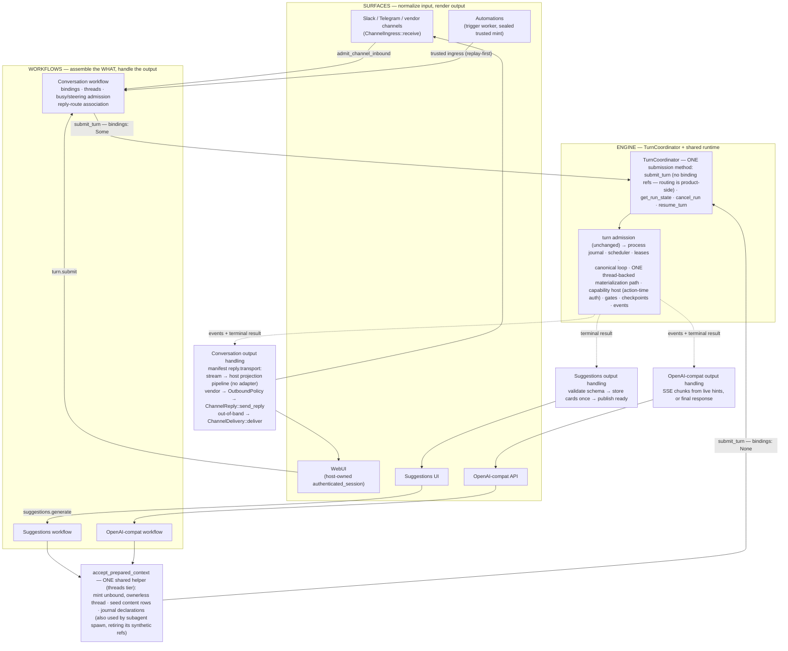

# One engine, many surfaces

**Status:** Discussion draft
**Grounded in:** `main` @ `d4fa8e1f60`
**Companion:** [2026-08-12-unbound-turns.md](2026-08-12-unbound-turns.md)
— the contract itself: the one `submit_turn` with optional bindings, the
shared `accept_prepared_context` door, `AgentMessage`, `OutputContract`,
run observation, and the invariants (I1–I5) this document builds on.

## 1. The rule this document exists to make obvious

Every product feature that runs the agent — vendor channels, the WebUI,
automations, suggestions, OpenAI-compat — is a **workflow** that does exactly
three things:

1. **Normalize its input** through its own ingress (webhook translation,
   session route, trigger fire, API request).
2. **Submit through the one `TurnCoordinator::submit_turn`** — everyone.
   Conversations accept content via `accept_user_message` and submit with
   `Some` bindings; every non-channel caller (suggestions, OpenAI-compat,
   subagent spawn, future features) accepts content via the **one shared**
   `accept_prepared_context` helper and submits with `None` bindings.
3. **Interpret the run's output in its own way** — and *only* its own
   way: conversations reply through the channel reply machinery (manifest-
   driven: stream or final send), suggestions validate and store cards,
   OpenAI-compat renders an HTTP response.

The engine never knows which surface called it, never sees routing data, and
never delivers anything. Nothing else in the system runs the agent.

## 2. The three layers

| Layer | Examples | Owns | Never does |
|---|---|---|---|
| **Surface** (ingress + rendering) | Slack/Telegram adapters, WebUI routes, trigger worker, suggestions UI, OpenAI-compat HTTP | Protocol translation, verification hand-off, rendering output for its vendor/client | Create threads, build prompts, call the engine, touch policy or delivery stores |
| **Workflow** (product logic) | Conversation workflow, suggestions workflow, OpenAI-compat workflow | Request assembly (the *what*), output handling, its own state (threads/bindings, suggestion store) and reply-route associations | Run the loop, authorize capabilities, invent events, bypass the coordinator to mutate run state |
| **Engine** (`TurnCoordinator` + shared runtime) | The coordinator (one `submit_turn`, optional bindings); process journal, scheduler, leases, canonical loop, capability host, gates, events | Admission, scheduling, execution, action-time authorization, gates, checkpoints, durable events and live hints, cancellation | Know about surfaces, hold reply targets or vendor IDs, deliver output, parse external identifiers |

Two admission doors already exist on `main` and stay exactly where they are:
verified vendor messages enter through
`ChannelInboundProductSurface::admit_channel_inbound`; authenticated sessions
and feature surfaces enter through `ProductSurface::invoke` operations
(`turn.submit`, `gate.resolve`, and — new — `suggestions.generate`).
Operations select trusted workflows; payloads never select prompts, tools, or
authority.

## 3. The whole system in one picture



Read it once top-down and once bottom-up. Top-down: five surfaces, three
workflows, one coordinator, one runtime. Bottom-up: one output stream, three
interpretations — reply machinery for anything conversation-shaped, a store
for suggestions, an HTTP response for OpenAI-compat.

## 4. Two accept doors, one submit, one runtime

Per-request data rides the accept step; coordinates ride the submit (full
contract in the companion document):

```rust
// Accept door 1 — conversations (existing):
accept_user_message(thread_id, message)          // → AcceptedMessageRef
// Accept door 2 — everything else (NEW, one shared implementation):
accept_prepared_context(PreparedContextRequest {
    tenant_id, agent_id, project_id, actor,      // who (run-acts-as-invoker)
    system_prompt, messages: Vec<AgentMessage>,  // what the model may see
    tools: Vec<CapabilityId>,                    // selection, authorized per call
    output: OutputContract,                      // AssistantMessage | JsonSchema (in-request)
    limits: TurnLimits,                          // narrowing-only
    idempotency_key,                             // replay-safe: no orphan threads
})                                               // → { thread_id, AcceptedMessageRef }

// The ONE submit — for everyone:
submit_turn(SubmitTurnRequest {
    scope,                                       // the REQUIRED thread: the unit of work
    actor, accepted_message_ref,
    // No binding refs at all: reply routing lives in product-side
    // conversation state; conversation vs unbound is decided by the
    // admission-time prepared-context probe.
    requested_model, requested_run_profile, idempotency_key,
})
```

The accept-door split is the only structural difference between workflows,
and the distinction underneath is *reference vs. content*:

- **Conversation accept** — a reference into living state. The host
  materializes history from the bound thread at run time through the
  thread-backed context port, so steering, compaction, and
  rebuild-on-resume keep working by construction.
- **Unbound accept** — content, sealed. The one shared helper mints an
  **unbound, ownerless thread** (content landed as refs, messages seeded as
  rows, declarations journaled) and the run uses the *same* thread-backed
  path — a conversation is a thread *with a binding*, and these
  deliberately have none.

Everything else that differs between workflows differs **by value**, and the
engine behaves accordingly through profiles:

| | conversation lane (channels, WebUI, automations) | unbound lane (suggestions, OpenAI-compat) |
|---|---|---|
| Submitted by | conversation workflow only | unbound workflows |
| Admission | one active run per thread; busy input settles as steering (`DeferredBusy`) or `RejectedBusy` | concurrent; idempotency only |
| Context at run time | materialized from the thread, fresh each iteration | materialized from its own seeded, unbound thread — the *same* path |
| Steering mid-run | yes (profile-gated), drained by the running loop | no (profile-disabled) |
| Gates | allowed — approval/auth surfaces exist (WebUI `gate.resolve`, channel approval replies) | not supported — non-gating surface; a gate is a typed `GateNotSupported` failure |
| Run profile | conversation profiles (interactive, scheduled trigger, …) | `unbound_default` / `unbound_structured` (derived from `output`) |
| Thread transcript | written by the run's thread-backed machinery, lease-fenced (exactly as today) | its own unbound, ownerless thread (✎ landed: caller-owned; see delta) — same machinery; internal, never listed |
| Subagents | per profile | denied |
| Typical `output` | `AssistantMessage` | either; suggestions use `JsonSchema` |

Subagent child runs sit between the lanes on purpose: they share the
unbound lane's **thread mechanics** (unbound, ownerless threads via the
same shared `accept_prepared_context` helper, `None` bindings on
`submit_child_run`) but run under the **subagent profile**, which keeps its
own gate and steering posture — the table's profile-driven rows describe
the `unbound_*` profiles, not thread-boundness.

## 5. The flows

Each flow below is: ingress → submit → output handling. The submit step is
deliberately near-identical everywhere; the output handling is deliberately
different everywhere.

### 5.1 Vendor channel conversation (Slack, Telegram, …)

Ingress uses the channel contracts that landed in #7477: the extension
implements protocol translation only; the host owns verification, staging,
admission, and everything after.

```python
def handle_vendor_webhook(raw_request):
    # HOST (extension ingress router): verify the vendor signature, stage the
    # payload durably, answer 2xx. Verification evidence is minted only by
    # the sealed verifier.
    verified = ingress_verifier.verify(raw_request)

    # EXTENSION (ChannelIngress::receive): pure protocol translation, plus
    # attachment/context fetch through manifest-restricted egress. Returns one
    # complete normalized inbound. No threads, no engine, no policy.
    inbound = channel_ingress.receive(verified, restricted_egress)

    # HOST: the one channel admission door.
    channel_inbound_surface.admit_channel_inbound(inbound)


def conversation_submit(inbound):
    # PRODUCT (conversation workflow) — identical for every channel.
    binding  = bindings.resolve_or_create_binding(inbound.external_conversation)
    accepted = threads.accept_user_message(binding.thread_id, inbound.message)

    if accepted.deferred_busy:
        # Thread already has an active run: the message was enqueued as
        # steering input and the RUNNING loop will drain it. No new run.
        return

    # UNCHANGED FROM MAIN — this is exactly today's call. Conversations have
    # no migration in this proposal; the trait they already use is the one
    # being expanded.
    response = turn_coordinator.submit_turn(SubmitTurnRequest(
        scope=turn_scope_for(binding.thread_id),      # tenant/agent/project + thread
        actor=inbound.actor,                          # run acts as its invoker
        accepted_message_ref=accepted.ref,
        source_binding_ref=binding.source,            # today's shape; slimming these
        reply_target_binding_ref=binding.reply_target,#   off the request is a named
        requested_model=None,                         #   follow-up, not this proposal
        idempotency_key=accepted.idempotency_key,
    ))
    conversation_runs.associate(binding, response.run_id)
```

### 5.2 Conversation output handling — one generic flow, manifest-driven

This is the piece that makes channels generic: the workflow consults the
channel's **manifest**, never the vendor. The reply axis already carries this
on `main`: a channel declaring `[channel.reply] transport = "stream"`
implements nothing — the host publishes to the durable projection pipeline
and the adapter is never called; any other transport means the extension
implements `ChannelReply::send_reply`.

```python
def handle_conversation_output(binding, run_id):
    # PRODUCT (conversation workflow). The thread transcript was already
    # written by the run itself (lease-fenced, engine-side) — output handling
    # is about REPLY, never persistence.
    reply = manifest(binding.channel).reply

    if reply.transport == "stream":
        # Host-owned: run events/live hints project into the durable
        # product stream; the surface (WebUI tab) tails it over SSE with a
        # resumable cursor. ChannelReply is never called — that absence is
        # what `stream` means.
        return

    # Vendor-transport reply: wait for the terminal result, then send one
    # source-routed answer through the reply lane.
    result = await_terminal(run_observation.subscribe(scope, actor, run_id))
    # (until the observation façade lands, this is today's polling delivery
    # observer — the flow is identical, only the wait mechanism differs)
    envelope = outbound_envelope(binding.reply_route, result.output.assistant_message)

    validated = outbound_policy.validate(envelope)     # revalidates the target,
                                                       # records the delivery attempt
    channel_reply.send_reply(validated, restricted_egress)   # extension renders + sends
```

Two deliberate consequences:

- **Streaming vs. whole-message is a manifest fact, not vendor code.** WebUI
  is simply a channel whose reply transport is `stream`. A future vendor that
  can stream (message edits) opts in through its manifest and a presentation
  policy over the same run events — no new engine surface, no
  per-vendor workflow code.
- **Reply and delivery stay orthogonal lanes.** Answering the run's input is
  `ChannelReply` (source-routed). Reaching someone out of band —
  notifications, automation results pushed to a different conversation — is
  `ChannelDelivery::deliver` (target-resolved), always through outbound
  policy. One run may use both, either, or neither.

### 5.3 WebUI

```python
def send_message(session_caller, thread_id, body):
    # SURFACE: authenticated_session ingress is host-owned — no extension
    # adapter exists or is needed. The route invokes ProductSurface
    # ("turn.submit"), which normalizes into the same conversation workflow.
    inbound = session_ingress.normalize(session_caller, thread_id, body)
    inbound.attachments = artifact_store.land(inbound.attachment_bytes)
    conversation_submit(inbound)

# Output: the WebUI channel's reply transport is `stream` — §5.2's first
# branch. The browser tails the product event stream (snapshot + cursor
# replay + live tail). Gate resolution comes back in through
# ProductSurface("gate.resolve") and resumes the blocked run through the
# approvals machinery.
```

### 5.4 Automations (trigger fires)

Automations are conversation-shaped: a fire becomes a message in a bound
conversation and runs under the scheduled-trigger profile. The only special
thing about them is *trust at ingress* — and it is sealed, not conventional.

```python
def on_trigger_due(fire, materialized_prompt):
    # TRIGGER WORKER (host): the only place a trusted trigger request can be
    # minted — the constructor runs the prompt-injection scan at mint time,
    # so "the prompt passed" is an invariant of the type.
    trusted = TrustedTriggerSubmitRequest.new(fire, materialized_prompt)

    # CONVERSATION-OWNED trusted submitter: replay-first (a duplicate fire
    # replays the original turn), then the SAME conversation workflow —
    # scheduled_trigger profile, whose deny-map strips trigger-mutating
    # capabilities.
    conversation_trusted_submitter.submit_trusted_trigger_fire(trusted)
    #   → conversation_submit(...) → submit_turn → the same coordinator
```

Output handling is §5.2 unchanged: reply into the bound conversation through
`ChannelReply`, and/or out-of-band notification through `ChannelDelivery`
under outbound policy. Automations never grow their own delivery path.

### 5.5 Suggestions

Suggestions are the canonical unbound workflow: no conversation, no
binding, no reply machinery — its thread is the coordinator-internal
unbound one, and the output's home is the suggestions store.

```python
def generate_suggestions(surface_caller, req):
    # SURFACE: ProductSurface operation "suggestions.generate". The payload
    # selects inputs; it cannot select prompts, tools, or authority.
    # Step 1 — the ONE shared accept helper (same one subagents/OpenAI use).
    prepared = unbound_context.accept(PreparedContextRequest(
        tenant_id=surface_caller.tenant_id,
        agent_id=surface_caller.agent_id,
        project_id=surface_caller.project_id,
        actor=TurnActor(user_id=surface_caller.user_id),
        system_prompt=SUGGESTIONS_PROMPT,            # prompts/*.md, include_str!
        messages=[user_message(req.goal)],
        tools=["builtin.memory_search"],             # or []
        output=JsonSchema(SUGGESTION_CARDS_SCHEMA),  # schema JSON rides the request
        limits=TurnLimits(max_iterations=6, wall_clock=seconds(60)),
        idempotency_key=req.idempotency_key,
    ))
    # Step 2 — the ONE submit, bindings None.
    response = turn_coordinator.submit_turn(SubmitTurnRequest(
        scope=turn_scope(prepared.thread_id),
        actor=TurnActor(user_id=surface_caller.user_id),
        accepted_message_ref=prepared.accepted_message_ref,
        source_binding_ref=None, reply_target_binding_ref=None,
        requested_model=None,
        idempotency_key=req.idempotency_key,
    ))
    suggestions.associate(req.id, response.run_id)


def on_suggestion_terminal(run_id, result, req):
    # The engine already schema-validated the output before reporting
    # success; this re-checks the declared schema and stores idempotently.
    cards = validate_structured(result.output, SUGGESTION_CARDS_SCHEMA)
    suggestions.persist_cards_once(req.id, run_id, cards)
    suggestion_events.publish_ready(req.id)
```

What the suggestions workflow deliberately never touches: thread APIs,
conversation bindings,
`ChannelReply`, `ChannelDelivery`, outbound policy. Readiness reaches the UI
through the product event stream like any other product projection.

### 5.6 OpenAI-compat

The adopter that retires a live hack: today the caller's message list is
JSON-flattened into one user message in a manufactured thread and
`response_format` is dropped. With the new method it is a plain unbound
workflow.

```python
def chat_completion(api_caller, api_request):
    prepared = unbound_context.accept(PreparedContextRequest(
        tenant_id=api_caller.tenant_id,
        agent_id=api_caller.agent_id,
        project_id=api_caller.project_id,
        actor=TurnActor(user_id=api_caller.user_id),
        system_prompt=from_system_messages(api_request.messages),
        messages=non_system_messages(api_request.messages),      # no flattening
        tools=external_tool_ids(api_request.tools),              # ExternalToolCatalog path
        output=output_contract_from(api_request.response_format),# no longer dropped
        limits=from_openai_params(api_request),
        idempotency_key=derive_key(api_request),
    ))
    response = turn_coordinator.submit_turn(SubmitTurnRequest(
        scope=turn_scope(prepared.thread_id),
        actor=TurnActor(user_id=api_caller.user_id),
        accepted_message_ref=prepared.accepted_message_ref,
        source_binding_ref=None, reply_target_binding_ref=None,
        requested_model=model_hint(api_request.model),
        idempotency_key=derive_key(api_request),
    ))

    if api_request.stream:
        # SSE chunks are derived from the run's live text hints (cumulative →
        # delta at the HTTP edge); the terminal event closes the stream.
        return sse_from(run_observation.subscribe(scope, actor, response.run_id))

    result = await_terminal(run_observation.subscribe(scope, actor, response.run_id))
    return openai_response_from(result)
```

Client-executed tools keep their existing shape: the model calls an
`external_tool.*` capability, the run parks on the external-tool gate, the
client posts the tool output, the run resumes. No thread, no reply machinery,
no vendor anything.

## 6. Boundary rules

1. **Surfaces never call `TurnCoordinator`.** They reach a workflow through
   one of the two admission doors (channel admission or a `ProductSurface`
   operation). Untrusted payloads select inputs, never prompts, tools,
   models, or authority.
2. **Workflows are the only submitters, and non-channel workflows share
   one accept door.** A workflow accepts its per-request data through its
   lane's accept method — conversations via `accept_user_message`,
   everything else via the single shared `accept_prepared_context`
   implementation (no per-workflow mint-seed code, ever) — then submits
   coordinates with scope + actor as request fields (run-acts-as-invoker),
   and owns the association between its domain object and the run id.
3. **The engine never *carries* routing data.** ✎ Shipped stronger than
   drafted: `SubmitTurnRequest` (and every other kernel request/state
   shape) carries NO binding refs at all — the slimming follow-up landed
   inside the unbound-turns implementation itself. Reply-routing data and
   *decisions* live in the conversation workflow, always.
4. **Output leaves the engine exactly one way**: run observation —
   durable events plus terminal result, with live hints on the ephemeral
   plane. Every workflow interprets that same output differently, and no
   workflow reads another's.
5. **Only conversation-shaped workflows touch reply/delivery machinery.**
   Channels and automations answer through `ChannelReply` (source-routed) or
   notify through `ChannelDelivery` (target-resolved), always behind outbound
   policy revalidation and delivery-attempt records. Unbound workflows never
   do; their output's home is their own store or their client connection.
6. **The manifest, not vendor code, decides channel output mode.**
   `reply.transport = "stream"` means host projection pipeline and no adapter
   call; any vendor transport means `send_reply`. Adding a channel adds
   manifest axes and translation methods — never a new engine or workflow
   branch.
7. **Capability authority never rides in a request.** Tools are a
   selection declared at the unbound accept; every call is authorized at
   action time by the capability host, under the run's acting identity —
   identically for both lanes.
8. **Thread transcripts are written by the run, not by output handlers.**
   The engine's thread-backed machinery persists messages lease-fenced
   during the run (exactly as today) — for every run: an unbound turn's
   transcript is its own unbound, ownerless thread (✎ landed: caller-owned;
   see delta), seeded at admission and written by the same machinery,
   internal to the coordinator and never
   enumerated by conversation surfaces (those query by owner and binding).
   Output handling is about reply, never persistence.

## 7. Sequencing

**Phase 1 — the unbound lane** (the companion proposal, complete in one
PR-sized change plus its tests). The one shared `accept_prepared_context`
helper (mint-seed-journal; no new materialization path); binding refs
deleted outright from `Submit`/`Resume`/`RetryTurnRequest` and run state
(✎ shipped end-state-first — no `Option` stage; conversations simply stop
passing them); declaration-driven profile derivation;
the unbound profiles and their concurrency cap; `OutputContract` (schema
in-request) + reply-admission enforcement; taxonomy tests (unbound threads
never surface in conversation listings; the subagent precedent pinned as a
rule). Suggestions and OpenAI-compat can adopt as soon as this lands; the
subagent-spawn refactor onto the helper follows as its own PR (live path,
own revert unit).

**Phase 2 — run observation.** The product-tier subscribe façade over the
two existing event planes (composite cursor, rebase/lag semantics), then its
first consumer: the delivery observer stops polling `get_run_state` every
250 ms and consumes terminal events. Vendor streaming-by-edits can follow as
a manifest presentation policy over the same events for channels that want
it.

**✎ Landed with phase 1: `SubmitTurnRequest` slimming.** The source/reply
binding refs were deleted from every kernel shape in the unbound-turns
implementation (no dual-read shim needed — old rows rehydrate under
ignore-unknown-keys, and product routing reads conversation state). Two
questions stay open until someone schedules it: (a) where the origin/surface
metadata the loop host consumes for origin-gated prompt assets ends up
(binding *refs* are workflow-side; origin metadata is engine-relevant —
`ProductTurnContext.adapter`/`source_channel` still ride the submit and
persisted run state, so §2's "the engine never holds vendor identifiers"
cell reads with this exemption until (a) is scheduled); (b)
the shim's lifetime and its regression coverage. No behavior changes either
way — this is hygiene, not architecture.

**✎ Landed with the surfaces PR (#7634): OpenAI-compat over the door.** The
adoption shipped as a lane split rather than a wholesale rewrite of the
route crate:

- EVERY non-streaming request without declared client tools goes through
  `accept_prepared_context` and an unbound run — no payload-shape
  heuristic; the flatten hack (`openai_compat.chat_messages.v1`) serves
  only the streaming and declared-tools conversation lanes. The completion
  reports the run's effective model and provider-reported usage from run
  state.
- Streaming stays on the conversation lane wholesale (its projection
  subscription is conversation-scoped); `stream=true` with a JSON output
  contract is rejected loudly rather than half-honored. Unbound-run
  streaming arrives with phase 2's run-observation façade, not before.
- Requests declaring live client tools stay on the conversation lane: chat
  completions are a stateless protocol (the client re-sends tool outputs as
  seeded history on its next request), so the catalog park/resume flow —
  which the engine supports on unbound runs — has no caller on this
  surface. `PreparedTurnDeclarations.tools` stays empty here by decision,
  not omission; the follow-up request's tool history seeds through the same
  door.
- No OpenAI parameter maps onto `TurnLimits` (the `max_tokens` family is
  accepted and unmapped): the shipped limit set is call/invocation/wall-
  clock ceilings, and no output-token engine seam exists.

## 8. Related documents

- [2026-08-12-unbound-turns.md](2026-08-12-unbound-turns.md) — the
  contract this document composes (the expanded `TurnCoordinator`,
  `AgentMessage`, `OutputContract`, run observation, invariants I1–I5,
  crate placement).
- [2026-08-10-unified-channel-model.md](2026-08-10-unified-channel-model.md)
  — why WebUI is a channel and `authenticated_session` ingress is host-owned.
- [2026-08-11-channel-adapter-contract.md](2026-08-11-channel-adapter-contract.md)
  — the `ChannelIngress` / `ChannelReply` / `ChannelDelivery` split (#7477)
  the flows above consume.
- `docs/internal/reborn/contracts/conversation-binding.md` — binding resolution,
  idempotent accepted messages, `DeferredBusy`/`RejectedBusy` steering
  admission, sealed trusted trigger ingress.
- `docs/internal/reborn/contracts/events-projections.md` — the durable-vs-live event
  planes and stream item vocabulary the observation façade standardizes.
- `docs/internal/reborn/contracts/approvals.md` — gate leases and resume, reached from
  conversation surfaces only.
