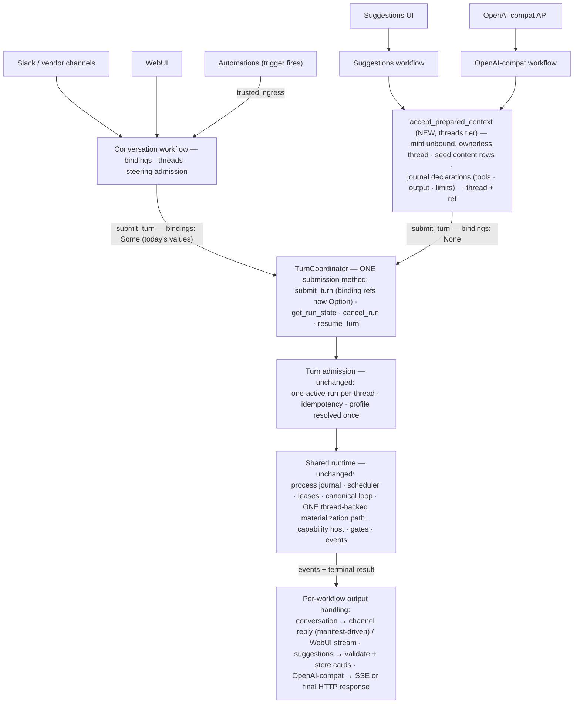

# Proposal: unbound turns — threads as the unit of work

**Status:** Implemented (see the implementation deltas below)
**Grounded in:** `main` @ `d4fa8e1f60`
**Companion:** [2026-08-12-one-engine-many-surfaces.md](2026-08-12-one-engine-many-surfaces.md)
— the system-level picture: how every surface (channels, WebUI, automations,
suggestions, OpenAI-compat) reaches the one coordinator and handles its
output.

## Implementation deltas (what actually shipped)

The lane shipped end-state-first; where this draft described a staged or
compat-preserving shape, the implementation went directly to the final
contract:

- **Naming**: "detached" became **unbound** (threads/profiles/families/
  concurrency class) and the accept door is **`accept_prepared_context`**
  over a **`PreparedContextRequest`** with **`PreparedTurnDeclarations`**;
  the result tool is **`builtin.structured_result`**.
- **Binding refs were deleted, not optionalized**: `SubmitTurnRequest`,
  `ResumeTurnRequest`, `RetryTurnRequest`, `TurnRunState`, run metadata, and
  `SubmitTurnResponse::Accepted` carry no `source_binding_ref` /
  `reply_target_binding_ref` at all. Reply routing lives purely in
  product-side conversation state (the run-delivery observer routes from the
  conversation binding it resolves; the model-delivery same-origin check asks
  the conversation-binding store which thread a sealed reply-target ref is
  bound to). Old persisted rows still rehydrate (serde ignores the retired
  keys); a frozen legacy-shape test proves old readers fail closed on new
  rows.
- **Admission derives the profile by probing the thread's journaled
  prepared-context record** (`PreparedContextSource`), not from a
  caller-supplied profile hint; an explicit unbound hint without a prepared
  record is rejected.
- **Subagent spawn** lands directly on the shared accept door; its synthetic
  per-child binding refs, `mark_message_submitted` step, and await-edge ref
  plumbing were deleted in the same change.

## Summary

Main already has an agent-execution service: `TurnCoordinator` — durable
admission, scheduling, leases, the model/tool loop, gates, checkpoints,
events, cancellation. **Threads are already its unit of work** (every run is
thread-backed), **a conversation is already "a thread plus a binding"** (the
conversations crate's charter, policed by an architecture test), and
**unbound work-threads already exist** (every subagent child run gets one).
What main is missing is not a runtime — it is a door, a contract, and a name
for its own taxonomy:

- a typed way to request work over caller-supplied content (today:
  hand-rolled create-thread → accept-message → submit-turn, which
  OpenAI-compat does and then flattens the messages into one string);
- a structured-output contract (`response_format` is parsed and dropped);
- per-run caller knobs (task instructions, tool selection, limits);
- a per-run subscription (delivery polls `get_run_state` every 250 ms);
- the rule "an unbound thread is not a conversation" stated and tested
  rather than true by accident.

This proposes making that sentence literal in the API. **`TurnCoordinator`
keeps exactly one submission method, `submit_turn`, and its binding refs
become `Option`** — a conversation submission passes `Some` (today's values,
unchanged); everything else passes `None`. The thread is the required unit
of work; the binding is the optional relation that makes it a conversation.
Unbound callers get a sibling of `accept_user_message` on the accept side:
**`accept_prepared_context`** mints an **unbound, ownerless thread**, seeds
the caller's content (system prompt + messages) as its rows, journals the
per-run declarations (tools, output contract, limits) beside it, and returns
the thread + accepted ref — which then go through the *same* `submit_turn`
as every conversation. Per-request data rides the accept step (exactly where
conversations put theirs); coordinates ride the submit. No second submit
method, no request enum, no new port, no new event vocabulary: a **unbound
turn** is simply a run whose thread has no binding and no owner —
structurally invisible to every conversation surface, because those query by
owner and binding. (Bonus: subagent spawn stops synthesizing placeholder
binding refs — the `"subagent-source:{run_id}"` fakes exist only because the
fields are required today.) Rich per-run observation (`subscribe`) is
deliberately a separate product-tier façade over existing projections, not a
kernel-trait method.

The contract line: **the caller owns the what** (acting identity, scope,
context, tool selection, output contract, limits, model preference); **the
host owns the how** (action-time authorization, run profiles, context
materialization, compaction and recovery, model validation and fallback,
loop strategy). Conversation behavior does not change — the conversation
context stays a *reference the host materializes, never a copy*. The companion
document specifies every surface's path end to end.

## 1. What main has, and the problem

### 1.1 The runtime that already exists

"Request work on a thread" is `TurnCoordinator`, and the execution chain
behind it:

```text
TurnCoordinator::submit_turn(SubmitTurnRequest)   kernel/ironclaw_turns
  → AgentTurnProcessRuntime                       admission: run profile resolved once and
                                                  persisted; one-active-run-per-thread;
                                                  idempotency via ProcessOperationId
  → ProcessSupervisor                             kernel/ironclaw_processes
                                                  wake+poll claims · 90s leases · heartbeats ·
                                                  bounded crash reclaims
  → RebornTurnRunExecutor                         loop/ironclaw_turn_runner
                                                  builds the host (thread-backed ports);
                                                  run-vs-resume by checkpoint
  → CanonicalAgentLoopExecutor                    loop/ironclaw_agent_loop
                                                  the loop: drain steering → build prompt
                                                  (compaction) → checkpoint → model → reply
                                                  admission → tool batch (action-time auth)
  → LoopExit — evidence-validated → terminal state
```

Control operations live beside `submit_turn` on the same trait:
`get_run_state`, `cancel_run`, `resume_turn` (gates), `retry_turn`, and
`submit_child_run` (subagents).

Three facts about this runtime are the foundation of the proposal:

1. **Threads are already the universal unit of work.** Every run is
   thread-backed (`TurnScope` requires a `ThreadId`); the only
   materialization path is the thread-backed one.
2. **A conversation is already "a thread plus a binding".** The conversations
   crate owns bindings and says so in its charter ("it is not the
   transcript"); an architecture test polices the separation. A thread with
   no binding has no external route, no reply target, and no channel — it is
   an *unbound transcript*, not a conversation.
3. **Unbound work-threads already exist.** Every subagent child run gets a
   fresh, seeded, unbound thread — kept out of conversation listings by
   owner scoping (`TurnThreadOwner::Ownerless` exists; listings query
   `owner_user_id`). OpenAI-compat manufactures a thread per call today.

### 1.2 What is missing

`SubmitTurnRequest` requires conversation vocabulary — a `TurnScope`, an
`AcceptedMessageRef`, source/reply binding refs. That is right for Slack and
the WebUI. A caller that has *content* rather than a conversation must
hand-roll the unit-of-work pattern itself, and there is no contract for what
it needs. This is not hypothetical — it is already shipping:

- **OpenAI-compat is the live workaround.** It accepts a caller-assembled
  request (messages + tools + `response_format`) and, because no neutral entry
  exists, it JSON-flattens the entire message list into *one* user message
  injected into a manufactured thread
  (`ironclaw_openai_compat/src/chat_workflow.rs`), and silently drops
  `response_format`. Caller-supplied *tools* fare better — they become real
  per-run capabilities via `ExternalToolCatalog`.
- **Structured output does not exist.** There is no `ResponseFormat` or
  JSON-schema response mode anywhere in `ironclaw_llm` or the loop contracts,
  so any feature needing schema-validated results has nothing to build on.
- **Settlement observation is a polling loop.** Channel delivery watches
  `TurnCoordinator::get_run_state` every 250 ms
  (`ironclaw_assistant/src/run_delivery/observer.rs`) because there is no
  run-scoped subscribe.

Two scoping notes, so the door is sized honestly:

- **The motivating class, not a single feature.** Suggestions is the canonical
  example (generate schema-validated cards from a goal, maybe with a memory
  lookup), but it does not exist yet; the class also includes OpenAI-compat
  requests, background analyses, and future one-shot product features. The
  first committed adopter may well be OpenAI-compat.
- **One-off inference already has a home.** `SystemInferencePort` serves
  host-internal single completions (compaction summaries, failure
  explanations). A feature that is one tool-less completion can use that. This
  method is for work that needs the *loop*: tools, durability, streaming,
  recovery.

The principle:

> Threads should remain the state model for conversations, not the required
> input model for every agent invocation.

## 2. The runtime today, and the invariants this design must respect

The design below is shaped by how the runtime actually works. Five facts
matter; each is an invariant this proposal preserves rather than renegotiates.

**I1 — The loop never holds materialized context.** The submit request is a
refs-and-hints envelope. The loop pulls context from the host once per
iteration as content refs (`LoopModelMessage { role, content_ref }`); prompt
text materializes host-side at model-call time, and `LoopPromptBundleAuthority`
rejects any model request whose messages do not byte-match the host-built
bundle. Checkpoints are ≤64 KiB of refs and strategy state — zero content — so
resume *rebuilds* context. Skills, identity, and memory snippets are injected
by the host during materialization, under profile policy.

**I2 — Context is alive during a run.** Steering can inject new user input
into a running loop; compaction durably rewrites history mid-run (summaries
replace sequence ranges); the visible tool surface is versioned and can change
between iterations (e.g. after an auth completes).

**I3 — Authorization happens at action time.** The visible tool surface is a
UX and reasoning aid, never an authorization shortcut. Every capability call
crosses `CapabilityHost` authorization when it happens; approval leases are
exact-invocation fingerprinted one-shots; host-side deny maps (e.g. the
scheduled-trigger deny list) exist precisely so callers cannot name their own
surface. Authority is never serialized state.

**I4 — Policy attaches through run profiles, resolved once at submit.** A
`ResolvedRunProfile` carries the loop driver (and thus loop family), the
capability-surface profile, checkpoint schema, steering/cancellation/budget
policies, and scheduling/concurrency classes. It is persisted at admission and
drift-checked at claim. Model choice is three-staged: tenant policy → fail-
closed route validation at host construction → a per-iteration fallback walk.

**I5 — The durable substrate is already product-neutral, and events have two
retention classes.** `ironclaw_processes` owns the journal, 90-second leases,
wake+poll claims, bounded crash reclaims, and zombie guards; the turn pipeline
is "an agent-turn projection over the generic process supervisor"
(`turn_scheduler.rs`). Durable events are coarse, redacted lifecycle facts;
streaming text is deliberately an *ephemeral live hint* (coalesced, process-
local, epoch-guarded), with exactly one durable text record: the finalized
message. Turn state stores "lifecycle metadata and references only" — raw
content never enters it.

## 3. Design principle: the caller owns the *what*, the host owns the *how*

| The caller (workflow) owns | The host (runtime) owns |
|---|---|
| Acting identity and tenant scope | Action-time capability authorization, approvals, dispatch |
| The context snapshot (what the model may see) | Context materialization, window management, compaction |
| Tool **selection** (which affordances to expose) | The visible surface, deny maps, per-call authorization |
| Output contract (assistant message vs. strict schema) | Contract enforcement, retry/repair, terminal validation |
| Model **preference** (profile hint) | Model resolution, fail-closed route validation, mid-run fallback |
| Limits (narrowing only) | Budget enforcement, scheduling, leases, crash recovery |
| Idempotency key | Deduplication, replay, exactly-once terminal settlement |

Everything in the left column serializes into the durable request. Nothing in
the right column does — it is resolved by the host at admission or at action
time, exactly as for conversation turns today.



There is one submission path, full stop: unbound content becomes an
unbound, ownerless thread at the accept step, and from `submit_turn` onward
the two idioms are indistinguishable — same admission, same runtime, same
materialization. Each workflow interprets the same run output
differently — the flows, including the manifest-driven stream-vs-reply
decision for channels, are specified in the companion architecture document.

## 4. Proposed design

**Interface inventory — read every type below with its class in mind.** The
sections that follow define what looks like a lot of surface; classified
honestly, the genuinely new API is one method and a handful of DTOs:

| Class | Types | What they are |
|---|---|---|
| **New API** (one accept door + its DTOs) | `accept_prepared_context` (threads tier, sibling of `accept_user_message`); `PreparedContextRequest`, `OutputContract`, `TurnRunResult`, `AgentOutput`, `TurnLimits`; plus binding refs on `SubmitTurnRequest`/`ResumeTurnRequest` becoming `Option` | The only truly new contract surface — no new submit method, no new trait, no new identity, no request enum; submission and response stay `submit_turn` → `SubmitTurnResponse` |
| **Extension of an existing family** | `AgentMessage`, `AgentMessageRole`, `ContentPart`, `ToolCallContent`, `ToolResultContent`, `ArtifactRef` (§4.4) | The canonical cleanup of `ironclaw_llm`'s existing `ChatMessage` vocabulary, defined in that crate — not a new message family |
| **Read-side views over existing machinery** | `RunEventView`, `RunLiveHint`, `RunStreamItem`, `RunObservationCursor` (§4.7) | Per-run projections of the *existing* durable vocabularies (turn lifecycle + runtime events) and the *existing* live-hint plane; `RunStreamItem` mirrors `ironclaw_event_streams`' stream-item vocabulary. No new durable event language exists |
| **Referenced, unchanged** | `CapabilityActivityView`, gate refs, run profiles, `ThreadId`/`AcceptedMessageRef`, everything in the runtime | Existing types the expansion consumes as-is |

### 4.1 One submit; bindings become optional

The kernel trait's method set does not change at all. The change is to the
**request family**: the binding refs stop being required, because their
meaning is optional — a reply route exists iff a binding does.

```rust
pub struct SubmitTurnRequest {
    /// The unit of work: tenant/agent/project + the REQUIRED thread.
    pub scope: TurnScope,
    /// The run acts as this user (run-acts-as-invoker).
    pub actor: TurnActor,
    /// The accepted content pin — from accept_user_message (conversations)
    /// or accept_prepared_context (unbound work). Same field either way.
    pub accepted_message_ref: AcceptedMessageRef,

    /// A conversation is a thread WITH a binding: `Some` on conversation
    /// submissions (today's values, unchanged), `None` for unbound turns —
    /// and for subagent spawns, which today synthesize placeholder refs
    /// ("subagent-source:{run_id}") only because these are required.
    pub source_binding_ref: Option<SourceBindingRef>,
    pub reply_target_binding_ref: Option<ReplyTargetBindingRef>,

    pub requested_run_profile: Option<RunProfileRequest>,   // unchanged
    pub requested_model: Option<String>,                    // unchanged
    pub idempotency_key: IdempotencyKey,                    // unchanged
    // received_at, spawn-tree fields, product_context — unchanged
}
```

- `ResumeTurnRequest` carries the same two refs and optionalizes with it
  (a unbound run resuming from an external-tool gate passes `None`).
- The engine's posture toward the refs is unchanged: opaque pass-through,
  never parsed (boundary rule 3 in the companion doc). `None` simply means
  there is nothing to hand the delivery layer — which is correct: no
  binding, no reply route, nothing to deliver.
- Rolling compatibility is one boundary, already planned: existing rows all
  carry `Some`; `None` rows are exactly the new-process-kind rows an old
  binary already must tolerate fail-closed (the same tolerance test covers
  both).

**What changes on `TurnCoordinator`, complete:**

| Operation | Status |
|---|---|
| `submit_turn` | **the one submission method, for everyone** — signature unchanged; binding refs become `Option` (conversations pass `Some` with today's values) |
| `prepare_turn` / `get_run_state` / `cancel_run` / `resume_turn` / `retry_turn` / `submit_child_run` | unchanged (`resume_turn`'s binding refs optionalize alongside; `submit_child_run` stops faking refs) |
| rich per-run `subscribe` | deliberately **not** on this trait — it composes product-tier projections, which a kernel trait must not depend on; it ships as a separate observation façade (§4.7). Today's equivalent is 250 ms polling of `get_run_state` |
| per-run declarations (`system_prompt`, `tools`, `output`, `limits`) | never on the submit at all — they ride `accept_prepared_context` (§4.2), exactly where conversations put *their* per-request data (`accept_user_message`) |

### 4.2 The unbound accept — one shared door

```rust
/// The ONE shared accept door for every non-channel caller — subagent
/// spawn, OpenAI-compat, suggestions, and every future unbound feature.
/// One implementation, threads tier: the sibling of accept_user_message.
/// That method accepts one user message into a bound conversation; this
/// one accepts a complete caller-authored context into a fresh unbound
/// thread. There are exactly two accept doors in the system, and each has
/// exactly one implementation.
pub struct PreparedContextRequest {
    /// WHO — house style, mirroring every accept/submit request.
    pub tenant_id: TenantId,
    pub agent_id: Option<AgentId>,
    pub project_id: Option<ProjectId>,
    /// The run will act as this user (run-acts-as-invoker).
    pub actor: TurnActor,

    /// WHAT the model may see. The caller's task prompt — the resolved
    /// profile may prepend host protocol assets; callers own the task
    /// prompt, they do not replace the host frame.
    pub system_prompt: String,
    /// Complete point-in-time input. Text may be inline; images and files
    /// are ArtifactRefs inside messages (§4.4). Seeded as the minted
    /// thread's rows.
    pub messages: Vec<AgentMessage>,

    /// Per-run declarations, journaled beside the seeded content and read
    /// at admission to derive the unbound profile. All defaultable —
    /// subagent spawn passes none of them.
    /// A selection, never authority (I3): validated as a subset of the
    /// profile surface, authorized per-call at action time. Empty = none.
    pub tools: Vec<CapabilityId>,
    /// The shape the terminal output must take (§4.5).
    pub output: OutputContract,
    /// Narrowing-only against profile ceilings; maps onto the existing
    /// budget machinery (iterations, wall clock, USD, output tokens).
    pub limits: TurnLimits,

    /// Replay-safe: retrying after a crash returns the SAME prepared
    /// context instead of minting an orphan — the discipline subagent
    /// spawn already applies via its synthetic external_event_id
    /// ("subagent-spawn:{run_id}").
    pub idempotency_key: IdempotencyKey,
}

pub struct AcceptedUnboundContext {
    /// Held transiently by the trusted workflow to build the TurnScope for
    /// submit — never exposed to untrusted surfaces (ProductSurface
    /// payloads cannot carry or name it), and unbound + ownerless, so no
    /// conversation surface can list it and no follow-up can route to it.
    pub thread_id: ThreadId,
    pub accepted_message_ref: AcceptedMessageRef,
}
```

The model hint deliberately does **not** ride the accept: `requested_model`
already exists on `SubmitTurnRequest` and keeps doing that job.

**One helper, every non-channel caller.** The point of a single
implementation is that mint-seed-journal is subtle enough to get wrong
exactly once: the unbound+ownerless invariant (what keeps scratch threads
out of every conversation surface), the content-ref landing path, the
declaration journaling, and the replay discipline all live in one audited
place. Subagent spawn is the proof this door was always needed: it
hand-rolls the same sequence today (`ensure_thread` +
`accept_inbound_message` with synthetic event and binding ids) — it
refactors onto the shared helper, and the synthetic ids retire. Channels
and conversations keep their own accept door (binding resolution +
`accept_user_message`), which owns the concerns unbound work doesn't have:
external-event idempotency, busy → steering settlement, reply targets.

**There is no request enum and no second submit method.** Earlier drafts
carried a `Thread | Snapshot` context enum, then a `submit_unbound_turn`
sibling; both dissolve, because per-request data was never submit's job.
Conversations put their per-request data in `accept_user_message`; unbound
callers put theirs in `accept_prepared_context`; **submit carries
coordinates, for everyone**. The load-bearing distinction stands unchanged
underneath: a conversation's context is a *reference* the host keeps
materializing (steering, compaction, rebuild-on-resume — I1, I2); a
unbound turn's content is supplied once and nothing mutates it. Beneath
both accept doors there is one kind of thing — a thread — and one runtime.
(Continuation-style unbound callers accept a NEW prepared context — a
fresh idempotency key mints a fresh thread carrying the full updated
context; in-place appending to an existing unbound thread is a follow-up,
not shipped behavior)

**Why can't conversations just materialize a snapshot too?** The obvious
simpler design — the conversation workflow assembles `system_prompt` +
`messages` + `tools` from its `ThreadId`/`AcceptedMessageRef` before
submitting, so the engine never cares which kind it is — was this proposal's
own first draft, and it is the right design for a stateless system. It fails
here because a conversation run's context is not an input: the engine keeps
deriving and *mutating* it for the whole life of the run.

| If conversations submitted frozen content | What breaks | Where the behavior lives today |
|---|---|---|
| Input sealed at submit | Steering: a message arriving while the thread is busy settles as `DeferredBusy` and is drained by the **running** loop before its next model call. A sealed payload has no aperture; cancel-and-resubmit loses in-flight tool work. | conversation-binding contract rule 12; `LoopInput::Steering` + drain stage |
| System prompt fixed at submit | Skills are re-selected **every iteration** from run content (the model can activate a skill mid-run); memory may first attach at iteration N>0; identity assets are per-run conditional. | skill activation, memory/identity context sources |
| Messages fixed at submit | Window-eviction compaction durably rewrites history **mid-run** and persists the summary into the thread so future turns benefit — the engine writes context back, not just reads it. | compaction task (`ReplaceRangeWhenSelected`, #7504) |
| Journal replayed on resume | Gate resume deliberately **rebuilds** context (checkpoints are refs-only, ≤64 KiB): messages queued during the block drain in; skills re-select; the surface re-versions. | planned-driver resume path |
| Tools fixed at submit | The visible surface is versioned and must change mid-run: AuthRequired → user authorizes → surface changes → model retries. | `LoopInput::CapabilitySurfaceChanged` |
| Caller-built prompt text | The engine rejects model requests whose messages do not byte-match the **host-built** bundle; the loop holds content refs, never text. Caller-materialized lists are what this anti-forgery check exists to block. | `LoopPromptBundleAuthority` (I1) |
| Full history serialized per turn | O(n²) journal growth per thread under never-delete; turn state is refs-only by rule. | `ironclaw_turns` guidance ("lifecycle metadata and references only") |
| Tool results re-rendered by product code | Replayed tool results pass a host-side redaction/validation contract before becoming model-visible; product-tier materialization would duplicate security-critical code. | safe summaries + validated model-visible observations |

A unbound turn is precisely the case where none of this dynamism is
wanted — which is why the caller may supply content there, and only there.
The method split marks the one real boundary (*who materializes*: engine, and it may keep
mutating; vs. caller, and it is sealed); everything after submit — admission,
scheduling, loop, action-time authorization, gates, events, observation — is
one shared stack for both.

**The helper is mint-seed-journal; the workflow then submits the ref.**
Callers pass ordinary messages — inline text, attachments as `ArtifactRef`
parts. The helper mints an **unbound, ownerless thread**, lands content
exactly the way accepted conversation messages land today (content refs
into the transcript/content store — I5), seeds the messages as the thread's
rows, journals the declarations beside them, and returns the pin. The
workflow then calls the one `submit_turn` with `None` bindings. The
unbound run's transcript *is* its thread, written by the same lease-fenced
machinery as every other run. Unbound + ownerless makes it structurally
invisible: conversation listings query by owner scope, and a follow-up has
no binding to route through. This is the pattern subagent child runs
already use — codified into one shared implementation instead of
hand-rolled per caller.

**Profiles are derived, not requested.** Every run resolves a
`ResolvedRunProfile` at submit (I4), and admission derives it from what the
accepted ref points at: a unbound-prepared context resolves the new
unbound profiles (`unbound_structured` when the journaled `output` is a
JSON schema, `unbound_default` otherwise — read from the declarations the
helper stored); a conversation ref resolves exactly as today (`None` → the
planned default; trigger fires forced onto the deny-mapped
scheduled-trigger profile; subagent spawns forced onto the subagent
profile by the spawn path). The existing `requested_run_profile` hint field
keeps working unchanged.

**Declarations compose with the profile; the accept split makes misuse
unrepresentable.** A declaration never overrides policy: `tools` is
validated as a subset of the profile surface and every call is still
authorized at action time; `limits` narrow profile ceilings, never widen
them; the model preference stays on submit as today's `requested_model`
layering (preference in, host validates fail-closed, fallback retained).
And because the declaration fields exist only on the unbound accept, a
conversation cannot name tools or declare a schema output *by
construction* — `accept_user_message` has no such fields, and the submit
never carries any.

What the host still owns at execution time, identically for both submission
idioms:

- **Action-time authorization for every call** (I3). The selection shapes the
  *visible* surface; `CapabilityHost` authorizes each invocation when it
  happens. Nothing in the journal is an authorization.
- **Model resolution** (I4). The `model` preference feeds the existing
  three-stage chain; the result reports the *effective* model.
- **Run profile policy** (I4). Two new built-in profiles ship with this
  proposal, derived from the request as described above:
  - `unbound_default` — snapshot context source; no memory lane; no skill
    injection; steering disabled; subagent spawn denied; non-gating surface.
  - `unbound_structured` — `unbound_default` plus structured-output reply
    admission (§4.5).
- **Materialization** (I1). There is exactly **one materialization path** —
  the existing thread-backed context port — for both idioms: a unbound
  turn materializes from its own seeded thread. The canonical loop,
  compaction, checkpoints, recovery, and `LoopPromptBundleAuthority` apply
  unchanged and unforked. (Per-iteration re-materialization over a thread
  nobody else writes to is behaviorally identical to a frozen snapshot —
  freshness machinery over an unchanging source needs no special case.)

### 4.3 Output

```rust
pub struct TurnRunResult {
    pub output: AgentOutput,                 // interpreted against OutputContract
    pub usage: UsageSummary,
    pub effective_model: ModelProfileId,     // what actually ran (fallback-aware)
    pub finish_reason: AgentFinishReason,
}

pub enum AgentOutput {
    AssistantMessage(AgentMessage),
    /// Validated against the schema the request carried (§4.5).
    Structured { value: serde_json::Value },
}
```

- **One authoritative terminal output.** Intermediate assistant/tool messages
  belong to the run's thread and progress stream, not the product
  result. `AgentOutput::AssistantMessage` must be an assistant-role message
  with no unresolved tool call.

### 4.4 The `AgentMessage` interface

`AgentMessage` is the message vocabulary of the unbound lane, used in
exactly two places: the unbound accept (§4.2) and the terminal
`AgentOutput::AssistantMessage` (§4.3). One vocabulary, both directions.
Conversation submissions never carry messages across the trait at all — thread
history stays host-side (I1).

```rust
pub struct AgentMessage {
    pub role: AgentMessageRole,
    pub content: Vec<ContentPart>,
}

pub enum AgentMessageRole { User, Assistant, Tool }

pub enum ContentPart {
    /// Inline text at the API; journaled as a content ref at admission (§4.2).
    Text(String),
    /// Durable references; bytes stay in the artifact store. Never inline
    /// bytes, never provider URLs.
    Image(ArtifactRef),
    File(ArtifactRef),
    /// Assistant-only: a capability request the model made.
    ToolCall(ToolCallContent),
    /// Tool-only: the outcome paired to a prior ToolCall.
    ToolResult(ToolResultContent),
    /// Assistant-only: opaque provider reasoning artifacts that must
    /// round-trip on replay — some providers reject histories that drop them.
    Reasoning(ReasoningContent),
}

pub struct ToolCallContent {
    pub call_id: ToolCallId,
    /// Normalized capability identity, never a raw provider tool name.
    pub capability: CapabilityId,
    pub arguments: BoundedJson,
}

pub struct ToolResultContent {
    /// Must pair with a ToolCall earlier in the message list.
    pub call_id: ToolCallId,
    pub outcome: ToolResultOutcome,   // Text | Json | Artifacts(Vec<ArtifactRef>)
    pub is_error: bool,
}

pub struct ArtifactRef {
    pub artifact_id: ArtifactId,
    /// Metadata is advisory at submission; the artifact store is
    /// authoritative, and every use re-authorizes access under the
    /// run's acting identity.
    pub mime_type: String,
    pub filename: Option<String>,
    pub size_bytes: u64,
}
```

**Ownership: extended, not duplicated.** This is not a third message family.
`ironclaw_llm` owns the provider-neutral vocabulary today as
`ChatMessage`/`ContentPart` — with three shapes worth naming because
`AgentMessage` is their cleanup: `content: String` *plus* a `content_parts`
overlay (two places for the same content), tool calls and results as flat
side fields (`tool_calls`, `tool_call_id`, `name`) rather than parts, and
`reasoning`/`reasoning_details` as side fields. `AgentMessage` is the
canonical shape of that same vocabulary — a pure parts list — defined in
`ironclaw_llm` with one owned, total conversion to and from the
provider-facing shapes. Provider adapters keep their wire types; nothing else
in the workspace defines a message type (the mirror-DTO ban applies).

**No `System` role, by construction.** The system prompt is a separate,
host-composed field on the unbound request (§4.2); a role that could smuggle
system-prompt content through the message list deliberately does not exist.

**Role × part validity** — enforced fail-closed at submission
(`TurnError`, before anything reaches the journal):

| Part | User | Assistant | Tool |
|---|---|---|---|
| `Text` | ✓ | ✓ | ✓ |
| `Image` / `File` | ✓ | ✓ (generated artifacts) | ✗ (artifacts ride `ToolResult.outcome`) |
| `ToolCall` | ✗ | ✓ | ✗ |
| `ToolResult` | ✗ | ✗ | ✓ (exactly one per message) |
| `Reasoning` | ✗ | ✓ | ✗ |

A flat struct with validation was chosen over per-role typed variants for
symmetry with provider APIs and the existing `ChatMessage`, and so
conversions stay total; the tradeoff — invalid combinations are
runtime-rejected rather than unrepresentable — is contained by validating at
submission, so nothing invalid ever reaches a journal or a provider.

**Pairing and ordering rules.**

- Every `ToolResult.call_id` pairs with a `ToolCall` earlier in the list;
  unpaired calls or results are rejected at submission (providers reject
  broken pairs anyway — admission fails closed before the journal does).
- `Reasoning` parts ride the assistant message that produced them and
  round-trip opaquely: never interpreted, never rendered to users. Precedent:
  `reasoning_details` exists on `ChatMessage` today because some providers
  return HTTP 400 when prior reasoning artifacts are dropped from replay.
- Terminal output (§4.3) adds: assistant role; no `ToolCall` parts (no
  unresolved work); at least one `Text` or artifact part.

**Bounds.** Per-part, per-message, and per-request byte budgets are enforced
at submission, and `BoundedJson` bounds tool arguments. Values mirror the
bounds the transcript/content layer enforces today — no new size behavior at
the boundary.

**Unbound input vs. thread history.** Unbound callers author these messages
directly. Thread-context history never becomes caller-visible
`AgentMessage`s: it is materialized host-side, where replayed tool results
remain subject to the transcript safety contract (safe summaries plus
validated model-visible observations).

### 4.5 `OutputContract` — new shared surface

```rust
pub enum OutputContract {
    AssistantMessage,
    /// The JSON schema itself rides the request.
    JsonSchema { schema: serde_json::Value },
}
```

- **The schema is request data — there is no registry.** The schema travels
  inline on the contract and is journaled (as refs, like all request
  content) at admission, so it is durably recorded with every run and
  stored results stay interpretable after the fact with nothing to own or
  version host-side. How a product feature constructs or stores its schemas
  (a `prompts/`-style asset, product config) is that feature's decision when
  it ships.
- **Validation is strict, always.** The terminal output must parse and
  validate against the schema or the attempt is rejected into the
  repair/retry path below; exhausted retries fail the run as
  `invalid_model_output`. (A tolerant mode was considered and cut.)
- **Enforcement point:** a reply-admission strategy in the loop family. The
  loop already has a reply-admission slot that rejects invalid finals and
  drives a retry with a model-visible repair hint; a schema-validating
  admission strategy gets bounded retry/repair for free, and exhausted
  retries fail the run as `invalid_model_output`.
- **Provider mechanism: the schema is presented as one forced tool.** For a
  `JsonSchema` contract, the host injects a synthetic, host-owned result
  tool whose parameters *are* the request's schema — riding the one schema
  path every provider already supports: tool parameters (`ironclaw_llm`'s
  strict tool-schema normalization applies unchanged). The model finishes by
  calling it — the loop may force tool choice for the final response once
  ordinary tool work concludes — and the reply-admission strategy intercepts
  that call as the terminal output, validating the arguments against the
  request's schema. Two boundary rules: the result tool is **not a
  capability** — it never crosses authorization or dispatch, exactly like
  the existing synthetic `capability_info` tool — and a plain-text final
  under a schema contract is rejected with a repair hint directing the model
  to the result tool. (This is the same idiom pi uses for typed output;
  here it is the mechanism behind a declared contract rather than the
  contract itself.) Provider-native structured-output response modes become
  per-provider upgrades inside `ironclaw_llm` later, behind the same
  `OutputContract` — callers never see the difference.

### 4.6 Gates: explicit policy

Unbound profiles expose **non-gating surfaces**: capabilities whose policy
can require approval or auth are absent from the visible surface (the same
hide-vs-expose shaping surfaces already implement). If an approval, auth,
or resource gate fires anyway — policy drift, auth expiry mid-run — the run
fails with a typed `GateNotSupported { gate_kind }` outcome. No hung runs,
and no approval UI with no home to render in.

**One deliberate exemption: the ExternalTool gate is supported.** It is not
a human-approval gate — its resolver is the submitting client itself
(OpenAI-compat's client-executed tools park the run on it; the client posts
the tool output and the run resumes via `resume_turn` with `None`
bindings, exactly as that flow works today). `AwaitDependentRun` is
unreachable on unbound profiles by construction (subagent spawn is
denied).

The durable event vocabulary still includes `Blocked`/`Resumed` so the journal
stays honest, and so a later revision can add a resolve affordance (wired to
the existing `ApprovalInteractionService` machinery) for workflows that
genuinely need gating tools. That affordance is out of scope here and needs
its own design (who renders the gate, actor validation, lease semantics).

### 4.7 Run observation — a product-tier façade, not a coordinator method

Point-in-time state polling stays where it is: `get_run_state` on the
coordinator, returning `TurnRunState`, unchanged. What's new is a **rich
per-run subscription**, and it deliberately does **not** live on the kernel
trait: it composes product-tier projections and stream machinery, which a
kernel trait must not depend on. It ships as a separate observation façade
(product tier, same family as today's projection services):

```rust
pub trait RunObservation: Send + Sync {
    /// Replay durable events after `after`, then continue with live items.
    /// Access is authorized against the run's scope and actor, exactly as
    /// control operations are.
    async fn subscribe(
        &self,
        scope: TurnScope,
        actor: TurnActor,
        run_id: TurnRunId,
        after: Option<RunObservationCursor>,
    ) -> Result<Box<dyn RunSubscription>, ObserveRunError>;
}
```

The runtime separates **durable lifecycle facts** from **ephemeral live
hints** (I5): text deltas are coalesced, process-local UI hints; the durable
log is coarse, redacted metadata; the only durable text is the finalized
output. The façade keeps that split and re-keys both planes by run:

```rust
/// A read-side VIEW, per run, over the EXISTING durable vocabularies
/// (turn lifecycle + runtime events) — not a new durable event language.
/// Nothing new is persisted; this is what a subscriber sees.
pub enum RunEventView {
    Accepted,
    Running,
    ToolCallStarted   { activity: CapabilityActivityView },
    ToolCallCompleted { activity: CapabilityActivityView },
    Blocked  { gate: RunGateView },
    Resumed  { gate_ref: GateRef },
    Completed { result: TurnRunResultRef },
    Failed    { failure: TurnRunFailure },
    Cancelled,
}

/// A view over the EXISTING ephemeral live-hint plane (the coalesced
/// cumulative-text machinery) — process-local, epoch-guarded, never
/// replayed losslessly across restarts.
pub enum RunLiveHint {
    Text     { cumulative: SanitizedText },   // coalesced, replaceable body
    Thinking { cumulative: SanitizedText },
    ToolProgress { activity_id: CapabilityActivityId, progress: SafeToolProgress },
}

/// Mirrors the stream-item vocabulary `ironclaw_event_streams` already
/// ships (Snapshot / update / RebaseRequired / Lagged / KeepAlive), with
/// the durable-vs-live split made explicit.
pub enum RunStreamItem {
    Snapshot(TurnRunState),           // point-in-time, from get_run_state
    Event(RunEventView),            // durable plane, cursor-advancing
    Live(RunLiveHint),              // ephemeral plane
    RebaseRequired,                 // replay gap or foreign/stale cursor
    Lagged { reason: LagReason },   // buffer overrun or redaction block
    KeepAlive,
}
```

- `RunObservationCursor` composes a durable component and an epoch-guarded live
  component. Reconnecting mid-run replays durable events from the cursor and
  receives the *current* cumulative text, not a delta history — the same
  guarantee the WebUI stream has today.
- Durable kinds map onto the existing event vocabularies
  (`CapabilityActivity*`, turn-lifecycle blocked/resumed, loop terminal
  milestones) rather than minting a new event language; safe views reuse the
  existing `CapabilityActivityView` redaction machinery; everything crossing
  the façade passes the existing fail-closed redaction validation.
- Product workflows project these into their own stores and streams;
  transports continue to consume product projections, never raw model
  deltas.

There are no new state or response types: submission returns the existing
`SubmitTurnResponse` (run id, status, resolved profile), and point-in-time
state is the existing `TurnRunState` via `get_run_state`. Idempotency replay
surfaces the way it does today (the product layer reports replayed
submissions).

### 4.8 Implementation sketch

```python
def accept_prepared_context(request):
    # THE ONE SHARED HELPER — one implementation, threads tier. Every
    # non-channel caller uses it: subagent spawn (refactors onto it,
    # retiring its hand-rolled ensure_thread + accept_inbound_message +
    # synthetic ids), OpenAI-compat, suggestions, future features.
    validate(request)                 # bounds, role×part validity (§4.4)

    # MINT: an unbound, ownerless thread (TurnThreadOwner::Ownerless).
    # Idempotent via the request key — a crash-retry returns the same
    # prepared context instead of minting an orphan.
    thread_id = threads.create_unbound_ownerless(request.idempotency_key)

    # SEED: messages become the thread's rows through the same content-ref
    # path accepted conversation messages use (I5); last row is the pin.
    ref = threads.seed(thread_id, request.system_prompt, request.messages)

    # JOURNAL: the declarations, beside the content, read at admission.
    threads.journal_declarations(thread_id, request.tools, request.output, request.limits)

    return AcceptedUnboundContext(thread_id, ref)

# The workflow then calls the ONE submit — literally today's method:
#   submit_turn(SubmitTurnRequest {
#       scope: turn_scope(thread_id), actor,
#       accepted_message_ref: ref,
#       source_binding_ref: None, reply_target_binding_ref: None,
#       requested_model: hint, idempotency_key,
#   })
# Admission resolves the profile from what the ref points at:
#   conversation ref → conversation profiles, exactly as today;
#   unbound-prepared ref → unbound_{structured|default} from the
#   journaled declarations.
# execute_claimed: UNCHANGED — one host, one thread-backed materialization
# path, for every run on the system.
```

There is no bespoke scheduler, lease logic, retry logic, crash recovery, or
second materialization path in this proposal: admission/replay, claims,
heartbeats, bounded reclaims, thread-backed materialization, and
evidence-validated terminal settlement are the existing process/turn
machinery (I5), untouched.

## 5. Relationship to the existing runtime

Nothing is replaced.

| Responsibility | Owner (unchanged) | This proposal adds |
|---|---|---|
| Durable admission, dedup, queueing | process journal + coordinator machinery | binding refs become `Option` on `Submit`/`ResumeTurnRequest`; profile derivation reads prepared declarations |
| Content acceptance | conversation accept door (bindings + `accept_user_message`) | **one shared unbound accept door** (`accept_prepared_context`, threads tier) used by every non-channel caller — subagent spawn refactors onto it |
| Scheduling, leases, crash recovery | `ProcessSupervisor` / scheduler | a run class with its own scheduling/concurrency class |
| Model/tool loop, checkpoints, recovery, materialization | canonical loop + loop families + the one thread-backed context port | `unbound_*` profiles; a schema-validating reply-admission strategy — the materialization path is unchanged and unforked |
| Capability authorization, approvals | `CapabilityHost` + approvals | nothing — action-time auth applies as-is |
| Durable events, projections, streams | events crates + product projections | a run-scoped observation façade over both planes |
| Threads, conversation binding, steering | threads/conversations/turn services | nothing — machinery, semantics, and entry point all unchanged; conversations already call the trait being expanded |

**What is genuinely new** (complete list): `accept_prepared_context` — one
shared implementation for every non-channel caller — with its request DTO
and journaled declarations record; binding refs on
`SubmitTurnRequest`/`ResumeTurnRequest` becoming `Option` (and subagent
spawn's synthetic placeholder refs retiring);
the `unbound_default`/`unbound_structured` run profiles; `OutputContract` +
the reply-admission strategy enforcing it; the run observation
façade (cursor + subscription); the typed `GateNotSupported` failure; and
the codified taxonomy rule — *a conversation is a thread with a binding* —
pinned by tests proving unbound threads never surface in conversation
listings.

**Follow-ups this unlocks** (each its own change, not part of this proposal):

1. **OpenAI-compat adopts the method** (§5.3): `response_format` maps to
   `OutputContract`; the message list becomes seeded thread rows instead of
   a flattened string; external tools keep their `ExternalToolCatalog` path.
2. **Delivery stops polling**: `RunDeliveryObserver` can consume the
   observation façade's terminal events instead of polling `get_run_state`.
3. **Subagent spawn refactor onto the shared helper** — its own PR right
   behind this one (live-path change, wants its own revert unit): replace
   the hand-rolled `ensure_thread` + `accept_inbound_message` + synthetic
   ids with `accept_prepared_context` + `None` bindings on
   `submit_child_run`.
4. **Full `SubmitTurnRequest` slimming** (optional future hygiene): with
   the refs already `Option`, the remaining step is moving conversation
   `Some` values into workflow association state entirely, with the
   delivery observer reading routes from there. The origin/surface
   metadata the loop host consumes stays engine-side.

### 5.1 Conversation workflow — one textual diff: `Some(...)`

Slack, WebUI, and triggers keep today's machinery end to end: binding
resolution, accepted messages, `submit_turn`, thread-backed
materialization, steering, gates, delivery. There is no migration and no
phase for conversations — the only diff at their call site is wrapping the
two binding refs in `Some(...)`.

### 5.2 Suggestions workflow (the motivating class)

```python
def generate_suggestions(surface_caller, suggestion_request):
    # Step 1 — the shared accept door (same helper subagents/OpenAI use).
    prepared = unbound_context.accept(PreparedContextRequest(
        tenant_id=surface_caller.tenant_id,
        agent_id=surface_caller.agent_id,
        project_id=surface_caller.project_id,
        actor=TurnActor(user_id=surface_caller.user_id),     # run acts as the invoker
        system_prompt=SUGGESTIONS_PROMPT,                    # prompts/*.md, include_str!
        messages=[user_message(suggestion_request.goal)],
        tools=["builtin.memory_search"],                     # or []
        output=OutputContract.JsonSchema(SUGGESTION_CARDS_SCHEMA),  # schema JSON asset
        limits=TurnLimits(max_iterations=6, wall_clock=Duration.seconds(60)),
        idempotency_key=suggestion_request.idempotency_key,
    ))

    # Step 2 — the ONE submit, same as every conversation, bindings None.
    response = turn_coordinator.submit_turn(SubmitTurnRequest(
        scope=turn_scope(prepared.thread_id),
        actor=TurnActor(user_id=surface_caller.user_id),
        accepted_message_ref=prepared.accepted_message_ref,
        source_binding_ref=None,
        reply_target_binding_ref=None,
        requested_model=None,                                # profile default
        idempotency_key=suggestion_request.idempotency_key,
    ))
    suggestions.associate(suggestion_request.id, response.run_id)
    return response.run_id


def project_suggestion_result(run_id, result, suggestion_request):
    cards = validate_structured(result.output, SUGGESTION_CARDS_SCHEMA)
    suggestions.persist_cards_once(suggestion_request.id, run_id, cards)  # idempotent
    suggestion_events.publish_ready(suggestion_request.id)
```

The projector consumes the observation façade (terminal event → project),
with persistence keyed by `run_id` so at-least-once delivery of the
terminal event cannot double-write. Untrusted callers reach this through a
`ProductSurface` operation (`suggestions.generate`); payloads select inputs,
never prompts, tools, or authority.

### 5.3 OpenAI-compat workflow (likely first adopter)

```python
def chat_completion(api_caller, openai_request):
    prepared = unbound_context.accept(PreparedContextRequest(
        tenant_id=api_caller.tenant_id,
        agent_id=api_caller.agent_id,
        project_id=api_caller.project_id,
        actor=TurnActor(user_id=api_caller.user_id),
        system_prompt=from_system_messages(openai_request.messages),
        messages=non_system_messages(openai_request.messages),   # no flattening
        tools=external_tool_ids(openai_request.tools),           # ExternalToolCatalog path
        output=output_contract_from(openai_request.response_format),  # no longer dropped
        limits=from_openai_params(openai_request),
        idempotency_key=derive_key(openai_request),
    ))
    response = turn_coordinator.submit_turn(SubmitTurnRequest(
        scope=turn_scope(prepared.thread_id),
        actor=TurnActor(user_id=api_caller.user_id),
        accepted_message_ref=prepared.accepted_message_ref,
        source_binding_ref=None,
        reply_target_binding_ref=None,
        requested_model=model_hint(openai_request.model),
        idempotency_key=derive_key(openai_request),
    ))
    return stream_or_poll(response.run_id, openai_request.stream)
```

This retires the flatten-into-one-message hack and gives `response_format` a
real implementation — a concrete payoff that is independent of
any new feature shipping.

## 6. Non-goals

- No changes to the channel contracts. `ChannelIngress` / `ChannelReply` /
  `ChannelDelivery` landed in #7477 and are consumed as-is; the companion
  document shows exactly where they sit in each flow.
- No WebUI ingress changes beyond what the unified channel model already
  specifies, and no thread/conversation service renames.
- No conversation changes of any kind — behavior *or* entry point.
  Conversations already call the trait being expanded; the only
  conversation-adjacent item is the independent `SubmitTurnRequest`
  slimming follow-up (§5), which changes where routing refs live, not what
  happens.
- No durable text deltas; no new retention semantics ("LLM data is never
  deleted" applies to unbound turns' threads as to everything else — which is
  exactly why they store refs, not copies).
- No gate-resolution surface for unbound turns (typed failure instead).
- No subagent spawn from unbound turns (denied by profile).

## 7. Crate placement (proposal — needs architecture review)

| Piece | Home | Rationale |
|---|---|---|
| `accept_prepared_context` + `PreparedContextRequest` (one shared impl) | `ironclaw_threads` — the sibling of `accept_inbound_message` | one accept door, one implementation, every non-channel caller |
| Binding-ref optionalization + declaration-driven profile derivation | `ironclaw_host_api` / `ironclaw_turns` | request-family change on existing types; admission reads the prepared declarations via a port |
| `RunObservation` façade + view DTOs | product tier (`ironclaw_assistant` projection family) | composes projections; must not live in the kernel |
| Neutral message/content extensions | `ironclaw_llm` | owns provider-neutral model vocabulary; no mirror DTOs |
| `OutputContract` enforcement (reply admission) | `ironclaw_agent_loop` strategy + `unbound_*` families | reuses the existing retry/repair machinery; schema is carried in-request |
| Suggestions (when real) and other workflows | `ironclaw_assistant` | product orchestration |
| Wiring | `ironclaw_composition` | assembly only |

New dependency edges get boundary rules in
`reborn_dependency_boundaries.rs` in the same PR, per the architecture-test
convention.

## 8. Ownership summary

| State | Owner |
|---|---|
| Conversation transcript and continuity | Thread store, via its binding (unchanged) |
| Unbound turn transcript (seeded request + run output) | Its own unbound, ownerless thread — the same thread store as every run |
| Run lifecycle, resolved profile, idempotency, result settlement | Process journal (unchanged — as every run today) |
| Artifact bytes and authorization | Artifact/filesystem store (unchanged) |
| Output schema | The execution request (journaled with it) |
| Suggestion request and validated cards | Suggestions store (future) |
| Vendor reply/delivery attempts | Outbound/delivery subsystem (unchanged) |

## 9. Decisions and open questions

**Resolved (2026-08-13):**

- **One submit; optional bindings; one shared accept door.** The design
  passed through three spellings — an `AgentExecution` port with a
  `Thread | Snapshot` request enum, then a `submit_unbound_turn` sibling
  method — before landing here: per-request data was never submit's job.
  Conversations put theirs in `accept_user_message`; unbound callers put
  theirs in the one shared `accept_prepared_context` (threads tier, single
  implementation, used by subagent spawn, OpenAI-compat, suggestions, and
  every future non-channel caller); **`submit_turn` carries coordinates,
  for everyone**, with its binding refs now `Option` — the request type
  itself expressing the taxonomy (thread required = the unit of work;
  binding optional = what makes it a conversation). The run id is the
  handle (no `ExecutionId`); the response stays `SubmitTurnResponse`;
  subagent spawn's synthetic placeholder refs retire; rich `subscribe` is
  a product-tier observation façade because a kernel trait must not depend
  on read models. Conversations' only diff is `Some(...)` around two
  fields.

- **Threads are the unit of work; a conversation is a thread with a
  binding.** Unbound turns are runs on **unbound, ownerless threads**
  minted by the coordinator at admission; the thread id stays internal
  (the run id is the caller's handle). Each consequence replaces an
  earlier design element: there is **no snapshot-backed context port** (one
  materialization path), **no thread-kind flag** (binding-absence plus
  ownerlessness is the classifier, and owner-scoped listings already exclude
  such threads structurally), **no kernel scope changes**
  (`TurnScope`/`LoopRunContext` untouched), and the process journal keeps
  its existing role. Subagent child threads are the in-tree precedent, now
  codified rather than accidental.
- **The schema travels in the request** (§4.5) — no host-owned registry.
  Admission journals it with the rest of the request, so stored results stay
  interpretable with nothing to own or version. How a feature constructs or
  stores its schemas is that feature's decision when it ships.
- **Validation is strict-only.** The tolerant (`strict: false`) mode is cut.
- **No new `ProcessKind`** *(supersedes an earlier resolution that added
  one)*. A unbound turn is an ordinary `AgentTurn` process — same kind,
  same projection, same executor; from `submit_turn` onward the idioms are
  indistinguishable, so a separate kind would be exactly the fork this
  design forbids. Rolling compatibility reframes onto what actually
  changes: rows whose binding refs are `None` and whose profile id is a
  `unbound_*` value, with one tolerance test proving an old-style reader
  treats them fail-closed. The kind-enum legacy audit decouples into
  optional hygiene.
- **`TurnLimits` maps onto the existing budget machinery** (iteration
  limit, wall clock, USD accountant, max output tokens) — nothing invented;
  ceilings come from the profile.
- **Observation live-hint buffers reuse existing sizing** (the thread ring).
- **Crate placement as tabled in §7**, finalized in PR review.
- **Message bounds mirror today's transcript/content bounds** (§4.4) — no
  new size behavior at the seam.
- **No per-tool crash-replay declaration.** Unbound turns inherit the
  standard recovery semantics conversation runs already have (bounded
  reclaims, checkpoint resume, invocation fingerprinting) — behavior stays
  exactly as it is now.

**Still open:**

1. **Does suggestions need tools at all?** If the feature's first version is a
   single schema-validated completion, it can ship on `SystemInferencePort`
   and adopt the method when it needs the loop. The first committed
   adopter may be OpenAI-compat rather than suggestions.
2. **Unbound concurrency cap:** the shared worker pool already enforces
   per-class concurrency limits from config (`max_concurrent_trigger_runs`,
   `max_concurrent_conversation_runs`); unbound turns get a third cap
   the same way so a burst of them cannot occupy every worker and delay live
   chats. Open: the default value, and whether interactive unbound callers
   (a user waiting on a panel) ever need a priority path — deferred until
   there is latency data.
3. **Gate-resolve affordance:** a design sketch for the future revision that
   allows gating tools on unbound turns (actor model, rendering
   surface, lease semantics) — deliberately unresolved here.
