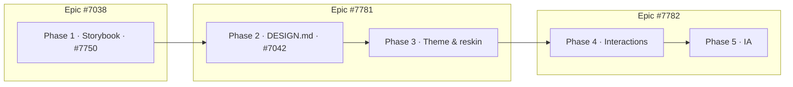

# Design System — Execution Plan (Phased)

**Status:** Proposal, under review · **Authored against:** `origin/main` @ `d3791e0f8` · **Tracks:** Epics [#7038](https://github.com/nearai/ironclaw/issues/7038) (Phase 1) · [#7781](https://github.com/nearai/ironclaw/issues/7781) (Phases 2–3) · [#7782](https://github.com/nearai/ironclaw/issues/7782) (Phases 4–5)

This is the **when and how**; [CHECKLIST.md](CHECKLIST.md) is the **what** (definition of done); [PROPOSAL.md](PROPOSAL.md) is the frozen decision record. The five phases are **predefined** and executed in order; they are tracked across three Epics — **#7038** (Phase 1), **#7781** (Phases 2–3), **#7782** (Phases 4–5). Nothing here is sacred except the ordering constraints marked **⚠**.

> **Epic ownership.** The program is tracked across three Epics (the original #7038 was
> split, then Phase 2 folded in with Phase 3). This package is shared by all three:
>
> | Epic | Phases | Scope |
> |---|---|---|
> | [#7038](https://github.com/nearai/ironclaw/issues/7038) | 1 | Storybook integration & design-system catalog — PR #7750 |
> | [#7781](https://github.com/nearai/ironclaw/issues/7781) | 2–3 | `DESIGN.md` governance & documentation (#7042) · theme update & UI reskin — supersedes the closed #7733 |
> | [#7782](https://github.com/nearai/ironclaw/issues/7782) | 4–5 | Agentic interactions & components · Information architecture |

**Operating principles:**
1. **Docs first** — each phase updates `DESIGN.md` / this package before or with the code (APDD Rule 1).
2. **Token values before component restyle** — Phase 3 lands tokens, validated in Storybook, before any primitive is reskinned.
3. **A story travels with every component change**; `pnpm test:storybook` stays green.
4. **`main` stays shippable** — phases land as reviewable PRs, stacked only where necessary.

## Phase 1 — Storybook integration (PR #7750 — in review) · Epic #7038
*Stand up the workbench + catalog.* Storybook 10 (react-vite, pnpm), wired to `app.css` + light/dark toolbar; ~33 stories in five categories; vitest split (`pnpm test` node-only, `pnpm test:storybook` in Chromium); addon-mcp.
**Milestone:** catalog live; story + node suites green at the `crates/product/ironclaw_webui/frontend` path (103 story tests · 1355 node tests on #7750).
**Note:** originally PR #7039 — closed and recreated as **#7750**, clean and non-stacked off current `main`.

## Phase 2 — DESIGN.md governance & guidelines (issue #7042) · Epic #7781
*Make the design system governed.* `DESIGN.md` (M3X spec + IronClaw appendix), Storybook `Design/Guidelines` page, `.claude/rules/design-system.md`, `CLAUDE.md` Module Specs pointer.
**Milestone:** source of truth + agent rules in place; build-storybook green.
**⚠ Ordering:** the original #7043 was stacked on #7039; both were closed for the resulting merge tangle. Merge **#7750** first, then land the Phase-2 changeset as a fresh PR off `main` (PROPOSAL §7.6).

## Phase 3 — Theme update & UI reskin · Epic #7781
*Change token values + assets to the M3X look; validate in Storybook.*
- Resolve the Phase-3 dependencies first: **dark palette derivation**, **WCAG contrast validation**, **fonts/licensing** (PROPOSAL §7.3–§7.5).
- Land M3 → `--v2-*` token *values* (light + dark) in `app.css`; refresh color/type/space/radius scales; vendor fonts.
- Reskin primitives/composites against the new tokens; every change validated by its story + `CssCheck` + a11y.
**Milestone:** new palette live in both themes, all `Tokens/*` stories pass contrast, primitives reskinned with green story tests.
**⚠ Ordering:** Phase 2 lands **before** Phase 3 (DESIGN.md is the spec the token values are judged against — both are Epic #7781); token values land **before** component restyle; Phase 3 branches off `main` after #7750 and the Phase-2 PR merge.

## Phase 4 — Interaction & component updates (agentic-first) · Epic #7782
*Add the expressive, agent-first interactions + new components.*
- Resolve the **animation approach** (reduced-motion-gated) and **MSW** for network-story happy-paths (PROPOSAL §7.2, §7.5).
- Build the agentic components (composer toolbar, FAB speed-dial, chat bubbles, agent-activity/reasoning cards, branded progress, connected button groups); each ships with stories + play coverage.
**Milestone:** agentic component set catalogued + story-tested; motion honors `prefers-reduced-motion`.
**⚠ Ordering:** depends on Phase 3 tokens.

## Phase 5 — Information architecture · Epic #7782
*Reshape navigation/routes/page structure to foreground agentic workflows.*
- Revisit `app/routes.ts`, `pages/`, sidebar / `gateway-layout`; adopt the M3X navigation-rail pattern where it fits; ensure multi-channel parity.
**Milestone:** IA restructured; CUJs (chat, approvals, projects, settings) verified unbroken.

## Suggested next PRs (concrete, in order)
1. **Merge #7750** — that closes Epic #7038 (Phase 1). Then land the Phase-2 (#7042) changeset as a fresh PR off `main`, opening Epic #7781's first half.
2. **Phase 3a — token foundation:** dark-palette + contrast + font vendoring in `app.css` (+ updated `Tokens/*` stories). No component restyle yet.
3. **Phase 3b — primitive reskin:** restyle `design-system/` primitives against the new tokens, story-by-story.
4. **Phase 4a — motion foundation:** choose + wire the animation approach behind the reduced-motion gate; add MSW.
5. **Phase 4b — first agentic component:** composer toolbar or agent-activity card, fully catalogued.

## Coordination notes
- This is a **docs-only** PR; it changes no code. It references the open Phase-1/2 PRs by number.
- Each phase is tracked under its owning Epic — #7038 (1), #7781 (2–3), #7782 (4–5) — with per-phase sub-issues (e.g. #7042) spun up as work starts. Epic #7733 covered the same Phases 2–3 scope and is closed as superseded by #7781.
- The APDD-kit evaluation (`docs/plans/apdd-governance-kit/`, PR #7255) is a sibling initiative that motivated this design-governance track; the two do not depend on each other.
