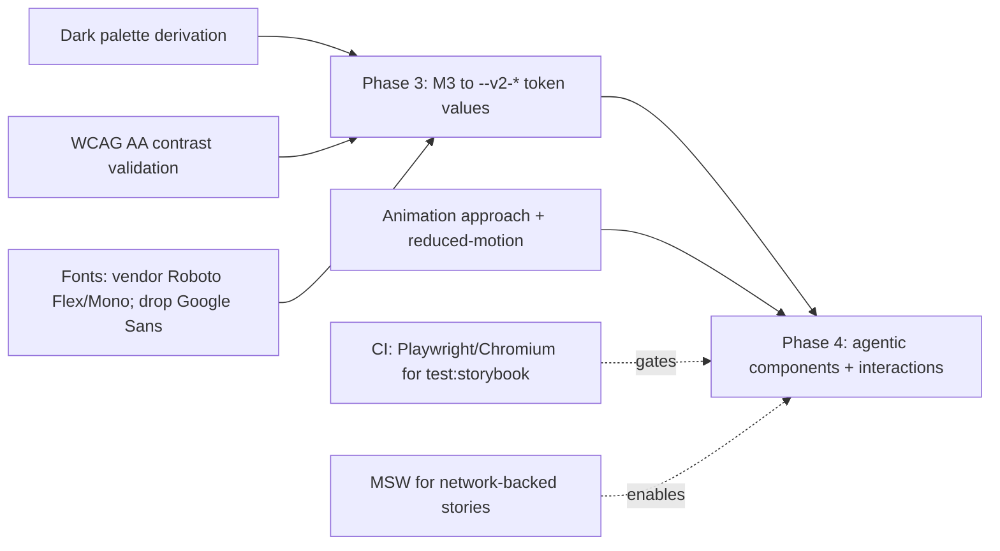
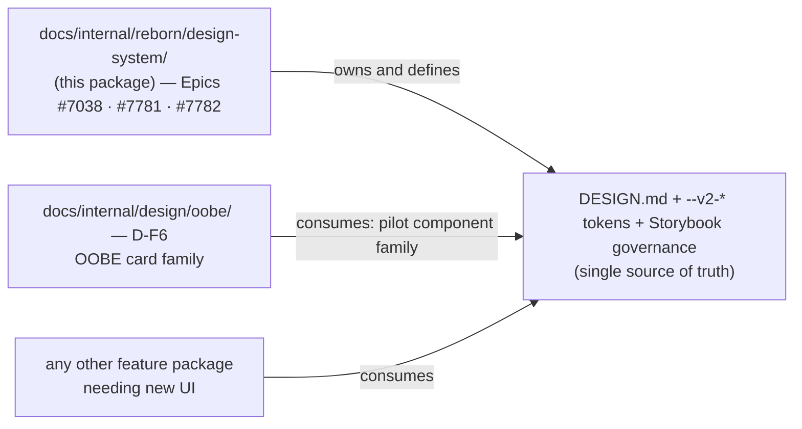

# Proposed: Storybook + Design-System Catalog for the IronClaw WebUI

**Status:** Proposal, under review · **Authored against:** `origin/main` @ `d3791e0f8` · **Tracks:** Epics [#7038](https://github.com/nearai/ironclaw/issues/7038) (Phase 1) · [#7781](https://github.com/nearai/ironclaw/issues/7781) (Phases 2–3) · [#7782](https://github.com/nearai/ironclaw/issues/7782) (Phases 4–5) · **Benchmarks:** the APDD governance kit (external, not vendored — evaluated in-repo at [`docs/internal/apdd-governance-kit/`](https://github.com/nearai/ironclaw/pull/7255), PR #7255, *not yet on `main`*) · [`docs/internal/reborn/target-architecture/`](../target-architecture/PROPOSAL.md) (PR #6918)

## 1. Executive decision

Adopt a **governed, catalogued design system** for the IronClaw WebUI and evolve it toward an **AI/agentic-first UX** in five predefined phases. Realize the design language — **Material 3 Expressive (M3X)** — **natively** with the existing React 19 + Tailwind v4 primitives; do **not** adopt Material Web components or a parallel/third-party design-system framework. `DESIGN.md` and the Storybook catalog are the source of truth; the token architecture (`data-theme` + `--v2-*`) is kept.

Phases 1–2 are in flight (PR #7750 in review; the Phase-2 changeset preserved on #7042). Phase 1 is tracked by Epic #7038; Phases 2–3 by #7781 (superseding the closed #7733); Phases 4–5 by #7782. This proposal freezes the framing, records the decisions, and — most importantly — **names the dependencies of Phases 3–5 with a proposed implementation for each** (§7).

## 2. Current-state evidence

### 2.1 Frontend stack (`CURRENT`, measured against `origin/main`)
- **React 19.2 + TypeScript** SPA under `crates/product/ironclaw_webui/frontend`, built with **Vite + Tailwind v4** (CSS-first: no `tailwind.config.ts`; tokens live in `src/styles/app.css` under `@theme` + `:root[data-theme=…]`).
- Package manager **pnpm**; fonts self-vendored via `/vendor/fonts` (Geist / Geist Mono).
- A deliberate **static-motion policy** in `app.css` (`* { animation: none !important }`, `.v2-spin` the sole exception, `prefers-reduced-motion` honored).

### 2.2 Existing design surface (`CURRENT`)
- `src/design-system/` — atomic **primitives** (Button, Badge, Input, Card, Switch, Spinner, Modal, ConfirmDialog, SelectMenu, Icon) + **composites** in `primitives.tsx` (StatCard, Panel, FlowList, EmptyPanel, SectionHeader, SubLabel).
- `src/components/` + `src/layout/` — shared composites and the app shell.
- Tokens are already token-driven via `--v2-*`; light + dark both defined.

### 2.3 Foundations in flight (not yet on `main`)

Phases 1–2 are *built but unmerged*. Nothing in this section can be verified by checking out `main`; each item's home path is created by the PR named beside it.

- **Phase 1 — `IN REVIEW` (PR #7750, supersedes closed #7039; Epic #7038):** Storybook 10 (`@storybook/react-vite`, pnpm) wired to the real `app.css` + a light/dark toolbar; **~33 stories** in five sidebar categories (Primitives / Components / Composites / Icons / Tokens); a vitest split (`pnpm test` node-only, `pnpm test:storybook` in headless Chromium); `@storybook/addon-mcp` for agent access. On `main` today: no `.storybook/` directory, no stories.
- **Phase 2 — `PREPARED`, no open PR (issue #7042, changeset preserved from closed #7043; Epic #7781):** `crates/product/ironclaw_webui/frontend/DESIGN.md` (M3X spec + an IronClaw implementation/governance appendix), a Storybook `Design/Guidelines` docs page, and `.claude/rules/design-system.md` agent governance. On `main` today: none of those three files exists.

### 2.4 Current-state conclusion
The workbench, catalog, governance doc, and agent rules are **written and reviewable, but not merged** — Phase 1 in review, Phase 2 awaiting its fresh PR (§7.6). Read every `DESIGN.md` / Storybook / `.claude/rules/design-system.md` reference in this package as *the artifact those two phases land*, not as something present on `main`. What remains after them is the **visual/interaction transformation** (Phases 3–5) — which is where the dependencies and risk concentrate.

## 3. Non-negotiable invariants

1. **Native M3X** — realized with React + Tailwind + `--v2-*`; never `<md-*>` Lit web components or a parallel framework.
2. **Token-driven** — no hardcoded hex/px in components; add tokens (light **and** dark) in `app.css`.
3. **Story-per-component** — every primitive/composite/component with meaningful states has a colocated `*.stories.tsx`; changes are reviewed in Storybook and covered by `pnpm test:storybook`.
4. **Accessibility bar** — WCAG AA contrast, preserved `aria-*`, keyboard/focus, light+dark parity.
5. **Motion policy** — expressive motion is opt-in and `prefers-reduced-motion`-gated.

## 4. Alternatives considered

- **Material Web Components (`<md-*>`, Lit) — rejected.** Introduces a second component runtime into a React app; violates the program's "no parallel framework" non-goal (carried by all three Epics) and the `--v2-*` token architecture. The supplied agent instructions assumed this stack; it does not fit.
- **A third-party React DS (MUI/Radix/shadcn adoption wholesale) — rejected.** We already have a coherent primitive layer; swapping frameworks is a rebuild, not a reskin.
- **Native M3X on React + Tailwind — recommended.** Adopt M3X as the *design language*, applied to our own primitives and tokens. Preserves logic, `aria-*`, and the token mechanism; changes values/assets/interactions, not architecture.

## 5. The design system, as governed

`DESIGN.md` is the constitution; it maps cleanly onto the APDD-kit 5-tier taxonomy:

| APDD tier | IronClaw home |
|---|---|
| Tier 1 — Tokens | `styles/app.css` (`@theme` + `--v2-*`) |
| Tier 2 — Elements (primitives) | `design-system/` atomics |
| Tier 3 — Components (pure compositions) | `design-system/primitives.tsx` composites + `components/` |
| Tier 4 — Patterns (state-bound) | `pages/**` feature views |
| Tier 5 — Layouts | `layout/` |

## 6. Storybook as workbench + test-harness + agent MCP

Per the APDD design-governance guide, Storybook is three things: a **workbench** (the catalog), a **test harness** (`test:storybook` runs stories in Chromium with a11y + a `CssCheck` that fails if the stylesheet didn't load), and an **agent MCP** (`@storybook/addon-mcp`, registered local-scope, so an agent can query component docs before using them). All three arrive with Phases 1–2 — built and reviewable today (#7750 / #7042), on `main` only once those land (§2.3).

## 7. Dependencies and their implementation proposals

The remaining phases carry six dependencies. Each is stated with a **proposed implementation**, the phase it gates, and an **owner**.

**Accountability rule.** A dependency's owner is the Epic that carries its gating phase; the *accountable individual* is the assignee of that Epic's dependency sub-issue, which must be cut and assigned **before the gating phase's first PR opens** — that is the gate, and CHECKLIST WS6 tracks it. Items marked **[decision]** additionally need a named human call recorded on the owning Epic; a decision with no named caller blocks its phase rather than defaulting.

| # | Dependency | Gates | Owning Epic | Accountable |
|---|---|---|---|---|
| 7.1 | CI Playwright/Chromium for `test:storybook` | cross-cutting | [#7038](https://github.com/nearai/ironclaw/issues/7038) (lands with Phase 1's suite) | **[decision]** — CI-lane owner, named on #7038 before the job is promoted to required |
| 7.2 | MSW for network-backed stories | Phase 4 happy-paths | [#7782](https://github.com/nearai/ironclaw/issues/7782) | Phase-4 sub-issue assignee (cut at Phase 4 kickoff) |
| 7.3 | Dark palette derivation | Phase 3 | [#7781](https://github.com/nearai/ironclaw/issues/7781) | Phase-3a token-foundation PR author (PLAN "next PRs" #2) |
| 7.4 | Fonts + licensing | Phase 3 | [#7781](https://github.com/nearai/ironclaw/issues/7781) | **[decision]** — Google Sans substitute, called on #7781 before Phase 3a opens |
| 7.5 | Expressive motion | Phase 4 | [#7782](https://github.com/nearai/ironclaw/issues/7782) | **[decision]** — animation mechanism, called on #7782 before Phase 4a opens |
| 7.6 | Merge order / stacked PRs | Phase 1→2 landing | [#7038](https://github.com/nearai/ironclaw/issues/7038) → [#7781](https://github.com/nearai/ironclaw/issues/7781) | #7750's author lands Phase 1; the Phase-2 fresh PR's author lands #7042 |

WCAG AA contrast validation is not a seventh line: it is a **standing invariant** (§3.4) enforced inside 7.3 by the same owner, not a separately-ownable dependency.

**7.1 CI: Playwright/Chromium for `test:storybook`.** *Gates: cross-cutting.* *Owner: Epic #7038 → the CI-lane owner named on it; promotion to a required gate is a **[decision]**.* The story suite runs in headless Chromium; CI runners don't install it today (the vitest split keeps `pnpm test` node-only, so nothing breaks now). **Proposal:** add an *optional, non-blocking* CI job that runs `pnpm exec playwright install chromium` + `pnpm test:storybook`; promote to a required gate only after it's proven stable. Documented in CHECKLIST WS6.

**7.2 MSW for network-backed stories.** *Gates: Phase 4 happy-paths.* *Owner: Epic #7782 → the Phase-4 sub-issue assignee.* Two components (PairingWebCodePanel, TeeShield) render limited/error states in Storybook because they hit the network / are host-gated. **Proposal:** add `msw` + `msw-storybook-addon`, generate the worker into `public/`, and add handlers only for those endpoints — keeping deterministic cache-seeding for everything react-query-based (the pattern already used in Phase 1).

**7.3 Dark palette derivation.** *Gates: Phase 3.* *Owner: Epic #7781 → the Phase-3a token-foundation PR author; carries the §3.4 WCAG AA invariant with it.* The supplied M3 palette is light-only; the app is dark-default and dual-theme. **Proposal:** derive dark values per token (tonal shift, not literal inversion) in `app.css :root[data-theme="dark"]`; validate each pair in the `Tokens/Colors` story before adoption.

**7.4 Fonts + licensing.** *Gates: Phase 3.* *Owner: Epic #7781; the Google Sans substitute is a **[decision]** that must be called on #7781 before Phase 3a opens.* Spec wants Roboto Flex / Google Sans / Roboto Mono; app ships Geist. **Proposal:** vendor **Roboto Flex + Roboto Mono** (OFL) under `/vendor/fonts`; **drop Google Sans** (not freely redistributable) — use Roboto Flex for the emphasized-headline role, or confirm a licensed source before shipping.

**7.5 Expressive motion.** *Gates: Phase 4.* *Owner: Epic #7782; the animation mechanism is a **[decision]** that must be called on #7782 before Phase 4a opens.* Spring physics / shape-morph / speed-dial unfurl require an animation mechanism; none is installed, and the static-motion policy is in force. **Proposal:** evaluate a small JS spring lib (e.g. `motion`) vs. spring→cubic-bezier CSS approximations; whichever is chosen, all expressive motion is **opt-in and `prefers-reduced-motion`-gated**, introduced behind the policy rather than ad-hoc keyframes.

**7.6 Merge-order / stacked PRs.** *Gates: Phase 1→2 landing (Epic #7038 → #7781).* *Owner: #7750's author for Phase 1; the Phase-2 fresh-PR author for #7042.* The original Phase-2 PR #7043 was stacked on Phase-1 #7039; both were closed after the stack became an unmergeable merge-commit tangle. **Proposal:** merge the recreated, non-stacked **#7750** first, then land the preserved Phase-2 changeset (#7042) as a fresh PR off `main`; Phase 3 branches off `main` after both land.

## 8. Alignment with the governance benchmarks

- **APDD kit:** we produce the kit's design-governance artifacts — `DESIGN.md` (constitution + taxonomy + REJECT gate), path-scoped `.claude/rules/design-system.md`, Storybook-as-workbench/test/MCP, and a validation gate — and honor its spine (docs are source of truth; fixes update docs + add a test). This proposal package is the kit's "epic gets a committed plan" case.
- **PR #6918:** we mirror the doc shape (this README/PROPOSAL/PLAN/CHECKLIST + an interactive artifact) and conventions (provenance shas; phased waves with quantified milestones; `⚠` ordering constraints; "Landed with #NNNN"; a PR-body `| File | Role |` table).

## 9. Ownership boundary: one canonical governance record

There must be exactly one owner for the shared `DESIGN.md`, token, and Storybook-governance decisions. **This package is that owner.** Everything else that needs design governance consumes it rather than re-proposing it.

**What this package owns.** The `DESIGN.md` constitution and its taxonomy, the `--v2-*` token architecture and its values, the Storybook catalog/test-harness/MCP setup, `.claude/rules/design-system.md`, and the phase sequencing that lands all of it (Phases 1–5, Epics #7038 / #7781 / #7782).

**What it does not own.** Any individual feature's component work. Feature packages specify *their* components and states; they do not stand up parallel governance.

**Specifically, OOBE D-F6.** [`docs/internal/design/oobe/PROPOSAL.md` §5.6](../../design/oobe/PROPOSAL.md) proposes seeding a `DESIGN.md` plus "optionally a Storybook workbench" for the OOBE card family. That is the *same* governance work this package's Phases 1–2 land. The boundary, effective with this proposal:

- **D-F6 does not stand up `DESIGN.md`, tokens, or Storybook.** Phase 1 (#7750) delivers the workbench; Phase 2 (#7042) delivers `DESIGN.md` + the agent rules. D-F6's governance half is **subsumed**, not duplicated.
- **What survives of D-F6 is its pilot role**: the OOBE card/drawer/action-bar family is a Tier-2/3 component family that gets catalogued *through* this system — stories in the Phase-1 catalog, conformance judged against the Phase-2 `DESIGN.md`.
- **Sequencing:** if OOBE productionizes its cards before #7750 lands, it ships them as ordinary token-driven components and their stories follow in the Phase-1/2 wake — it does not fork a workbench to get there.
- **The OOBE package's D-F6 section carries a pointer to this section** so the two records cannot drift into competing plans (that pointer is part of this PR's diff).

If a reviewer would rather the OOBE track own design governance instead, that is a legitimate call — but it has to be *one* of the two, and this package should then be retired into a link to that owner. What is not acceptable is both records proposing the same `DESIGN.md`.

## 10. Risks & open questions

- **Reskin scope creep** — an M3X reskin can balloon. Mitigation: token values land first (Phase 3) and are validated in Storybook before any component restyle.
- **Motion vs. the static-motion policy** — reversing it broadly risks a11y regressions. Mitigation: opt-in + reduced-motion gate, per-component.
- **CI cost** — running Chromium story tests in CI adds minutes. Mitigation: optional job first; make required only if stable.
- **[decision]** Font substitute for Google Sans — needs a named call (Roboto Flex only, or a licensed alternative).
- **[decision]** Whether `test:storybook` becomes a required merge gate.

## 11. References

Every path below is stated with where it actually resolves, so nothing in this package points at a file a reader cannot open.

**Resolvable in this repo, on `main`:**
- Benchmark package: [`docs/internal/reborn/target-architecture/`](../target-architecture/README.md) (PR #6918).
- Sibling design record whose governance half this package subsumes (§9): [`docs/internal/design/oobe/`](../../design/oobe/README.md).

**Not in this repo:**
- The **APDD governance kit** itself (`guides/design-ux-governance.md`, `templates/DESIGN.template.md`) is an external kit reviewed from a working copy alongside the IronClaw checkout. It is **not vendored here**, so this package quotes and paraphrases it rather than linking to it. Its IronClaw evaluation *is* in-repo — see below.

**Proposed, not yet on `main` (open PRs / future phases):**
- APDD-kit evaluation: `docs/internal/apdd-governance-kit/` — [PR #7255](https://github.com/nearai/ironclaw/pull/7255), open.
- Phase 1 artifacts (Storybook config + ~33 stories under `crates/product/ironclaw_webui/frontend/`) — [PR #7750](https://github.com/nearai/ironclaw/pull/7750), open.
- Phase 2 artifacts — `crates/product/ironclaw_webui/frontend/DESIGN.md`, `.claude/rules/design-system.md`, and a `crates/product/ironclaw_webui/frontend/src/design-system/README.md` pointer — [issue #7042](https://github.com/nearai/ironclaw/issues/7042); changeset preserved from closed #7043, fresh PR to follow #7750.

**Tracking:** Epics [#7038](https://github.com/nearai/ironclaw/issues/7038) (Phase 1), [#7781](https://github.com/nearai/ironclaw/issues/7781) (Phases 2–3), [#7782](https://github.com/nearai/ironclaw/issues/7782) (Phases 4–5); this package is PR #7257. Closed and superseded: PRs #7039, #7043; Epic #7733 (→ #7781).
