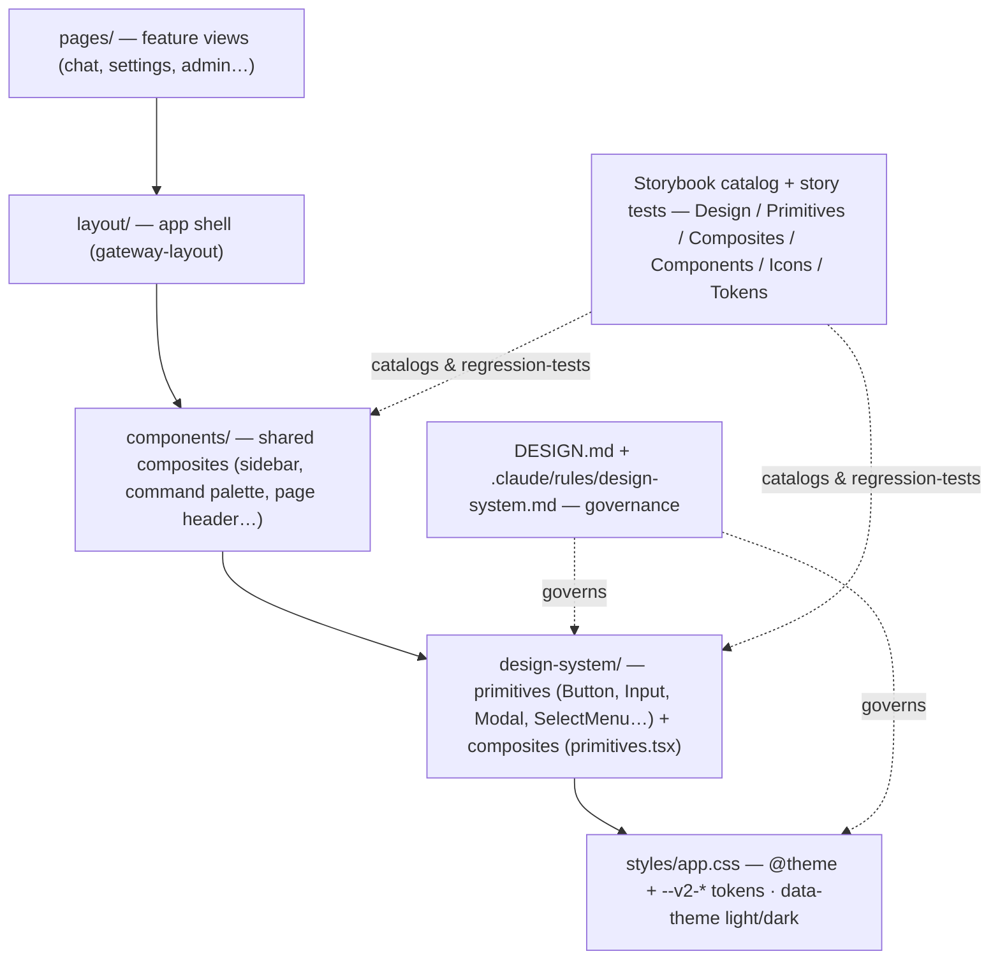

# IronClaw WebUI Design System — Storybook + Catalog (Executive Overview)

**Status:** Proposal, under review · **Authored against:** `origin/main` @ `d3791e0f8` · **Tracks:** three Epics — see [Epic ownership](#epic-ownership-canonical) below

**Documents:** [PROPOSAL.md](PROPOSAL.md) — the case, decisions & dependencies · [PLAN.md](PLAN.md) — phased execution · [CHECKLIST.md](CHECKLIST.md) — definition of done · [explorer.html](explorer.html) — self-contained interactive review aid (schematics + phase map; also published as a [claude.ai artifact](https://claude.ai/code/artifact/371a2622-054c-404a-8992-f110e1fa3d5a))

> **North star:** a *governed, catalogued* WebUI design system that carries IronClaw to an AI/agentic-first UX — realized **natively** on our React 19 + Tailwind v4 stack, reviewed and regression-tested through **Storybook**, and evolved in **five predefined phases**.

## Epic ownership (canonical)

This table is the **single source** for phase→Epic ownership across this package. [PLAN.md](PLAN.md), [CHECKLIST.md](CHECKLIST.md) and [explorer.html](explorer.html) name the owning Epic inline per phase/workstream and point back here rather than restating the mapping — when ownership changes, this table is the one edit. The program is tracked across three Epics (the original #7038 was split, then Phase 2 folded in with Phase 3):

| Epic | Phases | Scope |
|---|---|---|
| [#7038](https://github.com/nearai/ironclaw/issues/7038) | 1 | Storybook integration & design-system catalog — PR #7750 |
| [#7781](https://github.com/nearai/ironclaw/issues/7781) | 2–3 | `DESIGN.md` governance & documentation (#7042) · theme update & UI reskin — supersedes the closed #7733 |
| [#7782](https://github.com/nearai/ironclaw/issues/7782) | 4–5 | Agentic interactions & components · Information architecture |

## What this proposes

Formalize the design-system work already underway (Storybook integration + a catalogued primitive/component library) into a **benchmarked, phased program** to redefine the WebUI's theming, visual assets, interactions, and information architecture around an agent-first experience. Phases 1–2 are in flight — Phase 1 as PR [#7750](https://github.com/nearai/ironclaw/pull/7750) (recreated non-stacked off current `main`; supersedes the closed #7039) and Phase 2 as issue [#7042](https://github.com/nearai/ironclaw/issues/7042) (the closed #7043's changeset preserved, fresh PR to follow). **Neither is on `main` yet** — every `DESIGN.md` / Storybook / `.claude/rules/design-system.md` reference in this package describes what those two phases *land*, not what a reader can check out today ([PROPOSAL §2.3](PROPOSAL.md#23-foundations-in-flight-not-yet-on-main)). This package is the north-star that frames every phase and the dependencies they carry.

It deliberately follows two benchmarks: the **APDD governance kit** (an *external* kit — not vendored into this repo; docs-are-source-of-truth, a `DESIGN.md` constitution, Storybook-as-workbench/test/MCP, a design validation gate — its IronClaw evaluation is proposed at `docs/internal/apdd-governance-kit/` on [PR #7255](https://github.com/nearai/ironclaw/pull/7255), not yet on `main`) and the **target-crate-architecture package** ([`docs/internal/reborn/target-architecture/`](../target-architecture/README.md), PR #6918 — README/PROPOSAL/PLAN/CHECKLIST + interactive explorer). Reference paths and where each resolves: [PROPOSAL §11](PROPOSAL.md#11-references).

## Why this shape

1. **The work is already phased and partly shipped** — a north-star doc set makes the sequence, dependencies, and done-ness legible to reviewers instead of living only in an Epic checklist.
2. **Docs are the source of truth** (APDD Rule 1). `DESIGN.md` + the Storybook catalog govern how UI is built; this package records *why* and *in what order*.
3. **The riskiest work is ahead** (theme reskin, expressive motion, IA). Naming the dependencies now — and proposing how each is met — de-risks Phases 3–5.

## The layer map

Where the design system sits in the frontend, and what governs/catalogs it. **The five stacked nodes are relative to `crates/product/ironclaw_webui/frontend/src/`**; the two governance/catalog nodes are not paths under it — `DESIGN.md` lands at `crates/product/ironclaw_webui/frontend/DESIGN.md`, `.claude/rules/design-system.md` at the repository root, and the Storybook node names catalog sections rather than a directory:

## The five phases

*Scope and delivery state only — which Epic carries which phase is the [table above](#epic-ownership-canonical), the one place that mapping is written down.*

| Phase | Scope | Status | Ships as |
|---|---|---|---|
| **1** | Storybook integration + design-system catalog | In review | PR [#7750](https://github.com/nearai/ironclaw/pull/7750) (supersedes closed #7039) |
| **2** | `DESIGN.md` governance & guidelines | Ready, PR to follow #7750 | Issue [#7042](https://github.com/nearai/ironclaw/issues/7042) (old PR #7043 closed) |
| **3** | Theme update & UI reskin (tokens + assets) | Planned | — |
| **4** | Interaction & component updates (agentic-first) | Planned | — |
| **5** | Information architecture | Planned | — |

## Ownership boundary

This package is the **canonical design-system governance record**: it owns `DESIGN.md`, the `--v2-*` token architecture, the Storybook catalog/test-harness/MCP, and `.claude/rules/design-system.md`. Feature packages *consume* that governance instead of re-proposing it — including the OOBE package, whose D-F6 "DESIGN.md + design tokens" item is **subsumed** here, keeping only its pilot role (the OOBE card family is catalogued through this system). Full boundary, with the alternative call spelled out: [PROPOSAL §9](PROPOSAL.md#9-ownership-boundary-one-canonical-governance-record).

## Dependencies at a glance

The reskin/interaction phases carry hard prerequisites. Each has a proposed implementation **and a named owner** in [PROPOSAL §7](PROPOSAL.md#7-dependencies-and-their-implementation-proposals). The Epic on each line below is that *dependency's* owner, derived from its gating phase via the [ownership table](#epic-ownership-canonical) — it is a per-dependency attribution, not a second copy of the phase mapping — the owner is the Epic carrying the gating phase, made individual by a dependency sub-issue that must be cut and assigned before that phase's first PR opens:

- **Dark palette derivation** — the supplied M3 palette is light-only; the app is dark-default and dual-theme. *(gates Phase 3 · Epic #7781)*
- **WCAG AA contrast validation** for the high-chroma tokens — a standing invariant carried inside the palette work. *(gates Phase 3 · Epic #7781)*
- **Fonts** — vendor Roboto Flex/Mono (OFL); drop/replace Google Sans (not freely redistributable). *(gates Phase 3 · Epic #7781 · **[decision]**)*
- **Animation approach** — a spring/motion mechanism gated on `prefers-reduced-motion`; none installed today. *(gates Phase 4 · Epic #7782 · **[decision]**)*
- **CI: Playwright/Chromium** for `pnpm test:storybook` if story tests run in CI. *(cross-cutting · Epic #7038 · promotion to required is a **[decision]**)*
- **MSW** for network-backed component stories' happy paths. *(cross-cutting · Epic #7782)*

## How this aligns with the governance benchmarks

- **APDD kit** (external, not vendored) → this initiative *is* the kit's design-governance track: `DESIGN.md` (constitution + 5-tier taxonomy), path-scoped `.claude/rules/design-system.md`, Storybook as workbench + test-harness + agent-MCP, and a validation/REJECT gate. See [PROPOSAL §8](PROPOSAL.md#8-alignment-with-the-governance-benchmarks).
- **PR #6918** → this package copies its doc shape (README/PROPOSAL/PLAN/CHECKLIST + interactive artifact + a PR-body file table) and its conventions (provenance shas, phased waves with milestones, `⚠` ordering constraints, "Landed with #NNNN").

## What is explicitly *not* decided here

- Exact **token values**, the **animation library**, the **font substitute** for Google Sans, and the **IA/navigation** redesign — each is owned by its phase and resolved against `DESIGN.md` before it lands.
- Whether story tests become a **required CI gate** (proposed, not yet mandated — see PROPOSAL §7.1).

## How to review

1. Skim this README for the shape and the phase table.
2. Read [PROPOSAL.md](PROPOSAL.md) §1–§4 (decision + alternatives) and **§7 (dependencies)** — that's where the real risk lives.
3. Open [explorer.html](explorer.html) for the schematics and phase map — a self-contained page (no build step); render it in-browser via [html-preview](https://html-preview.github.io/?url=https://github.com/nearai/ironclaw/blob/docs/design-system-proposal/docs/internal/reborn/design-system/explorer.html) if you don't want to clone.
4. Challenge [CHECKLIST.md](CHECKLIST.md) (is this the right definition of done?) and argue [PLAN.md](PLAN.md) sequencing.
