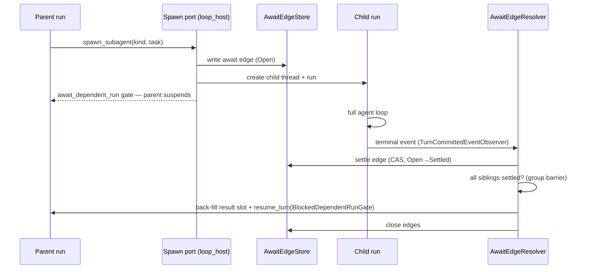
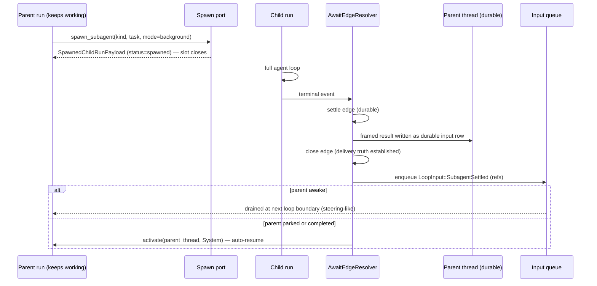

# Subagents

**Status:** Canonical — the one current document for subagent architecture,
design decisions, and roadmap.
**Last verified against code:** 2026-08-20, workspace @ `e4225c442`.
**Replaces (deleted 2026-08-20, recoverable from git history):**
`phase-1-contracts.md`, `phase-2-mechanisms.md`, `phase-3-integration.md`,
`thread-harness-design.md`, `pr2-pr6-shape.md`,
`research-background-enable.md`, `diagrams/`, and the implementation plan
`docs/internal/superpowers/plans/2026-08-19-subagent-background-slices-1-2.md`.
Those documents accumulated 7,000+ lines across three design generations;
mechanisms they described are now implemented, so the code is the source of
truth for mechanism and this file is the source of truth for *narrative,
decisions, and roadmap*. Where this file and the code disagree, the code and
its gates win and this file gets a dated correction
(`docs/internal/reborn/guidance-conventions.md`).

---

## 1. What a subagent is

A subagent is a **child agent turn**: a running agent invokes the
`builtin.spawn_subagent` capability, and the host creates a new thread and a
new run for the child. The child is a full IronClaw loop — its own thread,
run, profile, capability surface, and budget — not a lightweight task. Every
privileged effect it performs crosses the same kernel membrane as any other
run.

Two modes, one spawn surface:

- **Blocking** (ships today): the parent suspends on a gate until the child
  (and any siblings spawned under the same gate) finish; results are
  back-filled into the parent's transcript and the parent resumes.
- **Background** (accepted design, §4): the spawn returns a receipt
  immediately, the parent keeps working, and each child's result is delivered
  autonomously as it finishes.

Identity and lineage vocabulary (all owned by `ironclaw_host_api::turn` /
`ironclaw_common`): parent and child are linked by `parent_run_id` /
`spawn_tree_root_run_id` / `subagent_depth` on the run record, and by a
durable **await edge** (§2.2) in the process-dependency journal. The child's
kind (`SubagentKindId`, wire name `subagent_type`, legacy alias `flavor_id`)
selects its profile material.

Trust posture (root `AGENTS.md`): *subagent spawn creates and wires child
runs only* — planning, execution, capability calls, checkpointing, gates,
retries, and completion all continue through the existing
runner/driver/executor path. There is no subagent-specific execution lane.

## 2. What ships today — blocking mode

Verified end-to-end 2026-08-20. The capability is fully wired but
**deny-filtered in production** (§7): only tests exercise it.

### 2.1 Spawn path

`crates/loop/ironclaw_loop_host/src/subagent_spawn_port.rs` owns the
capability surface: `SpawnSubagentArgs { subagent_kind, task, handoff? }`,
argument codec, per-kind descriptors, spawn admission, and
`SubagentSpawnDeps` (which carries `Arc<dyn AwaitEdgeWriter>`). Today the
codec **rejects** `mode: "background"` (`background_subagents_disabled()`),
the parameters schema does not advertise `mode`, and `finish_spawn`
hard-codes `Blocking`. Child creation reserves spawn-tree capacity against
`spawn_tree_descendant_cap` (from `limits.max_tree_descendants`, journaled on
the run record).

### 2.2 The await edge

The durable parent↔child link, stored as a projection over the process
dependency journal: `crates/loop/ironclaw_turn_runner/src/subagent/await_edge/store.rs`.
An edge carries the child scope and thread id, the parent run id and run
context, the spawn `mode`, the `gate_ref` the parent is blocked on,
`group_ref` (sibling grouping — equal to `gate_ref` for blocking spawns), a
`state` (`Open → Settled → closed`), `terminal_kind`, and a
`reservation_release` tri-state. Store surface: `peek`, `list_group`,
`list_unclosed_for_scope`, `consume`, `close`. **The edge is the only durable
record that a child result exists but has not been delivered** — everything
downstream of it is reconstructible.

### 2.3 Settlement and delivery (blocking tail)

`crates/loop/ironclaw_turn_runner/src/subagent/await_edge/resolver.rs`
(`AwaitEdgeResolver<S>`). Wired to run-terminal events via
`as_turn_committed_event_observer` (see `turn_runner/src/runtime.rs`). On a
child terminal: `settle_and_maybe_drain` settles the edge, then
`drain_settled_group` proceeds only once **every** sibling under the same
`gate_ref` has settled (the group barrier), writes each sibling's framed
result into the parent transcript (`update_parent_result_reference` →
`thread_service.update_tool_result_reference`), resumes the parent exactly
once (`resume_turn` pinned to `ResumeTurnPrecondition::BlockedDependentRunGate`
so it can never unblock an approval/auth gate), and closes the edges.

Child text is **never delivered raw**: `subagent/untrusted_text.rs` frames
and sanitizes summaries (`wrap_untrusted_subagent_text`,
`sanitize_tool_result_summary`). The raw child transcript is human-only
(§7).

### 2.4 Dependency-inversion seams

`ironclaw_loop_host` cannot depend on `ironclaw_turn_runner`, so the seam is
two traits defined low and implemented high
(`crates/loop/ironclaw_loop_host/src/await_edge_port.rs`): `AwaitEdgeWriter`
(implemented by `AwaitEdgeStore`, decorated by `ScopeRecoveryDriver`) and
`AwaitEdgeSettler` (implemented by `AwaitEdgeResolver`). Composition builds
the concrete objects and erases them (`ironclaw_composition/src/runtime.rs`);
late `bind_*` trait methods exist because the resolver's thread-service
generic is unnameable after erasure. This is type-placement category 2
(permanent dependency-inversion seam).

### 2.5 Crash recovery

`subagent/await_edge/boot_recovery.rs` (`ScopeRecoveryDriver`) re-drives
`drain_settled_group` for settled-but-unclosed edges on restart, gated so a
recovering scope refuses new writes until reconciled
(`check_scope_recovered`).

### 2.6 Parallel children

Already structural: one edge per child, `group_ref` groups siblings,
`list_group` enumerates them, the drain barrier settles a group atomically,
and the tree-wide descendant cap bounds fan-out. Background mode reuses all
of it minus the barrier (§4.3).

### 2.7 Result payload

`crates/loop/ironclaw_turn_runner/src/subagent/spawn_result.rs`:
`SpawnedChildRunPayload { child_run_id, child_thread_id, flavor,
mode, status, output_available, final_text?, failure_summary?,
terminal_event? }` — snake_case wire shape, round-trip pinned (both `mode`
strings pinned since #7758). `mode` is `ironclaw_loop_host::SpawnSubagentMode`
(the single spawn-mode enum after #7758 collapsed the duplicate).

## 3. Slice 1 — activation primitives (shipped, #7752)

The wake half of background delivery landed ahead of the delivery half:

- **`ActivationProvenance`** (`System` / `ParentAgent` / `Human` …): why a
  run was activated on its thread. Set once at run creation, journaled in
  the `agent_turn` metadata (`subagent_activation_provenance`, alongside
  `subagent_depth` and `spawn_tree_descendant_cap`).
- **`activate()`** on `TurnCoordinator`: submit a system-initiated turn to a
  parked or completed thread — the auto-resume primitive. Forwarded by every
  production decorator (`CancelReconcilingTurnCoordinator` included; its
  initial omission was caught in review — the trait default fails closed).
- **Autonomous-wake streak cap**: derived from a bounded newest-first run
  query — after N consecutive non-`Human` activations on a thread, further
  autonomous wakes are refused until a human participates. This is the
  guardrail that makes fully-autonomous waking safe (§5, D5).

`activate()` has **no production caller yet** — deliberate staging. The
delivery design below wires it.

## 4. Background mode — accepted design (2026-08-20)

**The append model**: adopted from Claude Code's interaction model, carried
on IronClaw's durable substrate. A background spawn returns a receipt
immediately and the tool-result slot **closes** — the child's answer arrives
later as new conversation input, correlated by `child_run_id` from the
receipt. Nothing is back-filled; there is no gate and no `resume_turn`.

### 4.1 Delivery truth vs. attention

The design's load-bearing split: **the durable write to the parent thread is
the delivery; the queue entry and the wake are only attention.** The framed
result lands as a durable thread row (the same
row-plus-queue-entry pattern steering messages use — see
`ironclaw_loop_host/src/input_queue.rs`, whose entries bind to transcript
rows), and the await edge closes at that write. After that point the result
is in the parent's context regardless of what happens: a lost queue entry or
missed wake merely delays *attention*, never delivery — the parent's next
turn reads the thread and sees it. The production input queue is in-memory
(`InMemoryHostInputQueue`) and that is fine *because* of this split.

### 4.2 The three attention triggers

1. **Settle-time**: enqueue the typed input; if the parent has no live run,
   `activate(parent_thread, …, System)`. `ThreadBusy` is a benign no-op —
   the run-start sweep covers it.
2. **Run-start sweep**: on every run start/continue, settled-undelivered
   edges for the scope are drained (`list_unclosed_for_scope` filtered to the
   parent). Heals wake-vs-completion races.
3. **Boot pass**: restart re-drives settled edges at the resolver layer (no
   activate storm; never streak-capped).

One attempt per settled edge — the edge state is the dedupe.

### 4.3 What changes where

| Surface | Change |
| --- | --- |
| `ironclaw_loop_contracts` (`host/input.rs`) | new variant `LoopInput::SubagentSettled { … }` carrying **references only** (child run id + result/message refs — never content; kernel guardrail). Serde round-trip pinned; queue is in-memory so no rolling-row compat concern, but tolerant-reader tests land with the variant per `.claude/rules/types.md`. |
| `ironclaw_agent_loop` (`executor/input.rs`) | the variant drains **steering-like**: prompt-visible content input, not a control barrier. The `PostCapabilityStage::drain_settled` stub and its stale `LoopBackgroundChildPort` comment are **deleted** — the input path is the drain. |
| `ironclaw_turn_runner` (resolver) | background tail: settle → framed durable thread write → close edge → enqueue → maybe `activate`. Reuses `child_terminal_output` / summary framing from the blocking tail. Multi-edge sweep uses one thread-snapshot read + one CAS write across all pending pairs (O(E+M)), still delivered as one input per child. |
| `ironclaw_loop_host` (spawn port) | delete both codec rejections and `background_subagents_disabled()`; advertise `mode` in the parameters schema (enum `["blocking","background"]`, default `blocking`); thread `args.mode` through `finish_spawn`; background spawns return the immediate receipt payload instead of `await_dependent_run`. |
| prompts | `spawn_subagent_description.md` gains background wording. |

No new port, no `LOOP_PORT_OWNERS` row, no new crate edge — the resolver
reaches the enqueue seam over the already-inventoried
`turn_runner → loop_host` dependency, and the loop reaches nothing new at
all.

### 4.4 Mode scoping

Background edges have no gate and no group barrier: each child delivers
independently as it settles (§5, D6). A parent run completing while
background edges are open is **normal** — delivery continues via
activate/sweep — never abandonment. Blocking-mode semantics (barrier,
back-fill, resume) are unchanged; the resolver is one settlement engine with
two delivery tails.

## 5. Decision log

Dated, with rationale and reversibility. Older decisions inherited from the
2026-08-19 shape gate are marked ◇; 2026-08-20 decisions were taken during
the append-model design review.

- **D1 ◇ Extend, don't fork.** Background mode extends the landed blocking
  path (spawn port, edges, resolver) — no new crate, no cargo feature, no
  parallel machinery.
- **D2 (2026-08-20) Append model over back-fill drain port.** The
  alternative — a drain port on the loop's host bundle pulling settled
  results into tool-result slots — would cost a new trait + frozen
  `LOOP_PORT_OWNERS` row + 8 host-impl updates + bespoke retry, and the shape
  doc's original sketch ("a small trait in `ironclaw_agent_loop`") is
  **impossible**: `ironclaw_agent_loop` is contracts-only by a
  crate-specific boundary rule, and a stage dependency has no plumbing path
  (`DefaultExecutorPipeline::default()` inside a fixed-signature trait
  method). The append model reuses `LoopInputPort` — which *is* the "existing
  loop-host port surface" that sketch offered as its alternative. Reversal:
  moderate; the variant and enqueue site are contained.
- **D3 (2026-08-20) Delivery truth = durable thread write; edge closes
  there.** Queue and wake are attention only (§4.1). Makes the in-memory
  queue acceptable and collapses the delivery-guarantee analysis to one CAS
  write. Reversal: cheap (close the edge later at ack instead).
- **D4 (2026-08-20) `SubagentSettled` carries refs, drains steering-like.**
  Content stays in durable rows (kernel rule: lifecycle metadata and
  references only); the variant is prompt-visible, not a control barrier.
- **D5 (2026-08-20) Fully autonomous wakes.** `activate(System)` fires for
  parked *and* completed parent threads; the slice-1 streak cap, provenance,
  `ThreadBusy` no-op, and settled-state dedupe are the guardrails. A
  quieter policy (deliver silently to completed threads + notify the user
  inbox, #7697) was considered and deliberately not taken — it remains a
  one-line policy change at the single wake site if autonomous waking proves
  too aggressive. Two-way door.
- **D6 (2026-08-20) Per-child delivery beat.** Each background child
  delivers as it finishes (Claude Code behavior; parent can act on early
  results). Batch-on-group was rejected: blocking mode already provides
  wait-for-all. Reversal: cheap — a batching policy at the settle site.
- **D7 (2026-08-20) No additional sanitization scan initially.** The child
  is a full IronClaw loop behind the same membrane, sandbox-exit scrubbing,
  and model-output safety as any run, and its delivered text is already
  framed as untrusted (§2.3 — that framing stays). The previously planned
  drain-site scan (`SafetyLayer` — both candidate functions currently have
  zero production callers, tracked in #7391) is **deferred, not deleted**:
  re-decide at the production-enable slice (§6, R8 checkpoint) while the
  capability is still deny-filtered. Two-way door: one call at one write
  site.
- **D8 ◇ Enable last.** Production enablement (clearing
  `builtin.spawn_subagent` from `disabled_capability_ids`) happens only
  after observe/steer/cancel surfaces exist (§6) — more conservative than
  the original design's enable-after-PR2, at the cost of one line to change
  our mind.
- **D9 ◇ Not in scope**: `TurnOwner` vs `TurnThreadOwner` stay separate
  types (ownership shape vs resolution disposition); no stored counters;
  never append to `completion_observer.rs`; new files < 800 lines;
  `subagent_spawn_port.rs` test-support ratchet stays frozen.

## 6. Roadmap

Slice 1 shipped (#7752, plus the #7755/#7758 vocabulary cleanup). Remaining
work, in order — names map to the retired shape doc's slices for continuity:

| # | Work | Contents | Was |
| --- | --- | --- | --- |
| R2 | **Background core** | Everything in §4.3 + integration tests: per-child beat, three-trigger healing, `ThreadBusy` heal, crash-replay idempotency, batched-write count seam | slice 2 (reshaped: append model replaces wake-only Tasks 8–9) |
| R3 | **Gate escalation walk** | A blocked child (approval/auth) escalates to its parent; prod-enable gate | slice 4 |
| R4 | **Counters, operator command, e2e revival** | `ResolveReport` counters; `ironclaw subagent edges`; un-ignore the five e2e tests via harness-side enablement; boot-recovery fairness | slice 5 |
| R5 | **`subagent_inspect` + per-kind config** | Model-facing status/gate/byte-count metadata (never raw transcript); per-kind budget + model override | slice 6 |
| R6 | **`subagent_extend` + human priority** | `activate(child, …, ParentAgent)` with consent-to-wake + budget window; `human_waiting` reservation marker | slice 7 |
| R7 | **WebUI child tree** | `GET …/threads/{id}/children` lineage projection; `ThreadTree` sidebar; raw-vs-framed display rule; interrupt & take over | slice 8 |
| R8 | **`subagent_cancel`** (security review) + **scan checkpoint** | Model-facing cancel with clean tree teardown; **re-decide D7** (drain-site scan) here, before enable | slice 9 (+ deferred slice 3) |
| R9 | **Production enable** | Clear the deny filter; reconcile the `tool_call.rs` disabled-behavior tests | slice 10 |

Navigation parity with Claude Code, for orientation: `/tasks` ≈ R5 inspect,
opening a subagent ≈ R7 tree + transcript, `SendMessage` ≈ R6 extend,
`TaskStop` ≈ R8 cancel.

## 7. Invariants

Things no slice may break; each is enforced or pinned today.

- **Deny-filtered until R9.** `builtin.spawn_subagent` sits in
  `disabled_capability_ids` (`turn_runner/src/runtime.rs`,
  `TEMP(disable-spawn-subagents)` markers); `tests/integration/tool_call.rs`
  pins the disabled behavior; five e2e tests in
  `tests/reborn_subagent_spawn_e2e.rs` are `#[ignore]`d until R4.
- **No stage skipping.** Child runs execute through the standard
  runner/driver/executor path and the capability membrane; spawn only
  creates and wires.
- **Untrusted child text.** Delivered child content is framed and
  sanitized (§2.3); raw child transcripts are human-only surfaces (R7).
- **Autonomous wakes are capped.** Every `activate` carries provenance; the
  streak cap refuses runaway non-human wake chains.
- **`ironclaw_agent_loop` stays contracts-only.** Its boundary rule forbids
  `turn_runner`/`loop_host` imports; the layer-matrix exception register is
  pinned empty. Loop ports are defined only in `ironclaw_loop_contracts`
  (`LOOP_PORT_OWNERS` ratchet); same-layer crate edges are inventoried as an
  equality (`reborn_same_layer_edge_inventory.rs`).
- **One spawn-mode enum.** `SpawnSubagentMode` in `ironclaw_loop_host`;
  wire strings `blocking`/`background` round-trip pinned (#7758).
- **Resume stays precondition-pinned.** Blocking resume targets
  `BlockedDependentRunGate` only.
- **LLM data is never deleted**; edges and results are marked/closed, not
  erased.

## 8. Code and test map

| What | Where |
| --- | --- |
| Spawn capability port, args codec, kind descriptors | `crates/loop/ironclaw_loop_host/src/subagent_spawn_port.rs` |
| Await-edge seam traits (`AwaitEdgeWriter`/`AwaitEdgeSettler`) | `crates/loop/ironclaw_loop_host/src/await_edge_port.rs` |
| Edge store / resolver / boot recovery / untrusted framing | `crates/loop/ironclaw_turn_runner/src/subagent/await_edge/{store,resolver,boot_recovery}.rs`, `subagent/untrusted_text.rs` |
| Result payload wire types | `crates/loop/ironclaw_turn_runner/src/subagent/spawn_result.rs` |
| Loop input contract (`LoopInput`, `LoopInputPort`) | `crates/contracts/ironclaw_loop_contracts/src/host/input.rs` |
| Input queue + adapters | `crates/loop/ironclaw_loop_host/src/{input_queue,input_port}.rs` |
| Executor input drain | `crates/loop/ironclaw_agent_loop/src/executor/input.rs` |
| `activate()`, provenance, streak cap | `crates/kernel/ironclaw_turns/src/coordinator.rs` + `process_projection/` (journaled metadata) |
| Composition wiring | `crates/app/ironclaw_composition/src/runtime.rs` |
| Integration scenarios (edges) | `tests/integration/subagent_await_edge.rs` (`reborn_integration_subagent_await_edge`) |
| Disabled-capability pins | `tests/integration/tool_call.rs` |
| E2E suite (ignored until R4) | `tests/reborn_subagent_spawn_e2e.rs` |

Family rules: `crates/loop/AGENTS.md` and per-crate `AGENTS.md`/`README.md`
files govern placement; `tests/integration/CLAUDE.md` governs scenario
authoring; update `tests/CLAUDE.md` rows in the same commit as any scenario
change.
