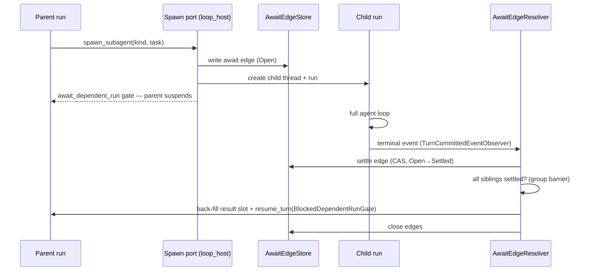

# Subagents

**Status:** Canonical — the one current document for subagent architecture,
design decisions, and roadmap.
**Last verified against code:** 2026-08-20, workspace @ `e4225c442`.
**Replaces (deleted 2026-08-20, recoverable from git history):**
`phase-1-contracts.md`, `phase-2-mechanisms.md`, `phase-3-integration.md`,
`thread-harness-design.md`, `pr2-pr6-shape.md`,
`research-background-enable.md`, `diagrams/`, and the implementation plan
`docs/internal/superpowers/plans/2026-08-19-subagent-background-slices-1-2.md`.
Those documents accumulated 7,000+ lines across three design generations;
mechanisms they described are now implemented, so the code is the source of
truth for mechanism and this file is the source of truth for *narrative,
decisions, and roadmap*. Where this file and the code disagree, the code and
its gates win and this file gets a dated correction
(`docs/internal/reborn/guidance-conventions.md`).

**Structure:** Part I (§1–§8) is the stable record — expected experience,
current architecture, design rationale, scenario behavior, decisions,
roadmap, invariants. Part II (§9) is the *living* implementation plan for
the pending slice; it shrinks as work ships and is replaced by the next
slice's plan.

---

## 1. What a subagent is

A subagent is a **child agent turn**: a running agent invokes the
`builtin.spawn_subagent` capability, and the host creates a new thread and a
new run for the child. The child is a full IronClaw loop — its own thread,
run, profile, capability surface, and budget — not a lightweight task. Every
privileged effect it performs crosses the same kernel membrane as any other
run.

Two modes, one spawn surface:

- **Blocking** (ships today): the parent suspends on a gate until the child
  (and any siblings spawned under the same gate) finish; results are
  back-filled into the parent's transcript and the parent resumes.
- **Background** (accepted design, §4): the spawn returns a receipt
  immediately, the parent keeps working, and each child's result is delivered
  autonomously as it finishes.

Identity and lineage vocabulary (all owned by `ironclaw_host_api::turn` /
`ironclaw_common`): parent and child are linked by `parent_run_id` /
`spawn_tree_root_run_id` / `subagent_depth` on the run record, and by a
durable **await edge** (§2.2) in the process-dependency journal. The child's
kind (`SubagentKindId`, wire name `subagent_type`, legacy alias `flavor_id`)
selects its profile material.

Trust posture (root `AGENTS.md`): *subagent spawn creates and wires child
runs only* — planning, execution, capability calls, checkpointing, gates,
retries, and completion all continue through the existing
runner/driver/executor path. There is no subagent-specific execution lane.

### 1.1 Expected experience

What the finished feature feels like, before any mechanism:

- The agent says "I'll research those three vendors in parallel" and calls
  `spawn_subagent` three times with `mode: "background"`. Each call returns
  instantly with a receipt; the conversation keeps moving.
- Two minutes later the first researcher finishes. If the parent is
  mid-thought, the result simply appears in its context at the next natural
  pause (a loop boundary). If the user walked away and the parent went
  idle — or the conversation had already ended — the parent **wakes on its
  own**, folds the result in, and continues or reports. No one polls; no
  one refreshes.
- Results arrive one by one as children finish (per-child beat), so the
  agent can act on early findings — steer the remaining children, spawn a
  follow-up, or give the user a partial answer.
- A server restart in the middle loses nothing: results are durable the
  moment they're written, and delivery resumes on boot.
- Later slices add the observability shell: list your running subagents and
  their status (R5), open one and read its transcript in the WebUI tree
  (R7), send a running child more instructions (R6), cancel one (R8) —
  deliberately the same verbs Claude Code users know as `/tasks`,
  opening a task, `SendMessage`, and `TaskStop`.

## 2. What ships today — blocking mode

Verified end-to-end 2026-08-20. The capability is fully wired but
**deny-filtered in production** (§7): only tests exercise it.



### 2.1 Spawn path

`crates/loop/ironclaw_loop_host/src/subagent_spawn_port.rs` owns the
capability surface: `SpawnSubagentArgs { subagent_kind, task, handoff? }`,
argument codec, per-kind descriptors, spawn admission, and
`SubagentSpawnDeps` (which carries `Arc<dyn AwaitEdgeWriter>`). Today the
codec **rejects** `mode: "background"` (`background_subagents_disabled()`),
the parameters schema does not advertise `mode`, and `finish_spawn`
hard-codes `Blocking`. Child creation reserves spawn-tree capacity against
`spawn_tree_descendant_cap` (from `limits.max_tree_descendants`, journaled on
the run record).

### 2.2 The await edge

The durable parent↔child link, stored as a projection over the process
dependency journal: `crates/loop/ironclaw_turn_runner/src/subagent/await_edge/store.rs`.
An edge carries the child scope and thread id, the parent run id and run
context, the spawn `mode`, the `gate_ref` the parent is blocked on,
`group_ref` (sibling grouping — equal to `gate_ref` for blocking spawns), a
`state` (`Open → Settled → closed`), `terminal_kind`, and a
`reservation_release` tri-state. Store surface: `peek`, `list_group`,
`list_unclosed_for_scope`, `consume`, `close`. **The edge is the only durable
record that a child result exists but has not been delivered** — everything
downstream of it is reconstructible.

### 2.3 Settlement and delivery (blocking tail)

`crates/loop/ironclaw_turn_runner/src/subagent/await_edge/resolver.rs`
(`AwaitEdgeResolver<S>`). Wired to run-terminal events via
`as_turn_committed_event_observer` (see `turn_runner/src/runtime.rs`). On a
child terminal: `settle_and_maybe_drain` settles the edge, then
`drain_settled_group` proceeds only once **every** sibling under the same
`gate_ref` has settled (the group barrier), writes each sibling's framed
result into the parent transcript (`update_parent_result_reference` →
`thread_service.update_tool_result_reference`), resumes the parent exactly
once (`resume_turn` pinned to `ResumeTurnPrecondition::BlockedDependentRunGate`
so it can never unblock an approval/auth gate), and closes the edges.

Child text is **never delivered raw**: `subagent/untrusted_text.rs` frames
and sanitizes summaries (`wrap_untrusted_subagent_text`,
`sanitize_tool_result_summary`). The raw child transcript is human-only
(§7).

### 2.4 Dependency-inversion seams

`ironclaw_loop_host` cannot depend on `ironclaw_turn_runner`, so the seam is
two traits defined low and implemented high
(`crates/loop/ironclaw_loop_host/src/await_edge_port.rs`): `AwaitEdgeWriter`
(implemented by `AwaitEdgeStore`, decorated by `ScopeRecoveryDriver`) and
`AwaitEdgeSettler` (implemented by `AwaitEdgeResolver`). Composition builds
the concrete objects and erases them (`ironclaw_composition/src/runtime.rs`);
late `bind_*` trait methods exist because the resolver's thread-service
generic is unnameable after erasure. This is type-placement category 2
(permanent dependency-inversion seam).

### 2.5 Crash recovery

`subagent/await_edge/boot_recovery.rs` (`ScopeRecoveryDriver`) re-drives
`drain_settled_group` for settled-but-unclosed edges on restart, gated so a
recovering scope refuses new writes until reconciled
(`check_scope_recovered`).

### 2.6 Parallel children

Already structural: one edge per child, `group_ref` groups siblings,
`list_group` enumerates them, the drain barrier settles a group atomically,
and the tree-wide descendant cap bounds fan-out. Background mode reuses all
of it minus the barrier (§4.3).

### 2.7 Result payload

`crates/loop/ironclaw_turn_runner/src/subagent/spawn_result.rs`:
`SpawnedChildRunPayload { child_run_id, child_thread_id, flavor,
mode, status, output_available, final_text?, failure_summary?,
terminal_event? }` — snake_case wire shape, round-trip pinned (both `mode`
strings pinned since #7758). `mode` is `ironclaw_loop_host::SpawnSubagentMode`
(the single spawn-mode enum after #7758 collapsed the duplicate).

## 3. Slice 1 — activation primitives (shipped, #7752)

The wake half of background delivery landed ahead of the delivery half:

- **`ActivationProvenance`** (`System` / `ParentAgent` / `Human` …): why a
  run was activated on its thread. Set once at run creation, journaled in
  the `agent_turn` metadata (`subagent_activation_provenance`, alongside
  `subagent_depth` and `spawn_tree_descendant_cap`).
- **`activate()`** on `TurnCoordinator`: submit a system-initiated turn to a
  parked or completed thread — the auto-resume primitive. Forwarded by every
  production decorator (`CancelReconcilingTurnCoordinator` included; its
  initial omission was caught in review — the trait default fails closed).
- **Autonomous-wake streak cap**: derived from a bounded newest-first run
  query — after N consecutive non-`Human` activations on a thread, further
  autonomous wakes are refused until a human participates. This is the
  guardrail that makes fully-autonomous waking safe (§5, D5).

`activate()` has **no production caller yet** — deliberate staging. The
delivery design below wires it.

## 4. Background mode — accepted design (2026-08-20)

**The append model**: adopted from Claude Code's interaction model, carried
on IronClaw's durable substrate. A background spawn returns a receipt
immediately and the tool-result slot **closes** — the child's answer arrives
later as new conversation input, correlated by `child_run_id` from the
receipt. Nothing is back-filled; there is no gate and no `resume_turn`.

```mermaid
sequenceDiagram
    participant P as Parent run (keeps working)
    participant SP as Spawn port
    participant C as Child run
    participant R as AwaitEdgeResolver
    participant T as Parent thread (durable)
    participant Q as Input queue
    P->>SP: spawn_subagent(kind, task, mode=background)
    SP-->>P: SpawnedChildRunPayload (status=spawned) — slot closes
    C->>C: full agent loop
    C->>R: terminal event
    R->>R: settle edge (durable)
    R->>T: framed result appended (idempotent) — edge → ResultAppended
    alt parent has a live run
        R->>Q: enqueue LoopInput::SubagentSettled (refs)
        Q-->>P: drained at next loop boundary (steering-like)
    else parent parked or completed
        R->>P: activate(parent_thread, System) — auto-resume
    end
    R->>R: attention accepted — edge → AttentionScheduled, then closed
    Note over R: any refusal leaves the edge in ResultAppended —
the sweeps retry; the obligation is durable
```

### 4.1 Delivery truth, attention obligation

Two durable facts, in order, and the edge tracks both:

```text
Open → Settled → ResultAppended { message_ref }
     → AttentionScheduled { queued | activated | suppressed_streak_cap }
     → closed
```

**Delivery** is the idempotent append of the framed result to the parent
thread (the steering pattern: `accept_inbound_message` →
`mark_message_queued` → `enqueue_queued_message`, rows bound to queue
entries — `ironclaw_loop_host/src/{input_queue,durable_input_queue}.rs`).
The accepted `message_ref` is persisted **on the edge**
(`ResultAppended`), which is what makes retry idempotent: a crash between
append and the next transition finds the ref and does not mint a second
row.

**Attention** — the queue entry or the wake — is a separate durable
obligation. The edge closes only after attention has a durable outcome:
the input was accepted into a live run's queue (`queued`), an activation
was accepted (`activated`), or the autonomous streak cap intentionally
suppressed the wake (`suppressed_streak_cap` — the row stays visible to
the next permitted or human-initiated activation). Every refusal —
`RunClosed` (the parent raced to terminal: a transition signal, not a
success), `CapacityExhausted`, a transient activation failure, a crash at
any boundary — leaves the edge in `ResultAppended`, where the recovery
sweeps (§4.2) are still obligated to it. A parked parent can therefore
never be stranded with a delivered-but-unannounced result: the promise of
autonomous delivery is carried by durable state, not by a hope that the
parent happens to run again.

Production composes the durable filesystem-backed queue
(`durable_input_queue.rs`; in-memory is test-only), so queue entries also
survive restart — belt and suspenders on top of the obligation, not a
substitute for it.

### 4.2 The three attention triggers

1. **Settle-time**: append (idempotent), then schedule attention — enqueue
   into the parent's live run, or `activate(parent_thread, …, System)` if
   there is none. Any refusal leaves the edge in `ResultAppended` for the
   sweeps; `RunClosed` re-queries parent state and retries as parked.
2. **Run-start sweep**: hooked at the runner's claimed-run admission seam
   (`execute_claimed_run`, `turn_runner/src/turn_scheduler.rs`) — **not**
   `check_scope_recovered`, which is a spawn-finalization hook on the child
   scope. On parent run start, edges in `ResultAppended` (and
   `suppressed_streak_cap`) for that thread are enqueued into the starting
   run and closed. Thread-indexed, bounded per start.
3. **Boot pass**: restart re-drives `Settled`/`ResultAppended` edges
   through the same deliver path, **including activation of parked
   parents** — autonomous delivery is a product promise, so boot may wake;
   the streak cap still applies and the pass is paginated with per-tenant
   fairness bounds (the R4 boot-recovery fairness work).

The persisted edge state is the dedupe and the retry ledger: one durable
obligation per child, retried with bounded backoff until closed or
intentionally suppressed.

### 4.3 What changes where

| Surface | Change |
| --- | --- |
| `ironclaw_loop_contracts` (`host/input.rs`) | new variant `LoopInput::SubagentSettled { … }` carrying **references only** (child run id + result/message refs — never content; kernel guardrail). Serde round-trip pinned; queue is in-memory so no rolling-row compat concern, but tolerant-reader tests land with the variant per `.claude/rules/types.md`. |
| `ironclaw_agent_loop` (`executor/input.rs`) | the variant drains **steering-like**: prompt-visible content input, not a control barrier. The `PostCapabilityStage::drain_settled` stub and its stale `LoopBackgroundChildPort` comment are **deleted** — the input path is the drain. |
| `ironclaw_turn_runner` (resolver) | background tail: settle → idempotent append (`ResultAppended{message_ref}` on the edge) → schedule attention (enqueue or activate) → `AttentionScheduled` → close. Reuses `child_terminal_output` / summary framing from the blocking tail. Writes are per-edge (append, transition, enqueue are separate operations on existing interfaces); coalescing attention across simultaneous settles is an optional later optimization, not a normative claim. One typed input per child either way (D6). |
| `ironclaw_loop_host` (spawn port) | delete both codec rejections and `background_subagents_disabled()`; advertise `mode` in the parameters schema (enum `["blocking","background"]`, default `blocking`); thread `args.mode` through `finish_spawn`; background spawns return the immediate receipt payload instead of `await_dependent_run`. |
| prompts | `spawn_subagent_description.md` gains background wording. |

No new port, no `LOOP_PORT_OWNERS` row, no new crate edge — the resolver
reaches the enqueue seam over the already-inventoried
`turn_runner → loop_host` dependency, and the loop reaches nothing new at
all.

### 4.4 Mode scoping

Background edges have no gate and no group barrier: each child delivers
independently as it settles (§5, D6). A parent run completing while
background edges are open is **normal** — delivery continues via
activate/sweep — never abandonment. Blocking-mode semantics (barrier,
back-fill, resume) are unchanged; the resolver is one settlement engine with
two delivery tails.

### 4.5 Why this design — the rejected alternatives

The organizing observation: **nothing here polls.** In blocking mode, in the
append design, and in Claude Code alike, every arrow points *away* from the
child — the parent never asks "is my child done?". What the candidates
actually differed on was what happens to the tool-result slot the spawn call
leaves behind, and how the answer crosses back into a crate
(`ironclaw_agent_loop`) that is forbidden from seeing the resolver.

| Candidate | Fate | Deciding facts |
| --- | --- | --- |
| A small drain trait defined in `ironclaw_agent_loop`, implemented by the runner (the original sketch) | **Impossible** — measured, not judged | `ironclaw_agent_loop` has a crate-specific boundary rule permitting contracts-layer dependencies only (exception register pinned empty), so no host impl could be named; and the stage is built by `DefaultExecutorPipeline::default()` inside a fixed-signature trait method — a constructor-injected dependency has no plumbing path at all. |
| A new `Loop*Port` drain on the host bundle, pulling settled results into tool-result slots each turn | Rejected | Costs a new trait + a frozen `LOOP_PORT_OWNERS` registry row + updates to 8 host implementations + bespoke retry semantics — and still needs the edge store underneath. Keeps results attached to their originating tool call, which is the one thing the append model gives up. |
| **Append: a typed variant on the existing input path** | **Adopted** | Zero new surface: `LoopInput` already carries structured settlement (`GateResolved { gate_ref }` is the exact shape), the loop already polls `LoopInputPort` every boundary, and steering already uses the durable-row-plus-queue-entry delivery pattern the result reuses. Matches the interaction model users know from Claude Code. |

Two properties fell out of the adopted shape rather than being designed in,
and both are load-bearing:

- **Queue loss is harmless** because delivery truth is the durable thread
  write (§4.1) — the queue and the wake only carry *attention*. Production's
  queue is itself durable, but the design holds even where it is not.
- **Claude Code parity comes with strictly stronger guarantees.** Claude
  Code's completion notification is fire-and-forget and dies with the
  harness; here a lost wake is healed by the run-start sweep and boot pass,
  autonomous wakes carry provenance and a streak cap, sibling groups settle
  atomically, and child text is framed as untrusted before any parent model
  sees it.

### 4.6 One parent, both modes, in parallel

The two tails coexist on one parent. The worked scenario below exercises
almost every rule at once: a parent spawns one background child, then a
blocking group of two, and the background child finishes *while the parent
is suspended* on the blocking gate.

```mermaid
sequenceDiagram
    participant P as Parent run
    participant R as Resolver
    participant B1 as Background child
    participant G1 as Blocking child A
    participant G2 as Blocking child B
    P->>B1: spawn(mode=background) — receipt, slot closes
    P->>G1: spawn (blocking group)
    P->>G2: spawn (blocking group)
    Note over P: suspends on await_dependent_run gate
    B1->>R: terminal — settle edge
    R->>P: framed result → durable thread row + queued input
    R--xP: activate? ThreadBusy (run exists, blocked) — benign no-op
    G1->>R: terminal — settle; barrier holds (B still open)
    G2->>R: terminal — settle; group complete
    R->>P: back-fill both results + resume_turn(BlockedDependentRunGate)
    Note over P: resumes — next loop boundary drains the queued
    Note over P: background input; all three results in context
```

Nothing is lost and nothing is faked: the background result could not wake
the suspended parent (`ThreadBusy`), but its durable thread write already
happened, so the moment the blocking drain resumes the parent, the queued
input — and, failing even that, the transcript itself — carries it forward.
The resume that ends the suspension is precondition-pinned to the dependent-
run gate, so a settling child can never accidentally satisfy an approval or
auth gate.

**Scenario matrix** — child-settles event × parent state (triggers from
§4.2):

| Parent state when a background child settles | What happens | Delivered by |
| --- | --- | --- |
| Running, mid-turn | durable thread write + queued input | next loop-boundary drain |
| Suspended on its own gate (approval, auth, blocking spawn) | write + queue; `activate` → `ThreadBusy` no-op | drain on resume; gates untouched |
| Parked between turns / thread completed | append → `ResultAppended`; no live run to queue into | `activate(…, System)` accepted → `AttentionScheduled(activated)` (D5) |
| Parent races to terminal mid-delivery (`RunClosed`) | transition signal, not success — edge stays `ResultAppended` | re-query state, retry as parked; sweeps back it up |
| Enqueue refused (`CapacityExhausted` / unavailable) | edge stays `ResultAppended` — bounded retry, never loss | run-start sweep / boot pass |
| Autonomous-streak cap exhausted | `AttentionScheduled(suppressed_streak_cap)` — recorded, not dropped | next permitted or human activation's run-start sweep |
| Process crashed after settle, before append | edge `Settled`; persisted ref absent | boot pass re-runs the idempotent append |
| Process crashed after append, before attention | edge `ResultAppended` with `message_ref` | boot pass schedules attention (may activate — §4.2) |
| Parent run reached terminal with edges still open | normal delivery continues (§4.4 — never abandonment) | activate / sweep; explicit tree teardown is R8 |
| Many children settle at once | one snapshot read + one CAS write across all pending | still one input per child (D6) |

And the child-side gates: a child blocked on **its own** approval or auth
gate has produced no terminal event, so its edge stays `Open` and nothing
delivers — a blocking parent keeps waiting, a background parent keeps
working. Today that block is silent from the parent's side; surfacing and
escalating it to the parent is exactly R3 (the gate-escalation walk), and
child gate state becomes inspectable at R5.

## 5. Decision log

Dated, with rationale and reversibility. Older decisions inherited from the
2026-08-19 shape gate are marked ◇; 2026-08-20 decisions were taken during
the append-model design review.

- **D1 ◇ Extend, don't fork.** Background mode extends the landed blocking
  path (spawn port, edges, resolver) — no new crate, no cargo feature, no
  parallel machinery.
- **D2 (2026-08-20) Append model over back-fill drain port.** Full
  comparison and the measured impossibility of the original sketch: §4.5.
  The append model reuses `LoopInputPort` — which *is* the "existing
  loop-host port surface" the retired shape doc offered as its alternative.
  Reversal: moderate; the variant and enqueue site are contained.
- **D3 (2026-08-20, amended same day) Delivery truth = idempotent durable
  append; the edge survives until attention has a durable outcome.** As
  first written, D3 closed the edge at the thread write — the #7763 design
  review showed that strands parked/completed parents whenever the process
  dies (or enqueue/activation is refused) between close and attention: the
  result exists in history but nothing is obligated to announce it. The
  edge now carries the full obligation (§4.1 state machine); closing early
  was the reversal path D3 originally reserved, exercised in review rather
  than production.
- **D4 (2026-08-20) `SubagentSettled` carries refs, drains steering-like.**
  Content stays in durable rows (kernel rule: lifecycle metadata and
  references only); the variant is prompt-visible, not a control barrier.
- **D5 (2026-08-20) Fully autonomous wakes.** `activate(System)` fires for
  parked *and* completed parent threads; the slice-1 streak cap, provenance,
  `ThreadBusy` no-op, and settled-state dedupe are the guardrails. A
  quieter policy (deliver silently to completed threads + notify the user
  inbox, #7697) was considered and deliberately not taken — it remains a
  one-line policy change at the single wake site if autonomous waking proves
  too aggressive. Two-way door.
- **D6 (2026-08-20) Per-child delivery beat.** Each background child
  delivers as it finishes (Claude Code behavior; parent can act on early
  results). Batch-on-group was rejected: blocking mode already provides
  wait-for-all. Reversal: cheap — a batching policy at the settle site.
- **D7 (2026-08-20) No additional sanitization scan initially.** The child
  is a full IronClaw loop behind the same membrane, sandbox-exit scrubbing,
  and model-output safety as any run, and its delivered text is already
  framed as untrusted (§2.3 — that framing stays). The previously planned
  drain-site scan (`SafetyLayer` — both candidate functions currently have
  zero production callers, tracked in #7391) is **deferred, not deleted**:
  re-decide at the production-enable slice (§6, R8 checkpoint) while the
  capability is still deny-filtered. Two-way door: one call at one write
  site.
- **D8 ◇ Enable last.** Production enablement (clearing
  `builtin.spawn_subagent` from `disabled_capability_ids`) happens only
  after observe/steer/cancel surfaces exist (§6) — more conservative than
  the original design's enable-after-PR2, at the cost of one line to change
  our mind.
- **D10 (2026-08-20, from the #7763 design review) Foundational
  contracts land before their slices.** Backpressure (attention shares the
  run queue's 32-entry cap; refusal = bounded retry via the obligation,
  never loss, never reserved capacity), cumulative autonomy budgets
  (active children and autonomous activations per parent/root/tenant,
  token/wall-time ceilings, gate-wait deadlines) and root/subtree
  cancellation semantics (including held reservations and
  already-appended partial results) are *documented contracts* the R2 edge
  schema must be able to express, implemented at their owning slices
  (R5/R8/R9). Lifecycle taxonomy beyond terminal states
  (awaiting-input/approval, stuck, timed-out, attention-pending,
  delivered) is an R5 inspect-contract requirement; terminal attempts stay
  immutable — a retry is a new attempt.
- **D9 ◇ Not in scope**: `TurnOwner` vs `TurnThreadOwner` stay separate
  types (ownership shape vs resolution disposition); no stored counters;
  never append to `completion_observer.rs`; new files < 800 lines;
  `subagent_spawn_port.rs` test-support ratchet stays frozen.

## 6. Roadmap

Slice 1 shipped (#7752, plus the #7755/#7758 vocabulary cleanup). Remaining
work, in order — names map to the retired shape doc's slices for continuity:

| # | Work | Contents | Was |
| --- | --- | --- | --- |
| R2 | **Background core** | Everything in §4.3 + integration tests: per-child beat, three-trigger healing, `ThreadBusy` heal, crash-replay idempotency, batched-write count seam | slice 2 (reshaped: append model replaces wake-only Tasks 8–9) |
| R3 | **Gate escalation walk** | A blocked child (approval/auth) escalates to its parent; prod-enable gate | slice 4 |
| R4 | **Counters, operator command, e2e revival** | `ResolveReport` counters; `ironclaw subagent edges`; un-ignore the five e2e tests via harness-side enablement; boot-recovery fairness | slice 5 |
| R5 | **`subagent_inspect` + per-kind config** | Model-facing status/gate/byte-count metadata (never raw transcript); per-kind budget + model override | slice 6 |
| R6 | **`subagent_extend` + human priority** | `activate(child, …, ParentAgent)` with consent-to-wake + budget window; `human_waiting` reservation marker | slice 7 |
| R7 | **WebUI child tree** | `GET …/threads/{id}/children` lineage projection; `ThreadTree` sidebar; raw-vs-framed display rule; interrupt & take over | slice 8 |
| R8 | **`subagent_cancel`** (security review) + **scan checkpoint** | Model-facing cancel with clean tree teardown; **re-decide D7** (drain-site scan) here, before enable | slice 9 (+ deferred slice 3) |
| R9 | **Production enable** | Clear the deny filter; reconcile the `tool_call.rs` disabled-behavior tests | slice 10 |

Navigation parity with Claude Code, for orientation: `/tasks` ≈ R5 inspect,
opening a subagent ≈ R7 tree + transcript, `SendMessage` ≈ R6 extend,
`TaskStop` ≈ R8 cancel.

## 7. Invariants

Things no slice may break; each is enforced or pinned today.

- **Deny-filtered until R9.** `builtin.spawn_subagent` sits in
  `disabled_capability_ids` (`turn_runner/src/runtime.rs`,
  `TEMP(disable-spawn-subagents)` markers); `tests/integration/tool_call.rs`
  pins the disabled behavior; five e2e tests in
  `tests/reborn_subagent_spawn_e2e.rs` are `#[ignore]`d until R4.
- **No stage skipping.** Child runs execute through the standard
  runner/driver/executor path and the capability membrane; spawn only
  creates and wires.
- **Untrusted child text.** Delivered child content is framed and
  sanitized (§2.3); raw child transcripts are human-only surfaces (R7).
- **Autonomous wakes are capped.** Every `activate` carries provenance; the
  streak cap refuses runaway non-human wake chains.
- **Authority never flows through child text.** A delivered child result is
  a typed untrusted-agent artifact — never a human instruction, never an
  approval; parent grants, approval leases, and consent do not transfer
  through it. Tenant/owner/agent/project and parent run/thread identities
  come from trusted edge and run records, never from delivered content.
- **Activation preserves authority, or narrows it.** A `System` activation
  resolves the thread's intended run profile or a stricter one — never a
  silently broader default.
- **The R8 scan checkpoint is a mandatory enablement decision** (D7):
  production enable requires an explicit re-decision, and if a scanner is
  adopted its unavailability fails closed.
- **Inspect is framed; raw is authorized.** Model-facing inspect (R5)
  returns framed summaries and references only; raw child transcripts (R7)
  sit behind an authenticated, tenant-scoped, non-enumerating authorization
  contract.
- **`ironclaw_agent_loop` stays contracts-only.** Its boundary rule forbids
  `turn_runner`/`loop_host` imports; the layer-matrix exception register is
  pinned empty. Loop ports are defined only in `ironclaw_loop_contracts`
  (`LOOP_PORT_OWNERS` ratchet); same-layer crate edges are inventoried as an
  equality (`reborn_same_layer_edge_inventory.rs`).
- **One spawn-mode enum.** `SpawnSubagentMode` in `ironclaw_loop_host`;
  wire strings `blocking`/`background` round-trip pinned (#7758).
- **Resume stays precondition-pinned.** Blocking resume targets
  `BlockedDependentRunGate` only.
- **LLM data is never deleted**; edges and results are marked/closed, not
  erased.

## 8. Code and test map

| What | Where |
| --- | --- |
| Spawn capability port, args codec, kind descriptors | `crates/loop/ironclaw_loop_host/src/subagent_spawn_port.rs` |
| Await-edge seam traits (`AwaitEdgeWriter`/`AwaitEdgeSettler`) | `crates/loop/ironclaw_loop_host/src/await_edge_port.rs` |
| Edge store / resolver / boot recovery / untrusted framing | `crates/loop/ironclaw_turn_runner/src/subagent/await_edge/{store,resolver,boot_recovery}.rs`, `subagent/untrusted_text.rs` |
| Result payload wire types | `crates/loop/ironclaw_turn_runner/src/subagent/spawn_result.rs` |
| Loop input contract (`LoopInput`, `LoopInputPort`) | `crates/contracts/ironclaw_loop_contracts/src/host/input.rs` |
| Input queue model + durable backend + adapters | `crates/loop/ironclaw_loop_host/src/{input_queue,durable_input_queue,input_port}.rs` |
| Executor input drain | `crates/loop/ironclaw_agent_loop/src/executor/input.rs` |
| `activate()`, provenance, streak cap | `crates/kernel/ironclaw_turns/src/coordinator.rs` + `process_projection/` (journaled metadata) |
| Composition wiring | `crates/app/ironclaw_composition/src/runtime.rs` |
| Integration scenarios (edges) | `tests/integration/subagent_await_edge.rs` (`reborn_integration_subagent_await_edge`) |
| Disabled-capability pins | `tests/integration/tool_call.rs` |
| E2E suite (ignored until R4) | `tests/reborn_subagent_spawn_e2e.rs` |

Family rules: `crates/loop/AGENTS.md` and per-crate `AGENTS.md`/`README.md`
files govern placement; `tests/integration/CLAUDE.md` governs scenario
authoring; update `tests/CLAUDE.md` rows in the same commit as any scenario
change.

---

## 9. Part II — pending work: R2 background core, implementation plan

> **For agentic workers:** REQUIRED SUB-SKILL: Use
> superpowers:subagent-driven-development (recommended) or
> superpowers:executing-plans to implement this plan task-by-task. Steps use
> checkbox (`- [ ]`) syntax for tracking. **Spec: Part I of this document**
> (§4 is the design being implemented; §5 the decisions; §7 the invariants).
> This section is pruned when R2 ships and replaced by R3's plan.

**Goal:** background subagent spawns return an immediate receipt, and each
child's result is delivered per-child via a typed loop input, with
`activate()` waking parked/completed parents.

**Architecture:** one settlement engine, two tails (§4.4). New surface is
exactly: one `LoopInput` variant, one codec/schema change, one resolver
tail, one deleted stub. No new ports, no new crate edges.

**Tech stack:** existing workspace only — no new dependencies.

### Global constraints

- Deny filter stays on (§7): nothing in R2 changes `disabled_capability_ids`.
- Test-first (repo rule): every task's failing test precedes its
  implementation; integration tier for cross-crate behavior.
- Structural and behavioral changes commit separately.
- No `.unwrap()`/`.expect()` in production code; errors carry cause.
- Run per-crate tests + `cargo test -p ironclaw_architecture_tests` (a
  contracts enum changes) + `cargo clippy --all-targets --all-features -- -D warnings`
  on touched crates before any PR.
- Update `tests/CLAUDE.md` rows in the same commit as any
  `tests/integration/` scenario change.

### Task 1: `LoopInput::SubagentSettled` variant

**Files:**
- Modify: `crates/contracts/ironclaw_loop_contracts/src/host/input.rs`
- Compile-driven fallout (exhaustive matches, fix in this task):
  `crates/loop/ironclaw_agent_loop/src/executor/input.rs` (temporary barrier
  arm; Task 2 makes it drainable), plus whatever `cargo check --workspace`
  surfaces — enumerate every site in the commit message.

**Interfaces — produces:**
```rust
LoopInput::SubagentSettled {
    child_run_id: TurnRunId,        // correlates with the spawn receipt
    message_ref: LoopMessageRef,    // the framed durable thread row (§4.1)
}
```
(refs only — D4; `TurnRunId` comes via the existing
`ironclaw_host_api::turn` import in this file).

- [ ] **Step 1: failing test** — append to the file's test module:
```rust
#[test]
fn subagent_settled_round_trips_snake_case() {
    let input = LoopInput::SubagentSettled {
        child_run_id: TurnRunId::new(),
        message_ref: LoopMessageRef::new("msg:child-result-1").unwrap(),
    };
    let value = serde_json::to_value(&input).unwrap();
    assert!(value.get("subagent_settled").is_some(), "snake_case tag");
    assert_eq!(serde_json::from_value::<LoopInput>(value).unwrap(), input);
}
```
- [ ] **Step 2:** `cargo test -p ironclaw_loop_contracts subagent_settled` →
  FAIL (no variant).
- [ ] **Step 3:** add the variant to `enum LoopInput` (after `Steering`).
- [ ] **Step 4:** `cargo check --workspace` — fix every non-exhaustive match
  it reports; in `executor/input.rs` add `SubagentSettled` to the
  `GateResolved | CapabilitySurfaceChanged` barrier arm *for now*.
- [ ] **Step 5:** test passes; commit
  (`feat(loop-contracts): typed subagent-settled loop input`).

### Task 2: drain the variant steering-like; delete the dead stub

**Files:**
- Modify: `crates/loop/ironclaw_agent_loop/src/executor/input.rs`
- Modify: `crates/loop/ironclaw_agent_loop/src/executor/post_capability.rs`
  (delete `drain_settled` + its `let _drained` call site at the `Continue`
  arm + the retired-seam paragraph of the struct doc)

**Interfaces — consumes:** Task 1's variant.

- [ ] **Step 1: failing test** (same file's tests):
```rust
#[test]
fn subagent_settled_drains_in_both_user_facing_modes() {
    for mode in [UserFacingInputDrainMode::Steering, UserFacingInputDrainMode::FollowUp] {
        assert!(user_facing_input_matches_drain_mode(
            &LoopInput::SubagentSettled {
                child_run_id: TurnRunId::new(),
                message_ref: LoopMessageRef::new("msg:child-result-1").unwrap(),
            },
            mode,
        ));
    }
}
```
- [ ] **Step 2:** run → FAIL (barrier arm from Task 1).
- [ ] **Step 3:** move `SubagentSettled` into the `UserMessage | Steering`
  matches in `user_facing_input_matches_drain_mode` (both mode arms — a
  result landing during the final model call must force one more iteration,
  same rationale as the existing FollowUp comment) and remove it from the
  barrier arm in `consume_drainable_inputs`.
- [ ] **Step 4:** delete the stub: `drain_settled` fn, its call line, its
  doc paragraph. `cargo test -p ironclaw_agent_loop` green.
- [ ] **Step 5:** two commits — behavioral (drain arms), structural (stub
  deletion).

### Task 3: codec + schema accept `mode: "background"`

**Files:**
- Modify: `crates/loop/ironclaw_loop_host/src/subagent_spawn_port.rs` —
  `SpawnSubagentArgs` gains
  `#[serde(default)] pub mode: SpawnSubagentMode` (add
  `impl Default for SpawnSubagentMode { fn default() -> Self { Self::Blocking } }`
  next to the enum); delete both `TryFrom` rejections (~:218–227) and
  `background_subagents_disabled()` (~:1500); advertise `mode` in
  `build_spawn_subagent_parameters_schema` (~:62) as
  `"mode": {"type": "string", "enum": ["blocking", "background"], "default": "blocking"}`.
- Modify: `crates/loop/ironclaw_loop_host/src/subagent_spawn_port/tests.rs` —
  the two rejection-pinning tests become acceptance tests; add a schema
  test asserting the `mode` property + default.

- [ ] **Step 1:** rewrite the rejection tests to assert
  `args.mode == SpawnSubagentMode::Background` parses, and add the schema
  assertion → run → FAIL.
- [ ] **Step 2:** make the three production edits above.
- [ ] **Step 3:** `cargo test -p ironclaw_loop_host` green; commit.

### Task 4: background spawn returns the receipt, no gate

**Files:**
- Modify: `crates/loop/ironclaw_loop_host/src/subagent_spawn_port.rs`
  (`finish_spawn`): replace `let mode = SpawnSubagentMode::Blocking;`
  (~:908) with `let mode = args.mode;`. The receipt payload + edge write +
  child-run submission are mode-agnostic and already happen before the park;
  at the terminal `Ok(resolution::await_dependent_run(…))` (~:1102), branch:
  `Background` returns the already-written result as a completed resolution
  instead (use the completed/success constructor from
  `crates/loop/ironclaw_loop_host/src/resolution.rs` — the sibling of
  `await_dependent_run`; the receipt row was written at ~:962 via
  `write_capability_result`, so this arm only skips the suspension).
- Background gate-token format for the edge's `gate_ref`:
  `gate:subagent-bg-{child_run_id}` (the resolver already emits this format
  for background terminal payloads); `group_ref: None`.

- [ ] **Step 1: failing test** in `subagent_spawn_port/tests.rs`: spawn with
  `mode: background` through the port fixture → assert the resolution is
  **not** `Resolution::Suspended(Suspension::DependentRun { .. })` and the
  written payload has `"status": "spawned"`, `"output_available": false`.
- [ ] **Step 2:** implement the branch; run → PASS.
- [ ] **Step 3:** `cargo test -p ironclaw_loop_host` full; commit.

### Task 5: edge states for the attention obligation

**Files:**
- Modify: `crates/loop/ironclaw_turn_runner/src/subagent/await_edge/mod.rs`
  (`AwaitEdgeState` gains `ResultAppended`, `AttentionScheduled`; the edge
  record gains `appended_message_ref: Option<LoopMessageRef>` and
  `attention_outcome: Option<AttentionOutcome>` with
  `enum AttentionOutcome { Queued, Activated, SuppressedStreakCap }`,
  both snake_case serde)
- Modify: `crates/loop/ironclaw_turn_runner/src/subagent/await_edge/store.rs`
  (CAS transitions `Settled → ResultAppended` (records the ref) and
  `ResultAppended → AttentionScheduled` (records the outcome);
  `list_unclosed_for_scope` already returns these states — they are
  non-closed)

**Interfaces — produces:** the two transitions Task 6 calls:
`store.record_result_appended(scope, parent, child, message_ref)` and
`store.record_attention(scope, parent, child, AttentionOutcome)`.

- [ ] **Step 1: failing test** (store tests): drive
  `Open → Settled → ResultAppended → AttentionScheduled → close`; assert
  each intermediate state round-trips through the journal with its payload,
  and that `record_result_appended` on an edge that already carries a ref
  returns the existing ref unchanged (idempotency seed).
- [ ] **Step 2:** implement enum + fields + transitions; serde round-trip
  test for both new variants.
- [ ] **Step 3:** `cargo test -p ironclaw_turn_runner` green; commit
  (structural: schema + transitions, no caller yet).

### Task 6: resolver background tail — append, attend, close

**Files:**
- Modify: `crates/loop/ironclaw_turn_runner/src/subagent/await_edge/resolver.rs`
- Modify: `crates/loop/ironclaw_loop_host/src/await_edge_port.rs`
  (`AwaitEdgeSettler` gains `fn bind_input_enqueue(&self, Arc<dyn HostInputEnqueuePort>) -> Result<(), TurnError>`
  — same late-bind pattern and rationale as `bind_coordinator`)
- Modify: `crates/app/ironclaw_composition/src/runtime.rs` and
  `crates/loop/ironclaw_turn_runner/src/runtime.rs` (bind wiring beside
  `bind_coordinator`, ~:751)

**Interfaces — consumes:** Task 1's variant; Task 5's transitions;
`HostInputEnqueuePort::enqueue_queued_message(EnqueueQueuedMessageRequest)`;
`SessionThreadService::{accept_inbound_message, mark_message_queued}`;
`TurnCoordinator::activate(ActivateThreadRequest)`.

Behavior (in `settle_and_maybe_drain`, after the settle CAS):
```rust
match edge.mode {
    SpawnSubagentMode::Blocking => {
        self.drain_settled_group(child_scope, parent_run_id, child_run_id).await
    }
    SpawnSubagentMode::Background => {
        self.deliver_background(child_scope, parent_run_id, child_run_id, &edge, event).await
    }
}
```
`deliver_background` (new, same file), each step durable before the next:
1. **Append (idempotent):** if `edge.appended_message_ref` is set, reuse
   it; else frame via `child_terminal_output` + the untrusted wrappers,
   write to the **parent** thread via `accept_inbound_message`, then
   `record_result_appended` with the accepted ref.
2. **Attend:** query the parent's live run via the bound
   `AgentTurnSpawnTreeRuntimePort`. Live run → `mark_message_queued` +
   `enqueue_queued_message` for that run; accepted →
   `record_attention(Queued)`. `RunClosed` → re-query and fall through to
   the parked arm (transition signal, never success). No live run →
   `coordinator.activate(ActivateThreadRequest { scope/actor from
   edge.parent_run_context, accepted_message_ref: the appended ref,
   provenance: ActivationProvenance::System, idempotency_key: derived
   from child_run_id, received_at: now, requested_run_profile: None })`;
   accepted → `record_attention(Activated)`; streak-cap refusal →
   `record_attention(SuppressedStreakCap)`; `ThreadBusy` or transient
   failure → **return with the edge still `ResultAppended`** (the sweeps
   own the retry). Never `resume_parent` (§4.6: gates stay untouched).
3. **Close** only from `AttentionScheduled`.

- [ ] **Step 1: failing test**: settle a background edge, parked parent →
  assert framed row appended once, edge walked
  `Settled → ResultAppended → AttentionScheduled(Activated) → closed`,
  recording coordinator saw `activate` with `provenance == System`, and
  **no** `resume_turn`.
- [ ] **Step 2:** implement; green.
- [ ] **Step 3: failure-injection tests, one per side effect** (fault
  double per seam): (a) crash-shaped return after append, before
  `record_result_appended` → re-drive appends **no second row** (ref
  lookup); (b) enqueue returns `RunClosed` → edge stays `ResultAppended`,
  next drive activates; (c) enqueue returns `CapacityExhausted` → edge
  stays `ResultAppended`; (d) activation transient failure → edge stays
  `ResultAppended`; (e) streak-cap refusal →
  `AttentionScheduled(SuppressedStreakCap)`, no retry storm (drive twice,
  one outcome).
- [ ] **Step 4:** live-run path test: recording enqueue port captured
  `SubagentSettled { child_run_id, message_ref }`; edge closed via
  `AttentionScheduled(Queued)`; no `activate`.
- [ ] **Step 5:** `cargo test -p ironclaw_turn_runner -p ironclaw_loop_host`
  green; behavioral commit; `cargo test -p ironclaw_architecture_tests`
  (trait surface changed).

### Task 7: the healing sweeps on real hooks

**Files:**
- Modify: `crates/loop/ironclaw_turn_runner/src/turn_scheduler.rs` — the
  **run-start sweep** hooks the claimed-run admission seam
  (`execute_claimed_run`): before driving the parent's loop, fetch edges in
  `ResultAppended` / `AttentionScheduled(SuppressedStreakCap)` for the
  starting run's thread (thread-indexed query, bounded — cap the batch at
  `MAX_QUEUED_INPUTS_PER_RUN`), enqueue each into the starting run, close.
- Modify: `crates/loop/ironclaw_turn_runner/src/subagent/await_edge/boot_recovery.rs`
  — the **boot pass** re-drives `Settled`/`ResultAppended` background
  edges through `deliver_background` (idempotent by Task 6), activation
  included, paginated with the per-tenant in-flight bounds this driver
  already owns.

- [ ] **Step 1: failing test** (scheduler tests): run starts with one
  `ResultAppended` edge on its thread → input enqueued into that run, edge
  closed; with `MAX_QUEUED_INPUTS_PER_RUN + 1` pending edges → batch is
  capped, remainder stays `ResultAppended` for the next start.
- [ ] **Step 2: failing test** (boot_recovery tests): restart fixture with
  edges in `Settled` and in `ResultAppended` → both delivered; parked
  parent activated with `System` provenance; re-running the pass is a
  no-op (idempotency).
- [ ] **Step 3:** implement both; green; commit.

### Task 7b: integration scenarios

**Files:**
- Modify: `tests/integration/subagent_await_edge.rs` (extend — same seam)
- Modify: `tests/CLAUDE.md` (rows, same commit); `Cargo.toml` untouched
  (binary exists: `reborn_integration_subagent_await_edge`)

Scenarios (harness-side capability enablement; production filter untouched):
- [ ] `background_child_result_is_delivered_per_child_while_parent_runs` —
  two background children, staggered terminals → two distinct framed rows,
  order matches settle order (D6).
- [ ] `run_closed_race_is_healed_by_activation` — parent terminalizes
  between live-run query and enqueue → delivered via activate (§4.6 row).
- [ ] `parked_parent_is_activated_with_system_provenance` — assert via the
  run record's journaled `subagent_activation_provenance`.
- [ ] `background_delivery_replay_is_idempotent` — re-drive
  `deliver_background` across every state boundary → exactly one row, one
  attention outcome.
- [ ] `streak_capped_result_waits_for_human` — cap exhausted → edge
  `SuppressedStreakCap`; a human-provenance turn on the thread drains it
  at run start.
- [ ] Commit with `tests/CLAUDE.md` rows updated.

### Task 8: prompt + doc closeout

- [ ] Update the spawn tool's prompt file
  (`ls crates/loop/ironclaw_loop_host/prompts/` — `spawn_subagent_description.md`)
  with background wording: receipt semantics, per-child arrival, "results
  appear as tagged inputs; do not poll".
- [ ] Prune this §9 to a one-line "R2 shipped in PR #NNNN" pointer and
  promote R3 to the pending slot; move anything §4 got wrong during
  implementation into a dated correction. Commit.

### Self-review (ran 2026-08-20)

Spec coverage: every §4.3 row maps to a task (variant→T1, drain+stub→T2,
codec/schema→T3, receipt→T4, edge states→T5, resolver tail→T6,
sweeps→T7, integration→T7b, prompt→T8); every §4.1 state and §4.6 crash
row has a named failure-injection test (T6 step 3, T7, T7b). Placeholder
scan: the two deliberately-unpinned points are named as read-steps with a
single named file each (`resolution.rs` success constructor, T4; live-run
query method on the runtime port, T6) — bounded, not vague. Type
consistency: `SubagentSettled { child_run_id, message_ref }` identical in
T1/T2/T6; `AttentionOutcome` identical in T5/T6/T7. Revised 2026-08-20
after the #7763 design review (durable attention obligation, idempotent
append, real run-start hook, bounded sweeps).
