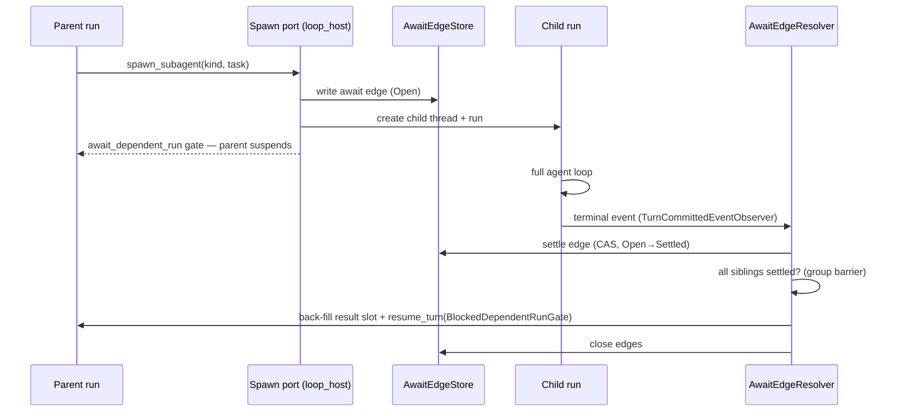

# Subagents

**Status:** Canonical — the one current document for subagent architecture,
design decisions, and roadmap.
**Last verified against code:** 2026-08-21, workspace @ `dba5f41e9`.
**Replaces (deleted 2026-08-20, recoverable from git history):**
`phase-1-contracts.md`, `phase-2-mechanisms.md`, `phase-3-integration.md`,
`thread-harness-design.md`, `pr2-pr6-shape.md`,
`research-background-enable.md`, `diagrams/`, and the implementation plan
`docs/internal/superpowers/plans/2026-08-19-subagent-background-slices-1-2.md`.
Those documents accumulated 7,000+ lines across three design generations;
mechanisms they described are now implemented, so the code is the source of
truth for mechanism and this file is the source of truth for *narrative,
decisions, and roadmap*. Where this file and the code disagree, the code and
its gates win and this file gets a dated correction
(`docs/internal/reborn/guidance-conventions.md`). Cross-family placement
authority (which crate owns the await-edge seam, layer rulings) belongs to
`docs/internal/reborn/target-architecture/` and the family `AGENTS.md`
files — this document links to those rulings and never overrides them.
Surviving source comments in `await_edge/{mod,store,resolver,boot_recovery}.rs`
and `await_edge_port.rs` still cite `thread-harness-design.md` §-numbers from
before its deletion; those get repointed at this README's sections in the
same PR that touches those files anyway (§9, Task 9).

**Structure:** Part I (§1–§8) is the stable record — expected experience,
current architecture, design rationale, scenario behavior, decisions,
roadmap, invariants. Part II (§9) is the *living* implementation plan for
the pending slice; it shrinks as work ships and is replaced by the next
slice's plan.

---

## 1. What a subagent is

A subagent is a **child agent turn**: a running agent invokes the
`builtin.spawn_subagent` capability, and the host creates a new thread and a
new run for the child. The child is a full IronClaw loop — its own thread,
run, profile, capability surface, and budget — not a lightweight task. Every
privileged effect it performs crosses the same kernel membrane as any other
run.

Two modes, one spawn surface:

- **Blocking** (ships today): the parent suspends on a gate until the child
  (and any siblings spawned under the same gate) finish; results are
  back-filled into the parent's transcript and the parent resumes.
- **Background** (accepted design, §4): the spawn returns a receipt
  immediately, the parent keeps working, and each child's result is delivered
  autonomously as it finishes.

Identity and lineage vocabulary (all owned by `ironclaw_host_api::turn` /
`ironclaw_common`): parent and child are linked by `parent_run_id` /
`spawn_tree_root_run_id` / `subagent_depth` on the run record, and by a
durable **await edge** (§2.2) in the process-dependency journal. The child's
kind (`SubagentKindId`, wire name `subagent_type`, legacy alias `flavor_id`)
selects its profile material.

Trust posture (root `AGENTS.md`): *subagent spawn creates and wires child
runs only* — planning, execution, capability calls, checkpointing, gates,
retries, and completion all continue through the existing
runner/driver/executor path. There is no subagent-specific execution lane.

### 1.1 Expected experience

What the finished feature feels like, before any mechanism:

- The agent says "I'll research those three vendors in parallel" and calls
  `spawn_subagent` three times with `mode: "background"`. Each call returns
  instantly with a receipt; the conversation keeps moving.
- Two minutes later the first researcher finishes. If the parent is
  mid-thought, the result simply appears in its context at the next natural
  pause (a loop boundary). If the user walked away and the parent went
  idle — or the conversation had already ended — the parent **wakes on its
  own**, folds the result in, and continues or reports. No one polls; no
  one refreshes.
- Results arrive one by one as children finish (per-child beat), so the
  agent can act on early findings — steer the remaining children, spawn a
  follow-up, or give the user a partial answer.
- A server restart in the middle loses nothing: results are durable the
  moment they're written, and delivery resumes on boot.
- Later slices add the observability shell: list your running subagents and
  their status (R5), open one and read its transcript in the WebUI tree
  (R7), send a running child more instructions (R6), cancel one (R8) —
  deliberately the same verbs Claude Code users know as `/tasks`,
  opening a task, `SendMessage`, and `TaskStop`.

## 2. What ships today — blocking mode

Verified end-to-end 2026-08-20. The capability is fully wired but
**deny-filtered in production** (§7): only tests exercise it.



### 2.1 Spawn path

`crates/loop/ironclaw_loop_host/src/subagent_spawn_port.rs` owns the
capability surface: `SpawnSubagentArgs { subagent_kind, task, handoff? }`,
argument codec, per-kind descriptors, spawn admission, and
`SubagentSpawnDeps` (which carries `Arc<dyn AwaitEdgeWriter>`). Today the
codec **rejects** `mode: "background"` (`background_subagents_disabled()`),
the parameters schema does not advertise `mode`, and `finish_spawn`
hard-codes `Blocking`. Child creation reserves spawn-tree capacity against
`spawn_tree_descendant_cap` (from `limits.max_tree_descendants`, journaled on
the run record).

### 2.2 The await edge

The durable parent↔child link, stored as a projection over the process
dependency journal: `crates/loop/ironclaw_turn_runner/src/subagent/await_edge/store.rs`.
An edge carries the child scope and thread id, the parent run id and run
context, the spawn `mode`, the `gate_ref` the parent is blocked on,
`group_ref` (sibling grouping — equal to `gate_ref` for blocking spawns), a
`state` (`Open → Settled → closed`), `terminal_kind`, and a
`reservation_release` tri-state. Store surface: `peek`, `list_group`,
`list_unclosed_for_scope`, `consume`, `close`. **The edge is the only durable
record that a child result exists but has not been delivered** — everything
downstream of it is reconstructible.

### 2.3 Settlement and delivery (blocking tail)

`crates/loop/ironclaw_turn_runner/src/subagent/await_edge/resolver.rs`
(`AwaitEdgeResolver<S>`). Wired to run-terminal events via
`as_turn_committed_event_observer` (see `turn_runner/src/runtime.rs`). On a
child terminal: `settle_and_maybe_drain` settles the edge, then
`drain_settled_group` proceeds only once **every** sibling under the same
`gate_ref` has settled (the group barrier), writes each sibling's framed
result into the parent transcript (`update_parent_result_reference` →
`thread_service.update_tool_result_reference`), resumes the parent exactly
once (`resume_turn` pinned to `ResumeTurnPrecondition::BlockedDependentRunGate`
so it can never unblock an approval/auth gate), and closes the edges.

Child text is **never delivered raw**: `subagent/untrusted_text.rs` frames
and sanitizes summaries (`wrap_untrusted_subagent_text`,
`sanitize_tool_result_summary`). The raw child transcript is human-only
(§7).

### 2.4 Dependency-inversion seams

`ironclaw_loop_host` cannot depend on `ironclaw_turn_runner`, so the seam is
two traits defined low and implemented high
(`crates/loop/ironclaw_loop_host/src/await_edge_port.rs`): `AwaitEdgeWriter`
(implemented by `AwaitEdgeStore`, decorated by `ScopeRecoveryDriver`) and
`AwaitEdgeSettler` (implemented by `AwaitEdgeResolver`). Composition builds
the concrete objects and erases them (`ironclaw_composition/src/runtime.rs`);
late `bind_*` trait methods exist because the resolver's thread-service
generic is unnameable after erasure. This is type-placement category 2
(permanent dependency-inversion seam).

### 2.5 Crash recovery

`subagent/await_edge/boot_recovery.rs` (`ScopeRecoveryDriver`) re-drives
`drain_settled_group` for settled-but-unclosed edges in a scope, but only
**lazily**: `check_scope_recovered` is invoked from the spawn port before a
*later* spawn into that scope, and from two lazy resolver paths
(`resolver.rs:1709`, `:1785`). There is no startup caller today — recovery
is not a boot pass. A parent blocked on a settled-but-undrained edge in a
scope nothing else touches stays blocked until some later spawn happens to
touch that scope. A true startup/boot pass for background edges (which need
one regardless, since they have no gate to block on) is new work owned by
Part II Task 7; blocking-mode recovery remains lazy as described here.

### 2.6 Parallel children

Already structural: one edge per child, `group_ref` groups siblings,
`list_group` enumerates them, the drain barrier settles a group atomically,
and the tree-wide descendant cap bounds fan-out. Background mode reuses all
of it minus the barrier (§4.3).

### 2.7 Result payload

`crates/loop/ironclaw_turn_runner/src/subagent/spawn_result.rs`:
`SpawnedChildRunPayload { child_run_id, child_thread_id, flavor,
mode, status, output_available, final_text?, failure_summary?,
terminal_event? }` — snake_case wire shape, round-trip pinned (both `mode`
strings pinned since #7758). `mode` is `ironclaw_loop_host::SpawnSubagentMode`
(the single spawn-mode enum after #7758 collapsed the duplicate).

## 3. Slice 1 — activation primitives (shipped, #7752)

The wake half of background delivery landed ahead of the delivery half:

- **`ActivationProvenance`** (`System` / `ParentAgent` / `Human` …): why a
  run was activated on its thread. Set once at run creation, journaled in
  the `agent_turn` metadata (`subagent_activation_provenance`, alongside
  `subagent_depth` and `spawn_tree_descendant_cap`).
- **`activate()`** on `TurnCoordinator`: submit a system-initiated turn to a
  parked or completed thread — the auto-resume primitive. Forwarded by every
  production decorator (`CancelReconcilingTurnCoordinator` included; its
  initial omission was caught in review — the trait default fails closed).
- **Autonomous-wake streak cap**: derived from a bounded newest-first run
  query — after N consecutive `System`-provenance activations on a thread,
  further autonomous wakes are refused until a human participates.
  `ParentAgent`-provenance runs are explicitly excluded from the window
  (`coordinator.rs:618-652`); a separate `ParentAgent` budget ships with
  `subagent_extend` in R6 (§6), and until then no production path mints
  `ParentAgent` activations. This is the guardrail that makes fully-autonomous
  waking safe (§5, D5).

`activate()` has **no production caller yet** — deliberate staging. The
delivery design below wires it.

## 4. Background mode — accepted design (2026-08-20)

**The append model**: adopted from Claude Code's interaction model, carried
on IronClaw's durable substrate. A background spawn returns a receipt
immediately and the tool-result slot **closes** — the child's answer arrives
later as new conversation input, correlated by `child_run_id` from the
receipt. Nothing is back-filled; there is no gate and no `resume_turn`.

```mermaid
sequenceDiagram
    participant P as Parent run (keeps working)
    participant SP as Spawn port
    participant C as Child run
    participant R as AwaitEdgeResolver
    participant T as Parent thread (durable)
    participant Q as Input queue
    P->>SP: spawn_subagent(kind, task, mode=background)
    SP-->>P: SpawnedChildRunPayload (status=spawned) — slot closes
    C->>C: full agent loop
    C->>R: terminal event
    R->>R: settle edge (durable)
    R->>T: framed result appended (idempotent) — edge → ResultAppended
    alt parent has a live run
        R->>Q: enqueue LoopInput::SubagentSettled (refs)
        Q-->>P: drained at next loop boundary (steering-like)
    else parent parked or completed
        R->>P: activate(parent_thread, System) — auto-resume
    end
    R->>R: attention accepted — edge → AttentionScheduled, then closed
    Note over R: any refusal leaves the edge in ResultAppended —
the sweeps retry; the obligation is durable
```

### 4.1 Delivery truth, attention obligation

Two durable facts, in order, and the edge tracks both. This is the R2
lifecycle, built by Part II Task 5 — none of these states, transitions, or
symbols exist in the tree today:

```text
Open → Settled → ResultAppended { message_ref }
     → AttentionScheduled { queued | activated } → closed
                (or)
     → AttentionDeferredStreakCap   — unclosed; excluded from autonomous
                                      retry; drained and closed by the next
                                      permitted or human run-start sweep
```

**Delivery** is the idempotent append of the framed result to the parent
thread through a **typed acceptance** — a `SessionThreadService`
operation for subagent results that persists a system-class transcript row
(never `MessageKind::User`: a child's output must not enter the thread on
the user/steering contract) and deduplicates on the service's existing
acceptance identity tuple, here derived from trusted durable identity:
`source_binding_id = "subagent-result:{parent_run_id}"`,
`external_event_id = {child_run_id}`. That tuple — not the edge — is what
makes the append idempotent across the hard crash window (acceptance
succeeded, process died before the edge recorded the ref): replay
re-accepts and receives the **same** message ref back. The ref persisted
on the edge (`ResultAppended`) is the fast path, not the proof. The row is
**terminal on arrival** and stays that way: delivery calls
`enqueue_queued_message`
(`ironclaw_loop_host/src/{input_queue,durable_input_queue}.rs`) and **never**
`mark_message_queued` (correction, 2026-08-21 — this paragraph previously
said the row "binds to a queue entry exactly as steering rows do"; it cannot,
see D14). The `Accepted → Queued → Submitted / RejectedBusy` ladder is the
*human*-message admission protocol, gated by `ensure_user_accepted`
(`crates/domains/ironclaw_threads/src/filesystem_service.rs`), which a
system-class `Finalized` row fails on both halves — and `Queued` is excluded
from `is_model_visible` (`filesystem_service.rs`), so marking the row
queued would hide the delivered result from the parent's own context,
contradicting the delivery truth this section is built on. What 2b owes
instead is one no-op: the queue's best-effort `Submitted` flip
(`flip_submitted`, `crates/loop/ironclaw_loop_host/src/input_queue.rs`)
must return an already-terminal row unchanged, implemented beside the existing
idempotent-resubmit early return in **both** thread backends — never by
widening `ensure_user_accepted` to admit system rows, which would re-open the
`Queued`/`RejectedBusy` path onto a result row and erase the system-vs-user
distinction the acceptance door exists to hold. A crash after acceptance and
before the enqueue leaves the edge in `ResultAppended`; re-drive enqueues, and
the queue's own identity dedupe makes the double-enqueue attempt safe.

**Attention** — the queue entry or the wake — is a separate durable
obligation. The edge closes only after attention has a durable outcome:
the input was accepted into a live run's queue (`queued`) or an
activation was accepted (`activated`). Streak-cap suppression is **not** a
scheduled outcome — the edge moves to `AttentionDeferredStreakCap` and
stays unclosed (a closed dependency is consumed and invisible to the
unclosed queries), excluded from autonomous retry, until a permitted or
human-initiated run start drains it. Every refusal —
`RunClosed` (the parent raced to terminal: a transition signal, not a
success), `CapacityExhausted`, a transient activation failure, a crash at
any boundary — leaves the edge in `ResultAppended`, where the recovery
sweeps (§4.2) are still obligated to it. A parked parent can therefore
never be stranded with a delivered-but-unannounced result: the promise of
autonomous delivery is carried by durable state, not by a hope that the
parent happens to run again.

Production composes the durable filesystem-backed queue
(`durable_input_queue.rs`; in-memory is test-only), so queue entries also
survive restart — belt and suspenders on top of the obligation, not a
substitute for it.

### 4.2 The three attention triggers

1. **Settle-time**: append (idempotent), then schedule attention — enqueue
   into the parent's live run, or `activate(parent_thread, …, System)` if
   there is none. Any refusal leaves the edge in `ResultAppended` for the
   sweeps; `RunClosed` re-queries parent state and retries as parked.
2. **Run-start sweep**: hooked at the runner's claimed-run seam —
   `execute_claimed_run`, declared in `turn_runner/src/turn_scheduler.rs`
   and implemented by `RebornTurnRunExecutor` in
   `turn_runner/src/turn_run_executor.rs` — **not**
   `check_scope_recovered`, which is a spawn-finalization hook on the child
   scope. The sweep covers **every non-closed background edge state for the
   thread**, not just `Settled`/`ResultAppended`: an edge caught in
   `AttentionScheduled` (a crash after `record_attention` but before
   `close`) needs no re-delivery — the attention outcome is already durably
   accepted (`Queued`: the entry is in the durable queue; `Activated`: the
   run was durably created) — so the sweep's action for that state is
   simply `close`, never a re-enqueue or a second `activate`. On parent run
   start, edges in `ResultAppended`, `AttentionScheduled`, and (when the
   start is human-initiated or otherwise permitted) `AttentionDeferredStreakCap`
   for that thread are each driven to closed. The thread-indexed lookup is
   real, not aspirational: background edges carry a deterministic
   `group_ref = "bg:{parent_thread_id}"` (§4.3), so the existing
   group-ref dependency query serves it; the batch is capped at
   `MAX_QUEUED_INPUTS_PER_RUN`.
3. **Boot pass**: restart re-drives every non-closed background edge
   (`Settled`, `ResultAppended`, `AttentionScheduled`) through the same
   recovery logic as the run-start sweep — `Settled`/`ResultAppended`
   re-enter the deliver path, **including activation of parked parents**
   (autonomous delivery is a product promise, so boot may wake; the streak
   cap still applies), while `AttentionScheduled` is simply closed, its
   attention outcome already durable. Bounded scanning is new work the plan
   owns (Task 7 adds the limit/continuation to the dependency query);
   per-tenant fairness lands with the R4 boot-recovery work.

The persisted edge state is the dedupe and the retry ledger: one durable
obligation per child, retried with bounded backoff until closed or
intentionally suppressed.

### 4.3 What changes where

| Surface | Change |
| --- | --- |
| `ironclaw_loop_contracts` (`host/input.rs`) | new variant `LoopInput::SubagentSettled { … }` carrying **references only** (child run id + result/message refs — never content; kernel guardrail). Serde round-trip pinned. **Rolling-upgrade hazard, not absent** (correction, 2026-08-21 — this row previously claimed the queue was in-memory and therefore compat-free; it is not, see §4.1 and D13): production composes `FilesystemHostInputQueue` (`crates/app/ironclaw_composition/src/runtime.rs`), and the queue document is deserialized whole (`load`, `crates/loop/ironclaw_loop_host/src/durable_input_queue.rs`) — an old binary meeting a persisted `subagent_settled` entry fails the **entire run's queue** with "durable input queue is corrupt", not just that one entry. Mitigated by sequencing, not a tolerant reader: this slice (2a) lands the variant with zero producers, so no old binary can ever meet a persisted instance of it; producers land in slice 2b only once every reader in the fleet understands the variant. |
| `ironclaw_agent_loop` (`executor/input.rs`) | the variant drains **steering-like**: prompt-visible content input, not a control barrier. The `PostCapabilityStage::drain_settled` stub and its stale `LoopBackgroundChildPort` comment are **deleted** — the input path is the drain. |
| `ironclaw_turn_runner` (resolver) | background tail: settle → idempotent append (`ResultAppended{message_ref}` on the edge) → schedule attention (enqueue or activate) → `AttentionScheduled` → close. Reuses `child_terminal_output` / summary framing from the blocking tail. Writes are per-edge (append, transition, enqueue are separate operations on existing interfaces); coalescing attention across simultaneous settles is an optional later optimization, not a normative claim. One typed input per child either way (D6). |
| `ironclaw_loop_host` (spawn port) | delete both codec rejections and `background_subagents_disabled()`; advertise `mode` in the parameters schema (enum `["blocking","background"]`, default `blocking`); thread `args.mode` through `finish_spawn`; background spawns return the immediate receipt payload instead of `await_dependent_run`, and write their edge with `group_ref = "bg:{parent_thread_id}"` (the thread-indexed recovery key, §4.2). |
| `ironclaw_processes` (dependency journal) | expected-state/metadata CAS transition on the dependency port, carrying the `ResultAppended`/`AttentionDeferred` substates and payloads; every journal implementation, decorator, and test double enumerated in the same change. |
| `ironclaw_threads` | typed, idempotent subagent-result acceptance (system-class row, dedupe on the acceptance identity tuple — §4.1) — shipped, slice 2a. Plus, in 2b: `mark_message_submitted` returns an already-`Finalized` row unchanged in **both** backends (`filesystem_service.rs`, `in_memory.rs`), beside the existing idempotent-resubmit early return. **The result row is never marked `Queued`** (correction, 2026-08-21 — this row previously inherited §4.1's steering-ladder claim; `ensure_user_accepted` refuses it and `Queued` is not model-visible, see D14). `ensure_user_accepted` is **not** widened. Refusal pinned today by `crates/domains/ironclaw_threads/tests/subagent_result_acceptance.rs`. |
| model-facing description | the spawn descriptor text in `subagent_spawn_port.rs` gains background wording (moves to a `prompts/*.md` file if it goes multi-line, per the repo prompt rule). |

No new `Loop*Port`, no `LOOP_PORT_OWNERS` row, no new crate edge — the
resolver reaches the enqueue seam over the already-inventoried
`turn_runner → loop_host` dependency, and the loop reaches nothing new at
all. Two existing contracts **do** gain operations, and the design claims
them rather than pretending zero surface: the process-dependency journal
port gains a domain-neutral expected-state/metadata CAS transition (the
durable substates live in the kernel record, since the await-edge store is
a projection whose state is reconstructed from `ProcessDependencyRecord`),
and `SessionThreadService` gains the typed subagent-result acceptance
(§4.1). Both come with their implementations, decorators, test doubles,
and architecture-test runs enumerated (Part II, Tasks 5–6).

### 4.4 Mode scoping

Background edges have no gate and no group barrier: each child delivers
independently as it settles (§5, D6). A parent run completing while
background edges are open is **normal** — delivery continues via
activate/sweep — never abandonment. Blocking-mode semantics (barrier,
back-fill, resume) are unchanged; the resolver is one settlement engine with
two delivery tails.

### 4.5 Why this design — the rejected alternatives

The organizing observation: **nothing here polls.** In blocking mode, in the
append design, and in Claude Code alike, every arrow points *away* from the
child — the parent never asks "is my child done?". What the candidates
actually differed on was what happens to the tool-result slot the spawn call
leaves behind, and how the answer crosses back into a crate
(`ironclaw_agent_loop`) that is forbidden from seeing the resolver.

| Candidate | Fate | Deciding facts |
| --- | --- | --- |
| A small drain trait defined in `ironclaw_agent_loop`, implemented by the runner (the original sketch) | **Impossible** — measured, not judged | `ironclaw_agent_loop` has a crate-specific boundary rule permitting contracts-layer dependencies only (exception register pinned empty), so no host impl could be named; and the stage is built by `DefaultExecutorPipeline::default()` inside a fixed-signature trait method — a constructor-injected dependency has no plumbing path at all. |
| A new `Loop*Port` drain on the host bundle, pulling settled results into tool-result slots each turn | Rejected | Costs a new trait + a frozen `LOOP_PORT_OWNERS` registry row + updates to 8 host implementations + bespoke retry semantics — and still needs the edge store underneath. Keeps results attached to their originating tool call, which is the one thing the append model gives up. |
| **Append: a typed variant on the existing input path** | **Adopted** | Zero new surface: `LoopInput` already carries structured settlement — `GateResolved { gate_ref }` is a **type-shape** precedent only (correction, 2026-08-21: it has zero producers anywhere in the repo, and the drain treats it as a barrier that breaks without consuming, acking, or advancing the cursor — `crates/loop/ironclaw_agent_loop/src/executor/input.rs`, the `GateResolved | CapabilitySurfaceChanged => break` arm; the only variant production ever constructs is `Steering`, from product-side admission in `try_enqueue`, `crates/product/ironclaw_assistant/src/steering.rs`). `SubagentSettled` is therefore the **first** host-side-settlement loop input, not a repeat of an existing pattern. What still holds: the loop already polls `LoopInputPort` every boundary, and steering already uses the durable-row-plus-queue-entry delivery pattern the result reuses — so the append model adds no new port. Matches the interaction model users know from Claude Code. |

Two properties fell out of the adopted shape rather than being designed in,
and both are load-bearing:

- **Queue loss is harmless** because delivery truth is the durable thread
  write (§4.1) — the queue and the wake only carry *attention*. Production's
  queue is itself durable, but the design holds even where it is not.
- **Claude Code parity comes with strictly stronger guarantees.** Claude
  Code's completion notification is fire-and-forget and dies with the
  harness; here a lost wake is healed by the run-start sweep and boot pass,
  autonomous wakes carry provenance and a streak cap, sibling groups settle
  atomically, and child text is framed as untrusted before any parent model
  sees it.

### 4.6 One parent, both modes, in parallel

The two tails coexist on one parent. The worked scenario below exercises
almost every rule at once: a parent spawns one background child, then a
blocking group of two, and the background child finishes *while the parent
is suspended* on the blocking gate.

```mermaid
sequenceDiagram
    participant P as Parent run
    participant R as Resolver
    participant B1 as Background child
    participant G1 as Blocking child A
    participant G2 as Blocking child B
    P->>B1: spawn(mode=background) — receipt, slot closes
    P->>G1: spawn (blocking group)
    P->>G2: spawn (blocking group)
    Note over P: suspends on await_dependent_run gate
    B1->>R: terminal — settle edge
    R->>P: framed result → durable thread row + queued input
    R--xP: activate? ThreadBusy (run exists, blocked) — benign no-op
    G1->>R: terminal — settle; barrier holds (B still open)
    G2->>R: terminal — settle; group complete
    R->>P: back-fill both results + resume_turn(BlockedDependentRunGate)
    Note over P: resumes — next loop boundary drains the queued
    Note over P: background input; all three results in context
```

Nothing is lost and nothing is faked: the background result could not wake
the suspended parent (`ThreadBusy`), but its durable thread write already
happened, so the moment the blocking drain resumes the parent, the queued
input — and, failing even that, the transcript itself — carries it forward.
The resume that ends the suspension is precondition-pinned to the dependent-
run gate, so a settling child can never accidentally satisfy an approval or
auth gate.

**Scenario matrix** — child-settles event × parent state (triggers from
§4.2):

| Parent state when a background child settles | What happens | Delivered by |
| --- | --- | --- |
| Running, mid-turn | durable thread write + queued input | next loop-boundary drain |
| Suspended on its own gate (approval, auth, blocking spawn) | write + queue; `activate` → `ThreadBusy` no-op | drain on resume; gates untouched |
| Parked between turns / thread completed | append → `ResultAppended`; no live run to queue into | `activate(…, System)` accepted → `AttentionScheduled(activated)` (D5) |
| Parent races to terminal mid-delivery (`RunClosed`) | transition signal, not success — edge stays `ResultAppended` | re-query state, retry as parked; sweeps back it up |
| Enqueue refused (`CapacityExhausted` / unavailable) | edge stays `ResultAppended` — bounded retry, never loss | run-start sweep / boot pass |
| Autonomous-streak cap exhausted | `AttentionDeferredStreakCap` — unclosed, excluded from autonomous retry | next permitted or human run-start sweep drains and closes it |
| Process crashed after settle, before append | edge `Settled`; persisted ref absent | boot pass re-runs the idempotent append |
| Process crashed after append, before attention | edge `ResultAppended` with `message_ref` | boot pass schedules attention (may activate — §4.2) |
| Parent run reached terminal with edges still open | normal delivery continues (§4.4 — never abandonment) | activate / sweep; explicit tree teardown is R8 |
| Many children settle at once | per-edge appends and transitions on existing interfaces | one typed input per child (D6); attention coalescing is an optional later optimization |

And the child-side gates: a child blocked on **its own** approval or auth
gate has produced no terminal event, so its edge stays `Open` and nothing
delivers — a blocking parent keeps waiting, a background parent keeps
working. Today that block is silent from the parent's side; surfacing and
escalating it to the parent is exactly R3 (the gate-escalation walk), and
child gate state becomes inspectable at R5.

## 5. Decision log

Dated, with rationale and reversibility. Older decisions inherited from the
2026-08-19 shape gate are marked ◇; 2026-08-20 decisions were taken during
the append-model design review.

- **D1 ◇ Extend, don't fork.** Background mode extends the landed blocking
  path (spawn port, edges, resolver) — no new crate, no cargo feature, no
  parallel machinery.
- **D2 (2026-08-20) Append model over back-fill drain port.** Full
  comparison and the measured impossibility of the original sketch: §4.5.
  The append model reuses `LoopInputPort` — which *is* the "existing
  loop-host port surface" the retired shape doc offered as its alternative.
  Reversal: moderate; the variant and enqueue site are contained.
- **D3 (2026-08-20, amended same day) Delivery truth = idempotent durable
  append; the edge survives until attention has a durable outcome.** As
  first written, D3 closed the edge at the thread write — the #7763 design
  review showed that strands parked/completed parents whenever the process
  dies (or enqueue/activation is refused) between close and attention: the
  result exists in history but nothing is obligated to announce it. The
  edge now carries the full obligation (§4.1 state machine); closing early
  was the reversal path D3 originally reserved, exercised in review rather
  than production.
- **D4 (2026-08-20) `SubagentSettled` carries refs, drains steering-like.**
  Content stays in durable rows (kernel rule: lifecycle metadata and
  references only); the variant is prompt-visible, not a control barrier.
- **D5 (2026-08-20) Fully autonomous wakes.** `activate(System)` fires for
  parked *and* completed parent threads; the slice-1 streak cap, provenance,
  `ThreadBusy` no-op, and settled-state dedupe are the guardrails. A
  quieter policy (deliver silently to completed threads + notify the user
  inbox, #7697) was considered and deliberately not taken — it remains a
  one-line policy change at the single wake site if autonomous waking proves
  too aggressive. Two-way door.
- **D6 (2026-08-20) Per-child delivery beat.** Each background child
  delivers as it finishes (Claude Code behavior; parent can act on early
  results). Batch-on-group was rejected: blocking mode already provides
  wait-for-all. Reversal: cheap — a batching policy at the settle site.
- **D7 (2026-08-20) No additional sanitization scan initially.** The child
  is a full IronClaw loop behind the same membrane, sandbox-exit scrubbing,
  and model-output safety as any run, and its delivered text is already
  framed as untrusted (§2.3 — that framing stays). The previously planned
  drain-site scan (`SafetyLayer` — both candidate functions currently have
  zero production callers, tracked in #7391) is **deferred, not deleted**:
  re-decide at the production-enable slice (§6, R8 checkpoint) while the
  capability is still deny-filtered. Two-way door: one call at one write
  site.
- **D8 ◇ Enable last.** Production enablement (clearing
  `builtin.spawn_subagent` from `disabled_capability_ids`) happens only
  after observe/steer/cancel surfaces exist (§6) — more conservative than
  the original design's enable-after-PR2, at the cost of one line to change
  our mind.
- **D10 (2026-08-20, from the #7763 design review) Foundational
  contracts land before their slices.** Backpressure (attention shares the
  run queue's 32-entry cap; refusal = bounded retry via the obligation,
  never loss, never reserved capacity), cumulative autonomy budgets
  (active children and autonomous activations per parent/root/tenant,
  token/wall-time ceilings, gate-wait deadlines) and root/subtree
  cancellation semantics (including held reservations and
  already-appended partial results) are *documented contracts* carried by
  already-owned records — budgets and deadlines on run records and the
  reservation ledger (the `spawn_tree_descendant_cap` precedent), 
  cancellation through the edge's existing `Abandoned` path plus the
  `reservation_release` tri-state — with R5/R8/R9 consuming them; the R2
  edge schema itself carries only the delivery lifecycle (§4.1). Lifecycle taxonomy beyond terminal states
  (awaiting-input/approval, stuck, timed-out, attention-pending,
  delivered) is an R5 inspect-contract requirement; terminal attempts stay
  immutable — a retry is a new attempt.
- **D11 (2026-08-20) Adoptions and skips from the claude-code changelog
  survey.** Adopted (each mapped into §6): the concurrent-running-children
  cap (R2), degraded-result taxonomy (R5), budget-breach teardown (R8),
  conservative depth default (R9), and the child filesystem-scope
  invariant (§7). Deliberately skipped: agent teams (peer-to-peer trust
  model — would fork the parent-child tree, D1), `/fork`-style context
  inheritance (blurs the kernel membrane), named-agent frontmatter files
  (authoring UX; `SubagentKindId` is already the primitive), and
  fleet-wide cross-session messaging (R6 covers the in-scope
  parent→child case). Evidence is changelog-grade — shipped-behavior
  descriptions, not source.
- **D9 ◇ Not in scope**: `TurnOwner` vs `TurnThreadOwner` stay separate
  types (ownership shape vs resolution disposition); no stored counters;
  never append to `completion_observer.rs`; new files < 800 lines;
  `subagent_spawn_port.rs` test-support ratchet stays frozen.
- **D12 (2026-08-21) Three kernel delivery substates, not two.** §9
  originally specified two (`ResultAppended`, `AttentionDeferred`) and
  implied a third, `AttentionScheduled`, would live in edge metadata
  rather than the kernel state column. Implemented as three
  (`ProcessDependencyState::{ResultAppended, AttentionScheduled,
  AttentionDeferred}`, `crates/kernel/ironclaw_processes/src/journal.rs`)
  so the loop-tier projection stays a total function of the kernel state
  column; splitting lifecycle across a column and a JSON blob is a drift
  hazard, since the derived `closed` index is computed from the column
  alone (the `closed` index key in
  `crates/kernel/ironclaw_processes/src/journal_store/rows.rs`).
  Reversal: cheap — collapse one variant.
- **D13 (2026-08-21) R2 ships as three slices, not one.** 2a lands every
  new surface inert (no producer); 2b makes background spawn return a
  receipt and delivers to a live parent; 2c adds parked-parent activation,
  streak-cap deferral, the healing sweeps, and the failure-injection
  matrix. Rationale: R2 in one PR spans 8 crates and changes two persisted
  enums that have no tolerant reader, and slicing readers-before-writers
  turns that rolling-upgrade hazard (§4.3) into a deployment property at
  zero code cost. Reversal: cheap, it is a sequencing choice.

- **D14 (2026-08-21, correction) The delivered result row never enters the
  steering ladder.** §4.1 previously specified that the appended row "binds
  to a queue entry exactly as steering rows do (`mark_message_queued` →
  `enqueue_queued_message`)". That mechanism cannot work, and the obvious
  patch would cost the invariant the row exists to hold. Verified against the
  tree: the acceptance writes `kind: MessageKind::System, status:
  MessageStatus::Finalized`
  (`accept_subagent_result`,
  `crates/domains/ironclaw_threads/src/filesystem_service.rs`), while
  `ensure_user_accepted` admits only `MessageKind::User` *and* status in
  `{Accepted, DeferredBusy, Queued}` (`filesystem_service.rs`,
  `in_memory.rs`) — both halves fail. Both `mark_message_queued` and
  `mark_message_submitted` (same two files) call it, so the queue's
  best-effort `flip_submitted`
  (`crates/loop/ironclaw_loop_host/src/input_queue.rs`)
  would fail permanently, log at `debug!`, and **retain** the pending flip;
  retained flips count against the ceiling
  (`MAX_QUEUED_INPUTS_PER_RUN = 32`, `input_queue.rs`), so after 32 child
  settlements a long-lived parent returns `CapacityExhausted` for everything
  — human steering included — and `is_settled` (`input_queue.rs`) never
  holds, so the durable per-run document is never reclaimed
  (the two `is_settled` reclaim arms in `durable_input_queue.rs`). Even a
  succeeding `mark_message_queued` would be wrong: it sets `Queued`, which
  `is_model_visible` (`filesystem_service.rs`) excludes, hiding the
  already-appended result from the parent's model context — against this
  design's own "delivery truth is the durable thread write".
  **Resolution:** the row is appended `Finalized` and is never marked
  `Queued`; 2b calls `enqueue_queued_message` alone, and puts the knowledge in
  the layer that owns the lifecycle — an already-terminal row has nothing to
  flip, so `mark_message_submitted` returns it unchanged, beside the existing
  idempotent-resubmit early return in both thread backends. No new variant, no
  `Option` on the request, no branch at the enqueue site. **Rejected:**
  widening `ensure_user_accepted` to admit system rows — it would re-open
  `Queued`/`RejectedBusy` onto a result row, making untrusted child text
  indistinguishable from a human instruction on the admission contract; the
  `System`-not-`User` shape is the point (§7). Today's refusal is pinned at
  crate tier on both backends
  (`crates/domains/ironclaw_threads/tests/subagent_result_acceptance.rs`,
  `a_result_row_is_refused_by_the_steering_ladder`), so 2b meets a red test
  rather than a wedged parent run. Reversal: cheap — the no-op is two early
  returns, and the row shape is unchanged.

## 6. Roadmap

Slice 1 shipped (#7752, plus the #7755/#7758 vocabulary cleanup). Remaining
work, in order — names map to the retired shape doc's slices for continuity:

| # | Work | Contents | Was |
| --- | --- | --- | --- |
| R2 | **Background core** | Everything in §4.3 + integration tests: per-child beat, three-trigger healing, `ThreadBusy` heal, crash-replay idempotency, the failure-injection matrix. Plus a **concurrent-running-children cap** at spawn admission (same path as the descendant cap) — Claude Code's changelog shows this cap removed and re-added under production pressure; it is D10's "active children per parent" line made real | slice 2 (reshaped: append model replaces wake-only Tasks 8–9) |
| R3 | **Gate escalation walk** | A blocked child (approval/auth) escalates to its parent; prod-enable gate | slice 4 |
| R4 | **Counters, operator command, e2e revival** | `ResolveReport` counters; `ironclaw subagent edges`; un-ignore the five e2e tests via harness-side enablement; boot-recovery fairness | slice 5 |
| R5 | **`subagent_inspect` + per-kind config** | Model-facing status/gate/byte-count metadata (never raw transcript); per-kind budget + model override. Plus the **degraded-result taxonomy**: `child_terminal_output` distinguishes clean success / partial-on-forced-cutoff / provider error — Claude Code shipped three separate fixes for children returning empty on rate-limit cutoff or fabricating success on API error; D10's lifecycle-taxonomy line | slice 6 |
| R6 | **`subagent_extend` + human priority** | `activate(child, …, ParentAgent)` with consent-to-wake + budget window; `human_waiting` reservation marker | slice 7 |
| R7 | **WebUI child tree** | `GET …/threads/{id}/children` lineage projection; `ThreadTree` sidebar; raw-vs-framed display rule; interrupt & take over | slice 8 |
| R8 | **`subagent_cancel`** (security review) + **scan checkpoint** | Model-facing cancel with clean tree teardown; **budget breach halts running children through this same teardown path** (Claude Code's `--max-budget-usd` fix: denying new spawns is not enough); **re-decide D7** (drain-site scan) here, before enable | slice 9 (+ deferred slice 3) |
| R9 | **Production enable** | Clear the deny filter; reconcile the `tool_call.rs` disabled-behavior tests; set an explicit conservative **spawn-depth default** per profile (Claude Code started at 1, settled on 3 after operational experience); confirm the child-filesystem-scope decision (§7) was honored | slice 10 |

Navigation parity with Claude Code, for orientation: `/tasks` ≈ R5 inspect,
opening a subagent ≈ R7 tree + transcript, `SendMessage` ≈ R6 extend,
`TaskStop` ≈ R8 cancel.

## 7. Invariants

Things no slice may break; each is enforced or pinned today.

- **Deny-filtered until R9.** `builtin.spawn_subagent` sits in
  `disabled_capability_ids` (`turn_runner/src/runtime.rs`,
  `TEMP(disable-spawn-subagents)` markers); `tests/integration/tool_call.rs`
  pins the disabled behavior; five e2e tests in
  `tests/reborn_subagent_spawn_e2e.rs` are `#[ignore]`d until R4.
- **No stage skipping.** Child runs execute through the standard
  runner/driver/executor path and the capability membrane; spawn only
  creates and wires.
- **Untrusted child text.** Delivered child content is framed and
  sanitized (§2.3); raw child transcripts are human-only surfaces (R7).
  The transcript-delivery half of that is enforced by *type*, not by caller
  convention: `AcceptSubagentResultRequest.content` is
  `ironclaw_threads::FramedSubagentText`, whose only constructor
  (`FramedSubagentText::frame`) applies the frame — the row lands
  `MessageKind::System`, which reaches the model's system role
  (`ironclaw_loop_host::model_role_for_kind` →
  `HostManagedModelMessageRole::System` → `ChatMessage::system` → the
  provider's top-level `system` field), so raw child text there would read as
  host authority.
- **Autonomous wakes are capped.** Every `activate` carries provenance; the
  streak cap refuses runaway `System`-wake chains. The `ParentAgent` budget
  ships with `subagent_extend` in R6 (§6) — until then no production path
  mints `ParentAgent` activations.
- **Authority never flows through child text.** A delivered child result is
  a typed untrusted-agent artifact — never a human instruction, never an
  approval; parent grants, approval leases, and consent do not transfer
  through it. Tenant/owner/agent/project and parent run/thread identities
  come from trusted edge and run records, never from delivered content.
- **Activation preserves authority, or narrows it.** A `System` activation
  resolves the thread's intended run profile or a stricter one — never a
  silently broader default.
- **The R8 scan checkpoint is a mandatory enablement decision** (D7):
  production enable requires an explicit re-decision, and if a scanner is
  adopted its unavailability fails closed.
- **Children get their own filesystem scope — decided now, enforced before
  enable.** A child's filesystem-touching capabilities resolve through its
  own `ScopedFilesystem` scope from the mount catalog, never implicit
  inheritance of the parent's mounts. Claude Code's changelog carries ~40
  worktree-escape hardening entries (`git -C`, `GIT_DIR`, symlinks — the
  same class rediscovered repeatedly); the scoping primitive already
  exists here, so this is a decision recorded cheaply now rather than a
  retrofit after enable.
- **Inspect is framed; raw is authorized.** Model-facing inspect (R5)
  returns framed summaries and references only; raw child transcripts (R7)
  sit behind an authenticated, tenant-scoped, non-enumerating authorization
  contract.
- **`ironclaw_agent_loop` stays contracts-only.** Its boundary rule forbids
  `turn_runner`/`loop_host` imports; the layer-matrix exception register is
  pinned empty. Loop ports are defined only in `ironclaw_loop_contracts`
  (`LOOP_PORT_OWNERS` ratchet); same-layer crate edges are inventoried as an
  equality (`reborn_same_layer_edge_inventory.rs`).
- **One spawn-mode enum.** `SpawnSubagentMode` in `ironclaw_loop_host`;
  wire strings `blocking`/`background` round-trip pinned (#7758).
- **Resume stays precondition-pinned.** Blocking resume targets
  `BlockedDependentRunGate` only.
- **LLM data is never deleted**; edges and results are marked/closed, not
  erased.

## 8. Code and test map

| What | Where |
| --- | --- |
| Spawn capability port, args codec, kind descriptors | `crates/loop/ironclaw_loop_host/src/subagent_spawn_port.rs` |
| Await-edge seam traits (`AwaitEdgeWriter`/`AwaitEdgeSettler`) | `crates/loop/ironclaw_loop_host/src/await_edge_port.rs` |
| Edge store / resolver / boot recovery / untrusted framing | `crates/loop/ironclaw_turn_runner/src/subagent/await_edge/{store,resolver,boot_recovery}.rs`, `subagent/untrusted_text.rs` |
| Result payload wire types | `crates/loop/ironclaw_turn_runner/src/subagent/spawn_result.rs` |
| Loop input contract (`LoopInput`, `LoopInputPort`) | `crates/contracts/ironclaw_loop_contracts/src/host/input.rs` |
| Input queue model + durable backend + adapters | `crates/loop/ironclaw_loop_host/src/{input_queue,durable_input_queue,input_port}.rs` |
| Executor input drain | `crates/loop/ironclaw_agent_loop/src/executor/input.rs` |
| `activate()`, provenance, streak cap | `crates/kernel/ironclaw_turns/src/coordinator.rs` + `process_projection/` (journaled metadata) |
| Composition wiring | `crates/app/ironclaw_composition/src/runtime.rs` |
| Integration scenarios (edges) | `tests/integration/subagent_await_edge.rs` (`reborn_integration_subagent_await_edge`) |
| Disabled-capability pins | `tests/integration/tool_call.rs` |
| E2E suite (ignored until R4) | `tests/reborn_subagent_spawn_e2e.rs` |

Family rules: `crates/loop/AGENTS.md` and per-crate `AGENTS.md`/`README.md`
files govern placement; `tests/integration/CLAUDE.md` governs scenario
authoring; update `tests/CLAUDE.md` rows in the same commit as any scenario
change.

---

## 9. Part II — pending work: R2 background core, implementation plan

> **For agentic workers:** REQUIRED SUB-SKILL: Use
> superpowers:subagent-driven-development (recommended) or
> superpowers:executing-plans to implement this plan task-by-task. Steps use
> checkbox (`- [ ]`) syntax for tracking. **Spec: Part I of this document**
> (§4 is the design being implemented; §5 the decisions; §7 the invariants).
> This section is pruned when R2 ships and replaced by R3's plan.

**Goal:** background subagent spawns return an immediate receipt, and each
child's result is delivered per-child via a typed loop input, with
`activate()` waking parked/completed parents.

**Architecture:** one settlement engine, two tails (§4.4). New surface is
exactly: one `LoopInput` variant, one codec/schema change, one resolver
tail, one deleted stub. No new ports, no new crate edges.

**Tech stack:** existing workspace only — no new dependencies.

**Shipped so far (slice 2a, landed 2026-08-21):** every new surface below is
inert — zero producers, per D13. Done: Task 1 (`LoopInput::SubagentSettled`,
`crates/contracts/ironclaw_loop_contracts/src/host/input.rs`), Task 2 (the
variant drains steering-like and the dead `drain_settled` stub is deleted,
`crates/loop/ironclaw_agent_loop/src/executor/input.rs`), Task 5 (the three
kernel substates plus the expected-state CAS transition,
`crates/kernel/ironclaw_processes/src/journal.rs` +
`journal_store.rs`, and the await-edge projection's three store methods
`record_result_appended` / `record_attention` / `defer_streak_capped`,
`crates/loop/ironclaw_turn_runner/src/subagent/await_edge/store.rs`), and the
thread-service half of Task 6 (the typed, idempotent
`SessionThreadService::accept_subagent_result`,
`crates/domains/ironclaw_threads/src/service.rs`,
`crates/domains/ironclaw_threads/tests/subagent_result_acceptance.rs`).
Still pending, and still producer work belonging to 2b/2c: Task 3 and 4
(codec/schema accepting `mode: "background"`, and the receipt-returning spawn
path — today the codec still rejects background mode), the resolver half of
Task 6 (`deliver_background`, `bind_input_enqueue`, composition wiring), and
Tasks 7–9 (healing sweeps, integration scenarios, prompt/doc closeout).

**One item found during 2a and deliberately left for 2b** (open, not
fixed — track it in whichever task lands the resolver tail):
- `AwaitEdgeStore::close` returns `Ok(())` for an edge still in
  `ResultAppended` (same file) — a silent success that leaves the
  descendant reservation held. This is correct while nothing produces
  `ResultAppended` outside tests; once 2b's resolver tail exists it should
  become a typed error instead of a quiet no-op.

The predecessor-selector wildcard previously listed here was retired rather
than deferred: `record_attention`'s `peek`-then-CAS existed only to
reconstruct an `expected` state the kernel now derives itself from
`ProcessDependencyState::legal_predecessors`, so both the peek and its
wildcard arm were deleted (PR #7788, correcting the entry this list carried).

A separate charter item, recorded here so 2b's sweeps do not inherit it
silently: `query_indexed_collection` drains every page and
`dependencies_for_scope` is unbounded, with `group_ref` and closed-state
filtered in memory. That predates this work, but it already violates the
`crates/kernel/ironclaw_processes/AGENTS.md` rule that normal request and
startup paths use bounded, partition-leading keyset queries only — so §4.2's
`limit`/continuation work is a charter fix, not an optimisation.

### Global constraints

- Deny filter stays on (§7): nothing in R2 changes `disabled_capability_ids`.
- Test-first (repo rule): every task's failing test precedes its
  implementation; integration tier for cross-crate behavior.
- Structural and behavioral changes commit separately.
- No `.unwrap()`/`.expect()` in production code; errors carry cause.
- Run per-crate tests + `cargo test -p ironclaw_architecture_tests` (a
  contracts enum changes) + `cargo clippy --all-targets --all-features -- -D warnings`
  on touched crates before any PR.
- Update `tests/CLAUDE.md` rows in the same commit as any
  `tests/integration/` scenario change.

### Task 1: `LoopInput::SubagentSettled` variant — shipped, slice 2a

**Files:**
- Modify: `crates/contracts/ironclaw_loop_contracts/src/host/input.rs`
- Compile-driven fallout (exhaustive matches, fix in this task):
  `crates/loop/ironclaw_agent_loop/src/executor/input.rs` (temporary barrier
  arm; Task 2 makes it drainable), plus whatever `cargo check --workspace`
  surfaces — enumerate every site in the commit message.

**Interfaces — produces:**
```rust
LoopInput::SubagentSettled {
    child_run_id: TurnRunId,        // correlates with the spawn receipt
    message_ref: LoopMessageRef,    // the framed durable thread row (§4.1)
}
```
(refs only — D4). Correction, 2026-08-21: `TurnRunId` was **not** previously
imported by this file — the file's existing `ironclaw_host_api::turn` import
carried only `LoopGateRef`/`LoopMessageRef`; `TurnRunId` had to be added to
it. `TurnRunId` itself is defined at
`crates/contracts/ironclaw_host_api/src/turn.rs`.

- [ ] **Step 1: failing test** — append to the file's test module:
```rust
#[test]
fn subagent_settled_round_trips_snake_case() {
    let input = LoopInput::SubagentSettled {
        child_run_id: TurnRunId::new(),
        message_ref: LoopMessageRef::new("msg:child-result-1").unwrap(),
    };
    let value = serde_json::to_value(&input).unwrap();
    assert!(value.get("subagent_settled").is_some(), "snake_case tag");
    assert_eq!(serde_json::from_value::<LoopInput>(value).unwrap(), input);
}
```
- [ ] **Step 2:** `cargo test -p ironclaw_loop_contracts subagent_settled` →
  FAIL (no variant).
- [ ] **Step 3:** add the variant to `enum LoopInput` (after `Steering`).
- [ ] **Step 4:** `cargo check --workspace` — fix every non-exhaustive match
  it reports; in `executor/input.rs` add `SubagentSettled` to the
  `GateResolved | CapabilitySurfaceChanged` barrier arm *for now*.
- [ ] **Step 5:** test passes; commit
  (`feat(loop-contracts): typed subagent-settled loop input`).

### Task 2: drain the variant steering-like; delete the dead stub — shipped, slice 2a

**Files:**
- Modify: `crates/loop/ironclaw_agent_loop/src/executor/input.rs`
- Modify: `crates/loop/ironclaw_agent_loop/src/executor/post_capability.rs`
  (delete `drain_settled`, its `let _drained` call site at the `Continue`
  arm, and the stale R2/`LoopBackgroundChildPort` doc paragraphs — the
  never-built port exists only in these comments; the consolidation PR
  deliberately left source untouched to stay docs-only, so the comment
  cleanup lands here with the deletion)

**Interfaces — consumes:** Task 1's variant.

- [ ] **Step 1: failing test** (same file's tests):
```rust
#[test]
fn subagent_settled_drains_in_both_user_facing_modes() {
    for mode in [UserFacingInputDrainMode::Steering, UserFacingInputDrainMode::FollowUp] {
        assert!(user_facing_input_matches_drain_mode(
            &LoopInput::SubagentSettled {
                child_run_id: TurnRunId::new(),
                message_ref: LoopMessageRef::new("msg:child-result-1").unwrap(),
            },
            mode,
        ));
    }
}
```
- [ ] **Step 2:** run → FAIL (barrier arm from Task 1).
- [ ] **Step 3:** move `SubagentSettled` into the `UserMessage | Steering`
  matches in `user_facing_input_matches_drain_mode` (both mode arms — a
  result landing during the final model call must force one more iteration,
  same rationale as the existing FollowUp comment) and remove it from the
  barrier arm in `consume_drainable_inputs`.
- [ ] **Step 4:** delete the stub: `drain_settled` fn, its call line, its
  doc paragraph. `cargo test -p ironclaw_agent_loop` green.
- [ ] **Step 5:** two commits — behavioral (drain arms), structural (stub
  deletion).

### Task 3: codec + schema accept `mode: "background"`

**Files:**
- Modify: `crates/loop/ironclaw_loop_host/src/subagent_spawn_port.rs` —
  `SpawnSubagentArgs` gains
  `#[serde(default)] pub mode: SpawnSubagentMode` (add
  `impl Default for SpawnSubagentMode { fn default() -> Self { Self::Blocking } }`
  next to the enum); delete both `TryFrom` rejections (~:218–227) and
  `background_subagents_disabled()` (~:1500); advertise `mode` in
  `build_spawn_subagent_parameters_schema` (~:62) as
  `"mode": {"type": "string", "enum": ["blocking", "background"], "default": "blocking"}`.
- Modify: `crates/loop/ironclaw_loop_host/src/subagent_spawn_port/tests.rs` —
  the two rejection-pinning tests become acceptance tests; add a schema
  test asserting the `mode` property + default.

- [ ] **Step 1:** rewrite the rejection tests to assert
  `args.mode == SpawnSubagentMode::Background` parses, and add the schema
  assertion → run → FAIL.
- [ ] **Step 2:** make the three production edits above.
- [ ] **Step 3:** `cargo test -p ironclaw_loop_host` green; commit.

### Task 4: background spawn returns the receipt, no gate

**Files:**
- Modify: `crates/loop/ironclaw_loop_host/src/subagent_spawn_port.rs`
  (`finish_spawn`): replace `let mode = SpawnSubagentMode::Blocking;`
  (~:908) with `let mode = args.mode;`. The receipt payload + edge write +
  child-run submission are mode-agnostic and already happen before the park;
  at the terminal `Ok(resolution::await_dependent_run(…))` (~:1102), branch:
  `Background` returns the already-written result as a completed resolution
  instead. Correction, 2026-08-21: the success constructor is not in
  `ironclaw_loop_host` — it lives at
  `crates/contracts/ironclaw_loop_contracts/src/resolution.rs`, and
  `spawned_child_run()` (`:213`) already exists there, purpose-built for a
  non-suspending child spawn whose result the executor appends before
  continuing; use it directly rather than adding a new constructor (the
  receipt row was written at ~:962 via `write_capability_result`, so this
  arm only skips the suspension).
- Background gate-token format for the edge's `gate_ref`:
  `gate:subagent-bg-{child_run_id}` (the resolver already emits this format
  for background terminal payloads); `group_ref: Some("bg:{parent_thread_id}")`
  — the deterministic thread key the recovery sweeps query by (§4.2).

- [ ] **Step 1: failing test** in `subagent_spawn_port/tests.rs`: spawn with
  `mode: background` through the port fixture → assert the resolution is
  **not** `Resolution::Suspended(Suspension::DependentRun { .. })` and the
  written payload has `"status": "spawned"`, `"output_available": false`.
- [ ] **Step 2:** implement the branch; run → PASS.
- [ ] **Step 3:** `cargo test -p ironclaw_loop_host` full; commit.

### Task 5: durable substates in the owning journal — shipped, slice 2a

The await-edge store is a **projection**: `edge_from_record` reconstructs
`AwaitEdge.state` from `ProcessDependencyRecord.state`, and the dependency
port owns only `open`/`settle`/`consume`/`abandon`/query. The substates
therefore land in the kernel record, not in projection metadata.

**Files:**
- Modify: `crates/kernel/ironclaw_processes/src/journal.rs` — the
  dependency port gains one domain-neutral operation:
  `transition_process_dependency(scope, dependent, dependency, expected: ProcessDependencyState, next: ProcessDependencyState, metadata: Option<Value>)`
  — an expected-state/metadata CAS; `ProcessDependencyState` gains
  `ResultAppended`, `AttentionScheduled`, and `AttentionDeferred`
  (domain-neutral names; three variants, not two — see D12 in §5 for why —
  the streak-cap meaning lives in the edge metadata).
- Modify: every implementation and double of the port. Correction,
  2026-08-21: this is a small, enumerable set, not a large fan-out — the
  `ProcessDependencyPort` trait (`crates/kernel/ironclaw_processes/src/journal.rs`)
  has exactly **one** implementation workspace-wide
  (`crates/kernel/ironclaw_processes/src/journal_store.rs`,
  `impl<F> ProcessDependencyPort for ProcessJournalStore<F>`), zero
  decorators, and zero test doubles; every other reference is an
  `Arc<dyn ProcessDependencyPort<...>>` consumer, not an implementer.
- Modify: `crates/loop/ironclaw_turn_runner/src/subagent/await_edge/mod.rs`
  (`AwaitEdgeState` gains `ResultAppended`, `AttentionDeferredStreakCap`;
  edge carries `appended_message_ref: Option<LoopMessageRef>` and
  `attention_outcome: Option<AttentionOutcome>` with
  `enum AttentionOutcome { Queued, Activated }`, snake_case serde) and
  `store.rs` (`edge_from_record` maps the new kernel states; store methods
  `record_result_appended(...)` / `record_attention(...)` /
  `defer_streak_capped(...)` wrap the CAS).

**Interfaces — produces:** the store methods above; the kernel CAS.

- [ ] **Step 1: failing store test** — drive
  `Open → Settled → ResultAppended → AttentionScheduled → close` and
  `ResultAppended → AttentionDeferredStreakCap` (stays unclosed; returned
  by the unclosed queries); assert payload round-trips through the journal
  and `record_result_appended` on an edge already carrying a ref returns
  it unchanged.
- [ ] **Step 2:** implement kernel op + state variants + projection
  mapping; rolling-compat: absent metadata deserializes as before
  (`run_metadata_compat` pattern).
- [ ] **Step 3:** `cargo test -p ironclaw_processes -p ironclaw_turn_runner`
  and `cargo test -p ironclaw_architecture_tests` (kernel trait changed);
  commit (structural).

### Task 6: typed idempotent acceptance + resolver tail — acceptance half shipped, slice 2a

The typed acceptance below is landed: `SessionThreadService::accept_subagent_result`
is implemented (`crates/domains/ironclaw_threads/src/service.rs`,
`filesystem_service.rs`, `in_memory.rs`), with the acceptance test in
`crates/domains/ironclaw_threads/tests/subagent_result_acceptance.rs`. The
resolver tail (`deliver_background`, `bind_input_enqueue`, and the
composition/runtime bind wiring below) is still pending — it is producer
work and belongs to 2b.

**Files:**
- Modify: `crates/domains/ironclaw_threads/src/service.rs` +
  `filesystem_service.rs` — `accept_subagent_result(...)`: persists a
  **system-class** row (never `MessageKind::User`), idempotent on the
  acceptance identity tuple
  (`source_binding_id = "subagent-result:{parent_run_id}"`,
  `external_event_id = {child_run_id}`); replay returns the same accepted
  ref. Correction, 2026-08-21: the trait lives in `service.rs`, not
  `contract.rs` — `contract.rs` holds request/response DTOs only
  (`SessionThreadService` is declared in `service.rs`).
- Modify (2b): `crates/domains/ironclaw_threads/src/filesystem_service.rs` +
  `in_memory.rs` — `mark_message_submitted` returns an already-`Finalized`
  row unchanged (the queue's best-effort flip has nothing to flip on a
  terminal row). Not a widening of `ensure_user_accepted` — D14.
- Modify: `crates/loop/ironclaw_turn_runner/src/subagent/await_edge/resolver.rs`
- Modify: `crates/loop/ironclaw_loop_host/src/await_edge_port.rs`
  (`AwaitEdgeSettler` gains `bind_input_enqueue(&self, Arc<dyn HostInputEnqueuePort>) -> Result<(), TurnError>`)
- Modify: `crates/app/ironclaw_composition/src/runtime.rs` +
  `crates/loop/ironclaw_turn_runner/src/runtime.rs` (bind wiring beside
  `bind_coordinator`, ~:751)

**Interfaces — consumes:** Tasks 1 and 5;
`HostInputEnqueuePort::enqueue_queued_message`;
`TurnCoordinator::activate(ActivateThreadRequest)`.

`deliver_background` (new, resolver), each step durable before the next:
1. **Append (idempotent):** frame via `child_terminal_output` + the
   untrusted wrappers; `accept_subagent_result` with the identity tuple
   (replay-safe even when the edge recorded nothing); then
   `record_result_appended`.
2. **Attend:** live parent run (via the bound
   `AgentTurnSpawnTreeRuntimePort`) → `enqueue_queued_message` **only**
   (correction, 2026-08-21: never `mark_message_queued` — the appended row is
   `System`/`Finalized`, `ensure_user_accepted` refuses it, and `Queued` is not
   model-visible; §4.1, D14). Land the terminal-row no-op on
   `mark_message_submitted` in both thread backends first, or the queue's
   best-effort flip wedges the parent's input queue; the red test is already in
   the tree (`crates/domains/ironclaw_threads/tests/subagent_result_acceptance.rs`,
   `a_result_row_is_refused_by_the_steering_ladder`). Accepted →
   `record_attention(Queued)`.
   `RunClosed` → re-query, fall through to parked (transition signal).
   No live run → `coordinator.activate(ActivateThreadRequest {
   scope/actor from edge.parent_run_context, accepted_message_ref: the
   appended ref, provenance: ActivationProvenance::System,
   idempotency_key: derived from child_run_id, received_at: now,
   requested_run_profile: Some(request preserving
   edge.parent_run_context.resolved_run_profile — id + version; the
   authority-continuity invariant §7 as an enforced property, not prose)
   })`; accepted → `record_attention(Activated)`; streak-cap refusal →
   `defer_streak_capped` (edge stays unclosed); `ThreadBusy`/transient →
   return with the edge in `ResultAppended` (sweeps own the retry). Never
   `resume_parent`.
3. **Close** only from `AttentionScheduled`.

- [ ] **Step 1: failing test** — parked parent: framed row appended once,
  edge `Settled → ResultAppended → AttentionScheduled(Activated) → closed`,
  recording coordinator saw `activate` with `provenance == System` **and**
  the parent's restricted profile preserved (fixture parent uses a
  non-default profile), no `resume_turn`.
- [ ] **Step 2:** implement; green.
- [ ] **Step 3: failure-injection, one per side effect:** (a) crash after
  acceptance, before `record_result_appended` → replay returns the SAME
  message ref (tuple dedupe — the proof, not the edge); (b) crash after
  enqueue, before `record_attention` → replay does not double-enqueue
  (queue identity dedupe — proof obligation); (c) `RunClosed` → edge stays
  `ResultAppended`, next drive activates; (d) `CapacityExhausted` → edge
  stays `ResultAppended`; (e) activation transient failure → same; (f)
  streak-cap refusal → `AttentionDeferredStreakCap`, no autonomous retry
  on re-drive; (g) crash after `record_attention`, before `close` → edge
  stays `AttentionScheduled`; the sweep (§4.2) closes it directly without
  re-enqueuing or re-activating — the attention outcome was already
  durably accepted.
- [ ] **Step 4:** live-run path: recording enqueue port captured
  `SubagentSettled { child_run_id, message_ref }`; closed via
  `AttentionScheduled(Queued)`; no `activate`.
- [ ] **Step 5:** `cargo test -p ironclaw_threads -p ironclaw_turn_runner
  -p ironclaw_loop_host` green; behavioral commit;
  `cargo test -p ironclaw_architecture_tests`.

### Task 7: the healing sweeps on real hooks

**Files:**
- Modify: `crates/loop/ironclaw_turn_runner/src/turn_run_executor.rs` —
  the **run-start sweep** in `RebornTurnRunExecutor::execute_claimed_run`
  (trait declared in `turn_scheduler.rs`): before driving the parent's
  loop, fetch `ResultAppended` and `AttentionScheduled` edges — plus
  `AttentionDeferredStreakCap` when the starting run's provenance is
  human/permitted — by the deterministic `group_ref =
  "bg:{parent_thread_id}"` (existing group-ref dependency query; batch
  capped at `MAX_QUEUED_INPUTS_PER_RUN`); `ResultAppended` enqueues into
  the starting run then closes, `AttentionScheduled` simply closes (the
  attention outcome is already durable — no re-enqueue).
- Modify: `crates/kernel/ironclaw_processes/src/journal.rs` (+ impls) —
  the unclosed-dependency query gains `limit`/continuation (the bounded
  scan §4.2 requires).
- Add a startup boot pass, wired through
  `crates/loop/ironclaw_turn_runner/src/subagent/await_edge/boot_recovery.rs`
  — re-drives `Settled`/`ResultAppended` background edges through
  `deliver_background` (idempotent by Task 6), activation included, and
  closes any edge caught in `AttentionScheduled` directly, using the
  bounded query. Correction, 2026-08-21: this is new wiring, not an edit
  to an existing pass — `unresolved_process_dependencies()` has zero
  production callers today (only tests call it), and the only recovery
  that runs today is lazy and spawn-time only, via `check_scope_recovered`
  (`crates/loop/ironclaw_loop_host/src/subagent_spawn_port.rs`, called
  from `finish_spawn` before a *later* spawn into the same scope — see
  §2.5). There is no boot-time caller to modify; the boot pass has to be
  created and wired to a startup hook.

- [ ] **Step 1: failing test** (executor tests): run start with one
  `ResultAppended` edge → enqueued + closed; `MAX_QUEUED_INPUTS_PER_RUN + 1`
  pending → capped, remainder stays for the next start; an
  `AttentionDeferredStreakCap` edge drains only on a human-provenance
  start; an `AttentionScheduled` edge is closed without a re-enqueue.
- [ ] **Step 2: failing test** (boot_recovery): edges in `Settled` and
  `ResultAppended` → both delivered; parked parent activated with `System`
  provenance and preserved profile; an `AttentionScheduled` edge is closed
  with no duplicate delivery; re-run is a no-op.
- [ ] **Step 3:** implement; green; commit.

### Task 8: integration scenarios

**Files:**
- Modify: `tests/integration/subagent_await_edge.rs` (extend — same seam)
- Modify: `tests/CLAUDE.md` (rows, same commit); `Cargo.toml` untouched
  (binary exists: `reborn_integration_subagent_await_edge`)

Scenarios (harness-side capability enablement; production filter untouched):
- [ ] `background_child_result_is_delivered_per_child_while_parent_runs` —
  two background children, staggered terminals → two distinct framed rows,
  order matches settle order (D6).
- [ ] `run_closed_race_is_healed_by_activation` — parent terminalizes
  between live-run query and enqueue → delivered via activate (§4.6 row).
- [ ] `parked_parent_is_activated_with_system_provenance` — assert via the
  run record's journaled `subagent_activation_provenance`.
- [ ] `background_delivery_replay_is_idempotent` — re-drive
  `deliver_background` across every state boundary → exactly one row, one
  attention outcome.
- [ ] `streak_capped_result_waits_for_human` — cap exhausted → edge
  `AttentionDeferredStreakCap` (unclosed); a human-provenance turn on the
  thread drains and closes it at run start.
- [ ] Commit with `tests/CLAUDE.md` rows updated.

### Task 9: prompt + doc closeout

- [ ] Update the spawn capability's model-facing description — it lives
  inline with the descriptor in
  `crates/loop/ironclaw_loop_host/src/subagent_spawn_port.rs` (there is no
  prompts/*.md file for it today; if the background wording makes it
  multi-line, move it to `crates/loop/ironclaw_loop_host/prompts/` per the
  repo prompt-file rule): receipt semantics, per-child arrival, "results
  appear as tagged inputs; do not poll".
- [ ] Repoint every stale §-reference in
  `await_edge/{mod,store,resolver,boot_recovery}.rs` and
  `await_edge_port.rs` comments — they currently cite the deleted
  `thread-harness-design.md`'s §2, §4.1, §4.2, §5.4, §5.5, §5.6 — at the
  corresponding sections of this README, in this same task since these
  files are already being touched by T5–T7.
- [ ] Prune this §9 to a one-line "R2 shipped in PR #NNNN" pointer and
  promote R3 to the pending slot; move anything §4 got wrong during
  implementation into a dated correction. Commit.

### Self-review (ran 2026-08-20)

Spec coverage: every §4.3 row maps to a task (variant→T1, drain+stub→T2,
codec/schema→T3, receipt+group_ref→T4, journal substates→T5, typed
acceptance + resolver tail→T6, sweeps + bounded queries→T7,
integration→T8, prompt→T9); every §4.1 state and §4.6 crash row has a
named failure-injection test (T6 step 3, T7, T8), including the
crash-after-`record_attention`-before-`close` window that leaves an edge
in `AttentionScheduled` (T6 step 3(g), T7 steps 1–2 — the sweeps close it
directly since the attention outcome is already durable). Placeholder scan: the
two deliberately-unpinned points are named as read-steps with a single
named file each (`resolution.rs` success constructor, T4; live-run query
method on the runtime port, T6) — bounded, not vague. Type consistency:
`SubagentSettled { child_run_id, message_ref }` identical in T1/T2/T6;
`AttentionOutcome { Queued, Activated }` identical in T5/T6/T7 (streak
deferral is a state, not an outcome). Revised twice 2026-08-20 after the
#7763 design reviews: first for the durable attention obligation, then to
land the substates in the owning kernel journal (the await-edge store is a
projection), rest append idempotency on the thread service's acceptance
identity tuple, keep streak-deferred edges unclosed, bound the recovery
queries via the deterministic background `group_ref`, and make activation
preserve the parent's resolved run profile.
