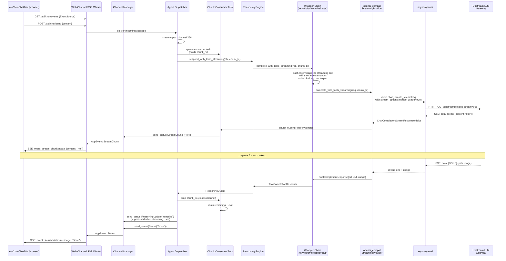

# feat: Token-Level Streaming for openai_compatible Backend via async-openai

## Overview

Add token-level SSE streaming for the `openai_compatible` LLM backend so that
chat responses appear in the IronClawChatTab progressively instead of arriving
as one batched `reasoning_update` event after the full LLM call completes.

The implementation adds a new direct-HTTP provider built on the `async-openai`
crate (instead of routing through `rig-core`), extends the `LlmProvider` trait
with optional streaming methods, makes every existing decorator wrapper
streaming-aware, and wires the dispatcher to plumb a per-turn chunk channel
through to the web SSE layer in correct order.

This is a fork-only change. We are explicitly avoiding the architectural traps
that caused upstream PR #1939 (`feat: token-level streaming for Responses API`)
to be rejected by the upstream maintainer.

## Problem Frame

**User-visible symptom:** In the lobsterpool web UI's IronClaw Chat tab, the
assistant message appears in one large drop after a long pause, rather than
streaming token-by-token like ChatGPT, Claude, etc. This is felt as a poor
chat experience.

**Root cause:** The IronClaw `LlmProvider` trait only exposes blocking
`complete()` / `complete_with_tools()`. The agent dispatcher therefore can
only emit a single `StatusUpdate::ReasoningUpdate { narrative }` per turn,
which the web channel forwards as one `reasoning_update` SSE event. There is
no token-level path. The `StatusUpdate::StreamChunk` variant exists but is
never emitted in the agent loop today (`grep StreamChunk src/agent/` yields
zero results), so the frontend's existing `stream_chunk` handler is dormant.

**Why upstream hasn't shipped this:** PR #1939 attempted streaming for the
NearAI provider only and was returned `changes requested` by core maintainer
`serrrfirat` with six substantive correctness defects (see Context & Research
below). The core problem is that streaming touches a long decorator chain
(retry, circuit breaker, smart routing, failover, cache, recording, token
refresh) and an Engine v2 bridge that uses thread-locals — getting wrapper
parity, async-safe context propagation, and chunk ordering correct is
non-trivial. We are doing this in our fork because:

1. We control the deployment (`LLM_BACKEND=openai_compatible` in lobsterpool)
   and need streaming for our production users now, not whenever upstream
   resolves PR #1939.
2. Our production scope is smaller — we only need streaming on one backend
   (`openai_compatible`) and one channel (`web`), so we can sidestep most of
   the complexity that blocked upstream (NearAI's complex SSE format, Engine
   v2 bridge thread-locals, and rig-core surgery).

## Requirements Trace

- **R1.** Token-level deltas must reach the IronClawChatTab via SSE
  `stream_chunk` events when the configured backend is the new
  `openai_compatible_streaming` variant.
- **R2.** Streaming requests must preserve all existing decorator wrapper
  semantics: retry, circuit breaker, smart routing, failover, cache,
  recording, and token refresh must each behave the same on streamed and
  non-streamed calls. (Addresses upstream PR #1939 H1.)
- **R3.** Per-turn chunk ordering must be deterministic — what the LLM
  emits in order N must reach the SSE client in order N. (Addresses
  upstream PR #1939 H3.)
- **R4.** Streaming context propagation must be async-safe — no
  `thread_local!` storage of per-request callbacks across `.await`
  points. (Addresses upstream PR #1939 H2.)
- **R5.** Mid-stream parser failures (truncated SSE, malformed JSON,
  incomplete tool argument deltas) must surface as errors, not as
  successful partial completions. (Addresses upstream PR #1939 M1.)
- **R6.** Tool calls reconstructed from streaming deltas must preserve
  the model's emission order, not be sorted by opaque ID. (Addresses
  upstream PR #1939 M2.)
- **R7.** Streamed requests must capture usage tokens for cost accounting
  by setting `stream_options.include_usage=true`, on both the text and
  tool paths. (Addresses upstream PR #1939 M3.)
- **R8.** Existing non-streaming providers (NearAI, RigAdapter-based
  OpenAI/Anthropic/Ollama, Bedrock, Codex, GitHub Copilot) must continue
  to work unchanged. The trait extension must default to the existing
  blocking path when streaming is not implemented.
- **R9.** The frontend must visibly stream chunks in IronClawChatTab when
  the agent runs against the new backend, with chunks appearing
  progressively rather than all at once.

## Scope Boundaries

**In scope:**
- New direct-HTTP `openai_compatible_streaming` LLM backend using
  `async-openai`.
- `LlmProvider` trait extension with streaming methods (default impls
  fall back to blocking `complete*` methods).
- Wrapper-by-wrapper streaming-aware delegation in: `RetryProvider`,
  `CircuitBreakerProvider`, `SmartRoutingProvider`, `FailoverProvider`,
  `CachedProvider`, `RecordingLlm`, `TokenRefreshingProvider`.
- Agent dispatcher plumbing of an explicit `mpsc::Sender<String>` chunk
  channel through `Reasoning::respond_with_tools` (no thread-locals).
- Web channel SSE emission ordering via a single per-turn consumer task.
- New `LLM_BACKEND=openai_compatible_streaming` env value with full
  config support in `src/config/llm.rs`.
- lobsterpool runtime adapter switched to provision the new backend env
  for IronClaw containers.
- Frontend verification (no code change — `IronClawChatTab.tsx` already
  has a `stream_chunk` handler from session 2026-04-08).

**Out of scope:**
- Streaming for NearAI, OpenAI (rig), Anthropic (rig), Ollama (rig),
  Bedrock, Codex, GitHub Copilot, openai_codex backends. They keep their
  existing blocking paths.
- Streaming through REPL, TUI, WASM channels (`StatusUpdate::StreamChunk`
  is already wired in those channels but we will not validate them as
  part of this plan).
- Engine v2 bridge (`crates/ironclaw_engine` + `src/bridge/`) streaming.
  We deliberately avoid this surface; if a request goes through the v2
  bridge it falls back to the blocking path.
- Frontend changes — `IronClawChatTab.tsx` already handles `stream_chunk`
  events correctly.
- Upstreaming this work back to `nearai/ironclaw`. That is a separate
  decision.
- Backporting fixes to upstream PR #1939.

## Context & Research

### Relevant Code and Patterns

**LlmProvider trait surface:**
- `src/llm/provider.rs` — `LlmProvider` trait definition. Currently has
  `complete()` and `complete_with_tools()` only. We add streaming
  variants with default impls.
- `src/llm/CLAUDE.md` — explicitly notes "No streaming support. All
  providers use non-streaming (blocking) Chat Completions requests" and
  the decorator chain ordering. This document must be updated as part
  of this work.

**Existing direct-HTTP provider as the structural template:**
- `src/llm/nearai_chat.rs` — closest precedent for a direct-HTTP
  provider. Uses `reqwest::Client` with retry-after header parsing,
  cost lookup, session token persistence. **Do not** copy its SSE
  parser; that is what PR #1939 tried to extend and got 6 bugs in.
  Instead delegate parsing to `async-openai`.

**Decorator wrappers — the 7 layers we must update:**
- `src/llm/retry.rs` — `RetryProvider` (exponential backoff with
  jitter).
- `src/llm/circuit_breaker.rs` — `CircuitBreakerProvider`
  (Closed/Open/HalfOpen state machine).
- `src/llm/smart_routing.rs` — `SmartRoutingProvider` (13-dimension
  complexity scorer for cheap/primary split).
- `src/llm/failover.rs` — `FailoverProvider` (per-provider cooldown
  fallback chain).
- `src/llm/response_cache.rs` — `CachedProvider` (SHA-256 keyed,
  text-only).
- `src/llm/recording.rs` — `RecordingLlm` (trace capture for E2E
  replay via `IRONCLAW_RECORD_TRACE`).
- `src/llm/token_refreshing.rs` — `TokenRefreshingProvider` (OpenAI
  Codex pre-emptive OAuth refresh).
- `src/llm/mod.rs` — `build_provider_chain()` wires all of these.

**Provider chain CLAUDE.md guidance:**
- `.claude/rules/review-discipline.md` explicitly states: *"Decorator/
  wrapper trait delegation: When adding a new method to LlmProvider
  (or any trait with decorator wrappers), update ALL wrapper types to
  delegate. Grep for `impl LlmProvider for` to find all
  implementations. Test through the full provider chain."* This rule
  exists because of past omissions. We must obey it.

**Agent dispatcher and reasoning loop:**
- `src/agent/dispatcher.rs` — main agent loop. Calls
  `Reasoning::respond_with_tools(reason_ctx)`. The narrative is
  emitted as `StatusUpdate::ReasoningUpdate` after the call returns.
- `src/llm/reasoning.rs` — `Reasoning` struct. Calls
  `complete_with_tools()` from inside `respond_with_tools()`. We add a
  parallel `respond_with_tools_streaming(ctx, &chunk_tx)` method that
  threads the channel down.

**Web channel SSE plumbing:**
- `src/channels/channel.rs` — `StatusUpdate::StreamChunk(String)`
  variant exists. `Channel::send_status` is the entry point.
- `src/channels/web/mod.rs:581` — converts
  `StatusUpdate::StreamChunk(content)` to `AppEvent::StreamChunk` and
  broadcasts via `state.sse.broadcast_for_user(uid, event)`.
- `src/channels/web/responses_api.rs:711-1020` — `streaming_worker()`
  background task that serializes `AppEvent` to SSE frames.
- `crates/ironclaw_common/src/event.rs:82` — `AppEvent::StreamChunk
  { content, thread_id }` shape.

**Frontend (already handles `stream_chunk`):**
- `lobsterpool/web/src/components/agent-chat/IronClawChatTab.tsx` —
  has an `addEventListener('stream_chunk', ...)` handler at line ~111
  that appends to a streaming message. Added in session 2026-04-08.
  No change needed for this plan.

**Lobsterpool deployment wiring:**
- `lobsterpool/crates/lp-orchestrator/src/runtime_adapter/ironclaw.rs`
  — currently sets `LLM_BACKEND=openai_compatible`. Will be flipped to
  the new value as a small additional change.

### Institutional Learnings

`docs/solutions/` does not contain prior streaming-specific learnings,
but several adjacent rules in `.claude/rules/` apply:
- `review-discipline.md` — decorator delegation rule (cited above).
- `review-discipline.md` — sensitive data redaction in events: streaming
  text chunks must still pass through any existing redaction layer
  before broadcast (see `redact_params()` rule).
- `testing.md` — every bug fix needs a regression test; for new code
  every feature-bearing unit needs unit tests inside `mod tests {}`.
- `review-discipline.md` — UTF-8 string safety: streaming chunk
  boundaries can split multi-byte characters; the chunk consumer must
  buffer at the byte level and only emit complete UTF-8 sequences (or
  alternatively, only emit at character boundaries).

### External References

- **PR #1939: feat: token-level streaming for Responses API**
  — `nearai/ironclaw#1939`. Open, mergeable: CONFLICTING, +846/-29.
  Reviewed by `serrrfirat` (core), `changes requested`. The 6 issues
  (cited inline above as H1, H2, H3, M1, M2, M3) directly motivate
  R2-R7. This plan is in many respects "PR #1939 done correctly for
  our smaller scope."
- **Issue #225: feat: classify SSE streaming chunks by type
  (content, reasoning, tool_call)** — `nearai/ironclaw#225`. Author
  `ilblackdragon` (project lead). Confirms streaming is on the
  upstream roadmap and enumerates the chunk classification we will
  eventually want, but is out of scope here.
- **Issue #741: feat: add Bedrock streaming support via
  converse_stream()** — `nearai/ironclaw#741`. Confirms upstream
  recognizes the LlmProvider trait needs streaming methods and
  acknowledges adding them is a prerequisite.
- **Issue #1691** — `nearai/ironclaw#1691`. User report that the
  current `openai_compatible` backend can't ingest streaming
  responses; some compatible servers send `data:` chunks that the
  blocking parser chokes on. Adjacent confirmation that this matters
  to real users.
- **`async-openai` crate** — `https://crates.io/crates/async-openai`,
  `https://github.com/64bit/async-openai`. Widely-used (~3k stars)
  Rust OpenAI client built from the OpenAPI spec. Supports custom
  `base_url` via `OpenAIConfig::with_api_base()`, SSE streaming via
  `client.chat().create_stream()`, streaming tool-call deltas via
  `ChatCompletionStreamResponseDelta::tool_calls`, and
  `stream_options.include_usage=true` for usage in the final chunk.
  Used by genai, openai-tools, and many production projects.

## Key Technical Decisions

- **Use `async-openai` instead of writing our own SSE parser.**
  Rationale: PR #1939 wrote ~358 lines of custom SSE accumulator in
  `nearai_chat.rs` and the reviewer found 5 of 6 bugs in that
  hand-written code (M1 truncation handling, M2 tool ordering, M3
  usage flag, plus parts of H3 ordering). Delegating SSE parsing to a
  battle-tested upstream crate eliminates an entire class of bugs.
  Tradeoff: adds one ~1MB compile-time dependency on top of `rig-core`,
  which is acceptable.

- **New backend variant rather than mutating `openai_compatible`.**
  Rationale: Adding `LLM_BACKEND=openai_compatible_streaming` instead
  of changing `openai_compatible` behavior in place lets us roll
  forward and back via lobsterpool config alone. If the streaming
  provider has a regression, flipping one env var reverts to the
  current rig-based blocking provider with no rebuild. This is the
  fork's equivalent of a feature flag.

- **Default-impl trait extension, not a parallel trait.**
  Rationale: Adding `complete_streaming()` and
  `complete_with_tools_streaming()` to the existing `LlmProvider`
  trait with default implementations that fall back to the blocking
  path lets all 8 existing providers compile without modification.
  Wrappers must explicitly delegate (per the project rule), but raw
  providers don't have to opt in. Alternative: a separate
  `StreamingLlmProvider` trait — rejected because it would force every
  caller to handle two trait objects and complicate the dispatcher.

- **Explicit `tokio::sync::mpsc::Sender<String>` parameter, no
  thread-locals, no per-token spawn.**
  Rationale: Upstream PR #1939 used `thread_local! CURRENT_STREAM_CTX`
  set before each engine call and read in the `on_token` callback.
  Tokio futures resume on different worker threads after `.await`, so
  this is racy and reviewer flagged as H2. Passing the channel
  explicitly through the call stack is async-safe by construction.
  PR #1939 also `tokio::spawn`'d one task per token, causing
  nondeterministic chunk order (H3); a single `mpsc` channel with one
  consumer drains chunks in FIFO order and emits SSE events
  sequentially.

- **Skip Engine v2 bridge entirely.**
  Rationale: `src/bridge/router.rs` and `src/bridge/llm_adapter.rs`
  call `LlmProvider::complete*()` from inside the engine. PR #1939
  added thread-local streaming there and it was the source of H2.
  We do not currently route IronClaw production through the v2 engine,
  so not implementing streaming on that path is acceptable. If a
  request reaches the v2 bridge, it transparently uses the blocking
  default impl.

- **Web channel only for v1.**
  Rationale: REPL, TUI, and WASM channels already accept
  `StatusUpdate::StreamChunk` (see `src/channels/repl.rs:735`,
  `src/channels/wasm/wrapper.rs:3789`). The dispatcher emitting
  `StreamChunk` will benefit them automatically once it starts emitting.
  But we will not validate them as part of this plan — testing focuses
  exclusively on the web channel + lobsterpool integration path.

- **Cache layer skips streaming entirely.**
  Rationale: `CachedProvider` already does not cache
  `complete_with_tools()` because tool calls have side effects. By
  parity, streaming requests (which always have a transient consumer
  on the other end) should never go through cache hits — the cached
  full response cannot be replayed as deltas without lying about
  timing. The `complete_streaming` wrapper for `CachedProvider` will
  delegate directly to inner without consulting the cache.

- **Single chunk-channel buffer size, configurable but not exposed.**
  Rationale: Bounded `mpsc::channel(N)` provides backpressure if the
  consumer (web SSE worker) falls behind the producer (LLM stream).
  Use 256 as a starting buffer; record this as a deferred tunable.
  Unbounded would risk memory blow-up on long responses to slow
  clients.

## Open Questions

### Resolved During Planning

- **Q: Should we use rig-core 0.30's `StreamingCompletion` trait
  instead?**
  A: No. rig-core's streaming surface is documented as immature for
  tool-use streaming, and PR #1939's bug list shows even with a
  hand-rolled parser the team got tool call ordering wrong. Using a
  dedicated OpenAI-shaped client (`async-openai`) targeted at one
  protocol is lower risk than broadening rig surgery across all
  providers. (User confirmed Path A in session.)
- **Q: Should this also fix NearAI streaming?**
  A: No. Production uses `LLM_BACKEND=openai_compatible`, confirmed
  via grep of `lobsterpool/crates/lp-orchestrator/src/runtime_adapter/
  ironclaw.rs`. NearAI streaming is left to upstream PR #1939.
- **Q: Where does the chunk channel live — provider, dispatcher, or
  channel manager?**
  A: Created by the dispatcher per turn, passed down into the
  reasoning call, drained by a sibling consumer task in the dispatcher
  that calls `channels.send_status(StatusUpdate::StreamChunk)` once
  per chunk. Single-producer (provider), single-consumer (dispatcher),
  ordering preserved by `mpsc` semantics.
- **Q: How should we trigger streaming — env var, per-channel
  capability, or per-request?**
  A: Per-turn channel parameter on the trait. The provider streams iff
  the caller passes a channel; otherwise it uses the blocking path.
  This means streaming is opt-in by call site, which is safer than
  env-var-toggled global behavior.
- **Q: Frontend changes?**
  A: None. The session 2026-04-08 fix already added `stream_chunk`
  handler in `IronClawChatTab.tsx` that appends to a streaming message
  in order. Verified by reading the file.
- **Q: How do we handle UTF-8 boundary splits inside a chunk?**
  A: `async-openai` returns `String`-typed deltas which are guaranteed
  valid UTF-8 by the library (it parses JSON-decoded strings, not raw
  bytes). We do not need to byte-buffer at our layer.

### Deferred to Implementation

- **Exact `async-openai` version pin.** Need to check the latest
  version when starting the work and confirm it builds against
  IronClaw's current `tokio`/`reqwest` versions. Defer until
  Cargo.toml edit.
- **Whether `complete_streaming` should return a partial
  `CompletionResponse` on stream finalization or stream-then-fold.**
  PR #1939 chose stream-then-return-final-aggregate. We will do the
  same so that the existing return-type contract remains; the chunks
  go out via the channel as a side effect.
- **Failover behavior on mid-stream failure.** If chunks have already
  been emitted when the underlying provider errors, can the failover
  wrapper retry on a sibling provider? Probably not — the consumer
  has already seen partial output. Initial behavior: surface the
  error and let the agent loop decide. Refine after first
  implementation.
- **Streaming path for `complete_with_tools` when tools are present
  in the request.** PR #1939's reviewer noted that the original
  implementation effectively disabled streaming when tools were in
  context. We need streaming with tool deltas (R6). `async-openai`
  exposes tool-call deltas in `ChatCompletionStreamResponseDelta`;
  exact accumulation policy (when to emit narrative chunks vs hold
  for tool resolution) is an implementation detail tied to how the
  reasoning loop wants to display intermediate text. Defer to
  implementation experimentation.
- **Recording wrapper format for streamed responses.** The current
  `RecordingLlm` writes a single LLM step per call. Streaming should
  probably record the final aggregated response identical to the
  blocking shape (so trace replay still works) and optionally record
  delta count for debugging. Defer.

## High-Level Technical Design

> *This illustrates the intended approach and is directional guidance
> for review, not implementation specification. The implementing agent
> should treat it as context, not code to reproduce.*

### Component flow



### Trait extension shape (pseudo-code, directional)

```text
trait LlmProvider:
    fn complete(&self, req) -> CompletionResponse        # unchanged
    fn complete_with_tools(&self, req) -> ToolCompletionResponse  # unchanged

    # NEW with default impl that delegates to the blocking method
    # and ignores the channel (for unmodified providers)
    fn complete_streaming(&self, req, chunk_tx) -> CompletionResponse
        default: drop chunk_tx, call self.complete(req)

    fn complete_with_tools_streaming(&self, req, chunk_tx)
            -> ToolCompletionResponse
        default: drop chunk_tx, call self.complete_with_tools(req)
```

### Wrapper delegation pattern (one example, directional)

```text
impl LlmProvider for RetryProvider:
    fn complete_streaming(&self, req, chunk_tx) -> CompletionResponse:
        # mirror retry behavior of blocking complete:
        # exponential backoff with jitter, retry on transient errors
        # but: do not retry once chunk_tx has emitted any chunk,
        #      because the consumer already saw partial output
        for attempt in 0..max_retries:
            create per-attempt sub-channel (one-shot relay)
            result = self.inner.complete_streaming(req, sub_tx)
            if any_chunk_was_relayed: return result   # cannot retry
            if is_retryable(result.err): backoff; continue
            return result
```

## Implementation Units

The work is broken into 7 units across 3 phases. Phase 1 lands the
trait surface (no behavior change yet). Phase 2 adds the new provider
and dispatcher wiring. Phase 3 ships the lobsterpool flip and
verification.

### Phase 1 — Trait surface and wrapper parity (no end-user behavior change yet)

- [x] **Unit 1: Extend `LlmProvider` trait with streaming methods**

**Goal:** Add `complete_streaming()` and `complete_with_tools_streaming()`
to the `LlmProvider` trait with default implementations that delegate
to the existing blocking methods (ignoring the chunk channel). This
unblocks all subsequent units while leaving every existing provider
behaviorally unchanged.

**Requirements:** R8 (blocking providers continue to work).

**Dependencies:** None.

**Files:**
- Modify: `src/llm/provider.rs` (trait definition)
- Modify: `src/llm/CLAUDE.md` (remove "No streaming support" note;
  document the new trait shape)
- Test: `src/llm/provider.rs` (unit tests within `mod tests {}`)

**Approach:**
- Add a new chunk-channel type alias (likely `tokio::sync::mpsc::Sender
  <String>`, exact name deferred) in `provider.rs`.
- Add the two streaming methods to the trait with `async fn` and
  default impls that drop the sender and call the blocking method.
- Verify with `cargo check --all-features` that no provider needs
  modification yet.

**Patterns to follow:**
- Mirror the `async-trait` annotation style already used on
  `LlmProvider`.
- Mirror the `default impl` pattern already used by `list_models()`,
  `model_metadata()`, `effective_model_name()`.

**Test scenarios:**
- *Happy path:* A test stub provider that only implements `complete()`
  and `complete_with_tools()` can be called via the new
  `complete_streaming()` method and returns the same response, with no
  chunks delivered through the channel.
- *Edge case:* Calling `complete_streaming()` with a closed (already
  dropped) chunk_tx must not panic.
- *Edge case:* Calling `complete_streaming()` and then dropping the
  receiver before the call completes must not deadlock or panic on
  the producer side.

**Verification:**
- `cargo check --all-features` builds with zero warnings.
- `cargo test --lib llm::provider` passes the new default-impl tests.

---

- [ ] **Unit 2: Make all 7 decorator wrappers streaming-aware**

**Goal:** Add explicit streaming-aware delegation in `RetryProvider`,
`CircuitBreakerProvider`, `SmartRoutingProvider`, `FailoverProvider`,
`CachedProvider`, `RecordingLlm`, and `TokenRefreshingProvider`. Each
wrapper must apply the same wrap semantics on streaming as on its
blocking counterpart.

**Requirements:** R2 (wrapper parity).

**Dependencies:** Unit 1.

**Files:**
- Modify: `src/llm/retry.rs`
- Modify: `src/llm/circuit_breaker.rs`
- Modify: `src/llm/smart_routing.rs`
- Modify: `src/llm/failover.rs`
- Modify: `src/llm/response_cache.rs`
- Modify: `src/llm/recording.rs`
- Modify: `src/llm/token_refreshing.rs`
- Test: each wrapper file's existing `mod tests {}` block

**Approach:**
- For each wrapper, override both `complete_streaming` and
  `complete_with_tools_streaming` (do not rely on the trait default,
  which would silently bypass the wrapper — this is exactly the H1
  bug from PR #1939).
- **Retry**: behaves the same as blocking until any chunk has been
  relayed; once relayed, retries are disabled because the consumer has
  observed partial output. Use a per-attempt forwarding sub-channel
  to detect first-chunk emission.
- **CircuitBreaker**: count streaming successes/failures the same way
  as blocking; treat mid-stream errors as failures.
- **SmartRouting**: pick cheap vs primary using the same scorer; route
  the streaming call to the chosen inner provider.
- **Failover**: same fallback list semantics; error handling on
  mid-stream cannot fall over (consumer already saw chunks) — record
  this as a known limitation in the implementation comment.
- **Cache**: streaming methods bypass the cache entirely (do not
  consult, do not populate). Document the rationale.
- **Recording**: when streaming, build the final aggregate response
  for the trace (matching blocking-call shape) and optionally record
  delta count.
- **TokenRefreshing**: pre-emptive refresh + retry on 401 must apply
  to streaming the same as blocking.

**Execution note:** Implement each wrapper test-first — write a test
that calls the wrapper's streaming method and asserts the wrap
semantic (e.g., retry on transient error, circuit-break on threshold)
before changing production code. This is the discipline that catches
the H1 bug class.

**Patterns to follow:**
- The existing blocking impls in each file. Each wrapper already
  expresses its semantic in `complete()` / `complete_with_tools()`;
  the streaming versions should mirror that structure exactly,
  substituting the streaming inner call.
- `.claude/rules/review-discipline.md` decorator delegation rule.

**Test scenarios:**
- *Retry happy path:* `RetryProvider` wraps a stub that succeeds
  immediately on streaming; chunks pass through unchanged; no retry
  attempted.
- *Retry on transient before any chunk:* stub returns
  `LlmError::RequestFailed` on attempt 1, success on attempt 2;
  wrapper retries; final stream succeeds; backoff sleep observed.
- *Retry NOT attempted after first chunk:* stub emits one chunk then
  errors; wrapper does NOT retry; the error propagates.
- *Circuit breaker open:* threshold reached via repeated streaming
  failures; subsequent streaming calls fail-fast with the cooldown
  message.
- *Cache bypass:* `CachedProvider` `complete_streaming()` never
  consults the cache; even after multiple identical requests, cache
  size remains zero on the streaming code path.
- *SmartRouting cheap vs primary:* a cheap-eligible request routes
  through the cheap provider's streaming method; a primary-eligible
  request routes through the primary provider's streaming method.
- *Failover passthrough:* with a single provider in the list,
  streaming works; the wrapper does not introduce any chunk
  duplication.
- *Recording captures aggregate:* a streaming trace records exactly
  one LLM step entry whose content matches the concatenated chunks.
- *TokenRefresh on 401:* stub returns 401 once with refresh hint;
  wrapper refreshes token and retries the streaming call exactly
  once.
- *Default-impl regression guard:* a deliberately-incomplete test
  wrapper that does NOT override the streaming methods uses the
  trait default; this is asserted to NOT be reachable in
  production by adding a `#[deny(...)]` or compile-time check that
  every wrapper in `mod.rs` overrides both streaming methods.

**Verification:**
- `cargo test --lib llm::` passes for all 7 wrapper modules.
- `grep -rn 'impl LlmProvider for' src/llm/` confirms every wrapper
  has explicit streaming overrides (not relying on defaults).

---

### Phase 2 — New provider and dispatcher wiring

- [ ] **Unit 3: Add `async-openai` dependency and new
  `OpenAiCompatibleStreamingProvider`**

**Goal:** Add `async-openai` to `Cargo.toml`, create
`src/llm/openai_compatible_streaming.rs` implementing `LlmProvider`
with real streaming for both `complete_streaming` and
`complete_with_tools_streaming`, and wire the new backend into the
factory in `src/llm/mod.rs`.

**Requirements:** R1, R5 (parser correctness), R6 (tool order), R7
(usage accounting).

**Dependencies:** Unit 1 (trait surface available).

**Files:**
- Modify: `Cargo.toml` (add `async-openai` to `[dependencies]`)
- Modify: `Cargo.lock` (auto-generated)
- Create: `src/llm/openai_compatible_streaming.rs`
- Modify: `src/llm/mod.rs` (add `pub mod openai_compatible_streaming;`,
  add variant to `LlmBackend` enum, wire into the factory match)
- Modify: `src/config/llm.rs` (add config struct + env var parsing for
  the new backend)
- Modify: `.env.example` (document the new backend value and any new
  env vars)
- Modify: `src/llm/CLAUDE.md` (add a row to the backend table)
- Test: `src/llm/openai_compatible_streaming.rs` (within `mod tests {}`)
- Test: `tests/openai_compatible_streaming_integration.rs` (live test
  behind `--features integration -- --ignored`)

**Approach:**
- `OpenAiCompatibleStreamingProvider` holds an `async-openai`
  `Client<OpenAIConfig>` configured with the user-supplied
  `LLM_BASE_URL`, `LLM_API_KEY`, and `LLM_MODEL` env vars (mirroring
  the existing `openai_compatible` backend's config keys for
  drop-in compatibility).
- Implement the four trait methods: blocking `complete()` and
  `complete_with_tools()` use `client.chat().create()`; streaming
  `complete_streaming()` and `complete_with_tools_streaming()` use
  `client.chat().create_stream()`.
- For both streaming variants, set `stream_options.include_usage=true`
  on the request (R7).
- Translate IronClaw `ChatMessage` / `ToolDefinition` /
  `ToolCompletionRequest` types to async-openai's request types in a
  helper module shared between the blocking and streaming methods.
- For the streaming methods, drive the async-openai
  `ChatCompletionResponseStream` and on each delta:
  - Send any text delta through `chunk_tx.send(...).await`. If the
    receiver is dropped (caller no longer cares), abort the stream
    and return the accumulated partial as a clean error.
  - Accumulate tool-call deltas indexed by stream index (R6 — never
    by id).
  - On `[DONE]`, build the final `CompletionResponse` /
    `ToolCompletionResponse` from the accumulated buffers + usage
    chunk.
- On any parse error or `async-openai` error mid-stream: surface as
  `LlmError`, do not return success with a partial buffer (R5).
- Cost accounting: read usage from the final chunk; compute via the
  existing `costs::model_cost()` lookup with the configured model
  name.

**Patterns to follow:**
- `src/llm/nearai_chat.rs` for the overall provider file structure
  (constructor, config struct, model name handling, cost lookup,
  retry-after parsing if relevant).
- `src/llm/CLAUDE.md` "Adding a New Provider" instructions (the
  4-step recipe).
- `.claude/rules/testing.md` for the integration test gating pattern.

**Test scenarios:**
- *Blocking happy path (unit, with mocked HTTP):* a `complete()` call
  against a stubbed server returns the expected `CompletionResponse`.
- *Blocking with tools (unit, mocked):* `complete_with_tools()` returns
  the expected `ToolCompletionResponse` with one or more tool calls
  in the order the server emitted them.
- *Streaming happy path (unit, mocked SSE server):*
  `complete_streaming()` against a stub server that emits 5 deltas
  results in 5 messages on `chunk_tx`, in order, and a final
  aggregate response equal to the concatenation.
- *Streaming with tools (unit, mocked):* `complete_with_tools_
  streaming()` against a stub that emits text deltas and then a
  multi-tool-call delta accumulates the tool calls in stream-index
  order. Asserts that swapping the SSE event ordering on the server
  changes the resulting tool call vector accordingly. (R6)
- *Streaming usage capture (unit, mocked):* the mock server emits a
  final chunk with `usage: {prompt_tokens: 10, completion_tokens:
  20}`; the returned `CompletionResponse` reports those numbers, and
  computed cost is non-zero. (R7)
- *Streaming truncation surfaces error (unit, mocked):* the mock
  server closes the connection mid-stream after 2 deltas; the
  provider returns `LlmError::RequestFailed` (or similar). It does
  NOT return a successful response with the 2-delta partial. (R5)
- *Streaming malformed JSON surfaces error (unit, mocked):* the mock
  server emits a `data:` line with invalid JSON; provider returns
  an error. (R5)
- *Receiver dropped early:* caller drops `chunk_rx` mid-stream;
  provider stops sending and returns cleanly without panicking.
- *Per-request model override is respected:* if the request specifies
  a model different from the configured default, the HTTP request
  uses the per-request model.
- *Live integration test (`--features integration -- --ignored`):*
  point at a real OpenAI-compatible endpoint via env vars and run a
  short streaming request; assert chunks > 1 and aggregate text
  non-empty. Modeled on `integrations/abound/tests/test_abound_e2e.py`
  test #7 from PR #1939's diff.

**Verification:**
- `cargo build --all-features` builds with zero warnings.
- `cargo test --lib llm::openai_compatible_streaming` passes all unit
  tests.
- Setting `LLM_BACKEND=openai_compatible_streaming` with valid env
  vars and running `cargo run --bin ironclaw` starts up without
  errors (smoke check).

---

- [ ] **Unit 4: Plumb chunk channel from dispatcher through
  `Reasoning::respond_with_tools_streaming`**

**Goal:** Add a parallel `respond_with_tools_streaming(ctx,
chunk_tx)` method on `Reasoning` that calls the new
`complete_with_tools_streaming` instead of the blocking version, and
update `agent::dispatcher` to create a per-turn mpsc channel, spawn
the consumer task, call the streaming reasoning method, and clean up
on completion.

**Requirements:** R3 (ordering), R4 (async-safe propagation).

**Dependencies:** Units 1, 2, 3.

**Files:**
- Modify: `src/llm/reasoning.rs`
- Modify: `src/agent/dispatcher.rs`
- Test: `src/agent/dispatcher.rs` (within `mod tests {}`)
- Test: `src/llm/reasoning.rs` (within `mod tests {}`)

**Approach:**
- In `reasoning.rs`, add `respond_with_tools_streaming(ctx, chunk_tx)`
  that mirrors `respond_with_tools` but calls the streaming method on
  the inner provider. Pass the chunk_tx through unchanged.
- In `dispatcher.rs`, in the path that handles a user message turn:
  - Create a `tokio::sync::mpsc::channel::<String>(256)`.
  - `tokio::spawn` a consumer task that owns the receiver, the
    channel manager handle, and the message metadata. The consumer
    loops `recv().await` and on each chunk calls
    `channels.send_status(channel, StatusUpdate::StreamChunk(s),
    metadata)`. When the sender is dropped, it exits cleanly.
  - Call `reasoning.respond_with_tools_streaming(ctx, chunk_tx)` —
    pass the sender by move so the consumer's loop ends when the
    reasoning call returns and the sender drops out of scope.
  - After the reasoning call returns, await the consumer task's
    JoinHandle to ensure all chunks have been flushed before the
    dispatcher emits the post-turn `Status("Done")` event. This is
    the deterministic ordering primitive (R3).
  - Suppress the existing `StatusUpdate::ReasoningUpdate { narrative
    }` emission when the streaming path was used, because the
    narrative was already streamed via `StreamChunk`. The `decisions`
    field, if non-empty, can still be sent as a structured event for
    UI purposes.
- Decide opt-in: route through streaming when the channel kind is the
  web channel AND the configured backend implements streaming
  natively. Other channels and other backends fall through to
  `respond_with_tools` blocking.

**Patterns to follow:**
- `src/agent/dispatcher.rs` existing `execute_tool_calls` and
  reasoning-emit pattern (around line 745).
- `tokio::sync::mpsc` standard ownership idioms — sender dropped
  automatically when the function returns.
- `tokio::task::JoinHandle::await` for deterministic completion.

**Test scenarios:**
- *Happy path (integration with a fake provider):* dispatcher runs a
  user turn against an in-memory provider that streams 5 chunks; the
  test channel records 5 `StreamChunk` events in order followed by a
  `Status("Done")`.
- *Ordering invariant:* run the happy-path test 100 times in a loop
  inside one `#[tokio::test]`; assert order is identical each time
  (R3 regression).
- *Producer error mid-stream:* fake provider sends 2 chunks then
  errors; dispatcher emits 2 `StreamChunk` events, then an `Error`
  status, then no `Done`.
- *Consumer outlives producer:* fake provider sends all chunks
  rapidly and finishes; dispatcher awaits the JoinHandle so the
  `Done` event arrives strictly after all 5 chunks (no flake).
- *Backpressure:* fake provider sends 1000 chunks rapidly; consumer
  task drains them all; no chunk is lost; the dispatcher's
  observable channel emission count equals 1000.
- *Cancel safety:* dispatcher is cancelled (drop the future)
  mid-stream; both producer and consumer exit cleanly without
  panic (smoke).
- *Non-streaming fallback:* with a backend that does not implement
  streaming, the dispatcher path uses the existing
  `respond_with_tools` and emits exactly one `ReasoningUpdate`
  (regression guard for R8).
- *Streaming suppresses ReasoningUpdate:* with the streaming
  backend, the post-turn emission count for `ReasoningUpdate` is
  zero (or only contains `decisions`, never the `narrative`
  duplicate).

**Verification:**
- `cargo test --lib agent::dispatcher` and `cargo test --lib
  llm::reasoning` pass.
- Manual smoke: with `LLM_BACKEND=openai_compatible_streaming`, run
  IronClaw locally, send a chat message via the web gateway, observe
  multiple `stream_chunk` SSE events in browser DevTools followed by
  a single `status: Done`.

---

- [ ] **Unit 5: Web channel ordering verification + SSE serialization
  check**

**Goal:** Verify that `StatusUpdate::StreamChunk` reaches the SSE
client in order through the existing `src/channels/web/mod.rs` and
`src/channels/web/responses_api.rs` paths, and add an integration test
that covers the full producer-to-browser-frame round trip via an
in-process HTTP client.

**Requirements:** R3 (ordering all the way to the wire), R9 (visible
streaming).

**Dependencies:** Unit 4.

**Files:**
- Modify (small): `src/channels/web/mod.rs` if any sequencing change
  is needed (most likely none — `send_status` is already in-order).
- Test: `tests/web_streaming_integration.rs` (new integration test)

**Approach:**
- Read `src/channels/web/mod.rs:546-684` and confirm
  `StatusUpdate::StreamChunk(content)` already converts cleanly to
  `AppEvent::StreamChunk { content, thread_id }` and
  `state.sse.broadcast_for_user(uid, event)` preserves arrival order.
  Most likely no code change is needed here, only verification.
- Confirm `src/channels/web/responses_api.rs:711-1020`
  `streaming_worker()` reads from the broadcast channel sequentially
  and writes to the HTTP response in arrival order. No change
  expected.
- Write an integration test that:
  - Spins up the web gateway against a fake LlmProvider that streams
    a known sequence of chunks.
  - Connects via an in-process HTTP client to `/api/chat/events`.
  - POSTs a message to `/api/chat/send`.
  - Reads the SSE stream from the events endpoint and asserts the
    chunks arrive in the same order the fake provider produced them,
    followed by a `Done` status.

**Patterns to follow:**
- Existing `tests/*.rs` integration test patterns; specifically any
  existing web gateway test that uses an in-process server.

**Test scenarios:**
- *Round trip ordering:* fake provider emits chunks A, B, C; SSE
  stream observed by HTTP client emits stream_chunk A, stream_chunk
  B, stream_chunk C, status Done — in this exact order, every time.
- *Multiple concurrent users:* two fake users with two streaming
  turns happen simultaneously; chunks for user 1 are not delivered
  to user 2's SSE channel and vice versa. Verifies multi-tenant
  isolation is preserved across the new streaming path (no shared
  state leak — guards against the H2 bug class).
- *Slow consumer:* one client reads slowly while the producer
  streams fast; chunks are not lost; eventually all chunks arrive
  in order.

**Verification:**
- `cargo test --test web_streaming_integration` passes.
- Manual smoke: open the web UI, send a chat, observe streaming.

---

### Phase 3 — Lobsterpool integration and end-to-end verification

- [ ] **Unit 6: Switch lobsterpool runtime adapter to provision the
  new backend**

**Goal:** Update the lobsterpool IronClaw runtime adapter to set
`LLM_BACKEND=openai_compatible_streaming` for newly-created agents,
and verify the existing fields (`LLM_BASE_URL`, `LLM_API_KEY`,
`LLM_MODEL`) carry over unchanged.

**Requirements:** R1 (visible at production deployment).

**Dependencies:** Unit 3 (backend exists in IronClaw image).

**Files:**
- Modify: `lobsterpool/crates/lp-orchestrator/src/runtime_adapter/
  ironclaw.rs`
- Test: `lobsterpool/crates/lp-orchestrator/src/runtime_adapter/
  ironclaw.rs` (existing assertion test updated)

**Approach:**
- Change the env-insertion line from
  `env.insert("LLM_BACKEND", "openai_compatible")` to the new value.
- Update the existing assertion test that checks
  `env.get("LLM_BACKEND")` to expect the new value.
- Ensure the new IronClaw image (built from this fork) is the one
  pulled by lobsterpool when provisioning agents (this is a
  deployment concern outside the plan scope but must be verified
  before promotion).

**Patterns to follow:**
- Existing env-injection structure in
  `lp-orchestrator/src/runtime_adapter/ironclaw.rs`.

**Test scenarios:**
- *Happy path:* the existing `assert_eq!(env.get("LLM_BACKEND"))`
  test passes with the new expected value.

**Verification:**
- `cargo test --package lp-orchestrator runtime_adapter::ironclaw`
  passes.

---

- [ ] **Unit 7: End-to-end verification through lobsterpool web UI**

**Goal:** Run a real chat turn through the lobsterpool web UI against
a freshly-provisioned IronClaw agent backed by the new streaming
provider, observe progressive chunk rendering in the
`IronClawChatTab`, and capture a short verification artifact (browser
DevTools screenshot or HAR) showing multiple `stream_chunk` SSE
events arriving over time.

**Requirements:** R9 (visible streaming end-to-end).

**Dependencies:** Units 1-6.

**Files:**
- No code changes.
- Test: this is execution-time verification, not a unit test. It
  belongs to `ce:work` rather than the plan.

**Approach:**
- Build the new IronClaw image from this fork.
- Restart the lobsterpool stack and provision a fresh agent.
- Open `IronClawChatTab` in the web UI.
- Send a message that elicits a multi-paragraph response.
- Observe progressive rendering. Capture DevTools Network tab
  showing repeated `stream_chunk` events in the SSE stream over a
  span of seconds, not all at once at the end.
- If observed: ship.
- If not observed: file what was seen vs expected and re-enter
  systematic-debugging.

**Test scenarios:**
- *Visible streaming:* user types a message; assistant message
  begins appearing within ~500ms of first token from the upstream
  LLM gateway, and continues to grow over the response duration.
  No long pause-then-batch.
- *Final state matches blocking:* the final fully-rendered message
  is identical to what would have been received in blocking mode.
- *No duplicate `reasoning_update`:* DevTools shows
  `stream_chunk` events but no `reasoning_update` event for the
  same turn (because Unit 4 suppresses it).
- *No regression on other channels:* existing test agents on a
  non-streaming backend continue to work unchanged.

**Verification:**
- Captured artifact (screenshot or HAR) shows chunks over time.
- A 5-minute manual exploratory session against a real LLM gateway
  produces no errors, no missing chunks, no out-of-order text.

## System-Wide Impact

- **Interaction graph:** Touches the LLM provider trait, all 7
  decorator wrappers, the agent dispatcher, the reasoning engine, and
  the web channel SSE serialization. The web channel `send_status`
  path is the integration seam. The decorator wrappers form the
  delegation chain that PR #1939 broke; we restore parity here.
- **Error propagation:** Mid-stream errors in the new provider become
  `LlmError` returned from the streaming method. The reasoning engine
  surfaces them like any other LLM error. The agent dispatcher emits
  an `Error` status to the channel. Once any `StreamChunk` has been
  forwarded to the client, retry/failover is disabled — partial
  output is a contract with the consumer.
- **State lifecycle risks:**
  - The per-turn `mpsc::channel(256)` is created and destroyed per
    turn. No persistence. Drop-on-end semantics close the consumer
    task cleanly.
  - The trait-default fallback means an unmodified provider on the
    streaming path silently degrades to one batched
    `StreamChunk`-per-call (effectively the current behavior). This
    is intentional — it makes the rollout safer.
  - Cache: streaming bypasses the cache. Long-term consequence:
    streamed turns do not populate the response cache. Acceptable
    given the cache is keyed on full responses anyway.
- **API surface parity:** The IronClaw HTTP `/api/chat/events`
  contract gains denser `stream_chunk` traffic (which is already in
  the SSE event vocabulary). The `/api/chat/send` request shape does
  not change. Existing clients that ignore `stream_chunk` events
  (everything except the lobsterpool IronClawChatTab) are unaffected.
- **Integration coverage:** Unit-level wrapper tests (Unit 2) catch
  per-wrapper semantic regressions but cannot prove the full chain
  works. Unit 5's web round-trip test and Unit 7's manual e2e cover
  the cross-layer behavior. The ordering invariant test in Unit 4
  (run 100x in a loop) is the regression guard for the H3 bug class.
- **Unchanged invariants:**
  - All non-streaming providers (NearAI, RigAdapter-based providers,
    Bedrock, Codex, GitHub Copilot, openai_codex, openai_compatible
    via rig) remain blocking and behave identically.
  - The Engine v2 bridge path (`src/bridge/`) continues to call the
    blocking trait methods; no streaming attempted there.
  - REPL, TUI, WASM channels continue to work (they already accept
    `StreamChunk` but we do not validate them).
  - All existing decorator semantics (retry counts, circuit breaker
    thresholds, smart routing scoring, failover cooldowns,
    recording trace shape) are preserved in the streaming path by
    construction.

## Risks & Dependencies

| Risk | Mitigation |
|------|------------|
| Adding streaming to a wrapper while forgetting to override one of `complete_streaming` / `complete_with_tools_streaming` silently bypasses that wrapper (re-introducing the H1 bug class) | Unit 2 explicit test scenario "Default-impl regression guard"; require `grep -rn 'impl LlmProvider for' src/llm/` reviewer step in PR description; CLAUDE.md decorator delegation rule already exists for this exact reason |
| `async-openai` adds a heavy compile-time dependency duplicating `rig-core` | Tradeoff is accepted; gain in correctness > rebuild time cost. Pin a specific minor version. Document in `src/llm/CLAUDE.md` why we have two OpenAI clients |
| Mid-stream failure exposes partial output and a confused user | Acceptable for v1; document in `src/llm/CLAUDE.md` and the new provider's module doc. Failover wrapper documents that mid-stream failover is impossible. Consumer can retry the user message manually. Follow-up issue to add in-stream error markers |
| `tokio::sync::mpsc::channel(256)` backpressure causes the LLM stream to stall if the consumer (web SSE worker) is slow | 256 is large for typical token rates (~30/s) and a slow client would only stall briefly. If observed, raise the buffer or switch to bounded with a longer queue. Track in deferred items |
| Tool-call streaming path is more complex than text-only and async-openai's API around tool deltas may have edge cases | Defer the tool-call streaming verification to the live integration test (Unit 3) and the multi-tool ordering scenario. If async-openai's tool delta accumulation has surprises, we still control the consumer code in the new provider |
| Lobsterpool flips backend, the new IronClaw image isn't yet rolled, agents fail to start with `unknown LLM_BACKEND` | Stage the rollout: build and deploy the new IronClaw image first (Unit 3 done, image promoted), THEN flip lobsterpool config (Unit 6). Document this ordering in the rollout notes |
| Recording trace shape changes break E2E replay tests | Unit 2 RecordingLlm test asserts the recorded shape matches the blocking-call shape. Run the existing trace-replay test suite as part of Unit 2 verification |
| Suppressing `ReasoningUpdate` in the streaming path breaks any other consumer that depends on receiving that event | Search for `reasoning_update` consumers across the codebase before Unit 4 ships. The frontend handler we already added in session 2026-04-08 will need to keep its current behavior of accepting `reasoning_update` as a fallback for non-streaming agents |
| Decorator delegation rule is followed by humans but not enforced by the type system | Add a CI grep check (or a doc-comment review item) that scans every `impl LlmProvider for` block in `src/llm/` and verifies both streaming methods are present |

## Alternative Approaches Considered

- **Path B: Extend `RigAdapter` to use `rig-core` 0.30's
  `StreamingCompletion` trait.** Rejected because rig-core's
  streaming surface around tool calls is documented as immature, and
  PR #1939 reviewer's H1/M2 issues prove this category of bug is
  hard to catch by code review. We would also be touching every
  rig-backed provider (OpenAI, Anthropic, Ollama, Tinfoil, openai-
  compatible-rig) at once, which broadens risk for no immediate
  production benefit (only `openai_compatible` is in production).
- **Path C: Cherry-pick PR #1939 and try to fix its 6 bugs in
  place.** Rejected because the PR is NearAI-only and our production
  uses `openai_compatible`. Even if we ported the PR's structure to
  `openai_compatible`, the `nearai_chat.rs` hand-written SSE parser
  is exactly the source of M1/M2/M3, and reusing it would re-import
  those bugs. Path A delegates SSE parsing to a battle-tested
  external crate.
- **Carry the chunk channel via tokio task-local storage instead of
  parameter.** Rejected because task-locals propagate across `.await`
  but are still racy with respect to which task is which when the
  reasoning engine internally spawns sub-tasks. Explicit parameter
  passing is the only construction-correct option.
- **Wait for upstream PR #1939 to land.** Rejected because (a)
  upstream review identified 6 substantive issues and the PR is
  CONFLICTING with main, (b) it does not target `openai_compatible`
  anyway, and (c) production needs streaming now.
- **Implement in lobsterpool by buffering full responses and
  artificially chunking them server-side.** Rejected because it
  would visually look like streaming but add no actual latency
  improvement — the user would still wait the full LLM round-trip
  before any chunks appeared. Real streaming is the goal.

## Phased Delivery

### Phase 1 — Trait surface and wrapper parity
- Lands Units 1 and 2.
- Zero behavior change for end users.
- Unblocks safe iteration on the new provider.
- Reviewable as a self-contained PR ("refactor: extend LlmProvider
  with streaming methods (default fallback)").

### Phase 2 — New streaming provider and dispatcher wiring
- Lands Units 3, 4, and 5.
- Behavior change is gated behind `LLM_BACKEND=openai_compatible_
  streaming`. No production user sees a difference until lobsterpool
  flips its config.
- Reviewable as a feat PR ("feat: openai_compatible_streaming
  backend via async-openai").

### Phase 3 — Lobsterpool flip and verification
- Lands Units 6 and 7.
- Production user experience changes here.
- Reviewable as a small lobsterpool PR ("chore(orchestrator): switch
  IronClaw backend to streaming variant").

## Documentation Plan

- Update `src/llm/CLAUDE.md`:
  - Remove the "No streaming support" paragraph.
  - Add a row to the LLM backends table for
    `openai_compatible_streaming`.
  - Document the wrapper decorator rule extension (every wrapper
    must override both streaming methods; the trait default exists
    only for raw providers).
  - Note that streaming bypasses the response cache and that
    mid-stream failover is not supported.
- Update `.env.example` with the new backend value and any new env
  vars.
- Add a brief module doc at the top of
  `src/llm/openai_compatible_streaming.rs` explaining the design
  rationale (delegate parsing to async-openai, no hand-rolled SSE,
  chunk channel via mpsc).
- Update `lobsterpool/CLAUDE.md` (project-level) "After modifying
  backend API" section is unchanged, but note the env var change in
  the deployment runbook.

## Operational / Rollout Notes

**Rollout order is mandatory:**
1. Land Phase 1 (Units 1-2). Ship to `main` of fork. No production
   change.
2. Land Phase 2 (Units 3-5). Ship to `main` of fork. Build new
   IronClaw image. No production change yet.
3. Promote new IronClaw image to wherever lobsterpool pulls it.
4. Land Phase 3 (Units 6-7). Lobsterpool flip + e2e verify.
5. Watch for streaming-specific issues in production for 24h before
   declaring stable.

**Rollback plan:**
- If the new backend causes problems in production, revert Unit 6
  (lobsterpool config) — agents revert to the existing
  `openai_compatible` rig-based blocking provider with no rebuild.
  Phases 1 and 2 stay landed and dormant.
- If a deeper bug surfaces (e.g., wrapper parity regression
  affecting non-streaming providers), revert Phase 1 / Phase 2 PRs
  in fork and rebuild image.

**Monitoring signals:**
- Existing IronClaw error logs and metrics. No new monitors needed
  for v1.
- Frontend: watch for "stuck" streaming bubbles in IronClawChatTab
  (the bug we just fixed in session 2026-04-08); if streaming
  finishes without a final `status: Done`, the consumer's `isSending`
  state stays stuck. This is a regression guard for Unit 4.

## Sources & References

- **Upstream PR #1939: feat: token-level streaming for Responses
  API** — `nearai/ironclaw#1939`. Open, mergeable: CONFLICTING,
  +846/-29 across 15 files. Reviewer `serrrfirat` (collaborator)
  filed 6 substantive issues which directly motivate R2-R7 of this
  plan.
- **Upstream Issue #225: feat: classify SSE streaming chunks by
  type** — `nearai/ironclaw#225`. Author `ilblackdragon` (project
  lead).
- **Upstream Issue #741: feat: add Bedrock streaming support via
  converse_stream()** — `nearai/ironclaw#741`. Confirms streaming
  requires `LlmProvider` trait extension.
- **Upstream Issue #1691: openai-compatible api stream mode** —
  `nearai/ironclaw#1691`. User report of streaming-related parser
  failures.
- Related code:
  - `src/llm/provider.rs` (LlmProvider trait)
  - `src/llm/nearai_chat.rs` (structural template, do not copy
    SSE parser)
  - `src/llm/{retry,circuit_breaker,smart_routing,failover,response_
    cache,recording,token_refreshing}.rs` (decorator wrappers)
  - `src/llm/mod.rs::build_provider_chain`
  - `src/agent/dispatcher.rs::execute_tool_calls`
  - `src/llm/reasoning.rs::respond_with_tools`
  - `src/channels/channel.rs::StatusUpdate::StreamChunk`
  - `src/channels/web/mod.rs::send_status`
  - `src/channels/web/responses_api.rs::streaming_worker`
  - `crates/ironclaw_common/src/event.rs::AppEvent::StreamChunk`
  - `lobsterpool/crates/lp-orchestrator/src/runtime_adapter/
    ironclaw.rs`
  - `lobsterpool/web/src/components/agent-chat/IronClawChatTab.tsx`
- External docs:
  - `async-openai` crate: `https://crates.io/crates/async-openai`,
    `https://github.com/64bit/async-openai`
  - OpenAI Chat Completions streaming guide:
    `https://developers.openai.com/api/docs/guides/streaming-responses`
- Project rules:
  - `.claude/rules/review-discipline.md` (decorator delegation rule,
    UTF-8 safety, regression test policy)
  - `.claude/rules/testing.md` (test tier gating)
  - `src/llm/CLAUDE.md` (current "No streaming support" note to be
    updated)
  - `src/agent/CLAUDE.md` (dispatcher patterns)
  - `src/channels/web/CLAUDE.md` (SSE event vocabulary)
