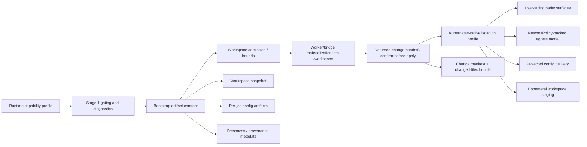

# feat: Mature Kubernetes runtime in staged phases

## Overview

This plan turns the new Kubernetes path into a staged product capability instead
of an all-or-nothing parity claim. The implementation is organized around four
explicit maturity targets:

1. Kubernetes can run workers safely and truthfully as a limited runtime
2. Kubernetes can run common project-backed tasks using orchestrator-delivered
   content instead of host mounts
3. Kubernetes can return project changes explicitly, apply them only after
   confirmation, and reject oversized workspaces before they become a hidden
   reliability problem
4. Kubernetes feels close to Docker for normal work by combining Kubernetes-
   native delivery and isolation controls with clearer user-facing capability
   surfaces

The design intentionally favors Kubernetes-native outcomes over Docker mimicry.
That means the plan centers on capability contracts, bootstrap artifact
delivery, explicit result handoff, and staged UX guarantees rather than trying
to recreate bind-mount and host-proxy behavior inside pods.

## Problem Frame

IronClaw already has a pod-based Kubernetes backend, runtime selection during
setup, doctor checks, capability staging, bootstrap artifact delivery, and
basic workload lifecycle support. At the same time, the current implementation
still has three visible gaps: returned file changes do not flow back to the
host project, uploaded workspaces have no default size/churn boundary, and
allowlist-constrained networking still falls back to Docker semantics for the
common one-shot path. This leaves the product in an awkward middle state: the
runtime exists, but the user promise would still be overstated if Kubernetes
were described as a normal development backend. (See origin:
`docs/brainstorms/2026-04-14-kubernetes-runtime-maturity-requirements.md`)

The work therefore has three equally important goals:
- make the current Kubernetes capability honest and coherent
- create a technical path from today's limited runtime to a Kubernetes-native
  experience that is close to Docker for everyday use without copying Docker's
  implementation model
- separate already-landed foundations from the still-missing write-back,
  admission-control, and near-Docker networking work so review and execution do
  not keep conflating them

## Requirements Trace

- R1-R4. Introduce a staged capability model with additive progression,
  truthful messaging, and explicit unsupported-case handling
- R5-R8. Lock in Stage 1 as a worker-runtime contract, not full sandbox parity
- R9-R13. Add orchestrator-delivered project/bootstrap content so Stage 2 can
  support common project-backed tasks without host mounts, with explicit change
  return and bounded workspace admission
- R14-R17. Define a Stage 3 path that combines Kubernetes-native isolation and
  user-facing parity for normal work
- R18-R20. Keep docs, feature tracking, diagnostics, and rollout gates aligned
  with the actual maturity level

## Scope Boundaries

- This plan does not require Kubernetes to emulate Docker internals
- This plan does not make shared storage the primary Stage 2 solution
- This plan does not treat `hostPath` or host bind mounts as a required
  Kubernetes mechanism
- This plan does not promise every Docker edge case before Stage 3
- This plan does not redesign the Docker path except where shared capability
  modeling makes both backends clearer

## Context & Research

### Relevant Code and Patterns

- `src/sandbox/runtime.rs` already owns runtime selection, the
  `ContainerRuntime` abstraction, and common runtime metadata flow
- `src/sandbox/kubernetes.rs` already covers pod creation, wait, exec, log
  collection, and managed workload discovery
- `src/sandbox/manager.rs` is the central one-shot sandbox coordinator and
  already fails closed when a runtime cannot satisfy sandbox requirements
- `src/orchestrator/job_manager.rs` is the write path for persistent sandbox
  jobs and now owns the Stage 2 capability branching between host mounts,
  orchestrator bootstrap delivery, and projected runtime config delivery
- `src/orchestrator/bootstrap_artifacts.rs` now packages workspace snapshots
  for Stage 2, but it still tars the full tree in memory with no admission
  limits or generated-directory exclusions
- `src/orchestrator/api.rs` and `src/worker/api.rs` already provide an
  authenticated control-plane pattern for job metadata and credentials
  delivery, making them the natural place to add reverse result-handoff
  uploads and apply/review status surfaces
- `src/worker/container.rs`, `src/worker/claude_bridge.rs`, and
  `src/worker/acp_bridge.rs` already perform startup-time bootstrap work before
  entering the main agent loop or launching bridge processes, but none of them
  currently publish returned workspace changes back to the orchestrator
- `src/sandbox/manager.rs` already uploads read-only one-shot workspaces to
  Kubernetes and explicitly fails closed for workspace-write commands when
  write-back is unavailable, which makes it the correct caller-level seam for
  the eventual one-shot write-back contract
- `src/setup/wizard.rs`, `src/setup/README.md`, and `src/cli/doctor.rs` already
  surface runtime selection and health status, making them the right user-facing
  integration points for stage messaging and prerequisite reporting

### Institutional Learnings

- The 2026-04-10 onboarding work established runtime selection and namespace
  persistence as a first-class backend choice rather than an env-only escape
  hatch (see origin:
  `docs/brainstorms/2026-04-10-kubernetes-onboarding-requirements.md`)
- The 2026-04-11 label-validation fix reinforced that Kubernetes needs its own
  first-class runtime contract, including metadata rules and tests through the
  real caller path, not Docker-shaped assumptions (see origin:
  `docs/brainstorms/2026-04-11-k8s-pod-label-validation-requirements.md`)
- Existing tests in `src/sandbox/manager.rs` and `src/orchestrator/job_manager.rs`
  already use fail-closed recording runtimes, which is the right pattern for
  capability-gated behavior in this roadmap

### External References

- Kubernetes NetworkPolicy concepts:
  [kubernetes.io/docs/concepts/services-networking/network-policies/](https://kubernetes.io/docs/concepts/services-networking/network-policies/)
- Kubernetes ephemeral volumes:
  [kubernetes.io/docs/concepts/storage/ephemeral-volumes/](https://kubernetes.io/docs/concepts/storage/ephemeral-volumes/)
- Kubernetes projected volumes:
  [kubernetes.io/docs/concepts/storage/projected-volumes/](https://kubernetes.io/docs/concepts/storage/projected-volumes/)
- Kubernetes init containers:
  [kubernetes.io/docs/concepts/workloads/pods/init-containers/](https://kubernetes.io/docs/concepts/workloads/pods/init-containers/)

Notes carried into the plan from those references:
- `NetworkPolicy` only helps when the cluster's network plugin actually
  enforces it, so Stage 3 cannot be inferred from a bare config flag alone.
- The official `NetworkPolicy` model is selector/IP based rather than hostname
  based; from that, we infer that near-Docker domain allowlists require an
  extra translation or egress-mediation layer on top of basic policy objects.
- Ephemeral volumes and init containers are good fits for workspace staging
  because they follow Pod startup/lifetime and can prepare shared data before
  the main worker process starts.
- Projected volumes remain the cleanest fit for non-workspace runtime config
  because they combine config-like inputs into a single mount point.

## Key Technical Decisions

- **Introduce a stage-aware runtime capability profile**: Replace today's
  scattered backend booleans and implicit doc caveats with one canonical
  capability model that can be surfaced in runtime checks, job gating, doctor
  output, and docs. This lets the product describe Kubernetes precisely at each
  maturity stage instead of speaking in broad parity claims.

- **Make orchestrator-delivered bootstrap artifacts the Stage 2 foundation**:
  Stage 2 should not depend on local host mounts or shared storage as the
  default path. The orchestrator already owns authenticated per-job metadata and
  credentials, so extending that model to workspace snapshots and auxiliary job
  files is the most repo-consistent way to unlock project-backed work.

- **Start Stage 2 with bounded snapshot semantics, not live sync semantics**:
  The initial common-task envelope should cover reading files, editing files,
  and running bounded project-local commands against a materialized snapshot. It
  should explicitly exclude watch mode, long-lived background daemons,
  host-coupled paths, and large high-churn repositories until a stronger
  freshness contract exists.

- **Use an explicit result-handoff contract for all Stage 2 writes**: Stage 2
  should return changes as a reviewable handoff, not as silent background sync.
  The first contract should be a hybrid of structured change metadata plus a
  changed-files bundle, so the host can show what came back, validate it
  against the original snapshot, and apply it only after confirmation.

- **Share one change-return primitive between jobs and one-shot sandbox
  commands**: Persistent jobs and one-shot sandbox writes should not invent
  different write-back stories. The orchestrator-owned result-handoff contract
  should become the single write-return primitive, even if the UX surfaces differ.

- **Reject oversized workspaces before packaging, with an explicit project
  override**: Stage 2 should not archive first and discover failure later.
  Preflight scanning must decide whether a workspace is in-bounds, and any
  exception path must be project-scoped and reviewable rather than an env var
  or per-run bypass.

- **Keep workspace materialization in the worker/bridge bootstrap path first**:
  The worker and bridge runtimes already perform startup bootstrapping. Using
  that seam for initial workspace materialization keeps auth on the existing
  per-job token path and avoids introducing a second executor just to populate
  `/workspace`. Kubernetes-native init containers remain a valid Stage 3
  optimization once the artifact contract is stable.

- **Treat Stage 3 as user-experience parity, not implementation parity**:
  The finish line is that users can choose Kubernetes for normal work without
  learning a separate mental model. Kubernetes-native controls such as
  NetworkPolicy-backed egress control, projected volumes for config delivery,
  and ephemeral workspace staging are good enough if they produce a comparable
  security and task-success outcome.

- **Treat basic NetworkPolicy readiness as necessary but not sufficient for
  Stage 3**: Because current allowlists are domain-based, Stage 3 cannot rely
  on a boolean "native network controls enabled" check alone. The product needs
  a Kubernetes-side egress story that makes domain-bounded tasks feel close to
  the existing Docker allowlist experience before the Stage 3 claim is honest.

- **Resolve current planning questions now rather than carrying them forward**:
  This plan resolves the main deferred questions from the origin document:
  Stage 2's initial common-task envelope, the user-facing freshness contract,
  the change-return shape, the large-repo admission model, the Stage 3 control
  family, and stage exit criteria. Keeping those decisions inside the plan
  avoids forcing execution to invent the roadmap.

## Open Questions

### Resolved During Planning

- **What is the Stage 2 common-task envelope?** Text and code workflows against
  a materialized repository snapshot: read/edit files, generate files, run
  bounded repo-local commands, and return produced artifacts. Excludes watch
  mode, host-device access, live git synchronization, and large/high-churn
  workspace expectations.

- **How should freshness be communicated in Stage 2?** Treat each Kubernetes
  job as operating on a named bootstrap snapshot with explicit provenance in
  job detail and worker status surfaces, rather than implying live coupling to a
  host directory.

- **What exact change-return format should Stage 2 use first?** Use a hybrid
  handoff: a small JSON manifest describing snapshot provenance and changed
  paths, plus a tarball containing changed/new files and optional produced
  artifacts. This keeps transport simple, avoids patch-only edge cases for
  binary output, and still gives the host enough structure to validate and
  review before apply.

- **What are the host-side safety checks for confirm-before-apply?** Every
  returned change set must be tied to a recorded snapshot identity and per-file
  digest list. Host apply must reject path traversal, out-of-workspace writes,
  delete-vs-modify ambiguity, and any file whose current host digest no longer
  matches the recorded snapshot. No silent merge; conflicts stay pending for
  explicit user resolution.

- **How should large-workspace admission be enforced?** Add a preflight scan
  that runs before any tarball is built, excludes obvious generated/cache
  directories, and checks bounded metrics such as included file count, included
  bytes, and oversized single files. The exact constant values can be tuned
  during implementation, but the admission dimensions and fail-closed behavior
  are fixed by this plan.

- **Where should the project-scoped override live?** Use an explicit
  project-local policy file under the project root, not an instance-wide env var
  and not a per-run request flag. The working path in this plan is
  `.ironclaw/kubernetes-bootstrap.json`, owned by the project and visible in
  code review when the project is under version control.

- **Which Kubernetes-native control family should anchor Stage 3?**
  NetworkPolicy-backed egress isolation where the cluster can enforce it,
  projected volumes for non-workspace config, existing pod security context and
  service-account lockdown, and ephemeral workspace staging populated from
  orchestrator-delivered artifacts. Because Docker today reasons in domain
  allowlists, Stage 3 also needs an allowlist translation or egress mediation
  layer; plain policy readiness alone is not enough.

- **What are the stage exit criteria?**
  Stage 1 completes when all unsupported flows fail clearly and all docs/status
  surfaces describe Kubernetes as a limited runtime. Stage 2 completes when the
  agreed common-task envelope runs without host mounts, returned changes are
  reviewable and confirm-before-apply, and oversized workspaces fail fast.
  Stage 3 completes when diagnostics, gating, and normal task UX make
  Kubernetes feel like a first-class option with only a small documented
  exception set, including common allowlist-constrained tasks.

### Deferred to Implementation

- Exact field names and storage layout for the returned-change manifest and
  whether large result bundles should share code with bootstrap artifact serving
- The concrete default numeric limits for included bytes, file count, and
  oversized single files, after measuring typical project sizes in the repo's
  supported workflows
- Whether the Stage 2 bootstrap path should remain worker-side permanently or
  graduate to init-container-based materialization once the contract stabilizes
- The exact cluster-prerequisite detector for Stage 3, including how doctor
  proves both policy enforcement support and the chosen allowlist mediation path

## High-Level Technical Design

> *This illustrates the intended approach and is directional guidance for
> review, not implementation specification. The implementing agent should treat
> it as context, not code to reproduce.*



## Phased Delivery

### Phase 1
- Establish the capability/stage model and make Stage 1 behavior explicit

### Phase 2
- Add orchestrator-delivered bootstrap artifacts and worker-side workspace
  materialization for common project-backed tasks

### Phase 3
- Add explicit returned-change handoff plus confirm-before-apply, then enforce
  bounded workspace admission so Stage 2 is usable without becoming misleading

### Phase 4
- Layer Kubernetes-native isolation controls and user-facing parity surfaces on
  top of the stable Stage 2 content-delivery and write-return contract

## Implementation Units

- [x] **Unit 1: Introduce a stage-aware runtime capability model**

**Goal:** Create one canonical source of truth for what each runtime can do,
which stage it represents, and how that should be surfaced to the rest of the
product.

**Requirements:** R1, R2, R4, R18, R19, R20

**Dependencies:** None

**Files:**
- Create: `src/sandbox/capabilities.rs`
- Modify: `src/sandbox/mod.rs`
- Modify: `src/sandbox/runtime.rs`
- Modify: `src/sandbox/docker.rs`
- Modify: `src/sandbox/kubernetes.rs`
- Modify: `src/cli/doctor.rs`
- Modify: `FEATURE_PARITY.md`
- Test: `src/sandbox/runtime.rs`
- Test: `src/cli/doctor.rs`

**Approach:**
- Introduce a shared capability profile that captures stage label, workspace
  delivery mode, networking/isolation mode, config-delivery mode, and any
  user-visible limitations
- Make Docker and Kubernetes each publish this profile through the runtime
  abstraction
- Keep runtime detection and doctor output grounded in that shared profile so
  the rest of the system stops inferring capability from isolated booleans
- Update feature tracking to use stage-accurate wording rather than a broad
  parity statement

**Patterns to follow:**
- `src/sandbox/runtime.rs` runtime selection and shared types
- `src/cli/doctor.rs` existing runtime-aware diagnostics structure
- `FEATURE_PARITY.md` existing capability matrix format

**Test scenarios:**
- Happy path: Docker reports a fully capable sandbox profile with the expected
  stage label and capability flags
- Happy path: Kubernetes reports a Stage 1 profile that explicitly disables
  project-backed delivery and host-proxy-dependent enforcement
- Edge case: runtime resolution still honors `CONTAINER_RUNTIME` and compiled
  feature availability exactly as before
- Integration: doctor output for a selected Kubernetes runtime includes the
  stage/capability summary instead of a generic reachable/unreachable message

**Verification:**
- There is one reusable capability object that both runtime gating and user-
  facing diagnostics can consume
- Feature tracking and diagnostics describe Kubernetes in the same terms

- [x] **Unit 2: Apply the Stage 1 fail-closed contract across sandbox and job entry points**

**Goal:** Make today's Kubernetes behavior coherent and user-facing by turning
  implicit caveats into explicit, actionable contract enforcement.

**Requirements:** R3, R5, R6, R7, R8, R18

**Dependencies:** Unit 1

**Files:**
- Modify: `src/sandbox/manager.rs`
- Modify: `src/orchestrator/job_manager.rs`
- Modify: `src/tools/builtin/job.rs`
- Modify: `src/channels/web/handlers/jobs.rs`
- Modify: `src/setup/README.md`
- Test: `src/sandbox/manager.rs`
- Test: `src/orchestrator/job_manager.rs`
- Test: `tests/gateway_workflow_integration.rs`

**Approach:**
- Replace backend-specific caveat text with capability-profile-driven failure
  mapping so unsupported flows fail consistently before workload creation
- Ensure shell sandbox entry points, persistent sandbox jobs, and web restart/
  creation flows all surface the same Stage 1 contract
- Keep the worker lifecycle that already functions on Kubernetes available, but
  prevent any surface from implying project-backed sandbox support

**Patterns to follow:**
- Fail-closed tests in `src/sandbox/manager.rs`
- Project-dir and MCP config gating in `src/orchestrator/job_manager.rs`
- Existing web handler conflict/error response style in
  `src/channels/web/handlers/jobs.rs`

**Test scenarios:**
- Happy path: Kubernetes jobs without project-backed content still create and
  expose normal lifecycle behavior
- Error path: a sandboxed shell request requiring host-proxy enforcement is
  rejected before workload creation with Stage 1 guidance
- Error path: a project-backed job is rejected before pod creation with a clear
  explanation that Kubernetes runtime support does not yet include project
  content
- Error path: a restart or API-triggered job creation through the web gateway
  returns the same contract-level guidance as the direct job path
- Integration: docs-facing setup text and runtime wording no longer describe
  Kubernetes as a complete Docker-equivalent sandbox

**Verification:**
- Unsupported Stage 1 flows fail before pod creation and the guidance is
  consistent across CLI, tool, and web entry points

- [x] **Unit 3: Add a bootstrap artifact contract for Stage 2 content delivery**

**Goal:** Define how the orchestrator serves project content and auxiliary
  per-job files to Kubernetes workloads without relying on local mounts.

**Requirements:** R9, R10, R12, R13, R19

**Dependencies:** Unit 1

**Files:**
- Create: `src/orchestrator/bootstrap_artifacts.rs`
- Modify: `src/orchestrator/api.rs`
- Modify: `src/orchestrator/job_manager.rs`
- Modify: `src/worker/api.rs`
- Test: `src/orchestrator/api.rs`
- Test: `src/orchestrator/job_manager.rs`
- Test: `src/worker/api.rs`
- Test: `tests/bootstrap_artifact_integration.rs`

**Approach:**
- Introduce a per-job bootstrap artifact manifest owned by the orchestrator
  rather than by the runtime backend
- Include at least three artifact classes in the contract:
  workspace snapshot, auxiliary job config files, and provenance/freshness
  metadata
- Reuse the existing authenticated worker API pattern so bootstrap artifacts are
  fetched over the same per-job trust boundary as credentials and job metadata
- Extend current per-job MCP config generation into the new artifact model so
  Stage 2 removes more than one mount-dependent blocker

**Technical design:** *(directional guidance, not implementation specification)*

```text
Job creation
  -> compute bootstrap artifact manifest
  -> register artifact sources against job_id
Worker/bridge startup
  -> GET bootstrap manifest
  -> fetch required artifacts
  -> materialize into ephemeral workspace/config paths
  -> enter normal execution flow
```

**Patterns to follow:**
- Credential-serving pattern in `src/orchestrator/api.rs` and `src/worker/api.rs`
- Existing per-job MCP config generation in `src/orchestrator/job_manager.rs`
- Existing job metadata path in `GET /worker/{job_id}/job`

**Test scenarios:**
- Happy path: a job without project content returns an empty or metadata-only
  bootstrap manifest without error
- Happy path: a project-backed job returns a workspace artifact descriptor plus
  provenance metadata
- Happy path: a job with generated MCP config exposes that config as a bootstrap
  artifact instead of requiring a local mount
- Error path: an unauthenticated or cross-job artifact request is rejected
- Integration: creating a project-backed job and fetching its bootstrap
  manifest/artifacts uses only the per-job control-plane contract, not local
  path sharing

**Verification:**
- A Kubernetes job can be fully described by orchestrator-served bootstrap
  artifacts and existing worker metadata

- [x] **Unit 4: Materialize Stage 2 workspaces in worker and bridge runtimes**

**Goal:** Turn the Stage 2 artifact contract into a usable `/workspace`
  experience for the bounded common-task envelope.

**Requirements:** R10, R11, R12, R13, R15, R17

**Dependencies:** Unit 3

**Files:**
- Create: `src/worker/workspace_materializer.rs`
- Modify: `src/worker/container.rs`
- Modify: `src/worker/claude_bridge.rs`
- Modify: `src/worker/acp_bridge.rs`
- Modify: `src/worker/api.rs`
- Modify: `src/channels/web/handlers/jobs.rs`
- Modify: `src/tools/builtin/job.rs`
- Test: `src/worker/container.rs`
- Test: `src/worker/claude_bridge.rs`
- Test: `src/worker/acp_bridge.rs`
- Test: `tests/worker_workspace_bootstrap.rs`
- Test: `tests/e2e_workspace_coverage.rs`

**Approach:**
- Add a shared worker-side materializer that reconstructs `/workspace` and
  related per-job files from bootstrap artifacts before the agent loop or bridge
  subprocess starts
- Use the same materializer across normal worker, Claude bridge, and ACP bridge
  so Stage 2 support does not diverge by mode
- Surface snapshot provenance in job detail and status updates so users see that
  Kubernetes work is operating on delivered content, not a live host mount
- Explicitly encode the Stage 2 common-task envelope in job/tool surfaces so
  unsupported categories remain clearly rejected instead of failing deep inside
  execution

**Execution note:** Start with cross-layer characterization tests for the
bootstrap-to-worker path before broadening supported project-backed jobs.

**Patterns to follow:**
- Worker bootstrap flow in `src/worker/container.rs`
- Bridge startup preparation in `src/worker/claude_bridge.rs` and
  `src/worker/acp_bridge.rs`
- Existing workspace-facing metadata surfaced through job detail handlers

**Test scenarios:**
- Happy path: worker runtime materializes a delivered workspace before the first
  tool-capable iteration begins
- Happy path: Claude bridge and ACP bridge use the same materialization flow and
  run from the reconstructed `/workspace`
- Edge case: a metadata-only bootstrap payload still allows non-project-backed
  work to start cleanly
- Error path: artifact download or materialization failure aborts startup with
  actionable Stage 2 guidance
- Integration: a project-backed job can read files, write files, and run a
  bounded repo-local command against the materialized snapshot without any bind
  mount

**Verification:**
- The agreed Stage 2 common-task envelope works on Kubernetes without host
  mounts, and job surfaces make snapshot provenance visible

- [ ] **Unit 5: Add explicit change return and confirm-before-apply for Stage 2**

**Goal:** Turn Kubernetes Stage 2 from "can edit inside the pod" into "can
  return edits safely to the host project" without implying live synchronization.

**Requirements:** R10, R11, R12, R15, R17, R19

**Dependencies:** Units 3-4

**Current status:**
- Done: project-backed jobs can receive a bootstrap snapshot and run against
  `/workspace`
- Missing: there is no reverse path for changed files or produced artifacts to
  come back through the orchestrator
- Missing: workspace-write one-shot sandbox commands still fail closed because
  the runtime cannot return edits to the host

**Files:**
- Create: `src/worker/workspace_changes.rs`
- Modify: `src/worker/api.rs`
- Modify: `src/worker/container.rs`
- Modify: `src/worker/claude_bridge.rs`
- Modify: `src/worker/acp_bridge.rs`
- Modify: `src/orchestrator/api.rs`
- Modify: `src/orchestrator/job_manager.rs`
- Modify: `src/sandbox/manager.rs`
- Modify: `src/channels/web/handlers/jobs.rs`
- Modify: `src/tools/builtin/job.rs`
- Test: `src/worker/api.rs`
- Test: `src/orchestrator/api.rs`
- Test: `src/orchestrator/job_manager.rs`
- Test: `src/sandbox/manager.rs`
- Test: `tests/workspace_result_handoff_integration.rs`
- Test: `tests/gateway_workflow_integration.rs`

**Approach:**
- Introduce a per-job returned-change handoff owned by the orchestrator, using
  the same job-scoped token model as bootstrap artifact delivery
- Have workers and bridges publish a structured change manifest plus a changed-
  files bundle when they complete project-backed work that modified
  `/workspace`
- Keep returned changes pending on the host side until an explicit apply step
  validates provenance, current host file digests, and path safety
- Reuse this same handoff primitive for workspace-write one-shot sandbox
  commands so Kubernetes stops needing a separate "edits disappear" story for
  jobs versus one-shot work
- Surface pending returned changes in job detail and tool output so the user
  can review what came back before anything touches the host project

**Technical design:** *(directional guidance, not implementation specification)*

```text
Worker or bridge finishes
  -> compute returned-change manifest from /workspace
  -> POST manifest + changed-files bundle to orchestrator
Orchestrator stores pending result
  -> expose summary in job detail / tool result
User confirms apply
  -> validate snapshot provenance + current host digests
  -> write safe paths into host project
  -> mark result applied or conflicted
```

**Patterns to follow:**
- Existing authenticated worker API shape in `src/worker/api.rs` and
  `src/orchestrator/api.rs`
- Existing bootstrap provenance model in `src/orchestrator/bootstrap_artifacts.rs`
- Caller-level sandbox contract enforcement in `src/sandbox/manager.rs`

**Test scenarios:**
- Happy path: a project-backed Kubernetes job returns a modified source file and
  a generated artifact, both visible as pending returned output
- Happy path: a workspace-write one-shot sandbox command on Kubernetes returns a
  reviewable change set instead of failing solely because bind mounts are absent
- Error path: returned paths that escape the workspace root are rejected before
  storage or apply
- Error path: host files that changed after the snapshot cause apply to stop
  with conflict guidance rather than clobbering local edits
- Integration: a user can review and explicitly apply returned changes without
  any silent background write-back

**Verification:**
- Kubernetes Stage 2 can safely return edits and artifacts to the host project
  through an explicit confirm-before-apply flow

- [ ] **Unit 6: Enforce bounded workspace admission and project-scoped overrides**

**Goal:** Fail fast on oversized or high-churn workspaces before packaging, and
  make any exception path explicit and project-scoped.

**Requirements:** R12, R13, R18, R19

**Dependencies:** Units 3-4

**Current status:**
- Done: Stage 2 bootstrap can package a project directory for Kubernetes
- Missing: snapshot building still archives the entire tree in memory with no
  exclusion rules or admission limits
- Missing: one-shot uploaded workspaces and job-backed snapshots do not share a
  common bounds check

**Files:**
- Create: `src/orchestrator/workspace_admission.rs`
- Modify: `src/orchestrator/bootstrap_artifacts.rs`
- Modify: `src/orchestrator/job_manager.rs`
- Modify: `src/sandbox/manager.rs`
- Modify: `src/cli/doctor.rs`
- Modify: `src/setup/README.md`
- Modify: `docs/capabilities/sandboxed-tools.mdx`
- Modify: `docs/zh/capabilities/sandboxed-tools.mdx`
- Modify: `FEATURE_PARITY.md`
- Test: `src/orchestrator/bootstrap_artifacts.rs`
- Test: `src/orchestrator/job_manager.rs`
- Test: `src/sandbox/manager.rs`
- Test: `src/cli/doctor.rs`
- Test: `tests/bootstrap_admission_integration.rs`

**Approach:**
- Add a shared preflight scanner that walks candidate workspace content before
  any tarball is built and records bounded metrics such as included file count,
  included bytes, and oversized single files
- Exclude obvious generated or cache-heavy directories from the default Stage 2
  envelope so admission evaluates likely source content instead of tool output
- Make both project-backed job snapshots and uploaded one-shot workspaces use
  the same admission logic so the product has one Stage 2 size boundary
- Keep the default contract conservative and fail closed with actionable
  guidance that explains why Kubernetes refused the workspace
- Allow explicit opt-in exceptions only through a project-local
  `.ironclaw/kubernetes-bootstrap.json` policy file, not an env var and not a
  per-run request flag

**Patterns to follow:**
- Existing snapshot-packaging seam in `src/orchestrator/bootstrap_artifacts.rs`
- Existing uploaded-workspace seam in `src/sandbox/manager.rs`
- Existing runtime diagnostics style in `src/cli/doctor.rs`

**Test scenarios:**
- Happy path: a normal-sized source tree passes admission and builds a
  bootstrap/upload artifact exactly once
- Happy path: a project with an explicit override file can exceed the default
  limits without enabling a global bypass
- Error path: a workspace containing excluded cache/build directories is judged
  by the included content, not by the raw full tree
- Error path: a workspace exceeding the default bounds is rejected before any
  tarball bytes are allocated in memory
- Integration: doctor and docs surface the active Stage 2 boundary and explain
  how project-scoped exceptions work

**Verification:**
- Stage 2 rejects unsupported large or high-churn workspaces early and
  consistently, while still allowing intentional project-level opt-in

- [ ] **Unit 7: Complete the Kubernetes-native isolation profile and Stage 3 parity surfaces**

**Goal:** Finish the remaining gap between the now-bounded Stage 2 contract and
  a truthful Stage 3 profile for normal work.

**Requirements:** R14, R15, R16, R17, R18, R19, R20

**Dependencies:** Units 1-6

**Current status:**
- Done: stage-aware capability modeling, project bootstrap delivery, and
  projected runtime config support are already in place
- Done: read-only one-shot sandbox commands can use uploaded workspaces when
  bind mounts are unavailable
- Remaining: Stage 3 still cannot be advertised by default until allowlist-
  constrained tasks behave close to Docker and the final exception set is small

**Files:**
- Modify: `src/sandbox/capabilities.rs`
- Modify: `src/sandbox/kubernetes_policy.rs`
- Modify: `src/sandbox/kubernetes.rs`
- Modify: `src/sandbox/manager.rs`
- Modify: `src/cli/doctor.rs`
- Modify: `src/setup/README.md`
- Modify: `src/setup/wizard.rs`
- Modify: `docs/capabilities/sandboxed-tools.mdx`
- Modify: `docs/zh/capabilities/sandboxed-tools.mdx`
- Modify: `FEATURE_PARITY.md`
- Modify: `CHANGELOG.md`
- Test: `src/sandbox/capabilities.rs`
- Test: `src/sandbox/kubernetes.rs`
- Test: `src/sandbox/manager.rs`
- Test: `src/cli/doctor.rs`
- Test: `tests/kubernetes_capability_profile.rs`

**Approach:**
- Keep Stage 2 as the default contract until Kubernetes-native network
  controls are both detectable and actually honored by the sandbox/task paths
  that currently require allowlist-only networking
- Treat returned-change handoff, bounded workspace admission, uploaded
  workspaces, and projected runtime config as prerequisites already handled by
  earlier units; Stage 3 should not reopen those decisions
- Make the capability profile the single source of truth for when Kubernetes
  may claim Stage 3 near-Docker behavior, and reuse that truth in manager
  gating, doctor/setup messaging, and feature-tracking text
- Do not treat a bare "native network controls enabled" flag as sufficient:
  the Stage 3 gate must also cover how domain-based allowlists are enforced or
  mediated in-cluster so common domain-bounded tasks feel close to the current
  Docker path
- Shrink the remaining Kubernetes-vs-Docker difference to an explicit
  documented exception set; if a flow still depends on host-proxy semantics or
  unsupported network mediation, fail closed and explain why

**Technical design:** *(directional guidance, not implementation specification)*

```text
Capability profile says Stage 3 only when:
  - bootstrap delivery is available
  - returned-change handoff is available
  - projected runtime config delivery is available
  - bounded workspace admission is active
  - cluster-side network enforcement is verifiably supported
  - allowlist-constrained tasks use a Kubernetes-side translation or egress
    mediation path that feels close to Docker for normal work
  - doctor/setup can describe any remaining explicit exceptions

Otherwise:
  remain in Stage 2
  keep allowlist-only flows failed closed
  keep messaging aligned with actual runtime behavior
```

**Patterns to follow:**
- Existing readiness gating and notes in `src/sandbox/kubernetes_policy.rs`
- Stage-aware capability model from Unit 1
- Domain-based allowlist semantics already encoded by the host proxy policy in
  `src/sandbox/proxy/policy.rs`; Stage 3 must preserve comparable user-facing
  behavior rather than quietly downgrading it to coarse pod egress rules

**Test scenarios:**
- Happy path: Stage 3 is reported only when projected config delivery, returned
  change handoff, bounded workspace admission, and the chosen network mediation
  path are all available to the runtime that executes sandboxed work
- Happy path: allowlist-constrained sandbox requests use the Kubernetes-native
  path without inheriting Docker-specific host-proxy env assumptions
- Error path: missing cluster-side enforcement or missing allowlist mediation
  keeps Kubernetes in Stage 2 even when workspace/config delivery is otherwise
  ready
- Error path: Stage 3-capable clusters still fail closed for any remaining
  documented exception path rather than silently degrading behavior
- Integration: doctor and setup report the exact missing prerequisite set and
  keep feature-parity text consistent with the active stage
- Integration: user-facing guidance for supported Stage 3 Kubernetes work stays
  close to Docker, with any remaining backend-specific exceptions explicitly
  listed

**Verification:**
- Kubernetes can truthfully graduate to Stage 3 only when common allowlist-
  constrained work feels close to Docker and the remaining exception set is
  small and explicit

## System-Wide Impact

- **Interaction graph:** Runtime capability modeling affects `SandboxManager`,
  `ContainerJobManager`, job creation/restart web handlers, setup, doctor, and
  user-visible docs. Stage 2 artifact delivery crosses orchestrator API, worker
  API, worker startup, bridge startup, and project-backed job metadata surfaces.
  Returned-change handoff adds a reverse worker-to-orchestrator flow plus an
  explicit host apply step.
- **Error propagation:** Unsupported-scenario errors should remain preflight
  failures. Artifact bootstrap failures should abort before entering the main
  agent loop. Returned-change conflicts should remain pending rather than
  clobbering host files. Stage 3 prerequisite failures should downgrade or
  block clearly at setup/doctor/job-creation time rather than surfacing as
  opaque runtime failures.
- **State lifecycle risks:** Stage 2 introduces snapshot provenance and
  materialized workspaces, which creates risks around stale content, partial
  bootstrap writes, pending returned changes, and cleanup of delivered or
  returned artifacts. Those must be treated as explicit job lifecycle concerns,
  not incidental temp-file behavior.
- **API surface parity:** New bootstrap-artifact endpoints, returned-change
  upload/apply endpoints, and job-detail/status fields affect worker/
  orchestrator contracts and any UI or API consumer that describes sandbox job
  capabilities.
- **Integration coverage:** Cross-layer tests must prove
  create_job -> bootstrap manifest/artifact delivery -> worker materialization
  -> returned-change handoff -> explicit apply flow. Unit tests alone will not
  cover the main Stage 2 contract.
- **Unchanged invariants:** Docker remains the reference implementation for
  full sandbox support until Kubernetes reaches the later stages. Existing auth
  and per-job token boundaries stay intact.

## Risks & Dependencies

| Risk | Mitigation |
|------|------------|
| Capability messaging drifts away from real runtime behavior | Make the capability profile the single source of truth and reuse it in gating, diagnostics, and docs |
| Stage 2 bootstrap artifacts become an implicit live-sync promise | Treat Stage 2 explicitly as snapshot/provenance-based and reject unsupported live-coupling workflows |
| Artifact delivery broadens data exposure or cross-job leakage risk | Reuse per-job token auth, keep artifact registration job-scoped, and add cross-job access tests |
| Returned changes overwrite newer host edits | Require snapshot provenance and per-file digest validation before apply; keep conflicts pending for explicit resolution |
| Default workspace bounds are either too strict or too loose | Centralize admission logic, surface the active boundary in diagnostics, and allow explicit project-scoped overrides only |
| Stage 3 claims near-Docker parity even though domain allowlists are not natively represented in NetworkPolicy | Treat network-plugin readiness as necessary but not sufficient, and gate Stage 3 on the chosen allowlist mediation path as well |
| Kubernetes Stage 3 depends on cluster features not universally present | Gate Stage 3 behind explicit prerequisites and preserve Stage 1/2 behavior when those prerequisites are missing |
| Docs and feature tracking overstate parity too early | Land docs, `FEATURE_PARITY.md`, and doctor/setup language as part of each stage rather than as a final polish step |

## Documentation / Operational Notes

- Update stage wording in `FEATURE_PARITY.md` as each maturity threshold lands
- Keep `docs/capabilities/sandboxed-tools.mdx` and its Chinese counterpart
  aligned with the current stage contract
- Extend doctor/setup output so operators can tell whether they are running a
  Stage 1, Stage 2, or Stage 3 Kubernetes configuration and what is missing for
  the next stage
- Document the returned-change review/apply flow and the Stage 2 workspace
  boundary in user-facing capability docs at the same time the code ships
- Add a changelog note when Stage 2 materially changes what Kubernetes users can
  do, and another when Stage 3 changes the public product claim

## Sources & References

- **Origin document:** [docs/brainstorms/2026-04-14-kubernetes-runtime-maturity-requirements.md](/Users/derek/Workspaces/ironclaw/docs/brainstorms/2026-04-14-kubernetes-runtime-maturity-requirements.md)
- Related code: `src/sandbox/runtime.rs`, `src/sandbox/kubernetes.rs`,
  `src/sandbox/manager.rs`, `src/orchestrator/job_manager.rs`,
  `src/orchestrator/api.rs`, `src/orchestrator/bootstrap_artifacts.rs`,
  `src/worker/container.rs`, `src/worker/api.rs`
- Related plans:
  [docs/plans/2026-04-10-001-feat-kubernetes-onboarding-wizard-plan.md](/Users/derek/Workspaces/ironclaw/docs/plans/2026-04-10-001-feat-kubernetes-onboarding-wizard-plan.md)
  and
  [docs/plans/2026-04-11-001-fix-k8s-pod-label-validation-plan.md](/Users/derek/Workspaces/ironclaw/docs/plans/2026-04-11-001-fix-k8s-pod-label-validation-plan.md)
- Related issue: [#2023](https://github.com/nearai/ironclaw/issues/2023)
- External docs:
  [NetworkPolicy](https://kubernetes.io/docs/concepts/services-networking/network-policies/),
  [Ephemeral Volumes](https://kubernetes.io/docs/concepts/storage/ephemeral-volumes/),
  [Projected Volumes](https://kubernetes.io/docs/concepts/storage/projected-volumes/),
  [Init Containers](https://kubernetes.io/docs/concepts/workloads/pods/init-containers/)
