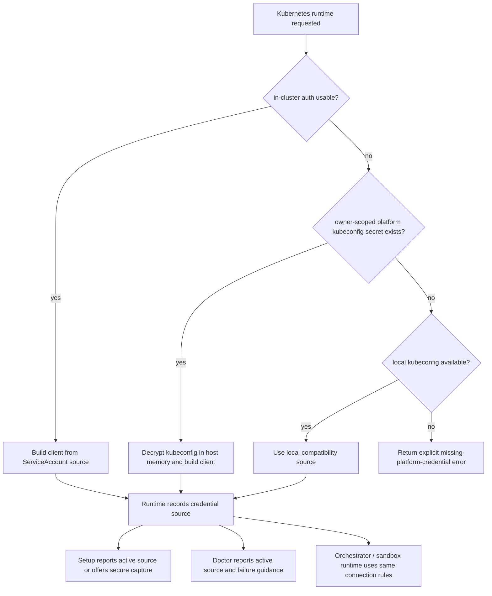

# feat: Add platform-managed Kubernetes kubeconfig resolution

## Overview

This plan adds an explicit Kubernetes credential-resolution path for IronClaw:
prefer in-cluster identity, fall back to an owner-scoped encrypted kubeconfig,
and only then use local developer kubeconfig compatibility paths. The change is
about making the platform boundary truthful and enforceable, not about changing
job bootstrap or worker credential delivery.

## Problem Frame

IronClaw already has a working Kubernetes runtime, but the credential path for
reaching the Kubernetes API is still implicit. Today
`KubernetesRuntime::connect()` calls `Client::try_default()`, which means the
product inherits kube-rs default inference behavior without expressing a
product-level contract about source priority, secret storage, or operator
guidance. That leaves three gaps:

- the runtime cannot use a platform-managed encrypted kubeconfig
- setup and doctor cannot explain the active Kubernetes credential source with
  enough precision
- platform credentials risk being treated like sandbox/job credentials if the
  boundary is not made explicit

This plan implements the requirements from
`docs/brainstorms/2026-04-14-kubernetes-platform-kubeconfig-storage-requirements.md`
without changing the existing job bootstrap or per-job credential-grant model.

## Requirements Trace

- R1-R3. Keep Kubernetes API credentials platform-scoped and separate from job
  runtime credentials
- R4-R6. Make source priority explicit: in-cluster first, encrypted platform
  kubeconfig second, local kubeconfig compatibility last
- R7-R9. Store persistent kubeconfig only in the encrypted secrets system and
  keep reads on the host side
- R10-R12. Surface credential source and failure cause clearly in setup,
  doctor, and operator-facing provisioning paths

## Scope Boundaries

- No redesign of job credential grants, bootstrap artifacts, or worker env-var
  injection
- No per-user kubeconfig management model
- No multi-cluster selector or user-facing cluster-switching workflow in this
  first version
- No RBAC auto-remediation, namespace creation, or cluster policy automation
- No changes to Kubernetes Stage 2/Stage 3 capability promises beyond clearer
  credential-source reporting

## Context & Research

### Relevant Code and Patterns

- `src/sandbox/kubernetes.rs` owns Kubernetes runtime connection and pod
  lifecycle. It currently connects with `Client::try_default()` and knows only
  the namespace.
- `src/sandbox/runtime.rs` is the canonical runtime factory used by the
  orchestrator and sandbox manager. This is the natural seam for threading a
  resolved Kubernetes auth context instead of hiding source selection in one
  call site.
- `src/orchestrator/mod.rs` already has the two inputs a platform-scoped secret
  path needs: `owner_id` and `secrets_store`.
- `src/setup/wizard.rs` already knows how to initialize secrets storage and
  persist multiline credentials through `SecretsContext::save_secret()`.
- `src/cli/doctor.rs` currently checks Kubernetes using only `Settings::load()`
  and therefore cannot see encrypted secrets or DB-backed owner state. This is
  the main diagnostic gap for platform kubeconfig support.
- `src/channels/web/handlers/settings.rs` and `src/config/mod.rs` already
  follow the repo pattern of stripping secrets out of settings and storing them
  in encrypted secrets under canonical helper names.
- `src/channels/web/handlers/secrets.rs` already exposes an admin provisioning
  path for owner-scoped secrets. That path can remain the programmatic operator
  entry point for platform kubeconfig without inventing a second secret API.

### Institutional Learnings

- `docs/brainstorms/2026-04-10-kubernetes-onboarding-requirements.md` and
  `docs/plans/2026-04-10-001-feat-kubernetes-onboarding-wizard-plan.md`
  established runtime and namespace as DB-backed configuration, with env vars
  only as overrides.
- `docs/brainstorms/2026-04-14-kubernetes-runtime-maturity-requirements.md` and
  `docs/plans/2026-04-14-001-feat-kubernetes-runtime-maturity-plan.md` set the
  expectation that Kubernetes is a first-class runtime with platform-native
  behavior, not a thin Docker imitation.
- No `docs/solutions/` directory exists today, so there is no separate
  institutional learning artifact to reuse for Kubernetes credential storage.

### External References

- kube-rs `Client::try_default()` docs:
  [docs.rs/kube/latest/kube/client/struct.Client.html](https://docs.rs/kube/latest/kube/client/struct.Client.html)
  — the current library default attempts local kubeconfig before in-cluster
  inference, which is the reverse of the desired product contract.
- Kubernetes ServiceAccount docs:
  [kubernetes.io/docs/reference/access-authn-authz/service-accounts-admin/](https://kubernetes.io/docs/reference/access-authn-authz/service-accounts-admin/)
  — processes running in a Pod can use the associated ServiceAccount to
  authenticate to the API server, which is the basis for the in-cluster-first
  decision.

## Key Technical Decisions

- **Replace implicit kube-rs inference with explicit product-level source
  resolution**: The product contract requires in-cluster first, while kube-rs
  default inference currently prefers local kubeconfig. IronClaw should resolve
  the credential source explicitly, then construct the client from that source.

- **Use one canonical owner-scoped secret name in v1**: This work targets the
  current single-platform / single-runtime-cluster model. A fixed secret name
  keeps setup, doctor, docs, and admin provisioning simple while leaving
  multi-cluster selection for a later, separately scoped feature.

- **Do not add a new user-facing settings field for secret selection in v1**:
  The current problem is unsafe ambiguity, not missing operator choice. Source
  can be inferred at runtime from in-cluster availability, secret presence, and
  local fallback. Avoiding a selector prevents the UI and settings layer from
  implying per-user or per-job kubeconfig ownership.

- **Keep kubeconfig bytes in memory, not temp files**: The secret should be
  decrypted only on the host and turned into a kube client directly. Writing a
  temporary kubeconfig file would widen the exposure surface and complicate
  cleanup.

- **Treat setup wizard and admin secret provisioning as complementary entry
  points**: Setup is the interactive path for local/initial deployment. The
  existing admin secret endpoint remains the programmatic path for hosted or
  operator-managed deployments.

- **Leave job credential semantics unchanged**: Per-job grants, bootstrap
  artifacts, and worker-side credential delivery already form a separate trust
  boundary. This plan must not route Kubernetes API credentials into that path.

## Open Questions

### Resolved During Planning

- **Should v1 support multiple named kubeconfig secrets?** No. Use one
  canonical owner-scoped secret name in v1. The requirements describe a
  platform credential, not a cluster selector.

- **What is the minimal settings footprint?** No new settings key is required
  for secret selection in v1. Existing `sandbox.container_runtime` and
  `sandbox.k8s_namespace` remain; the active credential source is inferred and
  reported, not configured through an extra selector.

- **Which operator surfaces need explicit credential-source reporting first?**
  Setup wizard, `ironclaw doctor`, `src/setup/README.md`, the sandbox capability
  docs, and the existing admin secret provisioning flow/documentation.

### Deferred to Implementation

- The exact kube-rs constructor path for building a client from decrypted
  kubeconfig bytes, as long as it stays in-memory and preserves the explicit
  source ordering
- Exact wording for setup/doctor failure messages once the new source enum
  exists
- Whether the doctor output should label the local compatibility source as
  `local kubeconfig`, `KUBECONFIG`, or a broader `local/default kubeconfig`
  phrase

## High-Level Technical Design

> *This illustrates the intended approach and is directional guidance for
> review, not implementation specification. The implementing agent should treat
> it as context, not code to reproduce.*



## Alternative Approaches Considered

- **Keep `Client::try_default()` and only update docs**
  Rejected because the library default ordering does not match the required
  product contract and cannot use encrypted platform kubeconfig stored in the
  secrets system.

- **Store kubeconfig plaintext in settings**
  Rejected because it violates the requirements and cuts across the repo’s
  existing “settings contain structure, secrets store contains credentials”
  pattern.

- **Add a configurable secret-name selector immediately**
  Rejected because it introduces UI, validation, and multi-cluster semantics
  that are not required to solve the current platform-boundary problem.

## Implementation Units

- [x] **Unit 1: Add explicit Kubernetes credential-source resolution**

**Goal:** Introduce one host-side resolver that chooses the Kubernetes client
source in the required order and records which source won.

**Requirements:** R1-R6, R9

**Dependencies:** None

**Files:**
- Modify: `src/settings.rs`
- Modify: `src/sandbox/kubernetes.rs`
- Modify: `src/sandbox/runtime.rs`
- Test: `src/sandbox/kubernetes.rs`
- Test: `src/sandbox/runtime.rs`

**Approach:**
- Add a canonical helper for the owner-scoped platform kubeconfig secret name
  alongside the existing secret-name helpers in `src/settings.rs`.
- Extend the Kubernetes runtime layer with a small source enum such as
  `InCluster`, `PlatformSecret`, and `LocalDefault`, plus a resolver result
  that includes both the constructed client and the winning source.
- Replace the current implicit `Client::try_default()` call with explicit
  source selection:
  `in-cluster -> owner secret -> local/default kubeconfig`.
- Keep decryption and parsing on the host side; do not write decrypted
  kubeconfig to a temp file and do not expose it through runtime config,
  bootstrap artifacts, or env vars.
- Preserve the existing namespace parameter and orchestrator host behavior.

**Technical design:** *(directional guidance, not implementation specification)*

```text
resolve_kubernetes_client(namespace, owner_id, secrets_store):
  if in_cluster_auth_available():
    return source=in_cluster, client=client_from_in_cluster()
  if owner_id + secrets_store can load canonical kubeconfig secret:
    return source=platform_secret, client=client_from_decrypted_kubeconfig()
  if local kubeconfig inference works:
    return source=local_default, client=client_from_local_default()
  return explicit credential-source error
```

**Patterns to follow:**
- `builtin_secret_name()` / `custom_secret_name()` in `src/settings.rs`
- Secret stripping and vaulting pattern in `src/channels/web/handlers/settings.rs`
- Existing `KubernetesRuntime::connect()` and runtime factory split in
  `src/sandbox/runtime.rs`

**Test scenarios:**
- Happy path: in-cluster credentials available -> resolver selects
  `InCluster` even when a platform secret is also present
- Happy path: in-cluster unavailable, canonical owner secret present with valid
  kubeconfig -> resolver selects `PlatformSecret`
- Happy path: in-cluster unavailable, no platform secret, local kubeconfig
  available -> resolver selects `LocalDefault`
- Error path: platform secret exists but kubeconfig is malformed -> runtime
  returns a source-specific error instead of silently falling through
- Error path: no in-cluster auth, no platform secret, no local kubeconfig ->
  runtime returns an explicit missing-platform-credential error
- Edge case: source resolution never returns raw kubeconfig bytes or secret
  metadata outside the host-side resolver

**Verification:**
- Every Kubernetes runtime caller can obtain both a client and a precise source
  label from the same resolver
- No code path still depends on implicit `Client::try_default()` ordering for
  product behavior

- [x] **Unit 2: Thread platform auth context through runtime callers**

**Goal:** Make every host-side Kubernetes runtime caller use the same resolved
credential source, including persistent jobs, one-shot sandbox runtime, and
diagnostics.

**Requirements:** R1-R6, R9-R11

**Dependencies:** Unit 1

**Files:**
- Modify: `src/orchestrator/mod.rs`
- Modify: `src/sandbox/manager.rs`
- Modify: `src/cli/doctor.rs`
- Test: `src/cli/doctor.rs`
- Test: `src/sandbox/manager.rs`

**Approach:**
- Extend the runtime factory boundary so callers can optionally provide the
  owner scope and secrets store required for platform-secret resolution.
- Update orchestrator setup to pass the existing `owner_id` and
  `secrets_store`, so job creation and lifecycle checks use the new resolver.
- Update `SandboxManager` so the one-shot runtime path can participate in the
  same source contract when it is wired with a secrets store.
- Upgrade doctor from “settings-file-only” diagnostics to a lightweight config +
  DB + secrets-aware diagnostic path when those backends are available, while
  preserving a local-only compatibility path when they are not.
- Ensure errors distinguish missing platform credential configuration from
  namespace problems, cluster reachability, and RBAC/connectivity failures.

**Patterns to follow:**
- `setup_orchestrator()` already threads `owner_id` and `secrets_store`
- `load_acp_agents_for_doctor()` in `src/cli/doctor.rs` already shows how
  doctor can bootstrap config + DB context conditionally
- `create_secrets_store()` in `src/secrets/mod.rs` is the existing way to
  construct a backend-appropriate secrets store

**Test scenarios:**
- Happy path: orchestrator runtime connects with owner-scoped platform secret
  and records source as `platform secret`
- Happy path: doctor can report `in-cluster` when cluster auth comes from the
  ServiceAccount path
- Happy path: doctor can report `platform secret` when the owner-scoped secret
  exists and cluster connectivity succeeds
- Happy path: doctor falls back to `local/default kubeconfig` when encrypted
  secrets are unavailable but local kubeconfig works
- Error path: doctor reports `missing platform credential configuration` when
  neither in-cluster nor platform secret nor local compatibility path is usable
- Integration: sandbox manager and orchestrator do not diverge on source
  ordering for the same deployment inputs

**Verification:**
- Host-side runtime consumers share one ordering rule and one source-labeling
  vocabulary
- Doctor output names both the active source and the actionable reason for
  failure

- [x] **Unit 3: Add secure kubeconfig capture to Kubernetes setup**

**Goal:** Let the setup wizard provision the platform kubeconfig through the
encrypted secrets system when automatic in-cluster or local compatibility paths
are not enough.

**Requirements:** R5-R10

**Dependencies:** Unit 1

**Files:**
- Modify: `src/setup/wizard.rs`
- Modify: `src/setup/README.md`
- Test: `src/setup/wizard.rs`

**Approach:**
- Keep namespace selection as-is, then attempt Kubernetes connection through the
  new resolver rather than the old implicit default path.
- When connection succeeds, report which source was used so operators can tell
  whether they are relying on in-cluster auth, a platform secret, or a local
  compatibility path.
- When connection fails because no suitable platform credential source exists,
  offer an interactive path to paste a kubeconfig and save it through the
  existing secrets context under the canonical secret name, then retry.
- If the secrets system is unavailable, explain that encrypted platform
  kubeconfig storage cannot be configured in this run instead of silently
  falling back to plaintext settings.
- Keep retry/disable flow semantics aligned with the existing Docker/Kubernetes
  setup flow.

**Patterns to follow:**
- Existing `setup_kubernetes_runtime()` retry structure
- `init_secrets_context()` and `save_secret()` usage in the wizard’s LLM key
  setup flows

**Test scenarios:**
- Happy path: setup succeeds with in-cluster credentials and reports that source
  without prompting for kubeconfig input
- Happy path: setup succeeds with existing platform kubeconfig secret and
  reports that source
- Happy path: setup initially fails for missing credentials, accepts pasted
  kubeconfig, stores it securely, retries, and then succeeds
- Error path: pasted kubeconfig is malformed -> wizard keeps sandbox disabled
  and reports an invalid-platform-kubeconfig failure
- Error path: secrets storage unavailable during kubeconfig capture -> wizard
  reports that encrypted storage is required instead of writing plaintext
- Edge case: local developer kubeconfig path works -> wizard labels it as a
  compatibility source, not as platform-managed auth

**Verification:**
- A fresh external deployment can be configured end-to-end without writing
  kubeconfig into plaintext settings or asking the operator to modify job
  credential flows

- [x] **Unit 4: Preserve operator provisioning compatibility and secret hygiene**

**Goal:** Lock in the owner-scoped provisioning path for multiline kubeconfig
secrets and document that it remains outside job credential handling.

**Requirements:** R1-R3, R7-R9, R12

**Dependencies:** Unit 1

**Files:**
- Modify: `src/channels/web/handlers/secrets.rs`
- Modify: `src/channels/web/handlers/settings.rs`
- Test: `src/channels/web/handlers/secrets.rs`
- Test: `src/channels/web/handlers/settings.rs`

**Approach:**
- Reuse the existing admin secrets provisioning route for the canonical
  owner-scoped kubeconfig secret instead of creating a special-purpose secret
  endpoint.
- Add tests that prove multiline kubeconfig payloads can be stored and updated
  without truncation or accidental normalization.
- Add targeted guardrails or helper usage where needed so settings and
  operator-facing copy do not imply that kubeconfig belongs in ordinary
  settings or user/job-level secret flows.
- Keep the canonical secret naming helper close to the other secret-name
  helpers so the repo has one obvious place to look for these identifiers.

**Patterns to follow:**
- Existing API-key vaulting and secret-name helper pattern in
  `src/channels/web/handlers/settings.rs`
- Existing upsert semantics in `src/channels/web/handlers/secrets.rs`

**Test scenarios:**
- Happy path: admin secret provisioning accepts a multiline kubeconfig string
  for the owner scope and preserves its contents
- Happy path: updating the same canonical secret replaces the stored value
  without creating duplicate names
- Edge case: settings masking / sanitization logic continues to avoid exposing
  secret values through ordinary settings APIs
- Integration: storing the canonical kubeconfig secret through the admin secret
  route makes it visible to the runtime resolver in host-side code

**Verification:**
- Operators can provision the canonical platform kubeconfig through an existing
  supported secret path
- No ordinary settings API starts carrying kubeconfig plaintext

- [x] **Unit 5: Update diagnostics, docs, and feature tracking**

**Goal:** Make the new credential-source contract visible anywhere operators
decide whether Kubernetes is correctly configured.

**Requirements:** R10-R12

**Dependencies:** Units 2-4

**Files:**
- Modify: `FEATURE_PARITY.md`
- Modify: `docs/capabilities/sandboxed-tools.mdx`
- Modify: `docs/zh/capabilities/sandboxed-tools.mdx`
- Modify: `src/setup/README.md`
- Test: `src/cli/doctor.rs`

**Approach:**
- Update feature-tracking language so Kubernetes runtime documentation mentions
  the new credential-source contract alongside the existing Stage 2/Stage 3
  capability notes.
- Document the canonical provisioning paths:
  1. in-cluster ServiceAccount
  2. owner-scoped encrypted platform kubeconfig
  3. local/default kubeconfig compatibility
- Ensure operator guidance explains that platform kubeconfig is instance-scoped
  and does not enter jobs or worker Pods.
- Align doctor/setup wording and docs so the same source labels appear
  everywhere.

**Patterns to follow:**
- Existing Stage 2 / Stage 3 Kubernetes messaging in `FEATURE_PARITY.md` and
  sandbox capability docs
- Setup flow documentation in `src/setup/README.md`

**Test scenarios:**
- Happy path: doctor pass output includes the resolved credential source label
- Error path: doctor failure output distinguishes credential-source absence from
  cluster reachability failure
- Integration: docs and feature tracking use the same source-order wording as
  setup and doctor

**Verification:**
- An operator can tell how Kubernetes auth is being resolved without reading
  code or guessing from side effects

## System-Wide Impact

- **Interaction graph:** This touches the Kubernetes runtime connection seam,
  orchestrator startup, one-shot sandbox runtime connection, setup wizard,
  doctor, and admin secret provisioning. It does not alter worker bootstrap,
  job credential grants, or MCP config delivery.
- **Error propagation:** Connection failures must now surface as one of four
  categories: missing source, invalid platform secret, local/default inference
  failure, or actual cluster/API/RBAC connectivity failure.
- **State lifecycle risks:** Platform kubeconfig rotation becomes a host-side
  secret update event. The runtime should avoid caching decrypted kubeconfig
  beyond the client construction window unless the existing runtime lifecycle
  already requires that.
- **API surface parity:** The existing admin secret route remains the supported
  provisioning API; no new public settings key or job API contract should be
  introduced in this work.
- **Integration coverage:** Tests must cover “store owner secret -> runtime
  resolver sees it -> doctor/setup report it” because helper-only unit tests
  would miss the real host-side wiring.
- **Unchanged invariants:** Worker Pods still do not receive platform kubeconfig.
  Job credential grants remain per-job and in-memory. Bootstrap artifacts remain
  for project snapshots and runtime config only.

## Risks & Dependencies

| Risk | Mitigation |
|------|------------|
| Runtime callers diverge on source ordering | Centralize resolution in one Kubernetes auth resolver and reuse it everywhere |
| Doctor cannot see encrypted secrets in some deployment modes | Make doctor secrets-aware when config + DB are available, but keep a clear local-only fallback path |
| Setup accidentally stores kubeconfig plaintext | Reuse `SecretsContext` only; do not write kubeconfig into settings or bootstrap env |
| Platform secret naming leaks into user/job semantics | Use one canonical owner-scoped helper name and keep docs explicit that it is instance-scoped |
| Existing local developer workflows regress | Preserve local/default kubeconfig as the final compatibility fallback and label it clearly |

## Documentation / Operational Notes

- This work changes operator-visible behavior and should update
  `FEATURE_PARITY.md` in the same branch.
- `src/setup/README.md` must explain how setup behaves when in-cluster auth is
  absent and encrypted secrets are unavailable.
- Capability docs should explain that platform kubeconfig is a host-side
  credential, not a sandbox-delivered credential.
- Rollout does not require a feature flag, but diagnostics should make it
  obvious when a deployment is still running on local/default kubeconfig rather
  than the preferred platform source.

## Sources & References

- **Origin document:** [docs/brainstorms/2026-04-14-kubernetes-platform-kubeconfig-storage-requirements.md](/Users/derek/.codex/worktrees/3988/ironclaw/docs/brainstorms/2026-04-14-kubernetes-platform-kubeconfig-storage-requirements.md)
- Related code: `src/sandbox/kubernetes.rs`, `src/sandbox/runtime.rs`,
  `src/orchestrator/mod.rs`, `src/setup/wizard.rs`, `src/cli/doctor.rs`,
  `src/channels/web/handlers/secrets.rs`, `src/channels/web/handlers/settings.rs`
- Prior plans:
  [docs/plans/2026-04-10-001-feat-kubernetes-onboarding-wizard-plan.md](/Users/derek/.codex/worktrees/3988/ironclaw/docs/plans/2026-04-10-001-feat-kubernetes-onboarding-wizard-plan.md),
  [docs/plans/2026-04-14-001-feat-kubernetes-runtime-maturity-plan.md](/Users/derek/.codex/worktrees/3988/ironclaw/docs/plans/2026-04-14-001-feat-kubernetes-runtime-maturity-plan.md)
- External docs:
  [kube-rs Client::try_default](https://docs.rs/kube/latest/kube/client/struct.Client.html),
  [Kubernetes ServiceAccounts](https://kubernetes.io/docs/reference/access-authn-authz/service-accounts-admin/)
