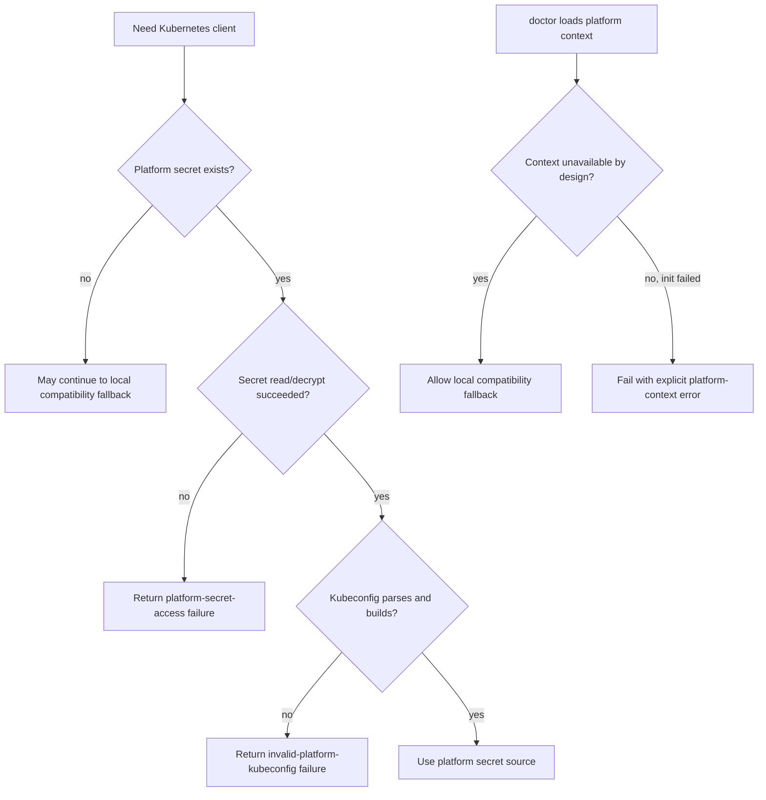

# fix: Address Kubernetes kubeconfig review follow-ups

## Overview

This plan fixes two review findings in the new Kubernetes credential-resolution
path: platform secret backend failures must not be misreported as invalid
kubeconfig, and `ironclaw doctor` must not silently fall back to local/default
kubeconfig when the platform-scoped secret path is configured but broken.

## Problem Frame

The initial platform-managed Kubernetes kubeconfig work made source ordering
explicit, but review uncovered two operator-facing failure-mode bugs:

- doctor currently swallows platform-context initialization failures and can
  report success through a local compatibility kubeconfig even when the
  intended platform path is broken
- the runtime resolver currently classifies most platform secret read failures
  as `InvalidPlatformKubeconfig`, which can mislead setup into suggesting that
  the stored kubeconfig content is malformed when the real issue is secret
  access, decryption, or backend availability

These are not cosmetic issues. They change the remediation path an operator is
given, and they can hide real platform failures behind a passing diagnosis.

## Requirements Trace

- R1. Platform secret access failures must be distinguishable from invalid
  kubeconfig content
- R2. Setup must only offer kubeconfig replacement when the stored content is
  actually missing or malformed, not when the secrets backend is failing
- R3. `ironclaw doctor` must surface platform-context initialization failures
  explicitly instead of silently degrading to local/default kubeconfig
- R4. Local/default kubeconfig remains a compatibility fallback only when the
  platform path is genuinely unavailable by design, not when it is present but
  broken
- R5. Tests must cover the real caller behavior at the setup/doctor boundary,
  not only helper-level error classification

## Scope Boundaries

- No changes to Kubernetes credential source priority
- No redesign of owner-scoped secret naming or storage location
- No UI or API expansion for multi-cluster secret selection
- No changes to job credential grants, worker bootstrap, or worker secret
  delivery
- No broad doctor refactor outside the Kubernetes credential-path handling

## Context & Research

### Relevant Code and Patterns

- `src/sandbox/kubernetes.rs` owns the host-side source resolver and currently
  maps all non-`NotFound` secret read failures into
  `InvalidPlatformKubeconfig`
- `src/setup/wizard.rs` branches its retry/capture behavior based on
  `KubernetesClientResolutionError`, so resolver classification directly
  changes the operator prompt
- `src/cli/doctor.rs` uses a lightweight config/bootstrap path for Kubernetes
  context and currently converts all initialization failures into `None`,
  which then enables default local fallback behavior
- `src/secrets/types.rs` already distinguishes `NotFound`, `DecryptionFailed`,
  `Database`, `InvalidMasterKey`, and other failure classes, so the resolver
  can preserve a more truthful distinction without inventing a new backend
  abstraction
- Existing Kubernetes resolver tests in `src/sandbox/kubernetes.rs` already
  cover source ordering and malformed kubeconfig behavior, making that file the
  natural place to add the new secret-access error coverage
- Existing doctor tests live in `src/cli/doctor.rs`, so caller-level doctor
  regression tests should be added there instead of only unit-testing a helper

### Institutional Learnings

- `docs/plans/2026-04-14-002-feat-kubernetes-platform-kubeconfig-plan.md`
  established that operator guidance must clearly distinguish credential-source
  absence from cluster reachability failure
- No `docs/solutions/` directory exists today, so there is no separate stored
  learning to reuse for this exact follow-up

### External References

- None required. The review findings are about local error propagation and
  operator guidance within existing repo boundaries.

## Key Technical Decisions

- **Add a dedicated platform-secret access failure path**: Secret backend
  failures and invalid kubeconfig content lead to different remediation. They
  should not share one error variant.

- **Treat doctor platform-context initialization as tri-state, not optional**:
  doctor needs to distinguish between “platform path not configured” and
  “platform path expected but failed to initialize.” Only the former may
  legitimately fall back to local/default kubeconfig.

- **Keep setup prompting conservative**: The wizard should only suggest saving
  or replacing platform kubeconfig when the current issue is missing or invalid
  content. Backend and decryption failures should stop with a specific error so
  operators do not overwrite good data.

- **Test through the caller paths that make user-facing decisions**: Resolver
  classification alone is not enough. The fix must be verified at the doctor
  and setup decision boundary because that is where misleading behavior occurs.

## Open Questions

### Resolved During Planning

- **Should this fix reopen the completed feature plan?** No. Use a new `fix`
  plan so the completed feature plan remains an accurate record of the shipped
  scope, and this follow-up remains independently reviewable.

- **Should doctor ban local fallback whenever config loading fails for any
  reason?** No. Only block fallback when the failure indicates a broken
  platform-scoped path, not when the deployment genuinely has no configured
  platform secret path and is operating in local-only compatibility mode.

### Deferred to Implementation

- Exact error variant naming for “platform secret access failed” versus
  “invalid platform kubeconfig content”
- Whether doctor should surface the platform-context failure as a dedicated
  `Fail(...)` message from `check_kubernetes_cluster()` or as a richer
  detail string embedded in the existing result formatting

## High-Level Technical Design

> *This illustrates the intended approach and is directional guidance for
> review, not implementation specification. The implementing agent should treat
> it as context, not code to reproduce.*

## Implementation Units

- [x] **Unit 1: Split platform secret access failures from invalid content**

**Goal:** Make the Kubernetes resolver distinguish “cannot read/decrypt the
platform secret” from “secret content is malformed.”

**Requirements:** R1, R2, R4

**Dependencies:** None

**Files:**
- Modify: `src/sandbox/kubernetes.rs`
- Test: `src/sandbox/kubernetes.rs`
- Modify: `src/setup/wizard.rs`
- Test: `src/setup/wizard.rs`

**Approach:**
- Extend `KubernetesClientResolutionError` so platform secret backend failures
  have their own explicit variant instead of being folded into
  `InvalidPlatformKubeconfig`
- Preserve `SecretError::NotFound` as the only secret-store result that allows
  the resolver to continue down the normal fallback chain
- Update setup branching so “Save a platform kubeconfig now?” is only offered
  for genuinely missing or invalid kubeconfig content, not backend failures
- Keep the existing source ordering unchanged

**Patterns to follow:**
- Existing resolver tests in `src/sandbox/kubernetes.rs`
- Existing setup retry structure in `src/setup/wizard.rs`
- Existing `SecretError` distinctions in `src/secrets/types.rs`

**Test scenarios:**
- Happy path: missing platform secret still allows local/default kubeconfig
  fallback when available
- Error path: secret backend read failure returns a platform-secret-access
  error instead of `InvalidPlatformKubeconfig`
- Error path: secret decryption failure returns a platform-secret-access error
  and does not silently fall through to local/default kubeconfig
- Error path: malformed stored kubeconfig still returns
  `InvalidPlatformKubeconfig`
- Integration: setup only offers kubeconfig capture/replacement for missing or
  malformed secret content, not for secret backend failures

**Verification:**
- Resolver errors clearly separate backend access failure from malformed
  content
- Setup no longer suggests overwriting platform kubeconfig when the secret
  backend is the real problem

- [x] **Unit 2: Make doctor fail explicitly on broken platform-context initialization**

**Goal:** Prevent `ironclaw doctor` from reporting a healthy local fallback
when the intended platform-scoped secret path failed to initialize.

**Requirements:** R3, R4, R5

**Dependencies:** Unit 1

**Files:**
- Modify: `src/cli/doctor.rs`
- Test: `src/cli/doctor.rs`

**Approach:**
- Change the doctor Kubernetes context loader from `Option` semantics to a
  result shape that can distinguish:
  1. platform path not configured or not applicable
  2. platform path ready
  3. platform path expected but failed to initialize
- In `check_kubernetes_cluster()`, only allow default/local auth fallback for
  case (1)
- For case (3), fail early with an explicit platform-context error message so
  the diagnosis reflects the real problem
- Keep local-only developer compatibility intact when there is genuinely no
  configured platform secret path

**Execution note:** Start with caller-level tests around `check_kubernetes_cluster()`
or the nearest testable doctor decision boundary before finalizing the loader
shape.

**Patterns to follow:**
- Existing Kubernetes doctor check in `src/cli/doctor.rs`
- Existing repo preference for surfacing unavailable dependencies explicitly via
  service-unavailable style messaging

**Test scenarios:**
- Happy path: when no platform secret path is configured, doctor may still use
  local/default kubeconfig compatibility and reports that source
- Happy path: when platform context initializes successfully, doctor reports the
  active source as before
- Error path: config loads and secrets master key is present, but secrets store
  creation fails -> doctor returns a failure that names platform-context
  initialization rather than reporting local/default success
- Error path: config loads and master key is invalid -> doctor returns a
  platform-context failure instead of silently degrading
- Integration: doctor never reports local/default kubeconfig success when a
  broken platform secret path was expected

**Verification:**
- doctor output distinguishes “platform path unavailable by design” from
  “platform path broken”
- A broken platform secret path cannot be masked by a local kubeconfig present
  on the same machine

- [x] **Unit 3: Align operator-facing wording and regression coverage**

**Goal:** Ensure the new failure distinctions are reflected consistently in
operator guidance and remain protected by regression tests.

**Requirements:** R2, R3, R5

**Dependencies:** Units 1-2

**Files:**
- Modify: `src/setup/README.md`
- Modify: `src/cli/doctor.rs`
- Modify: `src/setup/wizard.rs`
- Test: `src/sandbox/kubernetes.rs`
- Test: `src/cli/doctor.rs`
- Test: `src/setup/wizard.rs`

**Approach:**
- Update wording so operator-facing messages refer separately to:
  - missing platform credential configuration
  - invalid platform kubeconfig content
  - platform secret access / initialization failure
- Keep the vocabulary consistent between resolver, setup, doctor, and setup
  documentation
- Add the narrowest regression coverage that proves the caller behavior, not
  just helper classification

**Patterns to follow:**
- Existing source-label wording already used in setup and doctor
- Existing setup documentation style in `src/setup/README.md`

**Test scenarios:**
- Happy path: malformed kubeconfig produces invalid-content wording
- Error path: backend/decryption failure produces access-failure wording
  without replacement prompt
- Integration: doctor and setup do not use the same text to describe two
  different failure classes

**Verification:**
- Operators get different guidance for content problems versus backend-access
  problems
- Regression tests cover the decision points that originally produced the two
  review findings

## System-Wide Impact

- **Interaction graph:** This touches the host-side Kubernetes resolver, setup
  wizard prompt selection, and doctor diagnostics. It should not affect worker
  bootstrap, job grants, or Pod credential delivery.
- **Error propagation:** Secret backend failures should now preserve their
  category through resolver -> setup/doctor decision points instead of being
  flattened into malformed-content errors.
- **State lifecycle risks:** Incorrectly prompting for kubeconfig replacement
  could overwrite a valid stored secret; the plan explicitly avoids that path.
- **API surface parity:** No public API contract changes are required, but the
  existing admin secret provisioning path must continue to interoperate with the
  resolver.
- **Integration coverage:** Caller-level tests are required for doctor and
  setup because helper-only tests would not prove that misleading prompts and
  silent fallback are fixed.
- **Unchanged invariants:** Credential source order remains
  `in-cluster -> platform secret -> local/default`; platform kubeconfig remains
  host-side only and owner-scoped.

## Risks & Dependencies

| Risk | Mitigation |
|------|------------|
| doctor becomes too strict and breaks legitimate local-only workflows | Only block fallback when platform context is expected but initialization fails; preserve compatibility mode when platform path is genuinely absent |
| Error taxonomy grows but setup/doctor wording drifts apart | Centralize on the resolver error classes and add caller-level regression tests for the user-facing branches |
| Tests only prove helper behavior and miss the real bug | Add coverage at the setup and doctor decision boundaries, not only inside the resolver |

## Documentation / Operational Notes

- This fix should keep the original Kubernetes platform-kubeconfig docs intact
  while clarifying operator guidance in `src/setup/README.md`.
- No rollout migration is required; this is a correction to diagnosis and
  remediation guidance.

## Sources & References

- **Origin plan:** [2026-04-14-002-feat-kubernetes-platform-kubeconfig-plan.md](/Users/derek/.codex/worktrees/3988/ironclaw/docs/plans/2026-04-14-002-feat-kubernetes-platform-kubeconfig-plan.md)
- Related code: [kubernetes.rs](/Users/derek/.codex/worktrees/3988/ironclaw/src/sandbox/kubernetes.rs), [doctor.rs](/Users/derek/.codex/worktrees/3988/ironclaw/src/cli/doctor.rs), [wizard.rs](/Users/derek/.codex/worktrees/3988/ironclaw/src/setup/wizard.rs)
- Related review input: 2026-04-15 `ce:review` findings for Kubernetes kubeconfig follow-ups
