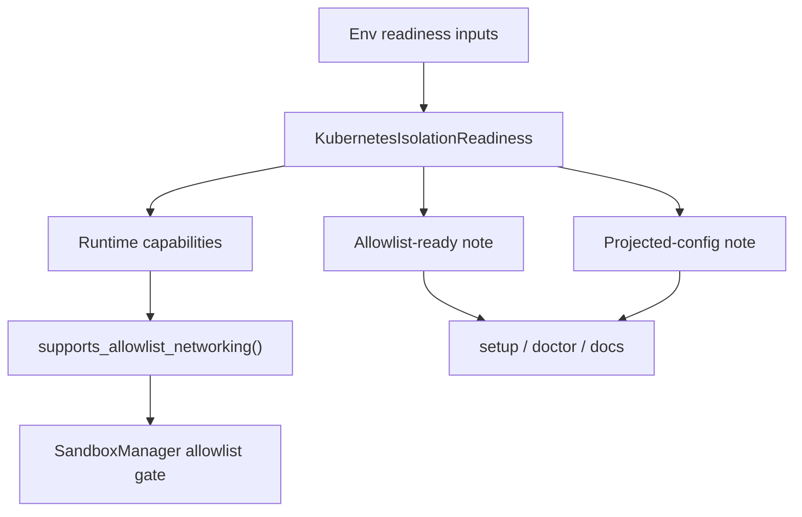

# fix: Align k8s runtime allowlist gating and messaging

## Overview

This plan tightens the `k8s-runtime` implementation around one narrow contract:
Kubernetes one-shot sandbox commands may use allowlist-constrained networking
when `IRONCLAW_K8S_NATIVE_NETWORK_CONTROLS` is declared ready, and user-facing
messages must say exactly that. The work does not expand runtime scope, add new
network mechanisms, or reopen the broader Kubernetes maturity roadmap.

## Problem Frame

The current Kubernetes runtime already gates allowlist-only networking through
the runtime capability profile: `native network controls` flips the runtime
from `pod-direct` to `kubernetes-native-controls`, and the one-shot sandbox
contract allows or rejects allowlist-constrained commands from that field. But
the user-visible messaging path still bundles that capability into broader
"Stage 3 prerequisites" language that also mentions projected runtime config.

That mismatch creates two operator-facing problems:

- the actual allowlist decision is narrower than the messages imply
- setup, doctor, and capability docs can make Kubernetes allowlist support
  sound blocked by an unrelated config-delivery condition

This fix keeps the existing implementation boundary and makes the visible
contract match reality. (See origin:
`docs/brainstorms/2026-04-15-k8s-runtime-allowlist-and-messaging-requirements.md`)

## Requirements Trace

- R1-R4. Kubernetes allowlist gating must depend only on
  `native network controls`
- R5-R8. setup, doctor, runtime guidance, and capability docs must state the
  same rule and keep the current scope boundary clear
- R9-R10. No new execution modes, admin toggles, large-repo logic, or broader
  Stage 3 work may be folded into this change

## Scope Boundaries

- No changes to large-workspace admission or project-scoped overrides
- No new cluster capability auto-detection
- No changes to the underlying allowlist enforcement mechanism
- No changes to workspace write-back semantics
- No rewrite of the broader Kubernetes maturity roadmap

## Context & Research

### Relevant Code and Patterns

- `src/sandbox/kubernetes.rs` builds the Kubernetes runtime capability profile
  from `KubernetesIsolationReadiness`
- `src/sandbox/capabilities.rs` already makes allowlist support depend on
  `network_isolation`, not on projected runtime config
- `src/sandbox/manager.rs` enforces one-shot sandbox capability contracts and
  already rejects allowlist-only networking only when
  `supports_allowlist_networking()` is false
- `src/sandbox/kubernetes_policy.rs` is the shared readiness/messaging layer
  for setup and doctor, but it currently centers on "Stage 3 prerequisites"
  rather than the narrower allowlist contract
- `src/setup/wizard.rs` surfaces Kubernetes readiness to users during sandbox
  setup and currently speaks in combined Stage 3 language
- `src/cli/doctor.rs` formats the runtime detail string and test coverage for
  the Kubernetes status note
- `docs/capabilities/sandboxed-tools.mdx` and
  `docs/zh/capabilities/sandboxed-tools.mdx` still describe Kubernetes
  allowlist behavior as broadly blocked until the larger Stage 3 prerequisites
  are configured
- `src/sandbox/manager.rs` already contains targeted runtime contract tests for
  host proxy absence, native network controls, and uploaded workspace behavior,
  which is the right pattern to preserve

### Institutional Learnings

- `docs/brainstorms/2026-04-14-kubernetes-runtime-maturity-requirements.md`
  and `docs/plans/2026-04-14-001-feat-kubernetes-runtime-maturity-plan.md`
  separated Stage 2 project-backed work from the broader near-Docker roadmap
- The current repo does not have a `docs/solutions/` directory, so there is no
  stored follow-up note for this narrower messaging fix

### External References

- None required. This change is about local runtime truthfulness and user
  guidance, not a new Kubernetes integration pattern.

## Key Technical Decisions

- **Keep allowlist gating where it already lives**: The runtime capability
  model and `supports_allowlist_networking()` already express the correct
  narrow rule. The fix should reinforce that contract rather than introducing a
  second parallel decision path.

- **Split allowlist readiness from broader Stage 3 readiness in the messaging
  layer**: `KubernetesIsolationReadiness` should expose user-facing messaging
  for allowlist network readiness independently from the broader two-condition
  Stage 3 note.

- **Use explicit configuration as the source of truth**: Continue relying on
  the existing environment-backed readiness inputs. This fix may improve
  validation and wording, but it must not expand into full auto-detection.

- **Keep projected runtime config clearly scoped**: `IRONCLAW_K8S_PROJECTED_RUNTIME_CONFIG`
  should remain a config-delivery capability, not an implicit networking gate.

- **Align all user-visible entry points in one pass**: setup, doctor, and the
  capability docs should all use the same narrow wording so users do not have
  to reconcile conflicting explanations.

## Open Questions

### Resolved During Planning

- **Does the allowlist execution path itself need a new gate?** No. The code
  path already gates allowlist-only networking through `network_isolation` and
  `supports_allowlist_networking()`. The problem is the surrounding messaging.

- **Should projected runtime config remain visible at all?** Yes, but only as
  a separate capability about runtime config delivery. It should not be
  described as a requirement for allowlist networking.

### Deferred to Implementation

- Exact wording for the new setup/doctor note: whether to foreground "allowlist
  networking ready" first and append a separate sentence for projected config
- Whether `KubernetesIsolationReadiness` should keep the existing
  `stage3_prerequisites_ready()` helper for broader roadmap wording while also
  adding narrower allowlist-oriented helpers, or whether doctor/setup should
  stop calling that helper directly for user-facing allowlist messaging

## High-Level Technical Design

> *This illustrates the intended approach and is directional guidance for
> review, not implementation specification.*

## Implementation Units

- [x] **Unit 1: Make readiness messaging express allowlist gating directly**

**Goal:** Add a narrow readiness surface that says whether Kubernetes
allowlist-constrained networking is ready without bundling projected runtime
config into that decision.

**Requirements:** R1, R2, R3, R4, R6, R7

**Dependencies:** None

**Files:**
- Modify: `src/sandbox/kubernetes_policy.rs`
- Test: `src/sandbox/kubernetes_policy.rs`

**Approach:**
- Add readiness helpers and note-formatting centered on allowlist networking
  readiness, separate from the broader two-condition Stage 3 helper
- Preserve the existing explicit env-backed inputs
- Keep any broader Stage 3 helper only if it remains useful for non-allowlist
  roadmap messaging, but stop making it the primary user-facing statement for
  allowlist availability

**Patterns to follow:**
- Existing helper/test style in `src/sandbox/kubernetes_policy.rs`
- Existing runtime capability contract in `src/sandbox/capabilities.rs`

**Test scenarios:**
- Happy path: native network controls enabled, projected config disabled =>
  allowlist readiness reports ready while projected-config messaging remains
  separate
- Happy path: both enabled => allowlist readiness and projected-config
  readiness are both reported
- Error path: both disabled => note clearly says allowlist networking is not
  ready and names the missing network condition
- Error path: projected config enabled without native network controls =>
  allowlist readiness still reports not ready

**Verification:**
- One helper now answers the specific user question "can Kubernetes handle
  allowlist-only networking?"
- Projected runtime config is no longer implied to be part of that answer

- [x] **Unit 2: Align setup and doctor with the narrow allowlist contract**

**Goal:** Make the interactive setup path and `ironclaw doctor` report the same
allowlist rule the runtime already enforces.

**Requirements:** R3, R4, R5, R6, R7, R8

**Dependencies:** Unit 1

**Files:**
- Modify: `src/setup/wizard.rs`
- Modify: `src/cli/doctor.rs`
- Test: `src/setup/wizard.rs`
- Test: `src/cli/doctor.rs`

**Approach:**
- Replace the current "Stage 3 prerequisites" user-facing wording with
  allowlist-focused wording that only depends on native network controls
- Keep projected runtime config messaging visible as a separate note about
  config file delivery when useful
- Update doctor status-detail tests so the expected strings match the new
  contract

**Patterns to follow:**
- Existing Kubernetes setup messaging flow in `src/setup/wizard.rs`
- Existing runtime status detail formatting tests in `src/cli/doctor.rs`

**Test scenarios:**
- Happy path: native network controls enabled => setup and doctor say
  allowlist-constrained one-shot commands can use Kubernetes
- Happy path: native network controls disabled => setup and doctor explain that
  allowlist-constrained commands still need Docker
- Edge case: projected runtime config disabled while native network controls
  are enabled => allowlist message remains positive, config-delivery note stays
  separate
- Error path: status-detail output no longer claims both Stage 3 prerequisites
  are required for allowlist support

**Verification:**
- setup and doctor no longer contradict the runtime allowlist gate
- users see the same allowlist rule before running commands and during runtime
  diagnostics

- [x] **Unit 3: Align capability docs with shipped behavior**

**Goal:** Bring the English and Chinese capability docs in line with the
shipped allowlist contract without widening the stated Kubernetes scope.

**Requirements:** R5, R6, R7, R8, R9, R10

**Dependencies:** Unit 1

**Files:**
- Modify: `docs/capabilities/sandboxed-tools.mdx`
- Modify: `docs/zh/capabilities/sandboxed-tools.mdx`

**Approach:**
- Rewrite the Kubernetes stage notes so allowlist networking depends on
  `IRONCLAW_K8S_NATIVE_NETWORK_CONTROLS` alone
- Keep projected runtime config documented, but describe it only as config file
  delivery
- Preserve the current scope boundary: no claim that Kubernetes now has full
  Docker parity or broader Stage 3 completion

**Patterns to follow:**
- Existing stage summary structure in both capability docs
- Existing bilingual content parity across `docs/` and `docs/zh/`

**Test scenarios:**
- N/A (documentation-only unit)

**Verification:**
- Capability docs match the same rule setup and doctor now show
- The docs do not reintroduce broader Stage 3 promises

## Implementation Order

1. Unit 1 — define the narrow readiness language and helper surface
2. Unit 2 — wire setup and doctor to that surface and update tests
3. Unit 3 — align English and Chinese capability docs with the shipped rule

## Verification Strategy

- Run targeted Rust tests for readiness helpers, sandbox manager contracts, and
  doctor/setup message formatting
- Re-check the capability docs manually for wording parity after code changes
- Confirm the final visible rule is stable across setup, doctor, and docs:
  allowlist-only networking on Kubernetes depends on native network controls,
  while projected runtime config is a separate capability
