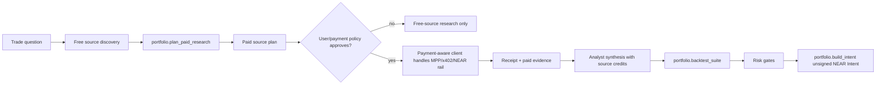

# Paid Research Layer For NEAR Intents Trading

**Date**: 2026-05-02
**Trigger**: Michael Blau's X post about DripStack described a chat UI
over paid financial newsletters where writers are paid when their posts
are used in answers, using MPP on Tempo and x402 on Base.

## What The Post Changes

This is not a trading strategy by itself. It is a missing research
market layer for the trading agent:

1. discover premium financial/crypto writers and paid research APIs,
2. price which sources are worth buying for a specific trade question,
3. pay or prepare payment through agent-native rails,
4. attribute source usage in the answer,
5. keep the NEAR Intents trade path gated by backtests and risk checks.

DripStack's public site exposes the same shape: free publication and post
discovery, plus paid full-post access. Its OpenAPI says paid post routes
return HTTP 402 and can present both MPP and x402 payment challenges. Its
agent skill says paid posts are gated by x402/MPP micropayments and that
agents should fetch publication/post metadata before attempting a paid
post.

## Source Notes

| Source | Relevant detail | Implementation decision |
|---|---|---|
| [DripStack](https://dripstack.xyz) | Landing page frames the product as premium financial-writer Q&A with source payment. | Use it as the target product pattern, not as a dependency. |
| [DripStack SKILL.md](https://dripstack.xyz/SKILL.md) | Free catalog first, paid full post route later, payment-aware client required. | IronClaw should separate source discovery from paid content fetch. |
| [DripStack OpenAPI](https://dripstack.xyz/openapi.json) | Paid full-post endpoint declares 402 responses with MPP `WWW-Authenticate` and x402 `PAYMENT-REQUIRED`. | Store payment rail metadata on candidate sources and require receipts before using paid text. |
| [MPP](https://mpp.dev/) | Described as an open machine-to-machine payment protocol for API requests, tool calls, or content in the same HTTP call. | Model MPP as one paid-source rail. |
| [MPP payment specs](https://paymentauth.org/) | Defines a Payment HTTP Authentication scheme, charge intent, service discovery, and JSON-RPC/MCP transport. | Treat paid tool/resource calls as a protocol-level challenge, not an ad hoc checkout. |
| [Stripe MPP announcement](https://stripe.com/blog/machine-payments-protocol) | Agents request resources, services return payment requests, agents authorize payment, then resources are delivered. | Keep IronClaw's output as a payment plan until a wallet/payment client authorizes. |
| [x402 docs](https://docs.x402.org/) | x402 uses HTTP 402 so clients can pay for APIs/content without accounts or sessions. | Model x402 as the Base-compatible paid-source rail. |
| [Cloudflare x402 docs](https://developers.cloudflare.com/agents/agentic-payments/x402/) | Resource server replies with 402 and payment details, client retries with a payment payload. | Do not fetch paywalled content with plain HTTP; surface a payable plan first. |

## Architecture

## What Was Implemented In This Slice

- `portfolio.plan_paid_research`
  - ranks source candidates by relevance, trust, freshness, tag match,
    and budget cost,
  - selects sources under a dollar cap,
  - emits source attribution IDs,
  - supports multiple payment options per source, so a DripStack article
    can advertise both MPP on Tempo and x402 on Base,
  - summarizes MPP, x402, NEAR-native, subscription, manual, or free
    rails,
  - applies basic agentic-SEO defenses through trust and source-risk
    gates,
  - models a small autonomous wallet policy, including per-article caps,
    daily caps, default one-cent article math, and audit links,
  - emits `near_funding_routes` so a NEAR treasury can prepare rail
    funding through NEAR Intents before external MPP/x402 payment,
  - emits policy gates for budget, receipts, attribution, payment
    authorization, and the trading risk gate.

- `portfolio.plan_dripstack_browse`
  - models DripStack's guided browse flow from free metadata,
  - returns `topic`, `publication`, `article`, or
    `purchase-confirmation` checkpoints,
  - shortlists publications from the user topic,
  - shortlists post summaries for a chosen publication,
  - converts one user-selected article into a paid-source candidate
    without fetching the article body,
  - includes both MPP and x402 payment options for the selected article.

- `portfolio.fetch_dripstack_catalog`
  - fetches DripStack's free publication catalog,
  - fetches free post-title metadata for a chosen publication,
  - keeps the paid article body route out of automatic discovery.

- `portfolio.prepare_dripstack_paid_fetch`
  - prepares the one-article paid fetch boundary after a user selects a
    DripStack post,
  - separates confirmation, HTTP 402 challenge collection, and
    receipt-backed retry headers,
  - supports MPP `Authorization: Payment ...` and x402
    `PAYMENT-SIGNATURE` handoff metadata,
  - does not sign payments, mint receipts, or read paid article bodies.

- `portfolio.format_intents_widget`
  - accepts `paid_research_plan`,
  - exposes `paid_research` in the widget state,
  - shows payable sources, allocated budget, rails, NEAR funding routes,
    autonomous-wallet caps, and audit links in the project widget.

- `intents-trading-agent` skill
  - adds paid research as a formal step before backtesting,
  - stores plans under `projects/intents-trading-agent/paid-research/`,
  - forbids paid text use without receipts,
  - requires paid source credit IDs when paid evidence is used,
  - keeps backtest/risk gates mandatory before any unsigned NEAR Intent.

## Open Implementation Work

| Next PR | What to build | Done when |
|---|---|---|
| Source discovery adapters | Extend beyond the DripStack free catalog adapter into generic MPP/OpenAPI `x-payment-info`, x402 discovery, and local `sources/paid-research.json`. | Agent can populate candidate sources without manual JSON. |
| Payment client boundary | Connect `prepare_dripstack_paid_fetch` to a wallet/payment-client abstraction for live MPP/x402 challenge handling with receipts, never private keys. | Paid content fetch returns receipt metadata and content only after approval. |
| NEAR funding route builder | Convert `near_funding_routes` into unsigned NEAR Intent funding bundles for rail wallets. | User can inspect/sign a funding intent before MPP/x402 fetch. |
| Evidence ledger | Persist paid source receipts, content hashes, quote snippets, and answer attribution. | A journal entry can prove which writer/source contributed to which answer. |
| Research-to-backtest loop | Track whether paid evidence changed candidate strategies and compare outcomes. | Strategy reports show paid-source deltas vs free-source baseline. |

## Hard Boundaries

- Premium research is evidence, not execution authority.
- Paid content must not be summarized, quoted, or used as a factual basis
  before a receipt exists.
- The agent does not sign MPP, x402, or NEAR payments.
- NEAR Intents remain the preferred asset/treasury routing surface for
  this project, but MPP/x402 paid content rails are external services
  unless/until a NEAR-native paid-content rail exists.
