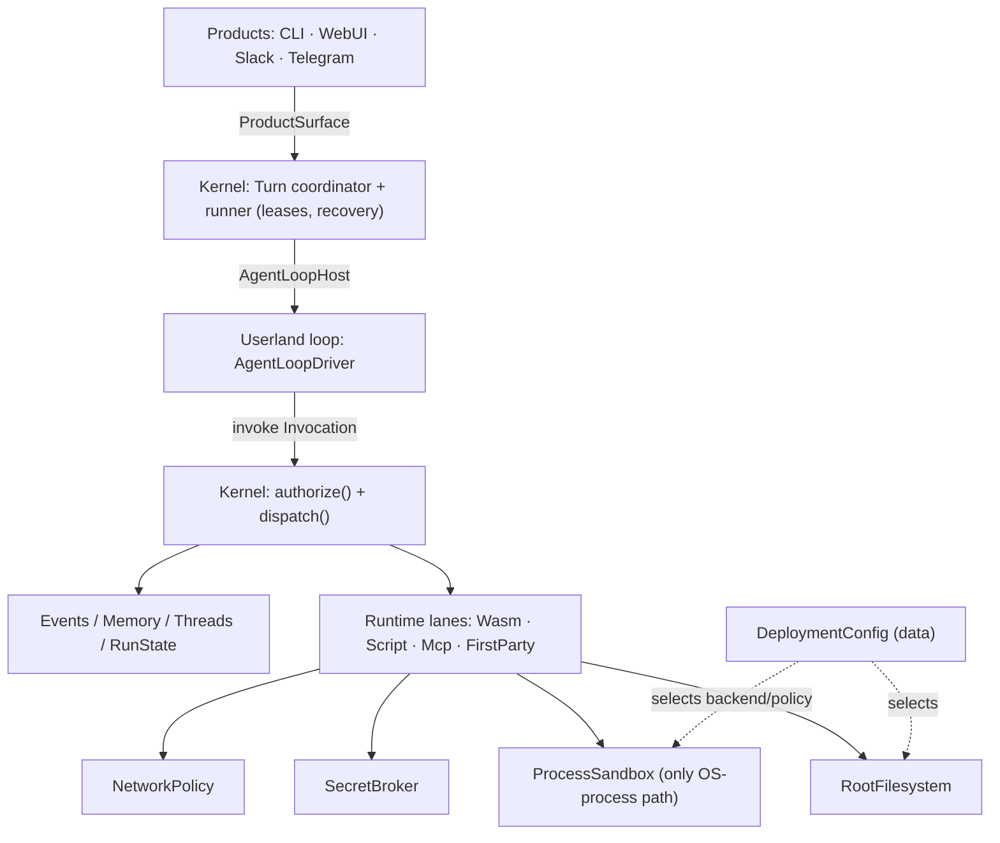

# Reborn Architecture Simplification: Fewer DTOs, Less `dyn`, No Local-Specific Structs

**Date:** 2026-07-17
**Status:** Proposal / design note (not yet a contract)
**Scope:** The capability/turn execution path and storage substrates in `crates/`

This note proposes a **fundamental** simplification of the Reborn host/runtime
internals. The goal is to remove three recurring costs without weakening any
security invariant:

1. **DTO proliferation** — a single tool call is re-wrapped through ~14
   near-identical request/result structs.
2. **`dyn` proliferation** — ~6 hot-path trait objects, several with exactly one
   production implementation (the rest kept for genuine polymorphism).
3. **Local-specific structs** — a parallel `InMemory*` / `Filesystem*` store
   tree per domain, plus deployment-mode struct families that risk local-only
   shortcuts leaking into production.

The thesis: these are three symptoms of **one** decision — *treating internal crate
seams as if they were trust boundaries.* Reborn has a few real trust boundaries —
the untrusted agent loop, untrusted runtime-lane execution (WASM/script/MCP,
containers, external services), and untrusted runtime-supplied data (egress
responses, worker output) — all mediated by host filesystem/network/secrets/sandbox
surfaces, and **all preserved here** (§2). Between them sits a *trusted* mediation
chain that was nonetheless split into ~6 crates, each with its own DTO, its own
`dyn` trait, and its own backend struct family. Collapse those trusted internals
onto a shared vocabulary and concrete wiring; keep every trust boundary intact.

---

## 1. Evidence: where the complexity and the bugs actually are

This proposal is grounded in a code audit plus a cross-reference against the
last ~30 days of merged PRs and open issues.

### 1.1 The capability call re-wraps one payload ~14 times

A single `bash`/`wasm`/first-party tool call is translated through **~8 request
shapes and ~6 result shapes across 6 crate boundaries and 6+ `dyn` seams**. This
is not uniform waste, and it is worth being precise about *why*, because it
determines what is reducible. The field-level diff shows the pipeline holds only
**three genuinely distinct states**; the extra types are duplication forced by the
crate graph plus dead fields that ride along.

Verified request types on the down-path, with what each hop actually adds or drops:

| Hop | Type (crate) | Fields | Change vs. previous |
| --- | --- | --- | --- |
| 1 | `CapabilityInvocation` (`ironclaw_turns`) | `activity_id, surface_version, capability_id, input_ref, approval_resume?, auth_resume?` | the loop's vocabulary — input by **ref**, resume tokens, pre-trust |
| 2 | `RuntimeCapabilityRequest` (`ironclaw_host_runtime`) | `context, capability_id, estimate, input, idempotency_key?, trust_decision` | deref `input_ref`→raw `input`; +`estimate`, +`context`; +2 **dead** fields |
| 3 | `CapabilityInvocationRequest` (`ironclaw_capabilities`) | `context, capability_id, estimate, input, trust_decision` | **identical to hop 2 minus `idempotency_key`** — zero new info |
| 4 | `CapabilityDispatchRequest` (`ironclaw_host_api`) | `capability_id, scope, authenticated_actor_user_id?, estimate, mounts?, resource_reservation?, input` | decompose `context`→`scope`+`actor`; **drop `trust_decision`**; **+`mounts`, +`resource_reservation`** (authorization outputs) |
| 5 | `RuntimeAdapterRequest<'a, F, G>` (`ironclaw_dispatcher`) | hop 4 + `package, descriptor, filesystem&, governor&, runtime_policy` | + resolved substrate handles for the lane |
| — | lane requests (`ScriptExecutionRequest` / `WitToolRequest` / `FirstPartyCapabilityRequest`) | per-lane shapes | final re-wrap into the lane's own type |

Definitions (verified against HEAD, 2026-07-17; cite the symbol — line numbers drift):
`CapabilityInvocation` `ironclaw_turns/src/run_profile/host.rs:1722`, `RuntimeCapabilityRequest`
`ironclaw_host_runtime/src/lib.rs:322`, `CapabilityInvocationRequest`
`ironclaw_capabilities/src/requests.rs:8`, `CapabilityDispatchRequest`
`ironclaw_host_api/src/dispatch.rs:22`, `RuntimeAdapterRequest` `ironclaw_dispatcher/src/lib.rs:56`.
The `dyn` impl counts (§1.3) and the 30-day window (`merged:>=2026-06-17`, §1.5) were derived
the same way.

Four mechanisms produce this, each visible in the code above:

1. **The dependency DAG forbids type sharing, so identical shapes are
   re-declared.** Hops 2 and 3 are the *same struct* (`context, capability_id,
   estimate, input, trust_decision`), differing by one field. They are distinct
   types only because `host_runtime` (upper) and `capabilities` (lower) are
   separate crates and the boundary rule forbids either importing the other's
   request type. The one shareable place — `host_api`, the bottom — is used for
   hop 4 but not the mid-flight shapes, so the mid-flight shape is declared twice.
   This is the concrete form of "every crate boundary treated as a trust
   boundary."

2. **Three real states are modeled as five look-alike structs.** The pipeline has
   exactly three meaningful states: *loop-expressed* (hop 1: ref-based, resume
   tokens, pre-trust), *authorized* (hop 4: raw input + `scope` + `mounts` +
   `resource_reservation`, the outputs of authorization), and
   *resolved-for-a-lane* (hop 5: + substrate handles). Those transitions are
   genuine. Because each state is modeled as "a request struct that looks like the
   others ± a field," the three real states blur into five, and hops 2–3 fall out
   as duplication *between* transitions rather than being transitions themselves.

3. **Fields accrete but never retire — dead transitional cruft rides along.**
   `trust_decision` is copied through hops 2–3 and dropped at hop 4; its own doc
   comment states `DefaultHostRuntime` **ignores it entirely** ("Legacy... kept
   for transitional request-shape compatibility... Callers must not rely on this
   field"). `idempotency_key` at hop 2 is "advisory... does not yet implement...
   kept so shape doesn't break when dedup is wired through downstream." Two of the
   fields every layer copies do nothing — one dead-past, one dead-future — and each
   new field multiplies across every type that mirrors it.

4. **A context bundle is composed, then decomposed.** Hops 2–3 carry
   `context: ExecutionContext` as one field; hop 4 explodes it into loose `scope` +
   `authenticated_actor_user_id`. Bundling, passing, then unpacking is two more
   struct shapes for the same information.

`CapabilityDispatchRequest` already living in `ironclaw_host_api` is the key
signal: the canonical shape *can* live at the bottom. And
`RuntimeAdapterRequest<'a, F, G>` — generic over closures with a lifetime — is a
complexity tell: the seam is parameterized for flexibility production wiring does
not exercise.

**Net:** of the five request types, hops 2 and 3 carry no new information (they
exist for Mechanism 1 and are padded by Mechanism 3); the other three are genuine
states that should be explicit and named. "~14 re-wraps" is really **~3 real
transitions + ~2 pure duplications + dead fields copied at every hop** — so ~40%
is pure duplication that a shared bottom-crate vocabulary removes outright, and
the rest becomes legible once the three states are named.

### 1.2 Authority is smeared across four layers, not centralized

The policy that actually matters (trust classification, credential pre-flight,
approval, obligations, resource reservation, run-state) is **not** in one
gateway. It is interleaved across four hops:

- `ironclaw_loop_host` — resume-mode validation, dispatch reservation, idempotency key;
- `ironclaw_host_runtime` — runtime-policy, trust eval, credential pre-flight, persistent-approval policy;
- `ironclaw_capabilities` — authorize, prepare/complete/abort obligations, run-state, approval blocking;
- `ironclaw_dispatcher` — reservation reconcile/release, registry/runtime-kind routing.

A change to ordering (e.g. credential-before-approval) can only be reasoned
about by holding all four crates in one's head. A mistake in the return-mapping
is silent: a recoverable `Ok(CapabilityOutcome::Failed)` and a run-terminating
`Err(HostRuntimeError)` are structurally identical — a footgun the loop-capability
contract docs record shipping three times.

### 1.3 `dyn` seams that exist for test doubles, not runtime variation

Verified production vs. test-double implementation counts, and how each seam is
stored:

| Seam | Prod impls | Test doubles | Stored as | Verdict |
| --- | --- | --- | --- | --- |
| `LoopCapabilityPort` (loop ↔ host) | 1 terminal (`HostRuntimeLoopCapabilityPort`) + decorators (hooks, surface filters, logging) | several | `Arc<dyn>` decorator chain | **keep** — the trust membrane; decoration is genuine composition |
| `HostRuntime` | 1 (`DefaultHostRuntime`) | 6 (`Recording*`, `Queued*`, `dummy_runtime`) | `Arc<dyn HostRuntime>` | collapse |
| `CapabilityDispatcher` | 1 (`RuntimeDispatcher<F, G>`) | 2 (`Recording*`, `Cancelling*`) | `Arc<dyn CapabilityDispatcher>` | collapse |
| `RuntimeAdapter<F, G>` | 5 (`Script`, `Mcp`, `FirstParty`, `Wasm`, + a `ServiceResolved` wrapper) | — | trait object behind the dispatcher | closed set → enum |
| `LlmProvider` | ~12 providers + decorators (`CircuitBreaker`, `Truncating`, `Swappable`, …); 32 impls total | — | `Arc<dyn>` | **keep** — genuine polymorphism |

Note: `CapabilityHost` is **not** a trait — it is a concrete generic struct
`CapabilityHost<'a, D>`, instantiated as `CapabilityHost<'a, dyn CapabilityDispatcher>`.
So the `dyn` on that path is the dispatcher it holds, not the host.

Three mechanisms produce the avoidable `dyn`:

1. **The trait exists to inject test doubles, not to vary production.**
   `HostRuntime` has one production impl and six test doubles; `CapabilityDispatcher`
   one and two. The trait + `Arc<dyn>` is paid on every production call so tests can
   swap in a `Recording*`/`Queued*`/`Cancelling*` fake. That is a real need met in an
   expensive way — the whole hot path takes vtable dispatch and every layer maintains
   a trait mirroring the concrete API, all to serve a test seam that a generic
   parameter or a single boundary fake would give more cheaply.

2. **Speculative replaceability.** "Replaceable everything" was applied to internal
   mediators, not only to the seams that actually vary. The single-prod-impl trait
   objects on the hot path have never been replaced in production. The second
   implementation is what should motivate re-introducing a trait.

3. **Generic *and* `dyn` — double indirection.** `RuntimeDispatcher<F, G>` and
   `RuntimeAdapter<F, G>` are generic over `RootFilesystem`/`ResourceGovernor` *and*
   used as trait objects (`CapabilityHost<'a, dyn CapabilityDispatcher>` holds a
   generic-turned-`dyn`). The path pays monomorphization complexity and vtable
   dispatch at once — a tell that the design never settled on static or dynamic.

Additionally, `RuntimeAdapter`'s impls are a **closed, enumerable set** — the four
runtime lanes plus a resolver wrapper — modeled as an open trait. New lanes are rare
and security-sensitive; new *tools* are data behind the existing lanes. An open trait
buys extensibility exactly where it is not needed.

### 1.4 A full store reimplementation per backend, per domain (the "local-specific structs")

Backend variation is modeled as **type** variation, not parameterization: each
backend is a separate struct that re-implements the whole domain trait by hand. The
turn store alone is two full implementations of the same semantics:

| Domain | In-memory impl | Durable impl | Reimplemented logic |
| --- | --- | --- | --- |
| turns | `InMemoryTurnStateStore` (`memory/mod.rs`, ~4,260 LOC) | `FilesystemTurnStateStore` (~1,710 LOC) | lease, active-lock, checkpoint, idempotency, events |
| processes | `InMemoryProcessStore` + `InMemoryProcessResultStore` (~230 LOC) | `FilesystemProcessStore` + `FilesystemProcessResultStore` (~920 LOC) | process lifecycle + result store |
| approvals | `InMemory{AutoApprove, PersistentApprovalPolicy, CapabilityPermissionOverride}Store` | matching `Filesystem*` (×3) | three separate approval stores |
| authorization | `InMemoryCapabilityLeaseStore` | `FilesystemCapabilityLeaseStore` | lease store |
| run_state | `InMemory{RunState, ApprovalRequest}Store` | matching `Filesystem*` (×2) | two run-state stores |

Every `InMemory*Store` is a local/test-only parallel implementation of logic that
also exists in the durable impl; a change to turn semantics (a new transition, a
lock rule) must be written **twice, in lock-step**, and production-facing domains add
libSQL + Postgres on top (2–4× per domain). The `InMemory*` structs are the literal
"structs specific to local."

Two mechanisms:

1. **Storage mechanism and domain logic are not separated.** The turn store's
   `filesystem_store/row_store/` layer (journal / delta / row materialization) is a
   *partial* gesture at that split, but it is turns-specific and does not unify
   in-memory vs filesystem vs the other domains. Without a shared backend seam, "what
   the turn state *is*" and "how bytes are persisted" are welded together, so each
   backend re-derives the former just to change the latter.

2. **The split is multiplied by the two work-unit lifecycles.**
   `ironclaw_turns`/`ironclaw_runner` (the leased `TurnRun`) and `ironclaw_processes`
   (the OS-subprocess) are **independent reimplementations** of the same six machinery
   layers — status enum, store trait, in-memory + filesystem stores, cancellation,
   eventing decorator, resource accounting — unified by no shared abstraction, and they
   diverge on recovery (turns recover expired leases; processes have an unimplemented
   reconciler). So the per-backend duplication is itself duplicated across two parallel
   lifecycles.

### 1.5 The last month agrees

- **≥510 merged PRs; 188 (37%) are `fix(...)`.** Backend fixes cluster on exactly
  these seams: channel/identity (22), turn/lease (16), capability/gate (12).
- A **daily automated "failure taxonomy" issue** and a `bug_bash_*` label stream
  exist — institutionalized after-the-fact bug harvesting.
- Review-iteration churn concentrates on the gate/hold/turn/auth seams (single
  "fix" PRs with dozens of review cycles, tens of files, thousands of lines).
- Open issues already target this surface: **#6168** ("Shrink the
  `ironclaw_reborn_composition` god-crate 24% → ~10%") and **#6144** item 1
  (a resource budget that is *defined as a field but never enforced at the call
  site* — the strongest form of "invariant lives at runtime, not in a type").
  Also directly on the capability path: **#6137** ("mixed-batch gate resume never
  redispatches the non-first gated call") and **#6138** (harness can't express a
  compound denied-gate + HTTP-egress-error scenario).

---

## 2. Root cause: crate seams mistaken for trust boundaries

Reborn has a few real **trust boundaries** — places where untrusted code or data meets
trusted host authority — and many **crate seams** that are only internal factoring. The
two must not be confused: trust boundaries are the security model and must be preserved;
crate seams are where the DTO/`dyn` tax accumulates, and are what this document collapses.

**The trust boundaries — preserve all of them:**

- **The agent loop.** Untrusted agent behavior; it may only *ask* for effects through host
  ports, and must not name secrets, the dispatcher, or the network.
- **Runtime-lane execution.** WASM, script/process, MCP, and any container or external
  service running extension/tool code is untrusted. It receives *mediated*
  filesystem/network/secrets/sandbox handles — never ambient authority — and cannot bypass
  the host services.
- **Runtime-supplied data.** Everything coming *back* — egress responses, worker output,
  MCP/external results — is untrusted input: the host validates it, binds it to the
  authorized invocation, enforces limits, and redacts it before it re-enters trusted flow
  or reaches the model. Worker metadata cannot grant authority or declare itself safe.

These are the standing invariants in `.claude/rules/safety-and-sandbox.md` ("mediation is
the boundary"); nothing below relaxes them.

**The crate seams — collapse them.** Between the loop boundary and the lane boundary sits
the *trusted* mediation chain (`loop_host → host_runtime → capabilities → dispatcher`).
That region is entirely trusted host code, yet the implementation split it into ~6 crates
and gave each:

- its **own request DTO**, because the boundary rule (`ironclaw_architecture`
  forbids importing "upward") means a layer that wants to reference a type must
  either depend on the crate that owns it or re-declare it — and re-declaring
  wins each time a layer needs one extra field;
- its **own `dyn` trait**, because "replaceable everything" was applied to every
  seam rather than only the ones with more than one implementation;
- its **own backend struct family**, because "composition mode changes which
  backends are legal" was expressed as parallel types instead of one backend
  parameter.

None of those six internal boundaries is a trust boundary.

### 2.1 The operating-system lens: mechanism vs policy

State it the way an OS does. A kernel provides **mechanism** — a small, stable set
of primitives (files, processes, address spaces, syscalls) — and is deliberately
*slow-moving*: adding an application does not change the kernel. **Policy** — which
app runs, what it may touch, how much it gets — lives outside, as configuration and
userland.

Reborn's kernel boundary must obey the same rule: **adding a feature, or a
deployment target, must not change the kernel.** Everything above collapses to one
violation of it — *policy encoded as kernel types*:

- **Deployment mode is a kernel enum.** `RuntimeProfile::{LocalDev, HostedDev,
  EnterpriseDev}` and `DeploymentMode` live in `ironclaw_host_api` — the vocabulary
  crate — and code across the host branches on them. Mode is the definition of
  policy; putting it in the kernel forces every mode to grow its own type family
  (the ~66-identifier `LocalDev*` shadow runtime, §4.4).
- **Storage medium is a domain type.** Each domain hand-writes an in-memory store
  *and* a durable store (§1.4); the medium — a deployment choice — is baked into the
  type instead of injected. The kernel should name *"a store"*; the config should
  pick the medium (§4.3).

So the simplification is one idea applied consistently: **the kernel is mechanism —
a small, frozen authority vocabulary plus a few real seams; everything that varies
by feature or deployment is policy, resolved to data at the composition edge.** The
`Invocation` / `Authority` / `Outcome` triple below is what feature-agnostic
mechanism looks like; §4.3–§4.5 remove the policy that leaked into types.

---

## 3. Proposed model: one payload, authority as a fold, one seam

Separate the **data plane** (the payload, which never changes shape) from the
**control plane** (authority decisions, which accrete in a side value).

```rust
// ── ironclaw_host_api (the bottom crate everyone already depends on) ──
struct Invocation { capability: CapabilityId, input: Json, scope: Scope, estimate: Estimate } // the ONE payload
struct Authority  { trust: TrustClass, approval: Option<ApprovalLease>,          // SEALED: fields private,
                    reservation: Reservation, mounts: ScopedMounts }             // constructed only by authorize()
enum   Blocked    { Approval(GateRef), Auth(GateRef), Resource(GateRef) }
struct Outcome    { /* sanitized refs + summary; carries success OR recoverable failure */ }  // the ONE result

// ── the host kernel (trusted, below the loop seam) ──
fn authorize(inv: &Invocation) -> Result<Authority, Blocked>;                    // scope from inv.scope; ALL policy, one place
fn dispatch (inv: &Invocation, auth: &Authority, lane: &RuntimeLane) -> Outcome; // already authorized
```

- The payload is `Invocation`, full stop. `RuntimeCapabilityRequest`,
  `CapabilityInvocationRequest`, `CapabilityDispatchRequest`, and
  `RuntimeAdapterRequest` disappear — they were `Invocation` plus a field that
  now lives in `Authority`, threaded by reference.
- Because `host_api` is the bottom crate, putting the vocabulary there *satisfies*
  the boundary rule (and Golden Boundary #1: `host_api` stays vocabulary-only)
  instead of fighting it. This finishes a move that `CapabilityDispatchRequest`
  already half-made.
- `Authority` is **sealed**: private fields, no public constructor — the only way to
  obtain one is to pass `authorize()` (host-minted, following the
  `LoopExitValidationPolicy` witness pattern), so a caller cannot forge or retain an
  unauthorized `Authority`.
- Authorization becomes a single `authorize()` body — the four scattered policy checks
  collapse into one reviewable function with visible ordering. The result contract is one
  shape: `invoke` = `authorize` then `dispatch` = `Result<Outcome, Blocked>`, where
  `Outcome` carries *both* success and recoverable tool failure and `Blocked` carries the
  approval/auth/resource gates. There is no separate `Err(terminate)` channel — which is
  what removes the `Ok(Failed)` vs `Err` ambiguity §1.2 flagged.

**Type count on a capability call: ~14 → 3.**

### 3.1 The three real states, named

This directly resolves the four mechanisms in §1.1. The five request types
collapse onto the three states the field diff identified; the two duplicates and
the dead fields disappear with them:

| Real state | Carried as | Replaces |
| --- | --- | --- |
| loop-expressed (pre-trust) | `Invocation` (input by ref, resume tokens) | `CapabilityInvocation` |
| authorized | `Invocation` + `&Authority` (trust, approval lease, reservation, mounts) | `RuntimeCapabilityRequest`, `CapabilityInvocationRequest`, `CapabilityDispatchRequest` |
| resolved-for-a-lane | `Invocation` + `&Authority` + resolved handles (package, descriptor, filesystem, governor) | `RuntimeAdapterRequest` |

- **Mechanism 1 (DAG re-declaration) is eliminated:** the one authorized shape is
  `Invocation` + `&Authority`, both defined in `host_api`, so `host_runtime` and
  `capabilities` reference it instead of each re-declaring it.
- **Mechanism 3 (dead fields) is eliminated:** `trust_decision` vanishes because
  trust is *computed inside* `authorize()` and lands in `Authority.trust`, never
  carried as a request field; `idempotency_key` is either implemented once in the
  authorization pass or deleted.
- **Mechanism 2 (blurred states) becomes explicit:** the three transitions are
  now named — `Invocation`, then `+ Authority`, then `+ resolved handles` — rather
  than five near-identical structs. Mechanism 4 (compose/decompose `context`) goes
  away because `Authority` carries `scope`/`actor` in one shape end to end.

---

## 4. The three moves, mapped to the three costs

### 4.1 Less DTO — `authorize`/`dispatch` over one payload

Define `Invocation` / `Authority` / `Outcome` in `ironclaw_host_api`. Every layer
references those instead of re-declaring; extra per-layer context is threaded by
reference (`&Authority`), not by re-wrapping the payload. The mirror-struct tax
goes to zero because nothing mirrors.

### 4.2 Less `dyn` — a trait earns a trait object only if it has ≥2 production impls or is the trust boundary

- **Keep** `LoopCapabilityPort` (the loop's trust membrane — one of several trust
  boundaries, §2) and `LlmProvider` (genuine polymorphism).
- **Replace** `RuntimeAdapter`'s `dyn` with a closed `enum RuntimeLane`
  (`Wasm | Script | Mcp | FirstParty`). Adding a lane becomes a compile error
  until every `match` handles it. WASM extensions stay open — they are *data*
  behind the `Wasm` lane, not new lanes — so a closed lane set costs no real
  extensibility.
- **Delete** the `HostRuntime` and `CapabilityDispatcher` traits; make them
  concrete (or a single generic parameter resolved once at composition), and get
  the test seams they currently serve (§1.3, mechanism 1) from generics or one
  boundary fake instead of a production `Arc<dyn>`. `CapabilityHost` is **already**
  a concrete struct — collapsing `CapabilityDispatcher` to a concrete type removes
  the `dyn` it holds today (`CapabilityHost<'a, dyn CapabilityDispatcher>`), and its
  role folds into the `authorize` + `dispatch` pair.

**Hot-path `dyn`: 6+ → ~2, plus one lane enum.**

### 4.3 Delete every in-memory store; the storage seam already exists

The realization that reshapes this move: **the single storage seam is already in
the tree — it is `RootFilesystem`** (`ironclaw_filesystem`). It already has four
production-grade backends — `InMemoryBackend`, on-disk (`LocalFilesystem`),
`LibSqlRootFilesystem`, `PostgresRootFilesystem` — and the durable stores are
**already generic over it**: `FilesystemTurnStateStore<F>`,
`FilesystemProcessStore<F>`, `FilesystemCapabilityLeaseStore<F>`,
`FilesystemRunStateStore<F>`, `FilesystemAutoApproveSettingStore<F>`, and so on. The
`RowBackend` I earlier proposed inventing already exists and is already wired.

So the move is subtractive, not additive:

1. **Delete every hand-written `InMemory*Store`.** Tests instantiate the *same*
   store the deployment runs — `FilesystemTurnStateStore<InMemoryBackend>` — so
   "in-memory" stops being a store and becomes a **filesystem backend**
   (`InMemoryBackend`, which already implements `RootFilesystem`). One store
   implementation per domain, exercised in tests over the in-memory backend and in
   production over libSQL/Postgres. The ~4,260-LOC `InMemoryTurnStateStore` becomes
   deletable once `FilesystemTurnStateStore<InMemoryBackend>` covers its cases.

2. **Backend choice is deployment config, not a type.** Which `RootFilesystem`
   impl backs a run is one value in a `DeploymentConfig` fed to a single
   `build_runtime(config)`; the runtime holds it as `Arc<dyn RootFilesystem>` (or a
   concrete `F` fixed at `build_runtime`) — the existing `CompositeRootFilesystem` /
   backend selection already does exactly this, so nothing new is invented and the
   `RowBackend` trait an earlier draft floated is unnecessary. Deleting the
   `InMemory*Store`s has **no persistence-compatibility impact**: they are
   in-memory/test-only, and the durable libSQL/Postgres backends — with their own
   transaction/locking semantics, which `RootFilesystem` already encapsulates — are
   untouched. "Local may reduce authority, never increase it" is a policy value, not a
   `Local*` code fork (§4.4).

Why the in-memory stores exist today: they predate the generic
`Filesystem*Store<F>` and were kept as the fast reference/test path. Now that a
first-class `InMemoryBackend: RootFilesystem` exists, they are redundant — a whole
second implementation per domain, kept alive only for tests that a memory-backed
filesystem serves for free. (Honest caveat: the turn store's ~4,260-LOC in-memory
impl is larger than the ~1,710-LOC filesystem one, so consolidation is *reconcile
then delete*, not a blind delete — but the target is one store, backend-injected.)

Open follow-on: consider a shared "leased recoverable work-unit" abstraction over
`TurnRun` and `ironclaw_processes` (§1.4, mechanism 2), or explicitly document why
the two lifecycles stay separate.

### 4.4 Eliminate `Local*`: deployment mode is policy, not a kernel type

**Local-dev is a policy, so it must be a policy *config* — a value — not an
implementation with its own structs and code.** That is the whole rule. Today the
tree has ~66 `LocalDev*` identifiers across **42 files in
`ironclaw_reborn_composition`** — a whole shadow local-dev *runtime*
(`LocalDevApprovalGatePolicy`, `LocalDevCapabilityLeaseStore`,
`LocalDevAutoApproveSettingStore`, `LocalDevMountProfile`, `LocalDevNetworkProfile`,
`LocalDevOutboundStores`, `LocalDevLoopCapabilityPortFactory`,
`LocalDevConstraintSource`, …). All of it collapses to a single config literal that
selects the *same* substrates every deployment uses:

```rust
// The entirety of "local dev" — data, not types. No LocalDev* structs, no code path.
const LOCAL_DEV: DeploymentConfig = DeploymentConfig {
    filesystem: Backend::InMemory,                 // or Backend::Disk
    approval:   ApprovalPolicy::AutoApproveEligible, // wider than hosted — a value
    network:    NetworkPolicy::AllowAll,           // vs Allowlist(..) in hosted
    process:    ProcessPolicy::HostUnsandboxed(LocalOnly), // vs Sandboxed; gated by a local-only token a served boot can't mint (§6)
    owner_seed: Some(OwnerSeed::EnvToken),          // was the local_trigger_access module
};
```

`build_runtime(LOCAL_DEV)` wires the ordinary `FilesystemTurnStateStore<InMemoryBackend>`,
the ordinary approval/capability/lease substrates, and the ordinary ports — with
these values. The same is true of hosted and enterprise: each is a `DeploymentConfig`
constant, and the difference between them is data a reviewer can read in one place,
not a struct family spread across 42 files. (An audit of what the `LocalDev*` code
*actually does* — §4.4.1 — confirms this holds, with the refinement that a little of
it is shared *behavior* the config gates rather than pure data.)

The `LocalDev*` identifiers fall in three buckets:

**Bucket 1 — deployment-mode-as-type leaks (delete).** They exist *only* because
`RuntimeProfile::{LocalDev, HostedDev, EnterpriseDev}` / `DeploymentMode` are kernel
enums that code branches on — the `DeploymentMode` doc comment literally says a
variant decides whether "`Local*` profiles" are allowed — so local-dev was built as
its own parallel wiring of approval, capability, lease, mount, network, and outbound
policy. **Fix:** resolve mode to policy *data* at the composition edge. The kernel
consumes the already-existing `EffectiveRuntimePolicy` (`ironclaw_runtime_policy`) —
an allowlist, an approval width, a sandbox requirement, a mount profile — and never
names a mode. The `local_trigger_access` module
(`LocalTriggerAccessSource::LocalDev{Env,Sso,Run}Bootstrap`) becomes "seed the owner
grant from config at boot," a policy value, not a module. Local-dev then wires the
*same* substrates with a config that selects `InMemoryBackend`/disk, a wider approval
width, and a permissive allowlist — no `LocalDev*` types.

**Bucket 2 — genuine resource/trust names mis-prefixed `Local` (rename).** Two types
describe a real resource or trust boundary and only *look* like mode leaks:

- `LocalFilesystem` → `DiskFilesystem` / `OnDiskBackend`: it names the storage
  medium (disk vs memory vs libSQL vs Postgres), a backend, not a deployment mode.
- `LocalHostProcessPort` → `HostProcessPort`: it names the trust boundary (a process
  on the host vs a sandboxed process). The trust-boundary baseline already requires
  that "sandbox/native/host names accurately describe the trust boundary"
  (`docs/reborn/2026-05-11-trust-boundary-stack-note.md`); `Local` obscures it,
  `Host` states it.

**Bucket 3 — false positives (leave).** `Locale`/`LocaleError` (localization),
`HookLocalId`, `LocalTraceSubmissionRecord` (this-node submission to Trace Commons;
rename to `NodeTraceSubmission*` only if convenient).

Enforce it with an `ironclaw_architecture` test: **no public type name contains
`Local`/`LocalDev`/`Hosted`/`Enterprise`.** A deployment mode is a config value that
selects backends and policy; it is never a type the kernel or a substrate names.

### 4.4.1 Audit: does `DeploymentConfig` express everything? (verified 2026-07-17)

A four-cluster audit of the ~40 `LocalDev*` types (policies, stores, capability
wiring, trust/evidence) answers this concretely: **`DeploymentConfig` expresses every
genuine local-dev *choice*, but the `LocalDev*` family is three different things, and
only the first is pure config data.** Reaching zero `LocalDev*` types is three moves,
not one:

1. **Already config (most of it).** The local-dev capability policy is *literally a
   TOML file* (`local_dev_capability_policy.toml`) deserialized into the
   `LocalDev*Policy`/`*Profile` structs — allowlists, approval widths, mount
   references, network presets. The stores are the *same* shared types production
   uses: `production_turn_state_store<F>` is called by **both** local-dev and prod,
   differing only by backend (`InMemoryBackend`/disk/libSQL/Postgres). The
   `LocalDevOverride` trust seam is **inert** (`evaluate()` returns `Ok(None)`,
   disabled, no prod opt-in) and its data model is a package→trust allowlist. →
   relocate into `DeploymentConfig` verbatim.

2. **Mis-prefixed shared substrate — not local at all (de-prefix, don't configify).**
   Several `LocalDev*` types are genuine *code* but nothing about them is
   local-dev-specific; every deployment needs them, and they read authoritative state
   and fail closed: the approval/resource `*GateEvidence` readers (they *verify a
   loop's blocked claim* against the real stores — no synthesis, no auto-approve), the
   `ApprovalLeaseTermsProvider` (merges static policy with per-user extension grants),
   the auth-interaction read-model, and `LocalDevCapabilityIo` (which already has a
   hosted twin `ProductLiveCapabilityIo`). → **de-prefix and move to the owning
   substrate crate; shared by all deployments, not config.**

3. **Genuine local-only mechanism — config-*gated*, not config-*data* (the real
   residue).** One cluster is truly local-only behavior: the capability-port decorator
   stack hosted never applies — synthetic product tools, host-execution surface
   disclosure, and a mid-run surface-refresh wrapper. Behavior is code, not data. But
   the *base* port is the identical `HostRuntimeLoopCapabilityPortFactory` prod uses;
   the decorators are shared middleware that a **boolean in `DeploymentConfig`**
   switches on. → one port builder, config-gated decorators, no `LocalDev*` factory.

The sharpest finding sits in category 3: the "synthetic capabilities"
(`builtin.project_create`, `skill_activate`, `result_read`, `outbound_delivery_*`)
exist only because local-dev lacks the runtime lane that would expose these product
operations as real host capabilities — so it bolts them on as handlers. The correct
fix is not a config flag but Reborn's own rule (*everything goes through
capabilities*): **make them first-party capabilities dispatched through the normal
lane, with visibility governed by capability-surface policy.** That deletes the
synthetic mechanism outright and makes the operations available and audited
everywhere, not just local-dev.

**Verdict.** `DeploymentConfig` expresses every *selection*; it does not — and should
not — turn *behavior* into data. Behavior stays as shared, feature-agnostic mechanism
the config switches on. No `LocalDev*` type needs to survive. **Security note:** the
audit found no trust or approval bypass — the trust override is inert, provider trust
is minted only at the non-privileged `user_trusted` tier, and the gate-evidence
readers fail closed. Local-dev is more permissive via *policy values* (wider approval,
wildcard network, host process), never via code that defeats a check.

### 4.5 Name and freeze the kernel boundary

The boundary is what every feature and reviewer must hold in their head, so it is
the thing to make small and stable. Enumerated today it is:

- **Vocabulary — `ironclaw_host_api`: 21 files, ~124 public types** (67 structs, 55
  enums) and only 2 traits (`CapabilityDispatcher`, `RuntimeHttpEgress`). Concern
  files: `action, approval, audit, capability, capability_profile, decision,
  dispatch, dotted_id, error, host_port, http, ids, ingress, mount, path, resource,
  runtime_policy, runtime, scope, trust`.
- **The loop ↔ kernel seam — `AgentLoopDriverHost`**: ~13 fine-grained ports
  (`LoopRunInfoPort, LoopContextPort, LoopInputPort, LoopPromptPort, LoopModelPort,
  LoopCapabilityPort, LoopTranscriptPort, LoopCheckpointPort, LoopProgressPort,
  LoopCancellationPort`, plus model sub-ports).
- **The host mediators**: `HostRuntime`, `CapabilityHost`, `CapabilityDispatcher`
  (collapsing per §4.2).

Two cleanups make it a *kernel*:

1. **`runtime_policy.rs` does not belong in the vocabulary.** `DeploymentMode` /
   `RuntimeProfile` are deployment policy, not authority vocabulary. The kernel
   should speak `EffectiveRuntimePolicy` (resolved data) and let mode resolve at the
   edge (§4.4). Moving it out is the first concrete shrink.
2. **~124 types is too large for a "slow-moving" boundary.** Audit the 124 into
   (a) mode/policy types that belong at the edge, (b) product/feature-shaped types
   that leaked down, (c) genuinely neutral authority vocabulary — IDs, scopes, paths,
   decisions, mounts, resources, trust. Only (c) stays, and gets **frozen by a
   boundary test**, so a new feature that wants to add a `host_api` type must justify
   that it is authority vocabulary, not policy. That freeze is the operational
   meaning of "slow-moving kernel": the boundary changes when the *security model*
   changes, never when a feature ships.

---

## 5. Target structure: the minimal kernel and clean interfaces

This is the destination the moves converge on: a small, frozen **kernel** of
authority and recovery; **substrates** that are mechanism behind narrow ports;
**userland loops** and **products** as replaceable code that reach the kernel through
exactly two interfaces; and **deployment** as a config value.

### 5.1 Components

| Layer | Component | Owns | Interface | Changes when… |
| --- | --- | --- | --- | --- |
| Product | CLI / WebUI / Slack / Telegram | UX, transport, rendering | *consumes* `ProductSurface` | a surface's UX changes |
| **Kernel** | Turn coordinator + runner | durable turns, leases, active-lock, recovery | exposes `ProductSurface`, `AgentLoopHost` | the recovery model changes |
| **Kernel** | Capability mediation | `authorize` + `dispatch` over `Invocation`/`Authority`/`Outcome` | `AgentLoopHost::invoke` | the authority model changes |
| **Kernel** | Vocabulary (`host_api`) | neutral authority types, frozen by test (§4.5) | — (types) | the security model changes |
| Loop | Agent loop driver(s) | agent behavior, prompt/model/tool strategy | implements `AgentLoopDriver` | agent behavior changes |
| Substrate | Filesystem | scoped/contained storage | `RootFilesystem` | a backend is added |
| Substrate | Process sandbox | the **only** way to run an OS process, scope-derived mount | `ProcessSandbox` | (never for features) |
| Substrate | Secret broker | one-shot leased secrets | `SecretBroker` | (never for features) |
| Substrate | Network policy | egress mediation | `NetworkPolicy` | (never for features) |
| Substrate | Events / memory / threads / run-state | durable records, projections | typed stores | a domain record changes |
| Lane | Wasm / Script / Mcp / FirstParty | executes extension/tool code (untrusted) | `RuntimeLane` (closed enum) | a lane is added (rare) |
| Deployment | `DeploymentConfig` | selects backends + policy per target | *is* a value → `build_runtime` | a deployment target changes |

The kernel is the only layer that owns authority; substrates are mechanism it
mediates; products and loops are replaceable userland reaching the kernel through
exactly two interfaces (`ProductSurface`, `AgentLoopHost`).

### 5.2 The clean product-surface interface — one, generic, feature-agnostic

Every product talks to the system through **one** narrow interface. Adding a feature
never adds a method here (that was the change-amplification cost — a feature touching
5–8 crates because each product method was per-feature). A feature is a new capability
+ descriptor; the product interface is unchanged.

```rust
/// The ONLY surface a product uses. A generic conduit, not a per-feature API.
trait ProductSurface {
    fn open_conversation(&self, actor: Actor, source: SourceBinding) -> ConversationId;
    fn submit_turn(&self, conv: ConversationId, msg: InboundMessage,
                   idem: IdempotencyKey) -> Result<TurnRunId, SubmitError>;   // all inbound → one door
    fn events(&self, conv: ConversationId, from: EventCursor) -> EventStream;  // redacted projections, resumable
    fn reply(&self, run: TurnRunId) -> Result<AssistantReply, ReplyError>;
    fn resolve_gate(&self, gate: GateRef, decision: GateDecision) -> Result<(), GateError>; // approval/auth
    fn cancel(&self, run: TurnRunId, idem: IdempotencyKey) -> Result<(), CancelError>;
}
```

Six methods, all feature-agnostic. A new settings page, a new tool, a new model
selector — none add a method; they add a capability the loop can invoke and
(optionally) one event variant on the projection stream.

### 5.3 The kernel capability interface — authorize + dispatch

```rust
// host_api vocabulary — the frozen kernel types (§4.5)
struct Invocation { capability: CapabilityId, input: Json, scope: Scope, estimate: Estimate }
struct Authority  { /* trust, approval, reservation, mounts — SEALED: private fields, construct only via authorize() */ }
enum   Blocked    { Approval(GateRef), Auth(GateRef), Resource(GateRef) }
struct Outcome    { refs: OutcomeRefs, summary: SafeSummary }  // carries success OR recoverable failure

fn authorize(inv: &Invocation) -> Result<Authority, Blocked>;                    // scope derived from inv.scope
fn dispatch (inv: &Invocation, auth: &Authority, lane: &RuntimeLane) -> Outcome; // already authorized
```

### 5.4 The loop interface — the loop's trust membrane (one of several)

```rust
trait AgentLoopDriver {                      // userland: agent behavior, replaceable
    fn run(&self, ctx: RunContext, host: &dyn AgentLoopHost) -> LoopExit;   // returns refs only
}

/// The ONLY thing a loop may call. Below it, authorize+dispatch mediate every effect.
trait AgentLoopHost {
    fn prompt(&self) -> PromptContext;
    fn model(&self, req: ModelRequest) -> ModelResult;
    fn invoke(&self, inv: Invocation) -> Result<Outcome, Blocked>;   // → authorize → dispatch
    fn transcript(&self) -> &dyn TranscriptPort;
    fn checkpoint(&self, state: LoopState) -> CheckpointRef;
    fn input(&self) -> &dyn InputPort;
    fn cancelled(&self) -> bool;
}
```

This is the loop's boundary; it is not the only one (§2). Below it, `dispatch` hands work
to an **untrusted** `RuntimeLane` (§5.5) with mediated handles, and the `Outcome` it
returns is **untrusted data** the host validates, bounds, and redacts before it reaches the
loop or the model. The substrate ports below are where those other two boundaries live.

### 5.5 Substrate interfaces — mechanism behind narrow ports

```rust
trait RootFilesystem { /* get / put / list / cas */ }
// backends: InMemoryBackend | DiskFilesystem | LibSqlRootFilesystem | PostgresRootFilesystem

/// The ONLY way to run an OS process. The mount is derived from scope, never a host path.
trait ProcessSandbox {
    fn spawn(&self, cmd: Command, mount: SandboxMount) -> Result<ProcessHandle, SpawnDenied>;
}
struct SandboxMount(/* private */);
impl SandboxMount {
    fn for_scope(scope: &TurnScope, fs: &dyn RootFilesystem) -> Self; // no `from_host_path` constructor
}

trait SecretBroker  { fn lease(&self, sel: SecretSelector, scope: &Scope) -> OneShotSecret; }
trait NetworkPolicy { fn resolve(&self, target: UrlTarget, scope: &Scope) -> Result<Egress, Denied>; }
```

### 5.6 The deployment interface — modes are data

```rust
struct DeploymentConfig {
    filesystem: Backend,        // InMemory | Disk | LibSql | Postgres
    process:    ProcessPolicy,  // Sandboxed { .. } | HostUnsandboxed(LocalOnlyToken)
    network:    NetworkPolicy,
    approval:   ApprovalPolicy,
    // …one value per policy axis
}
fn build_runtime(cfg: DeploymentConfig) -> Runtime;   // one function; LocalDev/Hosted/Enterprise are constants
```

### 5.7 The structure at a glance



Products enter through **one** interface (`ProductSurface`); loops reach effects
through **one** membrane (`AgentLoopHost`) that funnels to `authorize`+`dispatch`;
substrates are mechanism the kernel mediates; and `DeploymentConfig` (data) is the
only thing that varies per deployment. The kernel box is the slow-moving part — it
changes when the security/recovery model changes, never when a product or feature is
added.

### 5.8 Products are adapters over `ProductSurface` — collapse the composition-split surfaces

The corollary of §5.2's one clean interface: **every product is a single adapter that
owns its whole host side — protocol parse/render, transport (listen + deliver), and
identity binding — and consumes only `ProductSurface`.** `ironclaw_reborn_composition`
must contain *no* product-, channel-, or transport-specific code; it assembles the
kernel and selects which adapters are active from `DeploymentConfig`.

Today the opposite holds: product host concerns are split across dedicated crates *and*
hand-wired into the composition god-crate. WebUI alone is four places, and the god-crate
carries **~108K LOC of product/transport code** — the core of #6168:

| Surface | Split across today | Target |
| --- | --- | --- |
| **WebUI** | `ironclaw_webui_v2` (routes, ~7.2K) + `ironclaw_reborn_webui_ingress` (listen/auth/serve, ~6.2K) + `ironclaw_webui_v2_static` (SPA) + `composition/src/webui/` (~4.6K) + `web_access.rs` / `host_ingress.rs` | one `WebUiProductAdapter` over `ProductSurface` (SPA stays an asset bundle) |
| **Slack** | `ironclaw_slack_v2_adapter` (protocol, ~3K) + `composition/src/slack/` (**~40.6K** host: serve / delivery / egress / setup / identity) | one `SlackProductAdapter` |
| **Telegram** | `ironclaw_telegram_v2_adapter` (~2.7K) + ~69 refs in composition | one `TelegramProductAdapter` (closest to clean today — the reference shape) |
| **OpenAI-compat API** | `ironclaw_reborn_openai_compat` (~7.5K) + ~441 refs in composition | one `OpenAiCompatProductAdapter` |
| **CLI** | `ironclaw_reborn_cli` over the `RebornRuntime` facade | CLI adapter over `ProductSurface` (`RebornRuntime` is today's proto-`ProductSurface`) |

Plus cross-cutting product concerns currently inside composition that belong to the
adapters (their deliver / auth side) or the kernel, not the assembler:

- `composition/src/product_auth/` (**~32.7K**) — product-facing auth/onboarding → **recipe
  data + one host `AuthEngine`**, not per-adapter code (§5.9): vendors differ in parameters,
  not flow, so this collapses to per-vendor OAuth/api-key recipes behind the kernel
  `resolve_gate` seam.
- `composition/src/outbound/` (~1.8K) — delivery → the adapter's deliver path over the
  outbound port.
- `composition/src/automation/` (~6.1K), `llm_admin/` (~8.5K) — these are *product
  surfaces* (a triggers UI, an admin API); each is an adapter, not composition code.
- `composition/src/runtime/` (~14.5K) — the `LocalDev*` capability wiring + synthetic
  capabilities (§4.4): promote the synthetic ops to first-party capabilities; the rest is
  config-gated middleware.

The invariant, enforceable by an `ironclaw_architecture` test: **no
`slack` / `webui` / `telegram` / `openai` / HTTP-route / transport identifier appears in
`ironclaw_reborn_composition`.** A product is added by writing an adapter and adding it to
the `DeploymentConfig` adapter list — never by editing composition. That collapses the
channel-generation multiplicity into one uniform shape (§4.4) and shrinks the god-crate to
the assembler it should be (#6168).

### 5.9 Relationship to the in-progress Unified Extension Runtime

A parallel design — the **Unified Extension Runtime** (URT; an in-progress note, BenKurrek)
— works this same thesis on the extension/product axis in depth. This proposal **aligns
with and defers to it** there; the convergence is strong and was reached independently,
which is corroborating:

| This doc | Unified Extension Runtime | Relationship |
| --- | --- | --- |
| §5.8 no product code in composition | "no generic crate contains a concrete product name / protocol / route" + Deletion & Addition acceptance tests | same invariant; the URT's tests are the concrete enforcement (adopt in §10) |
| §4.4 config-not-code; §4.4.1 behavior-as-shared-mechanism | auth = recipe *data* + one host `AuthEngine` ("vendors differ in parameters, never flow behavior") | the URT proves it on the auth axis: `product_auth`'s ~32.7K LOC → recipes + one engine, zero per-vendor code |
| §4.2 closed `RuntimeLane` enum; "runtime kind is a loading detail" | `first_party` / `wasm` / `mcp` loaders; "runtime is a loading detail, never taxonomy" | the same closed-set decision, independently |
| §4.4.1 / §13.3 promote synthetic ops to first-party capabilities on the normal lane | "built-in capabilities run the identical pipeline"; "past activation there is no MCP in the dispatch path" | same principle: one dispatch pipeline, no per-source special-casing |
| §2 trust boundaries (untrusted lanes/data, mediated) | adapters never see secret bytes; no third-party code in an auth flow; the adapter has no store access and cannot mark a message delivered; nothing a server returns widens authority | the URT's adapter seams are a concrete instance of §2's boundaries |
| §5.2 `ProductSurface`; §11.7 conformance suites | ingress router / delivery coordinator / dispatcher, one host pipeline per flow; one conformance suite per capability | the URT's host pipelines sit above `ProductSurface`; external channels feed it via the ingress router, the host WebUI consumes it directly |

**Complementary scope.** The URT is the deep design of the *extension / adapter / auth* axis
(this doc's §5.8 + §4.4); this doc is the broader kernel refactor (capability DTO/`dyn`
collapse §3–§4.2, store consolidation §4.3, `Local*` §4.4, turn machinery / performance /
testing §11–§12). They compose: the URT's "dispatcher pipeline, implemented once" **is** this
doc's `authorize` + `dispatch` (§3), and its adapter `invoke` / `deliver` are the untrusted
`RuntimeLane` execution (§5.5). One boundary nuance the URT sharpens: the host WebUI *consumes*
`ProductSurface` directly and is **not** a `ChannelAdapter` (it renders run state, it is not a
vendor-API delivery target); external channels (Slack/Telegram) are `ChannelAdapter`
extensions whose `inbound` feeds `ProductSurface` through the ingress router.

Two refinements this doc adopts from the URT: **(a)** auth is recipe data + one engine, not
per-adapter code (§5.8, above); **(b)** the URT's Deletion / Addition / retired-taxonomy tests
are the concrete enforcement for the products-in-composition ratchet (§10).

**Integration points — name the seam so neither implementation collides at it:**

1. **One `RuntimeLane` enum; the extension runtime-kind is a subset of it.** Reconcile the
   two "runtime" vocabularies into one closed *execution* enum
   `RuntimeLane = { FirstParty | Wasm | Mcp | Process }`. The URT's extension-declarable
   runtime *kinds* map to a **strict subset**: `first_party → FirstParty`, `wasm → Wasm`,
   `[mcp] → Mcp`. The **`Process`** lane (the OS-subprocess / script sandbox, §5.5, §6) is
   **host-only** — no extension manifest can select it; only host built-in capabilities
   (shell, script) dispatch to it, and only through `ProcessSandbox`. This keeps "runtime
   kind is a loading detail" (the URT) and "manifests cannot self-assign a raw process lane"
   (§6) simultaneously true: what an extension *declares* (load kind) is a subset of what the
   kernel *dispatches to* (execution lane). Note the vocabulary split: the URT's "runtime
   kind" is a **load** detail; this doc's `RuntimeLane` is an **execution** substrate — a
   first-party or WASM `invoke` may itself request the `Process` lane via a host capability,
   so the two are different axes and must not be merged into one field.

2. **`ToolPorts` is *derived from* `Authority`, never constructed independently.** The URT's
   `ToolPorts` (restricted egress + scoped state + logging) is exactly the narrowed effect
   surface that `dispatch()` materializes from `(&Invocation, &Authority, resolved
   descriptor)` before handing it to a lane's `invoke`:
   - `ToolPorts.egress` = `NetworkPolicy::resolve(…)` bounded by the descriptor's declared
     egress, with a `SecretBroker` one-shot lease injected **host-side at the egress
     boundary** (the adapter never sees bytes);
   - `ToolPorts.state` = a `ScopedFilesystem` mount = `Authority.mounts`;
   - `ToolPorts.logging` = the redaction-obligated event sink.

   The invariant both sides must hold: **`ToolPorts` cannot be wider than `Authority`
   grants** — it is built only by `dispatch()`, which holds a verified, sealed `Authority`
   (§3), and the adapter receives only the derived handles, never `Authority` itself, so it
   cannot re-authorize or widen. So the URT's `ToolAdapter::invoke(call, ports)` **is** the
   body of this doc's `dispatch(inv, auth, lane)` for the FirstParty/Wasm/Mcp lanes; the
   `Process` lane is the same shape with a `ProcessSandbox` handle in place of raw egress.

---

## 6. Case study: the shell cross-tenant escape (issue #6170)

The clearest evidence that this structure matters: a live cross-tenant file-disclosure
bug that the target structure makes impossible by construction.

**The incident.** On a multi-user instance, the agent's `shell` ran `ls -all`
unbounded to the user's workspace — reading the host filesystem, shared across users.

**Why it happened, in the current structure.**

- `builtin.shell` spawns a **real OS subprocess**, and the virtual `ScopedFilesystem`
  does not bound a subprocess — the planner explicitly does not check filesystem
  containment for process capabilities. Shell's only real containment is *which
  process backend it is routed to*.
- Two process ports exist; the unsandboxed `LocalHostProcessPort` is the **default**
  (`process_sandbox_executor: None`). Safety is opt-in.
- The runtime-policy resolver is sound (it guarantees `HostedMultiTenant` →
  `TenantSandbox`, never `LocalHost`), but the composition-profile → deployment-mode
  mapping declares **`HostedSingleTenant` → `LocalSingleUser`** →
  `ProcessBackendKind::LocalHost` → the unsandboxed host port
  (`crates/ironclaw_reborn_composition/src/local_runtime_profile.rs`).
- So containment depended on the operator picking the right profile *string*, over a
  fail-open default, with no structural tie to the fact that the instance serves
  multiple users. The disease of this whole document — *policy as runtime discipline*
  — with a live exploit attached.

**How the target structure prevents it** (mapping to §5):

- **`ProcessSandbox` is the only way to run an OS process** (§5.5), and `SandboxMount`
  has only `for_scope` — no `from_host_path`. "Run shell against the host root" is
  *unrepresentable*.
- **`DeploymentConfig.process`** (§5.6): `HostUnsandboxed` requires a `LocalOnlyToken`
  a served boot cannot mint, so the host port is **unconstructible** once more than one
  user is authenticated.
- **Mode is derived from a fact, not a profile string** (§4.4 principle): a multi-user
  boot cannot resolve `LocalSingleUser`; it fails closed at startup.
- **Fail-closed default:** no verified sandbox ⇒ shell is hidden and rejected
  (`SecureDefault → process None`), never host shell.
- **Mechanical guarantee** (§9): a two-user integration test drives user B's shell and
  asserts it cannot read user A's files — a caller-level cross-tenant escape test, the
  thing whose absence let this ship.

The lesson generalizes: the escape existed because isolation was runtime discipline
over a fail-open default. In the target structure it is a structural impossibility —
one sandbox chokepoint, an unconstructible unsafe path, mode-from-fact, fail-closed —
plus a test that *proves* containment. That is the entire thesis in one incident.

---

## 7. Before → after

| | Now | After |
| --- | --- | --- |
| Types per capability call | ~14 | 3 (`Invocation` / `Authority` / `Outcome`) |
| Hot-path `dyn` seams | 6+ | 2 + 1 lane enum |
| Policy decision sites | 4 crates | 1 `authorize()` |
| Store impls per domain | 2–4 hand-written | 1 (`FsStore<F>`); in-memory is a backend, not a store |
| `InMemory*Store` structs | one per domain | 0 (tests use `FsStore<InMemoryBackend>`) |
| `LocalDev*` identifiers | ~66 across 42 files | 0 (one `DeploymentConfig` value) |
| Deployment modes | struct family (`Local*`/`Hosted*`) | `DeploymentConfig` constants (data) |
| `host_api` boundary | ~124 types incl. mode/policy | neutral authority vocab, frozen by test |

---

## 8. Invariants that must NOT change (and why this keeps them)

The simplification touches only trusted internals, so every security invariant
survives — several are strengthened:

1. **The loop cannot name privileged types.** Preserved: the one `LoopCapabilityPort`
   seam stays, and `Invocation` / `Outcome` remain ref-only.
2. **Runtime lanes stay untrusted and mediated.** WASM/script/MCP/container execution
   receives only mediated filesystem/network/secrets/sandbox handles, never ambient
   authority. The closed `RuntimeLane` enum (§4.2) removes a `dyn`, not the boundary.
3. **Runtime-supplied data stays untrusted.** Lane/egress/worker output is validated,
   bound to the authorized invocation, bounded, and redacted before it re-enters trusted
   flow or the model; worker metadata cannot grant authority.
4. **Authorize-before-dispatch, fail-closed.** *Strengthened*: one function, not four
   interleaved layers where an ordering bug can hide.
5. **`LoopExit` is refs-only and evidence-verified.** Untouched.
6. **Durable single-writer lease + terminal-on-expiry recovery.** Untouched; the store
   keeps the same records, it just stops reimplementing them per backend.
7. **Golden Boundaries (README).** `host_api` stays vocabulary-only (the new canonical
   types belong there by definition); substrates still do not depend upward;
   PostgreSQL/libSQL parity is *easier* to preserve because it lives in one
   `RootFilesystem` backend, not a per-domain store reimplementation.

Relationship to **#6168**: that issue sheds *product* code (host-side Slack) *out*
of the composition god-crate. This proposal sheds *mirror DTOs / traits* *in*
across the host-kernel chain. Same goal, orthogonal axes — no conflict.

---

## 9. Migration: incremental, not a rewrite

Land in verifiable slices with `ironclaw_architecture` boundary tests green at
every step. The moves have very different risk, so sequence by risk, not by section
order. Two are low-risk and independently valuable — start there:

**Slice A (lowest risk — delete in-memory stores).** The seam already exists
(§4.3), so this is subtractive: pick one domain (say approvals), delete its
`InMemory*Store`, repoint its tests to `Filesystem*Store<InMemoryBackend>`, confirm
green. Repeat per domain. No hot-path change, immediate deletion of a whole
implementation per domain, and it de-risks the store story before anything else.

**Slice B (low risk — `Local*` → config).** Add an `ironclaw_architecture` test
banning `Local`/`Hosted`/`Enterprise` in public type names; introduce the
`DeploymentConfig` constants; migrate the `LocalDev*` family in
`ironclaw_reborn_composition` to wire shared substrates from a config value. Mostly
mechanical, concentrated in one crate, and it directly shrinks the god-crate (#6168).

**Slice C (proof of concept for the DTO/`dyn` collapse — capability down-path,
first-party lane only).**

1. Define `Invocation` / `Authority` / `Outcome` in `ironclaw_host_api`.
2. Write `authorize()` as the single policy pass (initially delegating to the
   existing four checks, then inlining them).
3. Make the four mediators accept `(&Invocation, &Authority)` instead of
   re-wrapping — *without merging any crates yet*.
4. Measure: type count on one real call, `dyn` count, diff to boundary tests.

If C drops the type count with green boundary tests, roll it across the remaining
lanes, then the `RuntimeLane` enum, then the mediator-trait collapse (§4.2).

### Risks and honest caveats

- **The turn store consolidation is the trickiest store case.** The in-memory turn
  store is larger than the filesystem one and the runner-lease uses an in-memory
  overlay; consolidating onto `FilesystemTurnStateStore<InMemoryBackend>` is
  reconcile-then-delete, not a blind delete. Do the small domains (Slice A) first to
  build confidence, turns last.
- **Closed `RuntimeLane` enum** trades open extensibility for exhaustiveness — a
  deliberate choice: new *lanes* are rare and security-sensitive; new *tools* (the
  common case) are data behind the existing lanes and stay open.
- **Crate topology is out of scope here.** Reducing DTOs, `dyn`, and `Local*` is
  about types, not crate count; it can be done without merging crates. Crate merges
  have their own compile-parallelism trade-offs and are a separate decision.

---

## 10. Enforcement: anti-slippage ratchets

The refactoring is incremental and long-running (§9), so each axis needs a check that
holds the line *during* the migration, not only after. The pattern — matching the repo's
existing ratchet culture (e.g. the coverage-regression ratchet, #5718): **for every axis,
add a check now that freezes the current instance count or allowlist and fails on any NEW
instance — so the debt can only shrink — then flip it to a hard ban as that axis
completes.** The homes already exist: structural bans in
`crates/ironclaw_architecture/tests/`, added-line greps in `scripts/pre-commit-safety.sh`,
type duplication in `scripts/check-type-duplicates.py`, cross-tenant behavior in
`tests/integration/`.

| Axis (§) | Check | Home | Ratchet now | Hard ban when the axis lands |
| --- | --- | --- | --- | --- |
| Process isolation (§6, #6170) | two-user shell cannot read another user's files; no served profile resolves to `ProcessBackendKind::LocalHost` | `tests/integration/`, `ironclaw_architecture` | **add the two-user escape test now** (red today, green on fix) | host process port unreachable from any hosted composition; `SandboxMount` has no host-path constructor |
| Mirror DTOs (§3, §4.1) | cross-crate structural duplicate count | `scripts/check-type-duplicates.py` (exists) | wire to CI; freeze at the current backlog count (~32) | one canonical capability request shape (`Invocation`); the five mirrors deleted |
| `dyn` mediators (§4.2) | production-impl count per mediator trait; `Option<Arc<…>>` + always-set `with_*` | `ironclaw_architecture`; `pre-commit-safety.sh` | freeze the single-prod-impl set; flag new `Option<Arc<` builders | `RuntimeAdapter` is a closed enum; `HostRuntime` / `CapabilityDispatcher` traits deleted |
| `InMemory*Store` (§4.3) | `pub struct InMemory\w*Store` allowlist | `ironclaw_architecture` | freeze the current list; fail on any new one | list empty; tests use `Fs<InMemoryBackend>` |
| `Local*` types (§4.4) | no `Local` / `LocalDev` / `Hosted` / `Enterprise` in public type names | `ironclaw_architecture` | freeze the ~66-identifier allowlist; fail on any new one | allowlist empty |
| `host_api` freeze (§4.5) | public-type-count snapshot; `runtime_policy` mode enums absent from `host_api` | `ironclaw_architecture` | freeze at ~124; require a justification comment for additions | mode enums moved to the edge; only neutral authority vocab remains |
| Products in composition (§5.8) | no `slack` / `webui` / `telegram` / `openai` / HTTP-route / transport identifier in `ironclaw_reborn_composition` | `ironclaw_architecture` | freeze the current product footprint; fail on new product/transport code landing in composition | composition is assembler-only; products are adapters + a `DeploymentConfig` list |

Each axis's "hard ban" column is also its **definition of done**: the migration slice for
that axis is complete when its ratchet flips from a frozen allowlist to an empty one (or the
structural assertion passes). Until then the frozen allowlist is the contract — it may only
get shorter.

Two rules from the guidance layer apply, because a guardrail is itself code
(`.claude/rules/review-discipline.md`, `ironclaw-reborn-skill-maintainer`):

- **Every check ships with its own self-test**, and any `scripts/*.sh` check must run in
  **both** hook-install paths (`.githooks/` and the `dev-setup.sh` symlink) — a check only
  one path runs is not enforced.
- **No `Local*`-style hard ban can land today** — 66 identifiers exist; it must start as a
  frozen allowlist and shrink. The same holds for `InMemory*Store` and the composition
  product footprint. Asserting a hard ban before the debt is paid just breaks the build.

For the products-in-composition axis (§5.8), the in-progress Unified Extension Runtime
(§5.9) supplies a stronger check than a grep ban: a **Deletion test** (remove a product
package; every generic crate still compiles and its tests pass), an **Addition test** (add a
channel extension; no generic source file changes), and `reborn_retired_taxonomy.rs` pinning
retired product vocabulary at zero. Adopt those as this axis's ratchet.

The standing safety invariant (§6) is already codified in
`.claude/rules/safety-and-sandbox.md` ("Process and shell execution: real OS isolation, per
tenant"); the process-isolation row above is its mechanical backing.

---

## 11. Testing: state-machine invariants and idempotency, from any state

The kernel's value is that it holds authority and recovery correctly *from any state* —
so that is a testing obligation, not a hope. The turn/run lifecycle, the
authorize→dispatch path, leases, and gate/resume are state machines, and the guarantees
below must survive arbitrary operation orderings, crashes, and races. This section
specifies the behavioral suite the refactor must carry, complementing the static ratchets
(§10). It is design, not implementation: it says *what must be proven and how to reach the
states where the bugs live*.

### 11.1 The state machines to pin

(Flows described in `crates/Architecture.md`; the tests make them enforceable.)

- **Turn/run lifecycle:** `Queued → Running → {BlockedApproval | BlockedAuth | WaitingProcess} → Queued(resume) → … → {Completed | Failed | Cancelled}`, plus lease-expiry and crash/recover edges.
- **Capability invocation:** `candidate → authorize → {Authority | Blocked} → dispatch(lane) → Outcome`, with resume / auth-resume re-entry.
- **Lease:** `unclaimed → claimed(runner, token) → heartbeat* → {released | expired}`; expiry terminal.
- **Gate/resume:** `blocked(gate_ref, checkpoint) → resolved → requeue(same run/checkpoint)`.

### 11.2 Invariants that must hold from any reachable state

Each is asserted after *every* step of a generated sequence, not only on a happy path:

1. **One active run per canonical thread** before any model/tool side effect; a second submit on a busy thread is rejected, never runs.
2. **The active-thread lock releases exactly once** on any terminal transition — across every path that can finish a run (trusted completion, lease expiry, relinquish, runner failure, cancel completion). No double-release, no orphaned lock.
3. **Lease expiry is terminal:** Running → `Failed{lease_expired}`, CancelRequested → `Cancelled`; never an automatic retry of side-effecting work.
4. **A `LoopExit` is trusted only with host-owned evidence**; a syntactically valid but unverified exit maps to a sanitized terminal failure — from every exit variant.
5. **No capability effect runs without a completed `authorize()`**; deny/blocked fails closed from any surface, including direct invocation of a hidden or denied capability.
6. **Lease state has a single truth** — durable and in-memory representations never disagree (post-refactor: one representation, true by construction).
7. **Cross-tenant isolation holds from any deployment state**: user B's shell/filesystem cannot read user A's data (§6).

### 11.3 Idempotency contract

Every mutating operation is idempotent by construction, proven *from any state*:

- **Replay returns the recorded sanitized outcome and re-runs no side effect** — for `submit`, `resume`, `retry`, `cancel`, capability `invoke`, and subagent release.
- **Replay is safe after the operation already resolved**: submit-after-terminal, resume-after-resumed, cancel-after-cancelled (returns `already_terminal`), double-claim (one winner), double-release (once).
- **Transient states are deliberately non-replayable** and tested as such: same-thread-busy is a lock state, not an idempotent outcome — its record is kept for audit, never replayed.
- **Recorded errors replay as sanitized categories**, never raw causes.

### 11.4 How to reach "any state"

Happy-path tests never visit the states where these bugs live. The suite reaches them three ways:

- **Model-based stateful property tests (primary instrument).** A small reference model of
  the state machine drives a random stream of operations —
  `submit, claim, heartbeat, block, resolve, resume, cancel, expire-lease, crash-and-recover,
  race-claim` — against the real store; the §11.2 invariants are checked after every step,
  and the store's observable state must match the model.
- **Exhaustive (state × operation) enumeration.** The turn state machine is small enough to
  enumerate every (state, op) pair and assert the result is either a defined safe transition
  or an explicit rejection — no operation silently mutates from a state it does not handle.
- **Fault injection.** Crash between the two-phase claim writes, drop a heartbeat, expire a
  lease mid-dispatch, deliver a resume for a stale checkpoint — each must land on a safe
  terminal or resumable state.

### 11.5 Cross-backend parity — one suite, every backend

The §11.2–§11.3 property suite runs against every storage backend. Today that means
in-memory + libSQL + Postgres proven behaviorally interchangeable (the
`ironclaw_hooks_parity` pattern). After §4.3 (one store over `RootFilesystem`), parity
collapses to running the *one* store logic over `InMemoryBackend` / disk / libSQL /
Postgres — the same suite, no per-backend reimplementation to keep in sync.

### 11.6 Fail-closed and adversarial

Security invariants are proven by trying to break them:

- **Fabricated `LoopExit`:** forged reply/result/checkpoint/gate refs, mismatched kinds,
  unknown non-exhaustive gate kinds → all fail closed.
- **Forged evidence:** a checkpoint bound to a different gate reused as auth evidence → rejected.
- **Cross-tenant escape (§6):** the two-user shell test — user B cannot read user A's files;
  no served profile resolves to a host process backend.
- **Untrusted lane & data (§2):** a WASM/script/MCP lane cannot reach ambient
  filesystem/network/secrets — only mediated handles; and lane/egress/worker output is
  validated, bounded, and redacted, and cannot grant authority or forge trust. Tested with
  hostile worker metadata, oversized/forged responses, and a lane attempting a direct host
  effect.
- **Missing substrate:** no sandbox ⇒ shell hidden/rejected; secret/network deny ⇒ capability
  rejected — never a silent downgrade.

### 11.7 Interface conformance harnesses

Each kernel interface (§5) ships a conformance suite every implementation must pass, so a new
adapter/loop/backend inherits correctness instead of re-deriving it:

- **`ProductSurface`** — submit/observe/reply/gate/cancel semantics + idempotency, run against
  every product adapter (§5.8).
- **`AgentLoopHost`** — the trust membrane: a loop reaches effects only through it; direct
  dispatcher/secret/network access is a compile error (boundary test).
- **`authorize` / `dispatch`** — authority-before-effect, redaction, fail-closed.
- **store traits / `RootFilesystem`** — the §11.5 parity suite.

### 11.8 Tiering

Per `.claude/rules/testing.md` (integration-first): production-wired behavior is proven
through the harness, asserting at a seam — never `wait_for_status(Completed)` alone. The
state-machine property and (state × op) tests are crate-tier where they can reach the
transition directly; the cross-tenant, gate/resume, and adapter-conformance tests are
integration-tier through the caller. Every bug fixed during the migration lands with the
regression test that pins it (the commit-msg hook already requires one).

---

## 12. Performance-critical paths: locking, remote-store latency, event fan-out

One consequence of §4.3 deserves its own treatment: **consolidating every domain store
onto `RootFilesystem` makes the backend's latency profile the *kernel's* latency
profile.** That backend can be in-memory (a `Mutex<HashMap>`), on disk, or **remote**
(libSQL/Turso, Postgres). On a remote backend every kernel operation pays a network
round-trip, and the turn machinery is round-trip-heavy. The architecture already has the
right primitives (batched snapshot/delta writes, pooled libSQL, milestone-coalesced
progress, bounded projection buffers); the refactor must preserve and *generalize* them,
because centralizing on one seam optimizes everything at once — or bottlenecks it.

### 12.1 The critical paths (ranked by risk)

| Path | Frequency | Locking / store ops | Remote-latency exposure | Mitigation |
| --- | --- | --- | --- | --- |
| **Per-turn state fan-out** | every transition | ~11 durable collections (turn/run/lock/lease/checkpoint/idempotency/events) | 11 sequential round-trips if unbatched | one batched snapshot/delta write per transition — the `filesystem_store/row_store` journal already does this for turns; §4.3 must make it the norm, not per-domain |
| **Lease heartbeat ↔ store lock** | every heartbeat, per active run | heartbeat contends on the *same* store lock as the executor (`turn_scheduler.rs:881`); lease TTL (90s) budgets the write | a slow remote store delays the heartbeat past the TTL → false expiry → killed run (the 2026-06-24 wedge) | heartbeat is a tiny isolated write on its own connection, never behind the executor's store work; TTL ≥ k × backend p99 write latency (not a hardcoded 90s) |
| **libSQL single-writer** | every write | `BEGIN IMMEDIATE` global write lock + a connection pool (`libsql_pool`; the #5751 `SQLITE_MISUSE` fix) | all writes serialize through one writer; §4.3 funnels *every* domain's writes there | already shipped as pain (#6089 governor contention). Prefer Postgres (row-level locking) for multi-tenant/high-concurrency; or shard the libSQL writer by tenant/scope |
| **Capability `authorize()` reads** | every tool call | reads trust/approval/mounts; resource reservation is write + reconcile (2 writes) | multiple round-trips before dispatch, per call | the §3 single `authorize()` is where to batch the reads and **cache** the read-mostly ones (trust policy, descriptors), scope-keyed per the safety cache rule |
| **Active-thread lock** | every transition | one active run per canonical thread; durable record | acquire/release + blocked-run hold = remote ops | inherent serialization (a conversation is sequential); keep the lock op a single cheap write |
| **Event append + projection fan-out** | high (progress, tool calls) | durable event-log append; SSE/WS fan-out to N subscribers | append latency × event volume | milestone coalescing exists (`MilestoneModelProgressSink`); delivery is decoupled with bounded buffers + `Lagged`/rebase (`event_streams`). Keep durable append async off the transition's critical path; a slow client must never block a transition |
| **Scheduler recovery poll** | every ~10s | `recover_expired_leases` scan | a periodic query scaling with active runs | index the scan by lease-expiry; bound its cost |

### 12.2 The async footgun: never hold a lock across remote I/O

The in-memory backend guards a `HashMap` with a synchronous lock; a remote backend uses
connections and transactions. The discipline the refactor must enforce for **every**
backend: **a store must never hold a synchronous lock across an `.await` that does
network I/O.** Holding the in-memory overlay lock (the lease-in-two-places, §1.4) or an
executor-held store lock is harmless over a memory map but a serialization disaster if the
same code path awaits a remote write while holding it — which is exactly why heartbeats
already run in child tasks and the scheduler tolerates a "store is slow" timeout
(`turn_scheduler.rs:787`). Structure stores so the lock guards only the in-memory index and
the I/O happens outside it, and assert it mechanically (clippy `await_holding_lock`).

### 12.3 What the refactor helps, and what it risks

**Helps.** §3's single `authorize()` batches/caches the authority reads once instead of
four layers each hitting stores. §4.1 removes ~8 DTO copies per call (alloc/CPU — small,
but real at high tool-call rates). §4.3's one store seam is one place to add
batching/caching/pooling, versus 2–4 per-domain reimplementations each optimized
separately.

**Risks — call them out.**
- §4.3 **centralizes** backend latency and the libSQL single-writer contention onto one
  seam everything uses. The "optimize once" upside only materializes if that seam batches
  per-transition writes and pools/shards the writer; otherwise it bottlenecks the whole
  kernel.
- The **lease-TTL ↔ store-latency coupling** must be explicit: a deployment on a
  high-latency remote store needs a larger TTL and a matching model-call timeout hierarchy
  (today `provider 60s < wrapper 75s < lease 90s`), or heartbeats false-expire. Make the
  hierarchy a function of the backend's p99 write latency, not a constant.

### 12.4 Design guidance to carry into implementation

- **One batched write per transition** (snapshot/delta), not N per-store round-trips —
  generalize the turn `row_store` journal to all domains.
- **Heartbeat = a tiny isolated write** on its own connection, never behind the executor's
  store lock; `lease_ttl ≥ k × backend_p99_write`.
- **Cache read-mostly authority data** (trust policy, capability descriptors, approval
  policy) with scope-aware keys (safety cache rule); `authorize()` hits the cache, not the
  remote DB, per tool call.
- **Durable event append is async and coalesced**; projection fan-out stays bounded-buffer
  + `Lagged`, decoupled from the transition (delivery failure must not corrupt turn state).
- **Writer concurrency is the throughput ceiling**: document libSQL single-writer; prefer
  Postgres or shard by tenant/scope for high concurrency.
- **No lock across remote I/O** — enforced mechanically.

These are performance *invariants* the §11 suite should also guard: a latency-injecting
backend fake in the property tests surfaces held-lock-across-I/O and heartbeat-vs-TTL
regressions that a fast in-memory store hides.

---

## 13. Decisions (formerly open questions)

**1. Do `TurnRun` and `ironclaw_processes` converge? — Converge the *mechanism*, keep
the *policy*.** They duplicate six machinery layers (status enum, store, in-memory +
filesystem stores, cancellation, eventing decorator, resource accounting; §1.4), but
they diverge where it matters: a `TurnRun` resumes from a checkpoint after a lease
expiry, whereas a crashed OS process cannot be resumed — it is terminal and re-spawned.
So:

- **Share the mechanism.** §4.3 already collapses the store layer for free (both become
  `Filesystem*Store<RootFilesystem>` over one backend). Extract the remaining common
  substrate — a leased, resource-accounted work record with a cancellation registry and
  an eventing decorator — as one `LeasedWorkUnit`. This deletes roughly half the
  duplication.
- **Keep the policy distinct.** Do **not** force one status enum or one recovery model.
  `TurnRun` recovery = resume-from-checkpoint; process recovery = terminal + re-spawn (a
  new unit). That divergence is real and load-bearing; unifying it would corrupt one of
  the two.
- **Bonus fix:** the shared lease-recovery mechanism gives `ironclaw_processes` the
  reconciler it currently lacks (§1.4, mechanism 2 — orphaned processes leak at
  `Running`). Convergence closes that gap instead of preserving it.

This is the mechanism-vs-policy rule (§2.1) applied to the two lifecycles: share what is
identical, keep what genuinely differs.

**2. Is `Authority` one value or separate witnesses? — One *sealed* value (§3).**
Private fields, host-only construction via `authorize()` (the `LoopExitValidationPolicy`
witness pattern; `docs/reborn/2026-05-11-trust-boundary-stack-note.md`); no caller can
forge or retain an unauthorized `Authority`. If a product adapter ever needs a field,
expose a narrowed read projection, never the constructor.

**3. Does `DeploymentConfig` express everything? — Yes for selection (§4.4.1); the
decorator gating and synthetic-capability promotion are settled here.**

- **Surface-disclosure decorator** (shell runs on the real host; `/host` aliases) is
  **derived from `process: HostUnsandboxed`** — no separate flag; if the process policy
  is host-unsandboxed, the disclosure is on.
- **Mid-run surface-refresh** is gated by a `session: LongLived | PerRun` config value:
  a local long-lived process must re-read live extension installs; hosted rebuilds the
  port per run and needs no refresh.
- **Synthetic product tools** (`project_create`, `skill_activate`, `result_read`,
  `outbound_delivery_*`) are **not** decorators — promote them to first-party
  capabilities on the normal lane (§4.4.1). Visibility is capability-surface policy
  (default **hidden in hosted**, visible in local). Promotion is a *security
  improvement*, not a risk: as real capabilities they pass `authorize()` and gain
  scope-binding/mounts for free — closing the scope-binding gap the synthetic handlers
  have (e.g. `result_read` / `outbound_delivery` must be user-scoped). The only
  pre-promotion check is that each descriptor declares the correct scope and defaults
  hidden until reviewed for the hosted surface.

**Genuinely remaining (tuning/ops, not architecture):** the lease-TTL latency multiplier
`k` in `lease_ttl ≥ k × backend_p99_write` (§12), and the default `RootFilesystem` backend
per deployment tier (in-memory/disk local, libSQL small, Postgres multi-tenant). These are
knobs to calibrate against measured latency, not open architectural questions.

---

## References

- `crates/Architecture.md` — Reborn kernel-boundary / substrate architecture thesis.
- `docs/reborn/2026-05-11-trust-boundary-stack-note.md` — trust-boundary baseline invariants.
- `docs/reborn/2026-04-25-storage-catalog-and-placement.md` — storage placement.
- `crates/ironclaw_host_api/` — the neutral vocabulary crate (target home for `Invocation`/`Authority`/`Outcome`); ~124 public types across 21 files (§4.5).
- `crates/ironclaw_host_api/src/runtime_policy.rs` — `DeploymentMode` / `RuntimeProfile`: the deployment-mode enums that leaked into the kernel vocabulary (§4.4–§4.5).
- `crates/ironclaw_runtime_policy/` — `EffectiveRuntimePolicy`: the resolved policy *data* the kernel should consume instead of a mode enum.
- `crates/ironclaw_filesystem/src/in_memory.rs` — `InMemoryBackend: RootFilesystem`: the existing seam that makes every `InMemory*Store` deletable (§4.3).
- `crates/ironclaw_reborn_composition/src/local_dev_capability_policy.rs` — `LocalDevConstraintSource` and the ~66-identifier `LocalDev*` shadow runtime to collapse to config (§4.4).
- `crates/ironclaw_architecture/tests/reborn_dependency_boundaries.rs` — boundary tests that must stay green; home for the "no `Local*` type names" and "freeze `host_api`" checks.
- Issue #6170 (shell cross-tenant escape — the §6 case study); `crates/ironclaw_reborn_composition/src/local_runtime_profile.rs` (the `HostedSingleTenant → LocalSingleUser` mapping), `crates/ironclaw_host_runtime/src/planner.rs` (process/filesystem fail-closed rules).
- Issues: #6168 (composition god-crate), #6144 (unenforced budget), #6137 / #6138 (gate-resume / capability-path).
- Unified Extension Runtime design note (in progress, BenKurrek) — the detailed extension / adapter / auth design this proposal aligns with (§5.9): https://gist.github.com/BenKurrek/1d0c9189a3b25f5933cb00d4ac188efe
