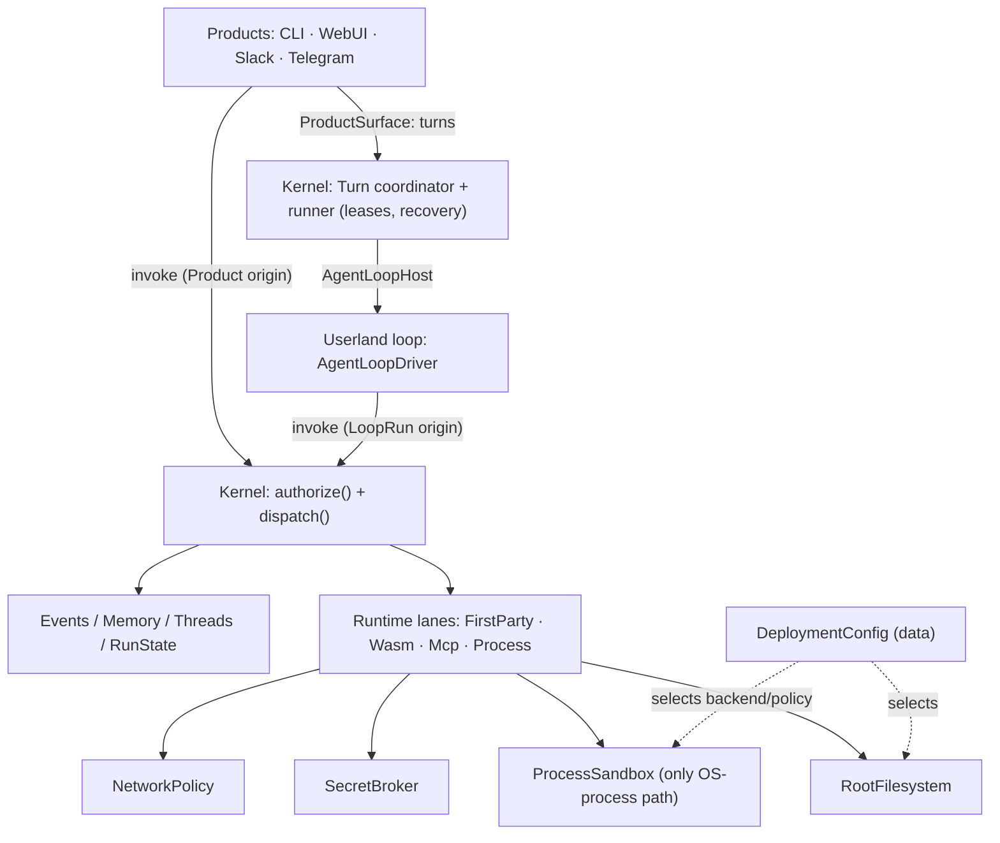

# Reborn Architecture Simplification: Fewer DTOs, Less `dyn`, No Local-Specific Structs

**Date:** 2026-07-17
**Status:** Proposal / design note (not yet a contract)
**Scope:** The capability/turn execution path and storage substrates in `crates/`

**Revision log** (section numbers are frozen identifiers — `arch-exempt`
annotations and `.claude/rules/architecture.md` cite them; additions get
`x.y.z` suffixes, existing sections are never renumbered):

- **r1** 2026-07-17 — initial proposal (PR #6175).
- **r2** 2026-07-17 — §5.2 reworked: product surface = turn lifecycle +
  `invoke`/`query` capability conduits; `InvocationOrigin` added (§5.2.1).
- **r3** 2026-07-17 — review hardening: full `CapabilityOutcome` mapping and
  five-channel resolution model (§5.3), dispatch-time gates and `Authorized`
  lifecycle settled (§5.3.1–§5.3.2), `RuntimeLane` unified on
  `Process` (§4.2/§5.9), served-predicate for `LocalOnlyToken` (§6), evidence
  reframed (§1.5), `type-placement.md` reconciliation (§4.2), batch modeled
  (§11.1), Slice 0 + URT ordering (§9).
- **r4** 2026-07-17 — PR #6208 review fixes: served predicate tightened (any
  non-loopback listener/tunnel counts, epoch-synchronized transition, §6);
  `SpawnedChildRun` correctly non-suspending (§5.3); `ProductSurface` target
  actor-bound at mint (§5.2); product-gesture consent is policy-evaluated
  evidence, not blanket approval skip (§5.2.1); `resolve`/`authorize`/`abort`
  Result-wrapped (§3/§5.3); facade count corrected to the 88-method trait
  block; `CapabilityOutcome` is ten variants; type-count restated as
  mirrors-not-names (§3/§7); Slice 0 scoped around merged #6200 (§9).
- **r5** 2026-07-17 — added §5.10 (the five routing surfaces, one table) and
  §5.11 (composition end-state: assembler module sketch, inputs, boot-fail-
  closed, definition of done). Review fixes: type total settled at ~11 across
  §3/§7/§9; §6 admission gate held through process exec (no
  admitted-but-unlaunched window).
- **r6** 2026-07-18 — dynamic-capability decision folded in: §5.2.1 reworked
  as an origin→gate **matrix** (the loop may propose admin/config
  capabilities; gate-by-default for `LoopRun`, `Ungated` allowlist starts
  empty); added §5.2.6 (meta-capabilities: gating policy is non-degradable),
  §5.2.7 (persistent approvals are scoped authority), §5.2.8 (gate outcome
  reporting to the approver), §5.2.9 (gate rendering contract — what the
  approver sees is host-separated, host-diffed, never model-summarized),
  §5.3.3 (reservation lifecycle: no-hold on pending gates, origin-scoped
  budgets, host-derived estimates, one-shot resource-gate delta,
  pending-gate quota against approval fatigue); budget/quota mutations
  joined the §5.2.6 meta-set; §10 facade ratchet and §11.7 conformance
  extended to the matrix, floor, rendering, reservation-lifecycle, and
  outcome-delivery invariants.
- **r7** 2026-07-18 — editorial pass, no semantic changes: one canonical
  vocabulary block (§3; §5.3 keeps only the acceptance contract;
  `InvocationOrigin` defined once, §5.2.1); §3 commentary compressed to
  pointers (§5.2.1/§5.3.2/§5.3.3/§11.3 own the detail); §3.1, §5.9 item 1,
  §7 row 1, and §12.4 deduplicated against the sections they restated; §6's
  fail-closed-default and mechanical-guarantee bullets rejoined the
  prevention list they belong to.
- **r8** 2026-07-19 — folded in issue #6284 (error-recoverability endgame)
  as a binding contract on the resolution channels: added §5.3.4 (the
  recoverability contract — run survives, model sees, cause+remediation
  carried, model gets a turn; `HostFailure` narrowed to genuine terminal
  invariants; per-kind remediation, model-error observation channel,
  addressable `diag_ref`), extended §11.7 with the recoverability
  conformance matrix, and tied it to §11.9's compile-time exhaustiveness;
  added §14 (implementation status as of 2026-07-19 — Slice C.1 `Invocation`
  vocab, Slice A store deletions, Slice B renames + ratchets merged; the §5.3
  five-channel `Resolution` flip in flight on `integration/reborn-flip-base`).
  No design changes to §1–§13 other than the §5.3.4 addition and the §11.7
  extension noted above; §14 and the status log are mutable, the contract
  above them is frozen.
- **r9** 2026-07-22 — status-only update for the ProductSurface facade collapse:
  descriptor-backed reads are underway and the outbound preference mutation now
  follows the API-only first-party capability + query read-back approach. Skill
  management now follows the same split: content reads are a view, document
  install/update/remove and per-skill auto-activation are first-party capability
  invocations, and the learned auto-activation master toggle is an API-only
  product capability. Extension install/remove/activate now use lifecycle
  capability invocations from the WebUI ProductSurface path; activation keeps a
  query read-back for active state and maps auth-blocked outcomes onto the
  existing extension onboarding response shape. Extension setup read now uses
  the descriptor-backed `extension_setup` ProductSurface view, and setup submit
  uses `builtin.extension_setup_submit` with the same query read-back. Zip
  import now uses the API-only `builtin.extension_import` ProductSurface
  capability with upload bytes carried as a base64 JSON field. LLM provider
  upsert/delete and active-provider selection now use API-only ProductSurface
  capabilities with `llm_config` view read-back. Automation listing now uses
  the descriptor-backed `automations` ProductSurface query while retaining the
  existing product automation facade behind the view builder. Thread listing
  now uses the descriptor-backed paginated `threads` ProductSurface query while
  retaining hidden-automation-thread filtering and notification approval
  shaping behind the view builder; probe and login starts remain explicit
  follow-ups because they need typed command result payloads.
- **r10** 2026-07-22 — implementation approach recorded for declaring
  ProductSurface APIs without adding macro machinery: keep the raw
  `ProductSurface::invoke`/`query` conduits JSON-shaped, but declare product
  APIs as typed `ProductView<Params, Output>` and `ProductCapabilityDescriptor`
  constants. The descriptor helpers own view query construction, payload decode,
  serializable command input conversion, and capability-id parsing. This keeps
  capability mappings lightweight for simple API-only commands, avoids one
  bespoke struct or macro arm per route, and still leaves every product action
  auditable as an explicit descriptor declaration. Duplicate skill write
  methods were removed from the composition WebUI skill facade after those
  writes moved to first-party capabilities; the facade now serves only skill
  reads used by ProductSurface views.
- **r11** 2026-07-22 — added §5.2.10, the Urbit/terminal takeaway: channels are
  terminal-like endpoints that start or resume a durable causal path into the
  kernel; the target architecture makes the kernel, not adapters, own routing
  truth from ingress through turn/invocation/gate/outcome/delivery. §5.1/§5.8/
  §5.10 vocabulary tightened around product terminals vs external channel
  adapters. §14 refreshed against current `origin/main` after #6386 / #6396 /
  #6430 / #6432 / #6116 / #6438 / #6447.
- **r12** 2026-07-23 — status-only update for channel ingress: extension/channel
  ingress now admits verified normalized messages directly through
  `ProductSurface` as the host-only `channel.admit_inbound` operation instead
  of using a separate product workflow facade or constructing
  `ProductInboundPayload` directly. `ProductInboundEnvelope` now carries `source_channel`, so WebUI,
  CLI, and external channels converge on one source-channel stamp instead of a
  separate channel-specific envelope. Slack gate/auth interaction classifiers
  now return the channel-classification DTO consumed by ProductSurface
  admission.
- **r13** 2026-07-23 — status-only correction for the unified extension
  lifecycle. The public product surface no longer exposes a distinct extension
  activation action. Install establishes per-user membership; the manifest
  auth recipe and durable credential/pairing readiness derive either
  `setup_needed` or `active`; remove deletes that membership. This supersedes
  the activation-specific status wording in r9 and refreshes mutable §14.
  ingress now admits verified normalized messages through
  `host_api::ChannelInboundProductSurface::admit_channel_inbound` instead of a
  generic ProductSurface command escape hatch or direct
  `ProductInboundPayload` construction. `ProductInboundEnvelope` now carries
  `source_channel`, so WebUI, CLI, and external channels converge on one
  source-channel stamp instead of a separate channel-specific envelope. Slack
  gate/auth interaction classifiers now return the channel-classification DTO
  consumed by product admission.
- **r13** 2026-07-23 — status-only update for the product-surface cleanup stack:
  product terminals now share `host_api::ProductSurfaceCaller`; the WebUI-only
  caller and inbound validation wrappers were removed in favor of
  `ProductSurfaceError` / `ProductSurfaceValidationCode`; `execute_command`,
  `ProductSurfaceOperation`, and the product-operation descriptor/request/
  response layer were deleted. WebUI handlers temporarily called typed
  `ProductSurface` methods directly while the remaining result-bearing methods
  awaited descriptor or turn-lifecycle classification.
- **r14** 2026-07-23 — product consumers now share the neutral
  `host_api::ProductSurface` contract: `invoke`, `query`, and `stream_events`.
  The product-local `ProductSurface` trait is reduced to the two subscription
  extension methods that have not moved to host API yet. Former result-bearing
  WebUI/product methods now route through typed `ProductSurfaceCommandDescriptor`
  constants or generic capability descriptors; `ProductCapabilityInput` and the
  transient `dyn ProductSurface` compatibility methods were deleted.
- **r15** 2026-07-23 — implementation status update: the product-local
  subscription extension was deleted, caller authority is now bound through
  `host_api::BoundProductSurface`, and WebUI-specific ProductSurface DTO names
  were renamed to the neutral `Product*` vocabulary. File/attachment command
  bytes remain JSON/base64 for now.

This note proposes a **fundamental** simplification of the Reborn host/runtime
internals. The goal is to remove three recurring costs without weakening any
security invariant:

1. **DTO proliferation** — a single tool call is re-wrapped through ~14
   near-identical request/result structs.
2. **`dyn` proliferation** — ~6 hot-path trait objects, several with exactly one
   production implementation (the rest kept for genuine polymorphism).
3. **Local-specific structs** — a parallel `InMemory*` / `Filesystem*` store
   tree per domain, plus deployment-mode struct families that risk local-only
   shortcuts leaking into production.

The thesis: these are three symptoms of **one** decision — *treating internal crate
seams as if they were trust boundaries.* Reborn has a few real trust boundaries —
the untrusted agent loop, untrusted runtime-lane execution (WASM/script/MCP,
containers, external services), and untrusted runtime-supplied data (egress
responses, worker output) — all mediated by host filesystem/network/secrets/sandbox
surfaces, and **all preserved here** (§2). Between them sits a *trusted* mediation
chain that was nonetheless split into ~6 crates, each with its own DTO, its own
`dyn` trait, and its own backend struct family. Collapse those trusted internals
onto a shared vocabulary and concrete wiring; keep every trust boundary intact.

---

## 1. Evidence: where the complexity and the bugs actually are

This proposal is grounded in a code audit plus a cross-reference against the
last ~30 days of merged PRs and open issues.

### 1.1 The capability call re-wraps one payload ~14 times

A single `bash`/`wasm`/first-party tool call is translated through **~8 request
shapes and ~6 result shapes across 6 crate boundaries and 6+ `dyn` seams**. This
is not uniform waste, and it is worth being precise about *why*, because it
determines what is reducible. The field-level diff shows the pipeline holds only
**three genuinely distinct states**; the extra types are duplication forced by the
crate graph plus dead fields that ride along.

Verified request types on the down-path, with what each hop actually adds or drops:

| Hop | Type (crate) | Fields | Change vs. previous |
| --- | --- | --- | --- |
| 1 | `LoopRequest` (`ironclaw_turns`) | `activity_id, surface_version, capability_id, input_ref, approval_resume?, auth_resume?` | the loop's vocabulary — input by **ref**, resume tokens, pre-trust |
| 2 | `RuntimeCapabilityRequest` (`ironclaw_host_runtime`) | `context, capability_id, estimate, input, idempotency_key?, trust_decision` | deref `input_ref`→raw `input`; +`estimate`, +`context`; +2 **dead** fields |
| 3 | `CapabilityInvocationRequest` (`ironclaw_capabilities`) | `context, capability_id, estimate, input, trust_decision` | **identical to hop 2 minus `idempotency_key`** — zero new info |
| 4 | `CapabilityDispatchRequest` (`ironclaw_host_api`) | `capability_id, scope, authenticated_actor_user_id?, estimate, mounts?, resource_reservation?, input` | decompose `context`→`scope`+`actor`; **drop `trust_decision`**; **+`mounts`, +`resource_reservation`** (authorization outputs) |
| 5 | `RuntimeLaneRequest<'a, F, G>` (`ironclaw_dispatcher`) | hop 4 + `package, descriptor, filesystem&, governor&, runtime_policy` | + resolved substrate handles for the lane |
| — | lane requests (`ScriptExecutionRequest` / `WitToolRequest` / `FirstPartyCapabilityRequest`) | per-lane shapes | final re-wrap into the lane's own type |

Definitions (verified against HEAD, 2026-07-17; cite the symbol — line numbers drift):
`LoopRequest` `ironclaw_turns/src/run_profile/host.rs:1722`, `RuntimeCapabilityRequest`
`ironclaw_host_runtime/src/lib.rs:322`, `CapabilityInvocationRequest`
`ironclaw_capabilities/src/requests.rs:8`, `CapabilityDispatchRequest`
`ironclaw_host_api/src/dispatch.rs:22`, `RuntimeLaneRequest` `ironclaw_dispatcher/src/lib.rs:56`.
The `dyn` impl counts (§1.3) and the 30-day window (`merged:>=2026-06-17`, §1.5) were derived
the same way.

Four mechanisms produce this, each visible in the code above:

1. **The dependency DAG forbids type sharing, so identical shapes are
   re-declared.** Hops 2 and 3 are the *same struct* (`context, capability_id,
   estimate, input, trust_decision`), differing by one field. They are distinct
   types only because `host_runtime` (upper) and `capabilities` (lower) are
   separate crates and the boundary rule forbids either importing the other's
   request type. The one shareable place — `host_api`, the bottom — is used for
   hop 4 but not the mid-flight shapes, so the mid-flight shape is declared twice.
   This is the concrete form of "every crate boundary treated as a trust
   boundary."

2. **Three real states are modeled as five look-alike structs.** The pipeline has
   exactly three meaningful states: *loop-expressed* (hop 1: ref-based, resume
   tokens, pre-trust), *authorized* (hop 4: raw input + `scope` + `mounts` +
   `resource_reservation`, the outputs of authorization), and
   *resolved-for-a-lane* (hop 5: + substrate handles). Those transitions are
   genuine. Because each state is modeled as "a request struct that looks like the
   others ± a field," the three real states blur into five, and hops 2–3 fall out
   as duplication *between* transitions rather than being transitions themselves.

3. **Fields accrete but never retire — dead transitional cruft rides along.**
   `trust_decision` is copied through hops 2–3 and dropped at hop 4; its own doc
   comment states `DefaultHostRuntime` **ignores it entirely** ("Legacy... kept
   for transitional request-shape compatibility... Callers must not rely on this
   field"). `idempotency_key` at hop 2 is "advisory... does not yet implement...
   kept so shape doesn't break when dedup is wired through downstream." Two of the
   fields every layer copies do nothing — one dead-past, one dead-future — and each
   new field multiplies across every type that mirrors it.

4. **A context bundle is composed, then decomposed.** Hops 2–3 carry
   `context: ExecutionContext` as one field; hop 4 explodes it into loose `scope` +
   `authenticated_actor_user_id`. Bundling, passing, then unpacking is two more
   struct shapes for the same information.

`CapabilityDispatchRequest` already living in `ironclaw_host_api` is the key
signal: the canonical shape *can* live at the bottom. And
`RuntimeLaneRequest<'a, F, G>` — generic over closures with a lifetime — is a
complexity tell: the seam is parameterized for flexibility production wiring does
not exercise.

**Net:** of the five request types, hops 2 and 3 carry no new information (they
exist for Mechanism 1 and are padded by Mechanism 3); the other three are genuine
states that should be explicit and named. "~14 re-wraps" is really **~3 real
transitions + ~2 pure duplications + dead fields copied at every hop** — so ~40%
is pure duplication that a shared bottom-crate vocabulary removes outright, and
the rest becomes legible once the three states are named.

### 1.2 Authority is smeared across four layers, not centralized

The policy that actually matters (trust classification, credential pre-flight,
approval, obligations, resource reservation, run-state) is **not** in one
gateway. It is interleaved across four hops:

- `ironclaw_loop_host` — resume-mode validation, dispatch reservation, idempotency key;
- `ironclaw_host_runtime` — runtime-policy, trust eval, credential pre-flight, persistent-approval policy;
- `ironclaw_capabilities` — authorize, prepare/complete/abort obligations, run-state, approval blocking;
- `ironclaw_dispatcher` — reservation reconcile/release, registry/runtime-kind routing.

A change to ordering (e.g. credential-before-approval) can only be reasoned
about by holding all four crates in one's head. A mistake in the return-mapping
is silent: a recoverable `Ok(CapabilityOutcome::Failed)` and a run-terminating
`Err(HostRuntimeError)` are structurally identical — a footgun the loop-capability
contract docs record shipping three times.

### 1.3 `dyn` seams that exist for test doubles, not runtime variation

Verified production vs. test-double implementation counts, and how each seam is
stored:

| Seam | Prod impls | Test doubles | Stored as | Verdict |
| --- | --- | --- | --- | --- |
| `LoopCapabilityPort` (loop ↔ host) | 1 terminal (`HostRuntimeLoopCapabilityPort`) + decorators (hooks, surface filters, logging) | several | `Arc<dyn>` decorator chain | **keep** — the trust membrane; decoration is genuine composition |
| `HostRuntime` | 1 (`DefaultHostRuntime`) | 6 (`Recording*`, `Queued*`, `dummy_runtime`) | `Arc<dyn HostRuntime>` | collapse |
| `CapabilityDispatcher` | 1 (`RuntimeDispatcher<F, G>`) | 2 (`Recording*`, `Cancelling*`) | `Arc<dyn CapabilityDispatcher>` | collapse |
| `RuntimeAdapter<F, G>` | 5 (`Script`, `Mcp`, `FirstParty`, `Wasm`, + a `ServiceResolved` wrapper) | — | trait object behind the dispatcher | closed set → enum |
| `LlmProvider` | ~12 providers + decorators (`CircuitBreaker`, `Truncating`, `Swappable`, …); 32 impls total | — | `Arc<dyn>` | **keep** — genuine polymorphism |

Note: `CapabilityHost` is **not** a trait — it is a concrete generic struct
`CapabilityHost<'a, D>`, instantiated as `CapabilityHost<'a, dyn CapabilityDispatcher>`.
So the `dyn` on that path is the dispatcher it holds, not the host.

Three mechanisms produce the avoidable `dyn`:

1. **The trait exists to inject test doubles, not to vary production.**
   `HostRuntime` has one production impl and six test doubles; `CapabilityDispatcher`
   one and two. The trait + `Arc<dyn>` is paid on every production call so tests can
   swap in a `Recording*`/`Queued*`/`Cancelling*` fake. That is a real need met in an
   expensive way — the whole hot path takes vtable dispatch and every layer maintains
   a trait mirroring the concrete API, all to serve a test seam that a generic
   parameter or a single boundary fake would give more cheaply.

2. **Speculative replaceability.** "Replaceable everything" was applied to internal
   mediators, not only to the seams that actually vary. The single-prod-impl trait
   objects on the hot path have never been replaced in production. The second
   implementation is what should motivate re-introducing a trait.

3. **Generic *and* `dyn` — double indirection.** `RuntimeDispatcher<F, G>` and
   `RuntimeAdapter<F, G>` are generic over `RootFilesystem`/`ResourceGovernor` *and*
   used as trait objects (`CapabilityHost<'a, dyn CapabilityDispatcher>` holds a
   generic-turned-`dyn`). The path pays monomorphization complexity and vtable
   dispatch at once — a tell that the design never settled on static or dynamic.

Additionally, `RuntimeAdapter`'s impls are a **closed, enumerable set** — the four
runtime lanes plus a resolver wrapper — modeled as an open trait. New lanes are rare
and security-sensitive; new *tools* are data behind the existing lanes. An open trait
buys extensibility exactly where it is not needed.

### 1.4 A full store reimplementation per backend, per domain (the "local-specific structs")

Backend variation is modeled as **type** variation, not parameterization: each
backend is a separate struct that re-implements the whole domain trait by hand. The
turn store alone is two full implementations of the same semantics:

| Domain | In-memory impl | Durable impl | Reimplemented logic |
| --- | --- | --- | --- |
| turns | `InMemoryTurnStateStore` (`memory/mod.rs`, ~4,260 LOC) | `TurnStateRowStore` (~1,710 LOC) | lease, active-lock, checkpoint, idempotency, events |
| processes | `InMemoryProcessStore` + `InMemoryProcessResultStore` (~230 LOC) | `ProcessStore` + `ProcessResultStore` (~920 LOC) | process lifecycle + result store |
| approvals | `InMemory{AutoApprove, PersistentApprovalPolicy, CapabilityPermissionOverride}Store` | matching `Filesystem*` (×3) | three separate approval stores |
| authorization | `InMemoryCapabilityLeaseStore` | `CapabilityLeaseStore` | lease store |
| run_state | `InMemory{RunState, ApprovalRequest}Store` | matching `Filesystem*` (×2) | two run-state stores |

Every `InMemory*Store` is a local/test-only parallel implementation of logic that
also exists in the durable impl; a change to turn semantics (a new transition, a
lock rule) must be written **twice, in lock-step**, and production-facing domains add
libSQL + Postgres on top (2–4× per domain). The `InMemory*` structs are the literal
"structs specific to local."

Two mechanisms:

1. **Storage mechanism and domain logic are not separated.** The turn store's
   `turn_state_row_store/row_store/` layer (journal / delta / row materialization) is a
   *partial* gesture at that split, but it is turns-specific and does not unify
   in-memory vs filesystem vs the other domains. Without a shared backend seam, "what
   the turn state *is*" and "how bytes are persisted" are welded together, so each
   backend re-derives the former just to change the latter.

2. **The split is multiplied by the two work-unit lifecycles.**
   `ironclaw_turns`/`ironclaw_runner` (the leased `TurnRun`) and `ironclaw_processes`
   (the OS-subprocess) are **independent reimplementations** of the same six machinery
   layers — status enum, store trait, in-memory + filesystem stores, cancellation,
   eventing decorator, resource accounting — unified by no shared abstraction, and they
   diverge on recovery (turns recover expired leases; processes have an unimplemented
   reconciler). So the per-backend duplication is itself duplicated across two parallel
   lifecycles.

### 1.5 The last month agrees

- **≥510 merged PRs; 188 (37%) are `fix(...)`.** No baseline exists for what a
  healthy fix ratio is at this repo's size, so read the *clustering*, not the
  rate: backend fixes concentrate on exactly these seams — channel/identity
  (22), turn/lease (16), capability/gate (12) — though note that is ~50 of 188;
  most fixes are elsewhere.
- A **daily automated "failure taxonomy" issue** and a `bug_bash_*` label stream
  exist — institutionalized after-the-fact bug harvesting.
- Review-iteration churn concentrates on the gate/hold/turn/auth seams (single
  "fix" PRs with dozens of review cycles, tens of files, thousands of lines).
- Open issues already target this surface: **#6168** ("Shrink the
  `ironclaw_reborn_composition` god-crate 24% → ~10%") and **#6144** item 1
  (a resource budget that is *defined as a field but never enforced at the call
  site* — the strongest form of "invariant lives at runtime, not in a type").
  Also directly on the capability path: **#6137** ("mixed-batch gate resume never
  redispatches the non-first gated call") and **#6138** (harness can't express a
  compound denied-gate + HTTP-egress-error scenario).

**What this evidence does and does not show.** It shows the complexity is real
and where it sits. It does **not** show that the DTO/`dyn` collapse would have
prevented the cited bugs, and the claim should not be read that way: #6170 is a
fail-open policy default (fixed by §6's structure, not by type consolidation);
#6137 is batch semantics (fixed by *modeling batch in the state machine*, §11.1,
which §3's single-invocation types alone do not do); #6144 is an unenforced
budget (fixed only because §3 names `authorize()` as the enforcement site for
`estimate`). The honest causal claim is narrower and still sufficient: the bugs
live on semantic seams — gates, leases, identity, resume — and the refactor
gives each decision **a single implementation instead of four interleaved
copies**: one `authorize()` for pre-flight policy, one gate vocabulary, one
batch fold. The *seams* themselves remain plural — resolve, authorize,
dispatch-time auth discovery, abort, batch resume (§5.3.1–§5.3.2) — what
becomes singular is the implementation of each, plus typed channels in which
misclassification is visible. Fewer duplicated decision sites, not fewer bug
classes.

---

## 2. Root cause: crate seams mistaken for trust boundaries

Reborn has a few real **trust boundaries** — places where untrusted code or data meets
trusted host authority — and many **crate seams** that are only internal factoring. The
two must not be confused: trust boundaries are the security model and must be preserved;
crate seams are where the DTO/`dyn` tax accumulates, and are what this document collapses.

**The trust boundaries — preserve all of them:**

- **The agent loop.** Untrusted agent behavior; it may only *ask* for effects through host
  ports, and must not name secrets, the dispatcher, or the network.
- **Runtime-lane execution.** WASM, script/process, MCP, and any container or external
  service running extension/tool code is untrusted. It receives *mediated*
  filesystem/network/secrets/sandbox handles — never ambient authority — and cannot bypass
  the host services.
- **Runtime-supplied data.** Everything coming *back* — egress responses, worker output,
  MCP/external results — is untrusted input: the host validates it, binds it to the
  authorized invocation, enforces limits, and redacts it before it re-enters trusted flow
  or reaches the model. Worker metadata cannot grant authority or declare itself safe.

These are the standing invariants in `.claude/rules/safety-and-sandbox.md` ("mediation is
the boundary"); nothing below relaxes them.

**The crate seams — collapse them.** Between the loop boundary and the lane boundary sits
the *trusted* mediation chain (`loop_host → host_runtime → capabilities → dispatcher`).
That region is entirely trusted host code, yet the implementation split it into ~6 crates
and gave each:

- its **own request DTO**, because the boundary rule (`ironclaw_architecture`
  forbids importing "upward") means a layer that wants to reference a type must
  either depend on the crate that owns it or re-declare it — and re-declaring
  wins each time a layer needs one extra field;
- its **own `dyn` trait**, because "replaceable everything" was applied to every
  seam rather than only the ones with more than one implementation;
- its **own backend struct family**, because "composition mode changes which
  backends are legal" was expressed as parallel types instead of one backend
  parameter.

None of those six internal boundaries is a trust boundary.

### 2.1 The operating-system lens: mechanism vs policy

State it the way an OS does. A kernel provides **mechanism** — a small, stable set
of primitives (files, processes, address spaces, syscalls) — and is deliberately
*slow-moving*: adding an application does not change the kernel. **Policy** — which
app runs, what it may touch, how much it gets — lives outside, as configuration and
userland.

Reborn's kernel boundary must obey the same rule: **adding a feature, or a
deployment target, must not change the kernel.** Everything above collapses to one
violation of it — *policy encoded as kernel types*:

- **Deployment mode is a kernel enum.** `RuntimeProfile::{LocalDev, HostedDev,
  EnterpriseDev}` and `DeploymentMode` live in `ironclaw_host_api` — the vocabulary
  crate — and code across the host branches on them. Mode is the definition of
  policy; putting it in the kernel forces every mode to grow its own type family
  (the ~66-identifier `LocalDev*` shadow runtime, §4.4).
- **Storage medium is a domain type.** Each domain hand-writes an in-memory store
  *and* a durable store (§1.4); the medium — a deployment choice — is baked into the
  type instead of injected. The kernel should name *"a store"*; the config should
  pick the medium (§4.3).

So the simplification is one idea applied consistently: **the kernel is mechanism —
a small, frozen authority vocabulary plus a few real seams; everything that varies
by feature or deployment is policy, resolved to data at the composition edge.** The
`Invocation` / `Authorized` / `Outcome` triple below is what feature-agnostic
mechanism looks like; §4.3–§4.5 remove the policy that leaked into types.

---

## 3. Proposed model: one payload, authority as a fold, one seam

Separate the **data plane** (the payload, which never changes shape) from the
**control plane** (authority decisions, which accrete in a side value).

```rust
// ── ironclaw_host_api (the bottom crate everyone already depends on) ──
// The loop's pre-trust request — the one genuine loop→host transition (§1.1):
struct LoopRequest { activity_id: ActivityId, capability: CapabilityId, input_ref: InputRef, resume: Option<ResumeToken> }
// The host-side payload, resolved at the membrane (input deref'd, actor+scope+origin bound):
struct Invocation  { activity_id: ActivityId, capability: CapabilityId, input: Json, scope: Scope, actor: ActorId, origin: InvocationOrigin, estimate: Estimate }
struct Authorized  { /* Invocation + lane + trust/approval/reservation/mounts — SEALED: private, built only by authorize() */ }
enum   Blocked     { Approval(GateRef), Auth(GateRef), Resource(GateRef) }  // re-entrant gates
enum   Suspension  { Process(ProcessRef), DependentRun(GateRef), ExternalTool(GateRef) }  // parked; work continues or control returns to the client
enum   HostFailure { Transient(ErrRef), Permanent(ErrRef), Uncertain(ErrRef) } // infra/storage/obligation-cleanup; Uncertain = crash between dispatch start and outcome record
struct Outcome     { refs: OutcomeRefs, verdict: ToolVerdict, summary: SafeSummary } // tool success OR recoverable failure — typed, never summary-sniffed
enum   Resolution  { Done(Outcome), Denied(DenyRef), Blocked(Blocked), Suspended(Suspension) }  // the composed invoke's answer; AuthorizeResult::Denied maps into it

// ── the host kernel (trusted, below the loop seam) ──
fn resolve  (req: LoopRequest, scope: &Scope) -> Result<Invocation, HostFailure>; // membrane: deref input (a ref can be stale/consumed), bind actor+scope+origin
fn authorize(inv: Invocation) -> Result<AuthorizeResult, HostFailure>;    // ALL pre-flightable policy, one place: binds actor/scope/origin, resolves the lane, reserves estimate; reservation/obligation writes can themselves fail
enum AuthorizeResult { Authorized(Authorized), Denied(DenyRef), Blocked(Blocked) }
fn dispatch (auth: Authorized, cancel: &CancelSignal) -> Result<Resolution, HostFailure>; // CONSUMES auth (single-use); lane sealed inside; may surface a dispatch-time Auth gate (§5.3.1)
fn abort    (auth: Authorized) -> Result<(), HostFailure>;                // not-dispatched path: unwind reservation/obligations explicitly — never in Drop; a failed abort is swept by lease-expiry recovery (§5.3.2)
```

- The loop expresses a `LoopRequest` (input by **ref**, resume tokens, pre-trust); the host
  `resolve`s it to `Invocation` at the membrane — the one genuine loop→host transition
  (§1.1). Below that, `RuntimeCapabilityRequest`, `CapabilityInvocationRequest`,
  `CapabilityDispatchRequest`, and `RuntimeLaneRequest` disappear — they were `Invocation`
  plus fields now carried inside `Authorized`.
- Because `host_api` is the bottom crate, putting the vocabulary there *satisfies* the
  boundary rule (Golden Boundary #1: `host_api` stays vocabulary-only) — finishing a move
  `CapabilityDispatchRequest` already half-made.
- **`Authorized` is sealed, single-use, lane-bound, and deadline-bounded.** Private
  fields, built only by `authorize()` (the `LoopExitValidationPolicy` witness pattern);
  it carries the exact `Invocation` it authorized **and the `RuntimeLane` resolved from
  the descriptor** — no forging, no repairing to a different invocation, no routing to
  a lane the descriptor doesn't name (the host-only `Process` lane becomes structural,
  §5.9). `dispatch` consumes it; the not-dispatched path calls `abort()` — explicitly,
  never via `Drop`. Full lifecycle contract: §5.3.2.
- **Five distinct resolution channels — no `Ok(Failed)` vs `Err` ambiguity (§1.2).**
  `Outcome` (tool success or recoverable failure, typed verdict — never summary-string
  inspection); `Denied` (terminal policy, model-visible, not re-entrant); `Blocked`
  (re-entrant gates); `Suspension` (parked work, §11.1); `HostFailure` (infra;
  `Uncertain` = crash between dispatch start and outcome record). The full mapping from
  today's ten-variant `CapabilityOutcome` is the §5.3 acceptance table.
- **`origin` is sealed at the membrane, like `actor` and `scope`.** The loop is not the
  only caller of this pipeline: products invoke capabilities directly (settings mutations,
  admin actions — `ProductSurface::invoke`, §5.2) and so does automation. Each entry point
  can mint only its own `InvocationOrigin` variant (§5.2.1), and `authorize()` folds origin
  into policy — the origin→gate matrix (§5.2.1): per-origin gate requirements and approval
  semantics, gate-by-default for model-initiated calls.
- **`activity_id` is the invocation's idempotency identity** — what §1.1's "dead-future
  `idempotency_key`" *becomes*, unified rather than deleted. Authorize decision recorded
  before dispatch, resolution after; a retry of a resolved `activity_id` replays the
  record and never re-runs the side effect; a crash between the two records maps to
  `HostFailure::Uncertain` — at-most-once, never silent re-execution. Full contract:
  §11.3.
- **`estimate` is consumed by `authorize()` at reservation** — the enforcement site
  #6144 found missing ("defined as a field but never enforced at the call site"); the
  field cannot ride along unenforced because the only constructor of `Authorized` is the
  function that reserves against it. Host-derived, never model-supplied; budgets are
  origin-scoped — reservation lifecycle decisions in §5.3.3.

**Type count, honestly stated: roughly flat in names, zero in mirrors.**
Like-for-like: 3 host-side request states (`LoopRequest`, `Invocation`,
`Authorized`) + the same ~3 per-lane requests (they **must survive** — the
lane boundary is a trust boundary, §2) + 5 channel types = **~11 vs. ~14**,
the one total used everywhere in this doc (§7, §9). The raw count barely
moves because the result side deliberately *gains* vocabulary (one overloaded
ten-variant enum → five channels). The claim is not "fewer names" — it is
**zero mirrors**: requests drop from 5 near-identical shapes to 3 distinct
states, dead fields vanish, and no two surviving types differ by ±a field.
Count mirrors, not names.

### 3.1 The three real states, named

This directly resolves the four mechanisms in §1.1. The five request types
collapse onto the three states the field diff identified; the two duplicates and
the dead fields disappear with them:

| Real state | Carried as | Replaces |
| --- | --- | --- |
| loop-expressed (pre-trust) | `LoopRequest` (input by ref, resume tokens, `activity_id`) | the old loop invocation mirror |
| authorized | `Authorized` (the resolved `Invocation` bound to trust/approval/reservation/mounts) | `RuntimeCapabilityRequest`, `CapabilityInvocationRequest`, `CapabilityDispatchRequest` |
| resolved-for-a-lane | `Authorized` + resolved handles (package, descriptor, filesystem, governor) | `RuntimeLaneRequest` |

Mechanism 1 (DAG re-declaration) dies because the one authorized shape lives in
`host_api` and both `host_runtime` and `capabilities` reference it. Mechanism 3's dead
fields die structurally: trust is *computed inside* `authorize()` and lands in
`Authorized`, never carried as a request field, and `idempotency_key` unifies with
`activity_id` (§11.3) rather than being deleted. Mechanisms 2 and 4 dissolve together:
the three transitions are named types, and `Authorized` carries `scope`/`actor` in one
shape end to end — nothing is composed and then decomposed.

---

## 4. The three moves, mapped to the three costs

### 4.1 Less DTO — `authorize`/`dispatch` over one payload

Define `Invocation` / `Authorized` / `Outcome` in `ironclaw_host_api`. Every layer
references those instead of re-declaring; extra per-layer context is threaded by
reference (`&Authorized`), not by re-wrapping the payload. The mirror-struct tax
goes to zero because nothing mirrors.

### 4.2 Less `dyn` — a trait earns a trait object only if it has ≥2 production impls or is the trust boundary

- **Keep** `LoopCapabilityPort` (the loop's trust membrane — one of several trust
  boundaries, §2) and `LlmProvider` (genuine polymorphism).
- **Replace** `RuntimeAdapter`'s `dyn` with a closed `enum RuntimeLane`
  (`FirstParty | Wasm | Mcp | Process` — the **one** definition, shared with §5.9;
  today's script/process adapter executes *on* the `Process` lane, and the name
  states the trust boundary the way §4.4's `HostProcessPort` rename does). Adding a
  lane becomes a compile error until every `match` handles it. WASM extensions stay
  open — they are *data* behind the `Wasm` lane, not new lanes — so a closed lane
  set costs no real extensibility.
- **Delete** the `HostRuntime` and `CapabilityDispatcher` traits; make them
  concrete (or a single generic parameter resolved once at composition), and get
  the test seams they currently serve (§1.3, mechanism 1) from generics or one
  boundary fake instead of a production `Arc<dyn>`. `CapabilityHost` is **already**
  a concrete struct — collapsing `CapabilityDispatcher` to a concrete type removes
  the `dyn` it holds today (`CapabilityHost<'a, dyn CapabilityDispatcher>`), and its
  role folds into the `authorize` + `dispatch` pair.

**Relationship to `.claude/rules/type-placement.md` (must be reconciled, not
ignored).** That rule's 2026-07 audit judged 97.7% of the workspace's traits
justified, and its justification list includes **test seams** (#3) — the very
reason `HostRuntime`/`CapabilityDispatcher` exist. This section deliberately
*narrows* that justification **for hot-path mediator traits only**: on the
capability path, a test seam is served by a generic parameter or one boundary
fake, not by a production `Arc<dyn>` that every layer mirrors. Dependency
inversion (#2) is untouched — `LoopCapabilityPort` stays for exactly that
reason — as is genuine polymorphism (#1, `LlmProvider`). The rule also states
that contract *surface* is reduced "only by interface design"; §3 **is** that
interface design, so the two documents are consistent in intent. The rule must
be amended in the same PR that lands Slice C (§9) — a checked-in rule and this
doc disagreeing silently would leave reviewers enforcing both.

### 4.3 Delete every in-memory store; the storage seam already exists

The realization that reshapes this move: **the single storage seam is already in
the tree — it is `RootFilesystem`** (`ironclaw_filesystem`). It already has four
production-grade backends — `InMemoryBackend`, on-disk (`LocalFilesystem`),
`LibSqlRootFilesystem`, `PostgresRootFilesystem` — and the durable stores are
**already generic over it**: `TurnStateRowStore<F>`,
`ProcessStore<F>`, `CapabilityLeaseStore<F>`,
`RunStateStore<F>`, `AutoApproveSettingStore<F>`, and so on. The
`RowBackend` I earlier proposed inventing already exists and is already wired.

So the move is subtractive, not additive:

1. **Delete every hand-written `InMemory*Store`.** Tests instantiate the *same*
   store the deployment runs — `TurnStateRowStore<InMemoryBackend>` — so
   "in-memory" stops being a store and becomes a **filesystem backend**
   (`InMemoryBackend`, which already implements `RootFilesystem`). One store
   implementation per domain, exercised in tests over the in-memory backend and in
   production over libSQL/Postgres. The ~4,260-LOC `InMemoryTurnStateStore` becomes
   deletable once `TurnStateRowStore<InMemoryBackend>` covers its cases.

2. **Backend choice is deployment config, not a type.** Which `RootFilesystem`
   impl backs a run is one value in a `DeploymentConfig` fed to a single
   `build_runtime(config)`; the runtime holds it as `Arc<dyn RootFilesystem>` (or a
   concrete `F` fixed at `build_runtime`) — the existing `CompositeRootFilesystem` /
   backend selection already does exactly this, so nothing new is invented and the
   `RowBackend` trait an earlier draft floated is unnecessary. Deleting the
   `InMemory*Store`s has **no persistence-compatibility impact**: they are
   in-memory/test-only, and the durable libSQL/Postgres backends — with their own
   transaction/locking semantics, which `RootFilesystem` already encapsulates — are
   untouched. "Local may reduce authority, never increase it" is a policy value, not a
   `Local*` code fork (§4.4).

Why the in-memory stores exist today: they predate the generic
`Filesystem*Store<F>` and were kept as the fast reference/test path. Now that a
first-class `InMemoryBackend: RootFilesystem` exists, they are redundant — a whole
second implementation per domain, kept alive only for tests that a memory-backed
filesystem serves for free.

Three costs of the deletion, owned here rather than discovered later:

1. **Inventory before delete.** The turn store's in-memory impl (~4,260 LOC) is
   2.5× the filesystem one (~1,710 LOC); that delta is the entire risk of the move
   and must be *inventoried*, not assumed redundant. Slice A's per-domain step is
   therefore: enumerate what the in-memory impl covers that the filesystem impl
   does not (semantics, test hooks, or dead weight — each named), reconcile, then
   delete. A deletion PR without the inventory is not Slice A done correctly.
2. **The independent oracle is lost.** Today the in-memory and durable stores are
   two independent implementations of the same semantics, so §11.5's parity suite
   is a genuine cross-check. After consolidation there is one implementation run
   over four backends — a bug in the shared store logic passes "parity" on every
   backend by construction. The replacement oracle is §11.4's reference model,
   which is why the property-test infrastructure is **Slice 0**, a prerequisite
   of Slice A (§9), not a follow-up.
3. **Test-suite latency is a budget, not a hope.** Tests move from a `HashMap`
   store to journal/delta/row materialization over an in-memory filesystem.
   Measure the suite before/after the first domain migrates; a significant
   regression is a signal to optimize the shared store's in-memory path, not a
   cost to silently absorb.

Open follow-on: consider a shared "leased recoverable work-unit" abstraction over
`TurnRun` and `ironclaw_processes` (§1.4, mechanism 2), or explicitly document why
the two lifecycles stay separate.

### 4.4 Eliminate `Local*`: deployment mode is policy, not a kernel type

**Local-dev is a policy, so it must be a policy *config* — a value — not an
implementation with its own structs and code.** That is the whole rule. Today the
tree has ~66 `LocalDev*` identifiers across **42 files in
`ironclaw_reborn_composition`** — a whole shadow local-dev *runtime*
(`LocalDevApprovalGatePolicy`, `LocalDevCapabilityLeaseStore`,
`LocalDevAutoApproveSettingStore`, `LocalDevMountProfile`, `LocalDevNetworkProfile`,
`LocalDevOutboundStores`, `LocalDevLoopCapabilityPortFactory`,
`LocalDevConstraintSource`, …). All of it collapses to a single config literal that
selects the *same* substrates every deployment uses:

```rust
// The entirety of "local dev" — data, not types. No LocalDev* structs, no code path.
const LOCAL_DEV: DeploymentConfig = DeploymentConfig {
    filesystem: Backend::InMemory,                 // or Backend::Disk
    approval:   ApprovalPolicy::AutoApproveEligible, // wider than hosted — a value
    network:    NetworkPolicy::AllowAll,           // vs Allowlist(..) in hosted
    process:    ProcessPolicy::HostUnsandboxed(LocalOnly), // vs Sandboxed; gated by a local-only token a served boot can't mint (§6)
    owner_seed: Some(OwnerSeed::EnvToken),          // was the local_trigger_access module
};
```

`build_runtime(LOCAL_DEV)` wires the ordinary `TurnStateRowStore<InMemoryBackend>`,
the ordinary approval/capability/lease substrates, and the ordinary ports — with
these values. The same is true of hosted and enterprise: each is a `DeploymentConfig`
constant, and the difference between them is data a reviewer can read in one place,
not a struct family spread across 42 files. (An audit of what the `LocalDev*` code
*actually does* — §4.4.1 — confirms this holds, with the refinement that a little of
it is shared *behavior* the config gates rather than pure data.)

The `LocalDev*` identifiers fall in three buckets:

**Bucket 1 — deployment-mode-as-type leaks (delete).** They exist *only* because
`RuntimeProfile::{LocalDev, HostedDev, EnterpriseDev}` / `DeploymentMode` are kernel
enums that code branches on — the `DeploymentMode` doc comment literally says a
variant decides whether "`Local*` profiles" are allowed — so local-dev was built as
its own parallel wiring of approval, capability, lease, mount, network, and outbound
policy. **Fix:** resolve mode to policy *data* at the composition edge. The kernel
consumes the already-existing `EffectiveRuntimePolicy` (`ironclaw_runtime_policy`) —
an allowlist, an approval width, a sandbox requirement, a mount profile — and never
names a mode. The `local_trigger_access` module
(`LocalTriggerAccessSource::LocalDev{Env,Sso,Run}Bootstrap`) becomes "seed the owner
grant from config at boot," a policy value, not a module. Local-dev then wires the
*same* substrates with a config that selects `InMemoryBackend`/disk, a wider approval
width, and a permissive allowlist — no `LocalDev*` types.

**Bucket 2 — genuine resource/trust names mis-prefixed `Local` (rename).** Two types
describe a real resource or trust boundary and only *look* like mode leaks:

- `LocalFilesystem` → `DiskFilesystem` / `OnDiskBackend`: it names the storage
  medium (disk vs memory vs libSQL vs Postgres), a backend, not a deployment mode.
- `LocalHostProcessPort` → `HostProcessPort`: it names the trust boundary (a process
  on the host vs a sandboxed process). The trust-boundary baseline already requires
  that "sandbox/native/host names accurately describe the trust boundary"
  (`docs/reborn/2026-05-11-trust-boundary-stack-note.md`); `Local` obscures it,
  `Host` states it.

**Bucket 3 — false positives (leave).** `Locale`/`LocaleError` (localization),
`HookLocalId`, `LocalTraceSubmissionRecord` (this-node submission to Trace Commons;
rename to `NodeTraceSubmission*` only if convenient).

Enforce it with an `ironclaw_architecture` test: **no public type name contains
`Local`/`LocalDev`/`Hosted`/`Enterprise`.** A deployment mode is a config value that
selects backends and policy; it is never a type the kernel or a substrate names.

**Why lanes get a closed enum (§4.2) while modes become data — the same-looking
trade goes opposite ways deliberately.** Both are small, closed, security-relevant
sets, but they differ in *who is allowed to branch on them*. A `RuntimeLane` is
branched on in exactly one place — `dispatch()`'s match — and exhaustiveness there
is the safety property: a new lane must confront every arm. A deployment mode must
be branched on in exactly **zero** places past the composition edge — that is the
whole §2.1 thesis — so giving it an enum would hand every crate an invitation to
`match` on it (which is precisely how the 66-identifier `LocalDev*` family grew).
The residue to watch: code *will* still branch on the resolved policy **values**
(`ApprovalPolicy`, `ProcessPolicy` — themselves enums, locally exhaustive); the
discipline is that those branches live in the substrate that owns the axis, and a
missing case there is caught by that enum's own exhaustiveness, not by a mode.

### 4.4.1 Audit: does `DeploymentConfig` express everything? (verified 2026-07-17)

A four-cluster audit of the ~40 `LocalDev*` types (policies, stores, capability
wiring, trust/evidence) answers this concretely: **`DeploymentConfig` expresses every
genuine local-dev *choice*, but the `LocalDev*` family is three different things, and
only the first is pure config data.** Reaching zero `LocalDev*` types is three moves,
not one:

1. **Already config (most of it).** The local-dev capability policy is *literally a
   TOML file* (`local_dev_capability_policy.toml`) deserialized into the
   `LocalDev*Policy`/`*Profile` structs — allowlists, approval widths, mount
   references, network presets. The stores are the *same* shared types production
   uses: `production_turn_state_store<F>` is called by **both** local-dev and prod,
   differing only by backend (`InMemoryBackend`/disk/libSQL/Postgres). The
   `LocalDevOverride` trust seam is **inert** (`evaluate()` returns `Ok(None)`,
   disabled, no prod opt-in) and its data model is a package→trust allowlist. →
   relocate into `DeploymentConfig` verbatim.

2. **Mis-prefixed shared substrate — not local at all (de-prefix, don't configify).**
   Several `LocalDev*` types are genuine *code* but nothing about them is
   local-dev-specific; every deployment needs them, and they read authoritative state
   and fail closed: the approval/resource `*GateEvidence` readers (they *verify a
   loop's blocked claim* against the real stores — no synthesis, no auto-approve), the
   `ApprovalLeaseTermsProvider` (merges static policy with per-user extension grants),
   the auth-interaction read-model, and `LocalDevCapabilityIo` (which already has a
   hosted twin `ProductLiveCapabilityIo`). → **de-prefix and move to the owning
   substrate crate; shared by all deployments, not config.**

3. **Genuine local-only mechanism — config-*gated*, not config-*data* (the real
   residue).** One cluster is truly local-only behavior: the capability-port decorator
   stack hosted never applies — synthetic product tools, host-execution surface
   disclosure, and a mid-run surface-refresh wrapper. Behavior is code, not data. But
   the *base* port is the identical `HostRuntimeLoopCapabilityPortFactory` prod uses;
   the decorators are shared middleware that a **boolean in `DeploymentConfig`**
   switches on. → one port builder, config-gated decorators, no `LocalDev*` factory.

The sharpest finding sits in category 3: the "synthetic capabilities"
(`builtin.project_create`, `skill_activate`, `result_read`, `outbound_delivery_*`)
exist only because local-dev lacks the runtime lane that would expose these product
operations as real host capabilities — so it bolts them on as handlers. The correct
fix is not a config flag but Reborn's own rule (*everything goes through
capabilities*): **make them first-party capabilities dispatched through the normal
lane, with visibility governed by capability-surface policy.** That deletes the
synthetic mechanism outright and makes the operations available and audited
everywhere, not just local-dev.

**Verdict.** `DeploymentConfig` expresses every *selection*; it does not — and should
not — turn *behavior* into data. Behavior stays as shared, feature-agnostic mechanism
the config switches on. No `LocalDev*` type needs to survive. **Security note:** the
audit found no trust or approval bypass — the trust override is inert, provider trust
is minted only at the non-privileged `user_trusted` tier, and the gate-evidence
readers fail closed. Local-dev is more permissive via *policy values* (wider approval,
wildcard network, host process), never via code that defeats a check.

### 4.5 Name and freeze the kernel boundary

The boundary is what every feature and reviewer must hold in their head, so it is
the thing to make small and stable. Enumerated today it is:

- **Vocabulary — `ironclaw_host_api`: 21 files, ~124 public types** (67 structs, 55
  enums) and only 2 traits (`CapabilityDispatcher`, `RuntimeHttpEgress`). Concern
  files: `action, approval, audit, capability, capability_profile, decision,
  dispatch, dotted_id, error, host_port, http, ids, ingress, mount, path, resource,
  runtime_policy, runtime, scope, trust`.
- **The loop ↔ kernel seam — `AgentLoopDriverHost`**: ~13 fine-grained ports
  (`LoopRunInfoPort, LoopContextPort, LoopInputPort, LoopPromptPort, LoopModelPort,
  LoopCapabilityPort, LoopTranscriptPort, LoopCheckpointPort, LoopProgressPort,
  LoopCancellationPort`, plus model sub-ports).
- **The host mediators**: `HostRuntime`, `CapabilityHost`, `CapabilityDispatcher`
  (collapsing per §4.2).

Two cleanups make it a *kernel*:

1. **`runtime_policy.rs` does not belong in the vocabulary.** `DeploymentMode` /
   `RuntimeProfile` are deployment policy, not authority vocabulary. The kernel
   should speak `EffectiveRuntimePolicy` (resolved data) and let mode resolve at the
   edge (§4.4). Moving it out is the first concrete shrink.
2. **~124 types is too large for a "slow-moving" boundary.** Audit the 124 into
   (a) mode/policy types that belong at the edge, (b) product/feature-shaped types
   that leaked down, (c) genuinely neutral authority vocabulary — IDs, scopes, paths,
   decisions, mounts, resources, trust. Only (c) stays, and gets **frozen by a
   boundary test**, so a new feature that wants to add a `host_api` type must justify
   that it is authority vocabulary, not policy. That freeze is the operational
   meaning of "slow-moving kernel": the boundary changes when the *security model*
   changes, never when a feature ships.

---

## 5. Target structure: the minimal kernel and clean interfaces

This is the destination the moves converge on: a small, frozen **kernel** of
authority and recovery; **substrates** that are mechanism behind narrow ports;
**userland loops** and **products** as replaceable code that reach the kernel through
exactly two interfaces; and **deployment** as a config value.

### 5.1 Components

| Layer | Component | Owns | Interface | Changes when… |
| --- | --- | --- | --- | --- |
| Product terminal / channel | CLI / WebUI / Slack / Telegram | input normalization, identity binding, transport, rendering | *consumes* `ProductSurface` | a terminal/channel UX changes |
| **Kernel** | Turn coordinator + runner | durable turns, leases, active-lock, recovery | exposes `ProductSurface`, `AgentLoopHost` | the recovery model changes |
| **Kernel** | Capability mediation | `authorize` + `dispatch` over `Invocation`/`Authorized`/`Outcome` | `AgentLoopHost::invoke` | the authority model changes |
| **Kernel** | Vocabulary (`host_api`) | neutral authority types, frozen by test (§4.5) | — (types) | the security model changes |
| Loop | Agent loop driver(s) | agent behavior, prompt/model/tool strategy | implements `AgentLoopDriver` | agent behavior changes |
| Substrate | Filesystem | scoped/contained storage | `RootFilesystem` | a backend is added |
| Substrate | Process sandbox | the **only** way to run an OS process, scope-derived mount | `ProcessSandbox` | (never for features) |
| Substrate | Secret broker | one-shot leased secrets | `SecretBroker` | (never for features) |
| Substrate | Network policy | egress mediation | `NetworkPolicy` | (never for features) |
| Substrate | Events / memory / threads / run-state | durable records, projections | typed stores | a domain record changes |
| Lane | FirstParty / Wasm / Mcp / Process | executes extension/tool code (untrusted) | `RuntimeLane` (closed enum) | a lane is added (rare) |
| Deployment | `DeploymentConfig` | selects backends + policy per target | *is* a value → `build_runtime` | a deployment target changes |

The kernel is the only layer that owns authority; substrates are mechanism it
mediates; product terminals/channels and loops are replaceable userland reaching
the kernel through exactly two interfaces (`ProductSurface`, `AgentLoopHost`).

### 5.2 The clean product-surface interface — three generic conduits

Every product talks to the system through **one** narrow interface. An earlier
draft of this section claimed six conversation methods could carry the whole
product; that fails by inspection — the proto-`ProductSurface` this replaces
had **87 frozen trait methods** as of 2026-07-22 (the original 2026-07-17 audit
counted 88 before the first shrink/additive conduit reconciliation; file-wide
`async fn` counts include impls and tests). As of r15, product consumers share
only the neutral host contract: `invoke`, `query`, and `stream_events`.
Thread/project creation, turn submission, file/attachment byte reads,
account/login probes, admin user bootstrap/secret deletion, automation controls,
gate/run controls, operator-service lifecycle, and ordinary product mutations
are descriptors over those conduits, not facade methods. A conversation-only API
cannot absorb the product, and per-feature methods must not return (that was the
change-amplification cost — a feature touching 5–8 crates because each product
method was per-feature). The resolution is the repo's own standing rule
(`.claude/rules/tools.md`): **user-triggered mutations go through capability
authorization or typed product commands; pure reads go through typed query
contracts.**

```rust
/// The unbound kernel/facade service implemented by the product workflow.
/// Trusted ingress constructs a `BoundProductSurface` once per authenticated
/// caller and passes that actor-bound handle to WebUI, OpenAI-compat, CLI, or
/// channel/product consumers. Operation request DTOs never carry caller
/// authority; conversation/run/gate IDs are designators only.
trait ProductSurface {
    fn invoke(caller, request: ProductSurfaceInvokeRequest)
        -> Result<ProductSurfaceInvokeResponse, ProductSurfaceError>;
    fn query(caller, request: ProductSurfaceQueryRequest)
        -> Result<ProductSurfaceQueryPage, ProductSurfaceError>;
    fn stream_events(caller, request: ProductSurfaceStreamRequest)
        -> Result<ProductSurfaceStreamResponse, ProductSurfaceError>;
}
```

A feature — a settings page, a new tool, a model selector, an admin action —
adds a **capability descriptor** (+ handler on the `FirstParty` lane) and/or a
**view descriptor**, and optionally one event variant on the projection
stream. Never a method. This generalizes §13.3's synthetic-capability
promotion: the four synthetic product tools are simply the *first four* facade
operations to make the migration every mutation makes.

Implementation approach during migration: do not introduce macros for each
capability or view. Keep descriptor IDs and typed builders explicit, and use
small helper functions for repeated boundary mechanics: empty-parameter
validation, JSON serialization into `RebornViewPage`, capability-id parsing,
and serializable input conversion before `ProductSurface::invoke`. Add input
structs only when they own real validation, versioned contract shape, secret
handling, or meaningful `deny_unknown_fields` behavior; trivial adapter
mappings should pass plain serializable values through the helper.

### 5.2.1 Origin is part of the `Invocation`; policy is an origin→gate matrix

```rust
enum InvocationOrigin {
    LoopRun(TurnRunId),      // model-initiated, trust-attenuated
    Product(ProductKind),    // direct authenticated user action
    Automation(RoutineId),   // routine / heartbeat / scheduled
}
```

`Invocation` (§3) gains `origin: InvocationOrigin` as a **required** field,
sealed at the membrane exactly like `actor` and `scope`: product ingress can
only mint `Product`, the loop host can only mint `LoopRun` — neither can claim
the other's origin. The seeds already exist in the vocabulary:
`ExecutionContext.authenticated_actor_user_id` ("authenticated human actor
sealed by trusted ingress") is the actor binding, and `Principal::System` is
the automation identity.

**Design intent (decided 2026-07-18): the loop may *propose* nearly
everything — admin and config capabilities included.** The product direction
is a dynamic system in which the admin can configure all of IronClaw from
the LLM loop itself. What stands between a model-initiated call and
execution is therefore not structural absence but the approval gate: the
call blocks (`Blocked::Approval`), bubbles to the admin through the same
`resolve_gate` flow every gate uses, executes through the same pipeline on
approval, and reports its outcome back to the approver (§5.2.8). Origin
policy is consequently **not** an allow/deny allowlist — it is a matrix from
origin to *gate requirement*:

```rust
/// Declared per descriptor, per origin. Absence of a declaration = Forbidden.
enum OriginGatePolicy {
    Forbidden,          // this origin may not invoke the capability at all
    AskAlways,          // every invocation gates; persistent grants never honored (§5.2.7)
    GatedUnlessGranted, // gates unless a scoped persistent/policy grant covers it (§5.2.7)
    ConsentSufficient,  // the origin's own gesture is the consent evidence (Product only)
    Ungated,            // no approval gate — for LoopRun, requires a reviewed-allowlist entry (§10)
}
```

Examples: `settings.llm_provider_set` → `{ Product: ConsentSufficient,
LoopRun: AskAlways, Automation: Forbidden }`; `shell` → `{ LoopRun:
GatedUnlessGranted, Product: Forbidden }`; `skill_activate` → `{ Product:
ConsentSufficient, LoopRun: GatedUnlessGranted, Automation:
GatedUnlessGranted }`.

Three consequences, all landing in the single `authorize()` fold:

1. **Gate-by-default for the model; deny-by-default for absence.** A
   descriptor with no declaration for an origin is `Forbidden` from that
   origin, and a descriptor with no matrix at all fails an
   `ironclaw_architecture` test. Granting `LoopRun` access normally means
   `AskAlways` or `GatedUnlessGranted`; `Ungated` for `LoopRun` is the
   exceptional state and requires an entry in a reviewed, checked-in
   allowlist (§10). The target architecture starts empty; the 2026-07-22
   implementation status (§14) records the behavior-preserving reviewed seed
   currently pinned on `main`. This restates the flat-namespace
   risk precisely: the failure mode is not "an admin capability becomes
   loop-visible" — that is intended — it is "an admin capability becomes
   loop-invocable *without a gate*," and the reviewed `Ungated` allowlist plus
   the meta-capability floor (§5.2.6) are the structural
   answer. This is still a security *upgrade* over the facade, where the
   loop/product split was implicit in which trait happened to have the
   method; after the change it is one auditable declaration per capability.
2. **`ConsentSufficient` names the approval semantics of a direct user
   gesture — as policy, not as a bypass.** A `Product`-origin invocation
   carries the user's gesture as **consent evidence bound to this exact
   (capability, input) pair** — entering through the product membrane proves
   *who* acted, and the submitted call pins *what* they acted on. Whether
   that evidence satisfies an approval gate is exactly what the matrix
   declares, never a blanket skip: `ConsentSufficient` accepts it for gates
   whose purpose is user consent to a model-initiated action (the common
   case — asking the user to approve their own click is ceremony), while
   declaring `Product: AskAlways` expresses an org-mandated approval or any
   policy demanding an explicit review step, which still blocks and resolves
   through the same `resolve_gate` flow. In every case, what the gate shows
   the approver is governed by the rendering contract (§5.2.9) — consent is
   only as strong as what was seen. **Auth gates** (credential needed →
   `Blocked::Auth` → `resolve_gate`) and **resource gates** apply uniformly to
   every origin. Extension OAuth onboarding from a settings page and from a
   mid-turn tool call become literally one code path — the shared-resolver
   requirement the extension/auth invariants (CLAUDE.md) have demanded all
   along.
3. **Automation stops being special.** Routines/heartbeat invoke with
   `Automation` origin under the same descriptor policy — deleting the
   parallel dispatch path that `composition/src/automation/` (§5.8) wires
   today.

### 5.2.2 Reads are views, not dispatch

Forcing `GET`-shaped reads through authorize/dispatch/idempotency records is
ceremony with no invariant behind it, and `tools.md` already draws the line
("pure product reads through typed query/facade contracts"). The split is
CQRS-shaped: **commands are command/capability descriptors; reads are view
descriptors over the read models/projections**, registered as data the same
way. `query(view, params, cursor)` is the request/response half of the read
side; `stream_events(stream, cursor)` is the streaming half. Access is
scope-checked at the view boundary; no dispatch pipeline, no idempotency record.

### 5.2.3 What irreducibly stays as methods

- **Three conduits.** `invoke`, `query`, and `stream_events` are the shared
  product vocabulary. Turn lifecycle operations are typed product command
  descriptors over `invoke`, so WebUI, OpenAI-compat, CLI, and other product
  terminals do not need route-specific methods to create threads, submit turns,
  cancel runs, retry, or resolve gates.
- **Identity/session establishment** (SSO, pairing). An invocation cannot be
  authorized before the actor is known; login lives below the
  `AuthenticatedActor` boundary, in ingress (§5.8).
- **Transport** (asset serving, SSE/WS framing) stays in the adapters.

### 5.2.4 The honest cost: type safety moves from the compiler to descriptors

88 typed methods become descriptors + `Json` input — the compile-time
contract becomes a runtime schema check. Per `.claude/rules/types.md` this is
acceptable exactly when the `Json` is treated as a boundary format:

- **Handlers deserialize into a typed request struct as their first act**
  (identical to capability handlers today); no stringly-typed value crosses
  into internal flow.
- **The frontend contract is generated from descriptor schemas** (TS types
  from the same source of truth), so wire and handler cannot drift.
- **Every capability ships a conformance case** in the §11.7 harness: its
  origin→gate matrix behavior per origin (§5.2.1), invalid input, idempotent
  replay.

**Atomicity rule: one user gesture = one capability.** Compound operations
(persist-then-reload, `.claude/rules/error-handling.md`) live *inside* one
handler, which owns the transaction/rollback — a product never sequences two
`invoke`s and hopes.

### 5.2.5 Migration and ratchet (feeds §10)

1. **Freeze the facade now.** Check in the current `ProductSurface` method
   set as a set-membership allowlist in `ironclaw_architecture`; any *new*
   facade method fails CI. New product features land as descriptors from day
   one — the ratchet stops the bleeding before any migration happens.
2. **Slice 1 is already decided:** the four synthetic tools (§13.3).
3. **Then facade mutations, opportunistically** — settings first (simplest
   handlers), each migration shrinking the allowlist monotonically. Every
   migrated mutation gains audit, idempotency, redaction, and its
   origin→gate matrix for free, from the one pipeline.
4. **Reads migrate to view descriptors separately and later** — lower risk,
   lower value.
5. **Definition of done:** the facade *is* the host API trait —
   `invoke` + `query` + `stream_events` — operation request DTOs carry no caller
   authority, and the URT's Deletion/Addition tests (§5.9, §10) pass over it.

One further payoff: a WASM extension's capabilities become invocable from
`Product` origin under the same descriptor policy — extension settings pages
stop needing bespoke host wiring at all, which is the URT's adapter thesis
(§5.9) arriving from the kernel side.

### 5.2.6 Meta-capabilities: gating policy is non-degradable

If the loop can invoke configuration capabilities (§5.2.1's design intent),
the highest-value target is the gating machinery itself: "set approval
policy to auto-approve," "add this id to the `Ungated` allowlist," "widen
the network policy." One approved call there silently de-fangs every future
gate. So the **meta-capability set** — every capability that mutates
approval/gate/origin policy, persistent grants (§5.2.7), network policy,
process/deployment policy, budget/quota policy (§5.3.3), or the membership
of this set itself — carries a non-degradation invariant:

- **The gate floor is code, not data.** For meta ids, `authorize()` computes
  `effective_gate = max(declared, meta_floor)`, and the floor — `AskAlways`
  for `LoopRun` and `Automation` — is a hardcoded rule in the kernel, not a
  policy value any capability writes. No sequence of approved invocations
  can weaken it, because it is not stored anywhere an invocation can reach.
  (`Product` origin may declare `ConsentSufficient`: the actor is the
  authenticated admin acting directly; the floor targets model- and
  automation-initiated paths.)
- **Never eligible for persistent approval** (§5.2.7): each meta invocation
  is approved individually or not at all — "don't ask again" is not offered.
- **Policy mutations are prospective only.** A gate already pending when
  policy changes still resolves only by an explicit `resolve_gate` decision,
  evaluated under the policy in force at resolution time — a loosening never
  auto-resolves a pending gate, and a tightening applies immediately.
- **The set is pinned.** The meta-capability id set is checked in and
  enforced by an `ironclaw_architecture` test (set membership, per §10):
  removing an id from the set, or adding a policy-mutating capability
  without listing it, fails CI.

### 5.2.7 Persistent approvals are scoped authority, not a blanket

"Don't ask again," granted through a model-initiated gate, converts one
approval into standing authority — a social-engineering ratchet: the model
only has to talk the admin into the grant once. Three rules:

- **Eligibility is descriptor-declared.** Only capabilities whose matrix
  entry is `GatedUnlessGranted` can carry grants at all; `AskAlways`
  capabilities and the entire meta-set (§5.2.6) are never eligible.
- **Grants are scoped, enumerable, and revocable.** A grant binds
  (capability, actor, scope), may narrow further by input hash or input
  pattern, and carries an expiry. The Product surface exposes standing
  grants as a view descriptor and revocation as a capability — the admin can
  always see and retract what has been granted.
- **Granting or widening a grant is itself a meta-capability** (§5.2.6):
  `AskAlways` from the loop. The model can *request* standing authority, but
  the request is always an explicit, individually-approved gate that names
  the exact scope being granted.

Today's `PersistentApprovalPolicy` / `CapabilityPermissionOverride` /
auto-approve stores are the current homes of this state; the migration folds
them into descriptor-declared eligibility checked in `authorize()`.

### 5.2.8 The gate lifecycle ends at the approver: outcome reporting

An approval-gated invocation has two interested parties, and the approver
may not be watching the conversation where the loop runs (a routine, a
heartbeat, a background turn). The gate lifecycle therefore gains a final
stage — `blocked → resolved → dispatched → outcome-reported` — and the
resolution surface owns the last leg: the `Outcome` (or `Denied` /
`HostFailure`) of a gated invocation is delivered on the same `GateRef`,
through the surface that collected the `resolve_gate` decision, as a
gate-outcome event on the projection stream.

Two sub-cases are mandatory, not best-effort:

- **`HostFailure::Uncertain` reaches the approver as exactly that** — "the
  change may or may not have applied; verify before retrying" (§11.3). An
  admin who approved a config change and hears nothing will assume it
  landed.
- **A dispatch-time fail-closed after approval is reported, never silent.**
  If the `Authorized` witness expires (§5.3.2), or facts changed and
  re-validation fails, the approver is told the approved action did *not*
  execute and why — an approved-but-unexecuted mutation that evaporates
  silently is both an audit hole and a trust hole.
- **Approval followed by a resource block is surfaced, not silent.** Under
  the no-hold rule (§5.3.3), gate resolution re-enters `authorize()` against
  then-current budget; if the approved action now blocks on resources, the
  follow-on `Blocked::Resource` gate is delivered on the same surface — the
  approver learns the action is waiting on budget and can resolve or abandon
  it, never left assuming it ran.

The §11.7 `ProductSurface` conformance suite asserts this end to end: every
gated capability's harness case drives approve → outcome event on the gate
resolver's channel, including the `Uncertain` and expired-witness paths.

### 5.2.9 What the approver sees: the gate rendering contract

Consent evidence is only as strong as what the approver actually saw. The
approval prompt for a `LoopRun`-origin gate derives from **model-controlled
input**: a prompt-injected model can craft an input whose natural rendering
misleads the approver — an "update display name" whose nested field actually
rewrites the network allowlist. Binding consent to the exact
(capability, input) pair (§5.2.1) makes the approval *precise*; this
contract makes it *informed*. Four rules, structural where possible:

1. **Host facts and model input are separate typed fields in the gate
   event.** The gate projection event carries `{capability_id, origin,
   actor, scope, effect_class}` (derived by the kernel from the descriptor
   and the sealed `Invocation` — never from input) in fields distinct from
   the input payload, and adapters render the two regions visually
   distinctly. Model-supplied text cannot spoof a host fact because the
   separation is in the wire contract, not adapter discipline.
2. **The thing rendered is the thing bound.** The surface presents the exact
   input the gate binds — never a model-authored summary of it. If an
   adapter cannot render the full input (size, medium — e.g. a Telegram
   approval card), it must degrade to an explicit "N-byte input, view before
   approving" affordance backed by the raw payload, not to a summary. A
   host-*generated* condensation (top-level keys, truncation with byte
   counts) is permitted where it is computed by the host from the payload;
   model-supplied `summary` fields never reach the approval prompt.
3. **Config and meta mutations render a host-computed diff.** For
   capabilities that mutate configuration (§5.2.6's meta-set above all), the
   gate event includes a `current → proposed` diff computed by the handler
   from authoritative state at gate-creation time — the approver approves a
   visible state change, not an opaque input blob. If state moves between
   gate creation and dispatch such that the diff no longer applies, the
   `Authorized` re-validation fails closed and §5.2.8 reports it.
4. **Model text is rendered as data.** Untrusted strings in the input are
   escaped/delimited in every adapter's gate UI — never interpreted as
   markup, links, or UI instructions (the standing untrusted-content rule in
   `ironclaw_safety` applied to the approval surface).

The enforcement seam: rule 1 and rule 3 live in the **gate event
vocabulary** (typed fields, host-only construction — same sealing discipline
as `Invocation`), so a conforming adapter cannot conflate regions even
carelessly; rules 2 and 4 are adapter obligations pinned by the §11.7
conformance suite, which drives a gate whose input contains markup,
spoofed "host-fact-looking" text, and an oversized payload, and asserts the
rendered projection keeps regions separated and unsummarized.

### 5.2.10 Causal routing: channels are terminals, the kernel owns the path

The Urbit analogy that holds here is not its language/runtime; it is the routing
discipline. Arvo routes every external event through a small kernel and keeps the
causal route (the "duct") as the answer to "who caused this, where did it go, and
where must the result return?" IronClaw needs the same invariant in Reborn terms:
**a product terminal/channel starts or resumes a durable causal path; it never owns
the state machine behind that path.**

The product-side path is explicit and boring on purpose:

```text
IngressRef(channel/vendor event, received_at)
  -> ProductSurfaceRef(actor-binding target facade)
  -> ConversationId / TurnRunId
  -> ActivityId / InvocationOrigin
  -> GateRef? / Authorized? / RuntimeLane?
  -> Resolution / HostFailure
  -> ProjectionCursor / DeliveryAttemptId?
```

This is not observability garnish in the target architecture; it is the routing
truth the implementation must converge on. Every `ProductSurface` call either
starts that path (`open_conversation`, `submit_turn`, `invoke`) or continues it
(`events`, `reply`, `resolve_gate`, `cancel`, `query`). Every durable event and
projection emitted for a turn, invocation, gate, outcome, or delivery attempt
must carry enough typed correlation to answer:

- who or what caused this (`Actor`, `InvocationOrigin`, `RoutineId` /
  `TurnRunId`);
- under which scope and authority it ran (`ResourceScope`, `Authorized`,
  approval/auth/resource gate records);
- which product terminal/channel can observe or render it (conversation binding,
  projection cursor, reply target, delivery attempt);
- whether replay must return a recorded result, re-enter `authorize()`, or report
  `HostFailure::Uncertain` (§11.3).

The prohibition that falls out is simple: **adapters must render from projected
path state, not hidden delivery truth.** Slack timestamps, Telegram message ids,
WebUI tabs, HTTP request ids, and OpenAI-compat request ids are terminal/device
coordinates. They may be stored as external refs or delivery metadata, but they
must never become canonical run, gate, invocation, or approval authority. If a
side effect succeeds, fails, blocks, resumes, or becomes uncertain, the target
path records that fact in the kernel first and only then renders it back through
the terminal/channel.

### 5.3 The kernel capability interface — authorize + dispatch

The vocabulary and signatures are §3's — one definition each: the types and the
`resolve`/`authorize`/`dispatch`/`abort` fold live in `host_api` as written there,
`InvocationOrigin` in §5.2.1. This section is the acceptance contract for them.

**Acceptance table — every variant of today's `CapabilityOutcome`
(`ironclaw_turns/src/run_profile/host.rs`) maps to exactly one channel.** This
table is the §5.3 definition of done: an implementation that cannot produce a
row, or produces one in a different channel, is wrong. The old enum is not
accidental complexity — it is the accumulated record of the non-happy paths,
and the new vocabulary must carry all of it:

| Today (`CapabilityOutcome`) | New channel | Note |
| --- | --- | --- |
| `Completed(msg)` | `Resolution::Done(Outcome)`, verdict = success | |
| `Failed(failure)` | `Resolution::Done(Outcome)`, verdict = recoverable failure | model-visible; typed verdict replaces variant-matching |
| `Denied(denied)` | `Resolution::Denied` | terminal, model-visible, **not** re-entrant — distinct from every gate |
| `ApprovalRequired { .. }` | `Resolution::Blocked(Blocked::Approval)` | authorize-time only |
| `AuthRequired { .. }` | `Resolution::Blocked(Blocked::Auth)` | authorize-time **or dispatch-time** (§5.3.1) |
| `ResourceBlocked { .. }` | `Resolution::Blocked(Blocked::Resource)` | authorize-time only |
| `SpawnedProcess(handle)` | `Resolution::Suspended(Suspension::Process)` | turn parks → §11.1 `WaitingProcess` |
| `SpawnedChildRun { .. }` | `Resolution::Done(Outcome)`, verdict = child spawned | **non-suspending** — `is_suspension()` excludes it; the executor appends the result and continues; result ref + byte len ride in `OutcomeRefs` |
| `AwaitDependentRun { .. }` | `Resolution::Suspended(Suspension::DependentRun)` | |
| `ExternalToolPending { .. }` | `Resolution::Suspended(Suspension::ExternalTool)` | host never dispatches; control returns to the API client |

Batch invocation (`LoopRequestBatch`, `stop_on_first_suspension`) is
**not** a tenth row — it is a fold over per-invocation resolutions with its own
resume state, modeled in §11.1 (the #6137 bug class lives there, not in the
single-invocation vocabulary).

### 5.3.1 Decision: gates arise at dispatch time too — and only `Auth`

`authorize()` pre-flights everything pre-flightable: trust, approval,
resources, credential *presence*. But a lane can discover a credential demand
only by calling the thing — `DispatchError::AuthRequired` is produced today
inside lane execution (`ironclaw_host_runtime/src/services/wasm_execution.rs`,
`services/runtime_adapters.rs`), and an MCP server tells you it wants auth by
returning 401. Pretending otherwise would make the signature forbid something
the system observably does. So the contract is: **`dispatch` may surface
exactly one gate kind — `Blocked::Auth`.** Approval and Resource gates are
always pre-flight (`authorize()`-only), enforced by conformance test (§11.7): a
lane-originated Approval/Resource gate is a `HostFailure::Permanent`, never a
gate. "ALL policy, one place" is therefore stated precisely: *all pre-flightable
policy in `authorize()`; dispatch-time auth discovery re-enters through the
same gate vocabulary and the same resume path* — one gate model, two points of
discovery.

### 5.3.2 Decision: the `Authorized` lifecycle is part of the contract

`authorize()` is effectful (reservation write + obligation prepare, §12.1), so
the witness it returns has a lifecycle, not just a type:

- **Single-use:** `dispatch` consumes `Authorized`. Replay of a resolved
  `activity_id` goes through the idempotency record (§3), never through
  re-dispatching a held witness.
- **Explicit unwind:** the not-dispatched path (cancel between authorize and
  dispatch, runner handoff, shutdown) calls `abort(auth)`, which releases the
  reservation and aborts prepared obligations — and returns
  `Result<(), HostFailure>`, because unwind is itself I/O that can fail. A
  failed abort does not strand authority: the reservation carries the
  `activity_id` and the lease-expiry sweep reclaims it, same as a leaked
  witness after a crash. Unwind is never implicit in `Drop` — destructors do
  no async I/O.
- **Bounded validity:** `Authorized` carries a deadline derived from the
  shortest-lived fact it froze (approval lease, credential lease). `dispatch`
  after the deadline fails closed with `HostFailure::Permanent` — a held
  witness cannot outlive its facts.
- **Cancellation reaches mid-flight dispatch:** `dispatch` takes a
  `CancelSignal`; the two-phase cancel (§11.1, `CancelRequested → Cancelled`)
  propagates into the lane through it, and a cancelled dispatch resolves — it
  does not vanish with obligations half-open.

### 5.3.3 Decision: reservation lifecycle and origin-scoped budgets

The dynamic model (§5.2.1) runs every origin through the same `authorize()`
reservation, which forces five decisions about how resources behave:

- **A pending gate holds no reservation (decided: no-hold).** Reservation
  happens only on the path that constructs `Authorized`; a `Blocked` result
  holds nothing. A gate that bubbles to the admin and sits for hours must
  not park budget — the reserve-at-gate-creation alternative hands the model
  a DoS primitive (spam gated calls, each locking budget behind an approval
  nobody resolves). The consequence, stated honestly: gate resolution
  re-enters `authorize()` and reserves against *then-current* budget, so an
  approved action can still block on resources — approval is consent, not an
  execution guarantee (surfaced per §5.2.8, never silent).
- **Budgets are origin-scoped, parallel to the gate matrix.** Budgets bound
  *autonomous* behavior: `LoopRun` reserves against the turn/run budget,
  `Automation` against its routine's budget, and `Product` is by default
  unmetered (or bound to an org quota) — the admin must never be locked out
  of operating their own system because the model spent the budget.
- **Estimates are host-derived — the model is adversarial to its own
  budget.** `estimate` is computed at resolve/authorize from the
  descriptor's declared cost class plus measured history (the existing EMA
  estimation machinery), never model-supplied: a loop-settable estimate
  invites lowballing under the reservation check. Actuals reconcile
  post-dispatch (§12.1), and a capability whose actuals persistently exceed
  its estimates is flagged, not silently absorbed.
- **Resource-gate resolution grants a one-shot, invocation-bound exception —
  never a policy change.** Resolving `Blocked::Resource` grants exactly the
  delta for that invocation. Raising the standing budget is a separate
  invoke of the budget meta-capability (§5.2.6) with its own gate; anything
  looser makes resource-gate resolution a side door around the meta floor.
- **Admin attention is itself a budgeted resource.** Unbounded pending-gate
  creation is the attack surface the gate model creates: a prompt-injected
  model floods the admin with plausible requests until fatigue produces the
  one careless approval that matters. So pending gates carry per-run and
  per-origin caps, gate creation counts against the turn budget, and
  unresolved gates expire (TTL) instead of accumulating. An invocation that
  would exceed the cap resolves as a model-visible recoverable failure
  ("gate quota exhausted"), not a new gate. This is a security control, not
  ergonomics — approval fatigue is how gate-based consent is defeated in
  practice.

One payoff for free: every reservation and reconciled actual carries
`origin + actor + activity_id`, so per-origin spend (model vs. automation
vs. direct admin) is just a §5.2.2 view descriptor over the accounting
records — the spend dashboard costs nothing extra.

### 5.3.4 The recoverability contract on the resolution channels (issue #6284)

The five channels define the *shape* of every non-happy path; issue #6284
("the model recovers from 100% of the errors it sees") pins the *obligation*
on that shape. It is a binding invariant on §5.3, not a separate subsystem:

**Every mid-run error must satisfy four conditions — (a) the run survives it,
(b) the model sees it, (c) what the model sees carries the cause *and* the
remediation (what would make the operation succeed), (d) the model gets a turn
to act on it. Terminal failure is reserved for genuine invariants only:
cancellation, budget exhaustion, `DriverBug`.**

This maps onto the channels precisely, and *narrows* two of them:

- **`Outcome` (recoverable failure) is the default landing zone.** A tool/lane
  failure the model could fix by acting differently — bad input, a missing
  field, a malformed `SandboxProcessPlan`, a stale surface, a wrong target id —
  is `Resolution::Done(Outcome)` with a failure verdict, never a `HostFailure`.
  The verdict carries a structured remediation hint: #6284 item 4 generalizes
  the `InvalidInput` repair-hint pattern (`ProvideRequiredField`, `ChangeType`,
  …) to *every* failure kind (rate-limit → retry-after, missing runtime →
  install step, etc.), and **no recoverable outcome ships with an empty hint** —
  enforced by the matrix test below.
- **`Denied` carries what would unlock the call, not merely that it was
  denied.** The terminal-policy channel is still model-visible, and its
  `reason_kind` must distinguish "permanently forbidden by policy" from "an
  approval gate is available" from "a credential is missing → this auth flow
  exists" — so the model can tell whether to give up or offer the user a connect
  flow (#6284 item 4; builds on #6273's `Denial{reason_kind, summary}`). A
  hallucinated call to a disabled capability resolves as a `Denied` with a "not
  available, pick another tool" hint, never a run-terminating `model_error`
  (#5583).
- **`Blocked` already satisfies (a)–(d) structurally** — it parks, resolves
  through `resolve_gate`, and re-enters. The contract adds only that a
  dispatch-time `Blocked::Auth` (§5.3.1) name the auth flow that unblocks it.
- **`HostFailure` is the *narrow* terminal channel, and only genuinely so.** It
  is infra the run cannot survive — storage/obligation-cleanup failure,
  `Uncertain` (crash between dispatch start and outcome record, §11.3). It is
  **not** a dumping ground for model-fixable conditions. Kinds that today bork
  the run while being model-fixable — `StaleSurface`, `InvalidInvocation`,
  credential/auth kinds mass-routed to "host unavailable", service-error codes
  mass-mapped to `Err` — must be re-bucketed to a model-visible channel (#6284
  items 1–2). `Transient` retries under a per-class budget; when the budget
  exhausts, the model is told ("still unavailable after N tries — change
  approach or wrap up") rather than dying silently (#6284 items 2, 5).

Two obligations this places on the vocabulary, both symmetric with the capability
channels above:

1. **Model/provider errors need an observation channel too.** Context overflow,
   content-filter refusal, and invalid output reach the model as a
   `ModelVisibleToolObservation`-analogue when their per-class retry budget
   exhausts, instead of `LoopExit::Failed` (#6284 item 2). Provider classifier
   drift (401/403 → futile availability retries → "model unavailable" instead of
   "fix your key") is a §5.3.4 violation at the provider seam and is pinned by
   the same matrix (#6284 item 5).
2. **Error detail must be addressable, not a dead end.** Condition (c) requires
   the cause to survive to the model — either inlined into the failure-detail
   channel or dereferenceable through a host `read_diagnostic(diag_ref)` port
   (#6284 item 3), consistent with "LLM data is never deleted" (CLAUDE.md). A
   bare category with no cause is not recoverable.

**Enforcement is a conformance matrix, not a hope.** #6284 item 7 is adopted
into the §11.7 authorize/dispatch suite: for every variant of every error enum
(`CapabilityFailureKind`, `RuntimeDispatchErrorKind`, `AgentLoopHostErrorKind`,
`ModelErrorClass`, `LoopFailureKind`, provider categories), an exhaustive-match
test proves it maps to retry, a model-visible observation, or a park — **never
an unclassified bork** — and a new variant fails CI until classified. This is the
*behavioral* half of §11.9's guarantee: §11.9 makes the transition `match`
exhaustive at compile time (no wildcard arm can silently swallow a new kind);
§5.3.4 requires that each classified cell land the error in a channel that
satisfies (a)–(d). §11.2 invariant 4 (a `LoopExit` is trusted only with
evidence) and §11.6 (fail-closed) are the security half of the resolution
contract; this matrix is the recoverability half.

Why this belongs here and not as a separate effort: the five-channel split
(§1.2) exists *precisely* so that "recoverable failure" and "run-terminating
infra failure" stop being structurally identical (`Ok(Failed)` vs `Err`, the
footgun the loop-capability docs record shipping three times). #6284 is the
behavioral contract that split was built to make expressible — the flip stack
(§14) lands the types; this contract is what those types must satisfy.

### 5.4 The loop interface — the loop's trust membrane (one of several)

```rust
trait AgentLoopDriver {                      // userland: agent behavior, replaceable
    fn run(&self, ctx: RunContext, host: &dyn AgentLoopHost) -> LoopExit;   // returns refs only
}

/// The ONLY thing a loop may call. Below it, authorize+dispatch mediate every effect.
trait AgentLoopHost {
    fn prompt(&self) -> PromptContext;
    fn model(&self, req: ModelRequest) -> ModelResult;
    fn invoke(&self, req: LoopRequest) -> Result<Resolution, HostFailure>; // → resolve → authorize → dispatch (§3); Denied/Blocked/Suspended arrive as Resolution
    fn transcript(&self) -> &dyn TranscriptPort;
    fn checkpoint(&self, state: LoopState) -> CheckpointRef;
    fn input(&self) -> &dyn InputPort;
    fn cancelled(&self) -> bool;
}
```

This is the loop's boundary; it is not the only one (§2). Below it, `dispatch` hands work
to an **untrusted** `RuntimeLane` (§5.5) with mediated handles, and the `Outcome` it
returns is **untrusted data** the host validates, bounds, and redacts before it reaches the
loop or the model. The substrate ports below are where those other two boundaries live.

`AgentLoopHost::invoke` has a product-side twin — `ProductSurface::invoke` (§5.2). Each
membrane keeps its own ingress contract: a `LoopRequest` with ref-based input and resume
state here; a session-bound actor, raw JSON, and an idempotency key on the product side.
**Past the membrane the pipeline is identical** — both resolve into the same
`Invocation` and funnel into the same `authorize` + `dispatch` (§5.3) — and the sealed
`InvocationOrigin` (§5.2.1) is the only fact the kernel consults about where a call came
from. One capability pipeline, entered from two membranes with two front doors.

### 5.5 Substrate interfaces — mechanism behind narrow ports

```rust
trait RootFilesystem { /* get / put / list / cas */ }
// backends: InMemoryBackend | DiskFilesystem | LibSqlRootFilesystem | PostgresRootFilesystem

/// The ONLY way to run an OS process. The mount is derived from scope, never a host path.
trait ProcessSandbox {
    fn spawn(&self, cmd: Command, mount: SandboxMount) -> Result<ProcessHandle, SpawnDenied>;
}
struct SandboxMount(/* private */);
impl SandboxMount {
    fn for_scope(scope: &TurnScope, fs: &dyn RootFilesystem) -> Self; // no `from_host_path` constructor
}

trait SecretBroker  { fn lease(&self, sel: SecretSelector, scope: &Scope) -> OneShotSecret; }
trait NetworkPolicy { fn resolve(&self, target: UrlTarget, scope: &Scope) -> Result<Egress, Denied>; }
```

### 5.6 The deployment interface — modes are data

```rust
struct DeploymentConfig {
    filesystem: Backend,        // InMemory | Disk | LibSql | Postgres
    process:    ProcessPolicy,  // Sandboxed { .. } | HostUnsandboxed(LocalOnlyToken)
    network:    NetworkPolicy,
    approval:   ApprovalPolicy,
    // …one value per policy axis
}
fn build_runtime(cfg: DeploymentConfig) -> Runtime;   // one function; LocalDev/Hosted/Enterprise are constants
```

### 5.7 The structure at a glance



Products enter through **one** interface (`ProductSurface`): turn traffic goes to the
coordinator, product mutations go straight to `authorize`+`dispatch` via `invoke` under
`Product` origin (§5.2.1); loops reach effects through **one** membrane (`AgentLoopHost`)
that funnels to the same `authorize`+`dispatch`; substrates are mechanism the kernel
mediates; and `DeploymentConfig` (data) is the only thing that varies per deployment. The kernel box is the slow-moving part — it
changes when the security/recovery model changes, never when a product or feature is
added.

### 5.8 Product terminals/channels are adapters over `ProductSurface` — collapse the composition-split surfaces

The corollary of §5.2's one clean interface: **every product is a single adapter that
owns its whole host side — protocol parse/render, transport (listen + deliver), and
identity binding — and consumes only `ProductSurface`.** `ironclaw_reborn_composition`
must contain *no* product-, channel-, or transport-specific code; it assembles the
kernel and selects which adapters are active from `DeploymentConfig`.

More precisely, direct terminals (WebUI, CLI) may hold an actor-bound
`ProductSurface` directly. External vendor channels (Slack, Telegram,
OpenAI-compat-style ingress) terminate protocol-specific ingress/egress first,
then feed `ProductSurface` through their host/ingress path. Both converge before
turn submission, capability invocation, gates, projections, and delivery-status
recording. The shared inbound envelope carries `source_channel`; first-party
terminals stamp `webui` or `cli`, while vendor channels usually stamp the
adapter/channel name (`slack`, `telegram`, etc.).

At proposal time the opposite held: product host concerns were split across
dedicated crates *and* hand-wired into the composition god-crate. WebUI alone was
four places, and the god-crate carried **~108K LOC of product/transport code** —
the core of #6168:

| Surface | Split across today | Target |
| --- | --- | --- |
| **WebUI** | `ironclaw_webui` (routes/listen/auth/serve/static) + neutral Axum route-mount carriers in `ironclaw_host_ingress` (`crates/ironclaw_host_ingress/src/lib.rs` defines `PublicRouteMount`, `ProtectedRouteMount`, and `SplitRouteMount`); descriptor vocabulary remains in `ironclaw_host_api`; product-auth and runtime-built route mounts are supplied by host assembly over `ProductSurface` (`RebornRuntime::product_surface`, `crates/ironclaw_reborn_composition/src/runtime.rs`) | one `WebUiProductAdapter` over `ProductSurface` (SPA stays an asset bundle) |
| **Slack** | `ironclaw_slack_v2_adapter` (protocol, ~3K) + `composition/src/slack/` (**~40.6K** host: serve / delivery / egress / setup / identity) | `ironclaw_slack_extension::SlackChannelAdapter` under the generic extension/channel host (#6116) |
| **Telegram** | `ironclaw_telegram_v2_adapter` (~2.7K) + ~69 refs in composition | `ironclaw_telegram_extension::TelegramChannelAdapter` under the generic extension/channel host (#6116) |
| **OpenAI-compat API** | `ironclaw_reborn_openai_compat` (~7.5K) + ~441 refs in composition | one OpenAI-compat terminal over product workflow / `ProductSurface` |
| **CLI** | canonical `ironclaw` package over the `RebornRuntime` facade | CLI adapter over `ProductSurface` (`RebornRuntime` is today's proto-`ProductSurface`) |

Plus cross-cutting product concerns currently inside composition that belong to the
adapters (their deliver / auth side) or the kernel, not the assembler:

- `composition/src/product_auth/` (**~32.7K**) — product-facing auth/onboarding → **recipe
  data + one host `AuthEngine`**, not per-adapter code (§5.9): vendors differ in parameters,
  not flow, so this collapses to per-vendor OAuth/api-key recipes behind the kernel
  `resolve_gate` seam.
- `composition/src/outbound/` (~1.8K) — delivery → the adapter's deliver path over the
  outbound port.
- `composition/src/automation/` (~6.1K), `llm_admin/` (~8.5K) — these are *product
  operations*, not composition code: their mutations become matrix-declared capability
  descriptors + handlers and their reads become view descriptors (§5.2); what remains is a
  thin frontend, not an adapter crate's worth of host code. Automation additionally stops
  being a parallel dispatch path — routines invoke under `Automation` origin (§5.2.1).
- `composition/src/runtime/` (~14.5K) — the `LocalDev*` capability wiring + synthetic
  capabilities (§4.4): promote the synthetic ops to first-party capabilities; the rest is
  config-gated middleware.

The invariant, enforceable by an `ironclaw_architecture` test: **no
`slack` / `webui` / `telegram` / `openai` / HTTP-route / transport identifier appears in
`ironclaw_reborn_composition`.** A product is added by writing an adapter, registering it in
a **product-neutral factory registry keyed by `ExtensionId`** (the URT's native-factory
registry, §5.9) that composition receives as *input* — composition never names or links a
concrete adapter — and enabling its id in the `DeploymentConfig` adapter list. Never by
editing composition. That keeps the "data-only" boundary intact (the config lists *ids*, not
types), collapses the channel-generation multiplicity into one uniform shape (§4.4), and
shrinks the god-crate to the assembler it should be (#6168).

### 5.9 Relationship to the in-progress Unified Extension Runtime

A parallel design — the **Unified Extension Runtime** (URT; an in-progress note, BenKurrek)
— works this same thesis on the extension/product axis in depth. This proposal **aligns
with and defers to it** there; the convergence is strong and was reached independently,
which is corroborating:

| This doc | Unified Extension Runtime | Relationship |
| --- | --- | --- |
| §5.8 no product code in composition | "no generic crate contains a concrete product name / protocol / route" + Deletion & Addition acceptance tests | same invariant; the URT's tests are the concrete enforcement (adopt in §10) |
| §4.4 config-not-code; §4.4.1 behavior-as-shared-mechanism | auth = recipe *data* + one host `AuthEngine` ("vendors differ in parameters, never flow behavior") | the URT proves it on the auth axis: `product_auth`'s ~32.7K LOC → recipes + one engine, zero per-vendor code |
| §4.2 closed `RuntimeLane` enum; "runtime kind is a loading detail" | `first_party` / `wasm` / `mcp` loaders; "runtime is a loading detail, never taxonomy" | the same closed-set decision, independently |
| §4.4.1 / §13.3 promote synthetic ops to first-party capabilities on the normal lane | "built-in capabilities run the identical pipeline"; "past activation there is no MCP in the dispatch path" | same principle: one dispatch pipeline, no per-source special-casing |
| §2 trust boundaries (untrusted lanes/data, mediated) | adapters never see secret bytes; no third-party code in an auth flow; the adapter has no store access and cannot mark a message delivered; nothing a server returns widens authority | the URT's adapter seams are a concrete instance of §2's boundaries |
| §5.2 `ProductSurface`; §11.7 conformance suites | ingress router / delivery coordinator / dispatcher, one host pipeline per flow; one conformance suite per capability | the URT's host pipelines sit above `ProductSurface`; external channels feed it via the ingress router, the host WebUI consumes it directly |

**Complementary scope.** The URT is the deep design of the *extension / adapter / auth* axis
(this doc's §5.8 + §4.4); this doc is the broader kernel refactor (capability DTO/`dyn`
collapse §3–§4.2, store consolidation §4.3, `Local*` §4.4, turn machinery / performance /
testing §11–§12). They compose: the URT's "dispatcher pipeline, implemented once" **is** this
doc's `authorize` + `dispatch` (§3), and its adapter `invoke` / `deliver` are the untrusted
`RuntimeLane` execution (§5.5). One boundary nuance the URT sharpens: the host WebUI *consumes*
`ProductSurface` directly and is **not** a `ChannelAdapter` (it renders run state, it is not a
vendor-API delivery target); external channels (Slack/Telegram) are `ChannelAdapter`
extensions whose `inbound` feeds `ProductSurface` through the ingress router.

Two refinements this doc adopts from the URT: **(a)** auth is recipe data + one engine, not
per-adapter code (§5.8, above); **(b)** the URT's Deletion / Addition / retired-taxonomy tests
are the concrete enforcement for the products-in-composition ratchet (§10).

**Integration points — name the seam so neither implementation collides at it:**

1. **One `RuntimeLane` enum (§4.2); the extension runtime-kind is a strict subset of
   it** — `first_party → FirstParty`, `wasm → Wasm`, `[mcp] → Mcp`. The **`Process`**
   lane is **host-only**: no manifest can select it; only host built-in capabilities
   dispatch to it, through `ProcessSandbox` (§5.5, §6). That keeps "runtime kind is a
   loading detail" (URT) and "manifests cannot self-assign a raw process lane" (§6)
   simultaneously true. The two vocabularies remain different axes — the URT's kind is
   a **load** detail, `RuntimeLane` an **execution** substrate (a first-party or WASM
   `invoke` may itself request the `Process` lane via a host capability) — and must not
   be merged into one field.

2. **`ToolPorts` is *derived from* `Authorized`, never constructed independently.** The URT's
   `ToolPorts` (restricted egress + scoped state + logging) is exactly the narrowed effect
   surface that `dispatch()` materializes from `(&Authorized, resolved
   descriptor)` before handing it to a lane's `invoke`:
   - `ToolPorts.egress` = `NetworkPolicy::resolve(…)` bounded by the descriptor's declared
     egress, with a `SecretBroker` one-shot lease injected **host-side at the egress
     boundary** (the adapter never sees bytes);
   - `ToolPorts.state` = a `ScopedFilesystem` mount = `Authorized.mounts`;
   - `ToolPorts.logging` = the redaction-obligated event sink.

   The invariant both sides must hold: **`ToolPorts` cannot be wider than `Authorized`
   grants** — it is built only by `dispatch()`, which holds a verified, sealed `Authorized`
   (§3), and the adapter receives only the derived handles, never `Authorized` itself, so it
   cannot re-authorize or widen. So the URT's `ToolAdapter::invoke(call, ports)` **is** the
   body of this doc's `dispatch(auth)` (the lane is sealed inside `Authorized`, §5.3.2) for the FirstParty/Wasm/Mcp lanes; the
   `Process` lane is the same shape with a `ProcessSandbox` handle in place of raw egress.

### 5.10 The five routing surfaces — the whole system in one table

Everything in the target structure routes through exactly five surfaces. This
table is the mental model a reviewer should carry; if a change doesn't fit one
of these rows, it is either policy data (`DeploymentConfig`) or it is in the
wrong place:

| # | Surface | What routes through it | What it seals/binds | Trust status |
| --- | --- | --- | --- | --- |
| 1 | `ProductSurface` (§5.2) | every user-initiated action: `invoke` (commands/capabilities), `query` (reads), and `stream_events` (projection streams) | **actor-bound for consumers** — trusted ingress binds caller authority once through `BoundProductSurface`; IDs are designators, never bearer authority. | product boundary (trusted↔trusted) |
| 2 | `AgentLoopHost` (§5.4) | everything the agent loop may do: prompt, model, invoke, transcript, checkpoint, input, cancellation | the loop's membrane — below it the loop cannot name secrets, the dispatcher, or the network | **trust boundary** (untrusted loop → host) |
| 3 | `authorize()` + `dispatch()` (§5.3) | every effect, from every origin — both membranes and automation resolve into the same `Invocation` | origin/actor/scope sealed at the membrane; policy folded once; `Authorized` = sealed, single-use, lane-bound, deadline-bounded witness | trusted kernel — the convergence point |
| 4 | `RuntimeLane` (§4.2, §5.5) | execution of extension/tool code: `FirstParty \| Wasm \| Mcp \| Process` | lane sealed inside `Authorized`; lanes receive only derived mediated handles (`ToolPorts`), never ambient authority; returned data is untrusted | **trust boundary** (host → untrusted execution, and back) |
| 5 | Substrate ports (§5.5) | all mechanism: `RootFilesystem` (single storage plane), `ProcessSandbox` (only OS-process path, served-predicate gated §6), `SecretBroker`, `NetworkPolicy` | backend/medium is injected config, never a type; changes when a backend is added, **never for a feature** | trusted mechanism, kernel-mediated |

The one-line flow: **product/loop → membrane (1 or 2, origin sealed) → kernel
pipeline (3) → lane (4) → substrates (5)**, with the causal path from §5.2.10
recorded durably enough to route observations, gate outcomes, retries, and
delivery attempts back to the right terminal/channel.

Two things deliberately *not* on the list: **`DeploymentConfig` is data, not a
surface** — nothing routes through it; it selects backends and policy values at
`build_runtime` — and **composition is an assembler, not a surface** (§5.11). A
mental model that has either as a routing layer is the drift this structure
exists to prevent.

### 5.11 Composition end-state: the assembler, fully shrunk

When every §5.8/§4.4 move lands, `ironclaw_reborn_composition` is a small crate
whose only job is turning a `DeploymentConfig` value into a wired `Runtime`:

```
ironclaw_reborn_composition/
├── lib.rs           build_runtime(cfg: DeploymentConfig) -> Runtime   — the one entry point
├── deployment.rs    DeploymentConfig + LOCAL_DEV / HOSTED / ENTERPRISE constants (data, §4.4)
├── substrates.rs    RootFilesystem backend selection; ProcessSandbox from ProcessPolicy
│                    (incl. the served-predicate admission gate, §6); SecretBroker; NetworkPolicy
├── stores.rs        Filesystem*Store<F> instantiation over the one backend (§4.3)
├── kernel.rs        turn coordinator + runner/scheduler; authorize()+dispatch() assembly;
│                    RuntimeLane construction with mediated substrate handles
├── surfaces.rs      ProductSurface impl (target actor-bound mint hook handed to ingress);
│                    AgentLoopHost factory with config-gated decorators (§4.4.1)
└── registry.rs      accepts descriptor sets (capability + view) and the product-neutral
                     adapter factory registry AS INPUTS; activates DeploymentConfig ids
```

Order of a few thousand lines of declarative wiring. The three deployment modes
are three constants on one page; the entire local/hosted diff is data.

**What it receives instead of owning.** Two inputs, both constructed *above* it
in the binary crates (which is where product adapters get linked): the adapter
factory registry keyed by `ExtensionId`, and the descriptor sets. Composition
never names `slack`, `webui`, a route, or a vendor — it activates ids. One
consequence stated plainly: "config lists an adapter id that isn't linked"
moved from a compile error to a boot error, so `build_runtime` **fails closed
and loudly on any unresolvable id at startup** — a silent skip would be a
misconfigured deployment masquerading as a working one.

**What is gone** (destinations in the §5.8 table): the ~40.6K Slack host tree,
~32.7K `product_auth` (→ recipes + one `AuthEngine`), ~14.5K `runtime/`
LocalDev wiring (→ config-gated middleware + promoted first-party
capabilities), `llm_admin`/`automation` (→ descriptor sets; routines invoke
under `Automation` origin), `outbound/` (→ adapter deliver paths), and every
`LocalDev*`/`InMemory*` type.

**Definition of done** = the §10 ratchets for this crate flipped: no
product/transport identifier (the URT Deletion/Addition tests), `Local*`
allowlist empty, `InMemory*Store` allowlist empty, no mode branching (consumes
resolved policy values only), and no handler reaching store internals. The
test of the end-state in one sentence: *if shipping a feature requires editing
composition, the feature is being built in the wrong crate.*

---

## 6. Case study: the shell cross-tenant escape (issue #6170)

The clearest evidence that this structure matters: a live cross-tenant file-disclosure
bug that the target structure makes impossible by construction.

**The incident.** On a multi-user instance, the agent's `shell` ran `ls -all`
unbounded to the user's workspace — reading the host filesystem, shared across users.

**Why it happened, in the current structure.**

- `builtin.shell` spawns a **real OS subprocess**, and the virtual `ScopedFilesystem`
  does not bound a subprocess — the planner explicitly does not check filesystem
  containment for process capabilities. Shell's only real containment is *which
  process backend it is routed to*.
- Two process ports exist; the unsandboxed `LocalHostProcessPort` is the **default**
  (`process_sandbox_executor: None`). Safety is opt-in.
- The runtime-policy resolver is sound (it guarantees `HostedMultiTenant` →
  `TenantSandbox`, never `LocalHost`), but the composition-profile → deployment-mode
  mapping declares **`HostedSingleTenant` → `LocalSingleUser`** →
  `ProcessBackendKind::LocalHost` → the unsandboxed host port
  (`crates/ironclaw_reborn_composition/src/local_runtime_profile.rs`).
- So containment depended on the operator picking the right profile *string*, over a
  fail-open default, with no structural tie to the fact that the instance serves
  multiple users. The disease of this whole document — *policy as runtime discipline*
  — with a live exploit attached.

**How the target structure prevents it** (mapping to §5):

- **`ProcessSandbox` is the only way to run an OS process** (§5.5), and `SandboxMount`
  has only `for_scope` — no `from_host_path`. "Run shell against the host root" is
  *unrepresentable*.
- **`DeploymentConfig.process`** (§5.6): `HostUnsandboxed` requires a `LocalOnlyToken`,
  and the token is validated **per spawn, against current facts** — see "the served
  predicate" below. A served deployment cannot pass the check, at boot or ever after.
- **Mode is derived from a fact, not a profile string** (§4.4 principle): a multi-user
  boot cannot resolve `LocalSingleUser`; it fails closed at startup.
- **Fail-closed default:** no verified sandbox ⇒ shell is hidden and rejected
  (`SecureDefault → process None`), never host shell.
- **Mechanical guarantee** (§9): a two-user integration test drives user B's shell and
  asserts it cannot read user A's files — a caller-level cross-tenant escape test, the
  thing whose absence let this ship.

**The served predicate — defined, because "local" is not decidable once at boot.**
This product family ships tunnels (`src/tunnel/`: cloudflared, ngrok, tailscale,
custom) and multi-device pairing: a boot that is genuinely local-single-user at
startup can *become* served afterwards. So `LocalOnlyToken` is not a boot-time
artifact; it is a capability checked at **every** `ProcessSandbox::spawn` against
two live facts: (a) exactly one authenticated `UserId` exists, and (b) **no
non-loopback listener and no tunnel is active — unconditionally.** SSO plays no
part in (b): a non-loopback listener *without* authentication is a wider
exposure, not a narrower one, so any reachable-from-off-host surface counts as
served, authenticated or not.

**The transition is a synchronized protocol, not a pair of independent checks.**
A per-spawn check alone races the transition: a spawn could pass the predicate,
miss the transition's sweep, and start *after* the deployment became served.
So the check and the transition share one admission gate (an epoch/lock over
the host-process registry):

1. `spawn` holds the admission gate **from validation through successful
   process start**: {validate predicate, register in the host-process
   registry, exec, confirm started} all execute under the current epoch — the
   gate is not released between check and exec, so a process is never
   running-but-unregistered *and* never admitted-but-launching outside the
   gate. (Spawn holds the gate only for process start, not process lifetime —
   the hold is short and bounded.)
2. A serving transition (second user authenticating, tunnel/listener coming
   up) acquires the same gate **exclusively**, then executes in order:
   **block new admissions** (advance the epoch — every subsequent spawn fails
   closed) → **kill every registered host process tree and confirm exit** →
   only then **publish the new user/ingress fact**. Because the transition
   holds the gate, no spawn can be between validation and exec while the
   sweep runs. The second user's session, or the tunnel, does not exist until
   containment is re-established.
3. The race has two outcomes and no third: a spawn that acquired the gate
   before the transition has fully started and is in the registry — it dies
   in step 2's sweep; a spawn that arrives after fails the epoch check
   closed. There is no admitted-but-unlaunched window, because exec happens
   under the gate. Killed, not drained — a drained host process is a live
   cross-tenant window.

The §11.2 matrix test drives exactly this transition with barriers (spawn held
at the admission gate while the transition fires, both interleavings asserted),
not only the static two-user case.

The lesson generalizes: the escape existed because isolation was runtime discipline
over a fail-open default. The target structure is honest about which guarantees are
which: the sandbox chokepoint and the missing `from_host_path` constructor are
**structural** (unrepresentable); the multi-user impossibility is a **fail-closed
runtime check at every spawn** (the served predicate above) — still a check, but one
with a single site, a closed default, and a matrix test that proves it across the
transition. Calling that second half "impossible by construction" would be the same
overclaim this document criticizes; what it is instead is *runtime discipline reduced
to one auditable predicate with a kill-switch semantics* — plus a test that proves
containment. That is the entire thesis in one incident.

---

## 7. Before → after

| | Now | After |
| --- | --- | --- |
| Types per capability call | ~14 (5 near-identical request mirrors + one overloaded 10-variant outcome enum) | ~11 like-for-like (3 request states + ~3 lane requests + 5 channels), **zero mirrors** — count mirrors, not names (§3) |
| Hot-path `dyn` seams | 6+ | 2 + 1 lane enum |
| Policy decision sites | 4 crates | 1 `authorize()` |
| Store impls per domain | 2–4 hand-written | 1 (`FsStore<F>`); in-memory is a backend, not a store |
| `InMemory*Store` structs | one per domain | 0 (tests use `FsStore<InMemoryBackend>`) |
| `LocalDev*` identifiers | ~66 across 42 files | 0 (one `DeploymentConfig` value) |
| Deployment modes | struct family (`Local*`/`Hosted*`) | `DeploymentConfig` constants (data) |
| `host_api` boundary | ~124 types incl. mode/policy | neutral authority vocab, frozen by test |
| Product facade | `host_api::ProductSurface` is the shared consumer contract (`invoke`, `query`, `stream_events`); product-local `ProductSurface` and subscription extension methods are deleted; callers use actor-bound handles | mutations are command/capability descriptors with an origin→gate matrix (§5.2.1); reads are view descriptors; remaining work is host byte-response refinement for file/attachment commands |

---

## 8. Invariants that must NOT change (and why this keeps them)

The simplification touches only trusted internals, so every security invariant
survives — several are strengthened:

1. **The loop cannot name privileged types.** Preserved: the one `LoopCapabilityPort`
   seam stays, and `Invocation` / `Outcome` remain ref-only.
2. **Runtime lanes stay untrusted and mediated.** WASM/script/MCP/container execution
   receives only mediated filesystem/network/secrets/sandbox handles, never ambient
   authority. The closed `RuntimeLane` enum (§4.2) removes a `dyn`, not the boundary.
3. **Runtime-supplied data stays untrusted.** Lane/egress/worker output is validated,
   bound to the authorized invocation, bounded, and redacted before it re-enters trusted
   flow or the model; worker metadata cannot grant authority.
4. **Authorize-before-dispatch, fail-closed.** *Strengthened*: one function, not four
   interleaved layers where an ordering bug can hide.
5. **`LoopExit` is refs-only and evidence-verified.** Untouched.
6. **Durable single-writer lease + terminal-on-expiry recovery.** Untouched; the store
   keeps the same records, it just stops reimplementing them per backend.
7. **Golden Boundaries (README).** `host_api` stays vocabulary-only (the new canonical
   types belong there by definition); substrates still do not depend upward;
   PostgreSQL/libSQL parity is *easier* to preserve because it lives in one
   `RootFilesystem` backend, not a per-domain store reimplementation.

Relationship to **#6168**: that issue sheds *product* code (host-side Slack) *out*
of the composition god-crate. This proposal sheds *mirror DTOs / traits* *in*
across the host-kernel chain. Same goal, orthogonal axes — no conflict.

---

## 9. Migration: incremental, not a rewrite

Land in verifiable slices with `ironclaw_architecture` boundary tests green at
every step. The moves have very different risk, so sequence by risk, not by section
order.

**Slice 0 (prerequisite — the reference-model property suite, §11.4).** The
model-based stateful property tests are not a follow-up: they are the safety net
that makes Slice A's store consolidation checkable (they replace the independent
oracle the `InMemory*` deletion removes, §4.3) and the instrument that reaches the
states where the §11.2 invariants live. The repo has no stateful
property-testing infrastructure today; standing it up — reference model for the
turn/lease machine, operation generator, invariant checker — is its own scoped
slice and lands **before** any further store deletion.

One exception is already on the books: **#6200 (merged 2026-07-17) deleted the
`InMemoryProcess*Store`s ahead of this ordering**, styling itself Slice A3.
Treat it as a landed exception, not a precedent: Slice 0's reference model must
retroactively cover the process-store semantics #6200 consolidated (its
replacement oracle is owed, not waived), and no further Slice A domain — the
turn store above all — lands before Slice 0 does.

Two moves are then low-risk and independently valuable — start there:

**Slice A (lowest risk — delete in-memory stores).** The seam already exists
(§4.3), so this is subtractive: pick one domain (say approvals), delete its
`InMemory*Store`, repoint its tests to `Filesystem*Store<InMemoryBackend>`, confirm
green. Repeat per domain. No hot-path change, immediate deletion of a whole
implementation per domain, and it de-risks the store story before anything else.

**Slice B (low risk — `Local*` → config).** Add an `ironclaw_architecture` test
banning `Local`/`Hosted`/`Enterprise` in public type names; introduce the
`DeploymentConfig` constants; migrate the `LocalDev*` family in
`ironclaw_reborn_composition` to wire shared substrates from a config value. Mostly
mechanical, concentrated in one crate, and it directly shrinks the god-crate (#6168).

**Slice C (proof of concept for the DTO/`dyn` collapse — capability down-path,
first-party lane only).**

1. Define `Invocation` / `Authorized` / `Outcome` in `ironclaw_host_api`.
2. Write `authorize()` as the single policy pass (initially delegating to the
   existing four checks, then inlining them).
3. Make the four mediators accept `&Authorized` instead of re-wrapping — *without merging
   any crates yet*.
4. Measure: type count on one real call, `dyn` count, diff to boundary tests.

If C drops the type count with green boundary tests, roll it across the remaining
lanes, then the `RuntimeLane` enum, then the mediator-trait collapse (§4.2).

Two facts about the intermediate states, stated so nobody discovers them
mid-migration:

- **The `Authorized` seal is not load-bearing until step 2 completes its
  inlining.** While `authorize()` delegates to the four existing checks, an
  `Authorized` is constructible with policy still smeared across four crates —
  the witness type exists but its guarantee is vacuous. The seal becomes real
  when the last delegated check is inlined; mark that PR explicitly (it is the
  security milestone of Slice C, not the type introduction).
- **Type count rises before it falls.** During C the five old request shapes and
  the new vocabulary coexist (~14 → ~18 → ~11, the §3 total). The §10 mirror-DTO ratchet's
  allowlist is what makes this safe: the old five are frozen entries that may
  only disappear.

**Ordering vs. the Unified Extension Runtime (§5.9) — decided.** The two
efforts share one seam: the URT's "dispatcher pipeline, implemented once" *is*
`authorize` + `dispatch`, and its `ToolPorts` is derived from `Authorized`
(§5.9). Therefore **this doc's Slice C lands the kernel vocabulary first**
(`Invocation`/`Authorized`/`Resolution` in `host_api`), and the URT builds its
loaders/adapters against that frozen §5.3 interface; the URT's extension/auth
axis (recipes, `AuthEngine`, adapter seams) proceeds in parallel — it does not
touch the kernel types. If the URT reaches its dispatcher work before Slice C
lands, it implements against the §3 signatures and §5.3 acceptance contract as
written, and any change it needs is a change request to this doc, not a
divergent local shape at the seam.

### Risks and honest caveats

- **The turn store consolidation is the trickiest store case.** The in-memory turn
  store is larger than the filesystem one and the runner-lease uses an in-memory
  overlay; consolidating onto `TurnStateRowStore<InMemoryBackend>` is
  reconcile-then-delete, not a blind delete. Do the small domains (Slice A) first to
  build confidence, turns last.
- **Closed `RuntimeLane` enum** trades open extensibility for exhaustiveness — a
  deliberate choice: new *lanes* are rare and security-sensitive; new *tools* (the
  common case) are data behind the existing lanes and stay open.
- **Crate topology is out of scope here.** Reducing DTOs, `dyn`, and `Local*` is
  about types, not crate count; it can be done without merging crates. Crate merges
  have their own compile-parallelism trade-offs and are a separate decision.

---

## 10. Enforcement: anti-slippage ratchets

The refactoring is incremental and long-running (§9), so each axis needs a check that
holds the line *during* the migration, not only after. The pattern — matching the repo's
existing ratchet culture (e.g. the coverage-regression ratchet, #5718): **for every axis,
add a check now that freezes the current instance count or allowlist and fails on any NEW
instance — so the debt can only shrink — then flip it to a hard ban as that axis
completes.** The homes already exist: structural bans in
`crates/ironclaw_architecture/tests/`, added-line greps in `scripts/pre-commit-safety.sh`,
type duplication in `scripts/check-type-duplicates.py`, cross-tenant behavior in
`tests/integration/`.

| Axis (§) | Check | Home | Ratchet now | Hard ban when the axis lands |
| --- | --- | --- | --- | --- |
| Process isolation (§6, #6170) | two-user shell cannot read another user's files; no served profile resolves to `ProcessBackendKind::LocalHost` | `tests/integration/`, `ironclaw_architecture` | **add the two-user escape test now, quarantined** — `#[ignore]` / expected-fail baseline (red today), flipped to blocking when the containment fix merges | host process port unreachable from any hosted composition; `SandboxMount` has no host-path constructor |
| Mirror DTOs (§3, §4.1) | cross-crate structural duplicates | `scripts/check-type-duplicates.py` (exists) | wire to CI; freeze a checked-in **allowlist of fully-qualified symbols** (set membership, not a count) | one canonical capability request shape (`Invocation`); the five mirrors deleted |
| `dyn` mediators (§4.2) | production-impl count per mediator trait; `Option<Arc<…>>` + always-set `with_*` | `ironclaw_architecture`; `pre-commit-safety.sh` | freeze the single-prod-impl set; flag new `Option<Arc<` builders | `RuntimeAdapter` is a closed enum; `HostRuntime` / `CapabilityDispatcher` traits deleted |
| `InMemory*Store` (§4.3) | `pub struct InMemory\w*Store` allowlist | `ironclaw_architecture` | freeze the current list; fail on any new one | list empty; tests use `Fs<InMemoryBackend>` |
| `Local*` types (§4.4) | no `Local` / `LocalDev` / `Hosted` / `Enterprise` in public type names | `ironclaw_architecture` | freeze the ~66-identifier allowlist; fail on any new one | allowlist empty |
| `host_api` freeze (§4.5) | checked-in allowlist of public type names; `runtime_policy` mode enums absent from `host_api` | `ironclaw_architecture` | freeze the allowlist (set membership); a new type needs a justified allowlist entry | mode enums moved to the edge; only neutral authority vocab remains |
| Products in composition (§5.8) | no `slack` / `webui` / `telegram` / `openai` / HTTP-route / transport identifier in `ironclaw_reborn_composition` | `ironclaw_architecture` | freeze the current product footprint; fail on new product/transport code landing in composition | composition is assembler-only; products are adapters + a `DeploymentConfig` list |
| Product facade (§5.2) | host `ProductSurface` method set; absence of product-local `ProductSurface`; every capability descriptor declares an origin→gate matrix (§5.2.1) | `ironclaw_architecture` | freeze `invoke`/`query`/`stream_events` as the only host methods; fail if `ironclaw_product` reintroduces a local `ProductSurface` trait; fail on any descriptor without a gate matrix; the `Ungated`-for-`LoopRun` allowlist is pinned to its reviewed seed (§14) and may only change by reviewed diff; the meta-capability set is pinned with its `AskAlways` floor (§5.2.6) | consumer contract = `host_api::ProductSurface` plus actor-bound `BoundProductSurface`; product-local subscription extension stays deleted |

Each axis's "hard ban" column is also its **definition of done**: the migration slice for
that axis is complete when its ratchet flips from a frozen allowlist to an empty one (or the
structural assertion passes). Until then the frozen allowlist is the contract — it may only
get shorter.

**Every axis needs a named owner before its ratchet lands.** A ratchet without an
owner is telemetry: nothing shrinks its allowlist and nothing flips it to a hard
ban. The PR that lands an axis's check names its owner (the person driving that
allowlist to empty) in the check's own doc comment — an unowned ratchet PR is
incomplete the same way a check without a self-test is.

Two rules from the guidance layer apply, because a guardrail is itself code
(`.claude/rules/review-discipline.md`, `ironclaw-reborn-skill-maintainer`):

- **Every check ships with its own self-test**, and any `scripts/*.sh` check must run in
  **both** hook-install paths (`.githooks/` and the `dev-setup.sh` symlink) — a check only
  one path runs is not enforced.
- **No `Local*`-style hard ban can land today** — 66 identifiers exist; it must start as a
  frozen allowlist and shrink. The same holds for `InMemory*Store` and the composition
  product footprint. Asserting a hard ban before the debt is paid just breaks the build.
- **Ratchets freeze a checked-in allowlist / symbol-fingerprint set and compare set
  membership — never an aggregate count.** A count lets a new violation silently replace a
  retired one; only set membership catches a *swap*. Keep counts as telemetry, not the gate.

For the products-in-composition axis (§5.8), the in-progress Unified Extension Runtime
(§5.9) supplies a stronger check than a grep ban: a **Deletion test** (remove a product
package; every generic crate still compiles and its tests pass), an **Addition test** (add a
channel extension; no generic source file changes), and `reborn_retired_taxonomy.rs` pinning
retired product vocabulary at zero. Adopt those as this axis's ratchet.

The standing safety invariant (§6) is already codified in
`.claude/rules/safety-and-sandbox.md` ("Process and shell execution: real OS isolation, per
tenant"); the process-isolation row above is its mechanical backing.

---

## 11. Testing: state-machine invariants and idempotency, from any state

The kernel's value is that it holds authority and recovery correctly *from any state* —
so that is a testing obligation, not a hope. The turn/run lifecycle, the
authorize→dispatch path, leases, and gate/resume are state machines, and the guarantees
below must survive arbitrary operation orderings, crashes, and races. This section
specifies the behavioral suite the refactor must carry, complementing the static ratchets
(§10). It is design, not implementation: it says *what must be proven and how to reach the
states where the bugs live*.

### 11.1 The state machines to pin

(Flows described in `crates/Architecture.md`; the tests make them enforceable.)

- **Turn/run lifecycle:** `Queued → Running → {BlockedApproval | BlockedAuth | WaitingProcess} → Queued(resume) → … → {Completed | Failed | Cancelled}`, plus lease-expiry and crash/recover edges.
- **Capability invocation:** `LoopRequest → resolve → authorize → {Authorized | Denied | Blocked} → dispatch → {Done | Blocked(Auth) | Suspended | HostFailure}` (§5.3), with resume / auth-resume re-entry, `abort` on the not-dispatched path, and `Uncertain` on crash-mid-dispatch (§11.3).
- **Batch invocation (#6137's home):** `LoopRequestBatch { invocations, stop_on_first_suspension }` is a fold over per-invocation machines with an explicit batch-resume state: when invocation *k* gates, invocations *k+1..n* are recorded pending; gate resolution re-enters the **batch**, which must redispatch every pending member — not only the first — under their original `activity_id`s. The mixed-resolution states (some `Done`, one `Blocked`, rest pending) are enumerated like any other state; #6137 is the regression test.
- **Lease:** `unclaimed → claimed(runner, token) → heartbeat* → {released | expired}`; expiry terminal.
- **Gate/resume:** `blocked(gate_ref, checkpoint) → resolved → requeue(same run/checkpoint)`.

### 11.2 Invariants that must hold from any reachable state

Each is asserted after *every* step of a generated sequence, not only on a happy path:

1. **One active run per canonical thread** before any model/tool side effect; a second submit on a busy thread is rejected, never runs.
2. **The active-thread lock releases exactly once** on any terminal transition — across every path that can finish a run (trusted completion, lease expiry, relinquish, runner failure, cancel completion). No double-release, no orphaned lock.
3. **Lease expiry is terminal:** Running → `Failed{lease_expired}`, CancelRequested → `Cancelled`; never an automatic retry of side-effecting work.
4. **A `LoopExit` is trusted only with host-owned evidence**; a syntactically valid but unverified exit maps to a sanitized terminal failure — from every exit variant.
5. **No capability effect runs without a completed `authorize()`**; deny/blocked fails closed from any surface, including direct invocation of a hidden or denied capability.
6. **Lease state has a single truth** — durable and in-memory representations never disagree (post-refactor: one representation, true by construction).
7. **Cross-tenant isolation holds in every multi-user / served deployment** (SSO on, >1 `UserId`, or `HostedMultiTenant`): user B's shell/filesystem cannot read user A's data (§6). A single-user local deployment legitimately permits `HostUnsandboxed`; the invariant is that a host-process backend is *impossible* once more than one user is served — proved by a `(deployment, backend)` matrix test, not asserted unconditionally.

### 11.3 Idempotency contract

Every mutating operation is idempotent by construction, proven *from any state*:

- **Replay returns the recorded sanitized outcome and re-runs no side effect** — for `submit`, `resume`, `retry`, `cancel`, capability `invoke`, and subagent release.
- **Replay is safe after the operation already resolved**: submit-after-terminal, resume-after-resumed, cancel-after-cancelled (returns `already_terminal`), double-claim (one winner), double-release (once).
- **Transient states are deliberately non-replayable** and tested as such: same-thread-busy is a lock state, not an idempotent outcome — its record is kept for audit, never replayed.
- **Crash-mid-dispatch has no replayable answer, and the contract says so:** a retry
  that finds the authorize record but no resolution record maps to
  `HostFailure::Uncertain` (§5.3) — the side effect may or may not have run, the
  caller is told exactly that, and the operation is **never silently re-executed**.
  At-most-once is the invariant; fault injection (§11.4) drives the crash into the
  gap between dispatch start and the resolution write to prove it.
- **Recorded errors replay as sanitized categories**, never raw causes.

### 11.4 How to reach "any state"

Happy-path tests never visit the states where these bugs live. The suite reaches them three ways:

- **Model-based stateful property tests (primary instrument).** A small reference model of
  the state machine drives a random stream of operations —
  `submit, claim, heartbeat, block, resolve, resume, cancel, expire-lease, crash-and-recover,
  race-claim` — against the real store; the §11.2 invariants are checked after every step,
  and the store's observable state must match the model.
- **Exhaustive (state × operation) enumeration.** The turn state machine is small enough to
  enumerate every (state, op) pair and assert the result is either a defined safe transition
  or an explicit rejection — no operation silently mutates from a state it does not handle.
- **Fault injection.** Crash between the two-phase claim writes, drop a heartbeat, expire a
  lease mid-dispatch, deliver a resume for a stale checkpoint — each must land on a safe
  terminal or resumable state.

### 11.5 Cross-backend parity — one suite, every backend

The §11.2–§11.3 property suite runs against every storage backend. Today that means
in-memory + libSQL + Postgres proven behaviorally interchangeable (the
`ironclaw_hooks_parity` pattern). After §4.3 (one store over `RootFilesystem`), parity
collapses to running the *one* store logic over `InMemoryBackend` / disk / libSQL /
Postgres — the same suite, no per-backend reimplementation to keep in sync.

### 11.6 Fail-closed and adversarial

Security invariants are proven by trying to break them:

- **Fabricated `LoopExit`:** forged reply/result/checkpoint/gate refs, mismatched kinds,
  unknown non-exhaustive gate kinds → all fail closed.
- **Forged evidence:** a checkpoint bound to a different gate reused as auth evidence → rejected.
- **Cross-tenant escape (§6):** the two-user shell test — user B cannot read user A's files;
  no served profile resolves to a host process backend.
- **Untrusted lane & data (§2):** a WASM/script/MCP lane cannot reach ambient
  filesystem/network/secrets — only mediated handles; and lane/egress/worker output is
  validated, bounded, and redacted, and cannot grant authority or forge trust. Tested with
  hostile worker metadata, oversized/forged responses, and a lane attempting a direct host
  effect.
- **Missing substrate:** no sandbox ⇒ shell hidden/rejected; secret/network deny ⇒ capability
  rejected — never a silent downgrade.

### 11.7 Interface conformance harnesses

Each kernel interface (§5) ships a conformance suite every implementation must pass, so a new
adapter/loop/backend inherits correctness instead of re-deriving it:

- **`ProductSurface`** — submit/observe/reply/gate/cancel semantics + idempotency, run against
  every product adapter (§5.8); plus the `invoke`/`query` conduits (§5.2): the origin→gate
  matrix per origin (gate-by-default for `LoopRun`; rejection of a descriptor with no
  matrix; the §5.2.6 meta floor unweakenable by any sequence of approved invocations),
  the §5.2.9 rendering contract (host facts / model input / host diff arrive as separate
  typed fields; a gate with markup, spoofed host-fact text, and an oversized payload
  renders separated and unsummarized), gate-outcome delivery to the approver including
  the `Uncertain` and expired-witness paths (§5.2.8), and idempotent replay of a product
  mutation.
- **`AgentLoopHost`** — the trust membrane: a loop reaches effects only through it; direct
  dispatcher/secret/network access is a compile error (boundary test).
- **`authorize` / `dispatch`** — authority-before-effect, redaction, fail-closed; the
  §5.3 acceptance table (every `CapabilityOutcome` row producible, each in its channel);
  §5.3.1's gate discipline (a lane-originated Approval/Resource gate is a
  `HostFailure::Permanent`, never a gate); batch resume redispatches every pending
  member (§11.1, #6137); the §5.3.3 reservation lifecycle (a `Blocked` result leaves
  zero reservation held; `abort()` releases; approve-then-resource-block surfaces the
  follow-on gate; a gate flood past the per-run cap resolves as "gate quota exhausted",
  not an unbounded pending queue); and the **§5.3.4 recoverability matrix** (#6284
  item 7): every variant of every error enum (`CapabilityFailureKind`,
  `RuntimeDispatchErrorKind`, `AgentLoopHostErrorKind`, `ModelErrorClass`,
  `LoopFailureKind`, provider categories) maps to retry / a model-visible
  observation carrying a non-empty remediation hint / a park — never an
  unclassified terminal bork, and a new variant fails CI until classified (the
  behavioral counterpart to §11.9's compile-time exhaustiveness).
- **store traits / `RootFilesystem`** — the §11.5 parity suite.

### 11.8 Tiering

Per `.claude/rules/testing.md` (integration-first): production-wired behavior is proven
through the harness, asserting at a seam — never `wait_for_status(Completed)` alone. The
state-machine property and (state × op) tests are crate-tier where they can reach the
transition directly; the cross-tenant, gate/resume, and adapter-conformance tests are
integration-tier through the caller. Every bug fixed during the migration lands with the
regression test that pins it (the commit-msg hook already requires one).

### 11.9 Compile-time transition exhaustiveness, and every edge through full infra

The capability state machines — **`authorize`** (`Authorized | Denied | Blocked`),
**resolution/`dispatch`** (`Done | Blocked(Auth) | Suspended | HostFailure`), the
**`Authorized` lifecycle** (§5.3.2: minted → single-use → consumed-or-expired), the
**lease**, and **gate/resume** (§11.1) — are the kernel's trust core. Their correctness
must be a *compiler guarantee first, test second*, so that adding a state or event can't
silently leave a transition unhandled. Two obligations beyond §11.4's runtime enumeration:

**1. Each transition function is a total match over `(source state × event)` with no
wildcard arm.** Every capability machine models its step as
`fn step(state: S, event: E) -> Transition` where `S` and `E` are closed enums and the
body is an exhaustive `match` on the pair — each cell is either a named safe transition or
an explicit typed rejection (`Rejected(reason)`), never a catch-all `_ =>`. Adding a new
state or event is then a **compile error** at every machine until the new cells are wired,
turning "did we handle the new case everywhere it flows?" from a review question (the
recurring identity/exhaustiveness bug class in `types.md`) into a build failure. The
transition enum is the single source of truth: the runtime machine and the §11.4
(state × op) enumeration test both consume the *same* `step`, so a proven cell and a
shipped cell cannot drift. This is also a §10 ratchet — a `_ =>` arm added to a capability
transition `match`, or a `#[non_exhaustive]` attribute on a capability state/event enum
(which forces downstream matches into exactly that wildcard arm), is a mechanical
review reject, tested by the ratchet on its own file.

**2. Every edge is exercised end-to-end through the real infrastructure, not only the
reference model.** §11.4's property tests prove the *logic* against a small model; §11.9
additionally requires that **each transition edge in the §11.1 capability machines is hit
by at least one integration/e2e path through production composition** — real stores, real
`authorize`→`dispatch`, real gate persistence (#6243) and resume-read, real runtime lane —
asserting at a seam per §11.8, never `wait_for_status` alone. A coverage manifest lists
every edge and the e2e scenario that drives it; an edge with no full-infra scenario is a
gap the suite reports (a completeness check over the transition table), so "the model
handles it" can never stand in for "the wiring handles it." The `authorize`/`dispatch`
conformance harness (§11.7) is where the per-edge assertions live; the §5.3 acceptance
table (every outcome row producible in its channel) is the crate-tier half of the same
coverage, and the e2e manifest is the integration half — together they prove the machine
both *decides* every case and *is wired for* every case.

---

## 12. Performance-critical paths: locking, remote-store latency, event fan-out

One consequence of §4.3 deserves its own treatment: **consolidating every domain store
onto `RootFilesystem` makes the backend's latency profile the *kernel's* latency
profile.** That backend can be in-memory (a `Mutex<HashMap>`), on disk, or **remote**
(libSQL/Turso, Postgres). On a remote backend every kernel operation pays a network
round-trip, and the turn machinery is round-trip-heavy. The architecture already has the
right primitives (batched snapshot/delta writes, pooled libSQL, milestone-coalesced
progress, bounded projection buffers); the refactor must preserve and *generalize* them,
because centralizing on one seam optimizes everything at once — or bottlenecks it.

### 12.1 The critical paths (ranked by risk)

| Path | Frequency | Locking / store ops | Remote-latency exposure | Mitigation |
| --- | --- | --- | --- | --- |
| **Per-turn state fan-out** | every transition | ~11 durable collections (turn/run/lock/lease/checkpoint/idempotency/events) | 11 sequential round-trips if unbatched | one batched snapshot/delta write per transition — the `turn_state_row_store/row_store` journal already does this for turns; §4.3 must make it the norm, not per-domain |
| **Lease heartbeat ↔ store lock** | every heartbeat, per active run | heartbeat contends on the *same* store lock as the executor (`turn_scheduler.rs:881`); lease TTL (90s) budgets the write | a slow remote store delays the heartbeat past the TTL → false expiry → killed run (the 2026-06-24 wedge) | heartbeat is a tiny isolated write on its own connection, never behind the executor's store work; TTL ≥ k × backend p99 write latency (not a hardcoded 90s) |
| **libSQL single-writer** | every write | `BEGIN IMMEDIATE` global write lock + a connection pool (`libsql_pool`; the #5751 `SQLITE_MISUSE` fix) | all writes serialize through one writer; §4.3 funnels *every* domain's writes there | already shipped as pain (#6089 governor contention). Prefer Postgres (row-level locking) for multi-tenant/high-concurrency; or shard the libSQL writer by tenant/scope |
| **Capability `authorize()` reads** | every tool call | reads trust/approval/mounts; resource reservation is write + reconcile (2 writes) | multiple round-trips before dispatch, per call | the §3 single `authorize()` is where to batch the reads and **cache** the read-mostly ones (trust policy, descriptors), scope-keyed per the safety cache rule |
| **Active-thread lock** | every transition | one active run per canonical thread; durable record | acquire/release + blocked-run hold = remote ops | inherent serialization (a conversation is sequential); keep the lock op a single cheap write |
| **Event append + projection fan-out** | high (progress, tool calls) | durable event-log append; SSE/WS fan-out to N subscribers | append latency × event volume | milestone coalescing exists (`MilestoneModelProgressSink`); delivery is decoupled with bounded buffers + `Lagged`/rebase (`event_streams`). Keep the durable append **atomic with the state transition** (same transaction / outbox) so a crash can't commit state without its events; decouple only the *subscriber fan-out*, where a slow client must never block a transition |
| **Scheduler recovery poll** | every ~10s | `recover_expired_leases` scan | a periodic query scaling with active runs | index the scan by lease-expiry; bound its cost |

### 12.2 The async footgun: never hold a lock across remote I/O

The in-memory backend guards a `HashMap` with a synchronous lock; a remote backend uses
connections and transactions. The discipline the refactor must enforce for **every**
backend: **a store must never hold a synchronous lock across an `.await` that does
network I/O.** Holding the in-memory overlay lock (the lease-in-two-places, §1.4) or an
executor-held store lock is harmless over a memory map but a serialization disaster if the
same code path awaits a remote write while holding it — which is exactly why heartbeats
already run in child tasks and the scheduler tolerates a "store is slow" timeout
(`turn_scheduler.rs:787`). Structure stores so the lock guards only the in-memory index and
the I/O happens outside it, and assert it mechanically (clippy `await_holding_lock`).

### 12.3 What the refactor helps, and what it risks

**Helps.** §3's single `authorize()` batches/caches the authority reads once instead of
four layers each hitting stores. §4.1 removes ~8 DTO copies per call (alloc/CPU — small,
but real at high tool-call rates). §4.3's one store seam is one place to add
batching/caching/pooling, versus 2–4 per-domain reimplementations each optimized
separately.

**Risks — call them out.**
- §4.3 **centralizes** backend latency and the libSQL single-writer contention onto one
  seam everything uses. The "optimize once" upside only materializes if that seam batches
  per-transition writes and pools/shards the writer; otherwise it bottlenecks the whole
  kernel.
- The **lease-TTL ↔ store-latency coupling** must be explicit: a deployment on a
  high-latency remote store needs a larger TTL and a matching model-call timeout hierarchy
  (today `provider 60s < wrapper 75s < lease 90s`), or heartbeats false-expire. Make the
  hierarchy a function of the backend's p99 write latency, not a constant.

### 12.4 Design guidance to carry into implementation

The implementation checklist is the mitigation column of §12.1 plus §12.2's lock rule:
one batched write per transition (generalize the turn `row_store` journal to all
domains); heartbeat as a tiny isolated write with `lease_ttl ≥ k × backend_p99_write`;
scope-keyed caches for read-mostly authority data so `authorize()` hits the cache per
tool call; event append atomic with its state transition (same transaction or outbox —
only *subscriber fan-out* is decoupled); writer concurrency documented as the
throughput ceiling; no lock across remote I/O, enforced mechanically.

These are performance *invariants* the §11 suite should also guard: a latency-injecting
backend fake in the property tests surfaces held-lock-across-I/O and heartbeat-vs-TTL
regressions that a fast in-memory store hides.

---

## 13. Decisions (formerly open questions)

**1. Do `TurnRun` and `ironclaw_processes` converge? — Converge the *mechanism*, keep
the *policy*.** They duplicate six machinery layers (status enum, store, in-memory +
filesystem stores, cancellation, eventing decorator, resource accounting; §1.4), but
they diverge where it matters: a `TurnRun` resumes from a checkpoint after a lease
expiry, whereas a crashed OS process cannot be resumed — it is terminal and re-spawned.
So:

- **Share the mechanism.** §4.3 already collapses the store layer for free (both become
  `Filesystem*Store<RootFilesystem>` over one backend). Extract the remaining common
  substrate — a leased, resource-accounted work record with a cancellation registry and
  an eventing decorator — as one `LeasedWorkUnit`. This deletes roughly half the
  duplication.
- **Keep the policy distinct.** Do **not** force one status enum or one recovery model.
  `TurnRun` recovery = resume-from-checkpoint; process recovery = terminal + re-spawn (a
  new unit). That divergence is real and load-bearing; unifying it would corrupt one of
  the two.
- **Bonus fix:** the shared lease-recovery mechanism gives `ironclaw_processes` the
  reconciler it currently lacks (§1.4, mechanism 2 — orphaned processes leak at
  `Running`). Convergence closes that gap instead of preserving it.

This is the mechanism-vs-policy rule (§2.1) applied to the two lifecycles: share what is
identical, keep what genuinely differs.

**2. Is `Authorized` one value or separate witnesses? — One *sealed* value (§3).**
Private fields, host-only construction via `authorize()` (the `LoopExitValidationPolicy`
witness pattern; `docs/reborn/2026-05-11-trust-boundary-stack-note.md`); no caller can
forge or retain an unauthorized `Authorized`. If a product adapter ever needs a field,
expose a narrowed read projection, never the constructor.

**3. Does `DeploymentConfig` express everything? — Yes for selection (§4.4.1); the
decorator gating and synthetic-capability promotion are settled here.**

- **Surface-disclosure decorator** (shell runs on the real host; `/host` aliases) is
  **derived from `process: HostUnsandboxed`** — no separate flag; if the process policy
  is host-unsandboxed, the disclosure is on.
- **Mid-run surface-refresh** is gated by a `session: LongLived | PerRun` config value:
  a local long-lived process must re-read live extension installs; hosted rebuilds the
  port per run and needs no refresh.
- **Synthetic product tools** (`project_create`, `skill_activate`, `result_read`,
  `outbound_delivery_*`) are **not** decorators — promote them to first-party
  capabilities on the normal lane (§4.4.1). Visibility is capability-surface policy
  (default **hidden in hosted**, visible in local). Promotion is a *security
  improvement*, not a risk: as real capabilities they pass `authorize()` and gain
  scope-binding/mounts for free — closing the scope-binding gap the synthetic handlers
  have (e.g. `result_read` / `outbound_delivery` must be user-scoped). The only
  pre-promotion check is that each descriptor declares the correct scope and defaults
  hidden until reviewed for the hosted surface. One honest accounting: today these tools
  are *structurally absent* from hosted builds; after promotion their hosted absence is a
  visibility **policy** — a demotion of exactly the kind §6 criticizes. So the default is
  not left as a descriptor field someone can flip: an `ironclaw_architecture` assertion
  pins that **no promoted capability id appears in any hosted surface unless it is in a
  reviewed allowlist** (initially empty). That restores the structural guarantee the
  synthetic mechanism's absence used to provide, while keeping the scope-binding gains.
  This promotion is **Slice 1 of the §5.2.5 facade migration**: the same descriptor +
  origin→gate-matrix shape then absorbs the product-surface methods one by one.

**Genuinely remaining (tuning/ops, not architecture):** the lease-TTL latency multiplier
`k` in `lease_ttl ≥ k × backend_p99_write` (§12), and the default `RootFilesystem` backend
per deployment tier (in-memory/disk local, libSQL small, Postgres multi-tenant). These are
knobs to calibrate against measured latency, not open architectural questions.

---

## 14. Implementation status (as of 2026-07-22)

This section tracks what has landed against the slices (§9) and axes (§10). It is
the **mutable status log** — the design in §1–§13 is the frozen contract; this
section is expected to churn. "Merged" = on `main`; "in flight" = on a branch or
open PR not yet on `main`.

### Completion snapshot

| Axis | Current `main` state | Evidence |
| --- | --- | --- |
| Result DTO collapse | **Done** — `CapabilityOutcome` and result mirrors are deleted; `host_api::Resolution` is canonical. | `crates/ironclaw_host_api/src/resolution.rs` (`Resolution`, `Outcome`, `Blocked`, `Suspension`); `crates/ironclaw_architecture/tests/reborn_capability_dto_collapse_ratchet.rs` bans retired mirror names. |
| Request-side DTO collapse | **Done** — retired request mirror DTO names are banned; `LoopRequest`, tuple parts, and private `RuntimeLaneRequest` carry the remaining distinct states. | `crates/ironclaw_architecture/tests/reborn_capability_dto_collapse_ratchet.rs::RETIRED_COLLAPSE_DTOS`; `crates/ironclaw_turns/src/run_profile/host.rs` (`LoopRequest`); `crates/ironclaw_dispatcher/src/lib.rs` (`RuntimeLaneRequest`). |
| Request/witness vocabulary | **Done** — `Invocation`, `Actor`, `InvocationOrigin`, `Authorized`, and dispatch-through-witness are live. | `crates/ironclaw_host_api/src/invocation.rs`; `crates/ironclaw_host_api/src/authorized.rs`; `crates/ironclaw_host_api/src/dispatch.rs`; `crates/ironclaw_architecture/tests/reborn_authorized_seal_ratchet.rs`. |
| Pre-flight authority fold | **Done** — trust, grants, approvals, credentials, resources, and lane resolution are folded through `authorize()`. | `crates/ironclaw_capabilities/src/host.rs::CapabilityHost::authorize`, including `evaluate_trust`, `enforce_runtime_policy`, `apply_persistent_approval`, credential pre-flight, obligation preparation, and `seal_authorization`. |
| Origin→gate matrix | **Live, tightening remains** — matrices are descriptor data and ratcheted; `LoopRun` ungated set is a reviewed 17-id seed to shrink. | `crates/ironclaw_host_api/src/capability.rs` (`OriginGatePolicy`, `OriginGateMatrix`, `UNGATED_LOOP_RUN_CAPABILITIES`); `crates/ironclaw_architecture/tests/reborn_origin_gate_matrix_ratchet.rs`. |
| `InMemory*Store` mirror deletion | **Done for tracked domain stores** — the ratchet was deleted after the allowlist reached empty. | Deletion landed in #6430; replacement write sites include `crates/ironclaw_secrets/src/secret_store.rs`, `crates/ironclaw_resources/src/gate.rs`, `crates/ironclaw_authorization/src/lib.rs`, and `crates/ironclaw_outbound/src/delivered_gate_routes.rs`. |
| Generic extension/channel runtime | **Landed** — `ChannelAdapter` + `ironclaw_extension_host`; Slack/Telegram are extension adapters, not bespoke product trees. | `crates/ironclaw_product/src/lib.rs::ChannelAdapter`; `crates/ironclaw_extension_host/src/lib.rs::ExtensionHost`; `crates/ironclaw_slack_extension/src/channel.rs::SlackChannelAdapter`; `crates/ironclaw_telegram_extension/src/channel.rs::TelegramChannelAdapter`; `crates/ironclaw_architecture/tests/reborn_extension_specificity.rs`. |
| Product facade collapse | **Done for the method collapse** — consumers use `host_api::ProductSurface::{invoke, query, stream_events}`; former typed WebUI/product methods are command descriptors or capability descriptors; `execute_command`, product-operation wrappers, `ProductCapabilityInput`, compatibility trait-object methods, the product-local `ProductSurface`, and the subscription extension are gone. Consumers bind caller authority once with `BoundProductSurface`; file/attachment command bytes remain JSON/base64 pending a later byte-response refinement. | `crates/ironclaw_host_api/src/product_surface.rs` (`ProductSurface`, `BoundProductSurface`, `ProductSurfaceCaller`, `ChannelInboundProductSurface`, `ProductSurfaceError`); `crates/ironclaw_product/src/reborn_services.rs` (`ProductSurfaceCommandDescriptor`, `ProductView`, `ProductCapabilityDescriptor`); `crates/ironclaw_architecture/tests/reborn_facade_method_freeze_ratchet.rs`. |
| Deployment mode as data | **Partial** — deployment-neutral type renames are live and ratcheted; profile-edge branching still exists. `DeploymentMode` / `RuntimeProfile` remain in `host_api` as shared kernel vocabulary for config parse/audit and resolver input, while execution consumes resolved policy data. | `crates/ironclaw_architecture/tests/reborn_localdev_typename_ratchet.rs`; `crates/ironclaw_architecture/tests/reborn_deployment_mode_typename_ratchet.rs`; `crates/ironclaw_architecture/tests/reborn_deployment_mode_branching_ratchet.rs`; `crates/ironclaw_host_api/src/runtime_policy.rs`. |
| Causal routing / product terminal path | **Design added here, implementation pending** — no first-class duct/path contract yet. | §5.2.10 is the design target; no event-schema/path-contract/conformance write site exists yet. |
| Recoverability endgame | **Partial** — vocabulary and model-visible recovery base are live; conformance/diagnostic observation remain. | `crates/ironclaw_host_api/src/resolution.rs`; `crates/ironclaw_host_api/src/result_meta.rs`; `crates/ironclaw_runner/src/failure_classification.rs`; §11.7 still names the missing conformance matrix. |

### Merged

- **Slice C vocabulary + witness are live (§3 / §5.3.2).** `Invocation`
  (`crates/ironclaw_host_api/src/invocation.rs`) now carries the corrected
  pre-authorization carrier: `Actor::{Sealed,System}`, `InvocationOrigin`,
  `CorrelationId`, and process lineage, not just the original 7-field sketch.
  `Authorized` (`crates/ironclaw_host_api/src/authorized.rs`) is the sealed,
  lane-bound, deadline-bounded witness; `dispatch()` consumes that witness rather
  than a caller-rebuildable dispatch DTO.
- **Pre-flight policy is consolidated into `authorize()` (#6386).** Trust,
  approval, resource reservation, lane resolution, credential pre-flight, and
  persistent-approval handling have moved out of host-runtime callers and into
  the capability-kernel fold. This resolves the 2026-07-20 feasibility blocker
  below: the missing carrier is no longer a hypothetical blocker; `Invocation` +
  `Authorized` are the carrier.
- **Process redispatch authority is sealed (#6438).** Detached process
  continuations now re-mint an `Authorized` witness only through the kernel-owned
  `ProcessAuthorizationRemintPort`, after reading the process record and
  validating the request against the persisted authorized continuation. This
  closes the non-kernel production caller gap called out in the 2026-07-20
  feasibility finding.
- **Slice C request-side mirror DTOs are retired (#6447).** The old loop
  invocation name, host-runtime invocation/resume/auth-resume request structs,
  capability invocation/resume/auth-resume request structs, and private runtime
  adapter request name are gone. The ratchet is now a retired-name ban
  (`RETIRED_COLLAPSE_DTOS`), not a shrinkable allowlist. The live shape keeps
  `LoopRequest` at the loop membrane, tuple parts through the object-safe
  host-runtime facade, direct `CapabilityHost` parameters, and
  `RuntimeLaneRequest` as a private lane-local assembly value.
- **Origin→gate matrix is live (#6396 / #6432).** `OriginGatePolicy` /
  `OriginGateMatrix` live in `ironclaw_host_api::capability`, production
  descriptors carry matrices, and `reborn_origin_gate_matrix_ratchet.rs` pins the
  invariants. Implementation note: to preserve pre-matrix behavior, `main` pins a
  reviewed 17-id `UNGATED_LOOP_RUN_CAPABILITIES` seed for builtins; the target
  remains to shrink it by reviewed diffs toward the empty ideal in §5.2.1/§10.
- **The §5.3 result flip is complete (landed on `main` 2026-07-20).**
  `host_api::Resolution` is the single loop-facing capability result, and
  `CapabilityOutcome` plus its result mirrors are deleted. The detailed stack is
  listed below.
- **Slice A — delete hand-written `InMemory*Store`s (§4.3) is complete for the
  tracked production/test store mirrors.** Stores were repointed to
  `Filesystem*Store<InMemoryBackend>` across approvals, authorization leases,
  process/results, run-state, outbound/delivery, extension installation, WebUI
  session, OpenAI-compat refs, and subagent goal storage. The
  `reborn_inmemory_store_ratchet.rs` file was deleted in #6430 because its
  allowlist reached empty. `InMemoryBackend` and in-memory fakes still exist as
  backend/test mechanisms; the deleted class is the parallel `InMemory*Store`
  domain implementation.
- **Slice B — `Local*` → config (§4.4), ratchets and many renames done; config
  collapse still pending.** Bucket 2/3 renames landed (`DiskFilesystem`,
  `HostProcessPort`, `NodeTraceSubmission*`, `OutboundStores`, etc.). The
  `LocalDev*` typename ratchet and deployment-mode typename/branching ratchets
  remain live; recent cleanup shrank the deployment-mode branching ratchet
  further, but `RebornCompositionProfile::{LocalDev,LocalYolo,...}` and some
  profile-edge branching still exist.
- **Unified generic extension runtime landed (#6116).** The old
  `ironclaw_channel_host`, `ironclaw_channel_delivery`,
  `ironclaw_wasm_product_adapters`, `ironclaw_slack_v2_adapter`, and product-
  specific composition directories were removed or folded. The live shape is
  `ironclaw_extension_host` plus `ChannelAdapter` exported from
  `ironclaw_product`; Slack and Telegram now live as
  `ironclaw_slack_extension` / `ironclaw_telegram_extension` adapters with
  conformance tests. Composition still has generic extension/channel host glue,
  but the concrete `slack/` and `telegram/` product trees are gone.
- **§10 ratchets live, updated for current shape.** The active architecture
  ratchets include LocalDev/deployment-mode type and branching guards,
  capability-DTO collapse, `Authorized` seal, origin→gate matrix, facade-method
  freeze, extension specificity, manifest reparse, and retired taxonomy. The
  product-surface ratchet now freezes the host `ProductSurface` method set to
  `invoke`, `query`, and `stream_events`, and asserts the product-local
  `ProductSurface` trait stays retired. A new product operation must be a
  capability/view descriptor, not a new facade method.
- **Recoverability groundwork (feeds §5.3.4 / #6284).** The collapsed
  no-run-borking recoverability stack (#5692), loop resilience / model-visible
  tool-failure reasons (#5959), and "recoverable errors reach the model" stack
  (#5965) are merged. The remaining #6284 endgame is the conformance and
  diagnostic-observation work, not the basic result vocabulary.

### Merged — the §5.3 five-channel result flip (landed on `main` 2026-07-20)

The resolution model (§5.3) landed as a dependency-ordered stack, squash-merged to
`main` via #6299; `Resolution` lives at `crates/ironclaw_host_api/src/resolution.rs`.
The **result-lane collapse is complete**: `host_api::Resolution` is the single
loop-facing capability result and every result mirror is deleted.

- **#6271** — Stage 2a-i: resume replay payload moves host-side via
  `ReplayPayloadStore` (base `main`).
- **#6273** — PR-B: `Resolution` carries `ModelFailureDiagnostic` +
  `Denial{reason_kind, summary}` — the model-visible failure/denial content
  §5.3.4(c) and #6284 item 4 require.
- **#6278** — Stage 0: host-side gate reconstitution (resume `input_ref`,
  local-dev gate persistence, `GateRef` reconcile).
- **#6275** — Stage 1: `ResolutionBatch` + `parks()` loop-suspension predicate
  (the §11.1 batch fold).
- **#6283** — Stage 1b: `Suspension::DependentRun` carries the staged child
  result (merged into the integration branch).
- **#6287** — Stage 2, the flip: `invoke_capability` returns
  `host_api::Resolution`; ~49 impls migrated; the ten-variant `CapabilityOutcome`
  collapses onto the five channels at the `LoopCapabilityPort` boundary (the §5.3
  acceptance table). `CapabilityOutcome` retained for Stage 2b to delete.
- **#6293** — Stage 2b: producers emit `Resolution` directly; `CapabilityOutcome`
  and every result mirror (`CapabilityBatchOutcome`, `CapabilityResultMessage`,
  `CapabilityFailure`, `CapabilityDenied`, `ProcessHandleSummary`) **DELETED** — the
  result-lane collapse is complete; the capability-DTO ratchet's result-side
  entries are gone.
- **#6299** — the integration stack squash-landed on `main`, reconciled with main's
  advancing refactors (#6279 / #6277 / #6292; then #6296 post-merge).
- **#6303** — follow-up: `stable_auth_gate_id` now fingerprints the credential
  `setup` (an IronLoop finding — a ManualToken↔OAuth/Pairing setup change previously
  collided on the deterministic auth-gate key and the write-once store kept the
  stale record), plus injective scope-list encoding and CodeRabbit test cleanups.

### Remaining / not complete

- **Slice 0** — the reference-model property suite (§11.4), prerequisite for
  future persistence/concurrency rewrites. It is no longer a prerequisite for
  deleting the tracked `InMemory*Store` mirrors because those are gone, but it
  remains the replacement oracle before further turn-store semantic rewrites.
- **§5.3.4 / #6284 endgame** — the recoverability conformance matrix (§11.7 /
  §11.9), the model-error observation channel, `read_diagnostic(diag_ref)`, and
  the per-kind remediation generalization. The vocabulary prerequisites are now
  merged; the conformance/observation work remains.
- **§5.2 `ProductSurface`** facade collapse — the `ProductSurface` freeze has
  landed (§10 ratchet, above), so the surface can only shrink. Initial reads now
  flow through view descriptors (`query`) rather than per-feature methods:
  LLM config, operator status/diagnostics/setup/config validation, extension
  inventory/registry, skill list/search/content, outbound preferences/targets,
  trace credits/account traces, and run artifacts. Outbound preference writes
  now flow through `builtin.outbound_preferences_set`, an API-only first-party
  capability invoked directly by the WebUI product adapter and verified by
  reading back `OUTBOUND_PREFERENCES_VIEW`; skill document writes now flow
  through `builtin.skill_install`, `builtin.skill_update`,
  `builtin.skill_auto_activate_set`, and `builtin.skill_remove`, with the
  ProductSurface invoker carrying the scoped skill-management mounts and the
  install capability's declared network policy. The learned auto-activation
  master switch uses `builtin.skill_auto_activate_learned_set`, an API-only
  product capability over the runtime selector flag. Extension install/remove
  routes now invoke `builtin.extension_install` and `builtin.extension_remove`
  directly from the WebUI ProductSurface path. Install establishes per-user
  membership and returns the manifest-driven onboarding or blocked-auth result;
  after auth completes, `EXTENSIONS_VIEW` derives `setup_needed` or `active`
  from durable readiness. There is no separate public extension activation
  capability or lifecycle transition. Extension setup read now flows through the
  descriptor-backed `extension_setup` view, and setup submit now invokes
  `builtin.extension_setup_submit` before reading back that view. Zip import now
  invokes `builtin.extension_import` with upload bytes encoded into an
  API-only base64 JSON payload. LLM config writes now invoke
  `builtin.llm_provider_upsert`, `builtin.llm_provider_delete`, and
  `builtin.llm_active_set`, then read back `LLM_CONFIG_VIEW`; LLM probes and
  login starts now use typed product command descriptors over the host
  `invoke` envelope rather than product-local facade methods. The migrated
  legacy product-surface methods were removed from the ratchet allowlist. This is
  the migration pattern for product mutations: authenticated product gesture ->
  `ProductSurface::invoke` -> descriptor-declared first-party handler or
  product-workflow-owned API capability -> authoritative `query` read-back where
  an authoritative read model exists.
  Channel ingress now follows the same facade direction: transport verification,
  pairing, and pure adapter normalization stay in composition, then the generic
  channel sink calls the typed
  `host_api::ChannelInboundProductSurface::admit_channel_inbound` door.
  Workflow-backed implementations convert into the shared
  `ProductInboundEnvelope` with `source_channel` stamped before delegating to
  the durable workflow commit path.
  Deleted in r13-r15: `execute_command`, `ProductSurfaceOperation`,
  `ProductOperation*`, WebUI-only caller/validation wrappers,
  `RebornServicesError`, `ProductCapabilityInput`, and transient trait-object
  compatibility methods. The product-local subscription extension is gone, and
  product consumers now use `BoundProductSurface` so callers stop passing
  authority-bearing caller data into `invoke`/`query`/`stream_events` request
  DTOs. File/attachment command bytes remain JSON/base64 pending a later host
  byte-response refinement.
  r16 tightened the remaining consumer vocabulary: `ProductSurface`,
  `BoundProductSurface`, `ProductSurfaceCaller`, and `ProductSurfaceError` now
  live entirely in `ironclaw_host_api`; `ironclaw_product` keeps the
  product-owned command descriptors, view descriptors, DTOs, and workflow
  implementation. The former caller helper trait methods are inherent on
  the host caller, host_api exposes shared HTTP error mapping parts for
  transports, and the composition projection helpers use product event-stream
  names instead of WebUI-specific names. WebUI/OpenAI/channel callers now meet
  on the same host vocabulary and differ only at their wire adapters.
- **§5.2.10 causal routing / product-terminal path** — design added here and
  vocabulary aligned around terminals/channels, but no first-class duct/path
  event contract or conformance suite exists yet. Until that lands, claims in
  §5.2.10 are target-state requirements, not present-tense implementation facts.

### Validation before merge

For a docs-only update to this file, run:

```bash
git diff --check
cd docs
mint dev
mint broken-links
```

---

## References

- `crates/Architecture.md` — Reborn kernel-boundary / substrate architecture thesis.
- `docs/reborn/2026-05-11-trust-boundary-stack-note.md` — trust-boundary baseline invariants.
- `docs/reborn/2026-04-25-storage-catalog-and-placement.md` — storage placement.
- `crates/ironclaw_host_api/` — the neutral vocabulary crate (target home for `Invocation`/`Authorized`/`Outcome`); ~124 public types across 21 files (§4.5).
- `crates/ironclaw_host_api/src/product_surface.rs` — the host-owned
  `ProductSurface` conduit (`invoke`, `query`, `stream_events`), sealed caller
  wrapper, shared caller/error vocabulary, and test support.
- `crates/ironclaw_product/src/reborn_services.rs` — the product workflow facade
  behind `ProductSurface`; product-owned command/view descriptors and DTOs stay
  here while temporary per-feature methods are replaced by matrix-declared
  capability descriptors + view descriptors.
- `crates/ironclaw_host_api/src/runtime_policy.rs` — `DeploymentMode` / `RuntimeProfile`: the deployment-mode enums that leaked into the kernel vocabulary (§4.4–§4.5).
- `crates/ironclaw_runtime_policy/` — `EffectiveRuntimePolicy`: the resolved policy *data* the kernel should consume instead of a mode enum.
- `crates/ironclaw_filesystem/src/in_memory.rs` — `InMemoryBackend: RootFilesystem`: the existing seam that makes every `InMemory*Store` deletable (§4.3).
- `crates/ironclaw_reborn_composition/src/local_dev_capability_policy.rs` — `LocalDevConstraintSource` and the ~66-identifier `LocalDev*` shadow runtime to collapse to config (§4.4).
- `crates/ironclaw_architecture/tests/reborn_dependency_boundaries.rs` — boundary tests that must stay green; home for the "no `Local*` type names" and "freeze `host_api`" checks.
- `.claude/rules/type-placement.md` — the standing type-location/trait-justification rule (2026-07 measurements: ~1% true duplicates, 97.7% of traits justified); §4.2 narrows its test-seam justification for hot-path mediators and must amend it in the Slice C PR.
- Issue #6170 (shell cross-tenant escape — the §6 case study); `crates/ironclaw_reborn_composition/src/local_runtime_profile.rs` (the `HostedSingleTenant → LocalSingleUser` mapping), `crates/ironclaw_host_runtime/src/planner.rs` (process/filesystem fail-closed rules).
- Issues: #6168 (composition god-crate), #6144 (unenforced budget), #6137 / #6138 (gate-resume / capability-path).
- Issue #6284 (error-recoverability endgame — the recoverability contract on the resolution channels, §5.3.4); its prerequisites #6273 (`Resolution` model-visible diagnostic + denial) and #5965 (recoverable errors reach the model), and its acceptance instances #5583 / #4311 / #5522 / #5192. The §5.3 flip stack that lands the vocabulary: #6271 / #6273 / #6278 / #6275 / #6283 / #6287 (§14).
- Unified Extension Runtime design note (in progress, BenKurrek) — the detailed extension / adapter / auth design this proposal aligns with (§5.9): https://gist.github.com/BenKurrek/1d0c9189a3b25f5933cb00d4ac188efe
- Urbit Arvo / Gall routing analogy for §5.2.10: official Arvo overview
  (`https://docs.urbit.org/build-on-urbit/app-school/1-arvo`), Gall agent
  overview (`https://docs.urbit.org/build-on-urbit/app-school/2-agent`), and
  kernel/vane docs (`https://docs.urbit.org/urbit-os/kernel/arvo`).
