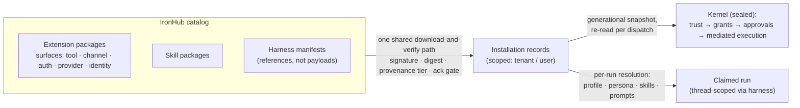
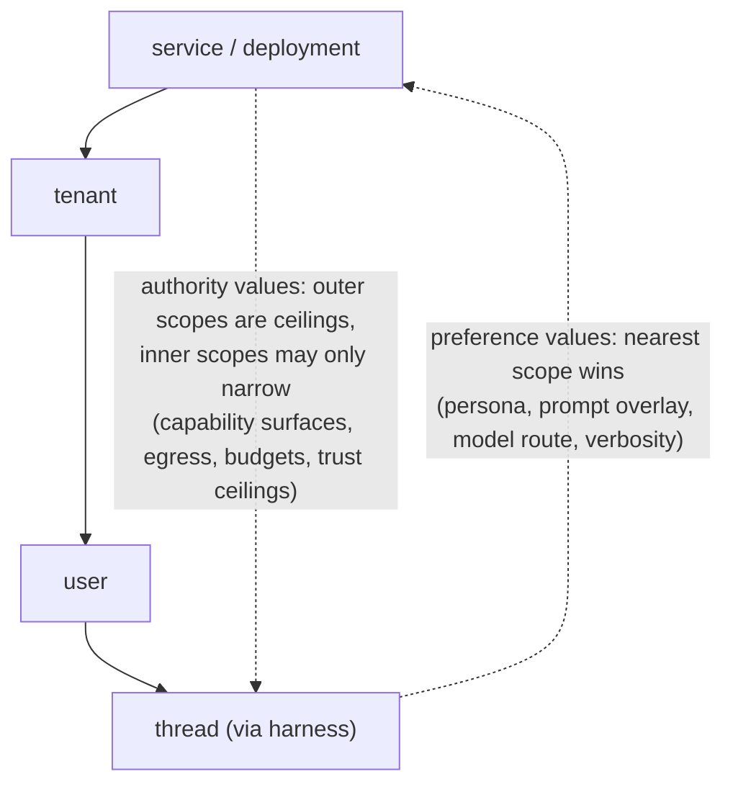
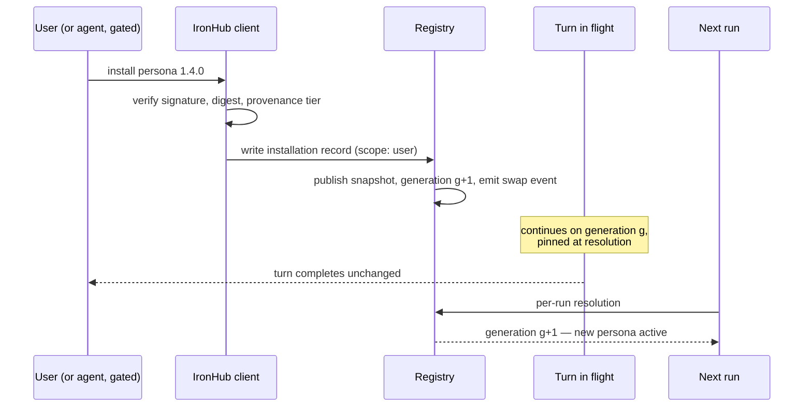
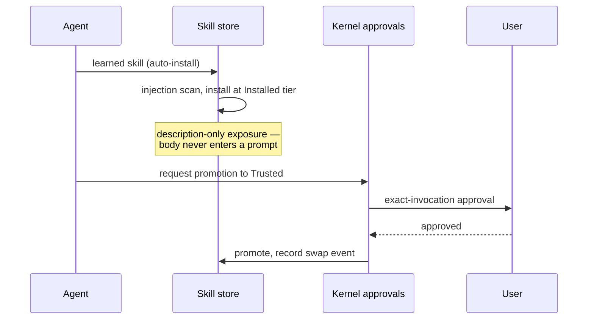

<!-- This document follows GitLab's architecture design document template: https://handbook.gitlab.com/handbook/engineering/architecture/design-documents/ -->

This is a proposal. It is being iterated on and is not yet a committed design.

## Summary

IronClaw's runtime behavior is frozen at build or boot time for almost every component that defines what the assistant *is*: changing a persona, adding a channel, or altering how the agent loop runs means recompiling the binary, restarting it, or editing files on the host by hand — none of it is a product action. Per-thread configuration does not exist at all — a thread today is a transcript, a title, and a goal. Yet one component class already works as a full runtime plugin system: tools install from a signed catalog (IronHub), verify by digest, swap generationally without disturbing in-flight work, and can even be installed by the model mid-run.

We propose making every runtime component — personas, prompts, skills, channels, loop profiles, and their composition — installable and selectable the same way. Three mechanisms that already work carry the design: the shared download-and-verify pipeline tools use today, the extension host's generational snapshot pattern, and the per-run resolution cadence that already rebuilds prompt and capability state every turn. A typed scope-resolution layer (service → tenant → user → thread) decides which installed component takes effect where, under exactly two combination rules: preference values take the nearest scope; authority values only narrow, so an inner scope can never widen what an outer scope denied.

The kernel — the nine-stage authority perimeter, sandbox lanes, mount containment, safety layer, and registry verification — never becomes swappable. Every swap rides on top of capability mediation, never around it.

The payoff: hosted users get personas at all (today they get none), threads get named modes, community channels arrive through the catalog's review tiers instead of being compiled into the host, and agent self-improvement becomes safe because nothing the agent writes gains prompt authority without a human approval.

## Motivation

The system is asymmetric. The kernel's *policy data* is already fully hot (live-updatable, no restart): the capability catalog it authorizes against is re-snapshotted on every dispatch (`host_runtime/production.rs:393`). Yet nearly everything users want to change is frozen into the binary or the boot sequence. The freeze line is not the kernel; it is whatever the process constructed at boot versus whatever a durable store says now.

| Component | Today | Blocking gap |
|---|---|---|
| Tools (WASM / MCP) | Hot: signed install, generational swap, mid-run tool-surface refresh (`loop_driver_host.rs:278`) | None — this is the template |
| Skills | Hot per-user install; agent-learned skills auto-install | Learned skills land at Trusted tier (see threat model) |
| Personas | Do not exist; identity machinery built but unwired | Production injects one global file, discarding run scope; hosted deployments get none (#5013) |
| Prompts | ~120 behavioral assets compiled into the binary | Runtime override exists for exactly one file |
| Channels | Adapters compile-linked into the binary | Four seams (see design details) |
| Agent loop | Driver registry and per-turn profile resolver are live | No data path: all registration is Rust at boot |
| Scope resolution | Specified in `docs/reborn/contracts/settings-config.md` | Zero implementation — the load-bearing gap |

Every gap above is a user-visible limitation, and every scoped feature — per-user model choice, per-thread modes, the blueprint and harness epic (#3036) — blocks on the same unimplemented resolver.

### Goals

- Every installable component kind arrives through the one shared download-and-verify pipeline: a package that fails signature, digest, or provenance verification does not install, whatever its kind.
- Swaps are invisible to in-flight work: a running turn completes on the generation it resolved, and a broken swap is bounded to the next run.
- The kernel is never swappable: no package, scope, or configuration replaces the authority perimeter, sandbox lanes, mount containment, safety layer, or registry verification.
- Scope resolution is deterministic and security-neutral: preference values take the nearest scope; authority values only narrow — an inner scope can never widen what an outer scope denied.
- Agent-authored artifacts carry no prompt authority until a human approves: without an explicit approval they remain at a non-trusted tier with description-only exposure.
- Every swap is an auditable, reversible event: activation records actor, catalog entry, digest, and target scope, and the previous generation remains re-activatable.
- Channels fail closed: a channel that cannot serve traffic fails at activation, not at the first user message.
- Identity degrades to a default, never to nothing: hosted and standalone deployments resolve personas through the same path, and a missing persona falls back to the compiled default prompt.

### Non-Goals

- **Swapping the kernel or its sealed mints.** Dismissed as self-defeating: swapping is safe precisely because capability mediation sits beneath every swappable thing.
- **Third-party (downloaded) loop drivers.** The compiler proves shipped loops harmless through dependency isolation; downloaded code has no equivalent proof. Deferred to a future document once loop profiles as data have burned in — the credible shape is a WASM driver lane.
- **Free-form per-thread configuration.** Considered, but dismissed: per-key overrides produce unauditable drift. Thread scope arrives only through harness binding, so a thread has a named, versioned configuration identity.
- **A configuration rule engine.** Two combination rules cover every live case in the codebase; an engine would be unauditable and would blur the preference/authority split that keeps swaps security-neutral.
- **Mid-run hot-reload.** A persona or harness change takes effect on the next run, as #3036 already specifies for harnesses; mutating a running turn would break generation pinning for no user value.
- **Making the boot-resolved substrate swappable.** Storage backends, mounts, the sandbox lane, and the HTTP router stay restart-scoped by design; moving them is a distraction from the user-visible axis.

### Assumptions

- IronHub remains the sole acquisition path, and its provenance mechanics — Ed25519-signed catalog, per-artifact digests, review tiers, acknowledgement gate — are the trust floor for marketplace distribution, with key rotation (#6766) and discovery integrity (#6820) as continuous hardening.
- The WASM sandbox lane is sufficient containment for untrusted adapter code, as it already is for tools.
- Scope plumbing is complete: `ResourceScope` already carries tenant, user, agent, and project on essentially every store and port. The lattice needs a resolver, not new plumbing.
- Deployments remain operationally single-tenant (tenant pinned to `"default"`) during this work; the tenant axis activates later without redesign.

## Proposal

We propose three catalog object kinds, and no more:

- **Extension packages** stay the only installable product object. Growth happens by *surface kind* — tool, channel, auth, provider, and a new identity (persona) surface — never by new object kinds.
- **Skill packages** keep their entry kind but share the identical acquisition pipeline; persona packs and prompt packs join as further entry kinds on the same path.
- **Harness manifests** are composition objects: named, versioned references to extensions, skills, a prompt overlay, and constraints, with at most one bound per thread.

All three arrive through the one shared download-and-verify path. Everything else that swaps at runtime — triggers, loop profiles, settings values, and user- or agent-authored content — stays a scoped record governed by the resolver, not the catalog. Verified installs become scoped installation records. Two existing resolution planes consume those records: the kernel re-snapshots its capability catalog per dispatch, and the run layer resolves profile, persona, skills, and prompts per claimed run. A typed scope resolver over `ResourceScope` decides which record wins at which scope. The kernel sits beneath all of it, unchanged.



## Design and implementation details

### One product object, growing by surface kind

The unified extension model already survived its first growth test: memory shipped as a `[memory]` provider surface on an ordinary extension package, with no new lifecycle, registry, or trust machinery. We propose growing the same axis again: a persona becomes an *identity surface* — prose assets plus optional behavior knobs, versioned and digest-verified like any other package asset:

```toml
# excerpt: reborn.extension_manifest.v3
[extension]
id = "research-analyst"
vendor = "acme"

[identity]                    # new surface kind, beside [tool] / [channel] / [memory]
persona_files = ["prompts/SOUL.md", "prompts/IDENTITY.md"]
applicability = "on_personal_context_allowed"
```

Whether the storefront label says "persona" is presentation; the taxonomy underneath does not fork. IronHub already carries tool and skill entries through one signed manifest; persona packs and prompt packs join as further entry kinds on the same path — #6731's constitutional rule: one shared download-and-verify package path; no schema-only, prompt-only, or install-only forks.

**What becomes a surface, and what does not.** A surface is not "anything installable" — it is a binding the system must remember. The test is mechanical: *does installing this create a binding the system must remember, or content the system must index?* Every surface today answers the first question — which adapter serves this channel, which provider backs memory, which recipe handles this vendor — and the extension machinery exists precisely to answer it, through installation records, activation transactions, conflict checks, and generational snapshots. A persona is binding-shaped: one identity is live per scope, changed by an explicit swap event.

Skills answer the second question. Fifty install; a changing subset of roughly four enters any given turn, selected per run by relevance scoring against a token budget. No binding is recorded, no conflict arbitrated, no generation read — extension machinery would be lifecycle with no consumer. Two further properties argue the same way: skill trust is decided per file (the promotion gate below operates at that granularity, and package-level trust would let one trusted package carry a pile of full-body prompt content past it), and skills are the self-improvement substrate, written continuously by the learning pipeline, so their authoring cost must stay near zero. Skills therefore keep their own entry kind on the shared pipeline. Where a *binding* decision about skills is genuinely needed — "this thread always loads these three" — the harness records it, at the granularity users think in.

Below the catalog sits a third tier that is not packaged at all: triggers, loop profiles, settings values, and user- or agent-authored content are scoped records resolved through the lattice. Distributable definitions get packaged; instances and choices stay records.

> **Invariant:** one lifecycle, one provenance ladder, one identity model. A new component kind is a new surface or entry kind on the existing pipeline — never a new acquisition path.

This is a one-way door: if "persona" ships as a separate product object with its own install path, unifying later means a migration across user-visible identity, and the manifest vocabulary — the wire contract package authors write against — cannot be walked back. Note the trade-off: surface kinds concentrate pressure on manifest parsing and review. We accept that because manifest parsing is already the trust choke point, and one well-guarded gate beats five.

### Scope resolution: two rules, no rule engine

The hierarchy is already specified: `docs/reborn/contracts/settings-config.md` defines the scopes and the exact precedence chain (explicit invocation override → agent/project → user → tenant → system default) with a `resolve(scope_chain, key)` repository — and zero code implements it. We propose implementing it with exactly two combination rules, chosen by value class:



Each component kind declares its allowed scopes and its combination rule in its contract. The codebase already does this implicitly: approval policy deliberately collapses to `(tenant, user)`; memory deliberately has no thread axis; and secrets already resolve two levels deep — caller scope, then tenant-shared sentinel (`obligations/handler.rs:1071-1083`) — the template the general resolver copies. The two-rule split keeps every swap security-neutral by construction: a preference change cannot escalate anything; an authority change can only shrink.

> **Invariant:** a thread-scoped harness can strip tools from a user's surface; it can never add one the tenant denied. The kernel already thinks this way — grant planning fails closed and trust requests clamp to ceilings — the resolver extends the same law to configuration.

Scope semantics are the second one-way door: once packages and harnesses are authored against "nearest wins" and "only narrows," changing either rule silently changes the meaning of every deployed configuration. The resolver itself is small; the semantics are forever.

### Swap mechanics: generations, not mutation

We propose standardizing what the extension host already does, as the system-wide contract:

1. **No in-place mutation.** A swap publishes a new immutable snapshot under a bumped generation.
2. **In-flight work finishes on the generation it resolved.** Already true today: tool invocations complete on the snapshot they resolved, and the ingress path pins the exact parsing-adapter handle across replay (`ingress/router.rs:83-88`) so a swap cannot change hands mid-request.
3. **Resolution cadence defines swap latency.** Per dispatch for capability surfaces, per claimed run for prompt, persona, skills, and profile, per boot only for the physical substrate. Anything expressed as data at those seams is automatically hot — editing the system-prompt file already takes effect next turn.
4. **Every swap is an event.** Who installed, activated, or promoted what, from which catalog entry, at which digest, into which scope. Rollback is re-activation of the previous generation, which the retention rule (LLM data is never deleted) guarantees still exists.



One defect blocks this contract for *updates*: the WASM prepared-component cache is keyed by module path and never invalidated (`host_runtime/services/runtime_adapters.rs:905`), so a reinstalled extension executes old code until restart. Keying by digest makes update as safe as install.

> **Invariant:** a swap never degrades a running turn. In-flight work completes on its pinned generation; the new generation takes effect at the next resolution point.

### Personas and prompts as data

Everything hard is already built and tested; nothing is wired. `HostIdentityContextSource` supports multiple identity files, per-file trust attenuation (trusted files contribute their full body, installed files a summary only), applicability gating, and a token budget. Production instead wires a single source that reads one global file and discards the run context (`default_system_prompt.rs:288`); hosted profiles wire an empty source (#5013). The persona files themselves (`SOUL.md`, `IDENTITY.md`, `USER.md`) already live per `(tenant, user, agent, project)` on the `/memory` mount — writable by the agent today, injected never.

We propose wiring what exists: honor the run context in the identity source, key the per-run cache by scope, read the identity files from the mount, gate `USER.md` behind the built personal-context policy (excluded by default), and give the write path a real product surface. Two decisions ride along:

- **Storage plane.** The system prompt file deliberately lives on raw `std::fs` outside the `RootFilesystem` mount catalog, while the identity files live inside it. We propose the mount catalog as the single plane; a split plane would give the scope resolver two sources of truth.
- **Write approval.** The moment identity files become prompt-load-bearing, today's unguarded `memory.write` becomes an unapproved self-modification channel. Writes to protected prompt paths go through the exact-invocation approval stage (see threat model).

Prompts generalize the same way. Roughly 120 behavioral prompt assets are compiled into the binary; the two patterns that already work — the seeded-then-read-from-disk system prompt, and per-extension prompt assets materialized on disk and digest-verified when they arrive from IronHub (#7217) — become the norm rather than the exception. Compiled text remains the fallback default; a layered override (service → tenant → user) resolves through the settings lattice. Note the trade-off: prompt overrides turn behavior into data, so debuggability depends on the swap event log — "which prompt was live for this run" must be answerable from events, and is.

### Channels as WASM packages

This is the largest single build. A runtime-installed channel fails at four independent seams today, in the order a package hits them:

1. **Parse** — a credentialed channel must declare secret handles in `[admin_configuration]`, which is rejected for any non-host-bundled manifest (`extension_registry/v3.rs:378-395`). Community channels cannot even parse.
2. **Import** — every runtime-installed package must be WASM (`available_extension_import.rs:229-233`), and today's channel adapters are native services.
3. **Bind** — a `[channel]` manifest with no compiled adapter silently receives a placeholder bridge, activates successfully, and fails at the first real message (`generic_host.rs:383-388`). It fails open at activation and closed at first use — a live defect today, independent of this proposal; the fix is to fail closed at activation.
4. **Registry** — the deployment channel registry is built once at boot as the intersection of available manifests and compiled bindings, silently dropping anything unmatched (`production_backend_assembly.rs:859-887`).

What does *not* block is webhook routing: one dynamic mount resolves routes per request through the snapshot watch, so new public webhook paths appear with zero HTTP-server changes.

We propose a WASM `ChannelAdapter` lane. The adapter contract is protocol-only by charter — parse inbound, render outbound; the generic verifier owns signature checks; the host owns delivery and injects credentials at send time — so a sandboxed adapter never holds a secret and never talks to the network directly. The work is: allow `[admin_configuration]` for verified registry sources, add a WASM channel loader beside the existing tool loader, source the channel registry from the live snapshot instead of the boot intersection, and make seam 3 fail closed. Static-client OAuth needs one more piece: client credentials are boot-frozen (`auth_engine_assembly.rs:42-50`); the `[admin_configuration]` unlock doubles as the admin-supplied custody slot at install time.

Community channels — an unofficial WhatsApp bridge is the canonical example — then arrive through IronHub behind a review tier, which is where such a bridge should live: in the catalog with visible provenance, not compiled into the host.

### Loop profiles as data

"Swap the agent loop" splits three ways in the code, and the split is the design:

- The **loop host** — turn admission, claims and leases, port mediation, exit validation, budgets — is kernel-adjacent and never swaps. It is what makes a swapped loop safe.
- The **loop driver** is the designed wholesale-replacement unit, and the seam is live: a driver registry with per-turn selection through the run-profile resolver, and two production drivers with genuinely different control flow. What is missing is purely a data path — every registration is Rust at boot; no production resolver reads from anywhere durable.
- **Loop strategies** are sealed on purpose and stay sealed; the extension point is a new driver, never a branch inside the canonical executor.

We propose making `RunProfileDefinition` — driver, capability surface, model route, budgets, prompt overlay, personal-context policy — a durable, scoped record instead of a boot constant. That immediately enables per-thread modes (deep research, cheap triage, benchmarking) with zero new trust surface, because every field of a profile is already kernel-mediated: a profile selects among registered drivers and narrows surfaces and budgets, but cannot mint authority. Third-party WASM drivers remain explicitly deferred (Non-Goals).

### Harness manifests: composition and the per-thread story

A harness (`HarnessManifest`, #3036) is a named, versioned composition: it references extensions and skills, adds a prompt overlay, filters the capability surface, and sets runtime constraints — with at most one harness active per thread. It is a composition object, not a package: IronHub distributes the manifest as references, and installing a harness resolves to N ordinary installs through the same pipeline, each individually verified.

This one object is simultaneously the collections story (a curated, versioned set) and the per-thread persona story ("this thread runs the research persona"). Binding is a transition, not a mutation: switching a thread's harness takes effect on the next run — #3036 already declares hot-reload of a running session a non-goal, and we keep that. #3036 also currently marks harness marketplace distribution as a non-goal; we propose reversing exactly that one line once the settings lattice exists, because a harness is precisely what the catalog should distribute for "download a different agent personality."

The service and tenant layer of the same idea is `IronClawBlueprint`: declarative tenant configuration applied idempotently, an input rather than the runtime source of truth. Blueprint is to tenant what harness is to thread.

### Preliminary threat model

Marketplace-distributed runtime components are security-sensitive, so we sketch the threat model here for the security review to deepen.

**Boundaries that never move.** The nine kernel stages and their sealed mints, the sandbox lanes, the mount catalog's containment, the safety and redaction layer, the egress policy mechanism, and the registry verification path. Marketplace content — including a community channel — changes what runs *above* the membrane, never the membrane.

**Malicious package.** Mitigated by the pipeline itself: signed catalog, per-artifact digests, version-plus-digest pinning at install, five review tiers, and an explicit acknowledgement gate on unverified community content that the agent cannot self-acknowledge (the deep-link install path hardcodes acknowledgement off). Residual risk: a single compiled-in signing key with no rotation story (#6766).

**Prompt injection via persona or skill body.** A persona is only useful at full-body prompt exposure, so tier attenuation (which reduces installed-tier content to a summary) cannot be the whole defense. When exposure cannot be attenuated, the control moves to sourcing — provenance tier — and to explicit consent at install time; the open question below is only where to set the tier floor.

**Agent self-modification laundering.** The live gap: the skill-learning pipeline distills a skill from every successful turn and auto-installs it at *Trusted* tier — full body injected into future prompts, content denylist disabled — guarded only by a pre-install injection scan (`extension_host/skill_learning.rs`). That is a durable self-modification channel with no human in the loop, and personas would widen it. We propose one rule everywhere, reusing the hooks tier vocabulary (`self_authored`, source-fixed, never self-declarable):

> **Invariant:** agent-authored artifacts enter at a non-trusted tier. Durable prompt authority requires explicit human promotion through the existing exact-invocation approval stage.



The same gate covers identity-file writes once personas are prompt-load-bearing, and any future self-authored persistent hook. Self-improvement stays fully available — the agent can learn, install, and use — but prompt authority costs a human click.

**Catalog spoofing and fabricated discovery.** Signing constrains what *installs*, not what the agent *believes exists*: in a live preview an agent fabricated 20 of 21 "catalog" entries (#6820). Mitigation: typed catalog results become the only claims an install prompt can be built from, so invented packages cannot be laundered into a consent dialog.

**Availability floor.** Swaps never degrade a running turn (generation pinning). A malicious or broken swap is bounded to the next run and reversed by re-activating the previous generation.

## Iterations

Each stage ships value on its own and produces the feedback the next stage needs; the end state is the Proposal diagram, and each stage lights up more of it. Registry hardening — key rotation (#6766), discovery integrity (#6820), the prepared-cache fix — runs continuously alongside, and the learned-skill tier fix lands immediately because it closes a live gap with no new machinery.

1. **Personas and prompts as data (per-user).** Make the existing identity source scope-aware, read identity files from the mount behind the personal-context gate, fix #5013, approval-gate protected-path writes, and add the prompt-asset override layer. This stage provides standalone value: every hosted user gets a persona — the highest-demand, lowest-risk item in this program — with no new package kinds. Exit criterion: on a hosted deployment, a user edits their persona through a product surface, the write requires an approval, and the next run reflects it.
2. **The settings lattice.** Implement the `settings-config.md` resolver over `ResourceScope` with the preference/authority split. This stage provides standalone value: per-user model routing and every scoped setting after it; it unblocks #3036. Exit criterion: at least two component kinds resolve through the lattice in production with both combination rules pinned by tests.
3. **Loop profiles as data.** Make `RunProfileDefinition` a durable scoped record with per-thread selection. This stage provides standalone value: named modes deliver most of "swap the agent loop" with zero new trust surface. Exit criterion: a thread switches to a named profile that changes driver, budgets, and model route with no recompile or restart.
4. **Channels as WASM packages.** Open the four seams, fail closed at activation (the defect fix ships first, independently), source the registry from the live snapshot, add the static-OAuth custody slot. This stage provides standalone value: community channels no longer require forking the host. Exit criterion: a community channel package installs, activates or fails closed, and serves a message round trip on an unmodified binary.
5. **Harness bundles on IronHub.** Ship `HarnessManifest` with thread binding, add harness, persona-pack, and prompt-pack entry kinds to the one pipeline, and reverse #3036's marketplace non-goal. This stage provides standalone value: installing a complete agent personality becomes one action. Exit criterion: a catalog harness binds to a thread and that thread runs the composed persona, profile, and skill set.

## Alternative Solutions

### Do nothing (restart-based configuration)

Operators can already edit `config.toml` and restart, and standalone users can edit the system-prompt file. But hosted multi-user deployments cannot restart per user preference, per-thread configuration is structurally impossible, and community channels are blocked entirely — no restart adds an adapter the binary does not contain. Doing nothing is thus not a smaller version of the goal; it is abandoning it.

### A package kind per component

Ship `persona`, `channel`, and `profile` as separate top-level product objects with their own install paths. The naming is friendlier, but the cost is N lifecycles, N provenance ladders, and N identity models — the exact "extensions come to mean several different things" failure the unified model exists to prevent, and a violation of #6731's one-pipeline rule. Memory's provider surface proved the surface axis absorbs new kinds cheaply. We reject this as a taxonomy fork we would spend years unwinding.

### Skills as a manifest surface

Model skills as a `[skills]` surface so every catalog kind is an extension, or let extension packages embed skill directories as assets. It is coherent — an extension shipping its own skills reads naturally — but it collapses trust to package granularity, so the per-file promotion gate stops being enforceable; it versions and reviews skills as a blob rather than individually; and removing the extension deletes knowledge the user may want to keep. This door stays open: a `[skills]` surface can be added later without breaking the model. We defer it in favor of harness references, which compose the same sets without the coupling.

### A general configuration rule engine

A policy engine could express arbitrary merge semantics per key. Nothing live needs more than the two rules — the most complex resolution in production today is secrets' two-level fallback — and an engine would make "what applies to this run" unanswerable in review while blurring the preference/authority line that keeps swaps security-neutral. An engine is strictly worse than two hardcoded rules.

### Native plugin loading for channels and loops

Dynamic libraries would give adapters full performance and API surface. But a downloaded native adapter runs inside the host process with no containment and no proof of harmlessness — the compiler-enforced isolation argument covers only code we ship and compile ourselves. Native plugins are thus not viable for marketplace distribution; the WASM lane is the only credible path.

### Free-form per-thread overrides instead of harness binding

Letting any settings key vary per thread is simpler than a harness object. It also produces unauditable configuration drift — no versioned identity, no single answer to "what is this thread running" — and mismatches how users think, which is in named modes. We dismiss this in favor of at-most-one-harness-per-thread.

## Risks and open questions

- **Persona trust floor.** Personas need full-body prompt exposure, so attenuation cannot protect them. Is Verified-tier-and-above the floor for marketplace personas, or is per-install explicit consent ("this will speak as your agent") sufficient?
- **Model-cost custody.** A user-scoped harness can pin an expensive model; API keys are per-user but the routing table is deployment-global. Proposed default, from the lattice's own rules: model *choice* is a preference value, model *spend* is an authority value — a pinned model still runs under the payer scope's budget ceiling. Open: whether a tenant may deny a model class outright.
- **Storage-plane migration.** Unifying the system prompt onto the mount catalog moves a live file on existing deployments. Reversible: the compiled default remains the fallback, and the old path can be read through until decommissioned.
- **Static-OAuth custody for community vendors.** When a vendor cannot do dynamic client registration, someone supplies a client secret: operator-per-deployment, or a vendor-hosted broker?
- **WASM adapter expressiveness.** Some channel protocols may resist the parse/render split. Mitigation: the verifier and delivery stay host-side by charter, so the adapter surface stays small.
- **Process.** Security review holds blocking authority over the trust-promotion and channel-credential designs; other sections are consultative.

## Further reading

- #6731 — IronHub integration epic; source of the one-pipeline rule.
- #3036 — Configuration-as-Code epic: `IronClawBlueprint` and `HarnessManifest`.
- #7046 — chat-configuration epic (admin-vs-user scope).
- #5013 — hosted deployments ship without an identity prompt.
- #5264 — third-party memory providers and the native-only identity-file constraint.
- #6766 — catalog signing-key rotation.
- #6820 / #6821 — discovery integrity: fabricated catalog entries.
- #6641 — skill self-creation design and benchmark.
- `docs/reborn/contracts/settings-config.md` — the specified-but-unimplemented settings hierarchy.
- `docs/reborn/target-architecture/` — the design record for the kernel/userland split and the family charters.
