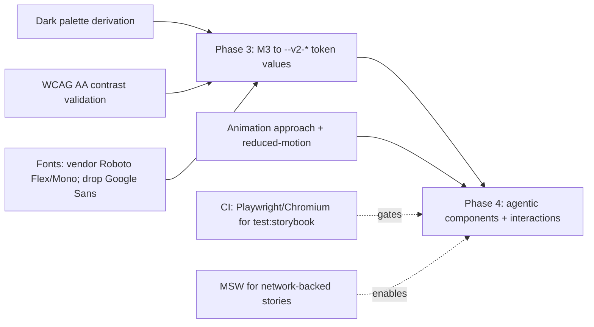

# Proposed: Storybook + Design-System Catalog for the IronClaw WebUI

**Status:** Proposal, under review · **Authored against:** `origin/main` @ `d3791e0f8` · **Tracks:** Epic [#7038](https://github.com/nearai/ironclaw/issues/7038) · **Benchmarks:** [`apdd-kit`](../../../apdd-kit) · [`docs/reborn/target-architecture/`](../target-architecture/PROPOSAL.md) (PR #6918)

## 1. Executive decision

Adopt a **governed, catalogued design system** for the IronClaw WebUI and evolve it toward an **AI/agentic-first UX** in five predefined phases. Realize the design language — **Material 3 Expressive (M3X)** — **natively** with the existing React 19 + Tailwind v4 primitives; do **not** adopt Material Web components or a parallel/third-party design-system framework. `DESIGN.md` and the Storybook catalog are the source of truth; the token architecture (`data-theme` + `--v2-*`) is kept.

Phases 1–2 have landed (PRs #7039, #7043). This proposal freezes the framing, records the decisions, and — most importantly — **names the dependencies of Phases 3–5 with a proposed implementation for each** (§7).

## 2. Current-state evidence

### 2.1 Frontend stack (`CURRENT`, measured against `origin/main`)
- **React 19.2 + TypeScript** SPA under `crates/ironclaw_webui/frontend`, built with **Vite + Tailwind v4** (CSS-first: no `tailwind.config.ts`; tokens live in `src/styles/app.css` under `@theme` + `:root[data-theme=…]`).
- Package manager **pnpm**; fonts self-vendored via `/vendor/fonts` (Geist / Geist Mono).
- A deliberate **static-motion policy** in `app.css` (`* { animation: none !important }`, `.v2-spin` the sole exception, `prefers-reduced-motion` honored).

### 2.2 Existing design surface (`CURRENT`)
- `src/design-system/` — atomic **primitives** (Button, Badge, Input, Card, Switch, Spinner, Modal, ConfirmDialog, SelectMenu, Icon) + **composites** in `primitives.tsx` (StatCard, Panel, FlowList, EmptyPanel, SectionHeader, SubLabel).
- `src/components/` + `src/layout/` — shared composites and the app shell.
- Tokens are already token-driven via `--v2-*`; light + dark both defined.

### 2.3 Landed foundations (`LANDED`)
- **Phase 1 (#7039):** Storybook 10 (`@storybook/react-vite`, pnpm) wired to the real `app.css` + a light/dark toolbar; **~33 stories** in five sidebar categories (Primitives / Components / Composites / Icons / Tokens); a vitest split (`pnpm test` node-only, `pnpm test:storybook` in headless Chromium); `@storybook/addon-mcp` for agent access.
- **Phase 2 (#7043):** `crates/ironclaw_webui/frontend/DESIGN.md` (M3X spec + an IronClaw implementation/governance appendix), a Storybook `Design/Guidelines` docs page, and `.claude/rules/design-system.md` agent governance.

### 2.4 Current-state conclusion
The workbench, catalog, governance doc, and agent rules exist. What remains is the **visual/interaction transformation** (Phases 3–5) — which is where the dependencies and risk concentrate.

## 3. Non-negotiable invariants

1. **Native M3X** — realized with React + Tailwind + `--v2-*`; never `<md-*>` Lit web components or a parallel framework.
2. **Token-driven** — no hardcoded hex/px in components; add tokens (light **and** dark) in `app.css`.
3. **Story-per-component** — every primitive/composite/component with meaningful states has a colocated `*.stories.tsx`; changes are reviewed in Storybook and covered by `pnpm test:storybook`.
4. **Accessibility bar** — WCAG AA contrast, preserved `aria-*`, keyboard/focus, light+dark parity.
5. **Motion policy** — expressive motion is opt-in and `prefers-reduced-motion`-gated.

## 4. Alternatives considered

- **Material Web Components (`<md-*>`, Lit) — rejected.** Introduces a second component runtime into a React app; violates Epic #7038's "no parallel framework" non-goal and the `--v2-*` token architecture. The supplied agent instructions assumed this stack; it does not fit.
- **A third-party React DS (MUI/Radix/shadcn adoption wholesale) — rejected.** We already have a coherent primitive layer; swapping frameworks is a rebuild, not a reskin.
- **Native M3X on React + Tailwind — recommended.** Adopt M3X as the *design language*, applied to our own primitives and tokens. Preserves logic, `aria-*`, and the token mechanism; changes values/assets/interactions, not architecture.

## 5. The design system, as governed

`DESIGN.md` is the constitution; it maps cleanly onto the APDD-kit 5-tier taxonomy:

| APDD tier | IronClaw home |
|---|---|
| Tier 1 — Tokens | `styles/app.css` (`@theme` + `--v2-*`) |
| Tier 2 — Elements (primitives) | `design-system/` atomics |
| Tier 3 — Components (pure compositions) | `design-system/primitives.tsx` composites + `components/` |
| Tier 4 — Patterns (state-bound) | `pages/**` feature views |
| Tier 5 — Layouts | `layout/` |

## 6. Storybook as workbench + test-harness + agent MCP

Per the APDD design-governance guide, Storybook is three things: a **workbench** (the catalog), a **test harness** (`test:storybook` runs stories in Chromium with a11y + a `CssCheck` that fails if the stylesheet didn't load), and an **agent MCP** (`@storybook/addon-mcp`, registered local-scope, so an agent can query component docs before using them). This is already in place from Phase 1–2.

## 7. Dependencies and their implementation proposals

The remaining phases carry six dependencies. Each is stated with a **proposed implementation** and the phase it gates.

**7.1 CI: Playwright/Chromium for `test:storybook`.** *Gates: cross-cutting.* The story suite runs in headless Chromium; CI runners don't install it today (the vitest split keeps `pnpm test` node-only, so nothing breaks now). **Proposal:** add an *optional, non-blocking* CI job that runs `pnpm exec playwright install chromium` + `pnpm test:storybook`; promote to a required gate only after it's proven stable. Documented in CHECKLIST WS6.

**7.2 MSW for network-backed stories.** *Gates: Phase 4 happy-paths.* Two components (PairingWebCodePanel, TeeShield) render limited/error states in Storybook because they hit the network / are host-gated. **Proposal:** add `msw` + `msw-storybook-addon`, generate the worker into `public/`, and add handlers only for those endpoints — keeping deterministic cache-seeding for everything react-query-based (the pattern already used in Phase 1).

**7.3 Dark palette derivation.** *Gates: Phase 3.* The supplied M3 palette is light-only; the app is dark-default and dual-theme. **Proposal:** derive dark values per token (tonal shift, not literal inversion) in `app.css :root[data-theme="dark"]`; validate each pair in the `Tokens/Colors` story before adoption.

**7.4 Fonts + licensing.** *Gates: Phase 3.* Spec wants Roboto Flex / Google Sans / Roboto Mono; app ships Geist. **Proposal:** vendor **Roboto Flex + Roboto Mono** (OFL) under `/vendor/fonts`; **drop Google Sans** (not freely redistributable) — use Roboto Flex for the emphasized-headline role, or confirm a licensed source before shipping.

**7.5 Expressive motion.** *Gates: Phase 4.* Spring physics / shape-morph / speed-dial unfurl require an animation mechanism; none is installed, and the static-motion policy is in force. **Proposal:** evaluate a small JS spring lib (e.g. `motion`) vs. spring→cubic-bezier CSS approximations; whichever is chosen, all expressive motion is **opt-in and `prefers-reduced-motion`-gated**, introduced behind the policy rather than ad-hoc keyframes.

**7.6 Merge-order / stacked PRs.** *Gates: Phase 2→3 landing.* PR #7043 (Phase 2) is stacked on #7039 (Phase 1). **Proposal:** merge #7039 first, then retarget #7043 to `main`; Phase 3 branches off `main` after both land.

## 8. Alignment with the governance benchmarks

- **APDD kit:** we produce the kit's design-governance artifacts — `DESIGN.md` (constitution + taxonomy + REJECT gate), path-scoped `.claude/rules/design-system.md`, Storybook-as-workbench/test/MCP, and a validation gate — and honor its spine (docs are source of truth; fixes update docs + add a test). This proposal package is the kit's "epic gets a committed plan" case.
- **PR #6918:** we mirror the doc shape (this README/PROPOSAL/PLAN/CHECKLIST + an interactive artifact) and conventions (provenance shas; phased waves with quantified milestones; `⚠` ordering constraints; "Landed with #NNNN"; a PR-body `| File | Role |` table).

## 9. Risks & open questions

- **Reskin scope creep** — an M3X reskin can balloon. Mitigation: token values land first (Phase 3) and are validated in Storybook before any component restyle.
- **Motion vs. the static-motion policy** — reversing it broadly risks a11y regressions. Mitigation: opt-in + reduced-motion gate, per-component.
- **CI cost** — running Chromium story tests in CI adds minutes. Mitigation: optional job first; make required only if stable.
- **[decision]** Font substitute for Google Sans — needs a named call (Roboto Flex only, or a licensed alternative).
- **[decision]** Whether `test:storybook` becomes a required merge gate.

## 10. References

- APDD kit: [`apdd-kit/guides/design-ux-governance.md`](../../../apdd-kit/guides/design-ux-governance.md), [`apdd-kit/templates/DESIGN.template.md`](../../../apdd-kit/templates/DESIGN.template.md)
- Benchmark package: [`docs/reborn/target-architecture/`](../target-architecture/README.md) (PR #6918)
- This initiative: `DESIGN.md`, `.claude/rules/design-system.md`, `src/design-system/README.md`; Epic #7038; PRs #7039, #7043.
