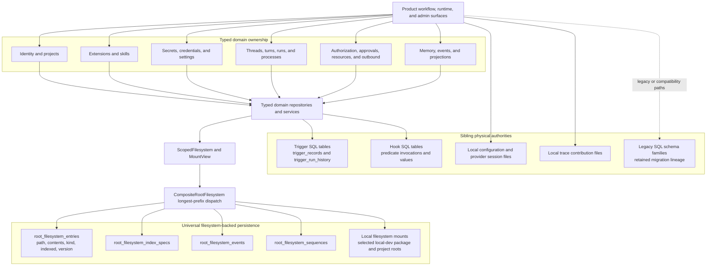
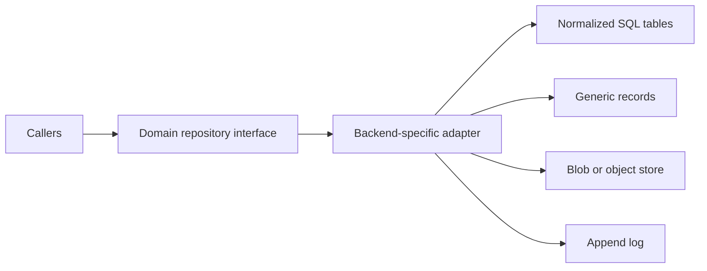

# Reborn Storage Landscape

**Status:** Descriptive architecture snapshot and proposal index

**Snapshot date:** 2026-07-24

**Scope:** Persistent and semi-persistent data placement. Mutation semantics,
cascade behavior, retention policy, and migration sequencing are deliberately
out of scope.

This document answers two different questions that are easy to conflate:

1. What typed domain API owns a piece of data?
2. What physical storage shape ultimately persists it?

Reborn usually has a good answer to the first question. The weaker part of the
current design is that many unrelated typed domains collapse into the same
generic path/body/index table at the physical database layer.

This is not an authoritative Reborn contract. The current placement contract is
[`storage-placement.md`](../contracts/storage-placement.md), and the accepted
universal dispatch decision is
[`2026-05-14-universal-fs-dispatch.md`](../2026-05-14-universal-fs-dispatch.md).
Use the artifacts in this directory to evaluate and evolve those contracts:

- [`target-relational-model.md`](target-relational-model.md) proposes a target
  relational/blob/log split and contains the ER diagrams.
- [`data-authority-matrix.md`](data-authority-matrix.md) inventories the
  important data families, their present authorities, and their recommended
  target plane.

## Executive assessment

The current structure is not uniformly bad, and replacing
`RootFilesystem` with direct SQL everywhere would be a regression.

The strong parts are:

- domain crates expose typed operations instead of letting product code edit
  storage rows directly;
- `MountView` and scoped paths provide structural tenant/user isolation;
- `RootFilesystem` gives all backends one routing, capability, CAS, and
  observability seam;
- file-shaped project content, extension package assets, skills, artifacts,
  and opaque checkpoint payloads naturally fit a filesystem/blob abstraction;
- event streams already have append-oriented physical support.

The main weakness is below those APIs:

- most Reborn control-plane records are serialized into
  `root_filesystem_entries`;
- the database sees `path`, opaque `contents`, a small generic indexed
  projection, and a version rather than domain columns and foreign keys;
- unrelated domains, lifecycle records, and package bytes can share the same
  physical table;
- relationships encoded in JSON or path grammar cannot receive ordinary
  foreign-key, uniqueness, check-constraint, or join enforcement;
- multi-record invariants rely on application code and bounded CAS because
  cross-mount transactions are intentionally unavailable;
- repository-wide reporting, retention, and consistency inspection require
  knowledge of every domain's paths and payload schema.

In conventional database terms, IronClaw has typed repositories but often does
not have typed physical tables. That is a reasonable portability substrate, but
it is too generic as the default physical model for relational control-plane
data.

The recommended direction is:

> Keep one logical storage dispatch seam. Do not require one universal physical
> table.

Domain repositories should remain the public interface. Their production
adapters may use normalized SQL tables, append tables, blob/object storage, or
the generic record store according to the data shape. Backend choice remains
hidden behind the repository and storage composition layers.

## Current physical topology



The diagram is a topology, not an ERD. The dominant current Reborn store does
not expose domain relationships to the database, so drawing conventional
foreign-key edges between its JSON records would imply guarantees that do not
exist.

## Physical substrate families

| Physical family | Current role | Current examples | Assessment |
| --- | --- | --- | --- |
| Generic record/byte table | Default production backing for most mounted Reborn roots | `root_filesystem_entries` plus index specifications | Good dispatch substrate; overused as a domain schema |
| Append tables | Ordered filesystem event streams | `root_filesystem_events`, `root_filesystem_sequences` | Appropriate for logs; keep distinct from mutable entities |
| Local filesystem mounts | File-shaped local-development data | projects, extension packages, skills | Appropriate when durability and deployment topology allow it |
| Dedicated domain SQL | Domains that kept query-oriented physical schemas | triggers and hooks | Demonstrates that one application does not require one physical table |
| Local configuration/session files | Bootstrap and provider-specific host state | `config.toml`, `providers.json`, NEAR AI and Codex session JSON | Valid bootstrap boundary, but must not silently compete with persisted settings or the secret store |
| Local trace files | Operator-controlled observability/contribution state | `trace_contributions/` | Separate operational authority; not user-domain relational data |
| Legacy SQL migrations | Pre-Reborn and compatibility schema lineage | users, tokens, conversations, memory, routines, WASM tools, secrets | Must be classified per table before migration or removal; existence alone does not make a table current Reborn authority |

The generic physical schema is defined by
[`V26__root_filesystem_entries.sql`](../../../migrations/V26__root_filesystem_entries.sql),
[`V28__root_filesystem_records.sql`](../../../migrations/V28__root_filesystem_records.sql),
[`V29__root_filesystem_index_specs.sql`](../../../migrations/V29__root_filesystem_index_specs.sql),
[`V30__root_filesystem_events.sql`](../../../migrations/V30__root_filesystem_events.sql),
and
[`V32__root_filesystem_sequences.sql`](../../../migrations/V32__root_filesystem_sequences.sql).

## Logical tenancy and mount routing

Production composition mounts the shared roots `/tenants`, `/events`,
`/memory`, `/projects`, `/system/extensions`, `/system/settings`, and
`/system/skills`. Per-invocation aliases are rewritten into tenant/user paths,
for example:

```text
/threads
  -> /tenants/{tenant_id}/users/{user_id}/threads

/secrets
  -> /tenants/{tenant_id}/users/{user_id}/secrets

/tenant-shared
  -> /tenants/{tenant_id}/shared
```

The same pattern covers processes, authorization, outbound, run state,
approvals, gate records, replay payloads, conversations, turns, checkpoints,
resources, engine state, skills, and workspace data. This is a meaningful
isolation mechanism, but it is not equivalent to typed `tenant_id` and
`user_id` columns with database-enforced foreign keys.

## The central design distinction

`RootFilesystem` solves backend dispatch. A relational schema solves entity
relationships and integrity. Those are compatible concerns:



Callers should not choose among these stores. The repository adapter should.
This preserves the deep-module boundary while allowing the database to enforce
the relationships it is good at.

## What should remain generic

The generic record plane is still useful for:

- low-volume, self-contained records with no meaningful joins;
- opaque checkpoint or replay payloads;
- backend-portable metadata during early feature development;
- import/export projections;
- test and embedded deployments where one simple store is the correct tradeoff.

It should not be the automatic destination for:

- identity links and uniqueness indexes;
- user-to-extension membership;
- credential/account/binding relationships;
- mutable configuration with revision history;
- lifecycle-heavy control-plane records;
- entities routinely filtered, joined, retained, or audited by typed fields.

## Decision test for a data family

Use a normalized table when at least two of the following are true:

1. other durable entities reference it;
2. uniqueness must hold across more than one record;
3. lifecycle state or soft deletion matters;
4. operators need cross-user or cross-tenant queries;
5. updates commonly affect multiple related records;
6. retention, audit, or compliance rules depend on typed fields.

Use a blob/object entry when the body is large, binary, immutable, streamed, or
rarely queried internally. Use an append log when ordering and immutability are
the primary semantics. Use the generic record table when the record is
self-contained and portability is more valuable than relational enforcement.

## Recommended next design work

This landscape deliberately stops before mutation behavior. The next database
design phase should:

1. select one bounded relational vertical, preferably extension installation
   and user membership;
2. write its exact table constraints, compatibility read path, rollback plan,
   and migration invariants;
3. establish a reusable SQL adapter pattern behind the existing domain
   repository;
4. prove PostgreSQL/libSQL parity;
5. only then sequence other control-plane domains.

That produces evidence about the hybrid model without committing the whole
system to a speculative rewrite.
