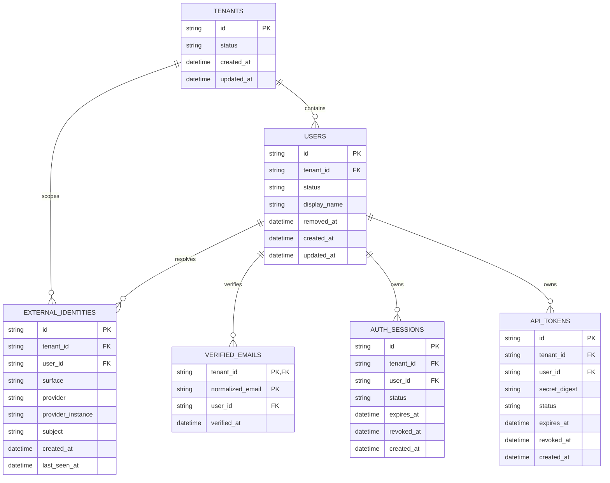
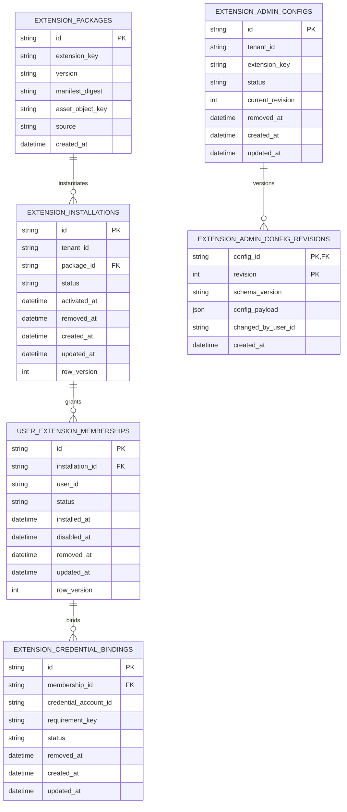
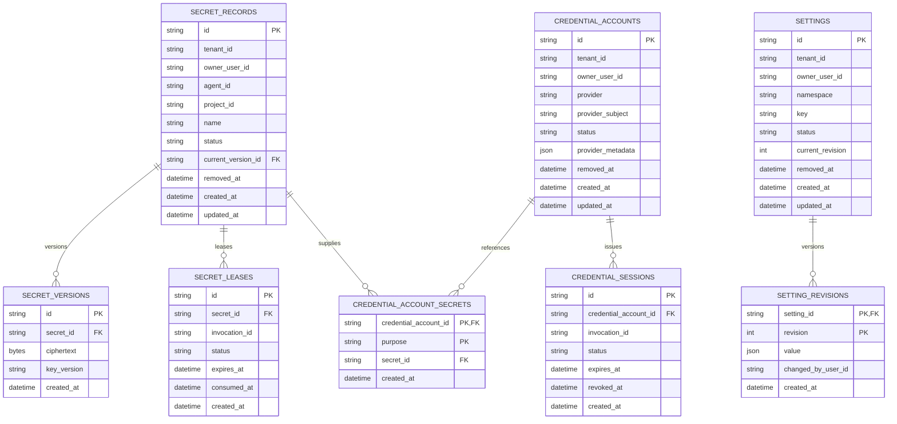
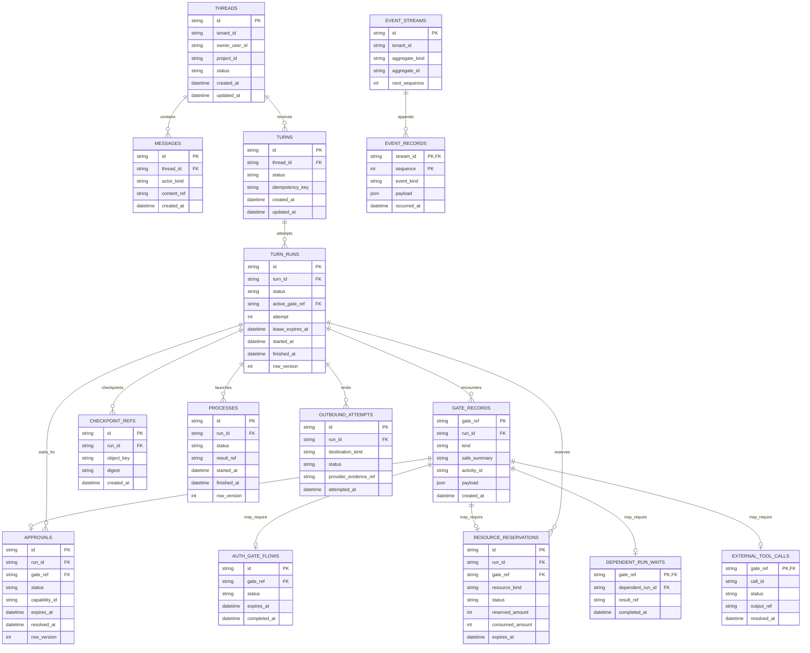
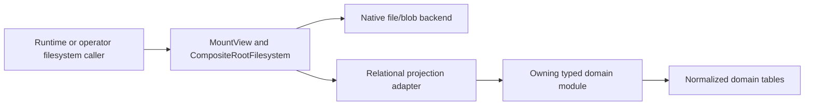

# Target Relational Model

**Status:** Proposed architecture, not a frozen schema

**Date:** 2026-07-24

**Purpose:** Show which relationships the database should eventually understand
without replacing Reborn's typed domain ownership or universal dispatch seam.

The entities below are conceptual. Names, columns, and boundaries must be
validated against each owning crate before a migration is written.

Adopting normalized domain adapters would deliberately revise the accepted
"one entry type" persistence decision and the current repository rule that new
domain persistence uses `RootFilesystem`. This document is not implementation
permission: the ADR, storage contracts, architecture tests, and repository
guidance must be updated together before the first normalized Reborn adapter
lands.

## Target storage planes

The target is a hybrid model with four physical planes:

| Plane | Use it for | Primary guarantees |
| --- | --- | --- |
| Relational control plane | identity, membership, lifecycle, settings, credential metadata, runtime coordination | foreign keys, uniqueness, checks, transactions, typed indexes |
| Blob/object plane | compiled extensions, package assets, project files, large outputs, opaque checkpoint payloads | content integrity, streaming, size isolation, retention |
| Append plane | domain events, audit evidence, delivery history, resource deltas | ordering, immutability, cursors |
| Derived/search plane | memory chunks, embeddings, full-text indexes, event projections | rebuildability and query performance |

`RootFilesystem` can continue to route the blob, generic-record, and append
planes. Domain repository adapters should route relational entities to typed
tables while preserving the same public domain interfaces.

## Relational placement rules

Put a value in a typed column when it participates in identity, scope,
uniqueness, joins, lifecycle, authorization, retention, or routine filtering.
Use JSON only for an evolving provider payload or genuinely unstructured
metadata. Do not put a foreign key solely inside JSON.

A conventional mutable entity should normally carry:

```text
id
tenant_id
owner_user_id or another explicit owner
status
created_at
updated_at
version
removed_at or archived_at when history must remain
```

The exact columns vary by domain. `version` is an optimistic concurrency value,
not a substitute for a transaction when several rows form one invariant.

Large immutable bytes should be content-addressed in the blob plane and
referenced by digest/key. The relational row owns metadata and lifecycle; the
blob store owns bytes. References to an object store or external provider are
logical references and cannot use a physical SQL foreign key.

## Identity and access



Recommended constraints include:

- unique external identity on
  `(tenant_id, surface, provider, provider_instance, subject)`;
- unique verified email on `(tenant_id, normalized_email)`;
- user, identity, session, and token tenant IDs must agree;
- status values use closed database checks or database enums;
- bearer material is never stored in plaintext.

The current signed WebUI session is stateless apart from an in-process bounded
revocation denylist. `AUTH_SESSIONS` is therefore a target choice if durable
logout, multi-instance revocation, or operator session inspection is required,
not a description of the present implementation.

## Extensions and user installation state



This replaces the highest-pressure current shape: installation membership is
embedded in serialized installation data, while compiled package bytes,
manifests, and mutable lifecycle state share one virtual namespace.

Important target rules:

- package rows are immutable and unique by extension/version/content digest;
- package bytes live in the blob plane, not in a lifecycle row;
- a tenant installation points to exactly one package version at a time;
- user membership is a join entity, not a set embedded in an installation blob;
- disabling/removing a membership updates status/timestamps rather than
  destroying its history by default;
- credential bindings reference credential metadata, never secret material;
- evolving admin configuration may remain JSON, but identity, scope, status,
  revision, and authorship are typed columns;
- revision rows make configuration history explicit instead of requiring the
  current blob to carry its own audit history.

`USER_EXTENSION_MEMBERSHIPS` should have a unique constraint on
`(installation_id, user_id)`. The surrogate ID gives credential bindings a
simple foreign key while the compound uniqueness still expresses membership
identity.

## Secrets, credentials, and settings



Secret metadata and encrypted material can be separated further if a KMS/HSM
owns ciphertext. The invariant is that user/provider/account relationships are
queryable without decrypting secrets, while secret values remain inaccessible
to generic listing, logging, or model-facing paths.

Product-auth flow and interaction records are short-lived coordination state.
They may use a relational flow table with explicit expiry and uniqueness or a
generic record plane if their lifecycle is strictly bounded. Durable credential
accounts and runtime credential sessions should converge on one canonical
account identity model rather than retaining competing account records.

Settings must also preserve the boundary among:

- bootstrap configuration in `config.toml`;
- provider catalog definitions in `providers.json`;
- mutable persisted settings;
- encrypted credentials and provider session material.

Moving everything into one `settings` table would recreate the same ambiguity
in a different form.

## Conversation and runtime state



Message bodies, process outputs, and checkpoint payloads may be blob references
rather than inline values. Small message text can remain inline if size,
encryption, and retention constraints support it.

This diagram does not collapse conversation, turn coordination, process
lifecycle, approval, resource, or outbound semantics into one repository.
Each owning crate still defines its allowed operations. The diagram only makes
the cross-domain identifiers and physical relationships explicit.

### Blocked gates

Blocked state has two distinct authorities:

- `TURN_RUNS.status` plus `active_gate_ref` is the canonical answer to whether a
  run is currently parked;
- `GATE_RECORDS` is the write-once, retained, model-visible explanation and
  resume payload keyed by the opaque gate reference.

`GATE_RECORDS` deliberately has no mutable lifecycle status. Approval, auth,
resource, dependent-run, and external-tool modules own their respective
resolution state. A run may encounter multiple gates over its history, while
`active_gate_ref` points to at most one current gate.

The turn module continues to own the park/resume logic. The relational adapter
should make a gate transition atomic:

1. insert the immutable gate record;
2. insert or update the gate-kind-specific coordination record;
3. set the run's blocked status and `active_gate_ref` using the expected row
   version;
4. append or enqueue the blocked lifecycle event.

Resume checks actor ownership, expected blocked status, gate reference, and row
version immediately before resolving the kind-specific record and clearing the
active gate. The historical gate record remains. Database checks can require a
blocked status to have an active gate and a non-blocked status not to have one;
the typed turn transition enforces that the status variant matches the
referenced gate kind.

## Derived and search data

Memory chunks, embeddings, full-text search indexes, event projections, and
operator dashboards are derived data. Their schema should carry a source
version/digest and be safely rebuildable from canonical documents or events.

Do not make a search index the only record of:

- a memory document;
- an extension installation;
- a credential binding;
- a message;
- a completed external side effect.

Provider-issued or durable host evidence for side effects belongs in canonical
event/outbound records, even if a projection makes that evidence easier to
query.

## Preserving filesystem and directory behavior

The virtual filesystem remains a useful product and runtime interface. The
target changes which layer is authoritative, not whether callers can navigate
paths.

There are three mount patterns:

| Mount pattern | Canonical physical store | Filesystem behavior |
| --- | --- | --- |
| Native file/blob mount | local filesystem, object store, or DB-backed bytes | `get`, `put`, `delete`, `list`, and `stat` operate on real file-shaped entries |
| Relational projection mount | normalized domain tables | `get`, `list`, `stat`, and bounded `query` synthesize directory entries and JSON views from rows |
| Generic record mount | `root_filesystem_entries` | existing record/CAS behavior for explicitly retained schemaless domains and migration compatibility |

For example:

```text
/system/extensions/github/manifest.toml
  -> native package/blob content

/system/extensions/.installations/installations/{installation_id}.json
  -> read-only projection assembled from extension_installations,
     user_extension_memberships, and extension_packages

/gate-records/{gate_ref}.json
  -> read-only projection of one gate_records row
```

`CompositeRootFilesystem` and `MountView` can keep longest-prefix routing,
virtual directory semantics, and tenant/user scope enforcement. A relational
projection adapter may satisfy the read-oriented subset of `RootFilesystem` for
its mounted path. Generic `put` and `delete` on that projection must be rejected
unless they validate and invoke the owning typed domain operation; directly
editing synthesized JSON would bypass foreign keys, lifecycle transitions,
audit, and authorization.

The relational row ID is authoritative. Projection paths are deterministic,
reversible encodings of typed IDs, not independent identities. Directory
listing is a query over typed scope and parent columns, not a scan whose only
understanding of hierarchy comes from string prefixes.

This preserves current runtime-facing paths while separating two concerns:



Normal product mutations call the typed domain module directly. The projection
adapter is primarily a compatibility, inspection, import/export, and
runtime-readable view. This keeps the module interface deep: callers do not
need to know which physical plane stores a path, while relational invariants
remain inside the owning module and database adapter.

## What happens to `root_filesystem_entries`

The table should remain available, but its role narrows:

1. blob-like DB-backed entries for embedded deployments;
2. opaque, self-contained, low-volume records;
3. compatibility records during staged migrations;
4. projections or import/export views;
5. backend-neutral test implementations.

Each normalized domain needs a compatibility decision:

- dual-read with one authoritative writer;
- backfill and cut over;
- projection from normalized tables into the virtual filesystem;
- or continued generic storage with an explicit reason.

Dual-write without an explicit authority and repair rule is not an acceptable
steady state.

## Transaction and deletion principles

Schema design should make lifecycle visible even though detailed mutations are
out of scope here:

- use status plus lifecycle timestamps for user-visible installation,
  membership, account, and configuration history;
- use immutable revision/version rows for values whose history matters;
- use hard deletion or cryptographic erasure when policy requires actual secret
  destruction;
- place rows that must change atomically in one database transaction boundary;
- use an outbox/event record when a database transaction must coordinate with a
  blob store or external provider;
- never depend on an untyped JSON field to implement a cascade or uniqueness
  invariant.

## Compatibility boundary

PostgreSQL and libSQL remain required production/embedded targets unless a
future contract explicitly changes that rule. Proposed types and constraints
must use a shared subset or have tested dialect adapters. Domain-specific
repositories should hide those differences from callers.
