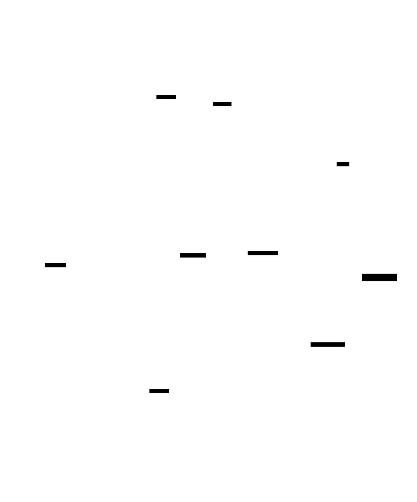
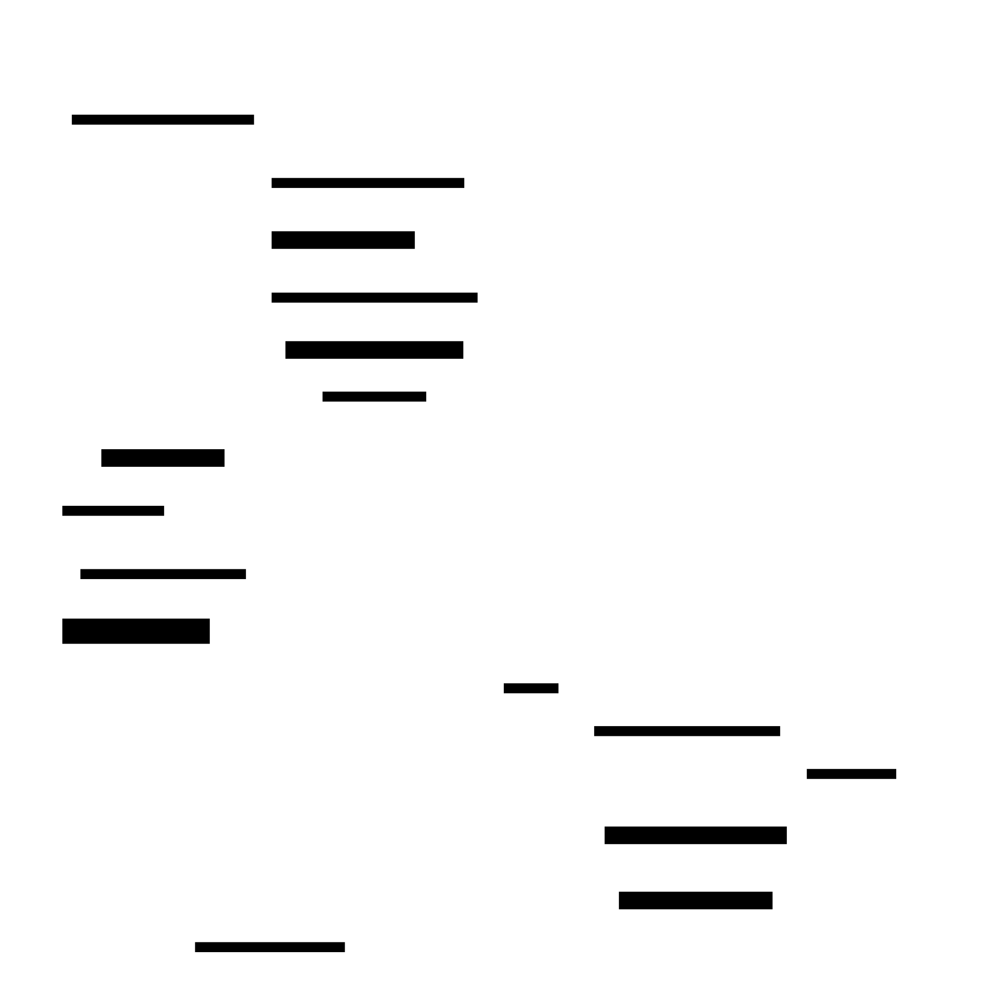
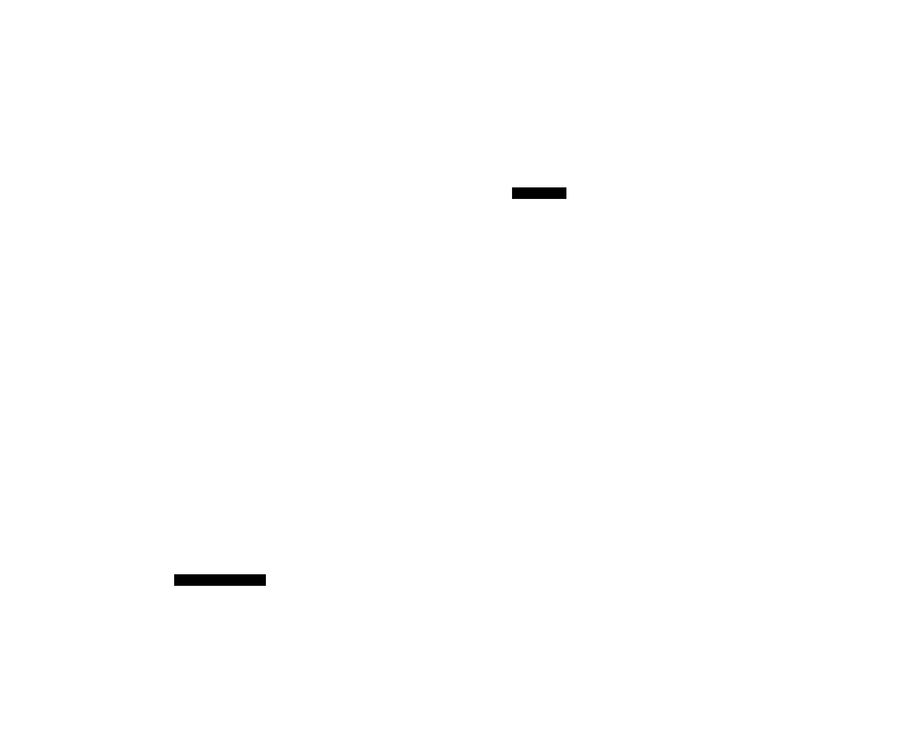

# Subagent Spawn for the Reborn Agent Loop — Design

**Status:** Implemented for blocking mode; background mode deferred
**Date:** 2026-05-19
**Branch:** `subagent-spawn-design`
**Scope:** `crates/ironclaw_agent_loop`, `crates/ironclaw_turns`,
`crates/ironclaw_loop_support`, `crates/ironclaw_reborn`,
`crates/ironclaw_reborn_composition`

This is the **overarching design doc**. Per-phase implementation docs (detailed,
with pseudo code) live alongside this file:

- [`phase-1-contracts.md`](./phase-1-contracts.md) — contracts & isolated units
- [`phase-2-mechanisms.md`](./phase-2-mechanisms.md) — spawn, prompt, driver, observer
- [`phase-3-integration.md`](./phase-3-integration.md) — wiring & end-to-end tests

---

## 1. Context & motivation

The IronClaw **Reborn** agent loop has no way for a running agent loop to spawn a
child loop. The broader goal is a *system around agent loops* covering four loop
types — **subagents**, long-running **missions**, **cron** jobs, and **trigger**
(event-matched) jobs. This design delivers **subagents first**; the other three
become additive later (each is a new `LoopFamily` plus a new turn *submitter*,
with no rework of what this design ships).

A **subagent** is a child agent loop with a fresh context, an attenuated tool set,
its own model and "direction" (persona), spawned by a parent loop. The current
implementation exposes **blocking** behavior only: the parent waits until the
child reaches a terminal state and then resumes with the child result.

Background subagents are deliberately disabled pending the durable completion
delivery design tracked in [#4147](https://github.com/nearai/ironclaw/issues/4147).
The public `spawn_subagent` schema does not expose a mode field. Omitted mode
defaults to blocking, legacy explicit `mode: "blocking"` and
`run_in_background: false` inputs are accepted for compatibility, and explicit
background requests are rejected before child-run side effects.

This design was produced through an iterative review process and hardened by a
four-reviewer pass (design / bugs / conventions / security) against the live
crates. Section 8 (Security model) and Section 9 (Failure & concurrency model)
exist because of that review.

### Legacy / out of scope

`src/agent/`, `src/worker/`, `src/tools/`, and `crates/ironclaw_engine/` are
**legacy** and are not designed against. The Reborn loop is the only target.

## 2. Goals & non-goals

**Goals**

- A running agent loop can spawn one or more child agent loops via a tool call.
- Child loops have a fresh context, an attenuated capability surface, their own
  model, iteration/cost budget, and "direction" (persona prompt).
- Results return to the parent through the blocking path.
- Preserve compatibility for legacy explicit blocking inputs while rejecting
  explicit background requests until durable completion delivery is designed.
- Parallel spawns: one parent turn may spawn N children that run concurrently.
- The design generalises: missions/cron/triggers slot in as new families +
  submitters without reworking subagents.
- Static over dynamic — no plugin system; the set of subagents is a closed
  compile-time table.

**Non-goals (v1)**

- Mission / cron / trigger loop types (future; seams only).
- Nested parent↔child UI/event linkage (child shows as a normal standalone thread).
- `Fork` seed mode (full parent-context copy) — enum variant reserved, unimplemented.
- File-discovered, user-defined subagent flavors.

## 3. Glossary (Reborn loop terms)

| Term | Meaning |
|---|---|
| **Turn / run** | One unit of work in a thread scope. `TurnCoordinator::submit_turn` queues it; a `TurnRunnerWorker` claims and drives it. |
| **`TurnScope`** | `(tenant_id, agent_id?, project_id?, thread_id)` — the coordination key. Active-run exclusivity is per-scope. |
| **`LoopFamily`** | A sealed, static composition of the nine loop strategies — the *mechanics* of a loop. Built-in only; not a plugin system. |
| **`PlannedDriver`** | Adapts one `LoopFamily` + the executor to the `AgentLoopDriver` contract. A run reaches a family only via run-profile → driver → family. |
| **Run profile** | `ResolvedRunProfile` — per-run config: capability surface, model, budget, driver descriptor. |
| **Loop-host port** | A `LoopXxxPort` trait the executor calls for host I/O (context, model, capability, checkpoint, …). Strategies *decide*; ports *execute*. |
| **Gate** | A capability invocation can return a gate (`Approval`/`Auth`/`Resource`, and — new — `AwaitDependentRun`). The loop checkpoints `BeforeBlock` and returns `LoopExit::Blocked`. |
| **`CapabilityOutcome`** | What a capability invocation yields back to the executor: a result, a gate, a spawned process — and, new, a spawned child run. |
| **Spawn tree** | The transitive ancestor closure of a run via `parent_run_id`. Every child carries a `spawn_tree_root_run_id` for atomic per-tree accounting. |

## 4. Design principles

1. **The loop family is the loop-type discriminator.** A subagent run = a run of
   the `subagent` `LoopFamily`. No parallel "origin" enum duplicating that.
2. **Codebase-native mechanism.** Spawn is an ordinary capability; its host port
   impl returns a *new `CapabilityOutcome` variant* — the exact shape the executor
   already handles for process spawn and for gates. No new executor routing.
3. **Static over dynamic.** Subagent flavors are a compile-time table; direction
   prompts are `include_str!`'d `.md` files. No plugin loader.
4. **Respect crate boundaries.** The sealed loop framework stays product-agnostic;
   `ironclaw_turns` owns coordination contracts; `host_runtime` is untouched.
5. **Fail loud, fail closed.** No silent fallbacks on store/IO; security gates
   reject by default. Every concurrency-relevant write is durable before any
   side-effect (no in-memory source of truth for distributed state).

## 5. Architecture

> Diagrams below are rendered from D2 sources in [`diagrams/`](./diagrams/) —
> edit the `.d2` file and re-run `d2 <name>.d2 <name>.svg`.

### 5.1 Dependency layering (acyclic)


### 5.2 The spawn mechanism — corrected

An earlier draft proposed the executor "routing a `SpawnChildRun` effect" to a
dedicated port. **The real executor cannot do this** — it batches all tool calls
to `invoke_capability_batch`, and `CapabilityCallCandidate` carries no effect
field; `EffectKind` is deliberately not propagated to the loop layer.

The mechanism therefore is:

`spawn_subagent` is an **ordinary capability** in the visible surface. Surface
visibility is not authority. The executor invokes it through the existing
`invoke_capability_batch` path, and the host-side capability-port impl delegates
to an explicit kernel-mediated subagent-spawn service before any thread, goal,
gate, or turn side effect. That service performs the same fail-closed checks a
first-party host capability must perform: grant/lease or approval policy,
resource admission, scope consistency, owner/project binding, spawn-tree
reservation, and redacted denial. Only after those checks pass does it create
the child thread/run state and return the blocking outcome:

- **blocking** →
  `CapabilityOutcome::AwaitDependentRun { gate_ref, safe_summary }` — a gate
  outcome; the executor maps it to `GateKind::AwaitDependentRun` and then follows
  the existing `checkpoint BeforeBlock → LoopExit::Blocked` path.

The earlier background outcome
`CapabilityOutcome::SpawnedChildRun { child_run_id, result_ref, safe_summary }`
is not exposed while #4147 is open.

No `EffectKind` change and no new executor routing. The executor only gains the
mechanical `CapabilityOutcome` arm that maps blocking spawns to the existing
gate path. The authority boundary is the kernel-mediated subagent-spawn service
behind the loop capability port, not the capability surface allowlist.

The `result_ref` payload schema is **defined** (not implicit) — see §6 row
"Spawn-result payload".

### 5.3 What changes — by layer

```
ironclaw_agent_loop    + `subagent` LoopFamily (static composition)
(sealed framework)     + GateKind::AwaitDependentRun (pub(crate), wire-stable)
                       (executor: unchanged)

ironclaw_turns         + CapabilityOutcome::AwaitDependentRun
                         (`SpawnedChildRun` reserved for deferred background)
(coordination)         + AwaitDependentRun across LoopGateKind / LoopBlockedKind /
                         BlockedReason  and  TurnStatus::BlockedDependentRun
                       ~ SubmitTurnRequest and TurnRunRecord:
                         + parent_run_id, subagent_depth, spawn_tree_root_run_id
                       + children_of(scope, run_id), get_run_record(scope, run_id),
                         reserve_tree_descendants(scope, root_run_id, delta, cap)
                         store queries / atomic admission
                       + SpawnTreeReservation rows (per-root atomic descendant
                         count — "reserve before queue", durable)
                       + TurnCoordinator::prepare_turn(scope) -> reserved TurnRunId
                         and SubmitTurnRequest.requested_run_id
                         — caller-known run id BEFORE submit; replaces the
                           staging-key-then-rekey workaround. Missions/cron/triggers
                           will all need this same shape.
                       + DefaultTurnCoordinator::with_event_sink(...)

ironclaw_loop_support  + spawn handling in the capability-port impl
(host I/O glue)        ~ prompt/context port: direction system msg + user-role goal
                       + attenuation (CapabilityAllowSet) + hard allow_nesting gate

ironclaw_reborn        + `subagent` PlannedDriver + run-profile→driver binding
(loop library)         + built-in subagent flavor table + direction .md files
                       + DURABLE subagent goal store (DB-backed; piggybacks on
                         turn-state persistence — not an in-memory store)
                       + SubagentCompletionObserver (TurnEventSink)

ironclaw_reborn_composition
(product composition)  + concrete product-live subagent assembly:
                         DB-backed store construction, root-provided
                         PendingGateProjectionSink adapter, composite event
                         sink, restart-reconciler task, and runtime wiring
                       + RestartReconciler — startup sweep + periodic poll over
                         terminal child runs lacking gate-resolved / delivered
                         observer outputs (fixes the "event lost between commit
                         and observer dispatch" hole)
                       + AutonomousContinuationBudget (per-tree wake/turn quota
                         + per-time-window quota to bound self-amplifying spawn
                         cascades)
                       ~ runtime.rs wiring

ironclaw_host_runtime / ironclaw_host_api   — unchanged
```

### 5.4 Considered alternative — why not `Process`

A natural question is whether `crates/ironclaw_processes/` (the Reborn kernel's
existing `Process` abstraction, reachable today via `CapabilityHost::spawn_json`
+ `EffectKind::SpawnProcess` + `CapabilityOutcome::SpawnedProcess`) is the right
substrate for a subagent. **It is not.**

`Process` is for **OS-level capability invocations** — external subprocesses,
WASM sandbox runs, etc. The shape it provides:

- `ProcessRecord` carries `parent_process_id` (process-to-process lineage),
  `runtime: RuntimeKind`, `grants: CapabilitySet`, `mounts`, `extension_id`.
  **No `TurnScope`, no `TurnRunId`, no `parent_run_id`.**
- Status enum: `Running | Completed | Failed | Killed`. **No gate states** — no
  Approval / Auth / Resource / AwaitDependentRun equivalent.
- `ProcessManager::spawn` is fire-and-forget; the manager does not hold blocking
  / resumable lifecycle.
- `ProcessResultStore::complete/fail/kill` has **no observer or wake signal** —
  nothing equivalent to `SubagentCompletionObserver` resuming a parent or
  submitting a follow-up turn.
- Cancellation = a cooperative token per process. **No subtree cascade.**
- Authority = explicit `grants` passed at spawn time. **No "surface ceiling"
  attenuation, no inheritance discipline.**

A subagent needs all of: `TurnRunId`-keyed identity, `parent_run_id` +
`spawn_tree_root_run_id` lineage, blocking gate (`AwaitDependentRun`), checkpoint
state, loop-family + run-profile selection, prompt composition via the loop-host
ports, autonomous-wake delivery into the parent thread transcript, restart
reconciliation, recursive subtree cancellation with tombstones, and per-tree
durable descendant reservation. Wiring those onto `Process` would require
duplicating the entire turn-coordination layer (and its store schema) inside
`ironclaw_processes`. That violates crate boundaries — `ironclaw_turns` owns
turn execution; `ironclaw_processes` owns OS-level work — and produces more
code, not less.

**Conclusion:** a child agent loop is **not** an OS process. It is a
`TurnRunId`-keyed run driven by the same `TurnRunnerWorker` pool that drives the
parent, selected by the `subagent` `LoopFamily`. `Process` and the subagent
mechanism are **peer effect kinds** (each with its own `CapabilityOutcome`
variant), not stacked layers.

### 5.5 Static vs dynamic — ownership boundaries

Everything that defines *what subagents exist* is **static** — compiled into the
binary, identical in every deployment, no plugin loader, no runtime swapping. Only
*per-run* state (the goal, run ids, gates, lineage) is **dynamic**, created at
spawn time and keyed by the coordinator-minted `TurnRunId`.


## 6. Detailed design — locked decisions

| Area | Decision |
|---|---|
| Execution | In-process child runs, runner-worker driven. |
| Result modes | Blocking only in the public schema. Background is deferred pending #4147. |
| Spawn surface | `spawn_subagent` capability with `flavor_id`, `task`, and optional `handoff`; host port returns `AwaitDependentRun { gate_ref, safe_summary }` for blocking. Legacy explicit blocking inputs are accepted; explicit background inputs are rejected before child-run side effects. |
| **Spawn-result payload (schema)** | For blocking mode, `result_ref` resolves to a typed JSON document the parent's model receives as the tool result. Fields: `child_run_id: TurnRunId`, `child_thread_id: ThreadId`, `flavor: SubagentFlavorId`, `mode: "blocking"`, `status: "completed" \| "failed" \| "cancelled"`, `output_available: bool`, `final_text: Option<String>` (sanitised), `failure_summary: Option<SanitizedFailure>`. Background payload shape is deferred with #4147. |
| **`requested_run_id` / `prepare_turn`** | A `TurnCoordinator::prepare_turn(scope) -> TurnRunId` API mints a `TurnRunId` **before** any side-effect; `SubmitTurnRequest.requested_run_id: Option<TurnRunId>` lets the submitter pass it in so the coordinator binds the prepared id rather than minting a new one. The spawn handler uses this to **persist the goal under the real child run id from the start** — no staging key, no rekey. Generalises to missions/cron/triggers (any submitter that needs to "persist dependent state before submit"). |
| Blocking | The `AwaitDependentRun` gate and its awaited child-run **set** are recorded **at spawn time, before `submit_turn`** — durable. The gate awaits a set; the parent resumes once, after the **last** child is terminal. If every child is already terminal when the parent would block, the gate resolves **inline** (no `Blocked`). |
| **Blocking interruptibility** | A parent blocked on `AwaitDependentRun` is interruptible by the normal `cancel_run(parent)` path — propagates a recursive subtree cancel (§7.5). **Blocking subagents are for short, bounded work**; long-running detached children require the deferred background design. |
| Resume payload | One synthetic `GateRef`; a host-side gate-resolution store holds all N child results, mapped back to the N pending tool calls. |
| Child failure | Failed/cancelled children produce a typed result entry; the gate waits for **all** children to reach terminal — no early resume, no sibling cancellation. |
| Background delivery | Deferred pending #4147. The historical design was `accept_inbound_message` plus coalescing parent wake, but this is not exposed until durable delivery semantics are settled. |
| **Autonomous-continuation budget** | Deferred with background delivery (#4147). The historical design bounded self-amplifying background wake cascades with per-tree and per-time-window wake quotas. |
| Child authority | The child run starts with an **empty grant/lease set** — no inheritance of parent grants/leases. The capability allowlist is a surface *ceiling*, not authority. The child re-acquires every lease via its own `Approval` gate on its own thread. |
| **Child approval ownership** | Child runs inherit the parent's `owner_user_id` AND `project_id` — **enforced in spawn code** (the child `ensure_thread` + `SubmitTurnRequest` copy both verbatim from the parent run record; deviation = typed error, not silently filled). A child's `Approval` gate surfaces on the **child thread** addressed to that owner — the parent user is the approver. The child thread is user-visible in the same surface as any other thread under that user; UI nesting is the deferred linkage. |
| **Approval surfacing (projection, not bridge)** | A turn transitioning to `TurnStatus::BlockedApproval` does NOT currently populate the engine's `PendingGateStore` that the UI queries — they are two disconnected systems. **A direct write-hook bridge in `block_run()` is fragile** (matches the split-brain shape `.claude/rules/gateway-events.md` exists to prevent). Instead: `PendingGateStore` becomes a **derived projection** of `TurnLifecycleEvent` — a projection consumer reads turn events and materialises the same read model the UI already queries. One source of truth (turn events), replayable from a cursor, restart-safe, idempotent. The UI surface is unchanged. Affects every blocked turn (not subagent-specific) — landed as prerequisite **P0** (see §11). |
| Nesting | Hard gate: a spawn from a flavor with `allow_nesting=false` is rejected regardless of surface membership. Plus a depth cap (`subagent_depth` field, checked before `submit_turn`) and a per-turn fan-out cap. |
| **Per-tree descendant atomicity** | The per-run-tree descendant cap (`MAX_TREE_DESCENDANTS`) is enforced via a **durable `SpawnTreeReservation` row keyed by scoped `spawn_tree_root_run_id`** — `reserve_tree_descendants(scope, root, delta, cap)` is atomic at the store, fails closed without mutation when over cap, and runs **before `submit_turn`**. Concurrent admit across subtrees cannot over-admit. (Concurrent parent turns on the *same* parent thread are impossible by the per-`TurnScope` active-run lock, but a single root can have many concurrent subtrees on different threads.) |
| Loop family | One static `subagent` `LoopFamily` (`LoopFamilyId "subagent"`); default strategies + tighter `BudgetStrategy`. Bound to a dedicated `subagent` `PlannedDriver`. |
| Flavors | Built-in static table — v1: `general`, `researcher`. Each: direction id, tool allowlist, model, iteration + token/cost budget, `allow_nesting`. |
| Direction prompt | Static `.md` per flavor (`include_str!`, `ironclaw_reborn/src/directions/`), selected by static match. The system message. |
| Goal placement | The parent-injected goal + `Handoff` blob are the child's **first user message**, delimited as task data (`## Task (from parent)` / `## Context from parent`). **Never** the system message — the goal is model-generated and may carry upstream-tainted content. |
| **Goal durability (DB-backed)** | Persisted in a **durable, DB-backed** subagent goal store keyed by the child `TurnRunId`. Implementation piggybacks on turn-state persistence (the same backend that stores `TurnRunRecord`). The child run id is **known before** `submit_turn` via `prepare_turn` — no staging key, no rekey. Survives process restart by construction. A store miss **fails the child run loudly**. |
| Lineage | `parent_run_id`, `subagent_depth`, and `spawn_tree_root_run_id` fields on `SubmitTurnRequest` and `TurnRunRecord` (durable). `children_of` and `get_run_record` are store queries — no in-memory index as source of truth. |
| **Restart reconciliation** | `with_event_sink` gives live delivery, but a process crash between *child terminal commit* and *observer dispatch* would strand a parent gate. `RestartReconciler` runs at startup and on a periodic timer: scans terminal child runs whose lineage points at a parent with an unresolved `AwaitDependentRun` gate and replays the observer resume action. Background-result reconciliation is deferred with #4147. Idempotent via the same `external_event_id` keying the live path uses. |
| **Cancellation tombstone** | A child completing terminal during a subtree cancel **does not silently drop**. It writes a typed `SubagentResultTombstone { child_run_id, disposition: "discarded_by_parent_cancel", terminal_status }` so reconciliation can distinguish "intentionally discarded" from "lost in the gap". |
| Idempotency | Child `submit_turn` key = `(parent_run_id, parent_turn_id, spawn-call ordinal)` — deterministic for replay, unique per spawn call even for identical-argument siblings. The `requested_run_id` further pins which `TurnRunId` the coordinator binds for replay. |
| Tenancy | The child `TurnScope` copies `tenant_id`/`agent_id`/`project_id` **verbatim**; only `thread_id` differs (fresh). Test-enforced invariant. |
| Child output trust | A child result crossing back to the parent is **untrusted data** — wrapped in a delimited block, channel-edge sanitised, and safety-scanned before it enters the parent thread. |
| Context seed | `Fresh` (goal only), `Handoff(String)` (goal + curated parent blob, re-materialised into the child scope). `Fork` reserved, unimplemented. |

## 7. Flows

### 7.1 Loop execution — pause & exit points

A subagent run is an ordinary agent-loop run. The executor cycles
context → model → capability calls, **checkpointing** at four points (the pause
points) and terminating at one of four `LoopExit` outcomes (the exit points). The
blocking-spawn gate reuses the `BeforeBlock` checkpoint + `LoopExit::Blocked` path
that approvals already use.



### 7.2 Spawn flow — blocking

`spawn_subagent` is an ordinary capability; the `ironclaw_loop_support` capability
port handles it and returns an `AwaitDependentRun` gate. Background branches in
the diagram are historical design context and are not exposed by the current
schema.



### 7.3 Blocking lifecycle — parent suspension & child runs

In blocking mode the parent suspends on the `AwaitDependentRun` gate (releasing its
runner worker, keeping its thread lock) while N children run concurrently, each its
own coordinator-managed run. The parent is **interruptible** via `cancel_run` —
blocking is not "stuck", it is "waiting under cancellation".


### 7.4 Autonomous wake (background)

Background autonomous wake is not active in the current implementation. This
section captures the deferred design space for #4147.

When a background subagent completes and **the parent is idle / no user is
interacting**, the parent still runs — `SubagentCompletionObserver`'s
`submit_turn(parent_scope)` **is the tick**. Reborn turns are
**coordinator-queued, not user-triggered**; any submitter can queue a turn for a
thread, and the runner-worker pool claims it. The observer is one such submitter
(channels are another). No user presence is required for the parent to wake.

**Result and tick are decoupled.**

| Concept | Where it lives | Lifetime |
|---|---|---|
| Subagent result data | A message in the **parent thread transcript** (provenance-tagged `SubagentResult`) | Durable |
| Wake signal | A **queued parent turn** from `submit_turn(parent_scope)` | Transient — collapsed into the next-claimed turn |

That decoupling is what makes coalescing work: **N child completions stage N
transcript messages but only 1 queued parent turn**, which consumes all N at
once via the normal context-load path. `ThreadBusy` from a second `submit_turn`
is expected ("already pending — message will be consumed"), not an error.

**Cascade and continuation bounds.** Autonomous wake can drive its own follow-up
spawns (parent processes results → spawns more subagents → those complete → wake
parent again → loop). Two independent budgets bound this:

- **Per-spawn caps** (see §8): `MAX_TREE_DESCENDANTS`, `MAX_SPAWN_PER_TURN`,
  `subagent_depth` — enforced before `submit_turn` via the atomic
  `reserve_tree_descendants`. Bounds the *total number of spawns*.
- **Autonomous-continuation budget**: per-tree wake-turn count + per-time-window
  rate. Bounds the *number of background-driven parent wakes* even when each
  individual wake spawns ≤ the per-spawn cap. Exceeding the budget suspends
  further wake submissions for that tree and emits
  `AutonomousContinuationStopped` for triage.

### 7.5 Cancellation

```
parent CancelRequested
 └ SubagentCompletionObserver: children_of(parent) via durable parent_run_id
      recursively cancel_run the whole lineage subtree (BFS over parent_run_id)
      a child completing mid-cancel → writes a SubagentResultTombstone
        { disposition: discarded_by_parent_cancel, terminal_status }
        — NOT silently dropped; reconciliation distinguishes discarded vs lost
 a worker-released Blocked parent is driven to terminal Cancelled via the
   gate-abort path (it has no claiming worker of its own)
```

### 7.6 Restart reconciliation

The live observer path (`with_event_sink`) handles steady-state delivery. A
process crash between a child's terminal commit and the observer's dispatch would
otherwise strand a parent gate. `RestartReconciler` closes that hole:

- **Startup sweep:** scan terminal child runs whose lineage points at a parent
  with an unresolved `AwaitDependentRun` gate; replay the observer resume action.
  Background result reconciliation is deferred with #4147. Idempotent via the
  same `external_event_id` key.
- **Periodic poll** (every N seconds, configurable): same query, catches any
  in-flight event loss.

Reconciliation is purely additive — it never duplicates a delivered result.

## 8. Security model

The four-reviewer pass surfaced subagents as a meaningful attack surface. The
mitigations below are **load-bearing**, not optional.

1. **No authority inheritance.** A child starts with an empty grant/lease set.
   `CapabilityAllowSet` filters the *surface* only. A child must re-acquire every
   privileged lease through its own `Approval` gate. A subagent can never exercise
   a lease the parent obtained from a prior user approval.
2. **Approval ownership.** The child inherits the parent's `owner_user_id` AND
   `project_id` (enforced in spawn code — deviation is a typed error), so a child
   `Approval` gate surfaces to the same human who owns the parent — on the child
   thread, via the **pending-gate projection** of `TurnLifecycleEvent` (§6 row
   "Approval surfacing"). No parent-injection (UI nesting is the deferred
   linkage); no write-hook bridge to `PendingGateStore` (split-brain).
3. **Fork-bomb containment.** Depth alone is insufficient (N children each
   spawning N → N^depth). Three caps, all enforced **before `submit_turn`** via
   the atomic `SpawnTreeReservation`, all rejecting without queuing:
   `MAX_SUBAGENT_DEPTH`, `MAX_SPAWN_PER_TURN` (fan-out), `MAX_TREE_DESCENDANTS`
   (per-spawn-tree total — atomic via `spawn_tree_root_run_id` keyed reservation).
4. **Autonomous-continuation containment.** Per-tree wake-turn quota + rate-limit
   (§7.4) bound self-amplifying cascades that stay under the per-spawn caps.
5. **Nesting hard gate.** `spawn_subagent` exclusion is not left to denylist-by-
   omission in each flavor's allowlist. A `spawn_subagent` invocation from a flavor
   with `allow_nesting=false` is rejected outright, regardless of surface membership.
6. **Prompt-injection isolation.** The goal + handoff blob are model-generated and
   may carry upstream-tainted content. They go in the child's **user** message,
   delimited as task data — never the system message. The system message is the
   static, authored direction `.md` only.
7. **Child output is untrusted.** A child's result crossing back to the parent
   (tool result or inbound message) is wrapped in a delimited block, channel-edge
   sanitised (host paths / internal identifiers stripped), and run through the
   inbound `safety_layer` scan before it is stored in the parent thread.
8. **Tenancy invariant.** The child `TurnScope` copies `tenant_id`/`agent_id`/
   `project_id` verbatim; a spawn whose resolved scope deviates is rejected.
9. **Idempotency keys** are derived from `(parent_run_id, parent_turn_id, ordinal)`
   — collision-free across identical-argument sibling spawns, deterministic for
   replay. The `requested_run_id` pins which `TurnRunId` the coordinator binds.

## 9. Failure & concurrency model

| Hazard | Handling |
|---|---|
| Child completes before the parent blocks (lost wakeup) | The `AwaitDependentRun` gate + awaited set are recorded **before `submit_turn`**, durably. On entering the gate the parent reconciles against `get_run_state`. |
| All children finish before the parent blocks | Gate resolves **inline** — the parent never emits `Blocked`. |
| One child fails mid-flight | Failed/cancelled child = a typed result entry; the gate still waits for all children; siblings are not cancelled. |
| Two background completions race on the parent thread | Deferred pending #4147; background is not currently exposed. |
| Process restart **between child terminal commit and observer dispatch** | `RestartReconciler` (§7.6) sweeps at startup + periodically and replays observer actions; idempotent via `external_event_id`. The live event sink covers steady state; the reconciler covers the gap. |
| Process restart **general state** | Goal store is **DB-backed durable**; lineage (`parent_run_id`/`subagent_depth`/`spawn_tree_root_run_id`) is durable; `children_of` is a store query. No in-memory source of truth. A goal-store miss fails the child loudly. |
| Identical-argument sibling spawns | Distinct idempotency keys via the per-turn ordinal; `requested_run_id` pins the bound run id. |
| Parent cancelled | Recursive subtree cancel; worker-released Blocked parent driven to `Cancelled` via gate-abort. |
| Child completes terminal *during* a subtree cancel | Writes a `SubagentResultTombstone` (typed: `discarded_by_parent_cancel`) so reconciliation can distinguish discarded vs lost. |
| Child completes with no assistant message | Typed "completed, no output" result — the parent always receives N well-formed results. |
| Partial spawn (`submit_turn` fails after `prepare_turn` + reservation) | The reservation + awaited-set entry are the source of truth, written first; the half-spawn is reconciled (child absent or marked failed) and the reservation is released; fail loud. |
| **Per-tree descendant over-admit** | `reserve_tree_descendants(scope, root, delta, cap)` is **atomic at the store** and runs before `submit_turn`. Concurrent admit across subtrees (different threads) cannot over-admit. Concurrent admit on the same parent thread is precluded by the per-`TurnScope` active-run lock. |
| **Autonomous-continuation runaway** | Deferred with background autonomous wake (#4147). |
| **Blocking parent waiting indefinitely** | Parent is interruptible: `cancel_run(parent)` cascades through the subtree (§7.5). Blocking subagents are *for short bounded work*; long detached children require the deferred background design. |
| **Approval invisible to UI** (today, every blocked turn) | `block_run()` only writes `TurnStatus::BlockedApproval` + a `TurnLifecycleEvent` scoped to `TurnScope`; the engine's `PendingGateStore` (where the UI queries) is not populated. Fix is **prerequisite P0** (§11): make `PendingGateStore` a derived projection of `TurnLifecycleEvent`. Single source log; replayable from cursor; restart-safe; no `block_run()` dual-write. |

## 10. Crate boundary verification

| Crate | Rule | This design | Verdict |
|---|---|---|---|
| `ironclaw_agent_loop` | sealed; product-agnostic; refs not raw prompts | one `subagent` family; `GateKind::AwaitDependentRun` is neutral; executor gains only outcome-to-existing-gate/result mapping | ✅ |
| `ironclaw_turns` | coordination contracts; lifecycle metadata + refs | `CapabilityOutcome` variants, blocked-kind variants, lineage fields, `prepare_turn` API, atomic descendant reservation query | ✅ |
| `ironclaw_loop_support` | host-port adapter glue; no stateful stores | blocking spawn handling in the capability port; concrete stores and projection sinks are injected by composition | ✅ |
| `ironclaw_reborn` | generic loop library; driver/profile/readiness; no root `src/` adapters | family driver, profiles, flavors, directions, Reborn-neutral goal/tombstone traits, observer/reconciler logic, and readiness metadata | ✅ |
| `ironclaw_reborn_composition` | concrete product-live assembly; still no root `src/` imports | DB-backed store construction, root-provided `PendingGateProjectionSink`, composite event sink, and runtime assembly | ✅ |
| `ironclaw_host_runtime` / `ironclaw_host_api` | — | untouched | ✅ |

Five wire-stable enums gain `AwaitDependentRun` / `BlockedDependentRun`
variants, with `SpawnedChildRun` reserved for deferred background support:
`CapabilityOutcome`, `LoopGateKind`, `LoopBlockedKind`, `BlockedReason`,
`TurnStatus`. Each new variant **matches the existing serde
convention of its enum** — `LoopGateKind`/`LoopBlockedKind`/`CapabilityOutcome`
are snake_case; **`TurnStatus` and `BlockedReason` serialize PascalCase today**
(no `#[serde(rename_all)]`) and their new variants stay PascalCase to avoid
breaking already-persisted records. Each gets a raw-JSON round-trip test;
`#[non_exhaustive]` is added to the observability-carrier enums
(`LoopGateKind`/`LoopBlockedKind`) but **not** to the state-machine-gating enums
(`CapabilityOutcome`/`TurnStatus`), which should force a compile break at every
transition site. `TurnStatus::BlockedDependentRun` is a persisted-enum migration —
grep producers, add a legacy-value deserialization test, and update the two
exhaustive `TurnStatus` match sites in `ironclaw_turns` `memory.rs`
(`resume_turn_once`, `request_cancel_once`). See `phase-1-contracts.md`.

## 11. Implementation phases

The work is a 4-level DAG with a prerequisite (P0) that closes a general
"approval-invisible-to-UI" gap (not subagent-specific). Phase 1 and Phase 2 each
contain workstreams that run *mostly* in parallel — see the diagram for the
actual edges. Each workstream is an independently reviewable PR.



```
PHASE 0 — PREREQUISITE (general, not subagent-specific)
  P0    Pending-gate projection over TurnLifecycleEvent
          Make engine PendingGateStore a derived read model projected from
          TurnLifecycleEvent (single source log). Closes the "block_run writes
          BlockedApproval but UI sees nothing" gap for every blocked turn —
          system-issued cancellation turns today, all future loop types
          (subagent, cron, mission, trigger). Replayable from cursor.
          Lives in ironclaw_event_projections (consumer) + the existing
          PendingGateStore reader surface (unchanged for UI).
          ── must land before Phase 2's subagent paths are useful in production;
             can be built in parallel with Phase 1.

PHASE 1 — Contracts & isolated units                                [needs none]
  P1.A  ironclaw_turns contract additions
          (CapabilityOutcome variants, blocked-kind variants, lineage fields,
           prepare_turn / requested_run_id, tree-descendant-reserve query,
           with_event_sink)
  P1.B  ironclaw_agent_loop: `subagent` family + GateKind::AwaitDependentRun
          ── needs P1.A's variant names; in practice land P1.A first, then P1.B
             can build in parallel with P1.C
  P1.C  ironclaw_reborn data: direction .md files, DB-backed goal-store schema,
        flavor table, SpawnTreeReservation row schema
          ── independent of P1.A/B at the data level

PHASE 2 — Mechanisms                   (4 parallel workstreams; each needs Phase 1)
  P2.A  loop_support: spawn handling in the capability-port impl   [needs P1.A, P1.C]
          uses prepare_turn + reservation; persists goal under known child id
  P2.B  loop_support: prompt composition + attenuation             [needs P1.A, P1.C]
          system = direction .md ; user = goal + handoff
  P2.C  ironclaw_reborn: `subagent` PlannedDriver + profile binding [needs P1.B]
          + child runs inherit parent owner_user_id
  P2.D  ironclaw_reborn: SubagentCompletionObserver                [needs P1.A, P1.C]
          live delivery; writes SubagentResultTombstone on mid-cancel completes
        ── P2.A and P2.B touch the same crate but different files; coordinate
           file ownership (capability port vs prompt port).

PHASE 3 — Integration                  (single workstream; needs all of Phase 2)
  P3    runtime.rs wiring · spawn_subagent capability surface entry ·
        RestartReconciler (startup + periodic) ·
        AutonomousContinuationBudget enforcement ·
        end-to-end integration tests · quality gate
```

Detailed per-phase docs with pseudo code:
[phase-1](./phase-1-contracts.md) · [phase-2](./phase-2-mechanisms.md) ·
[phase-3](./phase-3-integration.md).

## 12. Verification strategy

- **Unit tests** per crate — see each phase doc.
- **Integration tests** (`tests/reborn_subagent_spawn_e2e.rs`): blocking E2E,
  parallel-blocking E2E, early-completion (all children terminate
  before the parent blocks), child-authority (a child cannot use a lease the
  parent holds), child-approval-by-parent-owner, fork-bomb (caps reject — incl.
  per-tree atomic), cancellation subtree + tombstone, restart-reconciliation
  (kill process between child terminal and observer dispatch, restart, assert
  delivery), blocking-interruption, and no-deadlock regression (child
  `thread_id` ≠ parent). Background E2E coverage, including
  autonomous-continuation-budget-stop, is deferred until #4147 defines durable
  delivery.
- **Quality gate:** `cargo fmt`; `cargo clippy --all --benches --tests --examples
  --all-features` (zero warnings); `cargo test`.
- **Architecture guardrails:** `cargo test -p ironclaw_architecture --test
  reborn_dependency_boundaries` and `scripts/reborn-e2e-rust.sh architecture`
  must pass, with any intentional boundary-rule changes reviewed in the same PR.
- **Replay/snapshot evidence:** add deterministic subagent trace fixtures and run
  `scripts/replay-snap.sh test` (or the current replay command for those
  fixtures) before claiming product compatibility for blocking result payloads
  and idempotent replay. Background delivery fixtures are deferred with #4147.
  Until those fixtures land, implementation PRs must say subagent spawn is not
  yet product-compatible even if unit and integration tests pass.

## 13. Follow-ups (explicitly deferred)

Mission / cron / trigger loop families + their submitters; durable background
subagent completion delivery (#4147); parent↔child UI/event linkage (nested
thread display); `Fork` seed mode; relaying a child's approval into the parent
conversation; file-discovered user-defined flavors.

(The goal-store durability question is **resolved** in v1: DB-backed via
turn-state persistence — see §6 "Goal durability (DB-backed)".)

## 14. Appendix — review provenance

This design was hardened by a four-reviewer pass (design, bugs, conventions,
security) and a follow-up technical review against the live crates. Findings
folded in: the `EffectKind` / executor-routing correction (§5.2), the
lost-wakeup and early-completion races (§9), the 5-enum blocked-kind surface
(§10), the `PlannedDriver` binding requirement (§11 P2.C), durability of the
goal store (§6 — now DB-backed, removing the prior "open question"), the
`prepare_turn` / `requested_run_id` API (replacing staging+rekey), restart
reconciliation (§7.6), the spawn-result payload schema (§6), child approval
ownership (§6, §8), per-tree descendant atomicity via durable reservation (§6,
§8), the autonomous-continuation budget (§7.4, §8), the cancellation tombstone
(§6, §7.5, §9), blocking interruptibility / "short bounded only" guidance (§6,
§9), the idempotency-key collision fix (§6), and the entire security model (§8).
