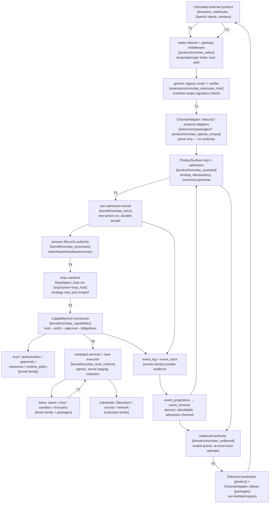
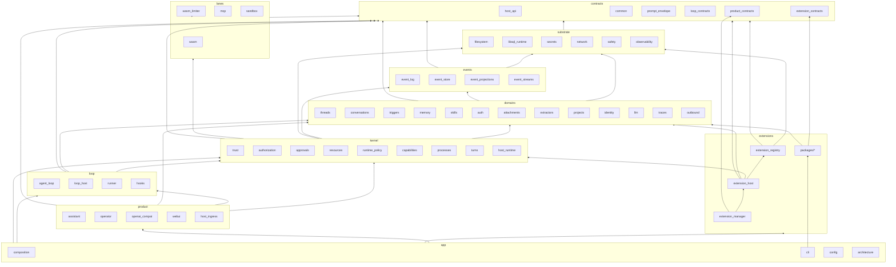

# Proposed Crate Architecture for IronClaw Reborn

> **Committed review copy.** This is the full evidence-backed proposal, authored 2026-07-29 against `origin/main` @ `dde662d5a` and an external architecture dossier (curated from current contracts, the July 2026 refactor train, and dated Slack/GitHub evidence). The executive overview lives in [README.md](README.md); per-family deep dives in [families/](families/); the completion checklist in [CHECKLIST.md](CHECKLIST.md); the execution plan in [PLAN.md](PLAN.md). File:line citations reference the **refresh baseline** below — re-verify against HEAD before acting on them.

**Status:** Proposal (architecture specification for a future restructuring plan — not a migration plan)
**Author:** architecture-lead agent session for Ben Kurrek, 2026-07-29
**Authored against:** worktree `puzzle-carpet` = `origin/main` @ `dde662d5a0e8a9f9595c0a0cab4916e0ae05f1a5` (clean). The dossier's snapshot checkout (`~/work/repos/github.com/nearai/ironclaw`, `main` @ `8da42cef7`) is 5 commits behind this; the delta adds/removes no crates.
**Refresh baseline:** `origin/main` @ `457088c8f` (2026-07-30) — 29 commits later, including the three foundations that landed after authoring (#6863, #6696, #6691; see §2.7). Every `CURRENT` measurement in §2 was re-derived at this commit; the decisions in §1 and §3–§13 are unchanged except where a dated amendment says otherwise. This document is a decision record: amendments are appended and dated, never applied silently.
**Dossier:** this directory (`AGENTS.md` reading order followed; all files + `sources/` read).
**Discovery note:** `bash scripts/codebase-graph.sh status` reported the graph **MISSING** for the validation worktree; per the repo's own fallback rule, all claims below were derived from live code, `cargo metadata`, architecture tests, and targeted `rg` — every load-bearing claim carries a `file:line` or test-name citation. Status vocabulary (`CURRENT`, `LANDED`, `IN FLIGHT`, `DIRECTION`, `INFERENCE`, `SUPERSEDED`) is used as defined by the dossier.

---

## 1. Executive decision

IronClaw Reborn keeps its capability-based microkernel model and gets a **physical layout that finally matches it**: a small set of **ownership family directories** under `crates/`, each containing **focused crates** whose boundaries are earned by contract, dependency barrier, artifact isolation, or authority — never by symmetry or noun.

The decision, in one paragraph:

> Keep the mechanically enforced 7-layer ladder (`contracts → substrates → runtimes → kernel → loops → products → app`) exactly as it exists today in `[package.metadata.ironclaw] layer` and `reborn_dependency_boundaries.rs`. Physicalize ownership as ten family directories (`contracts/`, `substrates/`, `events/`, `domains/`, `kernel/`, `lanes/`, `loop/`, `extensions/`, `product/`, `app/`) that are **discoverability groupings, not new trust boundaries**. Create exactly **three new contracts crates** (`ironclaw_loop_contracts`, `ironclaw_extension_contracts`, `ironclaw_product_contracts`) — each one carved out of an existing crate where today's dependency graph proves upper-layer vocabulary has pooled in the wrong place. Narrow the four god crates (`composition`, `extension_host`, `host_runtime`, `runner`) by moving their inventoried behavior to named owners. Delete the dead crates and dead subsystems the audit verified (`dispatcher`, `embeddings`, plus a concrete dead-surface list). Colocate every installable extension package under `crates/extensions/packages/`. The result eliminates **all 20 standing `LAYER_MATRIX_EXCEPTIONS`** — the repo's own machine-tracked debt register — without adding a single new exception.

What this proposal is **not**: it is not a crate-count minimization (target = **64** workspace packages steady-state vs **66** today: 6 deletions — `dispatcher`, `embeddings`, `telegram_v2_adapter`, `first_party_extension_ports`, `scripts`, `process_sandbox` — plus the `projects`→`identity` merge, against 5 additions), not a kernel mega-crate (the kernel stays a 9-crate family), and not a rewrite. *(Recomputed 2026-07-30: the seventh deletion, `ironclaw_run_state`, landed with #6696, and `ironclaw_libsql_runtime` arrived with #6863 and belongs in the steady state — so today's total is unchanged at 66 while the steady-state target rises 63→64. §2.7 carries the arithmetic.)*

Why this is the right decision (each argued in §4 and §6):

1. **The layer model already works; the filesystem doesn't.** The 7-layer matrix is `CURRENT`, mechanically enforced, and violated only through 20 dated exceptions that the code itself labels with target milestones (`W4.3`, `W6`, `W7`). A flat 65-directory `crates/` hides all of that. Families make the enforced model visible; the three new contracts crates make the exceptions deletable.
2. **The audit found vocabulary pooling, not missing layers.** `ironclaw_host_api` is 38% migrated product/channel/manifest vocabulary (its own module docs say so — `state.rs:4-6`, `channel_adapter.rs:12-14`); `ironclaw_turns` is "three crates wearing one name" (8-line `ids.rs` re-export shim, a ✎ 14.5k-line `run_profile/` contract tier, an 11k turn kernel — and after #6696 took its store engine, those two *are* the crate); `ironclaw_product` defines ~17 single-impl ports whose real implementations live in composition/extension_host/operator. The fix is to give the pooled vocabulary contract-layer homes — not to invent new conceptual layers.
3. **The god crates decompose along seams the code already names.** 59 of `extension_host`'s 78 files arrived from composition in two PRs (#6616 `3af839354`, #6669 `89275efc9`) and were never re-partitioned; composition's `local_dev/` tree (~11k lines) *is* the production path (`runtime.rs:3647`); `host_runtime` carries `first_party_tools/` (~7.3k) that the existing registrar pattern (`FirstPartyHandlerRegistrar`) already knows how to relocate.
4. **Moveability is respected.** Illia's stated constraint — "way too much existing code and tests that is hard to move" — is honored by making the expensive unit the *split*, not the *move*: family directories are `git mv` + manifest-path edits (cheap, semantic-free); only six crates require genuine splits, and each split lands on a seam with an existing test suite on both sides.

---

## 2. Evidence and current-state summary

### 2.1 Workspace shape (`CURRENT`, re-measured 2026-07-30 at `457088c8f`)

- **66 workspace packages**: 64 under `crates/`, `tools/ironclaw_stress`, and the workspace-root package `ironclaw_reborn_integration_tests` (tests only; root `Cargo.toml` states it "has no library or binary target of its own"). `ironclaw_first_party_extension_ports` is a workspace member only *implicitly* (path-dependency inclusion; it is absent from the root `members` array).
- **The count is unchanged since authoring; the set is not.** `ironclaw_run_state` was deleted by #6696 and `ironclaw_libsql_runtime` was added by #6863 — a one-for-one swap that leaves 66 packages and 65 `members` entries. Every count downstream of this line was re-derived, not carried forward.
- ✎ **Amended 2026-08-01 (Wave 1 truth audit): the count has moved since this measurement — **67** workspace packages at `a50ad0638`,** 65 under `crates/` plus `tools/ironclaw_stress` and the workspace-root package. Arithmetic, all from work this document specifies: −2 from WS0's dead-crate deletions (`ironclaw_dispatcher`, `ironclaw_embeddings`, #6942) and **+3 from Wave 1's contracts crates** (`ironclaw_loop_contracts`, `ironclaw_extension_contracts`, `ironclaw_product_contracts`), all three flat under `crates/` because the family directories arrive in Wave 5. **The steady-state target of 64 is unchanged** — §13 and CHECKLIST WS12 recompute from a "today" figure, so read that arithmetic as 67 − 4 remaining deletions − the `projects`→`identity` merge + 2 remaining new crates (`extension_manager`, `sandbox`) = 64. The rest of §2's `CURRENT` measurements are still as-of `457088c8f` by design; only the ones Wave 1 moved are amended in place (see §2.3's `product → runner`/`loop_host` note and §6.1.1–§6.1.4's as-built inventories).
- ✎ **Amended 2026-08-01 (WS2.4):** this PR lands `ironclaw_extension_manager` — one of §9's five planned additions, row 53 — which moves the figure above by one, to **68** workspace packages / **67** `members` entries. The steady-state target is unchanged at 64; this is the restructure spending its budget as designed, not drift. Read the arithmetic above with `extension_manager` moved from "remaining new crates" to landed: 68 − 4 remaining deletions − the `projects`→`identity` merge + 1 remaining new crate (`sandbox`) = 64. (The three WS1 contracts crates were already inside the 67 above: they replaced no crate, and the deletions that pay for them are WS3–WS8 work that has not run yet.)
- **Excluded packages**: `crates/ironclaw_silk_decoder` (libclang isolation; zero in-tree callers), `crates/ironclaw_safety/fuzz` (live, 5 targets), root `fuzz/` (**orphaned** — depends on a root lib target that no longer exists), and six WASM tool sources under `crates/ironclaw_first_party_extensions/assets/*/wasm-src/` (github, google-docs/drive/sheets/slides, slack-user) — a real artifact boundary: built out-of-band by `scripts/build-wasm-extensions.sh` and committed as `.wasm`.
- **The v1 monolith is gone.** No root `src/`; `ironclaw_engine`, `ironclaw_tui`, `ironclaw_gateway`, `ironclaw_oauth` no longer exist. Guidance citing them (root `CLAUDE.md`, `crates/AGENTS.md` [refreshed 2026-07-02], `crates/Architecture.md:44-53`, several `.claude/skills`) is drift, not fact. Seven nonexistent crates are still referenced by current guidance (`engine`, `tui`, `gateway`, `oauth`, `skill_learning`, `webui_v2`, `product_context`).

### 2.2 The enforced layer model (`CURRENT`)

Every workspace crate declares `[package.metadata.ironclaw] layer = "…"`; `reborn_workspace_crates_declare_layers_and_follow_layer_matrix` (`crates/ironclaw_architecture/tests/reborn_dependency_boundaries.rs:49`) enforces a monotone ladder over `IRONCLAW_CRATE_LAYERS = [contracts, substrates, runtimes, kernel, loops, products, app, legacy]` (`:3497`), with a special rule that `ironclaw_agent_loop` may hold **contracts-layer normal deps only** (`:129`). No crate declares `legacy` — that variant is vestigial.

**20 `LAYER_MATRIX_EXCEPTIONS` (`:3557-3702`) are the repo's own debt register**, each with a `removes_in` milestone. *(Re-enumerated 2026-07-30: the list is edge-for-edge identical to the authoring baseline — the three landed foundations added, removed, and re-milestoned nothing. `processes → resources` survives #6696 and is still W7.)*
- **W4.3** (7×): `event_projections/triggers/conversations/hooks/outbound/event_streams/agent_loop → turns` — "turn DTOs move to turn_contracts if the JIT split fires."
- **W6** (1×): `hooks → wasm_limiter` — "directory re-layout verifies runtime/substrate placement."
- **W7** (11×): `host_runtime → {extensions, first_party_extensions, skills}`, `capabilities → extensions`, `processes → resources`, `mcp/scripts → {extensions, resources}`, `runner → {agent_loop, loop_host}` — "kernel consolidation," "neutral dispatch boundary," "extension runtime descriptors move to a neutral contract."
- **follow-up** (1×): `auth → turns` — "neutral auth/turn gate host API port."

The proposal in §5–§9 resolves every one of them structurally (no exception survives in the target).

Other live enforcement (`CURRENT`): `boundary_rules()` blocklists (product, auth, openai_compat, first-party crates, config, webui, conversations, events, event_streams, memory-family allowlists, `reborn_identity` allowlist); `reborn_extension_specificity.rs` (`reborn_generic_code_names_no_concrete_extension` + `concrete_extension_crates_link_only_from_the_binary_and_tests`); `host_product_surface_method_set_is_frozen`; composition boundaries (`composition_public_api_is_service_shaped`, `composition_public_pub_use_surface_matches_snapshot`, `reborn_binary_main_is_thin_bootstrap`, `no_substrate_crate_depends_on_composition_root`); retired-taxonomy/DTO/memory-vocabulary pins; origin-gate-matrix, manifest-reparse, deployment-mode, telegram, authorized-seal, and struct-test-support ratchets.

> ✎ **Amended 2026-07-31 (#6930).** One gate joined this list and one was tightened, neither by restructure work. **New:** `reborn_registration_pipeline_boundary.rs` — a scanner-plus-shrink-only-allowlist gate in the shape of the specificity and retired-taxonomy siblings, holding that hosted-MCP *registration* vocabulary (`PreparationRequirement`, `initial_preparation`) stays inside the registration pipeline and never enters the shared install→activate→remove lifecycle (`:32` terms, `:36-39` owned prefixes, `:53` allowlist empty, `:57` baseline 0). **Tightened, not deleted:** `reborn_manifest_reparse_gate.rs` survives with its test `manifest_reparse_stays_within_the_compiler_and_bundled_paths` (`:155`); #6930 removed six now-stale allowlist entries (−36 lines) because it deleted the production reparses behind them, which is the shrink-only ratchet working as designed. Both gates key on hardcoded `crates/ironclaw_*/src/…` path prefixes — see the WS10 note in CHECKLIST for what that costs at the first family `git mv`.

### 2.3 Production dependency topology (`CURRENT`, normal-dep graph from `cargo metadata`)

Bottom→top (longest-path levels, re-derived 2026-07-30): `host_api`(fan-in 53, fan-out 0) / `common` / `safety` / `observability` / `prompt_envelope` / `wasm_limiter` / `reborn_config` / **`libsql_runtime`** → `events`/`trust`/`network`/`memory`/`filesystem`/`llm`/`runtime_policy`/… → domain stores (`secrets`, `threads`, `extensions`, `reborn_event_store`, `memory_native`, `authorization`, `resources`, `skills`, …) → `approvals`/`mcp`/`processes`/`scripts` → **`turns`** → `agent_loop`/`auth`/`capabilities`/`event_projections`/`hooks`/`triggers` → `conversations`/`outbound`/`first_party_extensions` → `host_runtime`/`event_streams` → `loop_host` → `runner` + `first_party_extension_ports` → `product` → `openai_compat`/`telegram_extension`/`operator`/`extension_host` → `composition`/`webui` → `ironclaw` (CLI).

Load-bearing facts this proposal is built on (each verified; ✎ = re-measured 2026-07-30):
- **`extension_host` sits *above* product today** (normal dep on `ironclaw_product`, ✎ 113 references), because the ports it implements (delivery resolver/reply-context/admission/pairing/preference-codec) are *defined in product*, and its ingress calls product's sealed host-auth mint.
- ✎ **`product` sits above `runner`/`loop_host`** — at authoring this was one pure-data import each (failure-summary formatters at `projection/turn_events.rs:34`; a prompt constant, now `:994`). #6691 added a **third, non-data** edge: the project-create capability it evicted from composition (`product/src/project_create_capability.rs:8`) imports `ironclaw_loop_host` for real behavior. The §6.9.1 shed ("`runner`/`loop_host` single-symbol deps → `host_api::failure` + a product-owned prompt asset") now has one more site to resolve, and it is behavior rather than a constant — noted, not re-designed.
  - ✎ **Amended 2026-08-01 (Wave 1 truth audit, measuring PR #6982 / WS1.7): "single-symbol" was wrong on both edges, and only one of the two is gone.** **`product → runner` is SEVERED** — it was two modules, not one symbol (`projection/turn_events.rs` imported `failure_categories::CHECKPOINT_REJECTED_CATEGORY` *and* four items from `failure_summary`); the data moved to `ironclaw_host_api::failure::{categories, summary}`, `ironclaw_product`'s manifest no longer names `ironclaw_runner` under `[dependencies]` (the dev-dep stays, and is now documented — product's harnesses legitimately build a full turn stack), and both runner modules are private. What could not follow, because `host_api` may hold no internal dependency: `checkpoint_rejection_host_explanation` (typed on `agent_loop`'s `CheckpointKind` and `loop_contracts`' `LoopSafeSummary`) and every classifier. **`product → loop_host` SURVIVES on two behavioral sites**, and the prompt clause is the only part done (`FAILURE_EXPLANATION_SYSTEM_PROMPT` and its `prompts/failure_explanation.md` asset are product-owned now; prompt *content* is out of charter for the loop tier, §6.1.4/§6.7.2). The two survivors are `project_create_capability.rs` (the #6691 arrival named above, six `SyntheticCapability*` symbols, owed a second hop to `identity::projects` per §6.4.11) and — **not previously recorded in any document** — `scoped_fs/attachment_reader.rs` (renamed from `attachment_landing.rs` when the lander moved), which consumes the `LoopAttachmentReadPort`/`LoopAttachmentReadError` port pair. Severing needs both owners moved: WS5's product narrowing and WS6's project re-shed. **Neither edge was ever a `LAYER_MATRIX_EXCEPTION`** (`products → kernel` and `products → loops` are matrix-legal), so this work cannot move the exception count — its value is dependency-graph narrowing and prompt-content placement, worth stating because the wave milestone is written in exceptions.
- ✎ **`turns` now sits *above* `processes` and `approvals`** (normal dep, added by #6696 when the turn store became a journal projection). Both ends are `kernel` in the target, so the edge is legal by the matrix and adds no exception — but it does mean `turns` is no longer a bottom-tier "domain store" in the topology, which is what §6.5.8 predicted would happen.
- ✎ **`libsql_runtime` is a true leaf** (fan-out 0, no workspace dependencies; consumed by `filesystem`, `triggers`, and `composition`) — the driver-admission runtime #6863 introduced.
- **`slack_extension` depends only on `host_api`** (the clean model); `telegram_extension` needs `product`+`turns` for one 228-line module because `PreferenceTargetCodec` lives in product; `telegram_v2_adapter` has exactly one consumer (its sibling).
- **Concrete extension crates are linked only by the binary** (enforced; the binding table is `ironclaw_reborn_cli/src/runtime/native_extensions.rs:26-41` via `RebornHostBindings::with_channel_extension_bindings`, `composition/src/input.rs:769`).
- **Dead in production**: `ironclaw_dispatcher` (14-line shim, zero production consumers; its replacement `RuntimeDispatcher` lives in `ironclaw_capabilities/src/dispatch.rs:123`) and `ironclaw_embeddings` (zero consumers; even the root dev-dep is unused).
- **The Script/Process lane is production-dead** (`with_script_runtime` called only from tests; `RuntimeLane::Process` always hits `fail_unconfigured_lane`, `host_runtime/src/services/runtime_adapters.rs:328-331`).

### 2.4 The four god crates (`CURRENT`, audited module-by-module; line counts are `src/**/*.rs`, ✎ re-measured 2026-07-30)

The four are still the four — but two of them **shrank** and two **grew**, and the mass that left composition and runner mostly landed in crates this proposal already names as its owners. That is the shape a healthy narrowing has; it does not change any target.

- **`ironclaw_reborn_composition`** (✎ **68.3k** lines, was 77.0k): still ~30% assembly / ~70% behavior. ✎ The tree formerly called `runtime/local_dev/**` is now `runtime/capability_host/**` + `capability_authorization` + `runtime_mounts` (#6691 retired the misnomer in the module names and the typename ratchet — CHECKLIST WS6 item, landed); it is ~11.6k lines and still the **production** capability/delivery/approval/skill path — `RuntimeSubstrate` still has only `None|ProductionShaped` variants and `runtime.rs:3016` still hardcodes `let local_runtime = Some(&services);` (the local *variable* name survived the rename). Behavior inventory still resident, with owners named in §9: approval/authorization policy (`capability_authorization`), trigger poller + trusted submit (~4.3k across `automation/trigger_poller*`, `trigger_fire_access.rs`, `trigger_creation_assembly.rs`), admin-user directory (322), trace capture (1.2k + a 350-line hooks projection), system-prompt content (`root/default_system_prompt.rs`), HTTP route mounts (`llm_admin/{openai_compat_serve,nearai_login_serve}.rs`), project filesystem reader (453), blocked-auth resume fan-out, Google OAuth secret store (155), NEAR-AI MCP (336). §6.10.1 carries the eviction reconciliation. `build_reborn_services` — still cited by `crates/Architecture.md` — **does not exist**.
- **`ironclaw_extension_host`** (✎ **50.7k** lines, ✎ 88 files, was 45.5k/78, no guidance file): a generic lifecycle/binding core (#6116) + channel ingress router/verifier (vendor-blind, manifest-recipe driven — the system's cleanest seam) + delivery/egress transports + the product-serve wiring landed from composition (#6616/#6669) + non-extension strays (`skill_learning.rs`, `bundled_skills.rs`+`build.rs`, Axum pairing routes). ✎ It grew again in #6691, which handed it the generic bundled-skill tree migration and composition's extension capability surface — more evidence for the §6.8.3 split, not less. Unpoliced `include_str!` edges into `../ironclaw_first_party_extensions/assets/…`. ✎ **Re-measured 2026-07-31 at `2e6522580`: 56,940 lines / 93 files** — of which #6930 contributed **+3,367 / +4 files**, a whole new sub-owner: the hosted-MCP *registration pipeline* (`hosted_mcp_admission.rs`, `hosted_mcp_manifest.rs`, `hosted_mcp_preparation.rs` — declared private at `lib.rs:60,62,63` — plus the public `mcp_catalog_safety.rs` at `:74`, beside the pre-existing `hosted_mcp_discovery_authority.rs`). See §6.8.2 for what that means for the split.
- **`ironclaw_host_runtime`** (✎ **48.5k** lines, was 46.5k; 31 internal deps incl. `libsql`, `deadpool-postgres`, `bollard`, `rcgen`): kernel pipeline construction (sole `CapabilityHost` construction site) + closed lane executor + mediated egress/secret staging/obligations (✎ `obligations.rs` 3,097, fuses three owners) + `first_party_tools/` (incl. the `trace_commons` product feature) + pure assembly + an unwired Docker/CA sandbox subsystem ("ships unwired until W6").
- **`ironclaw_runner`** (✎ **33.1k** lines, was 38.3k): ✎ #6696 took the scheduler — `turn_scheduler` fell from 2,003 lines to **292**, and what remains is explicitly "an agent-turn projection over the generic process supervisor" (`ironclaw_processes::ProcessSupervisor`). ✎ The `subagent/` tree fell 7.7k → 4.9k, but **`subagent/await_edge/` survives at 2.9k** — the await-edge machinery was reworked, not deleted (see §2.7 and §6.7.3). Still resident: a 24-`with_*` loop-host factory, `runtime.rs` `build_*` functions composition reaches into, ✎ 3.9k model gateway, ✎ 5.4k tool disclosure.

### 2.5 Contract-vocabulary pooling (`CURRENT`)

- `ironclaw_host_api` (✎ 25.8k lines, 63 files, 46 modules — essentially untouched by the three merges; 45 wildcard-re-exported as a "contract prelude", `lib.rs:85-132`): ~9.8k lines (38%) are product/channel/manifest vocabulary (`product_adapter/` 6,178; `product_surface.rs` 608 — `ProductSurface` trait :352 with 2 production impls; `channel.rs` 732; `recipe.rs` 935; `package_lifecycle.rs` 650; `state.rs` 187; `operator_llm.rs` 140), several with behavior (rendering/parsing/`tracing::error!`/a `tokio::sync::mpsc` channel) that violates the crate's own charter. ✎ **Re-measured 2026-07-31 at `2e6522580`: 27,898 lines / 67 files / 50 modules, and the wildcard prelude is gone** (`rg "pub use .*::\*" crates/ironclaw_host_api/src/lib.rs` → 0; the file is 97 lines and states the no-prelude rule at `:87-95`) — that half is WS0/#6934, not #6930. #6930's share is **+372 lines / +1 module**: `hosted_mcp` (`lib.rs:54`), the hosted-MCP wire vocabulary. It lands the charter finding one more time rather than fewer: `hosted_mcp.rs` carries scheme/length/control-char validation and a `WWW-Authenticate` header parser (`:23-51`, `:84-99`) alongside its newtypes, so the "behavior in a contracts crate" list grows by one module. It also mutually references `package_lifecycle` (`hosted_mcp.rs:11` imports `LifecyclePackageId`; `package_lifecycle.rs:16` imports `RegisterHostedMcpRequest`), which is free intra-crate today and is why the §6.1.2 carve-out has to take both modules together.
- `ironclaw_turns` (✎ **26.0k** lines, was 33.7k — #6696 moved the whole `turn_state_row_store/**` engine into the process journal): `ids.rs` is **still 8 lines** and `scope.rs` **1 line** of `pub use ironclaw_host_api::…` — the canonical turn IDs already live in `host_api/src/turn.rs`. The same six consumers (`auth`, `event_streams`, `outbound`, `telegram_extension`, `triggers`, `event_projections`) still use turns for vocabulary only and already depend on `host_api` directly. ✎ `run_profile/` (**14.5k** lines, 11 `Loop*Port` traits, its own `CLAUDE.md`) is the real loop-contract tier — it did **not** shrink, so the contracts carve-out (§6.1.4) is now a *larger* share of a smaller crate, and the case for it is stronger than at authoring. ✎ 18 consumers today (was 17).
- `ironclaw_product` (✎ **57.0k** lines, was 51.6k — it gained composition's automation/communication/project-access orchestration in #6691): ✎ `reborn_services` cluster **17.5k** (31%); ~17 of 46 public traits have exactly one production impl, and those impls live in composition/extension_host/operator — ports exist to satisfy layering, and their *location* (product) is what forces `extension_host`/`operator`/`telegram` above product.

### 2.6 Verified dead surface (`CURRENT` — delete list)

*(Re-checked 2026-07-30: every item below still resolves and still has no production consumer; none of the three landed foundations removed one, and `approvals::ToolPermissionOverrideStorePort` in particular survived the `run_state` absorption. The list is unchanged.)*

> **Correction (2026-07-31, verified during WS8 execution).** Three entries in the paragraph below were wrong at the current base, found by re-verifying each item with `rg` immediately before deleting it (PR #6943) — the entries are left in place and corrected here rather than silently rewritten:
>
> - **`llm::reasoning` is half-live, not "re-exported, unreferenced".** `ironclaw_runner`'s model gateway calls `clean_response`, `contains_codex_text_tool_call_syntax`, and `recover_codex_text_tool_calls_from_tool_names` on the live model-response path (`crates/ironclaw_runner/src/model_gateway.rs:26`), and those three pull in a long chain of private helpers. The dead half is real and enumerated in PR #6943; deleting it needs its own freshly verified, scoped PR.
> - **`outbound::RouteCurrentRunFinalReply` has a production impl**, so "0 impls" is wrong: `UnavailableRunFinalReplyRouter` in `host_runtime`'s first-party tools (`crates/ironclaw_host_runtime/src/first_party_tools/mod.rs:501`), dispatched through `Arc<dyn …>` by the outbound-delivery tool. It is a wired seam, not dead surface.
> - **`approvals::ToolPermissionOverrideStorePort` has zero *named* impls (as stated) but 39 `dyn` sites** across 18 files in composition, product, and extension_host. Removing it is a mechanical collapse/rename onto `CapabilityPermissionOverrideStorePort`, not a deletion, and belongs with the deliberate `approvals` narrowing.
>
> One further correction of a *conditional*, not an entry: the `event_projections` trio was **not** the only justification for that module's `turns` dep edge. `ProjectionError::TurnEventRebaseRequired` carries `ironclaw_turns::EventCursor` and `event_streams` matches the variant in production, so `memory` dropped with the trio but `turns` did not. See CHECKLIST WS8.

Crates: `ironclaw_dispatcher`, `ironclaw_embeddings`. Subsystems/modules with zero production consumers: `ironclaw_llm::reasoning` (4,503 lines, re-exported, unreferenced); `ironclaw_skills::{registry, catalog, v2, gating}` (~3,985 lines, default-features-on, zero external callers); `ironclaw_auth::loopback_oauth` (455 lines; its "sole consumer," the v1 binary, no longer exists) and ungated `fakes.rs` (1,490 lines shipping in release builds); `event_projections::{EventStreamManager (name-collides with the real one in event_streams), PendingGateProjection (#[allow(dead_code)], 0 sink impls), DurableMemoryAuditSink}` — the module's `memory` and `turns` dep edges are justified *only* by this dead code; `events::{parse_jsonl, replay_jsonl}`; `outbound::RouteCurrentRunFinalReply` (0 impls); `approvals::ToolPermissionOverrideStorePort` (marker trait, 0 named impls); `memory_native::EmbeddingProvider` (0 impls; near-verbatim duplicate of `ironclaw_embeddings`'; vector search silently degrades to FTS); `common::trust_boundary` (395 lines, `#[allow(dead_code)]`); `trust::{SignedRegistry (inert), DevTrustOverride, BundledRegistry (unwired)}`; `composition::root::product_live_adapters` public exports (integration-harness-only); `filesystem::HsmBackend` (self-described non-security placeholder); `runner::production_readiness` (no production caller); secrets `placeholder` subsystem and host_runtime sandbox CA (both self-documented as unwired pending W6); unused dep edges `composition→event_streams` and `memory_native→prompt_envelope`; `reborn_identity::{lookup, bind, adopt_migrated_identity}` (0 production callers; open issue #5618); root `fuzz/` (unresolvable).

### 2.7 Landed foundations (`LANDED` — amended 2026-07-30)

> **Amendment, 2026-07-30 (refresh against `457088c8f`).** All three PRs this section originally tracked as `IN FLIGHT` merged on 2026-07-29/30, *after* this document was authored. The authoring-time record is preserved verbatim under each entry; what follows each "**Landed:**" line is what the merged diff actually contains, measured at the refresh baseline. Nothing in §5–§11 was rewritten to match a merge — where the merged code and the target diverge, the divergence is named and left for review, not silently resolved.

- **PR #6691** ("Refactor composition assembly into focused builders") — **MERGED 2026-07-30, `d46fdc9b8`.**
  *Authored-at-the-time record:* "OPEN, non-draft, `REVIEW_REQUIRED`, head `c1ea0232b`. Composition net −9,421 lines; moves automation/communication/project-access/blocked-auth orchestration → product, indexed blocked-auth lookup → turns, bundled-skill migration → extension_host. Directionally identical to this proposal's composition contract; nothing here presumes its exact code."
  **Landed:** composition −8,705 lines against its merge parent (the PR reports −9,421 against the older base it was cut from). Owners gained what composition shed: `product` +4,863, `loop_host` +2,962, `extension_host` +753, `first_party_extension_ports` +356. It also **retired the `local_dev` misnomer** in the module names and the typename ratchet (`runtime/local_dev` → `runtime/capability_host`, `local_dev_authorization` → `capability_authorization`, `local_dev_mounts` → `runtime_mounts`, `local_dev_boot` → `standalone_boot`, `reborn_localdev_typename_ratchet` → `reborn_standalone_typename_ratchet`) — a CHECKLIST WS6 item, now done. Direction confirmed; §6.10.1's shed inventory is reconciled item-by-item there, and roughly half of it remains.
- **PR #6696** ("Collapse lifecycle state into the row-native process journal") — **MERGED 2026-07-29, `bed3f6805`** (+31,677/−81,499 across 374 files).
  *Authored-at-the-time record:* "OPEN **draft**, `CHANGES_REQUESTED`, head `94c6abdbf`… This proposal adopts the *ownership* direction (processes = lifecycle authority; run_state dissolves; runner narrows) and marks every dependent mapping entry as **contingent on #6696-or-equivalent landing**."
  **Landed, against the four contingencies this document gated on:**
  1. **`run_state` deletion — LANDED as specified.** `crates/ironclaw_run_state` is gone; `run_state/src/lib.rs` became `approvals/src/approval_store.rs` and its three contract suites moved with it.
  2. **`approvals` widening — LANDED as specified.** `approvals` now owns the approval-request and gate record stores. ✎ 7 consumers (was 6).
  3. **`processes` widening — LANDED, and larger than specified.** `processes` went 2.7k → **12.8k** lines and now holds the row-native journal (`journal.rs`, `journal_store/**` with command/migration/observer/rows/state/validation), `supervisor.rs` (1,698 lines), `invocation_state.rs`, `capability_process.rs`, and `result_store.rs`. ✎ 8 consumers. §6.5.7's `DIRECTION` marking is discharged.
  4. **`runner`'s scheduler/await-edge shed — LANDED IN PART; one half diverges.** The scheduler *did* invert onto `processes::ProcessSupervisor`: `turn_scheduler` is now 292 lines whose own module doc reads "agent-turn projection over the generic process supervisor." But **runner's await-edge machinery was not deleted** — `subagent/await_edge/` survives at 2,885 lines (resolver 2,128, store 511, mod 152, boot_recovery 94); `roster.rs` and `goal_store.rs` went, and the rest was reworked onto process edges rather than removed. **⚠ This is the one place the merged code contradicts a claim in this document** (§2.4 and §6.7.3 both said #6696 deletes it). Flagged, not resolved: §6.7.3 keeps the await-edge shed as target work, now *ungated* and owned by the loop tier rather than waiting on someone else's PR. Whether the surviving 2.9k is genuinely reducible to journal edges is a design question for the turn_runner narrowing, not bookkeeping.
  Two consequences worth recording because they are structural, not cosmetic: `turns` shed its whole `turn_state_row_store/**` engine (33.7k → 26.0k lines) and became a consumer of `processes` — exactly the "store/scheduler halves become projections/adapters over `processes`" that §6.5.8 predicted, including its dependency-order effect (§2.3).
- **PR #6863** ("fix(libsql): serialize writers and recover transient contention") — **MERGED 2026-07-29, `934a6540d`.** Not tracked at authoring; it landed the same day and **adds a workspace crate**, so the target must account for it. It introduces **`ironclaw_libsql_runtime`** (`[package.metadata.ironclaw] layer = "substrates"`): one shared read pool plus exactly one write-admission lane per composed physical libSQL database, with typed checkout-failure classification and provenance-proved targets. Composition opens the database once and wires the shared runtime; `filesystem`, `triggers`, the event log, and turn-state writes all traverse the same writer lane; backend crates keep their own transactions. Placement, contract, and the driver-rule reconciliation are §6.2.6, §9 row 12, and §11.2.6.
- **PR #6930** ("feat(extensions): register hosted MCP servers") — **MERGED 2026-07-31, `2e6522580`** (+15,002/−1,818 across 153 files). Not tracked at authoring; it is the first *feature* PR large enough to move this document's evidence base, and it lands entirely inside the extension family the restructure is about to reshape. **What it adds:** a user-registered hosted-MCP server pipeline — a WebUI route and registration modal, endpoint admission, synthesized manifests, live `tools/list` discovery, and the lifecycle that carries a registered-but-not-yet-discovered definition to an installed, publishing package. **Where the mass landed, and why each matters here:**
  1. **`ironclaw_extension_host` +3,367 lines / +4 files (→ 56,940 / 93).** A new, coherent sub-owner — the registration pipeline (§6.8.2, §2.4). It is *not* part of the manager half §6.8.3 splits out, so the split inventory now has a third destination question, recorded at §6.8.2 rather than decided here.
  2. **`ironclaw_extensions` +2,306 lines / +1 file (→ 11,631 / 14).** The registry gained a **new durable record class**: registered *package definitions* that persist with zero installations, with their own retention policy (`definition_admission.rs`, `installations.rs:802,816`). §6.8.1's "honest re-charter" gets one more record to be honest about.
  3. **`ironclaw_host_api` +372 lines / +1 module** (`hosted_mcp`) — with validation behavior in it, and mutually referencing `package_lifecycle` (§2.5, §6.1.1).
  4. **`ironclaw_mcp` +226 lines** (2,483 → 2,709, still one file) — the §6.6.3 split target grew (§6.6.3).
  5. **One new architecture gate** (§2.2, §11.1) and **one tightened** — the manifest-reparse gate lost six now-stale allowlist entries and was *not* deleted.
  **What it did not change:** no `LAYER_MATRIX_EXCEPTIONS` edit (`reborn_dependency_boundaries.rs` untouched), no new internal dependency edge except `extension_host → common`, `ironclaw_host_api` still holds zero `ironclaw_*` deps, and the four DTO names `ironclaw_mcp` reaches through the registry crate (`ExtensionPackage`, `ExtensionRuntime`, `HostedMcpDiscoveredTool`, `HostedMcpDiscoveredToolAnnotations`) are byte-identical as an import list — so the W7 `mcp → extensions` exception is the same edge, over a reshaped payload (CHECKLIST WS3).
- **PR #6253** (Illia's interactive architecture-simplification explorer): unchanged — models the 2026-07-17 design note that `main` already deleted as stale (#6670) and that this proposal supersedes; the explorer should be regenerated against this target or closed, **coordinated with its author**. This refresh deliberately does not touch, retarget, or close it.

### 2.8 Current-state conclusion

The dossier's assessment is confirmed with stronger evidence than it claimed: **intended ownership is cleaner than the physical layout**, the mechanical layer model is healthy, the mass sits in four god crates plus two pooled contract crates, and the debt is already itemized *by the code itself* (layer exceptions with milestones, `arch-exempt` markers with plan numbers, dead subsystems annotated "unwired until W6"). A credible target must therefore (a) preserve the layer model, (b) give the pooled vocabulary contract homes, (c) name an owner for every inventoried behavior in the god crates, (d) delete the verified-dead surface, and (e) make extension packages physically self-contained. That is what follows.

---

## 3. Non-negotiable invariants

These are restated from the dossier and current contracts; the target preserves all of them. Where the proposal *changes* a contract, the change is called out explicitly here and argued in §6.

1. **The kernel is a conceptual security/authority perimeter, not one crate** (`docs/reborn/contracts/kernel-boundary.md:20`: "There is no requirement to create an `ironclaw_kernel` crate"). Target: kernel = a 9-crate family.
2. **Crate boundaries are not automatically trust boundaries.** The only loop-side trust membrane is `CapabilityHost` + host ports; trusted host internals share canonical types without mirror DTOs per hop.
3. **Product is first-party userland above the kernel and is not an extension.**
4. **Composition performs deployment selection and dependency wiring only** — no domain behavior or policy. (Today violated ~70/30; target restores it.)
5. **`ironclaw_host_api` is neutral, low-dependency authority vocabulary** — no execution, persistence, product workflow, or framework behavior. (Today violated by ~38% of its mass; target restores it via §6.1.)
6. **Authorization, approvals, obligations, resource reservation, dispatch, execution, and durable evidence remain distinct stages** even where they share canonical types (`Decision`, `Obligation`, `Authorized`).
7. **Filesystem, network, secrets, process lifecycle, and capability authority remain mediated host responsibilities**; loops, extensions, and products get scoped handles and requests, never ambient clients or raw secrets.
8. **Extensions are installable packages**; declarative metadata/lifecycle, generic hosting, concrete package behavior, and runtime execution are four separate responsibilities.
9. **Runtime kind is an execution mechanism, never product taxonomy** (`RuntimeKind`/`RuntimeLane` stay out of identity and UX).
10. **Vendor/protocol behavior stays out of generic kernel, product, composition, and extension-host crates** (enforced today by `reborn_extension_specificity.rs`; the target shrinks its allowlist toward zero).
11. **Durable events, projections, and transport streams remain three contracts**; projections are rebuildable and never a second write authority.
12. **A shipped loop or first-party extension does not bypass capability mediation** — first-party raises a policy ceiling, never grants permission.
13. **A crate boundary must be earned** (independent contract; real dependency/security/runtime/artifact barrier; multiple production implementations; release isolation; platform/compile isolation) — otherwise it's a module. Applied per-crate in §6; the crate-vs-module verdict is stated for every retained and created crate.
14. **Do not optimize for minimal crate count**; optimize for ownership clarity, safe dependency direction, discoverability, and removal of accidental boundaries.

**Deliberate contract adjustments this proposal makes (marked, with justification):**
- **A. Port relocation:** single-impl ports currently defined in `ironclaw_product` whose implementations live below/beside it (delivery resolution, admission, operator services, preference codecs, lifecycle vocabulary) move to `ironclaw_product_contracts`. This does not weaken any stage separation; it makes the existing dependency inversion explicit and removes three upward edges (`extension_host→product`, `operator→product`, `telegram_extension→product`). (§6.1.3)
- **B. Extension surface vocabulary becomes neutral:** `ChannelAdapter`/`ToolAdapter`/entrypoint/manifest-surface/recipe vocabulary moves from `host_api::product_adapter` to `ironclaw_extension_contracts`, resolving the W7 "descriptors move to a neutral contract" direction the exceptions already record. (§6.1.2)
- **C. Verified-inbound evidence minting is consolidated:** today two feature-gated mint families exist (`host_api::product_adapter::auth::mark_bearer_token_verified` and `product::auth::mark_request_signature_verified`). The target seals all inbound-verification evidence constructors in `ironclaw_extension_contracts` (channel/webhook evidence) and `ironclaw_host_api` (bearer/session evidence), minted only by the generic verifier/authenticator code paths. This is a security-boundary *tightening*; §12 carries it as a named risk with required tests.
- **D. Layer reassignments (metadata only, matrix unchanged):** `extensions` loops→substrates; `skills` loops→substrates; `extension_host` products→loops; `runner` kernel→loops; `hooks` substrates→loops; `processes` runtimes→kernel. Each is argued at its §6 entry; together with A/B they eliminate every standing matrix exception.

---

## 4. Alternatives considered

Three plausible structure strategies were developed far enough to compare honestly. The recommendation is Strategy B.

### Strategy A — "Flat tree + surgical consolidation only" (rejected)

Keep `crates/` flat; do no directory work; only delete dead crates, split the god crates, and fix dependency edges.

- **For:** smallest diff; zero path churn in manifests, CI selectors, and guidance; every improvement is purely semantic.
- **Against:** it abandons the one deliverable both Ben and Illia named — a *legible* map ("so agents don't get giga confused"). A flat 60-entry directory cannot express family membership, so ownership continues to live only in tribal knowledge and a routing table (`crates/AGENTS.md`) that measurably drifts (it was refreshed 2026-07-02 and already lists six crates that no longer exist). The audit showed guidance-file presence is the best predictor of crate discipline; a flat tree gives per-family guidance nowhere to live. It also leaves the `reborn_*` naming residue (meaningless now that v1 is gone) and the extension-package scatter (Illia's explicit July-23 complaint) unaddressed.
- **Verdict:** rejected — it optimizes diff size over the stated goal. Its good half (dead-code deletion, edge fixes) is contained in Strategy B.

### Strategy C — "Aggressive owner consolidation" (~12 mega-crates) (rejected)

Merge to roughly one crate per conceptual box: `ironclaw_kernel`, `ironclaw_substrate`, `ironclaw_loop`, `ironclaw_product`, `ironclaw_extensions`, `ironclaw_app`, etc.

- **For:** minimal crate count; no cross-crate DTO hops inside a mega-crate; fewer manifests; superficially matches "one trust boundary" rhetoric.
- **Against (fatal, in order):**
  1. **It erases mechanically enforced security seams.** Today `cargo` itself proves that `agent_loop` cannot reach `capabilities` (contracts-only rule), that `wasm` has no network/secret deps, that `memory`'s allowlist is `{host_api, prompt_envelope}`, that `outbound` has no HTTP client, and that `host_api` has zero internal deps. Merging converts each of these from a compiler guarantee into a code-review hope — exactly the "mass pooling inside a crate" failure mode the repo's own review skill names as the way this codebase actually decays.
  2. **It contradicts the dossier's non-goals verbatim** ("one monolithic kernel crate"; "merging authorization, approvals, secrets, network, and filesystem merely to reduce package count").
  3. **It destroys real dependency-cone isolation.** `events` consumers today compile no TLS/DB stack because `reborn_event_store` isolates `libsql`+`deadpool-postgres`+rustls; `host_api`'s 56 dependents compile no wasmtime/axum/reqwest. One substrate mega-crate would put wasmtime and Postgres in nearly every build path and worsen the compile times it claims to fix.
  4. **Review evidence argues against big-bang rewrites here**: the July train succeeded as owner-by-owner extractions; the one mega-change of the period (#6696, +31.7k/−81.5k across 374 files) spent its life in draft under `CHANGES_REQUESTED` precisely because collapsing lifecycle state is high-risk. ✎ It has since landed — and landed *incompletely* against its own design note (runner's await-edge machinery survived; §2.7), which is the argument's point restated rather than refuted.
- **Verdict:** rejected. Where consolidation is *earned* (dead shims, single-consumer splits like `telegram_v2_adapter`, three unwired sandbox fragments), Strategy B does it.

### Strategy B — "Family directories + focused crates" (recommended)

Physical family directories that mirror ownership; focused crates inside them; three new contracts crates where the dependency graph proves vocabulary pooled in the wrong layer; targeted narrows/splits of the four god crates; verified-dead deletion; extension packages colocated.

- **For:**
  1. **It builds on what is already enforced.** The 7-layer metadata + matrix stays byte-identical (one vestigial variant removed); families are discoverability, layers remain the dependency truth. Directory ≠ boundary is stated explicitly, satisfying the dossier's "physical tree makes ownership obvious without pretending every folder is a security boundary."
  2. **It clears the repo's own debt register.** All 20 layer exceptions resolve structurally (verified case-by-case in §8.3) — not by editing the allowlist but by making each exception's stated `removes_in` condition true.
  3. **Each new crate passes the crate gate** with named consumers and a named barrier (§6): `loop_contracts` (6 consumers stop depending on the turn kernel; gives `agent_loop`'s contracts-only rule a complete home), `extension_contracts` (lanes and hosts stop depending on the registry crate; channel packages depend on contracts only, matching the already-clean Slack shape), `product_contracts` (compile-enforces the "DTOs/descriptors only" discipline that `webui`'s guide demands but only review enforces; removes three upward edges).
  4. **Moves are cheap, splits are few.** ~45 of the mappings in §9 are pure moves/renames; only six crates split, each along an audited seam with existing tests on both sides (e.g. `extension_host`'s split follows the exact file lists of #6616/#6669; `turns`' split follows its own `run_profile/CLAUDE.md` boundary).
  5. **It gives Ben's per-root `AGENTS.md` plan a physical anchor** — one contract file per family root (§11.4), which the audit showed correlates with discipline.
- **Against (acknowledged):** path churn (every moved crate touches `members`, path deps, CI selectors, guidance); family membership can be mistaken for a trust claim (mitigated by §5's explicit legend + §11 tests); five new crates add manifests (bounded: net workspace count still drops 66→64 steady-state).
- **Verdict:** **recommended.**

---

## 5. Recommended target directory tree

Legend: `▣` = Cargo package (workspace member) · `▢` = directory only (family or grouping — **never a trust boundary by itself**) · `◇` = Cargo package excluded from the workspace (artifact/tooling isolation) · `(NEW)` = crate created by this proposal · `(narrowed)` = same crate, reduced charter · `(renamed)` = same code, new name. Layer metadata shown as `[layer]` — this remains the mechanically enforced dependency truth; family placement is ownership/discoverability.

```text
crates/
├── contracts/                        ▢ neutral vocabulary & ports (leaf tier)
│   ├── ironclaw_host_api             ▣ [contracts] (narrowed)   authority vocabulary: ids/scope/path/mount,
│   │                                                            capability/action/decision/approval/resource,
│   │                                                            Authorized + CapabilityDispatcher port, resolution/
│   │                                                            failure cluster, http-egress port, ingress descriptors,
│   │                                                            runtime/trust/runtime-policy vocab, turn vocabulary
│   ├── ironclaw_common               ▣ [contracts] (narrowed)   cross-domain primitives: identity newtypes, pkce,
│   │                                                            hashing, paths, timezone, env overlay, attachment fmt
│   ├── ironclaw_prompt_envelope      ▣ [contracts]              untrusted-snippet envelope (leaf)
│   ├── ironclaw_loop_contracts       ▣ [contracts] (NEW)        the loop-tier contract: Loop*Port set, driver/host
│   │                                                            contracts, run-profile vocabulary, LoopExit DTOs
│   ├── ironclaw_extension_contracts  ▣ [contracts] (NEW)        extension surface vocabulary: ChannelAdapter/ToolAdapter/
│   │                                                            entrypoint, manifest surface descriptors, auth recipes,
│   │                                                            installation/public state, verified-inbound evidence
│   └── ironclaw_product_contracts    ▣ [contracts] (NEW)        ProductSurface + caller + descriptors, product wire DTOs
│                                                                (incl. AppEvent), product-side ports (delivery resolution,
│                                                                admission, operator services, preference codecs)
├── substrates/                       ▢ privileged mechanism substrates (kernel-mediated)
│   ├── ironclaw_filesystem           ▣ [substrates]             RootFilesystem/ScopedFilesystem/mounts/CAS + backends
│   ├── ironclaw_libsql_runtime       ▣ [substrates]             shared libSQL connection admission: one read pool +
│   │                                                            one write lane per database (added 2026-07-30)
│   ├── ironclaw_secrets              ▣ [substrates]             encrypted secret store, leases, one-shot consumption
│   ├── ironclaw_network              ▣ [substrates]             network policy + hardened egress transport
│   ├── ironclaw_safety               ▣ [substrates]             injection detection, redaction, leak scanning
│   └── ironclaw_observability        ▣ [substrates]             latency-trace macros (cross-cutting leaf)
├── events/                           ▢ evidence → derived views → transport streams (three contracts)
│   ├── ironclaw_event_log            ▣ [substrates] (renamed)   typed redacted event/audit vocabulary + log traits
│   ├── ironclaw_event_store          ▣ [substrates] (renamed)   durable backend selection + fail-closed profiles
│   ├── ironclaw_event_projections    ▣ [substrates] (narrowed)  replay-derived read models (dead writers deleted)
│   └── ironclaw_event_streams        ▣ [substrates]             transport-neutral stream manager (admission/replay/lag)
├── domains/                          ▢ typed record/service domains behind the kernel
│   ├── ironclaw_threads              ▣ [substrates]             canonical transcript service
│   ├── ironclaw_conversations        ▣ [substrates]             external↔canonical binding, idempotency, pairing
│   ├── ironclaw_triggers             ▣ [substrates]             scheduled-trigger records + deterministic tick
│   ├── ironclaw_memory               ▣ [substrates]             provider-neutral memory contract + conformance suite
│   │                                                            (providers → extensions/packages/, amended 2026-07-29)
│   ├── ironclaw_skills               ▣ [substrates] (narrowed)  skill parsing/selection/management + pure learning
│   ├── ironclaw_auth                 ▣ [substrates] (narrowed)  product-auth flows + recipe-driven AuthEngine
│   ├── ironclaw_attachments          ▣ [substrates] (widened)   attachment landing routine + its ports
│   ├── ironclaw_extractors           ▣ [substrates]             pure bytes→text extraction
│   ├── ironclaw_identity             ▣ [substrates] (renamed)   external identity → stable UserId + user directory
│   ├── ironclaw_llm                  ▣ [substrates] (narrowed)  LlmProvider contract, providers, registry, decorators
│   ├── ironclaw_trace_commons        ▣ [substrates] (renamed)   Trace Commons client: envelope/redaction/queue/credits
│   └── ironclaw_outbound             ▣ [substrates]             metadata-only outbound policy/state (sealed grants)
├── kernel/                           ▢ the authority perimeter — nine crates, steady-state reached
│                                       (the transitional tenth, ironclaw_run_state, was deleted by #6696 on 2026-07-29)
│   ├── ironclaw_trust                ▣ [kernel]                 trust-class policy engine (sealed ceilings)
│   ├── ironclaw_authorization        ▣ [kernel]                 grant matching + capability leases
│   ├── ironclaw_approvals            ▣ [kernel] (widened)       exact-invocation approval resolution + policy stores
│   │                                                            (absorbed run_state's approval/gate records — landed #6696)
│   ├── ironclaw_resources            ▣ [kernel]                 reservation/reconcile/release + quotas
│   ├── ironclaw_runtime_policy       ▣ [kernel]                 pure deployment/profile→policy resolution + lane planning
│   ├── ironclaw_capabilities         ▣ [kernel]                 CapabilityHost workflows + RuntimeDispatcher
│   ├── ironclaw_processes            ▣ [kernel] (widened)       process lifecycle authority + supervisor
│   │                                                            (row-native journal + ProcessSupervisor — landed #6696)
│   ├── ironclaw_turns                ▣ [kernel] (narrowed)      turn admission kernel: coordinator, state store,
│   │                                                            exit validation/application, turn events
│   └── ironclaw_host_runtime         ▣ [kernel] (narrowed)      kernel service graph: obligations, mediated egress/
│                                                                secret staging, lane executor, dispatch composition
├── lanes/                            ▢ execution mechanisms for already-authorized work
│   ├── ironclaw_wasm                 ▣ [runtimes]               WASM component lane (wit/ lives inside the crate)
│   ├── ironclaw_wasm_limiter         ▣ [runtimes]               shared wasmtime ResourceLimiter
│   ├── ironclaw_mcp                  ▣ [runtimes]               MCP lane (host-mediated HTTP only)
│   └── ironclaw_sandbox              ▣ [runtimes] (NEW, by merge)
│                                                                sandbox/process lane: plan contract (ex process_sandbox)
│                                                                + Docker/broker/CA machinery (ex host_runtime/sandbox_process)
│                                                                + Docker script backend (ex ironclaw_scripts)
├── loop/                             ▢ the loop-hosting tier (userland strategy + its host adapters)
│   ├── ironclaw_agent_loop           ▣ [loops]                  canonical executor, sealed families/planner, state
│   ├── ironclaw_loop_host            ▣ [loops]                  host-port adapter implementations over kernel services
│   ├── ironclaw_turn_runner          ▣ [loops] (narrowed, renamed)
│   │                                                            agent-turn executor, driver registry, loop-host factory
│   └── ironclaw_hooks                ▣ [loops] (moved layer)    trust-tiered hook framework + wasm hook engine +
│                                                                Loop*Port middleware
├── extensions/                       ▢ everything "installable package"
│   ├── ironclaw_extension_registry   ▣ [substrates] (moved layer, renamed)
│   │                                                            manifests (v3 wire/v2 internal),
│   │                                                            registry, installation/membership records
│   ├── ironclaw_extension_host       ▣ [loops] (narrowed, moved layer)
│   │                                                            generic lifecycle/binding host, ingress
│   │                                                            router+verifier, egress transports, recipes resolver
│   ├── ironclaw_extension_manager    ▣ [products] (NEW, by split)
│   │                                                            product-side extension management: catalog,
│   │                                                            lifecycle commands/capabilities, channel config,
│   │                                                            pairing workflows, credential views
│   ├── ironclaw_extension_support    ▣ [loops] (renamed 2026-07-30, was first_party_extensions)
│   │                                   — shared native executors (gsuite, web-access, coding, skills,
│   │                                   + builtin tools absorbed from host_runtime/first_party_tools)
│   │                                   and the package inventory; sits beside the host, not inside packages/
│   └── packages/                     ▢ one directory per installable package (self-contained; every one first-party)
│       ├── slack/                    ▣ ironclaw_slack_extension [products] — protocol-only ChannelAdapter
│       │                               + manifest.toml, prompts/, schemas/, wasm/ + ◇ wasm-src/
│       ├── telegram/                 ▣ ironclaw_telegram_extension [products] — protocol-only ChannelAdapter
│       │                               (absorbs ironclaw_telegram_v2_adapter) + manifest + assets
│       ├── memory-native/            ▣ ironclaw_memory_native [products] — [memory] provider surface, native
│       │                               filesystem backend (moved from domains/, amended 2026-07-29)
│       ├── mem0/                     ▣ ironclaw_memory_mem0 [products] — [memory] provider surface, external
│       │                               mem0 REST backend (moved from domains/, amended 2026-07-29)
│       └── <ext>/                    ▢ data-only packages (github, gmail, google-*, web-access, notion-mcp,
│                                       nearai-mcp, …): manifest.toml, prompts/, schemas/, wasm/, ◇ wasm-src/
├── product/                          ▢ first-party userland above the kernel
│   ├── ironclaw_assistant            ▣ [products] (narrowed, renamed)
│   │                                                            ProductSurface implementation, workflow/
│   │                                                            admission, bindings, idempotency, delivery, projections
│   ├── ironclaw_operator             ▣ [products] (narrowed)    deployment-operator control plane (LLM admin, logs,
│   │                                                            service lifecycle) implementing product_contracts ports
│   ├── ironclaw_openai_compat        ▣ [products] (renamed)     OpenAI-compatible ingress adapter over ProductSurface
│   ├── ironclaw_webui                ▣ [products]               WebChat v2 routes/gateway/serve/auth + SPA
│   └── ironclaw_host_ingress         ▣ [products]               Axum route-mount carriers (keeps Axum out of contracts)
├── app/                              ▢ assembly & enforcement
│   ├── ironclaw_composition          ▣ [app] (renamed, narrowed)
│   │                                                            THE assembly root: deployment selection + wiring only
│   ├── ironclaw_cli                  ▣ [app] (dir renamed; package name stays `ironclaw`)
│   │                                                            binary: commands, serve,
│   │                                                            concrete-extension binding tables, registrars
│   ├── ironclaw_config               ▣ [app] (renamed, narrowed)
│   │                                                            boot config contracts (vendor sections removed)
│   └── ironclaw_architecture_tests   ▣ [app] (renamed)          the enforcement suite (test-only crate)
├── AGENTS.md                         (family map — regenerated as part of §11.4)
└── Architecture.md                   (updated to this model)

tools/
├── ironclaw_stress                   ▣ [app]                    diagnostic load harness (workspace member)
└── ironclaw_silk_decoder             ◇                          excluded helper binary (libclang isolation)

fuzz/ (root)                          ◇ DELETED or re-pointed — currently unresolvable (depends on a root lib
                                        target that no longer exists); ironclaw_safety/fuzz stays as-is
(workspace root package)              ▣ ironclaw_reborn_integration_tests — home of tests/integration; renamed ironclaw_integration_tests with the reborn_ batch
```

Directory-vs-crate discipline, stated once and enforced in §11:

- **A family directory is never itself a compilation or trust unit.** Every security claim in this document names a *crate* (its Cargo deps and its architecture-test rules), never a folder.
- **A package directory under `extensions/packages/` is the unit of self-containment** (manifest + assets + prompts + schemas + code + wasm-src together — the July-23 Slack-thread agreement, `sources/slack.md` §"Extension Package Placement"), but a package is a *crate* only when it needs one: (rule) a package gets its own crate iff it has a channel adapter (binary-only linking, enforced by `concrete_extension_crates_link_only_from_the_binary_and_tests`), a provider surface such as `[memory]` (amended 2026-07-29), or a heavy/isolated native dependency; pure-WASM/MCP/recipe packages are directories with assets only; shared native tool executors live as modules in `ironclaw_extension_support`.
- **Layer metadata stays on every crate** and remains the sole mechanical dependency truth. §11 adds a family⇄layer consistency check so a crate cannot sit in a family whose documented layer range excludes it.

---

### 5.1 Naming rule (adopted 2026-07-30, from the naming audit)

The tree above follows one rule, now stated so it can be enforced:

1. **Global prefix.** Every workspace package is `ironclaw_<name>` (collision-proofing against crates.io names in the same dependency graph; grep anchor; `RUST_LOG` targets). Sole package-name exceptions: the binary `ironclaw` and the root `ironclaw_integration_tests`.
2. **Subject rule.** `<name>` is the shortest head-final English noun phrase for what the crate *is*. The family word enters the name only as part of that phrase — as attributive modifier when the bare head would be meaningless or colliding out of context (`event_log`, `extension_registry`), never as a namespace prefix (`kernel_trust` and friends are rejected: family membership is the directory's job, and family moves must never force renames).
3. **Role-class rule.** Crates whose identity is "the X-class artifact for Y" put the class as head suffix — `<tier>_contracts`, `<vendor>_extension`, `<subject>_tests` — because those classes are mechanically enforced (port location, binary-only linking, tests-only) and the suffix keeps the class greppable.
4. **Provider rule.** Implementations of a domain contract are `<contract>_<backend>` (`memory_native`, `memory_mem0`) — the `sqlx-postgres` idiom.

**Type names follow the same rule (2026-07-30 type audit).** Public type names carry no `Reborn` discriminator in the steady state — the residue retires with each crate's rename wave. The audited inventory: `RebornServices`→`AssistantServices` (module `reborn_services.rs`→`services.rs`), the `Reborn*IdempotencyLedger` impls, composition's `RebornHostBindings`/`RebornRuntimeInput`/`RebornRuntime`→`HostBindings`/`RuntimeInput`/`ServiceGraph`, config's `RebornConfigFile`/`RebornHome`→`ConfigFile`/`Home`, the runner's `RebornTurnRunExecutor`→`AgentTurnExecutor`, identity's `RebornIdentityResolver` family, the event-store public surface (`RebornEventStoreConfig` and friends), the sandbox donor vocabulary (`RebornScopedSandboxCommandTransport`, `RebornSandboxConfig`, …), and the `operator_llm` DTO set moving into `product_contracts`.

**Watch item:** no new `host_*`/`*_host` coinage — five senses of "host" already exist (`host_api`, `host_runtime`, `host_ingress`, `loop_host`, `extension_host`); new crates pick a more specific head noun.

**Directory rule.** A crate's directory carries its full package name (`crates/events/ironclaw_event_log/` — one identifier per crate in every context: paths, `-p`, imports, logs). Two written exceptions: package directories under `extensions/packages/` are named by extension identity (`slack/`, `memory-native/`) with the crate inside rule-compliantly named; and `app/ironclaw_cli/` holds the package named `ironclaw`. Non-crate directories are short lowercase nouns without the prefix (`packages/`, `wit/`, `assets/`, `wasm-src/`) — a directory with a `Cargo.toml` starts with `ironclaw_`, a directory without one never does. Family directories are plural where members are instances of the noun (`contracts/`, `substrates/`, `events/`, `domains/`, `lanes/`, `extensions/`) and singular where they jointly compose one thing (`kernel/`, `loop/`, `product/`, `app/`). Singular attributives inside crate names (`event_log` under `events/`) are standard compound grammar, not inconsistency.

## 6. Family and crate contracts

Format — every crate entry answers the same ten questions:
**Path/name** · **Purpose** (one sentence) · **Owns** · **Must never contain** · **Public contracts** (ports/types) · **Allowed deps** (internal, normal) · **Forbidden deps** (beyond the layer matrix) · **Boundary role** (security/authority ∣ runtime/artifact ∣ domain-ownership ∣ module-only) · **Why a crate** (which crate-gate criterion) · **Fed by** (current crates/modules).

Family entries answer: role, what belongs, what does not, allowed layer range, and the family-root `AGENTS.md` obligations (§11.4).

### 6.1 `crates/contracts/` — neutral vocabulary and ports

**Family role:** the leaf tier every other family may depend on. A type belongs here iff (a) it names a concept crossing an authority/host/product boundary, (b) it is neutral across vendor/runtime/storage/deployment, (c) lower layers need it without importing an owner, and (d) it carries no execution, persistence, policy engine, or workflow (the four-part test from `docs/reborn/contracts/host-api.md` §1, applied family-wide). **Does not belong:** impls of any port, HTTP clients, storage, rendering/parsing behavior, framework types (Axum lives in `product/ironclaw_host_ingress`). **Layer range:** `contracts` only. **Family AGENTS.md must state:** the four-part admission test, the no-wildcard-re-export rule, and "a new type here requires naming the two+ consumers that cannot both import an owner."

#### 6.1.1 `crates/contracts/ironclaw_host_api` — retain, narrow

- **Purpose:** the dependency-free authority vocabulary: identities/scopes/paths/mounts, capability/action/decision/approval/resource/audit shapes, the sealed dispatch port, sanitized resolution/failure vocabulary, HTTP-egress and ingress-descriptor vocabulary, runtime/trust/deployment-policy vocabulary, and turn vocabulary.
- **Owns (keeps):** `ids`, `scope`, `path`, `mount`, `error`; `capability`/`action`/`decision`/`approval`/`authorized` (sealed `Authorized` witness + `CapabilityAuthorizer`), `dispatch` (`CapabilityDispatcher` port), `invocation`/`lane` (closed `RuntimeLane`); the Slice-C result cluster (`resolution`, `result_meta`, `gate_record`, `failure`, `safe_summary`, `model_result_preview`, `host_remediation`, `credential_redaction`); `resource`, `audit`, `host_port`; `http` (`RuntimeHttpEgress` port); `ingress` (`IngressRouteDescriptor`/`IngressPolicy`/`ListenerClass`); `runtime` (`RuntimeKind`, `TrustClass` with serde-sealed privileged variants), `runtime_policy` vocabulary, `trust` (requested-trust); **`turn`** — which becomes the *complete* canonical turn vocabulary (absorbing `TurnStatus` and the handful of turn DTOs six vocabulary-only consumers still reach through `ironclaw_turns` for; today `turns/src/ids.rs` is already an 8-line re-export of this module). Failure-summary *data* (category→summary tables now in `runner/src/failure_summary`) joins the existing `failure` module so product stops depending on runner. ✎ **Amended 2026-07-31 (#6930):** the crate also holds **`hosted_mcp`** (`lib.rs:54`) — hosted-MCP wire vocabulary (`HostedMcpEndpoint`, `HostedMcpAuthSelection`, `RegisterHostedMcpRequest`, `McpAuthChallenge`, `McpAuthMetadataLocation`). Two consequences for the §6.1.2 carve-out, both structural: it is **not neutral of `package_lifecycle`** (`hosted_mcp.rs:11` ↔ `package_lifecycle.rs:16`), so whichever crate takes `package_lifecycle` takes `hosted_mcp` with it or the edge inverts; and it carries the *behavior* this entry's "Must never contain" list already prohibits — scheme/length/control-char validation (`:23-51`) and a `WWW-Authenticate` header parser (`:84-99`). The deep endpoint validation is correctly placed one crate up (`extension_host/src/hosted_mcp_admission.rs`); the shallow half is a new instance of the audited charter violation, not a new exception to it.
- **Must never contain:** anything vendor-named; adapter traits (→ `extension_contracts`); ProductSurface/product DTOs (→ `product_contracts`); loop-port traits (→ `loop_contracts`); rendering/parsing/classification helpers (the audited violations — `render_channel_auth_prompt`, `parse_product_slash_command`, `classify_channel_inbound_text`, `parse_interaction_resolution_text` — move to product); logging side effects (`tracing::error!` at `product_surface.rs:309` goes with its type); `tokio` runtime types; feature-gated evidence minting for channel verification (→ `extension_contracts`, §6.8.2); persistence ports (`user_identity` store traits → `ironclaw_identity`).
- **Public contracts:** the vocabulary above; sealed constructors for `Authorized` and bearer/session `ProtocolAuthEvidence` (minted only by the kernel authorizer and host authenticators respectively).
- **Allowed deps:** none internal (allowlist stays "no `ironclaw_*`", already enforced at `reborn_dependency_boundaries.rs:230-237`).
- **Forbidden deps:** all internal crates; `axum`/`reqwest`/`wasmtime`/DB clients (external).
- **Boundary role:** domain-ownership boundary for authority vocabulary; **security-relevant** because it holds the sealed `Authorized`/`TrustClass` constructors (serde `skip_deserializing` on privileged variants stays).
- **Why a crate:** criterion 1+2 — one neutral contract with 56 dependents and a mechanically enforced zero-dep barrier.
- **Fed by:** current `ironclaw_host_api` minus the §6.1.2/§6.1.3 carve-outs; plus `runner::failure_summary` tables; plus turn vocabulary consolidation from `ironclaw_turns`.
- **Prerequisite (mechanical):** replace the 45-module wildcard prelude (`lib.rs:85-132`) with module-qualified exports so the split has a compiler-visible seam; this is behavior-free and is the single cheapest enabling change in the whole proposal. *(Landed with #6934/WS0; the prelude is gone and `lib.rs` states the no-prelude rule at `:75-80`. Left as written because §2 records the same fact with its date — this is a decision record, not a live inventory.)*
- ✎ **As-built inventory, 2026-08-01 (Wave 1 truth audit, measured at `a50ad0638`) — and the #6930 amendment above is now stale.** `hosted_mcp` **left this crate**: #6977 (WS1.3) moved it to `ironclaw_extension_contracts` (`extension_contracts/src/lib.rs:48`) precisely because of the mutual reference this entry flagged — once `package_lifecycle` moved, leaving `hosted_mcp` behind would have required `host_api → extension_contracts`, which the zero-internal-dep allowlist forbids outright. The `WWW-Authenticate` parser and the shallow scheme/length validation moved with it; they are still a charter violation, now one crate up, and still owed to WS1's evict-behavior row. **What `host_api` holds today** (`crates/ironclaw_host_api/src/lib.rs`, 38 module declarations): `action`, `approval`, `attachment`, `audit`, `authorized`, `capability`, `capability_profile`, `credential_redaction`, `decision`, `dispatch` (+ `dispatch_test_support`, `test-support`-gated), `dotted_id`, `error`, `failure`, `gate_record`, `host_port`, `host_remediation`, `http`, `ids`, `ingress`, `invocation`, `lane`, `model_result_preview`, `mount`, `outbound`, `path`, `product_adapter`, `product_adapter_error`, `resolution`, `resource`, `result_meta`, `runtime`, `runtime_policy`, `safe_summary`, `scope`, `trust`, `turn`, `user_identity`. **Left as this entry planned:** `product_surface` (→ `product_contracts::surface`), `channel`, `recipe`, `memory`, `state`, `extension` (all → `extension_contracts`), plus `package_lifecycle` and `operator_llm` (→ `product_contracts`). **Arrived as planned:** the failure-summary data tables, now `failure::{categories, summary}` (#6982/WS1.7), and the completed `turn` vocabulary (#6967/WS1.1) — which also absorbed `GateKind`/`BlockedReason` (inseparable from `TurnStatus`'s single match table), `EventCursor`, `RunOriginAdapter`, `turns::origin`'s `ProductTurnContext`, and `GateResumeDisposition`. **Stayed against the plan, and the "Must never contain" line is not yet achievable for them:** `user_identity` (its store traits are still here — `identity` absorbs them in WS6) and `product_adapter_error`/`product_adapter::identity`, which could not leave because `host_api::user_identity` names `AdapterInstallationId` and `product_adapter::auth` names `ProductAdapterError`, and `host_api` may hold no internal dependency (#6980/WS1.4 disposition 5). §6.1.3's "fed by" naming `product_adapter_error` is unachievable while `auth` stays.

#### 6.1.2 `crates/contracts/ironclaw_extension_contracts` — NEW (carved from `host_api`, `product`, `turns`)

- **Purpose:** the neutral vocabulary of what an installable extension *is and exposes* — surfaces, adapters, recipes, states, and verified-inbound evidence — shared by lanes, hosts, packages, product, and the manager without any of them importing a registry or an owner.
- **Owns:** `ChannelAdapter` (5-method trait + `VerifiedInbound`/`InboundOutcome`/`NormalizedInboundMessage`/`OutboundEnvelope`/`OutboundPart`/`DeliveryReport`/`TargetQuery`/`TargetCandidate`/`ChannelError` and validators — today `host_api/src/product_adapter/channel_adapter.rs`); `ToolAdapter` + `RestrictedEgress`; `Extension`/`ExtensionEntrypoint`/`ExtensionBindings`/`check_binding` (today split between `host_api::extension` and `extension_host::entrypoint`); channel manifest-surface descriptors (`ChannelDescriptor`/`ChannelIngressDescriptor`/`ChannelEgressDescriptor`/`ChannelPresentation` — today `host_api::channel`); auth recipe schema (`OAuth2CodeRecipe`, `PkceMode`, … — today `host_api::recipe`); memory manifest surface (today `host_api::memory`); `InstallationState` + `LifecyclePublicState` + `AuthAccountState` (today `host_api::state`); channel-identity hooks (`ChannelConnectionScopeSource` etc.); `PreferenceTargetCodec` + `ReplyTargetBindingRef` re-home (today the product/turns types that force `telegram_extension`'s upward edges); **sealed verified-inbound evidence** — the `mark_request_signature_verified`/`mark_shared_secret_header_verified` mint family (today `product::auth` behind `host-auth-mint`), constructible in production only by the generic ingress verifier — enforced by constructor visibility plus the workspace string-scan pin (§11.2.5).
- **Must never contain:** the registry or installation stores (→ `ironclaw_extension_registry`); any lifecycle execution, binding orchestration, or ingress routing (→ `ironclaw_extension_host`); vendor names (scanner-enforced); WASM/MCP mechanics; product workflow.
- **Public contracts:** the adapter traits + surface/recipe/state vocabulary + evidence types above.
- **Allowed deps:** `ironclaw_host_api`, `ironclaw_common`.
- **Forbidden deps:** everything else internal; no `axum`/`reqwest`/`wasmtime`.
- **Boundary role:** **security/authority boundary** (it defines the shape of the host↔extension membrane and owns inbound-verification evidence minting) and domain-ownership boundary for surface vocabulary.
- **Why a crate:** criterion 1+2 — it is the "extension runtime descriptors move to a neutral contract" target that four W7 exceptions (`mcp/scripts → extensions/resources` vocabulary need) and the channel packages' cleanliness rule both name; it lets `mcp`, `wasm`, `sandbox`, channel packages, `extension_host`, `assistant`, and the manager share one vocabulary with no registry/product edge. Without it, either lanes depend on the registry crate (today's exception) or packages depend on product (today's telegram shape).
- **Fed by:** `host_api::{product_adapter(channel/tool/egress/external parts), channel, channel_identity, recipe, memory, state, extension}`; `extension_host::entrypoint` (trait halves); `product::{PreferenceTargetCodec, auth mint fns}`; `turns::ReplyTargetBindingRef`.
- ✎ **As-built inventory, 2026-08-01 (Wave 1 truth audit, measured at `a50ad0638`).** The crate exists, landed across #6977 (WS1.3), #6980 (WS1.4), and #6981 (WS1.5), and holds **17 modules** (`crates/ironclaw_extension_contracts/src/lib.rs:41-58`): `auth_prompt`, `channel`, `channel_adapter`, `channel_identity`, `egress`, `extension`, `external`, `hosted_mcp`, `lifecycle_id`, `memory`, `preference_target`, `recipe`, `state`, `surface`, `test_support` (gated), `tool_adapter`, `verified_inbound`. Four corrections to the *Owns* list above, each forced by the code and each verified on merged `main`:
  1. **`AuthAccountState` is not here, and this entry's "(today `host_api::state`)" was wrong about it.** It is `ironclaw_auth::account_state`, beside the engine that drives it, and its own module doc says so deliberately. Moving the enum without `AuthAccountLastError` and `project_auth_account_state` would split a state machine from its projection — a domain call, not a contracts extraction. `state` here holds `InstallationState` and `LifecyclePublicState` only.
  2. **`ReplyTargetBindingRef` is not here either — it was already home.** It is a `bounded_ref!` in `host_api::turn`, i.e. WS1.1's canonical turn vocabulary; bringing it to the extension tier would undo that consolidation and force `loop_host`, `product`, and `composition` onto `extension_contracts` for *turn* vocabulary. This entry's stated rationale for naming it (the types that force `telegram_extension`'s upward edges) is satisfied without it: telegram reached `ironclaw_product` for `PreferenceTargetCodec`, which **is** here — and `ironclaw_telegram_extension` consequently dropped `ironclaw_product` outright, normal *and* dev dependency, with a boundary rule pinning it.
  3. **Five modules the *Owns* list does not name arrived, three of them from §6.1.3's side of the line.** `channel_adapter`/`tool_adapter`/`egress` are this entry's adapters, which could not move until WS1.4 freed `host_api::product_surface` (an ordering finding of the §12.1c class). `external` came with them and §6.1.3's "external product-halves" is **empty** at this base — all five `external` types, including `ProductAttachmentDescriptor`/`Kind`, are named by `ChannelAdapter`'s own cone. `auth_prompt` is §6.1.3's prompt-view family **split**: `ChannelAdapter::OutboundPart::AuthPrompt` carries `AuthPromptView` and both shipped channel packages call `render_channel_auth_prompt` from `deliver`, so the auth half crosses the membrane by an adapter signature and lives here; the **approval** half (`ApprovalPrompt*View`) is reached only by product and WebUI and stayed in `product_contracts::outbound`. One recorded cost: two ~15-line display-text validators now exist in both crates, because hoisting them would put a generic text validator in the extension membrane's public API to serve a product-tier caller. `verified_inbound` is the mint family §12.1a/§11.2.5 describe.
  4. **`package_lifecycle` passed through and went on to `product_contracts`, leaving `lifecycle_id` behind.** WS1.3 took it as a forced co-mover (it is typed on four §6.1.2 types); WS1.4 returned it to §6.1.3's home as this entry and that one both expected, splitting out `LifecyclePackageId` and `LifecycleBlockerRef` — which share a bounded-string template and are named structurally by `hosted_mcp` — into `extension_contracts::lifecycle_id`, imported from below by `product_contracts::package_lifecycle`. **`hosted_mcp` itself is here** (see §6.1.1's as-built note): putting the pair in `product_contracts` instead would have given `ironclaw_mcp` a product-tier edge, which is exactly what this entry exists to prevent.
  Two properties worth stating because they are decisions, not omissions: **no trait in this crate is sealed, deliberately** — every one exists to be implemented outside it (`PreferenceTargetCodec` by the channel packages, `Extension` and the `ChannelIdentity*` hooks by extension implementations and their hosts), so sealing would forbid the extensibility the unified extension model is built on; the crate guide records that so the absence reads as a decision. And the one closed thing here is **not a trait but a constructor**: `verified_inbound`'s mint family is gated by a witness (§12.1a), the opposite shape — this crate declares what an extension *may* implement and, separately, the one thing an extension may never do.

#### 6.1.3 `crates/contracts/ironclaw_product_contracts` — NEW (carved from `host_api`, `product`, `common`)

- **Purpose:** the neutral product-boundary vocabulary: the `ProductSurface` membrane, its caller/descriptor types, product wire DTOs, and the product-side ports whose implementations live beside/below product.
- **Owns:** `ProductSurface` + `BoundProductSurface` + `ProductSurfaceCaller` + invoke/query/stream DTOs + `ChannelInboundProductSurface` (today `host_api::product_surface`); command/view/capability **descriptor types** (`ProductSurfaceCommandDescriptor`, `ProductCapabilityDescriptor`, `ProductView` — the *types*, not product's 27/33/18 concrete constants, which stay in product as the frozen inventory ✎ *2026-08-01 (WS5 transport inversion): the three descriptor types landed here, and the carve-out is now enforced in both directions by `reborn_transport_product_boundary.rs`. Note the cost it buys: because a route handler holds the constant, this clause is single-handedly why `webui → product` and `openai_compat → product` survive §6.9.3/§6.9.4's "dep flips" — re-counted at `f4819bb50`, webui names 91 of them*); product wire DTO homes: `package_lifecycle` UI projections, `operator_llm` menu vocabulary, the 43-variant `AppEvent` wire enum (today `common::event`), inbound/ack/rejection/projection product DTOs from `host_api::product_adapter::{inbound,projection,external product-halves}`; **product-side ports**: delivery-resolution ports (`ChannelDeliveryResolver`, `DeliveryReplyContextSource`, outbound target provider vocabulary), admission ports (`ProductCommandAdmissionService` shape), operator service ports (`LlmConfigService`, `ActiveModelReader`, `OperatorLogsService`, `OperatorServiceLifecycleService`, `OperatorStatusService` + their DTOs), lifecycle-product service vocabulary (`LifecycleProductService` + `Lifecycle*` DTOs), auth/approval prompt-view DTOs, `AccountConnectionStatusSource`, `ChannelConfigProductService`.
  ✎ **Amended 2026-08-01 (WS2.2) — the Owns list also holds the product-side ports' *error*, and this entry never said who owned it.** The gap was load-bearing: `ironclaw_product::ProductSurfaceFailure` documented itself as "the internal error type used within the workflow crate" while simultaneously being `ironclaw_extension_host`'s own lifecycle error vocabulary in **19 production files**, and appearing in six port signatures. WS2.1 recorded it as the linchpin blocking half the residue. **Decision: a port's error type is part of the port, so the boundary half belongs here — `ironclaw_product_contracts::error::ProductOperationFailure`**, six variants (`BindingResolutionFailed`, `BindingAccessDenied`, `InvalidBindingRequest`, `ProviderInstanceNotConfigured`, `UnsupportedActionKind`, `Transient`), every payload a plain `String` or nothing, so the type names no kernel, domain, or workflow type and the allowlist above is unchanged. `ironclaw_product` keeps `ProductSurfaceFailure` — whose doc is now *true* — and absorbs the boundary error with a total, payload-preserving `From`, so `?` at a product call site is unaffected. **The split line was measured, not chosen:** those six are exactly what `extension_host` constructs in production; it constructs none of the kernel-typed variants, and its `TurnResumeRejected`/`TurnSubmissionRejected` uses are test-only.
  - **Why the alternatives lost.** (a) *Narrow `ProductSurfaceFailure` off `ironclaw_turns` and move it whole* — rejected on evidence: `auth_continuation.rs` matches all **eight** `TurnErrorCategory` values structurally in two functions and distinguishes `CapacityExceeded` from `AdmissionRejected`, which the existing neutral projection (`surface_rejection_kind` → `ProductSurfaceRejectionKind`) collapses; `map_auth_resume_error` additionally *constructs* by matching `TurnError::{InvalidTransition, LeaseMismatch}`, variants the category projection cannot express at all. Narrowing is therefore lossy in a live auth path, and making it lossless means moving `TurnError`/`TurnErrorCategory` into `host_api` — the §6.1.1 turn-vocabulary consolidation, a different row, and precisely the "widen what contracts may name" this entry forbids. (b) *Split the enum with a wrapper variant* (`ProductSurfaceFailure::Boundary(..)`) — same end state, but it rewrites ~145 product construction and match sites and makes product's own error harder to read, for no additional separation: the narrow-type-plus-total-`From` shape already gives each crate exactly the vocabulary it can produce. (c) *Leave the mapping duplicated* — rejected: the six discriminants' status choices are now a single table (`From<ProductOperationFailure> for ProductSurfaceError`), which product's `lifecycle_product_surface_error` delegates to, pinned by `lifecycle_projection_agrees_with_the_contract_projection_on_shared_variants`. Only the logging stayed with each caller, because a contracts crate may not log.
  - **What it unlocked, measured:** the trait residue went **6 → 5** (`ProductConversationSubjectRouteResolver` inverted, with `ProductConversationRouteKey` and its request type), and `extension_host`'s files naming product's workflow error went **19 → 2** — exactly the two implementing the ports that are still product-declared. The other two former error-blocked ports are blocked by their *own* vocabulary, not the error: `ConversationBindingService` by `ResolveBindingRequest`/`ResolvedBinding`, `ProductActorUserResolver` by `ironclaw_conversations::ExternalActorBindingEpoch`. Their residue reasons were corrected in the same change.
- **Must never contain:** the `ProductSurface` *implementation* (product), any handler/admission/delivery logic, HTTP anything, projections' reducers, vendor names beyond the LLM-vendor command-id strings already frozen on the wire (flagged §12.9). ✎ *Confirmed by measurement 2026-08-01 (WS2.2): the vendor-name rule bites in practice — the moved `ProductConversationRouteKey` carried a vendor example in its doc comment, the specificity scanner caught it on arrival in this crate, and the example was rewritten generically rather than carved. The `ironclaw_product` carve-out that had covered it is deleted, not repointed (allowlist 130 → 129).*
  ✎ **Amended 2026-08-01 (WS5 operator row) — the operator service ports listed in Owns are landed, and moving them surfaced a hole in §8.2's vendor rule.** Five ports (`LlmConfigService`, `ActiveModelReader`, `OperatorLogsService`, `OperatorServiceLifecycleService`, `OperatorStatusService`) and twenty-seven DTOs now live in `ironclaw_product_contracts::{llm_config, operator_service}`, and `ironclaw_operator`'s `ironclaw_product` dependency is gone from the manifest — the first of this section's three named edges (`extension_host→product`, `operator→product`, `telegram_extension→product`) to actually close. **Residue: zero**, which no earlier port inversion achieved; none of the five signatures ever named a type outside the `host_api` + `extension_contracts` allowlist, so the edge was pure inertia rather than a blocked type.
  - **The hole.** §8.2's vendor rule lists `packages/*`, `llm` providers, `operator`, `webui::auth` login providers, and recipes-as-data. It does not list the contracts family — yet `LlmConfigService` carries `start_nearai_login`, `complete_nearai_wallet_login`, `start_codex_login`, and six `NearAi*`/`Codex*` DTOs, and a port must be declared where its implementor can compile against it. The two names the specificity scanner can see (`NearAiAuthProvider::{Github, Google}`) were **repointed, not added** — allowlist steady at 129 — but the rule and the code now disagree, and the CHECKLIST WS5 `[decision]` row states the two ways out (narrow the port to a neutral provider-login shape, or amend §8.2 to name `product_contracts::operator_llm`). Recorded rather than decided: generifying three protocols behind one port is a design change with a live WebUI wire contract attached, and PLAN's operating principle 2 keeps semantic changes out of a move PR.
  - **A second confirmation of the error ruling above.** `LlmConfigServiceError`'s projection to `ProductSurfaceError` moved with the error and is defined once here, as `impl From`; product's call sites use `.map_err(ProductSurfaceError::from)` directly (the one-line delegate was deleted on review — #7004). Composition's `map_llm_config_error_to_openai` is deliberately *not* folded in — it projects the same error onto a different transport's taxonomy, which is a second target, not a second copy.
- **Public contracts:** everything above; all ports here follow the rule "defined here, implemented by exactly the crates the caller wires — product, operator, extension_host, extension_manager, composition."
- **Allowed deps:** `ironclaw_host_api`, `ironclaw_extension_contracts` (for channel-facing DTO reuse). ✎ *Corrected 2026-08-01 (WS5 transport inversion): this entry listed `ironclaw_common` as a third allowed dep, which disagreed with `families/contracts.md`'s "Depends on" line and with the enforced gate. The gate is the arbiter: `reborn_dependency_boundaries.rs`'s `product_contracts_allowed` is exactly `{host_api, extension_contracts}`, adding the edge would fail it, and the crate has never held it (`Cargo.toml` names neither `ironclaw_common` nor any other internal crate). WS2.1 annotated the contracts.md side; this is the other half, so the two documents now agree with each other and with the test.*
- **Forbidden deps:** everything else internal.
- **Boundary role:** domain-ownership boundary (product vocabulary) + the compile-time enforcement of "transports use DTOs/descriptors only".
- **Why a crate:** criterion 1+2+4 — it converts three review-enforced disciplines into Cargo facts: `webui`'s "DTOs/descriptors only" rule, `operator`'s inverted contract ownership (its ports/DTOs are currently defined in the crate it must sit beside), and channel/`extension_host` port implementations that currently force those crates *above* product. It removes the `extension_host→product`, `operator→product`, `telegram_extension→product` edges and lets `webui`/`openai_compat` compile against contracts instead of a 51.6k-line crate.
- **Fed by:** `host_api::{product_surface, package_lifecycle, operator_llm, product_adapter product-halves, product_adapter_error}`; `product::{delivery_coordinator ports, run_delivery port traits, reborn_services port traits + operator DTO groups, extension_account_setup, commands descriptor types}`; `common::event`.
- ✎ **As-built inventory, 2026-08-01 (Wave 1 truth audit, measured at `a50ad0638`).** The crate exists, landed with #6980 (WS1.4), and holds **8 modules** (`crates/ironclaw_product_contracts/src/lib.rs:35-43`): `inbound`, `interaction_commands`, `operator_llm`, `outbound`, `package_lifecycle`, `projection`, `surface`, `test_support` (gated). Four corrections to the *Owns* list, each measured on that base:
  1. **The `AppEvent` clause is refuted and the enum is deleted, not relocated.** This entry assigned the "43-variant `AppEvent` wire enum" here on the premise that a transport streams it to a client. Re-measured: `ironclaw_common/src/event.rs` was **1,234 lines with zero consumers outside `ironclaw_common` itself** — the only other live workspace references were *negative*, chiefly the architecture test asserting the Reborn OpenAI-compatible routes must **not** stream it. Moving it would have seeded a new contracts crate with dead weight and a §11.2.3 size-ceiling problem, so WS1.4 declined it as an inventory correction and #6982 (WS1.6) deleted it under the un-masking discipline (10 `event::tests::*` died, every one classified to a deleted symbol, no surviving test edited). Its `ForbiddenUse` entry is kept as a reintroduction pin with the reason updated to say the enum is gone. **This entry's product-wire-DTO charter is unchanged; it simply has one fewer member than written.**
  2. **The co-movement, not the `ProductSurface` trait, is the real content of this crate.** `host_api::product_adapter` was one connected component — `channel_adapter` names `inbound::ProductTriggerReason`, `inbound` names `channel_adapter::ChannelAttachmentRef` *and* `outbound::ProjectionCursor`, `projection` names both, `interaction_commands` names `inbound`, and `product_surface` names all of them — so `inbound`, `outbound`, `projection`, `interaction_commands`, and `surface` had to leave together with the adapters that went to §6.1.2.
  3. **`ProductTriggerReason` went to the extension tier, not here.** It is stamped by the adapter on every `NormalizedInboundMessage`, so leaving it in `inbound` would have made `extension_contracts` depend on `product_contracts` — the forbidden direction. It sits in `extension_contracts::channel_adapter` beside the field that carries it. The auth half of the prompt-view family left for the same class of reason (§6.1.2's as-built note); the approval half stayed here in `outbound`.
  4. **The product-side *ports* in the Owns list are deferred by design, not landed.** Delivery resolution, admission, the operator service set, `LifecycleProductService`, `AccountConnectionStatusSource`, and `ChannelConfigProductService` are sourced from `ironclaw_product`, not from `host_api`, and moving a port definition without repointing its implementor buys no dependency-edge removal — so CHECKLIST WS2's first row and WS6's `operator` row own them by name. #6980's body carries the per-port movability map: **11 of 15 movable with import repointing only**; `ProductOutboundTargetResolver`, `ProductCommandAdmissionService`, and `LifecycleProductService` are blocked on `ironclaw_outbound`/`ironclaw_turns` types those rows must move first. The command/view/capability **descriptor types** are in the same position.
  What the crate did buy immediately: four re-export chains that gave one trait two import paths are deleted (`ChannelAdapter` through `ironclaw_product` *and* through `ironclaw_reborn_composition`; `OutboundDeliverySink`/`ProtocolHttpEgress` and `ProjectionStream`/`ChannelInboundProductSurface` through `ironclaw_product`), each pinned by `reborn_product_contract_location_scan.rs` under §11.2.4.

- ✎ **Amended 2026-08-02 (delegated authority — §12.11 D-B, D-D, D-E). Three changes to the *Owns* list and one confirmation.**
  1. **The frozen-inventory carve-out is upheld, and its counts are wrong.** This entry's parenthetical — "the *types*, not product's **27/33/18** concrete constants, which stay in product as the frozen inventory" — keeps its ruling but not its arithmetic: the live inventory is **26 commands / 35 capabilities / 37 views = 98**, the view figure missing the 13 `RebornViewDescriptor` constants declared in `reborn_services/` submodules. The carve-out survives the §6.1.3-vs-§6.9.4 decision intact (§12.11 D-B) on a reason this entry never stated: the constants are values of *generic* descriptor types whose parameters name the response DTOs, so moving them means moving product's wire-response surface — which this entry's "Must never contain" forbids and which `the_frozen_operation_inventory_stays_in_product` (`reborn_transport_product_boundary.rs:577`) enforces.
  2. **`ProductCommandAdmissionService` leaves the Owns list.** The "admission ports (`ProductCommandAdmissionService` shape)" clause is **withdrawn**: the port has three implementors and one call site, all inside `ironclaw_product`, and no crate outside it names the trait — so it carries no dependency edge and fails the family's own two-consumer admission test (§12.11 D-D). The as-built note above ("blocked on `ironclaw_outbound`/`ironclaw_turns` types") is also wrong for this port — its signature names neither; its only blocker is `ProductCommand`, a §6.9.1 grammar question — and the same note's `LifecycleProductService` entry is stale, since that port moved (`lifecycle_service.rs:42`). Only `ProductOutboundTargetResolver`'s entry stands.
  3. **The vendor tension in `operator_llm` is resolved, and the entry's "Must never contain" clause narrows accordingly.** §8.2 now sanctions LLM-vendor administration vocabulary in `ironclaw_product_contracts::operator_llm` specifically (§12.11 D-E). Note that this entry's existing exception — "vendor names beyond the LLM-vendor command-id strings already frozen on the wire (flagged §12.9)" — never covered the actual violation: those strings live in `ironclaw_product`, not here (see §12.9's own 2026-08-02 correction). The clause now reads: no vendor names in this crate **except** LLM-vendor administration vocabulary in `operator_llm`, bounded at the current six DTOs and three methods.

#### 6.1.4 `crates/contracts/ironclaw_loop_contracts` — NEW (carved from `ironclaw_turns::run_profile` + `loop_exit` DTO half)

- **Purpose:** the loop-tier contract — how any loop, hook, or host adapter talks to the turn kernel — without importing the kernel.
- **Owns:** the 11 `Loop*Port` traits (`LoopCapabilityPort`, `LoopModelPort`, `LoopPromptPort`, `LoopTranscriptPort`, `LoopContextPort`, `LoopInputPort`, `LoopRunInfoPort`, `LoopCancellationPort`, `LoopCompactionPort`, `LoopProgressPort`, `LoopCheckpointPort`) + the blanket `AgentLoopDriverHost`; `AgentLoopDriver`; run-profile vocabulary (`RunProfileRequest`/`ResolvedRunProfile`/`RunProfileResolver` trait/capability-surface/context/checkpoint policy shapes); prompt/model/skill/instruction/milestone contract types; `LoopExit` and its evidence-ref DTOs; `CheckpointStateStorePort`; loop-side error vocabulary (`AgentLoopHostError*`, `LoopSafeSummary`, `CapabilityInputRef`).
- **Must never contain:** the coordinator, state store, exit *applier*, or any impl of these ports; model-gateway implementations; prompt *content*.
- **Public contracts:** as above — this is almost purely trait+DTO.
- **Allowed deps:** `ironclaw_host_api`, `ironclaw_common`, `ironclaw_prompt_envelope`.
- **Forbidden deps:** everything else internal (notably NOT `ironclaw_turns` — the direction inverts: turns implements/validates against these contracts).
- **Boundary role:** **security-relevant contract boundary** — it is the typed membrane between untrusted/replaceable loop userland and the kernel; `agent_loop`'s "contracts-layer deps only" rule becomes fully satisfiable through it.
- **Why a crate:** criterion 1+2 — six consumers (`agent_loop`, `loop_host`, `hooks`, `capabilities`, `extension_host`, `host_runtime`) need exactly this tier and today reach it through the kernel crate, producing seven W4.3 exceptions and the `hooks`-implements-kernel-vocabulary oddity; the repo already treats `run_profile/` as a distinct contract (own `CLAUDE.md`, ✎ ~14.5k lines). The name resolves the "turn_contracts JIT split" milestone: ID vocabulary goes to `host_api::turn` (where it already canonically lives), port/profile vocabulary comes here.
- **Fed by:** `turns::run_profile/**`, `turns::loop_exit` (DTO half), `turns::checkpoint_state` (port half).
- ✎ **As-built inventory, 2026-08-01 (Wave 1 truth audit, measured at `a50ad0638`).** The crate exists, landed with #6975 (WS1.2), holds 23 modules over **13,950 lines** in `src/`, and delivered its headline property: `ironclaw_agent_loop`'s manifest now names `{ironclaw_common, ironclaw_host_api, ironclaw_loop_contracts}` and its `ironclaw_turns` dependency is **gone, not waived** — the contracts-only rule resolves with zero exceptions. Four corrections and two live rule tensions, all recorded:
  1. **The two `HostManagedLoop*Port` implementations did not move**, correctly: this entry's "Must never contain" forbids a contracts crate from implementing its own ports and §6.7.2 assigns them to `loop_host`, so `prompt.rs` and the impl half of `model.rs` stayed in `turns::host_managed_ports` awaiting the WS4 `loop_host` re-charter. Only the *contract* half of `model.rs` came.
  2. **`turns::origin` had to move to `host_api::turn`, not here** — `LoopRuntimeContext` carries `Option<ProductTurnContext>`, which is turn-scoped vocabulary consumed by kernel, substrates, loops, and products, i.e. §6.1.1's charter. `GateResumeDisposition` followed it.
  3. **`CheckpointStateStorePort` was only half-movable.** `RedactedCheckpointPayload` and its ceiling came; the `LoopCheckpointStore` trait did not, because its methods return `TurnError` and its record carries `TurnTimestamp`, neither of which this entry assigns here. The ceiling is a literal here with an equality pin against `ironclaw_processes::MAX_PROCESS_CHECKPOINT_PAYLOAD_BYTES` asserted in `turns`.
  4. **`LoopExit::validate` split from its DTO** — the claim vocabulary came, the validation (policy, violation taxonomy, applier) stayed, and because both exit enums are `#[non_exhaustive]` the kernel's exhaustive-match guards could no longer be exhaustive, so compiler-checked variant guards now live beside the enums here.
  **Two live tensions against this entry's own text, recorded rather than waived:** (a) **the crate holds prompt content** — `instruction_bundle.rs:29` embeds `prompts/capability_surface_usage_policy.md` via `include_str!`, which "Must never contain … prompt *content*" forbids. It came anyway because `ironclaw_hooks` consumes `InstructionMaterializationStore`, and leaving the module in the turn kernel would have kept the `hooks → turns` exception alive — i.e. the breach bought an exception deletion. The resolution §6.7.2 points at is hoisting `InstructionBundleBuilder` (the behavior) to `ironclaw_loop_host` and leaving the bundle/store *types* here; it is a **WS4 item** and is on the CHECKLIST's `loop_host` re-charter row. Today it is visible only in the crate's own `CLAUDE.md` "Known debt". (b) **`ironclaw_loop_contracts` gained an `ironclaw_extension_contracts` dependency**, because `LoopRuntimeContext` carries `Option<ChannelPresentation>` and `render_presentation_hint` reads it; §8.2's contracts row sanctions it ("others: host_api/common ± extension_contracts") and this entry's **Allowed deps** list predates the extension tier existing, so the allowlist was amended in place with that evidence rather than waived. Also carved with evidence: a `tokio` dependency with the `rt` feature only, for the single `JoinHandle` in `CommunicationContextFetch::Spawned` — §11.2.3's "no `tokio` beyond sync-free usage where feasible" is explicitly waived for it in the manifest and pinned by the contracts-purity allowlist, which denies every other framework outright.

#### 6.1.5 `crates/contracts/ironclaw_common` — retain, narrow

- **Purpose:** domain-free cross-cutting primitives with persisted-compatibility guarantees.
- **Owns:** `identity` (`CredentialName`/`ExtensionName`/`McpServerName`/`ExternalThreadId` with the documented `#[serde(transparent)]`+`from_trusted` compatibility exception), `pkce`, `hashing`, `paths`, `timezone`, `util`, `env_helpers`, `attachment` + `attachment_format` (after resolving the `AttachmentRef` name collision — the channel-facing one in `extension_contracts` gets renamed, e.g. `VendorAttachmentRef`).
- **Must never contain:** wire protocols (`event.rs`/`AppEvent` → `product_contracts`), LLM domain data (`llm_costs`/`provider_transcript`/`model_selection` → `ironclaw_llm`), prompt-construction data (`platform` → its consumer), budget-policy constants (→ `ironclaw_resources`), dead scaffolding (`trust_boundary` — delete), automation vocabulary (→ owner).
  > ✎ **Amended 2026-08-01 (Wave 1 truth audit) — executed 2026-07-31 by PR #6982 (WS1.6), and five of the six destinations named above are wrong.** The crate now matches this entry's *Owns* list exactly, plus three named exceptions, but only two clauses resolved as written. **Deleted rather than relocated, each re-verified zero-consumer on that base:** `event.rs` (all seven exported symbols had zero consumers outside `ironclaw_common`; the §6.1.3 assignment rested on a transport streaming `AppEvent`, and no transport does — the only live workspace references are *negative* ones, chiefly the architecture test asserting the Reborn OpenAI-compatible routes must not stream it); `platform` (`PlatformInfo` has zero references tree-wide, so "→ its consumer" is unsatisfiable — its `to_prompt_section` served the v1 CodeAct prompt builder); and the four budget constants (zero consumers workspace-wide — `ironclaw_resources` already governs the concern with a live, differently-shaped mechanism, `ResourceLimits::max_wall_clock_ms`, that references none of them, so "→ `ironclaw_resources`" would have seeded dead surface beside a working governor). **Already done before the row ran:** `trust_boundary` (deleted in #6943) and the `AttachmentRef` collision (the channel-facing type is already `extension_contracts::channel_adapter::ChannelAttachmentRef`). **Moved as written:** the automation vocabulary, to `ironclaw_triggers`. **And the three LLM-data evictions are refuted by pinned rules and stay — the one substantive disagreement with this entry, recorded rather than forced:** `provider_transcript` is called by `ironclaw_agent_loop`, whose boundary rule admits contracts-layer normal dependencies only, and `ironclaw_llm` is `layer = "substrates"` — the move would either break the zero-exception property WS1.2 bought or need a new `LAYER_MATRIX_EXCEPTION`, which the ratchet forbids; `model_selection` is **forbidden outright** to `ironclaw_reborn_openai_compat` by its boundary rule and is *unused* by `ironclaw_llm`, so the move would place a symbol where nothing reads it to serve two crates that may not reach it; `llm_costs`' real consumers are `turn_runner`, `composition`, and `product` (`RunCost`, a product wire DTO whose §6.1.3 home cannot depend on `llm` either), so moving it hands `ironclaw_product` — the crate §6.9.1 exists to narrow — a `reqwest`/`rig-core`/Bedrock cone for a pricing table. **The `llm_costs` seam already exists and is the real work:** `ModelCostTable` in `ironclaw_loop_host`, already an injectable override in composition. Routing the static table behind that port is a design change, it belongs with the WS4 runner/`loop_host` sheds, and **it has no owner** — see CHECKLIST WS4. ✎ **Corrected and decided 2026-08-02 (delegated authority — §12.11 D-F): the two sentences immediately above are both wrong.** `ModelCostTable`'s composition override is `#[cfg(any(test, feature = "test-support"))]` (`runtime_input.rs:416-417`, doc: "Test-only hook") and is compiled out of production, so it is **not** "already an injectable override in composition"; and it is not the seam, because its lane is dead — `build_cost_table()` has zero callers since #6174 hardcoded `None` at `model_gateway_assembly.rs:110`, leaving production budget enforcement off (escalated at §12.11 D-J). It could not carry the live lane in any case: wrong key (`ModelProfileId` vs raw model id), no cache-read/cache-creation notion, `None`-means-free against `price_usage`'s deliberate `default_cost` fallback, and a `ZeroCostTable` default that would report `$0` on the wire everywhere. **Ruling: `RunCost` and `price_usage` route behind a read-only pricer port declared beside `ActiveModelReader` in `ironclaw_product_contracts::operator_llm`, implemented in `ironclaw_operator`, at the call site that already prices the run (`reborn_services.rs:4411-4419`) — zero new manifest dependencies. Owner is WS5 (`product` narrowing + `operator`), not WS4.** And the consequence reverses this entry's retirement: once the pricer lands, every surviving `llm_costs` consumer may hold an `ironclaw_llm` dependency, so **this entry's original "`llm_costs` → `ironclaw_llm`" eviction becomes reachable and is reinstated as the end state**, sequenced after the pricer. Two measurement corrections: `ironclaw_llm` has **4 production** call sites and 2 test ones, not "4 of 7 in tests"; and the refusal was a cost judgement, not a pinned rule — `ironclaw_product`'s boundary rule does not forbid `ironclaw_llm` and `products → substrates` is matrix-legal, unlike the `provider_transcript` and `model_selection` cases recorded beside it. The measurements are also written into `crates/ironclaw_common/AGENTS.md` so the next agent does not re-litigate them.

- **Public contracts:** the primitives above; the newtype template contract from `.claude/rules/types.md` continues to be anchored here.
- **Allowed deps:** none internal. **Forbidden:** all internal.
- **Boundary role:** domain-ownership (cross-domain primitives) + persisted-wire-compatibility authority for the two legacy identity newtypes.
- **Why a crate:** criterion 1 — 17 consumers for genuinely domain-free primitives; the persisted-compat exception needs one home.
- **Fed by:** current `ironclaw_common` minus evictions.

#### 6.1.6 `crates/contracts/ironclaw_prompt_envelope` — retain as-is

- **Purpose:** the one primitive that wraps untrusted model-visible snippets with closed-vocabulary trust markers, hijack rejection, and byte caps.
- **Owns:** `wrap_untrusted{,_with_limit}`, `EnvelopeSource{Memory,Hook,Skill}`, `EnvelopeTrust`, `EnvelopedContent`, the marker denylist. **Must never contain:** model routing, policy, free-form labels, additional sources without contract review.
- **Allowed deps:** none internal. **Boundary role:** security-relevant leaf (prompt-injection fence). **Why a crate:** criterion 2 — its leaf-ness *is* the guarantee (its 3 consumers are exactly its 3 sources); folding into `safety` would hand its consumers a 6.3k-line regex/Aho-Corasick cone. The overlap with `safety::wrap_external_content` (two wrapping pipelines, two denylists) is a real duplicate-pipeline finding; resolution direction (safety delegates to this crate's denylist) is recorded as unresolved decision §12.10 rather than forced here. Fix its manifest (description currently inside `[package.metadata]`; add a guidance file).
- **Fed by:** itself.

### 6.2 `crates/substrates/` — privileged mechanism substrates

**Family role:** durable/reusable *mechanisms* the kernel mediates: storage fabric, database-connection admission, secret storage, network policy+transport, safety scanning, cross-cutting tracing. **Belongs:** backend-generic mechanism, containment, fail-closed local invariants. **Does not belong:** authority decisions (kernel family), domain record grammar (domains family), product/vendor behavior. **Layer range:** `substrates`. **Family AGENTS.md:** each crate states its mediation story — who may call it directly (kernel services, composition) and which callers must instead go through host mediation. **Six crates as of 2026-07-30** (§6.2.6 was added when #6863 landed the shared libSQL runtime).

#### 6.2.1 `crates/substrates/ironclaw_filesystem` — retain

- **Purpose:** the universal storage-dispatch fabric: `RootFilesystem`, `ScopedFilesystem`+`MountView` enforcement, the mount catalog, CAS floor, and the disk/libSQL/Postgres/in-memory backends.
- **Owns:** trait + backends + `CompositeRootFilesystem` routing + `cas_update` + record/index vocabulary. **Must never contain:** domain DTOs/policy, TLS policy (stays with `event_store`/composition), backend selection *decisions* (composition), the transitional `db.rs`/legacy bytes plane forever (slated removal stays on the books), demo backends in prod (`HsmBackend` → feature-gate or delete, §2.6).
- **Public contracts:** `RootFilesystem` (~24 methods; wide-trait risk flagged §12), `ScopedFilesystem`, `MountDescriptor`, `cas_update`, `Entry`/`CasExpectation`, `IndexSpec`.
- **Allowed deps:** `host_api`, `observability`, `safety` (single documented predicate `is_sensitive_path`, `local.rs:490` — keep, with the §12.10 option of hoisting `sensitive_paths` noted). **Forbidden:** everything above substrates.
- **Boundary role:** **security/authority** (path containment + mount authority is a kernel-listed responsibility executed here) and runtime/artifact (DB driver cone).
- **Why a crate:** criteria 1,2,4 — one contract, 30+ consumers, multiple production backends, driver isolation.
- **Fed by:** itself.

#### 6.2.2 `crates/substrates/ironclaw_secrets` — retain, narrow

- **Purpose:** scoped encrypted secret metadata/storage, one-shot leases, and the credential broker.
- **Owns:** `SecretStorePort` (`lease_once`/`consume` CAS one-shot), `SecretStore<F>`, `CredentialBroker`, crypto/AAD, OS keychain master-key integration. **Must never contain:** runtime injection (host_runtime obligations own staging/handoff), provider HTTP, product/vendor flows; the unwired `placeholder` egress-proxy subsystem is deleted-until-built (§2.6).
- **Public contracts:** `SecretStorePort`, `CredentialAccountStore`, `CredentialSessionStore`, lease vocabulary.
- **Allowed deps:** `filesystem`, `host_api`. **Forbidden:** above-substrate crates.
- **Boundary role:** **security/authority** (secret custody; the "raw value appears only at one-shot consumption" invariant).
- **Direct-consumer rule (tightened):** today `auth`, `webui`, `operator` reach the store directly beside the kernel path. Target keeps `auth` (the engine is the documented owner of token custody flows) and **removes the `webui` and `operator` direct edges** — their secret needs route through `product_contracts` ports implemented by composition-wired services. Enforced by a new boundary rule (§11.2).
- **Why a crate:** criteria 1,2 — custody contract + keeps crypto/keychain deps out of everything else. **Fed by:** itself.

#### 6.2.3 `crates/substrates/ironclaw_network` — retain, narrow

- **Purpose:** the network policy boundary and hardened outbound transport: target/method policy, DNS/private-IP enforcement, redirect/limit hardening.
- **Owns:** `StaticNetworkPolicyEnforcer`, URL hardening, `NetworkHttpEgress`/`NetworkHttpTransport`/`NetworkResolver` + `ReqwestNetworkTransport`. **Must never contain:** credential injection (host_runtime obligations), lane behavior, vendor allowlists (manifest data). The production-compiled `test_rewrite.rs` transport moves behind `test-support` (composition's use of `default_policy_http_egress()` as the production constructor is corrected).
- **Allowed deps:** `host_api`. **Forbidden:** all higher. **Boundary role:** **security/authority** (egress policy). **Why a crate:** criteria 1,2 — sole egress-policy owner; keeps `reqwest`/TLS out of the kernel's dependents except through one seam. Consumption stays: only `host_runtime` calls it in production; composition constructs. **Fed by:** itself. Note: the root-`CLAUDE.md` `NetworkPolicyDecider` trait does not exist — guidance fix §11.5.

#### 6.2.4 `crates/substrates/ironclaw_safety` — retain

- **Purpose:** dependency-light prompt-injection detection, validation, leak scanning, credential detection, display redaction.
- **Owns:** `SafetyLayer`, `Sanitizer`, `Validator`, `LeakDetector`, `credential_detect`, `sensitive_paths`, display redaction; fuzz harness stays. **Must never contain:** sandbox execution, credential storage, network policy, dispatch. Internal duplicate-pipeline cleanup (two redaction families + overlap with `prompt_envelope` and `host_api::credential_redaction`) is §12.10.
- **Allowed deps:** none internal normal (dev pin on `secrets` placeholder prefix stays documented). **Boundary role:** security mechanism substrate. **Why a crate:** criteria 1,2 — 16 consumers; isolates the regex/Aho-Corasick cone. **Fed by:** itself.

#### 6.2.5 `crates/substrates/ironclaw_observability` — retain as-is

- **Purpose:** zero-cost-when-off latency-trace macros over the `ironclaw_latency` target.
- **Owns:** the 3 macros + helpers (+`pub use tracing` documented as a deliberate macro-hygiene tradeoff). **Must never contain:** state, policy, sinks; `json_value_bytes` moves to its caller (gravity-well hygiene). **Allowed deps:** none internal. **Why a crate:** criterion 2 (leaf macro surface; 7 consumers). **Fed by:** itself. Add the missing guidance file.

#### 6.2.6 `crates/substrates/ironclaw_libsql_runtime` — retain as-is (added to the target 2026-07-30, from #6863)

- **Purpose:** the shared libSQL connection-admission runtime — one bounded reader pool plus exactly one writer lane per composed physical database, so every adapter that writes the same file queues behind the same admission point instead of forming its own writer group.
- **Owns:** the runtime handle and its two pools (read pool with `query_only` pragmas, single-slot write pool), typed read/write connection leases that expose only their lane's capability, connect retry/backoff and connection recycling, non-reentrant writer acquisition, target provenance (`open` records what it was opened for; `target_matches` proves it), and the redacted checkout/connection error vocabulary adapters map without parsing text.
- **Must never contain:** SQL, schema, migrations, or transactions (backend crates own those); record grammar or domain policy; backend *selection* (composition decides); PostgreSQL pooling (unchanged and separately owned); anything that would let a caller obtain a raw connection outside a lease.
- **Public contracts:** `LibSqlRuntime` (`open`/`new`/`read`/`write`/`target_matches`), `LibSqlReadConnectionLease`, `LibSqlWriteConnectionLease`, `LibSqlLane`, `LibSqlCheckoutFailureReason`, `LibSqlRuntimeError`.
- **Allowed deps:** **none internal** — it is a true leaf (fan-out 0), holding only `libsql`, `deadpool`, `thiserror`, `tokio`, `tracing`. **Forbidden:** every workspace crate, permanently; a dependency here would drag the driver cone into the dependent's dependents.
- **Boundary role:** **runtime/artifact** (the libSQL driver cone, isolated) with a **fail-closed local invariant** of exactly the kind this family is defined by: one writer, leases that cannot be escalated, and a runtime that refuses to serve a target it cannot prove it was opened for. It decides nothing about *who* may write — only that no two writers proceed at once.
- **Why a crate:** criteria 2 and 6. Its consumers — `filesystem`, `triggers`, and `composition` — sit in three different families and must share one admission point per database; a module inside any one of them would either duplicate the lane (the bug #6863 fixed) or force the other two to depend on that crate wholesale. The single-writer invariant is only enforceable where the pool is singular, and that place has to be reachable from all three without being owned by any.
- **Fed by:** itself. It has no target-state work: it is already leaf, already narrow, already named for what it is — it moves into `substrates/` unchanged.
- **Relationship to `ironclaw_filesystem` (§6.2.1):** filesystem stays the storage *fabric* — paths, mounts, containment, CAS, record grammar, and the backend implementations. `libsql_runtime` sits strictly beneath it and answers a different question: not "where do these bytes go" but "which connection, on which lane, may run this statement now." Merging them would put the driver-admission invariant inside a 30-consumer trait crate and hand `triggers` and `composition` the whole fabric to reach a pool.

### 6.3 `crates/events/` — evidence, derived views, streams

**Family role:** the three-contract split the dossier mandates: canonical durable evidence (`event_log` + `event_store`) → rebuildable derived read models (`event_projections`) → transport-neutral delivery (`event_streams`). **Does not belong:** transports (webui), product view assembly (product), workflow. **Layer range:** `substrates`. **Family AGENTS.md:** restates "projections never write authority; streams never invent state; store isolates drivers."

#### 6.3.1 `crates/events/ironclaw_event_log` — retain, rename (from `ironclaw_events`)

Purpose: redacted event/audit vocabulary + sink/log traits, no drivers. Owns: `RuntimeEvent`/security-audit vocabulary, `EventSink`/`AuditSink`/`DurableEventLog`/`DurableAuditLog`, cursors/replay, in-memory reference impl. Never: storage drivers, projection policy, transports; dead `parse_jsonl`/`replay_jsonl` exports deleted. Deps: `host_api`. Boundary role: authority (canonical evidence grammar). Why a crate: criteria 1,2 — 11 producers with no DB/TLS cone. Fed by: itself. **Rename (amended 2026-07-29):** the family directory made `events/ironclaw_events` read as `events/events`; `event_log` also says what the crate actually is — the log's vocabulary and traits, beside `event_store`/`event_projections`/`event_streams`.

#### 6.3.2 `crates/events/ironclaw_event_store` — retain, rename (from `ironclaw_reborn_event_store`)

Purpose: durable backend selection + fail-closed production profile policy for event/audit logs. Owns: `RebornEventStoreConfig`→builders, JSONL + filesystem-routed adapters, TLS/driver cone (`libsql`, `deadpool-postgres`, rustls). Never: projections, transports, workflow; fix stale feature-gating docs; stop leaking `deadpool_postgres::Pool` in the public API (wrap). Deps: `event_log`, `filesystem`, `host_api`, `common`. Boundary role: runtime/artifact (dependency-cone isolation) + fail-closed deployment policy authority. Why a crate: criterion 6 — verified: merging it would put a TLS+DB stack into every event producer's build. Fed by: itself.

#### 6.3.3 `crates/events/ironclaw_event_projections` — retain, narrow

Purpose: replay-derived, metadata-only read models with scope/cursor/rebase semantics. Owns: `EventProjectionService`/`AuditProjectionService` + replay folds + checkpoint cache. Never: writing any log (delete `DurableMemoryAuditSink`), a second stream manager (delete the name-colliding `EventStreamManager`), dead projections (`PendingGateProjection`). **After the deletions its internal deps shrink to `event_log` + `host_api`** — the current `memory`/`turns` edges were justified only by dead code; the pending-gate need re-enters, if ever, via `host_api::turn` vocabulary. Boundary role: authority *consumer* (derived state, never a writer — now also true in code). Why a crate: criterion 1 (distinct rebuildable-view contract consumed by product/host_runtime). Fed by: itself minus deletions.

#### 6.3.4 `crates/events/ironclaw_event_streams` — retain

Purpose: transport-neutral stream manager — authorization, RAII admission, bounded buffers, live/replay stitching, lag/rebase, and outbound push-candidate lookup (no sends). Owns: `EventStreamManager` + its 5 injected ports. Never: SSE/WS framing, sends, durable stores. Deps: `event_projections`, `host_api`, `outbound` (single documented method `push_candidates_for_update` — the watch-vs-push authorization split), turn vocabulary via `host_api`. Boundary role: security-relevant (subscription authorization + redaction validation before delivery). Why a crate: criterion 1+2 — strictest boundary rule in the workspace, verified clean. Fed by: itself. (Composition's unused dep edge on it is dropped.)

### 6.4 `crates/domains/` — typed record/service domains

**Family role:** domain owners: each owns its record grammar, invariants, and service contract over `ScopedFilesystem` (backend-neutral), exposing typed ports that kernel/product wire. **Belongs:** record schemas, domain services, domain factories. **Does not belong:** backend selection, authority decisions, HTTP surfaces, vendor branches (except inside the two explicitly vendor-scoped domains: `llm` providers and `auth` recipes-as-data). **Layer range:** `substrates`. **Family AGENTS.md:** the `storage-placement.md` hybrid rule + "domain stores never branch on backend" + the persistence-idiom rule (§11.2.6: `ScopedFilesystem` is the floor; hand-written SQL requires an ADR — today only `triggers` and `hooks` violate this).

Compact entries (all: layer `substrates`; forbidden = anything ≥ kernel unless stated; boundary role = domain ownership unless stated):

- **6.4.1 `ironclaw_threads`** — retain. Canonical transcript service (`SessionThreadService`, filesystem/in-memory impls). Never: turn lifecycle authority, delivery policy. Deps: `common`, `filesystem`, `host_api`, `safety`. Why a crate: contract w/ 5 consumers + 2 impls. **Naming fix obligation:** the `conversations` collision (§6.4.2). ✎ **Discharged 2026-08-01 (WS5 naming traps):** the collision was **five** names, not four — `ThreadMessageRecord` collided too — and every one was renamed on the *conversations* side, so this crate's vocabulary is unchanged. `reborn_conversations_threads_attachments.rs` now compares the two crates' declared names by discovery, so a new collision fails at introduction.
- **6.4.2 `ironclaw_conversations`** — retain, rename internals. External↔canonical binding, actor pairing, accepted-message/turn-submission idempotency, trusted-trigger submitter. Never: payload parsing, transcript content. **Contract fixes:** rename its `SessionThreadService` (→ `InboundConversationService`) and its same-named DTO trio — the audited worst naming trap; unify `ExternalActorRef`/`ExternalConversationRef` with the `host_api` pair (one canonical definition, the other deleted; product's field-by-field translators removed). ✎ **Amended 2026-08-01 (Wave 1 truth audit): "the `host_api` pair" is stale, and the duplication is lossier than "one canonical definition, the other deleted" implies.** WS1.4 (#6980) moved the counterpart out of `host_api`, so the two declarations today are `ironclaw_conversations/src/ids.rs:48,72` and **`ironclaw_extension_contracts/src/external.rs:69,144`** (`ironclaw_product_contracts` only *imports* them, at `inbound.rs:13-15` and `projection.rs:11-13`). Both sites are hand-written `pub struct`s, not `bounded_ref!` output. **They are not field-compatible:** conversations' `ExternalActorRef` is `{kind, id}` while extension_contracts' adds `display_name`; conversations' `ExternalConversationRef` is `{space_id, conversation_id, thread_id, message_id}` against extension_contracts' `{space_id, conversation_id, topic_id, reply_target_message_id}`, and the error types differ (`InboundTurnError` vs `ProductAdapterError`). So the "translators" are lossy and inconsistent, not mechanical: `product/src/conversation_binding.rs:818-821` **silently drops `display_name`**, `:826-835` maps `topic_id → thread_id` and `reply_target_message_id → message_id`, and `product/src/workflow.rs:595-606` is a **second, differently-behaving** translator that hardcodes `None` for the fourth field, with five more ad-hoc constructions inline at `product/src/run_delivery/gate_routes.rs:40,48,59,68,77`. The unification therefore has to pick a field set and a `None`-semantics before it can delete anything. The finding is already pinned in-tree as a deliberate exemption — `reborn_extension_contract_location_scan.rs:120-136` carries both names in `COLLISION_EXEMPT` and calls them "the same concept, declared twice … a real duplicate-surface finding, not a false positive" — so the scan will not regress it, but it will not close it either. Tracked on CHECKLIST WS5's `conversations`/`threads` row. ✎ **Done 2026-08-01 (WS5 naming traps), with three corrections.** (a) The trio is a **quartet**: `ThreadMessageRecord` collided as well (`src/types.rs:243`), so the renames are `InboundConversationService`, `AcceptConversationMessageRequest`, `AcceptedConversationMessage`, `AcceptedConversationMessageReplay`, `AcceptedConversationMessageLookup`, `ConversationMessageRecord`. (b) **"with the `host_api` pair" is stale**: WS1.4 moved `external.rs` to `ironclaw_extension_contracts` (`src/external.rs:69,144`), which is where the unification landed; this crate's target deps gain `extension_contracts` (`substrates → contracts`, no layer exception). (c) The duplicate was **field-divergent**, and the divergence that mattered was *equality* — conversations' derived `PartialEq`/`Hash` included the per-event message id that the canonical type deliberately excludes, so the same route compared equal or unequal depending on which copy the caller held. The durable record grammar (`thread_id`/`message_id`, no `display_name`) is preserved by `ironclaw_conversations::stored_refs`, in the crate that owns the records rather than the crate that owns the type — ✎ **and as of the 2026-08-02 review correction that means preserved on the *write* side too**, not only accepted on read; see the CHECKLIST WS5 row for why the original one-way shape was a mistake; the delivered-gate-route *fingerprint* format does change, and self-heals inside its 48-hour TTL (CHECKLIST WS5 records the exposure). Move the safety-scanning of trusted trigger prompts behind the triggers/kernel seam it guards (module move). Deps: `filesystem`, `host_api`, `safety`, `triggers` + turn vocabulary via `host_api`. Why a crate: distinct identity/idempotency authority consumed by extension_host/product/composition.
- **6.4.3 `ironclaw_triggers`** — retain. Scheduled-trigger records, cron/timezone validation, deterministic fire identity, `TriggerPollerWorker::tick_once`, trusted-submit minting (`TriggerTrustedInboundBinding`). Never: poller *lifecycle* (composition), a parallel agent loop. **Persistence idiom flag:** its hand-written libSQL/Postgres repos (3,347 lines) are the family's documented exception; converge on the filesystem fabric or write the ADR (§12.6). Boundary role: **security-relevant** (host-trusted ingress minting — the sealed trusted-submitter path stays here, pinned by the existing trusted-trigger tests). Why a crate: distinct domain + trusted-mint authority.
- **6.4.4 `ironclaw_memory` / 6.4.5 `ironclaw_memory_native` / 6.4.6 `ironclaw_memory_mem0`** — retain all three. The audited *justified* provider seam: neutral contract (allowlist `{host_api, prompt_envelope}`), two production providers, shared conformance suite, composition-only mem0 naming (dedicated test). Fixes: delete `memory_native`'s dead `EmbeddingProvider` port (restoring vector search is §12.10), delete its six path-preservation re-export shims, drop its unused `prompt_envelope` dep (the write-safety engine consumes envelope vocabulary via `ironclaw_memory`, which owns that dep). Why crates: criteria 1+4 (2 production impls) + 6 (mem0's HTTP cone off-by-default). **Amendment (2026-07-29, owner decision):** the two *providers* are extension packages, not domains crates — `ironclaw_memory_native` → `extensions/packages/memory-native/` and `ironclaw_memory_mem0` → `extensions/packages/mem0/`, at the same level, each declaring a `[memory]` manifest surface and linked only by the binary; the native package ships installed by default so memory stays always-on. `ironclaw_memory` (contract + conformance suite) stays here, and the kernel and composition keep consuming the contract only. The seam, the conformance suite, and every fix above are unchanged — what changes is where provider code ships. Mapping rows 21–22 updated; `families/domains.md` and `families/extensions.md` carry the amended layout.
- **6.4.7 `ironclaw_skills`** — retain, narrow. Skill parsing/validation/selection/management + pure learning (prompts as crate assets; `SkillInferencePort` stays the intended inversion port). Deletes: `registry`/`catalog`/`v2`/`gating` (~4k lines, zero consumers) or explicit revival with a consumer named; fully rewrite the stale v1 `lib.rs` doc. Layer: **substrates** (today `loops`; its consumers are kernel/hosting-tier — reassignment makes current reality legal). Gains: `SkillActivationObserver` + observed-event type (from `first_party_extension_ports`) so product's projection needs only this domain.
- **6.4.8 `ironclaw_auth`** — retain, narrow. Product-auth flow/account/interaction/cleanup contracts + durable services + the recipe-driven `AuthEngine` (vendor differences are recipe data — the invariant stays). Deletes: `loopback_oauth` (dead, §2.6) + its `urlencoding` dep; gate `fakes.rs` behind `test-support` (today ships ungated in release builds — a real hygiene bug). Drops the `turns` dep via the gate-prompt port in `host_api` (the named follow-up exception). Internal two-engine split (engine vs product_auth) becomes two chartered top-level modules. Why a crate: credential-custody domain, 8 consumers, boundary rule already comprehensive.
- **6.4.9 `ironclaw_attachments`** — retain, widen. The single landing routine **plus its ports** (`InboundAttachmentLander`/`InboundAttachmentReader` move in from product; their composition impls move in as the default impl over `ScopedFilesystem`) — ending the 3-crate spread; one home for the size-ceiling constants (webui/openai_compat import them). Why a crate: single-authority landing path with 3 consumers. ✎ **Widened 2026-08-01 (WS5), with one carve-out and one correction.** Both ports, `AttachmentCleanupReport`, the default `ProjectScopedAttachmentLander`, and the advertised-ceiling pair (`AttachmentCapabilities` / `attachment_capabilities()`, moved out of `ironclaw_product`) now live here; WebUI reads its advertised ceilings from the crate that enforces them. **Correction:** "their composition impls" — the impls were never in composition, they were in `ironclaw_product::scoped_fs::attachment_landing`; composition only constructs them. **Carve-out:** `ProjectScopedAttachmentReader` **cannot** move — it also implements `ironclaw_loop_host::LoopAttachmentReadPort`, a `loops`-layer trait a `substrates` crate may not name, and moving the struct would orphan that impl. It stays in product and the gate pins it there. The ports keep erroring with `ProductSurfaceError`, so this crate names `ironclaw_product_contracts` (layer-legal, but a **[decision]** the CHECKLIST row records: narrowing the error would move the WebUI 404/403 status mapping, which is behavior).
- **6.4.10 `ironclaw_extractors`** — retain. Pure MIME→text with bomb caps. Fixes: typed error across the boundary (today `Result<String, String>`), remove the caller-less `extract_text` from the public surface, add a guidance file. Why a crate: pure leaf with heavy deps (pdf/zip) kept out of consumers.
- **6.4.11 `ironclaw_projects`** — **merge into `ironclaw_identity`** as its `projects` module (decided 2026-07-30; the consolidation audit overturns the W2 retain: 842 lines, one wiring consumer, a dependency set byte-identical to identity's pinned allowlist, and no rule anywhere that distinguishes it). Migration: identity's pinned allowlist is unchanged — `{host_api, filesystem}` already covers the merged crate verbatim; the authorization-gating adapter (665 lines in composition today) moves in as the module's service half; the product port stays in `product_contracts`; "access resolution is never cached" becomes a module test.
- **6.4.12 `ironclaw_identity`** — retain, rename (from `ironclaw_reborn_identity`). External identity → stable `UserId` + minimal user directory; keeps its allowlist `{host_api, filesystem}`. Absorbs: `host_api::user_identity` store ports (persistence ports don't belong in the vocabulary crate) — resolving the audited "two parallel identity-binding stores" ambiguity in its CONTRACT (unresolved half → §12.10). Trim: the three zero-caller resolver methods per open issue #5618 or wire them. Why a crate: bottom-of-stack identity authority with machine-enforced never-reach-upstream rule.
- **6.4.13 `ironclaw_llm`** — retain, narrow. Provider contract + providers + registry + reliability decorators + recording. Gains: `llm_costs`/`provider_transcript`/`model_selection` from `common`. ✎ **Amended 2026-08-01 (Wave 1 truth audit): this crate gains none of the three — all three moves are refuted by pinned boundary rules and the modules stay in `ironclaw_common`** (measured by PR #6982/WS1.6; full reasoning at §6.1.5). The residual design work is not a move at all: `llm_costs`' static pricing table wants to route behind `ModelCostTable`, the port this crate's consumers already reach through `ironclaw_loop_host` and that composition already overrides — a WS4 shed item needing an owner, not a §6.1.5 eviction. Deletes: `reasoning.rs` (4.5k lines, zero external references — `SUPERSEDED` v1 engine remnant). Fixes: `providers.json` stops being an `include_str!` two levels above the crate (becomes a crate asset or composition-supplied data); stale v1 guidance rewritten; add its own boundary rule (today only consumers are ruled). Internal module charters for its five sub-owners (providers/auth-sessions/registry/decorators/recording); the three-OAuth-stacks finding is §12.10. Why a crate: provider cone isolation + 8 consumers.
- **6.4.14 `ironclaw_trace_commons`** — retain, rename (from `ironclaw_reborn_traces`; target name amended 2026-07-30 — the naming audit found `traces` promised trace machinery while the crate is the Trace Commons client, unresolvable beside `observability`), restructure internally. Trace Commons client: envelope schema, deterministic redaction, submission queue/holds/telemetry, credits, device-key onboarding. Fixes: split the 17,467-line `contribution.rs` into chartered modules (schema/redaction/queue/credits/credentials); take a `ScopedFilesystem` instead of raw `dirs`/env access; drop the boundary-laundering re-export modules (`recording`, `paths`) — consumers import the owners; add guidance files. The `trace_commons` model-callable tool moves to the first-party package (§6.8.4). Why a crate: distinct external-service domain with a security-critical redaction obligation.
- **6.4.15 `ironclaw_outbound`** — retain. Metadata-only outbound policy/state: notification opt-in, sealed claim→grant trust types, subscription cursors, at-most-once delivery-attempt reservation (CAS `Prepared→Sending`), resolution engine. Never: any transport send (verified), projection mutation. Deletes: `RouteCurrentRunFinalReply` (0 impls). The 20-method fat port is module-charter work, not a split. Boundary role: **authority** (sole writer of delivery-attempt state; sealed grant minting). Why a crate: distinct durable authority consumed by product/extension_host/streams.

### 6.5 `crates/kernel/` — the authority perimeter

**Family role:** the mediation stages of the effect pipeline plus the two admission/lifecycle authorities. This family *is* the conceptual kernel — deliberately nine crates, because each stage is an independently consumed contract with its own fail-closed rules, and merging them would trade compiler-proven stage separation for module discipline. *(2026-07-30: nine is now also the live count. The transitional tenth, `ironclaw_run_state`, was deleted by #6696 — its approval and gate record stores moved into `approvals` and its invocation state became a projection over the process journal, exactly as §6.5.10 specified. That entry is retired below.)* **Belongs:** decisions, leases, reservations, mediation, lifecycle authority, dispatch composition. **Does not belong:** product UX, loop strategy, vendor anything, lane mechanics, storage backends. **Layer range:** `kernel`. **Family AGENTS.md:** the pipeline diagram (§7), the "no stage skipping — first-party is a ceiling not a bypass" rule, and each crate's stage assignment.

- **6.5.1 `ironclaw_trust`** — retain. Requested→effective trust policy engine; sealed privileged constructors (serde-sealed `TrustClass` variants + `pub(crate)` mutators — the audit's best-governed pattern, keep verbatim). Trim-or-commit the inert `SignedRegistry`/`DevTrustOverride`/`BundledRegistry` sources (§12.10). Stage: trust-ceiling evaluation. Why a crate: authority engine w/ 9 consumers + `PolicySource` layering.
- **6.5.2 `ironclaw_authorization`** — retain. Default-deny grant matching + capability leases (`GrantAuthorizer`, `LeaseBackedAuthorizer`, `CapabilityLeaseStore`). Stage 3: the authorization decision (invoked inside `CapabilityHost::authorize`). Never: approvals resolution, dispatch, prompting. Why a crate: 3 production authorizer impls (incl. composition's profile-policy one — whose *policy content* moves to `runtime_policy`/`approvals` per §6.10.1) + a distinct lease authority correlated to approvals by fingerprint only.
- **6.5.3 `ironclaw_approvals`** — retain, widen (**widening LANDED 2026-07-29 via #6696**). Exact-invocation approval resolution (`ApprovalResolver`: persist approve-record → issue lease, fail-closed ordering) + persistent-approval/auto-approve/permission-override policy stores. ✎ The widening is done: `run_state`'s approval-request and gate record stores now live here as `approval_store.rs`, with their three contract suites. Still to do: delete `ToolPermissionOverrideStorePort` (0 impls — re-verified, it survived the absorption). Stage 3.5: human/policy resolution out-of-band. Why a crate: consent authority distinct from grant matching; ✎ 7 consumers.
- **6.5.4 `ironclaw_resources`** — retain. Reservation/reconcile/release + quotas + budget gates; the only multi-production-impl core trait in the kernel (`ResourceGovernor` ×3). Gains: the budget constants squatting in `common`. Never: dispatch, product workflow. Stage 5: reservation at dispatch + reconciliation after. The parallel `BudgetApprovalGate` state machine is chartered as "budget gate ≠ capability approval" in its docs (unify only with an ADR). Why a crate: costed-work authority, 9 consumers.
- **6.5.5 `ironclaw_runtime_policy`** — retain as-is. Pure `(DeploymentMode, RuntimeProfile, OrgPolicy) → EffectiveRuntimePolicy` + per-capability lane planning (`plan_capability`, deliberately relocated into `authorize()`'s reach). Monotone-safety rule stays verbatim. Why a crate: zero-I/O policy math consumed by kernel + host_runtime; cleanest crate in the audit.
- **6.5.6 `ironclaw_capabilities`** — retain. The caller-facing authority path: `CapabilityHost` (concrete struct; 6 workflows invoke/resume/auth-resume/decline/resume-spawn/spawn), the authorization fold, obligation seams (`CapabilityObligationHandler`), replay-payload store, process re-mint port, and `RuntimeDispatcher` (the sole `CapabilityDispatcher` impl). Never: lane mechanics, product workflow, approval resolution. Internal: split the 4,534-line `host.rs` along its six workflows (module charter). Stage: the membrane — every privileged effect crosses here. Why a crate: **the** loop/host security boundary; single construction site preserved (`host_runtime`).
- **6.5.7 `ironclaw_processes`** — retain, widen (**widening LANDED 2026-07-29 via #6696; the `DIRECTION` marking is discharged**). ✎ It is now the **general durable lifecycle authority** the target described: row-native journal (`journal.rs` + `journal_store/{command,migration,observer,rows,state,validation}`), `ProcessSupervisor` (claim/lease/heartbeat/recovery/panic containment/shutdown), process kinds as registered executors (`ProcessKind::AgentTurn` registered by the turn runner, capability invocation by host_runtime), checkpoint payload rows, immutable process input, `result_store`. 2.7k → 12.8k lines; ✎ 8 consumers. Never: scheduling *policy*, model behavior, approval authority (journal records "waiting on approval X", approvals decides). Stage: durable lifecycle + recovery authority. Why a crate: the one-lifecycle invariant needs one owner — now demonstrated rather than argued. ✎ Remaining target work is unchanged and unrelated to the collapse: the `processes → resources` W7 exception still stands and still dissolves by re-layering this crate to `kernel` (§8.3).
- **6.5.8 `ironclaw_turns`** — retain, narrow. The turn admission kernel: `TurnCoordinator` (accept/resume/cancel, one-active-run-per-thread, idempotency), `TurnStateRowStore`, `LoopExitApplier` + evidence validation, turn lifecycle events. Sheds: ID/scope vocabulary (already `host_api`'s), `run_profile/` (→ `loop_contracts`), `external_tool_catalog` (→ product, its self-described owner), the `product_adapter` compatibility re-export. ✎ **The predicted internal consolidation landed** (#6696): the `turn_state_row_store/**` engine is gone and the turn store is a projection/adapter over `processes` — 33.7k → 26.0k lines, and the crate did not move, as specified. Consumers drop from ✎ 18 to ~4 (assistant, composition, turn_runner, loop_host); the shed of `run_profile/` (✎ still 14.5k, unshrunk) is now the dominant remaining item. Why a crate: admission + exit-validation authority ("LoopExit is a claim, not truth" lives here).
- **6.5.9 `ironclaw_host_runtime`** — retain, narrow (the kernel service graph). Keeps: `DefaultHostRuntime` (+ the `HostRuntime` port for upper tiers), CapabilityHost construction, the closed `RuntimeLaneExecutor` + lane adapters, mediated egress pipeline (policy+secret staging+sanitize), `BuiltinObligationHandler` + staged handoff stores, process executors, memory-service resolution (provider-agnostic), invocation services. Sheds (with owners): `first_party_tools/` → first-party package (§6.8.4); skill-management *domain execution* → `skills` (+ manager adapter), while the thin builtin *tool handlers* that front it register from `first_party` like every builtin tool; extension binding/catalog defaults → `extension_host`; `sandbox_process/**` → `lanes/ironclaw_sandbox`; pure assembly (`builder.rs`/`production_wiring`) shrinks into composition-facing factories; `obligations.rs` splits internally into its three chartered owners (obligation handling ∣ staged handoffs ∣ process-obligation store). Never: vendor names, product features, DB drivers beyond what mediation itself needs. Why a crate: the privileged service graph — the thing `kernel-boundary.md` names as "the current concrete composition crate for kernel-facing services"; after narrowing it is exactly that and nothing else.
- **6.5.10 `ironclaw_run_state`** — ~~retain transitional, then delete~~ — **RETIRED 2026-07-30: the deletion landed.** *Kept as a dated tombstone because this document is a decision record and the entry was load-bearing for §9 and the CHECKLIST.* What it described (verified at authoring): `RunRecord`/`RunStatus` duplicating process statuses under the same `InvocationId` with one real consumer (capabilities); `BlockedApproval`/`BlockedAuth` duplicated verbatim in `TurnStatus`; three parallel "what is blocked" handles. #6696 resolved it exactly as specified — the crate is gone, its approval and gate record stores are `approvals::approval_store`, and invocation state is a projection over the process journal. The kernel family is nine crates in code as well as in the target; no successor entry is needed.

### 6.6 `crates/lanes/` — execution mechanisms

**Family role:** how an *already-authorized* invocation runs. Lanes receive sealed `Authorized` work + mediated services; they never authorize, never own product behavior, never hold ambient network/secrets. **Layer range:** `runtimes`. **Family AGENTS.md:** the lane contract (accept canonical invocation; mediated services only; normalized outcome + bounded failure classes; no parallel lifecycle) + the closed-lane-set rule (`RuntimeLane` enum; a new lane is a contract change, not a registry entry).

- **6.6.1 `ironclaw_wasm`** — retain. WASM component lane over its crate-local `wit/` (the directory moves inside the crate — `crates/lanes/ironclaw_wasm/wit/` — matching the spec's ownership claim and the wit-bindgen default, ending the invisible repo-root path coupling), deny-by-default host traits, fresh store per call, fuel/epoch/memory limits. Deps: `host_api`, `extension_contracts` (surface vocab), `wasm_limiter`. Boundary role: **runtime/artifact isolation** (the sandbox). Why a crate: wasmtime cone + genuine trust environment.
- **6.6.2 `ironclaw_wasm_limiter`** — retain. Shared `ResourceLimiter` for the tool lane and the hook engine — the documented reason it exists (extracted from a cross-crate `#[path]` import so the edge is visible to tooling). Why a crate: criterion 6 (two wasmtime hosts share one limiter without depending on each other).
- **6.6.3 `ironclaw_mcp`** — retain. MCP lane: JSON-RPC over host-mediated HTTP only (verified no direct networking). Deps: `host_api`, `extension_contracts` (drops the registry-crate dep — its W7 exception), `resources` vocabulary via `host_api` (the `mcp → resources` exception dissolves by moving the shapes it needs into `host_api::resource`, where the estimate/usage vocabulary already lives). Internal: split the ✎ **2,709-line** single file (re-measured 2026-07-31 at `2e6522580`; #6930 added +226 for `tools/list` pagination and catalog caps, and the `arch-exempt: large_file` marker at `lib.rs:1` still points at plan #4088). Why a crate: distinct protocol lane with production wiring. ✎ **Verified unchanged by #6930 (2026-07-31):** the "host-mediated HTTP only" invariant holds — `Cargo.toml` has no HTTP-client dependency and `src/lib.rs` names no `reqwest`/`hyper`/`TcpStream`; the registry-crate import list (`ExtensionPackage`, `ExtensionRuntime`, `HostedMcpDiscoveredTool`, `HostedMcpDiscoveredToolAnnotations`, `lib.rs:20-22`) is byte-identical, so the W7 exception this entry dissolves is the same edge. One addition to plan the flip around: the lane now also consumes `host_api::hosted_mcp::McpAuthChallenge` (`lib.rs:27`), so its hosted-MCP vocabulary spans two contracts modules rather than one — see §6.1.1.
- **6.6.4 `ironclaw_sandbox`** — NEW by merge (plan-contract from `ironclaw_process_sandbox` + Docker/broker/credential-firewall/CA machinery from `host_runtime/sandbox_process/**` + the Docker execution path from `ironclaw_scripts`). Purpose: the sandboxed process lane — typed `SandboxProcessPlan` validation and its execution backend behind the `SandboxCommandTransport` port — which moves to `host_api` so a runtimes-layer lane can implement what the kernel consumes (amended 2026-07-30, merge audit). Everything merged is currently unwired or test-only (`CURRENT`, §2.3/§2.6), so this consolidation changes no production behavior; it gives the W6 "egress proxy / sandbox" work one home with the `bollard`/`rcgen`/`libc` cone isolated. Never: ambient credentials (the credential-firewall design stays), direct `std::process` outside the transport seam (fixing scripts' bypass). Why a crate: criterion 6 (Docker/CA cone) + 3 (artifact/trust isolation). `ironclaw_scripts` and `ironclaw_process_sandbox` are then deleted. Two migration details (2026-07-30 merge audit): `PROCESS_SANDBOX_CAPABILITY_ID` moves to `host_api::capability` — it is loop_host's one production import of the plan crate, and the merged lane's Docker/CA cone must not enter the loop tier for a string constant; and the transport port's `host_api` home above is load-bearing, not cosmetic.

### 6.7 `crates/loop/` — the loop-hosting tier

**Family role:** replaceable loop userland and the adapters that host it. Nothing here is trusted with authority: everything privileged crosses `loop_contracts` ports into the kernel. **Layer range:** `loops`. **Family AGENTS.md:** the loop trust story ("a shipped loop is not trusted; ports are the membrane"), the sealed-strategy pattern as the house style, and the port-implementer census rule (one declared decorator order — today `LoopCapabilityPort` has 15 production impls across 5 crates; the family file lists the sanctioned chain).

- **6.7.1 `ironclaw_agent_loop`** — retain as-is (the exemplar). Canonical executor, sealed families/planner, resumable state. Deps become `{common, host_api, prompt_envelope?, loop_contracts}` — all contracts-layer, satisfying its special matrix rule with zero exceptions. Why a crate: the replaceable-loop artifact; its contracts-only rule is the loop-trust story made mechanical.
- **6.7.2 `ironclaw_loop_host`** — retain, re-charter. Host-port adapter implementations over kernel services (`HostRuntimeLoopCapabilityPort`, thread-backed context/transcript/model ports, input queue, cancellation, compaction, checkpoint store, budget accountant, identity/skill context, subagent spawn port). Gains: runner's model-gateway adapter (a host-port adapter by charter) and runner's port adapters, so the port-implementer census shrinks. Sheds: the `TurnRunTransitionPort` decorator (kernel transition concern → turns/runner seam — its own AGENTS.md already forbids it). Internal: split the 11,093-line `capability_port.rs` along its five roles. Why a crate: the one place allowed to hold both `loop_contracts` and kernel handles — its existence is what keeps `agent_loop` pure.
- **6.7.3 `ironclaw_turn_runner`** (renamed from `ironclaw_runner`, amended 2026-07-30 — the bare agent-noun read as a test/CI runner; the new name makes the turns-admits / runner-executes split legible from the crate list) — retain, narrow (**no longer gated on anyone else's PR — amended 2026-07-30**). Keeps: the agent-turn execution adapter (`RebornTurnRunExecutor`, ✎ which now registers the `ProcessKind::AgentTurn` executor with the supervisor), `DriverRegistry` + `PlannedDriver`/text driver, loop-host factory assembly (slimmed by the loop_host gains), failure-lane/retry disposition. Sheds — ✎ status re-derived at the refresh baseline:
  - **scheduler → `processes::ProcessSupervisor` — DONE (#6696).** `turn_scheduler` is 292 lines and self-describes as "an agent-turn projection over the generic process supervisor"; the 2,625-line scheduler contract suite moved with the mechanism. The dependency inversion this entry predicted (kernel defines the executor port; runner registers into it) is live.
  - **`subagent/` await-edge machinery — NOT done; ⚠ this entry's claim that #6696 deletes it was wrong.** The merge reworked it onto process edges and removed `roster.rs` + `goal_store.rs` (7.7k → 4.9k for `subagent/`), but `subagent/await_edge/` remains at 2,885 lines. The shed stays target work, now owned here rather than deferred: reduce the surviving resolver/store/boot-recovery to journal edges, or write down why an await-edge resolver is a loop-tier concern the journal cannot express. **This is a design question, not bookkeeping** — it is listed as such in §12.10.
  - Unchanged and untouched by the merges: model gateway + tool disclosure (→ loop_host / product prompt policy), `runtime.rs` `build_*` composition functions (→ composition), `production_readiness` (no production caller — delete or wire), failure-summary data (→ `host_api::failure`). Layer: **loops** (it hosts loop execution; with the supervisor inversion the kernel calls it only through the executor port — dependency inversion, kernel defines the port). This is what dissolves the two `runner → agent_loop/loop_host` W7 exceptions. Why a crate: the trusted-adapter artifact between kernel work claims and loop userland; its narrow charter is exactly the "neutral dispatch boundary" the exception text asks for.
- **6.7.4 `ironclaw_hooks`** — retain, move layer (substrates→loops). Trust-tiered hook framework: 4 trust classes fixed by source, sealed decision sinks, ordering/failure policy, predicate state, the wasm hook engine, and the `HookedLoop*Port` middleware (deliberately colocated with the dispatcher). Layer `loops` states what it is — loop-tier middleware implementing `loop_contracts` ports — and legalizes `hooks → wasm_limiter` (the W6 exception dissolves). Persistence: its folded libSQL/Postgres predicate backends are the second documented exception to the filesystem idiom (ADR'd or converged, §12.6). Why a crate: independent trust-tier contract + wasmtime cone + 2 consumers (runner installs, composition loads).

### 6.8 `crates/extensions/` — everything "installable package"

**Family role:** the four separated extension responsibilities, physically colocated: neutral surface vocabulary lives in `contracts/` (§6.1.2); this family holds **registry/records**, **generic hosting**, **product-side management**, and **concrete packages**. **Family AGENTS.md:** the unified model recap (extension = only installable product object; surfaces tool/channel/auth + provider surfaces such as `[memory]`; runtime kind is loading, never taxonomy; vendor behavior only under `packages/`), the package-directory self-containment rule, and the package⇒crate rule from §5.

- **6.8.1 `ironclaw_extension_registry`** (renamed from `ironclaw_extensions`, amended 2026-07-29 — the old name collapsed into the family directory as `extensions/extensions` and was ambiguous beside three `extension_*` siblings; the crate is the registry and records, so the name now says so) — retain, move layer (loops→substrates), re-charter honestly. Owns: manifest schemas (v3 wire / v2 internal / resolved + digest; reparse gate stays), the in-memory registry/catalog snapshots, and the durable installation/membership/credential-binding records with their CAS migrations (`installations.rs` — the charter stops claiming "side-effect free" for the record half; the registry half stays pure). Never: execution, secrets, trust decisions, vendor names outside `#[cfg(test)]`. Deps: `filesystem`, `host_api`, `extension_contracts`, `trust`-vocabulary via `host_api`. Layer substrates legalizes `capabilities → extensions` and `host_runtime → extensions` (two more W7 exceptions gone). Why a crate: the installation-record *store* authority (the durable record of what is installed; the state-transition *writer* is `extension_host` alone) + manifest grammar, consumed by 7 crates.
  > ✎ **Amended 2026-07-31 (#6930).** The crate grew 9,325 → **11,631 lines / 14 files** and the "records half" now holds one more durable class than "installation/membership/credential-binding" covers: **registered package definitions** — rows that persist with *zero* installations, admitted through a single-row immutable CAS and governed by their own retention policy (`PackageDefinitionRetention::{RemoveWithLastInstallation, RetainInCatalog}` in `definition_admission.rs`; store methods `get_registered_package_definition`/`list_registered_package_definitions` at `installations.rs:802,816`). The honest re-charter this entry calls for should name that class explicitly: "what is installed" is no longer the whole record story. Manifest grammar also widened — `PackageRootBinding` (`resolved.rs:39`) replaced the persisted `root: Option<VirtualPath>` with a three-way `Materialized`/`Virtual`/`FabricateOnLoad` shape, `ManifestSource::UserRegistered` (`v2.rs:153`) joined the source enum, and `mcp-` became a reserved id prefix beside `ironclaw.` (`RESERVED_MCP_ID_PREFIX`, `v2.rs:70`). **Unchanged and re-verified:** the never-rules hold — no HTTP client, no `async fn`, no networking anywhere in `src/` (`hosted_mcp_discovery.rs` transforms an already-fetched tool slice; the fetch lives in `extension_host`), and the registry half stays side-effect free.
- **6.8.2 `ironclaw_extension_host`** — retain, narrow, move layer (products→loops). The **generic host**: `ExtensionHost` lifecycle writer + `ActiveSnapshot`/generations, loaders (`ExtensionLoader`, `NativeExtensionFactory`, WASM/MCP loaders), binding checks, activation transactions, install policy, removal cleanup, recipes→`AuthRecipeResolver` adapter, the vendor-blind **ingress router + verifier** (manifest-recipe-driven HMAC/shared-secret verification; mints the sealed verified-inbound evidence from §6.1.2), reply-context store, egress transports (`ChannelEgressTransport` over host mediation), delivery-port implementations (now implementing `product_contracts` ports — the product dep disappears), pairing *service* core. Sheds (owners named): product-serve/management wiring → `extension_manager` (§6.8.3); Axum pairing routes → `webui`; `skill_learning.rs` seam → composition/skills; `bundled_skills.rs`+`build.rs` → CLI/composition asset step; `webui_extension_credentials` + capability handlers for admin/operator config → `extension_manager`; the `include_str!` asset reach-ins → package-supplied data through the binary (enforced by the new §11.2.7 scan); the `RETIRED_SLACK_USER_EXTENSION_ID` branch and `nearai_mcp` module → package-owned data/migration steps. Never (restored): "no concrete product name, protocol route, or behavior branch" — its own header, finally true. Why a crate: the generic hosting machinery with a real trust job (verification, binding, activation) and 3 consumers; its 30-trait surface shrinks with the port relocations.
  > ✎ **Amended 2026-07-31 (#6930).** The crate holds a **fourth responsibility this entry did not anticipate: the hosted-MCP registration pipeline** — endpoint admission and canonicalization (`hosted_mcp_admission.rs`), manifest synthesis for a user-supplied server (`hosted_mcp_manifest.rs`), the preparation/discovery lifecycle that carries a registered definition to a publishing package (`hosted_mcp_preparation.rs`), and remote-catalog safety screening (`mcp_catalog_safety.rs`, the one of the four that is `pub`). It sits correctly *here* by the crate's own charter — it is generic (no vendor name), it is a trust job (it decides what a remote server may publish), and it writes lifecycle state, which only this crate may do. Two open items it creates, recorded rather than decided: **(a)** the §6.8.3 split must say where registration goes. It is not product-management UX (so not the manager) and not a record store (so not the registry), which argues it stays with the host — but the WebUI route, the modal, and the catalog projection that drive it are manager-side, so the seam runs through the feature. **(b)** #6930 protected the boundary mechanically with `reborn_registration_pipeline_boundary.rs`, whose ownership rule is a **path prefix** (`crates/ironclaw_extension_host/src/hosted_mcp_`), so the split and the WS7 move must carry the gate's prefix list with them (§2.2, CHECKLIST WS10). Also new here: the crate's first `ironclaw_common` dependency, and `ExtensionLifecycleManager::new` now takes an aggregated `ExtensionLifecycleManagerDependencies` — worth knowing before the WS10 `ExtensionLifecycleManager`→`ExtensionLifecycleWorkflow` rename touches it.
  > ✎ **Amended 2026-08-01 (WS2.4).** Open item **(a)** above — "the §6.8.3 split must say where registration goes" — was not answered by the split, and the split found out *why* it is hard. The registration pipeline is not merely adjacent to the manager half: `hosted_mcp_preparation.rs` calls five `pub(crate)` helpers in `product_lifecycle.rs` across **16 sites** (`map_extension_installation_error`, `extension_ids_from_package_ref`, `activation_credentials_incomplete_response`, `lifecycle_package_from`, `ensure_lifecycle_package_registered`) and reads `AvailableExtensionCatalog`, while `product_lifecycle.rs` constructs `HostedMcpPreparationService` in return. The two are **mutually recursive**, so "registration stays with the host" and "the lifecycle workflow goes to the manager" cannot both hold. WS2.4 therefore kept *both* in the host — the reading this entry already argued for — and left the manager the surfaces that call them. That is a placement, not a resolution: the WebUI route, the modal, and the catalog projection that drive registration are still manager-side, so the seam still runs through the feature. **The decision is recorded as its own CHECKLIST row rather than settled here**, and open item **(b)** is untouched: `reborn_registration_pipeline_boundary.rs`'s `OWNED_PREFIXES` still names only `crates/ironclaw_extension_host/src/hosted_mcp_`, which is correct today and must move with the pipeline whenever it moves.
  >
  > ✎ **Amended 2026-08-02 (delegated authority — §12.11 D-C and D-A). Two things this entry left open are now decided, and one sentence above is refuted.**
  >
  > **(a) Registration stays here — chosen, not forced.** The paragraph above says the two are "**mutually recursive**, so 'registration stays with the host' and 'the lifecycle workflow goes to the manager' cannot both hold". Re-measured: the helpers are module-scope **free functions**; **none takes `&self`**; and the pipeline never names `ExtensionLifecycleManager`. There is no object-level cycle — only a module↔module reference inside one crate — so the placement was never forced, and it is now settled on this entry's own charter argument (generic, a trust job, writes lifecycle state). The coupling becomes a **declared edge** (§6.8.2 option (c)): four pure leaf helpers (75 lines) relocate to a leaf module both sides import downward, and the two genuinely stateful registry helpers (70 lines) move behind an injected 2-method port whose forwarders already exist at `hosted_mcp_preparation.rs:587-604`. Recount of the figures above: **6** helpers not 5 (`map_extension_error`, `product_lifecycle.rs:3069`), **19** call sites not 16, `product_lifecycle.rs` **4,505** lines not 4,152, and the pipeline is **5** modules not 4 (`hosted_mcp_discovery_authority.rs` shares the scope). The residual this framing hides — the shared `catalog` + `operation_lock` under the AB-BA lock-order invariant at `hosted_mcp_preparation.rs:87-92` — is recorded in §12.11 D-C and is **not** dissolved by the helper port.
  >
  > **(b) The gate constant is named wrongly here.** It is **`OWNED_SCOPES`** (`reborn_registration_pipeline_boundary.rs:71`), not `OWNED_PREFIXES` — a `(crate_name, src_prefix)` pair list — and it enforces *vocabulary containment* (`TERMS = ["PreparationRequirement", "initial_preparation"]`), not location. Its crate half already resolves at any depth through the crate inventory, so a family `git mv` is safe; only the in-crate `"src/hosted_mcp_"` prefix is literal, and it fails **loudly** (`fail_closed_when_an_owned_scope_matches_no_files`). CHECKLIST WS10 carries the same wrong name.
  >
  > **(c) `channel_host.rs` is decided, and this entry's shed list gains it.** The shed list above does not name `crates/ironclaw_extension_host/src/channel_host.rs`. **It stays in this crate** — it is the per-extension ingress reconciler this entry's *Owns* list already claims ("the vendor-blind ingress router + verifier", "binding checks", "delivery-port implementations"), not composition-shaped assembly: `GenericChannelHostAssembly::start` (`:454`) spawns a `SnapshotWatch` loop, `reconcile` (`:622`) drains and swaps registrations race-safely, and `Drop` (`:1127`) aborts it. What sheds is the **product-stack construction inside it**, behind a factory port declared in `ironclaw_product_contracts` and implemented in `ironclaw_product` — the same shape as the `ChannelWorkflowStateFactory` this file already declares and composition already wires. `channel_triggered_delivery.rs` sheds through the same seam. Full reasoning and the alternatives in §12.11 D-A.
  >
  > What §6.8.2 *did* shed to §6.8.3, verbatim from the shed list: `webui_extension_credentials` and the admin/operator capability handlers, plus the lifecycle capability/command/product-service cluster. What it kept, against the shed list's wording: the `ChannelConfigService` core (only its product projection moved — seven host modules consume the service), the `ChannelPairingService` core (§6.8.2 already reserved "pairing *service* core"; five host modules consume it), and `admin_configuration_service`/`admin_configuration_store` (consumed by `channel_host.rs` and `channel_subject_routes.rs` — §6.8.3 assigns the *handlers*, not the store).
- **6.8.3 `ironclaw_extension_manager`** — NEW by split (products layer). The product face of extensions: available-extension catalog + import, lifecycle commands/capabilities (`extension_lifecycle_capabilities`, lifecycle product service, `SharedCommandSurface` — the second `ProductSurface` impl), channel-config product service, pairing workflow orchestration, credential views, admin/operator/skill-auto-activate capability handlers. Owns the extension-management UX semantics; never owns lifecycle *authority* (calls `extension_host`) nor verification. Deps: `product_contracts`, `extension_contracts`, `extension_registry`, `extension_host` — credential views and any host-runtime data arrive through ports those contracts define, not through direct `auth`/`host_runtime` deps. Why a crate: it is a coherent product sub-owner with its own surface (composition already composes it as a separate `ProductSurface` implementation today — the crate makes the existing seam physical) and it is the piece whose absence is why `extension_host` currently sits above product. Fed by: the §6.8.2 shed list (the #6616/#6669 arrival inventory).
  > ✎ **Amended 2026-08-01 (WS2.4, the split PR).** The crate exists now — `crates/ironclaw_extension_manager`, ≈10.1k lines across 19 files, `layer = "products"`. **Five of the nine inventory items arrived; four could not, and the reason is structural in every case.** ✎ *Corrected 2026-08-02 (raised in review on #7000): this read "Six … three", which the same sentence then contradicts — "four of its entries are entangled with the half that stays" — and which the CHECKLIST WS2.4 row's own two lists refute (five arrived, four did not).* Recording it here because the arrival list above reads as if the inventory were separable by name, and at the code level four of its entries are entangled with the half that stays.
  >
  > **Arrived:** lifecycle commands/capabilities (`extension_lifecycle_capabilities`, `extension_lifecycle_command`), the lifecycle product service (`ExtensionHostLifecycleProductService`), the channel-config product service (`RebornChannelConfigProductService`, extracted from `channel_config.rs` — 100 lines out of 1,408), credential views (`webui_extension_credentials`), and the admin/operator/skill-auto-activate capability handlers. Two items this entry did not name arrived with them because they belong by charter and could not stay: `ironhub` (the extension hub's search/info/install capabilities — extension-management UX by any reading, and the only remaining host-side consumer of the lifecycle fixture) and that fixture itself (`test_support/lifecycle.rs`, which builds the *product-face* service bundle).
  >
  > **Did not arrive, with the measurement:**
  > - **`product_lifecycle` (`ExtensionLifecycleManager`, 4,152 lines).** This entry's own charter says the manager "never owns lifecycle *authority* (calls `extension_host`)" — and `ExtensionLifecycleManager` **is** what it calls: it holds the operation lock, drives activation transactions through `lifecycle_restore`, and is the sole caller of `install_policy`/`removal_cleanup`/`active_publication`. Independently, it is **mutually recursive** with §6.8.2's registration pipeline: `hosted_mcp_preparation.rs` calls five of its `pub(crate)` helpers across 16 sites, and `product_lifecycle.rs` constructs `HostedMcpPreparationService` in return. A cycle like that cannot cross a crate boundary in either direction without an inversion. **CHECKLIST's inventory line — "the #6616/#6669 arrival inventory: `product_lifecycle`, `available_extensions`+import, …" — contradicts this entry's own charter line, "never owns lifecycle *authority* (calls `extension_host`)"**, and the charter is right. The inventory line is corrected in place at CHECKLIST WS2 with the same date rather than silently executed.
  > - **The available-extension catalog + import.** `AvailableExtensionCatalog` is read by the host's `lifecycle_restore` (boot-time lifecycle restoration — authority, not UX), by `hosted_mcp_manifest`, and by `hosted_mcp_preparation`. It is infrastructure the host needs, not only a product view.
  > - **Pairing workflow orchestration.** There is no separable orchestration module: what `extension_host` holds is the pairing **service core** §6.8.2 explicitly keeps, and five host modules (`channel_connection`, `channel_host`, `extension_ingress`, `run_delivery_ports`, `test_support`) consume `ChannelPairingService`/`Registry`/`ConsumeOutcome`.
  > - **`SharedCommandSurface`.** It is a *private* struct inside `channel_host.rs` — the file the open `[decision]` row owns. It cannot move before that decision does. (§6.8.3 calls it "the second `ProductSurface` impl"; it is, and it is also 26 product symbols deep in composition-shaped assembly.)
  >
  > **What the split still bought, measured:** `ironclaw_extension_host` production files naming `ironclaw_product` went **20 → 12** (first counted as 13; the review pass taught the gate's scanner to resolve `#[cfg(test)] mod` chains, which reclassified the `channel_host/e2e_auth_challenge.rs` fixture out of the production set), and the crate went 56.9k/93 files to 47.7k/75. One port-inversion residue row cleared (`ExtensionCredentialSetupService`, whose only implementation moved — the manager now carries it, pinned by its own trait-residue freeze). The manager arrives with its own seven-file `ironclaw_product` residue — DTOs, capability-id constants §6.1.3 assigns to `product_contracts`, and two port-inversion residues; none a workflow call — frozen shrink-only by `reborn_extension_manager_split.rs`.
- **6.8.4 `crates/extensions/packages/`** — the colocated package family.
  > **Amendment (2026-07-29, review feedback):** the original text below placed the `ironclaw_first_party_extensions` crate *inside* `packages/` as `packages/first_party/` with every non-channel package's assets nested under it. That contradicted the family's own one-directory-per-package rule and misread on the tree (everything under `packages/` is first-party; a sibling named `first_party/` is incoherent). Amended layout: **every** installable extension gets its own directory under `packages/` (slack/ and telegram/ carry their adapter crates; github/, gmail/, google-*/, web-access/, notion-mcp/, nearai-mcp/ are data-only directories with their manifests, prompts, schemas, wasm, and excluded `wasm-src/` beside them), and `ironclaw_first_party_extensions` moves **up beside the host** as `crates/extensions/first_party/` — the shared support crate holding the package inventory and the native executors/builtin tools that serve many packages, not itself a package. Everything else in the entry (what it absorbs, the W7 resolution, the never-rules) is unchanged. The family spec (`families/extensions.md`) carries the amended layout.
  - **`ironclaw_extension_support`** (renamed from `ironclaw_first_party_extensions`, amended 2026-07-30; path `crates/extensions/ironclaw_extension_support/`) — retain, rename, move path, widen. The old name named a set its sibling packages belong to and it does not — every package is first-party; `extension_support` completes the family's `extension_*` line and restores the crate-dirs-carry-full-names convention. The sanctioned vendor-name home (scan-exempt), holding: the package inventory (`PACKAGES` table, ids, trust-effects), the native executors (gsuite, web-access, coding, skills), **and the builtin first-party tool handlers absorbed from `host_runtime/first_party_tools`** (http, shell, time, json, echo, schemas, outbound-delivery, memory tools, trigger management, skill management/url-install, trace_commons, spawn-subagent stub) — registered through the existing `FirstPartyHandlerRegistrar` pattern the binary already uses for gsuite/web-access. Per the amendment, package `assets/<ext>/` trees move to their own `packages/<ext>/` directories. This resolves the remaining W7 host_runtime exceptions and moves ~7.3k product-feature lines out of the kernel. Never: loop-facing types (the cycle that forced `first_party_extension_ports` disappears once host_runtime no longer depends on this crate — after which that ports crate dissolves, §9).
  - **`packages/slack/` = `ironclaw_slack_extension`** — retain, move path. Protocol-only `ChannelAdapter` (payload/mrkdwn/delivery/preference-codec) depending on `extension_contracts` only. Already the model citizen; its assets move beside it from `first_party/assets/slack/`.
  - **`packages/telegram/` = `ironclaw_telegram_extension`** — retain, move path, absorb `ironclaw_telegram_v2_adapter` (single-consumer split with no artifact boundary — a module, per the crate gate). With `PreferenceTargetCodec`/`ReplyTargetBindingRef` in contracts, its deps become `extension_contracts` only — telegram reaches slack-parity. The stale `ProductAdapter` naming (crate description, AGENTS files) is corrected in the same move.
  - **`packages/memory-native/` = `ironclaw_memory_native`** (amended 2026-07-29, moved from `domains/` — owner decision, §6.4.4) — retain, move path. The bundled `[memory]` provider package: the `MemoryService` implementation, filesystem/in-memory repositories, full-text search, and the prompt-write-safety engine; installed by default so memory stays always-on. Deps: `memory`, `filesystem`, `safety`, `host_api`, `extension_contracts`; linked only by the binary, like every package crate.
  - **`packages/mem0/` = `ironclaw_memory_mem0`** (amended 2026-07-29, moved from `domains/` — owner decision, §6.4.4) — retain, move path. The alternative `[memory]` provider package over an external mem0 service: the REST mapping and its hardened transport seam; installed per deployment in place of the native provider. Deps: `memory`, `host_api`, `extension_contracts`; its HTTP cone stays isolated to the package.

### 6.9 `crates/product/` — first-party userland

**Family role:** the supported product experience above the kernel. **Belongs:** ProductSurface implementation, admission/workflow, bindings, delivery semantics, projections-to-views, transports, operator control plane. **Does not belong:** authority decisions, lane mechanics, vendor protocol (packages), assembly. **Layer range:** `products`. **Family AGENTS.md:** the frozen-surface rule (`host_product_surface_method_set_is_frozen`), the "transports consume contracts, not owners" rule, and the trusted-ingress prohibition (product code never mints trusted inbound).

- **6.9.1 `ironclaw_assistant`** (renamed from `ironclaw_product`, amended 2026-07-29 — the personal assistant *is* the product, and the rename keeps the family's central crate from collapsing into `product/product`) — retain, narrow, rename. The `ProductSurface` implementation (`RebornServices`) + workflow/admission (`ChannelInboundProductSurface` impl, command grammar — including the parsing/rendering helpers evicted from `host_api`), conversation/target binding, idempotency ledger, delivery **semantics** (`DeliveryCoordinator` + run-delivery drivers), product projections/views assembly, approval/auth interaction services. Sheds: port/DTO definitions → `product_contracts` (its ~120-symbol re-export facade over `host_api::product_adapter` dissolves; consumers import contracts); `adapter_registry`'s manifest-section parsing → `extension_contracts`/`extension_registry` (resolving its guidance-vs-code contradiction on the `ironclaw_extensions` dep); operator vocabulary → contracts; `runner`/`loop_host` single-symbol deps (→ `host_api::failure` + a product-owned prompt asset) ✎ **partly landed 2026-07-31 (#6982/WS1.7) and the phrase "single-symbol" is retired — see §2.3: `runner` is severed (it was two modules of failure-summary/category data), `loop_host` is not, and the two behavioral sites that hold it up are `project_create_capability.rs` (→ `identity::projects`, §6.4.11/WS6) and `scoped_fs/attachment_reader.rs`'s `LoopAttachmentReadPort`/`LoopAttachmentReadError` pair (→ this shed, WS5). Plan the WS5 narrowing around two owners, not one constant.**; slack/telegram token heuristics (`xoxb-` prefixes etc.) → the packages that own them. Internal: the `reborn_services` god-object keeps its freeze ratchet and gains a module-charter map (the audited ≥11 sub-owners). Why a crate: the product authority (bindings, admission, delivery semantics, product gates) — the dossier's product contract, now with the mass that belongs to it and nothing else.
- **6.9.2 `ironclaw_operator`** ✎ *(the contracts flip, the route-carrier clause, and the guidance/boundary-rule clause all landed 2026-08-01; see the note after this entry)* — retain, narrow. Deployment-operator control plane implementations: LLM provider admin (registry write-side, keys, active model, NEAR-AI/Codex logins), operator log ring, OS service lifecycle — now implementing `product_contracts` ports (its product dep flips to a contracts dep; ownership un-inverts). Its Axum route fragments move behind `host_ingress` carriers wired by composition (it stops owning routers). Gets: guidance files + a boundary rule (today it has neither). Why a crate: distinct operator authority with a vendor-integration cone (this *is* the LLM-vendor admin layer), consumed only by app-family crates.
  ✎ **Landed 2026-08-01 (WS5 operator row), with two corrections to this entry's wording.** (1) *"Its Axum route fragments move behind `host_ingress` carriers wired by composition (it stops owning routers)"* — the carriers already existed and operator had **duplicated** them: `OperatorPublicRouteMount`/`OperatorProtectedRouteMount` were field-identical copies of `ironclaw_host_ingress::{PublicRouteMount, ProtectedRouteMount}`, and the duplicate forced a composition-side shim whose whole body converted one into the other. The clause was satisfied by *deleting* both the local carriers and the shim, not by moving a route; the protected copy had no consumer at all. Operator still owns the one route it has (the public NEAR AI login callback) and hands it back as a host-owned mount — which is what "stops owning routers" should say: it never mounts, it never nests, it hands back a carrier. (2) *"Gets: guidance files + a boundary rule (today it has neither)"* — done, and the absence turned out to be causal rather than cosmetic. `ironclaw_operator` and `ironclaw_product` are both `products`-layer, so `products → products` is legal by the matrix and **invisible to every existing gate**; with no `BoundaryRule` and no crate guidance, nothing in the workspace could have reported the edge. It now has `AGENTS.md`, `CLAUDE.md`, a `BoundaryRule`, and a purpose-built gate (`reborn_operator_port_inversion.rs`) that proves the manifest edge gone through `cargo metadata` rather than a literal path, so WS10's move of this crate into `product/` fails loudly instead of silently scanning nothing.
- **6.9.3 `ironclaw_openai_compat`** — retain, rename (drop `reborn_`). The OpenAI-shaped ingress adapter: route descriptors, wire DTOs, sanitized error envelope, ref/idempotency store, workflows over `BoundProductSurface`. Change: depends on `product_contracts` (+`extension_contracts` where channel DTOs are shared) instead of `ironclaw_product`; stale feature-gating guidance corrected. ✎ *2026-08-01: both edges landed with the WS5 transport inversion — 23 → 3 product symbols, the three survivors being the same frozen command constants that keep webui's edge alive. The `extension_contracts` edge carries exactly one type, `ProductTriggerReason`.* ✎ **Amended 2026-08-02 (delegated authority — §12.11 D-B): unlike webui's, this crate's edge *can* close, and it now has a named owner.** `ironclaw_reborn_openai_compat` names **3 constants and zero DTOs** (`responses_workflow.rs:42`, `chat_workflow.rs:39`); two are already clean, and the entire remaining blocker is one response type, `RebornCreateThreadResponse` → `ironclaw_threads::SessionThreadRecord`, reachable through `CREATE_THREAD_COMMAND`'s type parameter. Resolving that single DTO drops `ironclaw_product` from this crate outright. Treating the two transports as one problem — which §6.9.3, §6.9.4 and the WS5 rows all did — is what hid the difference; this is a WS5 item on this crate's row, independent of webui's permanent edge. Open modeling question (adapter-as-extension?) stays §12.10 — not forced. Why a crate: a protocol surface with its own wire-stability contract and the tightest honored guardrails in the audit.
- **6.9.4 `ironclaw_webui`** — retain. Route surface + descriptor table (✎ **92** routes, contract-locked — re-counted 2026-07-31 at `2e6522580`: `rg -c 'pub const WEBUI_V2_ROUTE_' crates/ironclaw_webui/src/webui_v2/descriptors.rs` → 92, was 91; #6930 added `WEBUI_V2_ROUTE_REGISTER_HOSTED_MCP_EXTENSION` with its frozen-table row and updated the crate's own `CLAUDE.md` route table in the same PR — the contract lock working as intended), gateway middleware order, serve loop, host authentication (Env/Session/OIDC/composite + `/auth/*` login), product-auth HTTP routes, embedded SPA. Changes: `ironclaw_product` dep → `product_contracts` (the one non-DTO import, the bearer-evidence mint, moves to `host_api`'s sealed evidence home, deleting the `host-auth-mint` feature plumbing) ✎ **Corrected 2026-08-01 (WS5 transport inversion): "the one non-DTO import" is wrong by 91.** Beyond the mint (which left with WS1.5), webui names **91 concrete command/view/capability constants** — the frozen inventory §6.1.3 keeps in product — plus 11 wire DTOs whose fields name `ironclaw_attachments`/`threads`/`auth`/`common`/`loop_contracts`. Measured at `f4819bb50`: 228 product symbols before the inversion, 102 after. **The dep therefore does not flip in this row**; ✎ **and as of 2026-08-02 it does not flip at all — decided (delegated authority, §12.11 D-B): `webui → ironclaw_product` is a charter-sanctioned permanent edge, not a pending flip.** The clause this replaces read "*whether the inventory follows the descriptor types into contracts is the open §6.1.3-vs-§6.9.4 decision recorded on the CHECKLIST row*". It is decided against moving the inventory, because the constants are generic over the DTOs (so it is not a separable move) and because webui independently names **9** wire DTOs — the flip would need 17 product-local types plus the `ironclaw_threads` record family relocated into the contracts crate, which §6.1.3 forbids. Three corrections to this entry's own numbers: the DTO residue is **9**, not 11 (the two dropped were `ProductAttachmentCapabilities` and a *function*, `product_attachment_capabilities`); the foreign crates are **4** — `threads`, `auth`, `common`, `loop_contracts` — and **`ironclaw_attachments` is named by zero DTO fields** (the `AttachmentRef` at depth 3 is `ironclaw_common`'s, via `ironclaw_threads/src/contract.rs:2`); and "the one non-DTO import, the bearer-evidence mint" no longer exists at all, WS1.5 having moved it. Superseded text kept for the record: gains the pairing routes from `extension_host`; its second OAuth stack (host login) stays by charter (documented, distinct concern) — §12.10 records the consolidation question. Why a crate: the transport/presentation artifact (axum + SPA cone) with a comprehensive boundary rule.
- **6.9.5 `ironclaw_host_ingress`** — retain as-is (107 lines, exactly one job): Axum route-mount carriers pairing prebuilt routers with `host_api` descriptors. Why a crate: criterion 2 in its purest audited form — it exists so contracts stay Axum-free.

### 6.10 `crates/app/` — assembly and enforcement

**Family role:** deployment selection, wiring, the binary, boot config, and the architecture tests. **Belongs:** builders-of-owners, profile/backend selection, binding tables, command surfaces. **Does not belong:** any domain behavior, policy content, prompts, vendor flows, HTTP handlers. **Layer range:** `app`. **Family AGENTS.md:** the composition charter below + "the binary is the only crate that names concrete extension packages."

- **6.10.1 `ironclaw_composition`** — retain, rename (from `ironclaw_reborn_composition`), radically narrow. Keeps (the ~30% that matches its charter): deployment config-as-data, `RebornHostBindings`/`RebornRuntimeInput` (with `ChannelExtensionBinding.extension_id` becoming the typed `ExtensionId`), storage catalog + backend selection, owner-factory invocation, readiness, service-graph handles (`RebornRuntime` slimmed to service methods — the ~40 `_for_test` substrate accessors move behind `test-support`), background-task start/stop. Sheds (each to its named owner). ✎ **Reconciled 2026-07-30 against merged #6691** — the eviction list was written while that PR was open, and roughly half of it is now done. Struck items landed; the rest is the real remaining inventory:
  - ~~automations panel service → `assistant`~~ — **done**: `composition/src/automation/service*` → `product/src/automation_product_service*`.
  - ~~communication-context orchestration → `assistant`~~ — **done**: `composition/src/root/communication_context.rs` → `product/src/communication_context.rs`.
  - ~~project access gating (service half) → its owner~~ — **partly done**: `support/fs/project_service.rs` and `runtime/local_dev/project_create.rs` moved to `product`. ⚠ Note the destination: they landed in **product**, not in `projects`/`identity` as §6.4.11 targets, and `project_create_capability.rs` brought a new `product → loop_host` behavioral edge with it (§2.3). Re-shedding them onto the merged `identity::projects` module stays target work.
  - ~~capability-surface + skill-activation + external-tool/result-read/surface-disclosure/synthetic-capability adapters~~ — **done**: to `extension_host`, `first_party_extension_ports`, and `loop_host` respectively.
  - ~~the `local_dev` misnomer~~ — **done**: module names and the typename ratchet renamed to `capability_host`/`capability_authorization`/`runtime_mounts`/`standalone_boot`. One residue: the local variable in `runtime.rs:3016` is still `local_runtime`.
  - **Still resident, still owed to their owners:** approval/authorization/trigger-fire policy → `approvals`/`authorization`/`runtime_policy`+`triggers` (the tree is now `capability_authorization` + `trigger_fire_access.rs`); trigger poller lifecycle stays but its trusted-submit *logic* (~4.3k across `automation/trigger_poller*` and the trigger assembly modules) → `triggers`/`conversations`; admin-user directory → `assistant`; trace capture (+ its hooks projection) → `trace_commons` + the turn-runner observer seam; system-prompt content → prompt assets in the loop/product owner; OpenAI-compat + NEAR-login route mounts → `openai_compat`/`operator` factories behind `host_ingress`; project filesystem reader → `identity::projects`; blocked-auth resume fan-out → `assistant`/`auth`; Google OAuth secret store and the NEAR-AI MCP module → package/auth recipes. Env reads consolidate behind `ironclaw_config`. The re-export wall shrinks to the composition-boundary snapshot (every survivor keeps its consumer+test doc, per the house rule). Why a crate: the assembly root — criterion 1 by definition (the only crate allowed to see everything), with `composition_public_api_is_service_shaped` + the mass ratchet keeping it honest.
- **6.10.2 `ironclaw_cli`** (directory renamed from `ironclaw_reborn_cli`; **package name stays `ironclaw`**) — retain. The binary: command surface, serve wiring, binding tables (`native_extensions.rs` — the sanctioned concrete-extension linker), first-party registrars, credential-visibility policy, token minter (`AdminApiTokenMinter` impl — the sanctioned inversion). Sheds: the ~200-line Google-OAuth resolution + `reject_legacy_slack_config` → package-owned config/migration steps surfaced through generic seams. Why a crate: the shipped artifact; DEL-7 rule anchors here.
- **6.10.3 `ironclaw_config`** — retain, rename (from `ironclaw_reborn_config`), narrow. Boot config contracts: home/profile/boot, `config.toml` schema, seeding, budget env defaults, inline-secret rejection — **minus vendor sections** (`SlackSection`/`TelegramSection`/`GoogleSection`, the Google update pipeline, `update_slack_enabled`) and **minus `capability_remediation.rs`** (100% Google copy) — both become package-owned admin-config schema/data flowing through the manifest `[admin_configuration]` model that already works for Slack. Compatibility window for existing operator `config.toml` files is a named constraint (§12.3). Keeps its zero-workspace-dep rule. Why a crate: the operator-facing boot contract with a machine-enforced no-deps rule.
- **6.10.4 `ironclaw_architecture_tests`** (renamed from `ironclaw_architecture`, amended 2026-07-30 — the workspace's one tests-only package no longer hides its kind, matching the integration-tests convention; zero importers, so the cost is CI lane names and muscle memory only) — retain. Test-only enforcement; gains the §11 additions. Why a crate: test-only isolation by definition.

**`tools/`**: `ironclaw_stress` — retain as excluded-from-default-work diagnostic (workspace member, app layer; §12.8 notes the option of `default-members` exclusion); `ironclaw_silk_decoder` — retain excluded (decide wiring-or-removal per §12.10); root `fuzz/` — delete or re-point (unresolvable today); `ironclaw_safety/fuzz` — retain. **Workspace root** `ironclaw_reborn_integration_tests` — retain; renamed `ironclaw_integration_tests` with the `reborn_` batch (the last remaining `reborn_` package name; the harness's crate-name churn is tallied in §12.7).

---

## 7. Security and authority boundary model

The kernel remains a **conceptual perimeter implemented by the kernel family** plus the substrates it mediates. Crate boundaries mark ownership; the *trust* transitions below are the only places authority changes hands, and each names its mechanical seal.



Walkthrough of every trust transition (all `CURRENT` mechanisms unless marked):

- **T1 — external → authenticated request** (`webui`): listener + fixed middleware order (ws-origin → body limit → bearer/session/OIDC auth → rate limit → handler). Output: an authenticated caller; bearer/session evidence is minted **only** by the host authenticator via the sealed constructor (target home: `host_api`; removes today's `host-auth-mint` feature reach-through). Public webhook routes (T1′) skip host auth by declared `ListenerClass::PublicWebhook` policy and flow to T2.
- **T2 — raw webhook → verified inbound** (`extension_host` ingress router/verifier): manifest-recipe signature verification (HMAC/shared-secret; replay window; constant-time compare), body bounds, then — and only then — the sealed **verified-inbound evidence** is minted (`extension_contracts` sealed constructor; the vendor adapter *never* constructs trust). The `ChannelAdapter::inbound` call that follows is pure parsing into `NormalizedInboundMessage`; a malicious adapter can lie about content but cannot forge verification or scope.
- **T3 — product request → durable admitted work** (`assistant` → `turns`): binding resolution, replay/idempotency, command admission, then `TurnCoordinator` persists the turn/run under the one-active-run lock. Trusted-trigger ingress is the one *host-minted* inbound path and stays sealed in `triggers`/`conversations` (worker-owned minting; untrusted paths are string-scanned away by the existing trusted-trigger tests).
- **T4 — queued work → claimed execution** (`processes`/`runner`): lease claim with heartbeat + terminal lease-expiry (no auto-retry of side-effecting work). The loop receives only `loop_contracts` ports scoped to the claimed run.
- **T5 — loop request → authority decision** (`capabilities`): the membrane. Context validation → trust ceiling (`trust`, sealed) → credential pre-flight → authorization (`authorization`, default-deny) → exact-invocation approval when required (`approvals`, fingerprinted lease) → obligations prepared (`host_runtime`: audit/redaction/mount-narrowing/secret-stage/network-policy/resource reservation via `resources`) → the **sealed `Authorized` witness** (constructible only here) is handed to dispatch. Loop exits are *claims*: `LoopExitApplier` (turns) validates host-minted evidence refs before any durable transition.
- **T6 — authorized dispatch → lane execution** (`host_runtime` closed lane executor): lane selected by `runtime_policy` planning, sealed in the witness; unconfigured lanes fail closed. Lanes receive narrowed mounts, staged one-shot secrets (TTL'd `take()`), policy-scoped egress — never stores or raw values.
- **T7 — lane outcome → safe evidence** (`host_runtime` sanitize + obligations complete): redaction/output limits/leak checks, resource reconciliation, model-visible sanitized outcome; durable typed events + audit envelopes append (`event_log`→`event_store`). Raw payloads/host paths/secrets never persist in turn state (unchanged contract).
- **T8 — decision to speak → external delivery** (`outbound` → product `DeliveryCoordinator` → package adapter): outbound authority mints sealed access grants and reserves the **single** `Prepared→Sending` egress drive (CAS, crash-recovering); the adapter renders and calls the vendor **only** through mediated egress with host-injected credentials; provider-issued evidence lands back in the attempt record. Watch-authorization (streams) and push-authorization (outbound) remain separate decisions.

**Where untrusted data becomes safe:** validated at T1/T2 (bounded, verified, typed), authenticated at T1, authorized at T5, safe-to-persist at T7 (redacted evidence only), safe-to-project at PROJ (scope-checked, redaction-validated, rebuildable), safe-to-deliver at T8 (sealed grant + mediated egress). Family placement changes none of these mechanisms; it relocates only *code ownership* around them — the three changes that do touch security surfaces (evidence-mint consolidation, secrets direct-consumer tightening, verifier/evidence colocation) are individually risk-tracked in §12.1.

---

## 8. Allowed and forbidden dependency model

### 8.1 Allowed direction (normal deps; arrows mean "may depend on")



Reading rules (these, plus the matrix, are the whole model):

1. **The 7-layer matrix is unchanged and total**: `contracts < substrates < runtimes < kernel < loops < products < app`, each layer may use itself and below. Family arrows above are a *projection* of it — the matrix, not the picture, is what CI checks.
2. **Target layer assignments** (the only deltas from today): `extensions`→substrates, `skills`→substrates, `extension_host`→loops, `runner`→loops, `hooks`→loops, `processes`→kernel; new crates: `loop_contracts`/`extension_contracts`/`product_contracts`=contracts, `sandbox`=runtimes, `extension_manager`=products.
3. **Intentional dependency inversions (ports defined low, implemented high)** — each is deliberate and documented at the port site: `CapabilityDispatcher` (host_api → capabilities' `RuntimeDispatcher`); `ProcessExecutor` + supervisor executor registration (processes → runner/host_runtime); the `Loop*Port` set (loop_contracts → loop_host/runner/hooks); `SkillInferencePort` (skills → manager/composition adapter); `ChannelAdapter`/`ToolAdapter` (extension_contracts → packages); `ProductSurface` + product-side ports (product_contracts → product/operator/extension_host/extension_manager/composition); `AdminApiTokenMinter` (composition → CLI); memory `MemoryService` (memory → the two provider packages); `RootFilesystem` (filesystem → domain adapters). A neutral port is *justified* exactly when the lower layer must invoke behavior whose implementation cannot live below the caller — every port above meets that test; single-impl ports that do not are deleted in §2.6/§9.
4. **Vendor rule**: only `packages/*`, `llm` providers, `operator` (LLM-vendor admin), `webui::auth` login providers, and recipes-as-data may contain vendor names; the specificity scanner's allowlist shrinks to exactly that set.
5. **Binary rule**: only `ironclaw_cli` (and tests) links concrete package crates; composition receives bindings as input (unchanged, enforced).

### 8.2 Forbidden-edge matrix (beyond the layer matrix — the high-signal prohibitions CI pins)

| From ↓ may never normally depend on → | contracts additions | substrates | kernel | loops | products | app | external |
|---|---|---|---|---|---|---|---|
| any `contracts/` crate | other contracts crates only as listed in §6.1 (host_api: none; others: host_api/common±extension_contracts) | ✗ all | ✗ | ✗ | ✗ | ✗ | no axum/reqwest/wasmtime/DB |
| `substrates/` crates | — | siblings only where charted (filesystem→safety, filesystem→libsql_runtime, secrets→filesystem; `libsql_runtime` itself takes **no** internal dep) | ✗ | ✗ | ✗ | ✗ | network owns reqwest; others no HTTP; libSQL driver + pool only in `libsql_runtime` (§11.2.6) |
| `events/` crates | — | per §6.3 | ✗ | ✗ | ✗ | ✗ | DB/TLS only in event_store |
| `domains/` crates | — | allowed | ✗ kernel (incl. no `capabilities`/`host_runtime`) | ✗ | ✗ | ✗ | HTTP only in llm/traces/auth-engine via their charters (mem0's HTTP cone lives with its package) |
| `kernel/` crates | — | allowed | siblings per §6.5 | ✗ loops (supervisor invokes executors via its own port) | ✗ | ✗ | bollard/rcgen only in lanes/sandbox — **not** host_runtime |
| `lanes/` crates | extension_contracts yes; product/loop contracts ✗ | ✗ (mediated services arrive by injection) | ✗ | ✗ | ✗ | ✗ | wasmtime only wasm/wasm_limiter; no reqwest anywhere |
| `loop/` crates | — | allowed | allowed | siblings | ✗ products | ✗ | agent_loop: contracts-only (special rule stays) |
| `extensions/ironclaw_extension_registry` | — | allowed | ✗ | ✗ | ✗ | ✗ | — |
| `extensions/ironclaw_extension_host` | — | allowed | allowed | siblings/loop | **✗ product** (the restored invariant) | ✗ | ✗ axum |
| `extensions/packages/*` | extension_contracts (+domains their charter names: auth for gsuite recipes, `memory` for the `[memory]` provider packages) | per charter | ✗ | ✗ (ports only) | **✗ product & product_contracts** for channel packages | ✗ | vendor SDKs allowed here only |
| `extensions/ironclaw_extension_support` | allowed (+domains its charter names: auth, extractors, skills, memory, traces, triggers) | allowed | ✗ (ports only) | ✗ | **✗ product & product_contracts** | ✗ | vendor names sanctioned (scan-exempt); invoked only via capability dispatch |
| `product/` crates | — | allowed | allowed (product still ✗ host_runtime/dispatch/lanes — rule retained) | allowed | siblings | ✗ | webui owns axum; **product/operator lose direct `secrets`** (§6.2.2) |
| `app/` crates | any | any | any | any | any | siblings | config: zero workspace deps (rule retained) |

Plus the retained named rules: no crate outside the provider packages and the binary names a memory provider (amended 2026-07-29 from "only composition names `memory_mem0`" — composition consumes the contract only; the binary links providers); no substrate depends on the composition root; product-API crates never bind sockets **except `ironclaw_webui`, which is the host transport and owns the listener** (amended 2026-08-02, see below); untrusted-ingress paths never construct trusted trigger submitters; concrete extension crates link only from the binary.

> ✎ **Amended 2026-08-02 (delegated authority — §12.11 D-H; issue #6999).** The retained-rule line above previously read, flatly: *"product-API crates never bind sockets"*. That contradicted **this same section's `product/` row three lines above it** ("webui owns axum"), and five other § texts besides — `families/product.md:42` ("`ironclaw_webui` **alone** is the crate meant to own a web framework as a listener-binding concern"), §6.9.4's *Owns* list ("serve loop"), §11's transition diagram and T1, and the crate's own guidance. The exception is now stated in the rule. Mechanically: `crates/ironclaw_webui/src` joins `reborn_product_api_crates_do_not_bind_http_ingress`'s roots with an `exempt` for `src/lib.rs` (the 43-line `serve_webui_v2` helper at `:212-254`), and `collect_forbidden_uses` routes through the file's existing `source_without_cfg_test_modules` so the seven test-only hits clear without per-file exemptions. The rule's purpose is unchanged and unweakened: it keeps the *lower* product/API tier socket-free and pushes lifecycle up to the host. Two findings recorded with the amendment: `ironclaw_operator/src` is **not** covered by this rule despite an in-tree comment asserting it is (`llm_admin/provider_admin.rs:1009-1018`) and should join the roots; and `ironclaw_llm/src/gemini_oauth.rs:576` binds a production loopback listener for the Gemini OAuth redirect, covered by no root and wanting its own assessment.

> ✎ **Amended 2026-08-02 (delegated authority — §12.11 D-E).** The vendor rule this section states — vendor names may appear in `packages/*`, `llm` providers, `operator`, `webui::auth` login providers, and recipes-as-data — did not name the **contracts** family, while `ironclaw_product_contracts::operator_llm` carries three vendor-named methods (`start_nearai_login`, `complete_nearai_wallet_login`, `start_codex_login`) and six vendor-named DTOs (`NearAi*` ×5, `CodexLoginStart`). **The list gains one bounded entry: LLM-vendor administration vocabulary in `ironclaw_product_contracts::operator_llm`, that module and nowhere else in the contracts family.** It is bounded three ways: no seventh vendor name joins the six; a *fourth* provider login must arrive as a package or behind a shape that adds no vendor-named method or DTO; and because `reborn_extension_specificity.rs` cannot see this surface at all (`nearai` is globally carved by `TERM_COLLISIONS` as the assistant's own backend id, `codex` is not a derived term in any package manifest), a targeted vendor-name census over `operator_llm.rs` is owed with the amendment — otherwise the bound is review discipline rather than enforcement.

### 8.3 Proof: every standing `LAYER_MATRIX_EXCEPTION` dissolves

| Exception (today) | Resolved by |
|---|---|
| `event_projections/triggers/conversations/hooks/outbound/event_streams/agent_loop → turns` (7×, W4.3) | turn vocabulary completed in `host_api::turn` (already its canonical home — `turns/src/ids.rs` is an 8-line re-export today) + `loop_contracts` for the port tier + deletion of `event_projections`' dead pending-gate module (its only real turns need) |
| `hooks → wasm_limiter` (W6) | `hooks` re-layered to loops (it is Loop*Port middleware); loops→runtimes is legal |
| `host_runtime → extensions` / `capabilities → extensions` (W7) | `extensions` re-layered to substrates (registry/records are records) |
| `host_runtime → first_party_extensions` / `→ skills` (W7) | builtin tools + skill-management execution move to the first-party package / manager; host_runtime keeps only the registrar port |
| `processes → resources` (W7) | `processes` re-layered to kernel (lifecycle authority is kernel); kernel→kernel legal |
| `mcp → extensions` / `scripts → extensions` (W7) | lanes consume `extension_contracts` (contracts) instead of the registry crate; `scripts` itself dissolves into `sandbox` |
| `mcp → resources` / `scripts → resources` (W7) | the estimate/usage vocabulary lanes need lives in `host_api::resource` (it already does); the governor stays kernel-injected |
| `runner → agent_loop` / `runner → loop_host` (W7) | `runner` re-layered to loops — it *is* the loop-hosting adapter; the kernel reaches it only through the processes executor port (the "neutral dispatch boundary" the exception text asks for) |
| `auth → turns` (follow-up) | the gate-prompt seam becomes a `host_api` port; auth consumes vocabulary from `host_api::turn` |

Target exception count: **zero**. §11 adds a ratchet forbidding new exceptions without a `removes_in` milestone and an owning issue.

> ✎ **Amended 2026-08-01 (Wave 1 truth audit) — row 1 is wrong about one of its seven, and the wave milestone written on top of it was wrong by construction.** The first row bundles seven `→ turns` edges and resolves all of them with "turn vocabulary completed in `host_api::turn` + `loop_contracts` for the port tier". Six **of row 1's seven** behaved that way in the merged wave: `event_projections`, `triggers`, `outbound`, and `event_streams` in WS1.1 (#6967), `hooks` and `agent_loop` in WS1.2 (#6975). The register itself fell 20 → 15 → **13**, i.e. **seven** edges removed, not six — the extra one is `auth → turns`, which WS1.1 also took but which is **row 9**, not row 1. The seventh, **`conversations → turns`, is not vocabulary and no contracts crate can dissolve it**: `InboundTurnService` is generic over `C: TurnCoordinator`, holds `Arc<C>`, and calls `submit_turn(SubmitTurnRequest { … })`, while `trusted_trigger.rs` classifies `TurnError`/`AdmissionRejectionReason`. That is turn **admission authority**. It clears when the inbound submit orchestration moves to the product tier — which §6.4.2 already anticipates, listing conversations' target deps as `filesystem`/`host_api`/`safety`/`triggers` "+ turn vocabulary via `host_api`", with no coordinator — so its exception now reads `removes_in = "WS5"` on `main`. Consequence for the register above: Wave 1's documented milestone of **12** was never reachable in Wave 1 (PLAN's Wave 1 entry and its "Suggested first five PRs" item 5 both carry the superseded figure; PLAN's Wave 1 ✎ note records the correction), and the true Wave 1 end-state is **13**. The remaining 12 are all WS2/WS3 lane work and the ratchet holds them shrink-only. **Target exception count is unchanged at zero** — this corrects *when* one row falls, not *whether* it falls. Evidence and the per-slice re-verification: CHECKLIST WS1's verify row and its "Wave 1 exit state" block.

---

## 9. Complete current-to-target crate mapping

Every current workspace package (66) plus excluded packages. Disposition vocabulary: **retain** / **retain-narrow** / **move** (family path change only) / **merge** / **split** / **rename** / **delete-after-migration** / **legacy-v1** / **excluded-tooling**. "Shims/bridges" and "accidental seams" are called out inline. ✎ **Read "(66)" as of this table's own measurement date below, not as of today (noted 2026-08-01, Wave 1 truth audit).** The live figure is **67** (§2.1's dated amendment: −2 WS0 deletions, +3 Wave 1 contracts crates). The table is **not** re-measured here on purpose — its 74 rows and their numbering are load-bearing cross-references, and the three new crates are already in it as rows 4–6, entered at authoring time as **new**. The two WS0 deletions (`ironclaw_dispatcher`, `ironclaw_embeddings`) are recorded as executed on the CHECKLIST WS8 rows that own them.

*(Refreshed 2026-07-30. Nothing here is conditional on unmerged work any more — the four `[#6696]`-tagged rows are resolved: three landed, one landed in part, each now reading as **LANDED** or as ungated remaining work with its owner named. The table still has 74 rows: `ironclaw_run_state` left as row 40 when its deletion landed, and `ironclaw_libsql_runtime` entered as row 12 with #6863, so rows 12–39 shifted by one and rows 41–74 kept their numbers. The retired `run_state` disposition is preserved as a dated tombstone at §6.5.10, not as a phantom row for a crate that no longer exists.)*

| # | Current crate | Disposition → target | Justification / notes |
|---|---|---|---|
| 1 | `ironclaw_host_api` | **retain-narrow + split** → `contracts/ironclaw_host_api` (+ carve-outs to `extension_contracts`, `product_contracts`) | §6.1.1; de-wildcard prelude first; behavior evictions listed there |
| 2 | `ironclaw_common` | **retain-narrow** → `contracts/ironclaw_common` | §6.1.5; `event.rs`→product_contracts, llm data→llm, `trust_boundary` deleted (dead) |
| 3 | `ironclaw_prompt_envelope` | **retain + move** → `contracts/` | §6.1.6; add guidance; fix manifest metadata bug |
| 4 | — | **new** `contracts/ironclaw_loop_contracts` | §6.1.4; fed by `turns::run_profile` + loop-exit DTOs |
| 5 | — | **new** `contracts/ironclaw_extension_contracts` | §6.1.2; fed by host_api product_adapter channel half, recipes, state; product mint fns |
| 6 | — | **new** `contracts/ironclaw_product_contracts` | §6.1.3; fed by host_api product half, product ports/DTOs, common::event |
| 7 | `ironclaw_filesystem` | **retain + move** → `substrates/` | §6.2.1; `HsmBackend` gated/deleted; `db.rs` removal stays scheduled |
| 8 | `ironclaw_secrets` | **retain-narrow + move** → `substrates/` | §6.2.2; placeholder subsystem deleted-until-built; direct-consumer tightening |
| 9 | `ironclaw_network` | **retain-narrow + move** → `substrates/` | §6.2.3; test transport behind `test-support` |
| 10 | `ironclaw_safety` | **retain + move** → `substrates/` | §6.2.4; redaction-family unification tracked §12.10 |
| 11 | `ironclaw_observability` | **retain + move** → `substrates/` | §6.2.5; evict `json_value_bytes`; add guidance |
| 12 | `ironclaw_libsql_runtime` | **retain + move** → `substrates/` (added to the mapping 2026-07-30) | §6.2.6; arrived on `main` with #6863 after this table was first drawn; already leaf, already narrow, already rule-compliantly named — a pure family move with no narrowing owed. Becomes the sole libSQL driver/pool home under the §11.2.6 rule |
| 13 | `ironclaw_events` | **retain + rename + move** → `events/ironclaw_event_log` (amended 2026-07-29) | §6.3.1; kills the `events/events` stutter; delete dead jsonl helpers |
| 14 | `ironclaw_reborn_event_store` | **rename + move** → `events/ironclaw_event_store` | §6.3.2; fix stale feature docs; wrap the leaked `Pool` type |
| 15 | `ironclaw_event_projections` | **retain-narrow + move** → `events/` | §6.3.3; delete 3 dead subsystems → deps shrink to event_log+host_api |
| 16 | `ironclaw_event_streams` | **retain + move** → `events/` | §6.3.4 |
| 17 | `ironclaw_threads` | **retain + move** → `domains/` | §6.4.1 |
| 18 | `ironclaw_conversations` | **retain + move**, internal renames → `domains/` | §6.4.2; `SessionThreadService` collision fix is mandatory; DTO unification with host_api |
| 19 | `ironclaw_triggers` | **retain + move** → `domains/` | §6.4.3; persistence-idiom ADR-or-converge |
| 20 | `ironclaw_memory` | **retain + move** → `domains/` | §6.4.4; contract + conformance suite only — providers leave the family |
| 21 | `ironclaw_memory_native` | **retain + move** → `extensions/packages/memory-native/` (amended 2026-07-29) | §6.8.4; becomes the bundled `[memory]` provider package, installed by default; delete dead embedding port + 6 path-shims; drop unused prompt_envelope dep |
| 22 | `ironclaw_memory_mem0` | **retain + move** → `extensions/packages/mem0/` (amended 2026-07-29) | §6.8.4; becomes the alternative `[memory]` provider package; add guidance files |
| 23 | `ironclaw_skills` | **retain-narrow + move** → `domains/` (layer→substrates) | §6.4.7; delete ~4k dead lines; absorb activation-observer vocab |
| 24 | `ironclaw_auth` | **retain-narrow + move** → `domains/` | §6.4.8; delete `loopback_oauth`; gate `fakes.rs`; drop turns dep via port |
| 25 | `ironclaw_attachments` | **retain-widen + move** → `domains/` | §6.4.9; absorbs its product ports + composition impls (ends a 3-crate accidental seam) |
| 26 | `ironclaw_extractors` | **retain + move** → `domains/` | §6.4.10; typed error; guidance file |
| 27 | `ironclaw_projects` | **merge** → `domains/ironclaw_identity` (module `projects`; decided 2026-07-30) | §6.4.11; absorbs its composition service adapter; identity allowlist widens verbatim |
| 28 | `ironclaw_reborn_identity` | **rename + move** → `domains/ironclaw_identity` | §6.4.12; absorbs host_api user-identity store ports; resolve dual-binding-store ambiguity |
| 29 | `ironclaw_llm` | **retain-narrow + move** → `domains/` | §6.4.13; delete `reasoning.rs` (dead); fix providers.json reach; add boundary rule |
| 30 | `ironclaw_reborn_traces` | **rename + move + restructure** → `domains/ironclaw_trace_commons` (amended 2026-07-30) | §6.4.14; split 17.5k-line file; drop re-export laundering; ScopedFilesystem |
| 31 | `ironclaw_outbound` | **retain + move** → `domains/` | §6.4.15; delete 0-impl trait |
| 32 | `ironclaw_trust` | **retain + move** → `kernel/` | §6.5.1; decide inert sources §12.10 |
| 33 | `ironclaw_authorization` | **retain + move** → `kernel/` | §6.5.2 |
| 34 | `ironclaw_approvals` | **retain-widen + move** → `kernel/` | §6.5.3; widening **LANDED 2026-07-29 (#6696)** — run_state's approval/gate records now live here; still owed: delete the 0-impl marker trait |
| 35 | `ironclaw_resources` | **retain + move** → `kernel/` | §6.5.4; absorbs budget constants from common |
| 36 | `ironclaw_runtime_policy` | **retain + move** → `kernel/` | §6.5.5 |
| 37 | `ironclaw_capabilities` | **retain + move** → `kernel/` | §6.5.6; internal host.rs split |
| 38 | `ironclaw_processes` | **retain-widen + move** → `kernel/` (layer runtimes→kernel) | §6.5.7; widening **LANDED 2026-07-29 (#6696)** — row-native journal + `ProcessSupervisor`; still owed: the layer move that dissolves `processes → resources` |
| 39 | `ironclaw_turns` | **retain-narrow (split out contracts)** → `kernel/` | §6.5.8; store half **LANDED as a journal projection (#6696)**; still sheds run_profile→loop_contracts, vocab→host_api, external_tool_catalog→product |
| 40 | `ironclaw_host_runtime` | **retain-narrow (multi-way shed)** → `kernel/` | §6.5.9; sheds first_party_tools→package, sandbox→lane, assembly→composition-facing factories |
| 41 | `ironclaw_dispatcher` | **delete-after-migration** (immediate) | zero production consumers (verified); port vocab already in host_api; 1 dev-dep + 3 test files to re-point. *Compatibility shim class* |
| 42 | `ironclaw_wasm` | **retain + move** → `lanes/` (wit/ moves inside the crate) | §6.6.1 |
| 43 | `ironclaw_wasm_limiter` | **retain + move** → `lanes/` | §6.6.2 |
| 44 | `ironclaw_mcp` | **retain + move** → `lanes/` | §6.6.3; drops registry dep via extension_contracts |
| 45 | `ironclaw_scripts` | **merge** → `lanes/ironclaw_sandbox` | production-dead lane (verified); its Docker backend becomes sandbox's execution path |
| 46 | `ironclaw_process_sandbox` | **merge** → `lanes/ironclaw_sandbox` | plan-contract half of the same lane; no production backend today |
| 47 | `ironclaw_agent_loop` | **retain + move** → `loop/` | §6.7.1; deps become contracts-only via loop_contracts |
| 48 | `ironclaw_loop_host` | **retain-recharter + move** → `loop/` | §6.7.2; gains runner port adapters/model gateway; sheds transition-port decorator |
| 49 | `ironclaw_runner` | **retain-narrow + rename + move** → `loop/ironclaw_turn_runner` (layer kernel→loops; amended 2026-07-30) | §6.7.3; scheduler→`processes::ProcessSupervisor` **LANDED (#6696)**; ⚠ `subagent/await_edge` (2.9k) **survived** — shed is now ungated loop-tier work, §12.10; build_* → composition |
| 50 | `ironclaw_hooks` | **retain + move** → `loop/` (layer substrates→loops) | §6.7.4; persistence ADR-or-converge |
| 51 | `ironclaw_extensions` | **retain-recharter + rename + move** → `extensions/ironclaw_extension_registry` (layer loops→substrates; amended 2026-07-29) | §6.8.1; kills the `extensions/extensions` stutter; honest charter (records half is stateful) |
| 52 | `ironclaw_extension_host` | **retain-narrow + split + move** → `extensions/` (layer products→loops) | §6.8.2; sheds manager half + strays; product dep removed via ports; add guidance (today none) |
| 53 | — | **new (by split)** `extensions/ironclaw_extension_manager` | §6.8.3; fed by the #6616/#6669 arrival inventory in extension_host |
| 54 | `ironclaw_first_party_extensions` | **retain-widen + rename + move** → `extensions/ironclaw_extension_support/` (amended 2026-07-29 and 2026-07-30) | §6.8.4; absorbs host_runtime first_party_tools; slack/telegram assets move to their packages |
| 55 | `ironclaw_first_party_extension_ports` | **delete-after-migration (dissolve)** | its 5.4k lines exist to break the `first_party_extensions → loop_host → host_runtime → first_party_extensions` cycle; the cycle's last edge disappears with §6.5.9's shed, then: activation machinery → loop_host/skills, observer vocab → skills, bundle assets reader → package. Also: make it an explicit workspace member until then (it is only an implicit one today). *Accidental-seam class* |
| 56 | `ironclaw_slack_extension` | **retain + move** → `extensions/packages/slack/` | §6.8.4; already the model |
| 57 | `ironclaw_telegram_extension` | **retain-widen + move** → `extensions/packages/telegram/` | absorbs #58; deps become extension_contracts-only; stale ProductAdapter naming fixed |
| 58 | `ironclaw_telegram_v2_adapter` | **merge** → into #57 | single-consumer split, no artifact boundary — module by the crate gate. *Accidental-seam class* |
| 59 | `ironclaw_product` | **retain-narrow + rename (ports/DTOs out)** → `product/ironclaw_assistant` (amended 2026-07-29) | §6.9.1; kills the `product/product` stutter — the assistant is the product |
| 60 | `ironclaw_operator` | **retain-narrow + move** → `product/` | §6.9.2; contracts flip; gains guidance + boundary rule (today has neither) |
| 61 | `ironclaw_reborn_openai_compat` | **rename + move** → `product/ironclaw_openai_compat` | §6.9.3 |
| 62 | `ironclaw_webui` | **retain + move** → `product/` | §6.9.4; product dep→contracts; mint via host_api; gains pairing routes |
| 63 | `ironclaw_host_ingress` | **retain + move** → `product/` | §6.9.5 |
| 64 | `ironclaw_reborn_composition` | **rename + retain-narrow (multi-way shed)** → `app/ironclaw_composition` | §6.10.1; the shed inventory is the section's list, **reconciled 2026-07-30 against merged #6691** — roughly half done, remainder itemized there. Also now the one app-layer crate permitted a database driver (§11.2.6): it opens each database once and wires the shared runtime |
| 65 | `ironclaw` (dir `ironclaw_reborn_cli`) | **retain; dir rename** → `app/ironclaw_cli`, package name unchanged | §6.10.2 |
| 66 | `ironclaw_reborn_config` | **rename + retain-narrow** → `app/ironclaw_config` | §6.10.3; vendor sections/remediation copy → packages (compat window §12.3) |
| 67 | `ironclaw_architecture` | **retain + rename + move** → `app/ironclaw_architecture_tests` (amended 2026-07-30) | §6.10.4 + §11 additions; the tests-only crate says so |
| 68 | `ironclaw_embeddings` | **delete-after-migration** | zero consumers incl. the unused root dev-dep (verified); both embedding ports dead; revival = re-wire via memory-native port with a consumer, else gone. *Legacy-v1 orphan class* |
| 69 | `ironclaw_stress` (tools/) | **retain** → `tools/` (excluded-tooling) | §6.10 tools note; drift risk vs composition noted §12.8 |
| 70 | `ironclaw_reborn_integration_tests` (workspace root) | **retain + rename** → `ironclaw_integration_tests` (with the `reborn_` batch) | home of `tests/integration`; rename churn cost in §12.7 |
| 71 | `ironclaw_silk_decoder` | **excluded-tooling, retain-or-remove** | zero in-tree callers; decide §12.10 |
| 72 | `ironclaw_safety/fuzz` | **excluded-tooling, retain** | live |
| 73 | root `fuzz/` | **delete-after-migration** | unresolvable (depends on removed root lib target) |
| 74 | `assets/*/wasm-src/*` (6 packages) | **excluded-tooling, move with their packages** | artifact boundary preserved; build scripts re-pointed |

**Legacy-v1 classification:** with the enclave already deleted from `main`, the only v1 remnants are *inside* live crates and are handled as deletions above: `auth::loopback_oauth`, `llm::reasoning`, `skills::{registry,catalog,v2,gating}` + its v1 lib.rs doc, `ironclaw_embeddings`, and the stale v1 references across guidance (§11.5). Nothing else qualifies.

**Explicitly identified anti-pattern inventory (per the deliverable checklist):** compatibility shims — `dispatcher`, `turns::{ids,scope,product_adapter}` re-exports, memory_native's six path shims, traces' two re-export modules, product's ~120-symbol facade; transitional bridges — ~~`run_state`~~ (✎ deleted 2026-07-29 with #6696), `first_party_extension_ports` (until W7 shed), config's parse-only `SlackSection`; god-crate modules — composition `runtime.rs`/`factory.rs`/✎`runtime/capability_host/**` (ex `local_dev/**`), extension_host's #6616/#6669 arrivals, host_runtime `obligations.rs`/`first_party_tools/`, runner ✎`subagent/await_edge`+`model_gateway`+`tool_disclosure`, product `reborn_services/**`, loop_host `capability_port.rs`, traces `contribution.rs`, webui `handlers.rs`; backend duplication — product/openai-compat LibSql/Postgres newtype wrappers over the already-backend-neutral fabric (collapse to the generic form), triggers/hooks hand-written SQL (ADR-or-converge); vendor fragmentation — slack across 3 locations, telegram across 2 crates + CLI googlisms + config vendor sections (all resolved into `packages/`); accidental trait/DTO seams — the ~17 single-impl product ports (relocated, not deleted — they are real inversions in the wrong crate), `ToolPermissionOverrideStorePort` & `RouteCurrentRunFinalReply` & memory-native `EmbeddingProvider` (deleted — no inversion), the `ExternalActorRef`/`ExternalConversationRef`/`AttachmentRef`/`SessionThreadService`/`EventStreamManager` name collisions (renamed/unified).

---

## 10. Feature-placement proofs

Each proof lists **every crate/family touched** and why no other layer changes. (These mirror the dossier's worked examples, now with physical paths.)

### 10.1 A new channel: Discord

1. `crates/extensions/packages/discord/` — new package directory: `manifest.toml` (v3: `[channel]` ingress recipe + `[channel.config]` + egress allowlist + presentation; `[auth.discord]` recipe data), prompts/schemas.
2. `crates/extensions/packages/discord/` crate `ironclaw_discord_extension` (earns a crate by the channel-adapter rule): `impl ChannelAdapter` — parse gateway/webhook payloads → `NormalizedInboundMessage`; render/deliver via `RestrictedEgress`; preference-target codec. Deps: `ironclaw_extension_contracts` only.
3. `app/ironclaw_cli` — one `ChannelExtensionBinding { "discord", adapter, codec }` entry in the binding table.
4. Tests: package protocol tests in-crate; one integration scenario through the generic ingress router.

**Untouched, and why:** `extension_host` (verification is recipe *data*; router/verifier are generic — proven by Slack's 15-line TOML seam), `extension_contracts`/`host_api` (Discord has no genuinely new generic requirement; adding one would be the flagged exception), `assistant` (binding/admission/delivery semantics are channel-agnostic), kernel/substrates (egress policy comes from the manifest allowlist), `composition` (receives bindings as input — enforced). The specificity scanner keeps "discord" out of everything but the package.

### 10.2 Final-answer delivery through Discord

Covered by 10.1 §2's `deliver` + `list_targets`: `outbound` (domains) already owns opt-in/attempt authority; `assistant`'s `DeliveryCoordinator` already owns semantics/retry; `extension_host` egress transport already carries mediated sends with host-injected `discord_bot_token`. **Zero non-package code changes** — that is the ownership table from BOUNDARIES.md §Channel, physicalized.

### 10.3 A model-callable `discord.send_message` tool

1. `packages/discord/manifest.toml` — `[[tools]]` entry: schema, effects (`Network`, `ExternalWrite`), `origin_gate_matrix` (ratchet-enforced), credential requirement (`discord_bot_token` via `[auth.discord]`).
2. Package crate — `impl ToolAdapter::invoke` (or a WASM tool under `wasm-src/`; runtime kind is loading, not taxonomy).
3. Nothing else: discovery/publication (`extension_registry`), binding (`extension_host`), authorization/approval/obligations/resources (kernel), egress+credential injection (`host_runtime`+`network`+`secrets`), evidence (events family) are all generic paths. Approval-if-required comes from the effect kinds + policy — no bypass because it's first-party (invariant 12).

### 10.4 A new product command ("archive conversation")

1. `contracts/ironclaw_product_contracts` — only if a new wire DTO is unavoidable (an `ArchiveThreadRequest`); the descriptor *types* already exist.
2. `product/ironclaw_assistant` — the command descriptor constant + handler wiring in `RebornServices` (the frozen-surface ratchet forces the generic `invoke` path, not a new facade method) + the durable mutation call into `domains/ironclaw_threads` (the record authority: an `archived_at` state on `SessionThreadRecord`).
3. `product/ironclaw_webui` — one descriptor row + handler + SPA affordance.
4. Untouched: composition (no new handle — the generic surface carries it), kernel (no new authority kind), host_api (nothing neutral is new). This is exactly the anti-"three facades" outcome the ProductSurface train bought.

### 10.5 A new durable background process kind (extension repo-index)

**[journal-shaped — ✎ the shape #6696 landed]** 1. `kernel/ironclaw_processes` — nothing structural: a new `ProcessKind` value + registered executor. 2. The owning package/domain — the executor implementation (receives mediated filesystem/network/resource services; e.g. the github package registers `github.repo_index`). 3. `events/`+`product` — progress projection over emitted typed events. Untouched: turns/turn_runner (not a turn), composition (executor registration is input), approvals/resources (generic stages already applied at spawn). ✎ The proof was written to hold with or without the journal; the journal landed, so the registered-executor path is now the live one and the `CapabilityHost::spawn_json` fallback is history rather than a parallel world. Default owner split: agent-behavior-shaped background work (reflection, self-improvement) is a loop-family concern — a driver/strategy scheduled as a process — while record-shaped jobs live with the owning domain.

### 10.6 A new projection/read model ("extension health")

1. `events/ironclaw_event_projections` — the fold over installation/process/auth/delivery events (rebuildable, scope-checked). 2. `contracts/ironclaw_product_contracts` — the view DTO. 3. `product/ironclaw_assistant` — the `ProductView` constant + assembly from the projection + readiness sources. 4. `product/ironclaw_webui` — descriptor+handler+screen. Untouched: `event_log`/`event_store` (no new evidence kind needed), `event_streams` (transport-generic), all authorities (the screen's cache can't become authority — projections have no write ports, now also true in code after §2.6 deletions).

### 10.7 A new storage backend (e.g. FoundationDB)

1. `substrate/ironclaw_filesystem` — one new `RootFilesystem` impl + its driver cone (feature-gated if heavy). 2. `app/ironclaw_composition` — backend selection arm + mounts. 3. `events/ironclaw_event_store` — a config variant if it should back `/events` (profile policy applies). 4. Conformance: the existing contract suites (`filesystem_contract`, per-domain store contracts, `db_root_filesystem_contract`) run against it — the parity obligation. Untouched: every domain crate (they are backend-neutral by the persistence idiom — the reason §6.4's ADR rule matters), product, kernel, lanes.

### 10.8 A genuinely new runtime lane (e.g. a MicroVM lane)

Justified only for genuinely distinct execution/artifact semantics (invariant 9; a vendor integration is an extension, not a lane). Touches: 1. `contracts/ironclaw_host_api` — one new `RuntimeLane`/`RuntimeKind` variant (a *contract change*, reviewed as such — the closed set is the point). 2. `lanes/ironclaw_microvm` — the lane crate (mediated services only; deny-by-default). 3. `kernel/ironclaw_host_runtime` — one arm in the closed `RuntimeLaneExecutor` + builder registration. 4. `kernel/ironclaw_runtime_policy` — planning/backing selection. 5. `app/ironclaw_composition` — wiring. Untouched: extensions family (packages declare the runtime kind as data), product, loop tier, domains. The closed enum means forgetting a stage is a compile error, not a silent fallback.

---

## 11. Mechanical enforcement plan

Split into **(A) already enforced today — keep** and **(B) added by this proposal**. Everything in (B) is implementable in `ironclaw_architecture` with the existing metadata/cargo-metadata machinery.

### 11.1 Keep (already enforced, `CURRENT`)

Layer metadata + monotone matrix; agent_loop contracts-only rule; per-crate boundary blocklists/allowlists (updated names); extension specificity scanner + binary-only concrete-extension linking; ProductSurface method freeze + retired-local-surface pin; composition service-shape + pub-use snapshot + thin-binary-main + no-substrate-depends-on-composition + registrar-only installs; retired taxonomy/DTO/failure/memory-vocabulary pins; origin-gate-matrix, manifest-reparse, deployment-mode branching/typename, localdev-typename, telegram gates, authorized-seal, struct-test-support ratchets; the trusted-trigger minting scans; composition mass + production-struct dead-code ratchets; frozen `webui` route-table contract test. ✎ **Add (2026-07-31, #6930):** the registration-pipeline boundary gate (`reborn_registration_pipeline_boundary.rs`), which keeps hosted-MCP registration vocabulary out of the shared extension lifecycle — §2.2 carries the description and the WS7 path-keying caveat.

### 11.2 Add (new mechanical rules)

1. **Family⇄layer consistency:** each `crates/<family>/` prefix maps to an allowed layer set (contracts→{contracts}, substrate/events/domains→{substrates}, kernel→{kernel}, lanes→{runtimes}, loop→{loops}, extensions→{substrates,loops,products *per §6.8 assignments*}, product→{products}, app→{app}); a crate in the wrong family fails. Also: every crate path must be under a known family (no new top-level strays), and `members` must list every package explicitly (fixing the implicit-member gap).
2. **Exception ratchet:** `LAYER_MATRIX_EXCEPTIONS` starts empty in the target; adding one requires `removes_in` + an owning issue, and the stale-exception check (already present) stays.
3. **Contracts purity:** the three new contracts crates + host_api/common/prompt_envelope get allowlists (internal deps per §6.1) plus a deny on external framework crates (`axum`, `reqwest`, `wasmtime`, `libsql`, `deadpool-postgres`, `tokio` beyond `sync`-free usage where feasible) — turning §6.1's family test into CI. Each contracts crate also carries a checked size ceiling (a line-count ratchet raised only by explicit review) alongside its purity allowlist.
4. **Port-location rule:** a scan asserting the relocated port sets stay put — e.g. `ChannelAdapter`/`ToolAdapter` defined only in `extension_contracts`; `ProductSurface` only in `product_contracts`; `Loop*Port` only in `loop_contracts`; the re-export-path trap (two import paths for one trait) is closed by forbidding cross-crate `pub use` of these traits outside their owner.
5. **Sealed-evidence rule:** verified-inbound/bearer evidence constructors callable only from the verifier/authenticator modules (visibility + a string-scan pin like the existing authorized-seal ratchet); the `host-auth-mint` cargo feature disappears and a test pins that it stays gone. ✎ **LANDED 2026-07-31 (#6981) as `reborn_sealed_evidence_mint_ratchet`, 10 tests, and the rule is stronger than written**: visibility alone was never the seal (§12.1a — the feature was open in every workspace-wide build), so the mechanism is *grant-gated construction* — a zero-sized witness obtainable only by implementing a sole-implementor trait — with the string-scan pin holding the implementor census at exactly one per grant, the mint definitions frozen to their owning crate by name, and the feature's absence checked across **every** `Cargo.toml` plus `scripts/` and `.github/workflows/`. There is no `compile_fail` harness in this workspace (no `trybuild` anywhere), so "constructor visibility **plus** the workspace string-scan pin" is the literal implementation, as this § text says. Two behavioral seal suites sit beside the ratchet (`host_api/tests/protocol_auth_evidence_seal.rs`, `extension_contracts/tests/verified_inbound_seal.rs`), and inline `#[cfg(test)]` doubles are *not* exempt from the scan — the ratchet caught the seal's own test doubles and they moved to `tests/`, following the `authorized.rs` precedent, so an inline test module cannot become a hiding place for a grant source. **Known strength limit, re-verified 2026-08-01 at `a50ad0638` and owed to WS10:** `assert_sole_implementor` is a *line-oriented substring* scan — it builds `needle = format!("{trait_name} for")` (`reborn_sealed_evidence_mint_ratchet.rs:319`) and tests `line.contains(&needle)` over comment/string-stripped lines. Two evasions follow mechanically, and the grant traits' minting methods are **provided** on public, unsealed traits (`host_api/src/product_adapter/auth.rs`), so any workspace crate that implements one inherits a grant: an **import alias** (`use …::ChannelIngressVerifier as V; impl V for Local {}`) and a **multiline `impl` header** both produce zero matches while `permitted_impls == 1` still holds. The reads also fail open — `fs::read_to_string(file).unwrap_or_default()` at `:323`, `:382`, `:435`, `:487` turns an unreadable file into empty content — and `collect_production_rs` (`:129-137`) skips only `tests|examples|benches|target`, not `node_modules`, unlike its sibling `collect_manifests`. None of this weakens the *idiom* (the module doc is honest that cross-crate type-sealing is not expressible in Rust and that the seal is compiler-half + scan-half); it bounds the scan half, which is the half this § specifies. Hardening it — resolve imports/aliases, handle multiline heads, fail closed on unreadable paths — belongs with WS10's "every new scanner lands with positive + negative regression fixtures" row and should not wait for the tree move.
6. **Persistence idiom rule (✎ reconciled 2026-07-30 with #6863's shared libSQL runtime).** The rule now has two halves, because #6863 split *driver ownership* from *driver use*:
   - **Connection admission is singular.** Only `substrates/ironclaw_libsql_runtime` may construct a libSQL pool or hand out a connection. Nothing else in the workspace may build one — the single-writer invariant is only enforceable where the pool is singular, and a second pool over the same database is exactly the defect #6863 fixed. A test pins the pool-construction site the way the `CapabilityHost` single-construction-site rule is pinned today.
   - **Driver *dependencies* stay on a closed, shrink-only allowlist.** No crate may hold a normal dep on `libsql`/`deadpool`/`deadpool-postgres`/`tokio-postgres` outside: `substrates/ironclaw_libsql_runtime` (owns the libSQL driver + pool), `substrates/ironclaw_filesystem` and `events/ironclaw_event_store` (own their backends' transactions and the PostgreSQL cone), and `app/ironclaw_composition` (opens each physical database exactly once and wires the shared runtime — an assembly-root act by charter, and the reason composition legitimately holds `libsql`). Seeded additionally with the two ADR-or-converge exceptions `{triggers, hooks}` (§12.6). Measured at the refresh baseline, four crates sit outside that target set — `auth`, `host_runtime`, `turn_runner`, and `stress` — each of which sheds its driver dep through work this proposal already specifies (host_runtime's narrowing, auth's store access via ports, the runner shed) or is tooling; the allowlist starts at the measured set and ratchets down, never up.
   - Unchanged either way: backend crates own their own transactions, no domain store branches on backend, and PostgreSQL pooling behavior is untouched.
7. **Cross-crate `include_str!`/`include_bytes!` scan:** relative paths escaping the crate root fail (kills the extension_host→assets and product-test→runner-source reaches; `providers.json` and `/wit` fixes make this pass).
8. **Vendor-scope shrink:** the specificity allowlist is reduced to the §8.1 rule-4 set; CI keeps it shrink-only (mechanism already exists).
9. **Dead-surface ratchets:** after the §2.6 deletions, `unreachable_pub`+`dead_code` workspace lints flip from opt-in to on for all `crates/**` (the mechanism exists; the blocker was the noise this proposal deletes).
10. **Conformance suites (kept + extended):** filesystem/backend contracts, memory provider suite, hooks predicate parity, channel-adapter conformance (`extension_contracts` gains the shared suite the test_support conformance already sketches), event-store profile tests, and — new — a package-shape check (every `packages/<ext>/` has manifest + declared surfaces consistent with its crate/assets).

#### 11.2.11 Naming-rule assertions (NEW)

Two assertions added to the family⇄layer test keep §5.1 mechanical: for every non-package crate, the manifest's parent directory name equals the package name; and under any family directory, a subdirectory containing a `Cargo.toml` starts with `ironclaw_` while one without never does. The assertions encode §5.1's documented exceptions explicitly (`app/ironclaw_cli` holds package `ironclaw`; package directories under `extensions/packages/` carry extension ids; the workspace root). With the layer set now closed, the vestigial `legacy` variant is deleted from `IRONCLAW_CRATE_LAYERS` and `layer_allows_dependency` in the same change. Every new scanner or ratchet in this section lands with positive and negative regression fixtures, and CI runs the architecture suite whenever the enforcing files themselves change.

### 11.3 Cargo-level rules

Workspace: explicit `members` per family path; `default-members` = the CLI (unchanged); optional `tools` exclusion from default builds (§12.8). Renamed crates ship with no `pub use` compatibility shims (type-placement rule) — consumers are repointed in the same change; `[package.metadata.ironclaw] layer` stays mandatory; the `legacy` layer variant is removed from the valid set (nothing declares it).

### 11.4 Guidance layer (the per-root `AGENTS.md` plan)

One `AGENTS.md` at each family root with the §6 family contract verbatim: what belongs, what does not, allowed layer range + dependency direction, the family's named ports, and the "before adding a crate here" gate. Crate-local guides keep the current convention (AGENTS/CLAUDE/CONTRACT), and the **eight crates the audit found guidance-less** (`extension_host`, `operator`, `attachments`, `traces`, `mem0`, `prompt_envelope`, `observability`, `extractors`, plus `triggers`' missing CLAUDE and `hooks`' missing AGENTS) get files as part of their move — the audit's clearest correlation was guidance-presence ↔ discipline. `crates/AGENTS.md` becomes a thin family index pointing at family roots (ending the drifting 200-line hand-maintained table).

### 11.5 Guidance-drift fixes shipped with the restructure (not optional)

Root `CLAUDE.md`/`crates/AGENTS.md`/`crates/Architecture.md` rewritten to the family model (removing the v1-enclave section, `build_reborn_services`, `NetworkPolicyDecider`, `ironclaw_skill_learning`, hooks-backend crates, `ProductAdapter` phrasing); the `.claude/skills` set re-pointed (orientation/architecture-review/extension-surfaces name files that moved or never existed); stale-feature references (`storage`/`libsql`/`postgres` in openai_compat+product, event_store's AGENTS) corrected; `openwiki` regenerates itself. §9's per-crate notes carry the crate-local fixes.

---

## 12. Risks, compatibility constraints, and unresolved decisions

*(Constraints and prerequisites only — sequencing/backlog is explicitly out of scope.)*

1. **Security-boundary changes (3, each small but real).** (a) Evidence-mint consolidation (§6.1.2/§11.2.5) touches the webhook-verification and bearer-auth trust seams — prerequisite: the existing ingress/auth contract tests move with the constructors and a refute-style test proves adapters/products cannot mint. ✎ **LANDED 2026-07-31 with PR #6981 (WS1.5), and it was a tightening, not the relocation this entry describes.** The premise underneath the whole item — that the `host-auth-mint` cargo feature sealed the mint family and consolidation merely moved it — is **false, and was measured false before anything was touched**. Cargo unifies features across the packages selected in one invocation, so `ironclaw_webui`'s `ironclaw_product = { features = ["host-auth-mint"] }` (→ `ironclaw_turns/host-auth-mint` → `ironclaw_host_api/host-auth-mint`) compiled `ironclaw_host_api` **once, with the gate on**, for every other crate in the same build. The two-command probe (a test in `ironclaw_agent_loop`, whose manifest names `ironclaw_host_api` with no features, calling `mark_bearer_token_verified("attacker")`): `cargo test -p ironclaw_agent_loop` fails to compile — *"the item is gated behind the `host-auth-mint` feature"* — while `cargo test -p ironclaw_agent_loop -p ironclaw_webui` **compiles and mints a verified bearer claim**. Every workspace-wide build (`cargo test`, `cargo check --all-targets --all-features`, CI) is the second case, so the seal was open in every build that mattered. **The replacement is the repo's existing witness-token idiom** (`host_api::authorized`), which no other crate's manifest can switch on: two distinct zero-sized grants — `HostAuthenticationGrant` ← `HostProtocolAuthenticator` (sole production implementor `ironclaw_webui`, on the module-private `AuthLayerState`) and `VerifiedInboundGrant` ← `ChannelIngressVerifier` (sole production implementor `ironclaw_extension_host`, on `VerifiedEvidenceMint`, the recipe the router just executed) — because one grant would let either minter forge the other's claim shape. Enforcement is 19 refute/seal tests: `reborn_sealed_evidence_mint_ratchet` (10, §11.2.5) plus `host_api/tests/protocol_auth_evidence_seal.rs` (5) and `extension_contracts/tests/verified_inbound_seal.rs` (4). **Recorded residual, not hidden:** `ProtocolAuthEvidence::seal_verified_inbound` accepts a full `AuthRequirement`, so a `VerifiedInboundGrant` holder could attest a bearer-shaped requirement; that holder is the generic ingress verifier — trusted host code by charter — and narrowing it needs a second enum duplicating `AuthRequirement`'s channel half, which was judged worse than the residual. The property this item exists for — **a package or a product handler cannot mint at all** — is unaffected. **Second residual, added by this audit rather than by the slice: the seal's scan half has named evasions.** Because pure cross-crate type-sealing is not expressible in Rust, the seal is deliberately two halves — the compiler enforces "no minting without a grant", and `reborn_sealed_evidence_mint_ratchet` enforces "only one crate may implement each grant trait". The second half is a line-oriented substring scan, and both grant traits mint through *provided* methods on public, unsealed traits, so an import alias or a multiline `impl` header evades that census while it still reports `permitted_impls == 1` (file:line detail and the fail-open reads at §11.2.5). It is hardening rather than a live hole because a grant is only half a forgery: the sibling call-site census `mint_functions_are_named_only_by_their_owners_and_sanctioned_minters` matches the eight frozen mint-function names on word boundaries over the same stripped sources, so an aliased import or a split call still writes the name on some line and is caught. A rogue *workspace* crate is the threat model this bounds — not a package or a handler, which hold no grant either way — and hardening the scan is WS10 work, listed on that wave's guardrail-regression row with the two evasions named. It is recorded here because this item's risk statement should not read as stronger than what shipped. **Generalizable finding for the rest of the program:** treat "a cargo feature gates this" as an unproven claim until measured with the two-command probe above; a feature that any sibling manifest can unify on is not a privilege boundary. §12.1(b)'s secrets tightening and §12.1(c)'s ordering constraint are untouched by this and remain open. (b) Secrets direct-consumer tightening (webui/operator) must not silently reroute a working credential path — prerequisite: enumerate their current call sites (audited: webui session/keys, operator key store) and land the port replacements first. (c) Re-layering `extension_host` below product removes its ability to call product's minting/admission directly — the port inversions must land *before* the layer flip or the crate won't compile; that ordering constraint is the sharpest edge in the whole restructure.
2. **Persistence and migration compatibility.** Family moves and renames touch no storage paths. The risky classes are (i) ✎ **retired as a forward risk** — the journal import of `/turns/rows/v1`, `/turns/state.json`, and `/run-state/**` landed with #6696 under that PR's own rollback contract; this proposal added no schema motion on top and still adds none, so what remains is operational (deployments that have not yet run the import), not architectural, (ii) `config.toml` vendor-section removal (§6.10.3) — constraint: a deprecation window where old sections parse into migration guidance (the existing `reject_legacy_slack_config` shape, relocated), (iii) trigger/hook SQL convergence if chosen (ADR path exists precisely so this is not forced), (iv) ✎ **new:** the shared libSQL runtime is now a *runtime* invariant as well as a code one — any change that moves a libSQL-backed store between crates must keep it on the one admission lane for its database (§11.2.6), or it silently reintroduces the competing-writer defect #6863 fixed.
3. **Process-journal work — ✎ merged 2026-07-29; the contingency is discharged, one item survives as ordinary target work.** All four formerly `[#6696]`-tagged rows are resolved: `processes` widening, `run_state` deletion, and `approvals` widening landed as specified; the `runner` shed landed only in its scheduler half. The residual risk is no longer "an external PR may not land" but the ordinary kind: **runner's `subagent/await_edge` (2.9k lines) is still there**, so any plan that assumed it was gone must be re-costed, and the WS4/WS9 sequencing that waited on this gate can now run in any wave. Do not treat the journal schema as re-openable — it is live and carries production data.
4. **Compile times and feature unification.** Expected net win: contracts crates cut the `product`-sized dependency cones for webui/openai_compat/channel crates; `event_store`/`sandbox` isolation keeps TLS/Docker cones narrow; deleting `reasoning.rs`/dead skills trims a leaf that 8 crates rebuild behind. Watch-items: the three new contracts crates must stay thin (mass ratchet per §11.2.3) or they become new gravity wells; `--all-features` unification already compiles mem0/bedrock — unchanged.
5. **Public API churn.** Internal-only workspace (nothing publishes; `skills` is the one manifest missing `publish = false` — fix). The real churn is import paths: bounded by doing renames without compatibility re-exports (house rule) in move-sized PRs; the integration harness and `.claude` guidance are first-class churn consumers to update in the same changes (§11.5).
6. **libSQL/PostgreSQL parity.** Unchanged for every fabric-routed domain (parity lives at `RootFilesystem` + conformance suites). The two hand-SQL crates (`triggers`, `hooks`) keep their own parity suites until the ADR-or-converge decision; §11.2.6's allowlist keeps the set from growing. ✎ **Amended 2026-07-30:** parity is now *asymmetric by design* — #6863 gave libSQL a shared single-writer admission runtime (`ironclaw_libsql_runtime`) that PostgreSQL deliberately does not have and does not need, because SQLite admits one writer and PostgreSQL does not. Parity therefore means "same observable contract," not "same connection machinery": the conformance suites must keep asserting commit/rollback, ordering, and error classification across both, while writer-admission behavior (queueing, retryable contention, non-reentrant writers) is a libSQL-only contract owned by §6.2.6 and tested there. A future backend gets the same treatment — its own admission crate if its concurrency model demands one, never a second lane over an existing database.
7. **Reviewability / oversized refactors.** Constraint (not a plan): every §9 row is independently landable; the four multi-way sheds (composition, extension_host, host_runtime, runner) must land owner-by-owner exactly like the July train did, never as one PR; the de-wildcard of host_api's prelude is the single prerequisite most other rows lean on and is behavior-free. Illia's "hard to move tests" concern: the big test suites (composition 27.8k, runner 25.8k, turns 27.2k test lines) move *with* their owners; suites that pin cross-owner behavior live in `tests/integration` already and mostly need import repoints.
8. **Extension artifact packaging.** The excluded `wasm-src` packages move with their package directories; `scripts/build-wasm-extensions.sh`, `include_bytes!` paths, and the committed-`.wasm` freshness gap (no build.rs — a stale binary ships silently) are named constraints; a digest check comparing committed `.wasm` to `wasm-src` source hash is the cheap guard to add. `/wit` moves under `lanes/` with the bindgen path updated.
9. **Lost-parity risk during deletion.** Every §2.6 deletion was verified zero-production-consumer *at HEAD*, but the July-28 lesson (deletions removed useful behavior needing parity restoration) stands: each deletion lands with the "removing a redundant layer un-masks behavior" discipline from the review rules (full unfiltered suites; failures are candidate behaviors, not test edits). The LLM-vendor command-id strings frozen into `product_contracts` (`llm.nearai.login` etc.) are wire-compatibility constraints — renaming them is out of scope. ✎ **Corrected 2026-08-02 (delegated authority — §12.11 D-E): the home named here is wrong, and the correction matters because §6.1.3's "Must never contain" clause inherits this clause's scope.** `LLM_NEARAI_LOGIN_COMMAND_ID`, `LLM_NEARAI_WALLET_LOGIN_COMMAND_ID` and `LLM_CODEX_LOGIN_COMMAND_ID` live in **`ironclaw_product/src/reborn_services.rs:444/449/454`** — part of the frozen inventory §6.1.3 deliberately keeps in product (see §12.11 D-B) — **not** in `product_contracts`. So this carve-out shelters strings that are not in the contracts crate, while the three vendor-named *methods* and six vendor-named *DTOs* that are (`product_contracts::operator_llm`) were never covered by it. The carve-out and the violation were disjoint; §8.2's amendment above is what actually sanctions the latter. The wire-compatibility constraint on the strings themselves is unchanged and still binding.
10. **Unresolved decisions (explicitly not decided here):** *(✎ 2026-08-02: this list is untouched by §12.11 below, which resolves a **different** set — the eight architecture questions Wave 2 raised. Two of §12.11's items are escalated rather than decided and remain genuinely open.)*
    - ✎ **NEW (2026-07-30, surfaced by the #6696 refresh): what happens to `turn_runner`'s surviving await-edge resolver.** #6696's design note said child dependencies become process edges and runner's await-edge machinery is deleted; the merge reworked it and kept 2,885 lines (`subagent/await_edge/{resolver,store,mod,boot_recovery}`). Either the journal's process edges can express what the resolver does — in which case the shed is mechanical target work under §6.7.3 — or they cannot, in which case await-edge resolution is a genuine loop-tier responsibility and §6.7.3's shed list is wrong and should be amended. **This refresh does not decide it**; it needs the author of #6696 and the turn-runner owner in the same thread. It is the only place in this document where merged code contradicts a stated claim.
    - the `prompt_envelope`⇄`safety` wrapping-pipeline unification direction (§6.1.6);
    - `sensitive_paths` hoisting vs the documented filesystem→safety edge;
    - trust's inert `SignedRegistry`/`DevTrustOverride` — commit (signed-package roadmap) or delete;
    - the three-OAuth-stacks question (auth engine ∣ webui login ∣ llm provider sessions) — deliberate today, consolidation unscoped;
    - `openai_compat` modeled as an installed extension vs a product surface (today: hardcoded adapter id);
    - `identity`'s dual binding-store (host_api `RebornUserIdentityBindingStore` vs identity's resolver) — one must become canonical (issue #5618);
    - trigger/hook SQL convergence vs ADR;
    - `silk_decoder` wiring-or-removal;
    - layer-name cosmetics (`loops`→`hosting`) — zero mechanical benefit, pure vocabulary, default is keep;
    - renames are **decided, no longer severable** (2026-07-29 owner review + 2026-07-30 naming audit): the three stutter kills (`ironclaw_events`→`ironclaw_event_log`, `ironclaw_extensions`→`ironclaw_extension_registry`, `ironclaw_product`→`ironclaw_assistant`); the full `reborn_` batch (composition/config/cli-dir/openai_compat/event_store/identity + `ironclaw_reborn_traces`→`ironclaw_trace_commons` + root `ironclaw_reborn_integration_tests`→`ironclaw_integration_tests`) — the naming rule (§5.1) cannot be stated while a discriminator word discriminates nothing; and four fidelity renames from the audit (`ironclaw_architecture`→`ironclaw_architecture_tests`, `ironclaw_first_party_extensions`→`ironclaw_extension_support`, `ironclaw_runner`→`ironclaw_turn_runner`, plus the trace_commons retarget above). Explicitly rejected despite friction: `host_api`, `common`, `capabilities`, `outbound` renames (each trades one distortion for a worse one or costs ~42-consumer churn).
    - **Consolidation audit outcomes (2026-07-30, three adversarial passes over the 62 `crates/` members — tooling, the workspace root, and transitional `run_state` out of scope; ✎ `libsql_runtime` arrived after the audit ran and was assessed separately at §6.2.6, where it passes criteria 2 and 6 on three cross-family consumers):** the prompt-envelope/safety unification question is **closed — keep separate** (a contracts crate cannot depend on substrates-layer safety, and the memory contract's enforced allowlist would have to admit safety's pattern cone; the duplicate hijack denylist unifies by adding a legal `safety → prompt_envelope` edge instead). One merge was the audit's sole clear verdict and is **decided (2026-07-30, owner rule: gray areas keep their crates; only clear cases merge): `projects` → `identity`** (842 lines, one wiring consumer, dependency set identical to identity's pinned allowlist, no distinguishing rule anywhere). One further merge is mechanically free but gray, so it stays split per the same rule: `observability` → `host_api` (all seven consumers already hold host_api; kept by the contracts-purity charter). Ten separations survive only as WEAK-KEEP — held by pinned rules or invariants rather than the dependency graph (`extension_manager` split, `turn_runner`/`loop_host`, `runtime_policy`/`capabilities`, `authorization`+`approvals`, `threads`+`conversations`, `trust`+`runtime_policy`, `observability`, `mcp`/`wasm`, `network`/`host_runtime`, `event_streams`/product) — the first two convert to KEEP via the enforcement tests now in the CHECKLIST; the rest are recorded keep-with-cited-pin. Everything else attacked survived on named mechanical grounds.

### 12.11 Decision log — the open Wave 2 architecture decisions (2026-08-02)

> **Provenance: delegated authority.** Every ruling in this subsection was decided **by an agent under explicit owner delegation** (Ben Kurrek, 2026-08-02: "resolve all the blocked items and act as me"), not by an owner sign-off. They carry the same force as the rest of this document — §12.10's items above and CHECKLIST's `[decision]` rows are resolved by them — but a future reader should be able to tell them apart from an owner ruling, so they are marked and dated here rather than folded into the § text they amend. Each entry states the ruling, the alternatives and why they lost, and the evidence it rests on. Where a call was close, the entry says so and states the other side. **Measurements were re-derived against `origin/main` @ `3be5f056ef` (2026-08-02); several rows of this document were refuted in the process and each refutation is recorded below rather than silently corrected.**

#### D-A. `crates/ironclaw_extension_host/src/channel_host.rs` — ownership (CHECKLIST WS2; raised by #6998, re-confirmed by #7000)

**Ruling: the file stays in `ironclaw_extension_host`. The product-stack construction inside it inverts behind a factory port declared in `ironclaw_product_contracts` and implemented in `ironclaw_product`, supplied through the `GenericChannelHostDeps` bundle composition already builds. `channel_triggered_delivery.rs` is covered by the same ruling.** This unblocks the `products → loops` layer flip — §12.1(c)'s "sharpest edge in the whole restructure".

**Why option (a), move it to `ironclaw_reborn_composition`, lost.** Three measured reasons, in descending weight.

1. **It is not boot wiring.** `GenericChannelHostAssembly::start` (`channel_host.rs:454`) `tokio::spawn`s a watch loop over `SnapshotWatch`; `reconcile` (`:622`) diffs desired-against-reconciled per extension, unregisters and `spawn_drain`s on removal, and swaps registry entries race-safely; `Drop` (`:1127`) aborts the loop. Between those it derives **per-extension policy from the resolved manifest**: the evidence-mint shape from the ingress verification recipe (`evidence_mint_for_verification`, `:98`), the identity policy (`provider_identity_lookup`, `:868` — vendor OAuth vs `WebGeneratedCode` pairing vs the operator-actor default), and shared-channel subject-route admission (`:958-979`). That is §6.8.2's charter verbatim ("the vendor-blind ingress router + verifier", "binding checks"), and it is behaviour, which §6.10's family charter forbids app from holding ("app may contain nothing but wiring — no domain behavior"; `families/product.md:38` says the same from the other side).
2. **The move-closure is four files, not one.** `channel_outbound_targets.rs:78` and `channel_triggered_delivery.rs:48` both hold `Arc<GenericChannelHostAssembly>`, and `extension_host → composition` is illegal at every layer — so they move too: **2,225 production + 5,469 test lines** into the crate WS6 exists to empty (#6691 shed ~8.7k; this returns ~2.2k of it) and whose mass ratchet is shrink-only.
3. **It relocates the coupling instead of removing it, and degrades §10.1.** Composition may name product's concrete types legally, so the *edge* disappears while the *design* problem survives in a crate none of the `extension_host` boundary gates scan. And the Discord-proof ("a new channel touches one package dir + one binding line") gets worse: adding a channel would touch composition's reconcile logic.

**Why option (b)'s stated cost was refuted.** CHECKLIST framed it as "a new port family for a single caller, which the contracts admission test's 'two or more consumers' rule makes hard to justify as written". Both halves are wrong:

- **The pattern already exists in this exact file and composition already wires it.** `ChannelWorkflowStateFactory` (`:152-159`) is a `Arc<dyn>`-injected factory whose doc (`:149-151`) reads *"Injected so this module names no concrete backend"* — the precise rationale (b) needs — and its implementation `FilesystemChannelWorkflowStateFactory` is constructed by composition at `extension_host_assembly.rs:475`. (b) is not a new family; it is finishing one the file already declares. It was applied to the storage half and stopped there.
- **The "two or more consumers" test is satisfied, on its own wording.** `families/contracts.md:21` states it as "needed by two or more consumers **that must not import one another**". For a dependency-inversion port the two consumers are the declaring caller (`extension_host`) and the implementing owner (`ironclaw_product`), and not importing one another is the entire point. `.claude/rules/type-placement.md` says it directly — *"Dependency inversion — a port defined in a lower crate, implemented by a higher one. Single-impl BY DESIGN; 'only one implementor' is the wrong metric here"* — and §6.1.3's own Public-contracts line already anticipates this shape ("implemented by exactly the crates the caller wires — product, operator, extension_host, extension_manager, composition"). Three precedents in this wave: WS2.1 (#6998), WS2.2 (#7000), and WS5's operator inversion (#7004, five ports, **zero** residue).

**The seam is narrow, which is why this is cheap.** The whole product cone produces exactly three values host code consumes: `Arc<dyn ChannelInboundProductSurface>` (already `product_contracts`), `Arc<dyn ConversationBindingService>` (a port), and an observer the host already wraps in its own 45-line adapter (`RunDeliveryPostAdmissionObserver`, `:1263-1307`, forwarding three calls). Everything before and after — evidence mint, `[channel.config]` secrets/configuration ingress ports, sink, registration, drain, pairing interceptor — is host code that never names product.

**Measurement corrections.** The row says "26 of the 62 product symbols"; re-measured on `3be5f056ef` the file names **24** distinct `ironclaw_product` symbols, of which **7** are already injected as `*Deps` fields (composition supplies them today: `ApprovalInteractionService`, `AuthInteractionService`, `BlockedAuthFlowCanceller`, `DeliveryCoordinator`, `IdempotencyLedger`, `ProjectFilesystemReader`, `RunDeliverySettings` — five of them already `Arc<dyn>` ports), **11** are constructed inline, and **6** are type-only DTOs/errors/traits.

**Known wrinkle for the executing slice, recorded not hidden.** `ChannelWorkflowState.conversations` is `Arc<RebornFilesystemConversationServices>`, a concrete `ironclaw_conversations` type, and `product_contracts` may name only `host_api` + `extension_contracts`. Resolution: fold `ChannelWorkflowStateFactory` **into** the new factory so the durable state never crosses back into the host — the host needs only the three outputs above. `ChannelWorkflowStorageRoots` stays as an input (it is `VirtualPath`-shaped, i.e. `host_api`).

**Confidence: high on (a) vs (b) (~85/15); the port's exact shape — one factory returning a bundle, or three ports — is genuinely open and left to the slice.**

#### D-B. The frozen operation inventory — §6.1.3 vs §6.9.4 (CHECKLIST WS5; raised by #7002)

**Ruling: §6.1.3's carve-out is upheld. The concrete command/view/capability inventory stays in `ironclaw_product`, `the_frozen_operation_inventory_stays_in_product` (`reborn_transport_product_boundary.rs:577`) stays armed, and §6.9.4 is re-worded — `webui → ironclaw_product` is a charter-sanctioned permanent edge, not a pending flip. `openai_compat` is split off from this ruling: its flip *is* reachable and gets a named owner.**

**The premise that made the flip look reachable is false.** The constants are not `&str`; they are values of *generic* descriptor types whose type parameters name the response DTOs — `pub const THREADS_VIEW: ProductView<ProductListThreadsRequest, RebornListThreadsResponse>` (`reborn_services.rs:499`), `pub const CREATE_THREAD_COMMAND: ProductSurfaceCommandDescriptor<ProductCreateThreadRequest, RebornCreateThreadResponse>` (`:372`). Constants and DTOs are therefore **one problem, not two**, and "move the inventory" is not a separable move.

**And moving it would not flip webui anyway.** Webui independently names **9** wire DTOs (the residue enumerated at `reborn_transport_product_boundary.rs:62-102`; baseline 100 = 91 + 9). Making webui contracts-only means relocating 17 product-local types plus the `ironclaw_threads` record family (`SessionThreadRecord`, `ThreadMessageRecord`, `SummaryArtifact` and their cone) into the contracts crate — which is exactly what §6.1.3's "Must never contain" forbids, and what the gate's own failure message already calls out: *"shrinking the residue this way hands the contract crate product's surface inventory and is not the fix."*

**Why the edge is not a defect.** The rule the product family actually needs is "transports consume contracts, not owners", and that is now true of the *vocabulary and ports*: 228 → 100 symbols for webui, 23 → 3 for openai_compat, with every generic DTO and port sourced from contracts. What survives is a transport naming its own product's frozen operation set — which is what a first-party transport is for.

**The part that is reachable, and is hereby assigned.** `ironclaw_reborn_openai_compat` names **3 constants and zero DTOs** (`responses_workflow.rs:42`, `chat_workflow.rs:39`). Two are clean; the entire blocker is one response type, `RebornCreateThreadResponse` → `ironclaw_threads::SessionThreadRecord`. Resolving that single DTO drops `ironclaw_product` from openai_compat outright. §6.9.3 gains this as a named WS5 item; treating the two transports as one problem is what hid it.

**Four inventory corrections, each measured.** (i) §6.1.3 says "product's 27/33/18 concrete constants"; the live count is **26 commands / 35 capabilities / 37 views = 98** (the view figure misses the 13 `RebornViewDescriptor` constants in the `reborn_services/` submodules). (ii) §6.9.4's correction says "11 wire DTOs"; it is **9** — the two dropped were `ProductAttachmentCapabilities` and `product_attachment_capabilities`, and the latter is a *function*, not a DTO. (iii) §6.9.4 lists five foreign crates; it is **4** — `ironclaw_threads`, `ironclaw_auth`, `ironclaw_common`, `ironclaw_loop_contracts`. **`ironclaw_attachments` is named by zero DTO fields**; the `AttachmentRef` at depth 3 is `ironclaw_common::AttachmentRef` (`ironclaw_threads/src/contract.rs:2`). (`ironclaw_turns::TurnRunState` appears in an `impl From` but never in a field — still a live orphan-rule hazard.) (iv) §6.9.4's "the one non-DTO import, the bearer-evidence mint" is doubly stale: the count is 91, and the mint import no longer exists at all (WS1.5 moved it; the impl now sits on the module-private `AuthLayerState`).

**Confidence: high (~85/15).** The other side: **86 of the 91 constants have a fully clean type cone and could move today with no new dependency**, so a reviewer who values "descriptor constants beside descriptor types" over §6.1.3's stated carve-out has a real, cheap option. It loses because it buys no dependency-edge change for webui, deliberately reverses a §6.1.3 rule that the gate enforces in both directions, and would leave 5 constants stranded behind the DTOs anyway — an inventory split across two crates is worse than an inventory in one.

#### D-C. The hosted-MCP registration pipeline's home (CHECKLIST WS2; raised by #6930 §6.8.2(a), measured by #7003)

**Ruling: the pipeline's home is `ironclaw_extension_host` — settled on §6.8.2's charter, not forced by entanglement — and the coupling becomes a declared edge per option (c).**

**The premise that made WS2.4's placement "forced" is refuted.** The helpers `hosted_mcp_preparation.rs` reaches for are **module-scope free functions** in `product_lifecycle.rs`; **none takes `&self`**, and the pipeline never names `ExtensionLifecycleManager`. There is no object-level cycle — only a module↔module reference inside one crate. That matters because "forced" was the whole justification for calling the placement unresolved: with the cycle gone, the placement is *chosen*, on the charter (it is generic, it is a trust job, it writes lifecycle state), which is a resolution.

**Recount of the row's numbers, all re-measured:** **6** helpers, not 5 — `map_extension_error` (`product_lifecycle.rs:3069`, imported at `hosted_mcp_manifest.rs:32`, called at `:380`) is also `pub(crate)`. **19** call sites for the five named (20 with the sixth), not 16. `product_lifecycle.rs` is **4,505** lines (3,156 production), not 4,152. The pipeline is **5** modules, not 4 — `hosted_mcp_discovery_authority.rs` (116 lines) is matched by the same `src/hosted_mcp_` scope and travels with any move.

**Why option (b), decompose `product_lifecycle.rs`, lost.** Measured, ~**14% / 86%**: 423 of 3,156 production lines are product-face (143 response construction, 169 projection/classification, 111 error mapping) against ~2,582 of authority (a 61-method `impl ExtensionLifecycleManager`, 2,306 lines). It leaves ~2,730 lines — still over both file-size thresholds — so it does not buy the decomposition it appears to. **And it is gate-blocked on the one builder the pipeline actually uses:** `activation_credentials_incomplete_response` has 4 of its 5 call sites *inside* the pipeline (`hosted_mcp_preparation.rs:233, 278, 357, 451`), so moving it to `ironclaw_extension_manager` creates the `extension_host → extension_manager` back-edge that `reborn_extension_manager_split.rs` was purpose-built to forbid at manifest *and* source level.

**Why option (a), leave it and accept the split feature, lost.** The "split feature" is smaller and better-layered than the row states: the WebUI route is `ironclaw_webui` (`webui_v2/router.rs:357-360`, `handlers.rs:2350`, `descriptors.rs:1154`), the modal is its frontend, and the catalog projection is `ironclaw_product` (`reborn_services/extensions.rs:45,87-124`) — **none of the three is manager-side**. The manager's whole involvement is a 5-line action dispatch (`lifecycle_product_service.rs:81-85`) plus two predicate guards, and hop 7 of the chain (`ExtensionLifecycleManager::register_hosted_mcp`, `product_lifecycle.rs:236-243`) is a 3-line pass-through — which is exactly what "the manager calls the host" is supposed to look like. So the layering is already right; what is wrong is a 19-site `pub(crate)` reach-in, and (c) fixes that cheaply.

**What (c) means concretely.** (i) Relocate the four pure leaf helpers (75 lines — `map_extension_installation_error`, `map_extension_error`, `extension_ids_from_package_ref`, `activation_credentials_incomplete_response`) to a leaf module both sides import downward; mechanical, no port, no gate change — a trait over `fn(value) -> value` would be the ceremony `.claude/rules/type-placement.md` forbids. (ii) Turn the two genuinely stateful registry helpers (70 lines — `lifecycle_package_from`, `ensure_lifecycle_package_registered`) into an injected 2-method port; the shape **already exists** as two private forwarders (`hosted_mcp_preparation.rs:587-604`) whose entire bodies are the `crate::product_lifecycle::` call.

**Residual the helper framing hides — recorded, not dissolved by this ruling.** The real coupling is not the helpers: `HostedMcpPreparationService` shares `catalog: Arc<RwLock<AvailableExtensionCatalog>>` and `operation_lock: Arc<Mutex<()>>` with the manager under a documented AB-BA lock-order invariant (`hosted_mcp_preparation.rs:87-92`) that `ExtensionLifecycleManager::install`/`::import_bundle` also depend on. Genuine separation needs the operation lock behind a guard-returning method; that is a distinct design question, and this ruling does not settle it.

**Gate correction.** §6.8.2's amendment and CHECKLIST WS10 both name `OWNED_PREFIXES`; the constant is **`OWNED_SCOPES`** (`reborn_registration_pipeline_boundary.rs:71`), and it enforces *vocabulary containment* (`TERMS = ["PreparationRequirement", "initial_preparation"]`), not location — all three options satisfy it once repointed. Its crate half already resolves at any depth through the crate inventory; only the in-crate `"src/hosted_mcp_"` prefix is literal, and it fails **loudly** (`fail_closed_when_an_owned_scope_matches_no_files`).

**Confidence: moderate (~75/25).** (a) remains defensible purely on cost — nothing is broken today. It loses because once the cycle claim is gone, "zero work" stops being an argument about architecture and becomes an argument about scheduling.

#### D-D. `ProductCommandAdmissionService` — §6.1.3 vs §6.9.1 (raised by #6998 finding 4)

**Ruling: it stays in `ironclaw_product`. §6.1.3's *Owns* list drops `ProductCommandAdmissionService` from the admission-port inventory.**

§6.9.1 wins because the port has **one consumer crate**. Three implementors — `RejectingProductCommandAdmissionService` (`command_dispatch.rs:33`), `DirectConversationCommandAdmission` (`command_admission.rs:28`), and a test double — and exactly one call site (`workflow.rs:1186`), all inside `ironclaw_product`; `grep -rl ProductCommandAdmissionService crates/` returns 7 files, every one of them product's. `ironclaw_extension_host` constructs `DirectConversationCommandAdmission` (`channel_host.rs:800`) but **never names the trait** — the `Arc<Concrete> → Arc<dyn Trait>` coercion does not require it in scope. So leaving it in product forces no upward dependency, and `families/contracts.md:21`'s admission test ("two or more consumers that must not import one another") is failed on its own terms. Contrast D-A, where the same test is *satisfied* — the difference is that D-A's port has a caller in one crate and an implementor in another, and this one has both in the same crate.

**Two corrections to the WS1.4 movability map** (CHECKLIST WS1, repeated in §6.1.3's as-built note 4), which says this port is "blocked on `ironclaw_outbound`/`ironclaw_turns` types those rows must move first": **false for this port.** Its signature is `admit(&ProductCommandContext, &ProductCommand) -> Result<ProductCommandAdmission, ProductSurfaceError>`; `ProductCommandContext` and `ProductSurfaceError` are already in `product_contracts`, as is `ProductRejection`, and the sole blocker is `ProductCommand` (`commands.rs:188`) — a §6.9.1 grammar question, not a type-reachability one. The same map's `LifecycleProductService` entry is **stale**: it moved (`product_contracts/src/lifecycle_service.rs:42`). Only `ProductOutboundTargetResolver`'s entry survives intact.

Note the interaction with D-A: once the factory port lands, the construction at `channel_host.rs:800` moves into product's factory implementation and `extension_host` stops touching this family at all — D-A closes D-D rather than complicating it.

**Confidence: high (~90/10).** This is the least contested ruling here.

#### D-E. Vendor neutrality in `ironclaw_product_contracts::operator_llm` (CHECKLIST WS5; raised by #7004 and independently by @serrrfirat in review)

**Ruling: option (b), bounded. §8.2's vendor rule is amended to sanction LLM-vendor administration vocabulary in `ironclaw_product_contracts::operator_llm` — that module and nowhere else in the contracts family — with a mechanical pin owed alongside it.**

**The decisive reason is not the one #7004 gave, and that argument should not be carried forward.** #7004 defended the placement on blast radius: "a coordinated backend + wire + frontend + i18n change". Measured, that is wrong. The Rust **method and DTO names never appear on the wire** — the JSON bodies are `{auth_url}`, `{active}`, `{user_code, verification_uri}`. What is frozen is the URL paths (`/api/webchat/v2/llm/nearai/login` and siblings, `webui_v2/descriptors.rs:197-199`), the JSON field names, and the provider-id strings (`"nearai"`, `"openai_codex"`) — none of which a Rust-side rename touches. The SPA also ships from this repo and this binary, so it moves in lockstep. Option (a) is **much cheaper than recorded**, and the record should say so.

**What does decide it: the three flows are three protocols, not one shape with three parameters.** Read at `ironclaw_operator/src/llm_admin/llm_config_service.rs:738-940` and `nearai_login_serve.rs`: NEAR AI SSO takes 2 fields, returns `{auth_url}`, keeps a one-time-state store, and completes on a *separate public HTTP route* with client polling; NEAR wallet NEP-413 takes 7 fields, returns `{active}`, holds no state, completes synchronously, and is a **completion half with no start call** because signing must happen in-browser; OpenAI Codex device-code takes 0 fields, returns 2, keeps a TTL'd per-caller attempt ledger with a three-way reservation outcome, and completes in a spawned background task. A neutral port collapses either to `start_login(provider_id, serde_json::Value) -> LoginChallenge { kind: Redirect|DeviceCode|BrowserSignature }` — the untyped shape `.claude/rules/types.md` exists to prevent — or to an enum whose three variants name the same three vendors, which relocates the names without removing them. Neither is a narrowing.

**And the vendor rule's purpose is already satisfied.** The rule exists so a new vendor is a package, not a patch. LLM-vendor administration is one of exactly two vendor-protocol exceptions the product family is *chartered* to hold (`families/product.md:38`; §8.2 already names `operator`). Moving the port *declaration* one crate down to satisfy an inversion changed where a declaration sits, not what the code is.

**Two corrections land with this ruling.** (i) **The module is `operator_llm`, not `llm_config`** (`product_contracts/src/lib.rs:47`). `crates/ironclaw_product_contracts/CLAUDE.md`, `crates/ironclaw_product/CLAUDE.md` and `crates/ironclaw_operator/CLAUDE.md` all name a module that does not exist, and the first contradicts its own module table four sections above; `llm_config` is a live name for two *other* things (`ironclaw_product/src/reborn_services/llm_config.rs` and the frozen `LLM_CONFIG_VIEW`). (ii) **§12.9's carve-out is disjoint from the violation.** It protects "the LLM-vendor command-id strings frozen into `product_contracts` (`llm.nearai.login` etc.)" — but those constants live in `ironclaw_product/src/reborn_services.rs:444/449/454`, which §6.1.3 keeps in product as the frozen inventory. So the carve-out shelters strings that are not there, while the 3 methods and 6 DTOs that *are* there were never covered. §12.9 is corrected below.

**The sanction is bounded, and it needs a pin, because the existing scanner cannot see this surface at all.** `reborn_extension_specificity.rs` derives its forbidden vocabulary from package manifests: `nearai` is removed globally by `TERM_COLLISIONS` (`:86-99`) as the assistant's own LLM backend id, and `codex` is not a derived term in any manifest — so `start_nearai_login`, `CodexLoginStart` and their siblings are **structurally invisible**, and only `github`/`google` from `NearAiAuthProvider` are visible (3 allowlist entries cover `product_contracts`, baseline 129, live count 127). "No seventh vendor name" is therefore review discipline, not enforcement. A targeted vendor-name census over `operator_llm.rs` is owed with the amendment, and a **fourth** provider login must arrive as a package or behind a shape that adds no vendor-named method or DTO.

**Confidence: moderate (~65/35) — the closest call in this set, and a human reviewer pushed the other way.** @serrrfirat's objection on #7004 was *"recording the violation does not make the added public contract conform to the rule"*, with a fix of "narrow it before landing, or amend the rule first". He was right that the rule and the code disagreed and that recording is not conforming — this entry does the amending he asked for, in the direction he did not prefer. The honest counter to this ruling: with the wire-contract argument removed, option (a) is a contained Rust-side rename, and someone who weighs "the contracts family names no vendor" as an invariant rather than a heuristic should take it. It loses here because generifying three protocols is a design change that either erases the typing or renames the vendors into variants, and the bounded sanction plus a mechanical pin holds the line at the same place for less risk.

#### D-F. `llm_costs` / the `ModelCostTable` seam (CHECKLIST WS4 `[decision — needs an owner]`; raised by #6982/#6995)

**Ruling: the row's own premise is refuted, and the answer changes with it. `ModelCostTable` is *not* the seam that resolves `llm_costs`. There are two independent cost lanes; `ModelCostTable` serves only one of them, that one is dead in production, and the lane that actually keeps `llm_costs` in `ironclaw_common` needs a different port — which this entry assigns.**

**The refutation, measured.** CHECKLIST WS4 and §6.1.5 both say "the seam that actually resolves it already exists in this crate: `ModelCostTable`, **already an injectable override in composition**". That override is `#[cfg(any(test, feature = "test-support"))]` (`ironclaw_reborn_composition/src/runtime_input.rs:416-417`; builder `:688-701`, its own doc calling it a *"Test-only hook"*), and `test-support` is enabled only through `[dev-dependencies]` — **it is compiled out of production entirely**. The three `ModelCostTable` implementors are `ZeroCostTable`, `StaticModelCostTable`, and a test stub, and every populated `StaticModelCostTable` in the tree is a test fixture. So the seam exists as a *type*, not as a wired production path.

**And the lane it belongs to is dead.** Its only producer, `LlmModelProfilePolicy::build_cost_table()` (`ironclaw_runner/src/model_gateway.rs:146-168`), has **zero callers workspace-wide**, because `build_production_model_gateway` hardcodes `Ok((gateway, None, Some(reload)))` (`composition/src/model_gateway_assembly.rs:110`). That flows to `runtime.rs:3090-3135`, where the `(_, Some(cost_table))` arm is unreachable and `model_budget_accountant` is `None` in every production build — so `GovernorBackedAccountant` is never constructed and **daily USD budget caps are not enforced in production**. `git log -S build_cost_table` dates it to **#6174** (`0ae4197d5b`), an onboarding-journey PR that collapsed a two-arm match and kept the placeholder; nothing in it announces disabling budget enforcement, and two artifacts still assert the opposite (`composition/src/observability/budget.rs:26-27`, `tests/integration/wiring_parity.rs:52-82`). **This is a production defect, not an architecture question, and it is escalated rather than decided here** — see the escalation list. No architecture ruling about the pricing table means anything until it is fixed or consciously accepted.

**The lane that is an architecture question, and the ruling on it.** The live path is wire cost reporting: provider model-id → `price_usage` (with cache-read discount and cache-creation at full rate, `llm_costs.rs:143-171`) → `UsageCost` → `RunCost` → `RebornGetRunStateResponse.cost` and the OpenAI-compatible `usage.cost`. **`ModelCostTable` cannot carry it, for four independent reasons:** it is keyed by `ModelProfileId`, a validated profile-ref (`loop_contracts/src/refs.rs:49`, production value `"interactive_model"`), not a provider model id; its `ModelCost` value has no cache-read discount and no cache-creation notion; its `None` means *free* while `price_usage` deliberately falls back to `default_cost` so *"a new paid model never silently prices at zero"* (`llm_costs.rs:140-142`); and every harness wires `ZeroCostTable` (`tests/integration/support/group.rs:1123`), so routing wire costs through it would silently report `$0` in every test and every un-wired deployment.

**The right seam already exists next door.** `ActiveModelReader` is a read-only port declared in `ironclaw_product_contracts::operator_llm` (`:49-55`), implemented in `ironclaw_operator` (`llm_admin/active_model.rs:28`), injected by composition (`runtime.rs:1441-1443`), pinned by `reborn_operator_port_inversion.rs:80` — and consulted at the *exact call site that prices the run* (`ironclaw_product/src/reborn_services.rs:4411-4419`). **Ruling: `RunCost` and `price_usage` route behind a sibling read-only pricer port declared beside `ActiveModelReader` in `product_contracts::operator_llm` and implemented in `ironclaw_operator`** (which already depends on `ironclaw_llm`). Manifest cost: **zero new dependencies on any crate**. **Owner: the WS5 `product` narrowing row (§6.9.1) together with the `operator` row — not the WS4 `loop_host` re-charter**, which owns a port this work does not use.

**Consequence, and it reverses §6.1.5's retirement.** Once the pricer lands, `llm_costs`' surviving consumers are the four `ironclaw_llm` provider `cost_per_token()` implementations, the operator-side pricer, and composition — all crates that may hold an `ironclaw_llm` dependency. **§6.1.5's original "`llm_costs` → `ironclaw_llm`" therefore becomes reachable and is reinstated as the end state**, sequenced after the pricer rather than retired. `format_usd` is a pure currency formatter with no model keying and may stay in `ironclaw_common` either way.

**Two further corrections.** (i) `crates/ironclaw_common/AGENTS.md:42` and #6982's body say `ironclaw_llm` has "4 of 7 call sites in tests"; it is **4 production and 2 test** — all four production sites are `LlmProvider::cost_per_token()` implementations, i.e. real surface, not scaffolding. (ii) #6982's refusal was framed as though a pinned rule blocked the move; it does not. `ironclaw_product`'s boundary rule (`reborn_dependency_boundaries.rs:2907-2916`) does **not** list `ironclaw_llm`, and `products → substrates` is matrix-legal — so the `llm_costs` refusal was a cost/judgement argument, unlike `provider_transcript` and `model_selection`, which are blocked by pinned rules. The judgement was still right at the time; it should not be cited as a rule.

**Confidence: high on the diagnosis and on rejecting `ModelCostTable` as the seam (~90/10); moderate on the pricer-port shape (~70/30)**, which a reviewer could reasonably place in `ironclaw_llm` behind a provider-facing trait instead. The ownership reassignment from WS4 to WS5 follows from the diagnosis and is not close.

#### D-G. Coverage governance for the contracts tier (CHECKLIST WS10 `[decision — deliberate call pending]`; raised by #6995)

**Ruling: opt the contracts tier in. `ironclaw_loop_contracts`, `ironclaw_extension_contracts`, `ironclaw_product_contracts` and `ironclaw_host_api` each get a `[[crate]]` floor in `tests/integration/coverage-floor.toml`, captured from a merged CI artifact in the PR that adds them, and `ironclaw_turns`' numerator is recaptured in the same lane as `coverage-floor.toml:105-110` already says is owed.**

The floor file is opt-in by design (`:30-31`, and `scripts/ci/reborn-coverage-ratchet.sh` reads its candidate set only from `[[crate]]` entries), so this is a choice, not a bug — and the choice should be "in", for one measured reason: **#6980's own coverage close-out found a genuine regression that the move had masked** — 134 lines and 22 branch arms lost unit coverage, restored with 15 tests and 7 exemptions. A tier that can hide a real regression is a tier worth gating; "it is only traits and DTOs" is refuted by the one time it was checked. #7003 established the pattern to use — ratchet a new crate **from birth**, derived through the gate's own `aggregate()` — which closes the one-release gap the `ironclaw_turns`/WS1.2 precedent had to leave open.

**On the changed-line policy: branch coverage is ungated repo-wide, and — contrary to how it was flagged into this decision — that was deliberate.** `tests/integration/changed-coverage-exemptions.toml:10-11` reads `line_percent = 90.0`, `branch_percent = 0.0`, and `reborn_changed_coverage.py:1212` tests `branch_pct < float(policy["branch_percent"])`, which no percentage can satisfy — so the branch gate is a permanent no-op. The net diff of #7013 (`0399cef53d`) is `100.0/100.0 → 90.0/0.0`. **It was intentional and is documented in that PR's body**: *"keep changed-branch LCOV mandatory and visible **without imposing a universal branch-percentage gate**"*, with the Test Strategy naming "the restored 90% line floor **and zero universal branch floor**", and the same rationale written into the file header (`changed-coverage-exemptions.toml:1-7`). Branch data is still computed, still emitted to `reborn-changed-coverage.json`, and still printed with an exact uncovered-branch list — visible, never blocking. **No change is recommended.** Two things are worth recording anyway: the PR *title* ("restore the original 90% changed-line coverage floor") names only the line half, so the larger change is visible only in the body and the diff — a title-only reader would miss it; and #7018's own reviewer found that the new pre-existing-debt subtraction reduces the *line* denominator but not the *branch* one (`reborn_changed_coverage.py:1137`), which is now a data-quality asymmetry rather than a gating one.

**Scale, so the ruling is sized honestly.** 67 crates have a `src/` tree totalling **792,732 lines**; 16 are floored (336,944 lines), **51 are not (455,788 lines — 57.5% of the workspace)**. The largest ungoverned crate is `ironclaw_reborn_composition` at **68,421 lines** — bigger than any floored crate — followed by `loop_host` (38,496), `agent_loop` (34,178), `reborn_cli` (25,973), `auth` (24,089), `webui` (23,982), `hooks` (22,972). So opting in the contracts tier closes the specific debt the floor file records but leaves most of the workspace ungated, and a "every crate carries a floor" gate is the general answer. It is cheap to build (the ratchet already knows how to reject a floored-and-exempted conflict; the reciprocal check is symmetric) but must be scoped to crates that appear in the merged lcov and must start as a **shrink-only allowlist at 51**, following the `LAYER_MATRIX_EXCEPTIONS` pattern. That generalization is recommended, not ruled.

**Confidence: high on opting the tier in (~85/15)** — the counter-argument is real (a thin trait/DTO tier's coverage number is partly meaningless, and a floor invites gaming with trivial tests) but it is answered by the measured #6980 regression, and `coverage-floor.toml:105-110` already records `ironclaw_loop_contracts`' entry as **owed**, not as a deliberate opt-out.

#### D-H. `ironclaw_webui`'s server-lifecycle boundary (issue #6999)

**Ruling: sanction `ironclaw_webui` as the server-lifecycle owner.** Add `crates/ironclaw_webui/src` to the `reborn_product_api_crates_do_not_bind_http_ingress` roots **with an `exempt` for `src/lib.rs`**; route `collect_forbidden_uses` (`reborn_dependency_boundaries.rs:4589`) through the same file's existing `source_without_cfg_test_modules` (`:1584`, self-tested at `:1442-1505`) so the 7 test-only hits clear without per-file exemptions; and amend §8.2's retained-rule sentence.

**The docs already say webui owns this, in five places**, and the sixth contradicts them: `families/product.md:42` — *"`ironclaw_webui` **alone** is the crate meant to own a web framework as a listener-binding concern; no other crate in the family binds a socket"*; §6.9.4's *Owns* list names the "serve loop"; §8.2's `product/` row grants "webui owns axum"; §11's diagram and T1 put the listener in webui; and `crates/ironclaw_webui/{CLAUDE.md:28-31, README.md:9-13, AGENTS.md, src/webui_serve.rs:14-19}` plus `ironclaw_reborn_composition/CLAUDE.md:423-425` state it and its mirror. The contradiction is internal to §8.2: three lines below the table cell granting webui axum, the retained-rule list says flatly "product-API crates never bind sockets". **§8.2 disagrees with itself, so an amendment is owed under either resolution** — this ruling picks the reading five other places already take.

**Why "move the bind/serve out" lost.** There is nowhere legal to put it: `crates/ironclaw_reborn_cli/src` and `crates/ironclaw_reborn_composition/src` are both already covered roots, so the move would trip the same rule at the new location. The only uncovered candidate is `ironclaw_host_ingress`, which §6.9.5 describes as *"retain as-is (107 lines, exactly one job) … criterion 2 in its purest audited form — it exists so contracts stay Axum-free"*; a serve loop destroys that. Meanwhile webui already satisfies the half of the rule that matters — it hands back a `Router` plus descriptors through the `host_ingress` carriers — and the disputed surface is a 43-line helper (`lib.rs:212-254`) holding no webui-specific state: no TLS, no tunnel, no ngrok, with graceful shutdown supplied by the caller as a `oneshot` and SIGTERM/SIGINT already owned by the CLI.

**What the rule is actually for**, which is why webui is out of its class: it keeps the *lower* product/API tier socket-free — `turns`, `threads`, `conversations`, `outbound`, `product`, `runner`, `loop_host`, `config`, `event_store`, and the two channel packages — and pushes lifecycle up to the host. Webui is the host.

**Two findings that come with it.** (i) `crates/ironclaw_operator/src/llm_admin/provider_admin.rs:1009-1018` carries a comment asserting this rule covers that crate; **it does not** — operator is not in the roots list, and the comment caused a test server to be relocated to `tests/` for a constraint that was never enforced. Same defect class as #6999 itself; operator should join the roots in the same change. (ii) `crates/ironclaw_llm/src/gemini_oauth.rs:576` binds a loopback `TcpListener` in **production** for the Gemini OAuth redirect, covered by no root. It is a genuinely different concern — an ephemeral CLI-driven loopback, not a service listener — and wants its own assessment rather than being folded into this ruling.

**Issue-body corrections:** `auth/github.rs`'s `#[cfg(test)]` opens at `:494` (not `:198`), and the test-only hit count is **7**, not 6.

**Confidence: high (~85/15).** The counter-argument is that a rule named "product-API crates do not bind HTTP ingress" which reads "except the one that does" is weaker than one with no exceptions. The answer is that the exception *is* the architecture, five § texts already say so, and an unenforced rule that describes coverage it does not perform — the exact defect #6963 and #6999 track — is weaker still.

### Escalated, not decided — the two items this pass deliberately left open

#### D-J. Production budget enforcement is off — **escalated, not decided** (found by D-F)

Not an architecture decision and not in this pass's mandate, but it was found by it and it invalidates a claim two artifacts still make. **`model_budget_accountant` is `None` in every production build**, so `GovernorBackedAccountant` is never constructed and daily USD budget caps are not enforced. The chain: `build_production_model_gateway` returns `Ok((gateway, None, Some(reload)))` (`composition/src/model_gateway_assembly.rs:110`) → `runtime.rs:3090-3135`'s `(_, Some(cost_table))` arm is unreachable; the only `ModelCostTable` producer, `LlmModelProfilePolicy::build_cost_table()` (`runner/src/model_gateway.rs:146-168`), consequently has **zero callers workspace-wide**. Introduced by **#6174** (`0ae4197d5b`), which collapsed a two-arm match in an onboarding-journey change and announced nothing. Still asserting the opposite: `composition/src/observability/budget.rs:26-27` ("typically derived from `LlmModelProfilePolicy::build_cost_table()` at startup") and `tests/integration/wiring_parity.rs:52-82` ("A REAL production deployment … sets `model_budget_accountant: Some(..)`"). **Escalated because restoring an enforcement path that has been off for weeks can start denying work on deployments that have been running without it** — that is a product call about rollout, not a placement call. CHECKLIST WS4's drift note already records the zero-callers half; it does not record the consequence or the cause.

#### D-I. `RETIRED_SLACK_USER_EXTENSION_ID` — **escalated, not decided**

The delegated-authority pass investigated this row fully and **declined to rule**. The question "is any live store still carrying such a row" is empirical about **production data**, and the branch deletes user-visible installation rows on a path with no audit record — that is outside what an agent may decide under this delegation. The full findings, the recommended sequencing, and the concrete operator query live on the CHECKLIST WS2 row; the load-bearing facts are that the retirement and the migration **shipped in the same merge to `main`** (#5643, 2026-07-08, `f4b22cf2f5`), that deletion costs one `warn!` per boot and one inert row invisible to the UI, that a strictly more thorough manual remedy already exists (`ironclaw extension remove slack_user`), that the sibling identity `slack_bot` was retired with no migration at all, and that the branch has had **zero behavioural coverage** since #6616 replaced its test with a string assertion. Restoring that coverage is owed regardless of which option the owner picks.

---

## 13. Final validation checklist

- ☑ **Every current workspace crate accounted for:** §9 rows 1–3, 7–52, and 54–68 cover all 64 `crates/` packages; 69–70 the tools/root packages; 71–74 excluded packages; 4–6, 53 the new crates. (66 workspace + 4 excluded classes; ✎ **re-verified 2026-07-30 at `457088c8f`** — every `cargo metadata` package name appears exactly once, with `ironclaw_libsql_runtime` added at row 12 and `ironclaw_run_state` retired; `first_party_extension_ports`' implicit membership is still called out. ✎ **2026-08-01 (Wave 1 truth audit): the criterion still holds at `a50ad0638`, where the live figure is 67, not 66** — §9's rows 4–6 are the three Wave 1 contracts crates, entered at authoring time as **new** and now built, and the two WS0 deletions are `ironclaw_dispatcher` and `ironclaw_embeddings`. The 66/64 figures on this line and in §9's header are that table's 2026-07-30 measurement and are deliberately not re-derived here; §2.1 carries the current count and its arithmetic.)
- ☑ **Every proposed crate has a precise owns/does-not-own contract:** §6.1–§6.10, ten fields each; no "shared utilities"/"misc" descriptions survive (common and host_api get admission tests instead of vibes).
- ☑ **Every boundary passes the crate-vs-module test:** each §6 entry names its criterion; the three merges (`telegram_v2_adapter`, `scripts`, `process_sandbox`) and two dissolutions (`dispatcher`, `first_party_extension_ports`) are exactly the boundaries that failed it.
- ☑ **Conceptual layers ≠ one-to-one crates:** the kernel is 9 crates (✎ in code as well as in the target, since `run_state` went); the extension concept is 4 responsibilities across 2 families; families are explicitly non-boundaries (§5 legend, §11.2.1).
- ☑ **Product / kernel / extension / process / projection / runtime / composition responsibilities unambiguous:** §6 family charters + §7 stage walkthrough + §8 matrix; every behavior inventoried out of the god crates has a named destination (§6.5.9, §6.8.2, §6.10.1, §6.7.3).
- ☑ **Landed work not presented as pending, and pending work not presented as landed** (✎ replaces the authoring-time criterion "*open-PR direction not presented as landed*", which is discharged now that #6691/#6696/#6863 have all merged): every `[#6696]` contingency tag is gone from PROPOSAL/CHECKLIST/PLAN; each of the four gated rows reads as **LANDED** or as ungated remaining work with a named owner; the one divergence between the merged code and this document (runner's surviving await-edge machinery) is flagged at §2.7, §6.7.3, and §12.10 rather than reconciled by editing the claim away.
- ☑ **The refresh is a dated amendment, not a rewrite:** §2's `CURRENT` measurements were re-derived at `457088c8f` because a current-state section must be current; every decision, charter, and disposition that changed says so with a date and states what it was before (§2.7, §6.5.10, §6.10.1, §11.2.6, §12.2/3/6/10).
- ☑ **Concrete enough for an implementation-planning agent:** per-crate fed-by lists, module-level carve-out inventories (with the file lists the audits produced), the one named prerequisite (host_api de-wildcard), ordering constraints (§12.1c, §12.7), and the enforcement tests that must land with each class of change (§11).

*Measurements, file:line citations, and per-crate audit detail underlying this document were gathered from the live tree at `dde662d5a` when it was authored (2026-07-29) and **re-derived at `457088c8f` on 2026-07-30** after #6863, #6696, and #6691 landed. Line counts are `src/**/*.rs`; the package set, package count, dependency topology, exception register, and driver-dependency inventory were all recomputed rather than carried forward. Re-verify against HEAD with the dossier's refresh commands before implementation planning — the three merges moved enough mass in one day to make that habit worth keeping.*
