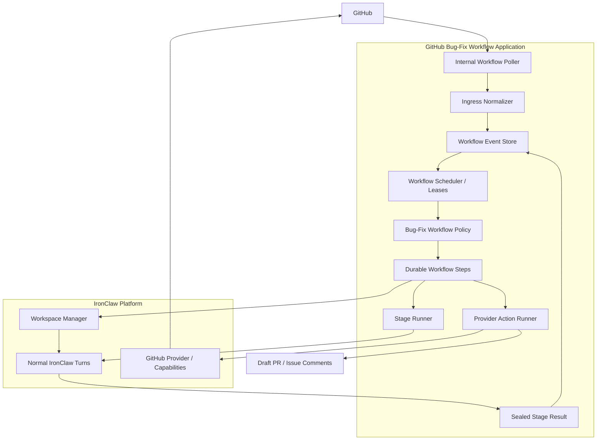
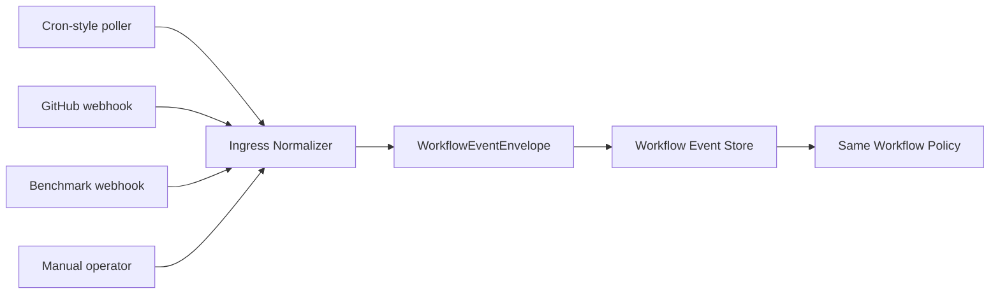

# GitHub Bug-Fix Workflow Application MVP - High-Level Overview

**Date:** 2026-06-15
**Status:** Companion overview to the detailed design; revised after 2026-06-22 pull review
**Deep spec:** `docs/superpowers/specs/2026-06-15-github-bug-orchestration-design.md`
**Target architecture:** IronClaw Reborn as the agent execution platform
**MVP ingress:** Internal cron-style poller

## 1. What This Is

This document explains where automated GitHub bug fixing slots relative to
IronClaw at a subsystem level.

The short version:

```text
GitHub observations
  -> GitHub bug-fix workflow application
      -> workflow-owned workflow events
      -> workflow-owned workflow policy/state machine
      -> normal IronClaw turns
      -> workflow-owned provider actions
      -> draft PR and lifecycle follow-up
```

IronClaw remains the agent execution platform. The new GitHub issue workflow is
the missing application layer between "something happened on GitHub" and "an
IronClaw agent should perform a scoped stage of work."

This may run in-process as first-party IronClaw crates for the MVP, or later as
a separately deployed workflow service. The placement is less important than
the contract: it must not become a thin cron harness. It is a narrow workflow
application for GitHub issues labeled `bug`, built with the orchestration depth
expected for unattended coding: durable workflow runs, workflow events,
workflow policies, provider action records, stage-specific prompts, strict
result schemas, bounded read-only fan-out by default, context-engineered
snapshots, isolated workspaces, and recovery semantics.

## 2. System Shape



The workflow has one central rule: every outside observation becomes a workflow event
before it affects orchestration. The workflow policy consumes workflow events. It does not care
whether a workflow event came from polling, a future webhook, a benchmark run, or a human
operator.

## 3. What Exists Today

IronClaw already has most of the execution substrate:

| Existing subsystem | Role in this design |
| --- | --- |
| Reborn turns / run profiles | Executes stage agents through normal IronClaw turn machinery. |
| Product workflow / turn coordination | Provides normal admission, canonical content persistence, idempotency, busy/deferred handling, and acknowledgements. |
| First-party GitHub extension | Supplies GitHub read/comment/PR/status capabilities that composition can wrap behind workflow ports. |
| First-party coding tools | Supplies file read/write/patch/shell/test capabilities under runtime policy. |
| Filesystem / host runtime | Owns path containment, mounts, sandbox process setup, and execution policy. |
| `ironclaw_projects` | Supplies first-class project records, membership, live access checks, and project metadata for project-scoped automation config. |
| Per-capability permission policy | Supplies explicit ask/disable/always-allow state and external-write effects that help enforce the provider-write boundary. |
| `ironclaw_triggers` | Owns user-facing scheduled triggers, including one-shot schedules, and trusted scheduled-trigger ingress. The MVP does not use this for workflow orchestration. |
| Output-aware progress detection | Improves stage terminal classification by recognizing repeated/no-progress capability output. |
| Events / projections / outbound surfaces | Provides the pattern for redacted observability and future UI exposure. |

The proposal adds the workflow layer that turns those pieces into a reliable
bug-fix loop.

### 3.1 Platform/Application Split

The split should be:

| Layer | Owns |
| --- | --- |
| GitHub bug-fix workflow application | Issue selection, workflow state, event ordering, policy transitions, prompts, result schemas, provider action records, GitHub reconciliation, recovery. |
| IronClaw platform | Turn execution, run status, checkpoints, gates, subagents, capability execution, workspace/runtime policy, provider capability surfaces. |

So the workflow application can be externalized later, but the reliability
model cannot be externalized away. If the app calls IronClaw, it still needs
the same strict idempotency, structured result verification, fan-out bounds,
and replay behavior.

## 4. What Needs To Be Added

### 4.1 GitHub Issue Workflow Crate

Suggested in-tree MVP crate:

```text
crates/ironclaw_github_issue_workflow/
```

This first-party workflow application crate owns the orchestration policy:

- workflow run and workflow event domain types;
- project-scoped GitHub automation configuration;
- workflow event normalization contracts;
- workflow policy/state machine transitions;
- durable step semantics;
- provider action record semantics;
- stage run records;
- prompt references and result schemas;
- workflow-owned ports for GitHub, turns, workspaces, events, and config.

It should not own concrete database clients, raw GitHub auth, raw host paths,
or low-level turn execution. If the workflow application is later deployed
outside the IronClaw repo, these same domain/policy contracts should remain
intact behind an API boundary.

### 4.2 Workflow Storage Crate

Suggested crate:

```text
crates/ironclaw_github_issue_workflow_storage/
```

This crate owns libSQL/PostgreSQL durable adapters for the workflow repository
traits. The important part is not just persistence; it is atomicity:

- workflow run uniqueness;
- workflow event idempotency;
- ordered workflow event sequences;
- workflow run leases;
- compare-and-swap workflow policy transitions;
- unique active stage per workflow run;
- provider action idempotency and reconciliation state;
- provider binding lookup.

This is where most of the "do not run the same bug twice" safety lives.

### 4.3 Composition Wiring

Suggested integration point:

```text
crates/ironclaw_reborn_composition/src/github_issue_workflow.rs
```

Composition wires concrete dependencies:

- storage repositories;
- internal poller;
- GitHub provider port implementation;
- normal stage-turn submitter;
- workspace manager;
- event sink/projection sink;
- runtime settings;
- credential/account policy.

The pulled IronClaw Project layer changes the recommended config placement:
repository selectors and automation ownership should be project-scoped whenever
a project exists. A local-dev no-project fallback is acceptable, but production
automation should fail closed if the project access check fails.

Composition should wire the system. It should not become the workflow policy engine.

## 5. How Subsystems Slot Together

| Concern | Owning subsystem | Integration boundary |
| --- | --- | --- |
| Polling for candidate issues | New workflow poller | Calls GitHub provider port and records workflow event envelopes. |
| Webhook readiness | New workflow ingress normalizer | Future webhooks produce the same workflow event envelopes as polling. |
| Durable unit of work | New workflow domain | One workflow run per GitHub issue. |
| State-machine orchestration | New workflow policy | Consumes ordered workflow events and emits steps. |
| Agent execution | Existing IronClaw turns | Stage runner submits normal scoped turns. |
| In-stage delegation | Existing IronClaw subagents | Optional child turns inside a stage; parent stage turn receives their results through dependent-run gates. |
| Agent result capture | New sealed workflow tool/capability | `workflow.report_stage_result` accepts structured stage results. |
| GitHub writes | New provider action runner over existing GitHub capabilities | Agents propose intent; workflow provider actions perform writes. |
| Workspace isolation | Existing workspace / host-runtime layers | Workflow stores scoped workspace refs and mount refs only. |
| Shell/tests/file edits | Existing coding tools under runtime policy | Stage turns receive constrained workspace capabilities. |
| Observability | Existing event/projection patterns plus workflow events | Workflow emits redacted lifecycle events and correlation ids. |
| Scheduling triggers | Existing `ironclaw_triggers` | Not used for MVP orchestration; can be integrated later for user-configurable schedules. |

## 6. Runtime Flow

### 6.1 Discovery

```text
internal poller
  -> search configured repos for open issues labeled bug
  -> read issue details and comments
  -> normalize candidate into github.issue.discovered workflow event
  -> create or reuse workflow run
```

The poller is intentionally boring. It has a fixed interval, backoff, and
per-repo limits. It does not own the state machine.

### 6.2 Claim

```text
workflow policy sees discovered issue
  -> creates claim_issue step
  -> provider action runner posts or reconciles claim comment
  -> provider binding records claim comment
  -> workflow policy advances to triage
```

The claim is comment-only for MVP. There is no label mutation unless GitHub
provider capabilities and policy are added later.

### 6.3 Stage Execution

```text
workflow policy starts stage run
  -> stage runner submits normal IronClaw turn
  -> turn runs with stage prompt, result schema, and capability profile
  -> agent calls sealed workflow.report_stage_result
  -> workflow validates result
  -> result becomes a workflow event
  -> workflow policy advances
```

The stage turn is not a trusted trigger. It is a normal scoped IronClaw turn
with workflow metadata and constrained capabilities.

If a stage turn uses `builtin.spawn_subagent`, those child runs stay inside
IronClaw's existing subagent model: parent-owned child thread/turn, dependent-run
gate, child terminal result returned to the parent as capability output. The
GitHub issue workflow should not treat those child completions as workflow
events by themselves. The workflow advances when the parent stage turn reports a
valid sealed result or terminally fails.

### 6.4 Implementation

```text
workflow policy prepares workspace
  -> workspace manager creates scoped workspace session
  -> implementation stage receives workspace mount
  -> agent edits files and runs tests through normal coding tools
  -> structured result records changed files and evidence
```

The workflow domain stores workspace refs and mount aliases, not raw host
paths.

### 6.5 Draft PR

```text
workflow policy receives implementation result
  -> pr_synthesis stage prepares summary
  -> provider action runner pushes branch and creates draft PR
  -> provider binding records PR
  -> issue comment links PR once
```

Ambiguous writes are reconciled by stable markers, branch names, provider ids,
and provider bindings before retrying.

### 6.6 Lifecycle Follow-Up

```text
poller refreshes active workflow runs
  -> observes PR state, checks, GitHub Actions runs, review comments
  -> records lifecycle workflow events
  -> workflow policy may start ci_repair or review_response stage
  -> merged PR marks workflow run succeeded
```

This is the basis for the longer benchmark -> issue -> implement -> review ->
benchmark loop.

## 7. Ingress Integration

The MVP has one ingress source:

```text
internal fixed-interval poller
```

Future ingress sources should plug in here:



That means webhooks should be easy to add later if the workflow event boundary is kept
strict:

- webhook handlers authenticate and validate delivery;
- handlers map provider payloads to typed workflow event payloads;
- workflow events carry source delivery ids and provider timestamps;
- provider bindings route provider ids back to workflow runs;
- echo suppression ignores self-authored provider events;
- workflow policy logic remains unchanged.

## 8. Why The MVP Does Not Use `ironclaw_triggers`

`ironclaw_triggers` owns user-facing scheduled trigger records, first-class
one-shot schedules, and trusted scheduled-trigger ingress. That is a different
abstraction from an internal maintenance poller for one workflow.

For MVP, using `ironclaw_triggers` would blur two responsibilities:

- trigger scheduling and trusted trigger delivery;
- GitHub issue workflow run orchestration.

The workflow should own workflow runs, workflow events, workflow policies,
provider actions, and stage runs.
The MVP poller only wakes the workflow up and records observations.

Later, if IronClaw wants user-configurable automation schedules, the integration
can look like this:

```text
ironclaw_triggers due fire
  -> workflow poll request / scan request
  -> workflow events
  -> same workflow policy
```

Even then, triggers should own the schedule. The GitHub issue workflow should
still own the bug-fix lifecycle.

## 9. Turn Integration

The workflow needs a stage-turn submitter facade. Its job is to create a normal
IronClaw turn with workflow metadata:

```text
workflow run id
stage run id
stage name
workflow policy version
prompt ref/version
capability profile
workspace mount ref
idempotency key
```

This facade should call existing turn/product-workflow machinery. It should
not mint trusted trigger inbound requests, bypass admission, bypass auth, or
pass raw host paths into model-visible context.

The stage agent receives enough context to do the stage, then reports a typed
result through `workflow.report_stage_result`.

Subagents are optional inside that turn. They are useful for exploration,
planning, or review, but they are not the orchestration layer. Their
outputs flow back to the stage turn; the workflow policy still owns lifecycle
transitions.

That means the workflow application does not reimplement IronClaw subagents.
It defines each stage's allowed fan-out budget, allowed subagent kinds, and
result-validation rules. IronClaw supplies the actual child-run mechanics.

Default MVP subagents should be read-only. Writable parallel work should be
modeled as explicit workflow-managed child stage tasks with isolated workspace
ownership and merge/reconcile policy, not as model-selected child agents sharing
one checkout.

## 9.1 Driver And Context Engineering

The workflow policy does not need to be a rigid ladder forever. The updated
Stevie orchestrator work reinforces a useful split:

```text
deterministic rails
  claim, lease, dedupe, provider actions, stage/result validation, terminal states

driver-style decision stages
  plan deltas, routing, fan-out choices, review/repair strategy, human handoff
```

The GitHub bug workflow can start with fixed stages, but the design should
leave room for a short driver stage that receives an engineered workflow
snapshot and returns a strict decision. The app validates and applies the
decision; the model does not mutate workflow state directly.

Snapshots should be curated:

- stable project/repo/issue identity and policy version;
- digest of current plan, recent journal, provider actions, and PR/check state;
- current event, stage attempt, blockers, and success criteria;
- read-only lookup refs for details.

They should not be raw database dumps or full provider transcript dumps.

## 10. GitHub Integration

The existing GitHub extension provides useful capabilities, but the workflow
should not let agents call GitHub write tools directly.

Instead:

```text
stage agent
  -> structured intent
  -> workflow policy step
  -> provider action record
  -> provider action runner
  -> GitHub provider port
  -> existing GitHub capability / host-mediated request
```

This gives the system:

- idempotency for comments, branch pushes, and PR creation;
- reconciliation after ambiguous failures;
- auditability;
- echo suppression;
- future webhook routing through provider bindings.

MVP writes are limited to claim comments, issue comments, branch push/create,
draft PR creation, and review replies if needed.

## 11. Workspace Integration

The workflow asks a workspace manager for a workflow-run-scoped workspace:

```text
owner/repo + base ref + workflow run id
  -> workspace session
  -> scoped mount ref
  -> stage capability profile
```

The model should see a stable mount such as `/workspace`, not the host clone
path. Host paths, process handles, clone implementation details, and cleanup
policy stay inside the workspace / host-runtime subsystem.

This keeps the workflow portable across local worktrees, sandboxed clones, or a
future remote workspace backend.

## 12. Storage Integration

The workflow store is not generic transcript storage. It is orchestration
state. The core records are:

- workflow run;
- workflow run workflow event;
- provider binding;
- step run;
- provider action record;
- stage run;
- optional stage task;
- workspace session ref.

The store must support libSQL and PostgreSQL before production. The most
important tests are repository contract tests for idempotency, leases,
compare-and-swap transitions, tenant scoping, active stage uniqueness, and
provider action reconciliation.

## 13. Observability Integration

The workflow should emit redacted lifecycle events, not raw prompts, raw tool
arguments, raw host paths, or raw provider tokens.

Minimum trace shape:

```text
issue
  -> workflow run
  -> workflow event
  -> step
  -> stage run
  -> turn run
  -> provider action
  -> provider binding
  -> PR
```

This should be enough for operators to answer:

- which GitHub issue is this workflow run for?
- what workflow events caused the latest transition?
- which stage is running or blocked?
- what turn produced the current result?
- which provider action wrote to GitHub?
- how would the system recover if retried?

## 14. Architecture Contrast

This design adapts orchestration ideas into an IronClaw-powered workflow
application:

| Orchestration concern | IronClaw workflow equivalent |
| --- | --- |
| Durable issue lifecycle | GitHub issue workflow run |
| Ordered observations | Append-only workflow events |
| Deterministic orchestration | `github_issue_bugfix@1` workflow policy |
| Replayable side-effect boundary | Workflow step run |
| External write ledger | GitHub provider action record with reconciliation |
| Provider resource routing | GitHub issue/PR/comment/check provider bindings |
| Agent work envelope | Stage run plus optional stage tasks |
| Prompted model work | Stage prompt, result schema, and capability profile |
| Driver-style routing | Short schema-validated workflow decision stage over engineered snapshots |
| In-stage delegation | Existing IronClaw subagent child turns, read-only by default |
| Workspace isolation | Workspace session and scoped mount |
| Future push delivery | Workflow event ingress source |

The biggest difference is execution ownership: IronClaw already has the turn,
tool, subagent, runtime, and workspace machinery, so the workflow application
should coordinate those systems instead of reimplementing an agent runtime.

That also means subagents are not a replacement for the workflow layer. They are
an execution primitive inside a workflow-owned stage run, and default MVP
subagents should be read-only context firewalls rather than parallel writers.

## 15. MVP Integration Order

The cleanest build order is:

1. Add workflow domain and in-memory repository.
2. Add fake workflow policy transitions and step records.
3. Add one real stage-turn vertical slice with sealed result reporting.
4. Add project-scoped workflow configuration and live project-access checks.
5. Add internal poller and GitHub discovery/claim comments.
6. Add engineered stage snapshots and one driver-style decision slice.
7. Add workspace materialization and implementation stage.
8. Add branch push, draft PR creation, and PR link comment.
9. Add durable libSQL/PostgreSQL storage parity.
10. Add lifecycle refresh for CI and review comments.

This order proves the hardest integration early: workflow-owned orchestration
driving normal IronClaw turns and receiving structured results. It also keeps
core changes honest: any IronClaw change should be a reusable platform
primitive, not GitHub bug-fix lifecycle code.

## 16. Final Mental Model

Think of the system as four layers:

```text
Ingress layer
  observes the world and records workflow events

GitHub bug-fix workflow application
  owns workflow runs, workflow policies, leases, prompts, schemas, steps,
  provider actions, provider bindings, recovery, and stage runs

IronClaw platform layer
  runs agents, turns, subagents, tools, workspaces, provider calls, auth,
  status, structured-result plumbing, and runtime policy

Provider/runtime layer
  talks to GitHub, shell, filesystem, model providers, and workspace backends
```

The workflow application is the new part. It is the piece that makes the system
more than a cron prompt, and it is the piece that can later support webhooks,
benchmark loops, review loops, and more agent-driven product work without
forcing GitHub-specific lifecycle policy into IronClaw core.
