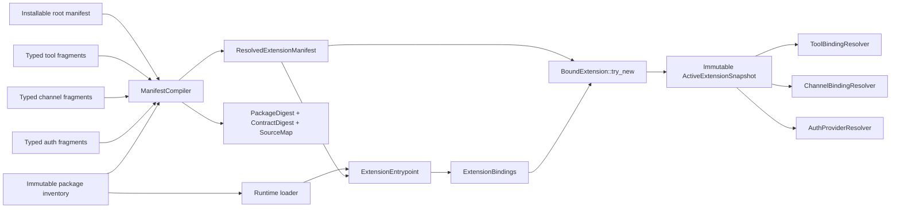
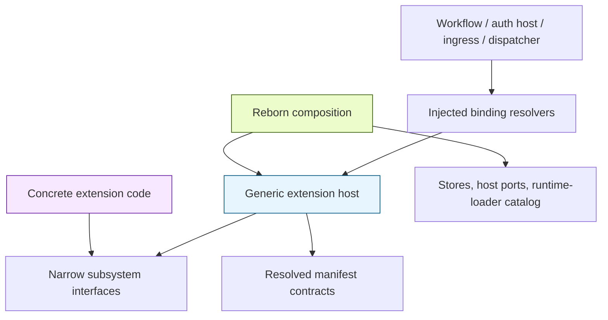
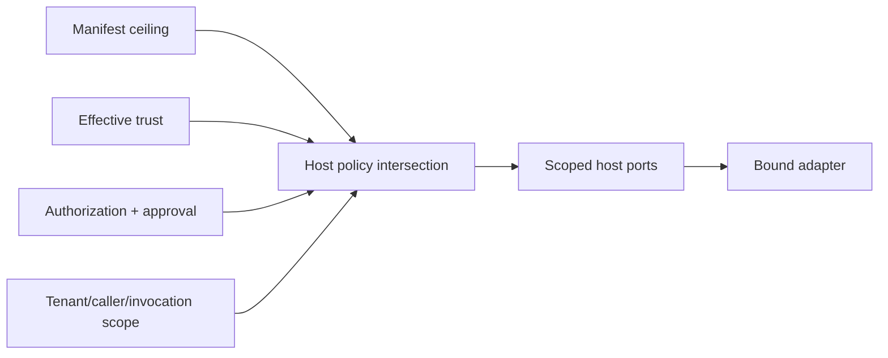
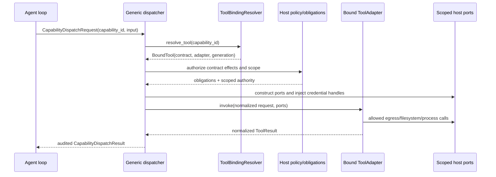
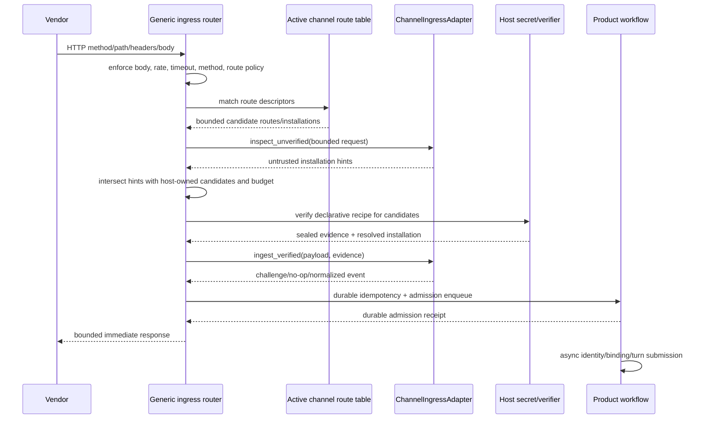
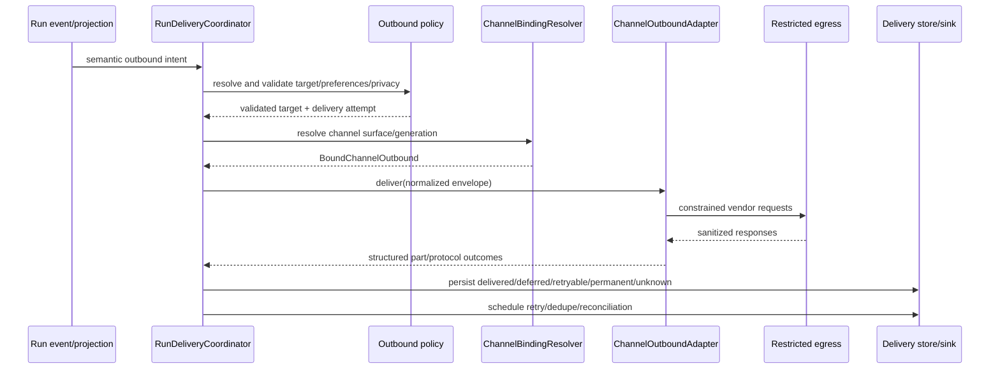

# Unified Extension Runtime — Definitive Engineering Design

**Date:** 2026-07-09

**Status:** Approved engineering handoff; no production implementation is included in this change

**Source baseline:** `nearai/ironclaw` commit `900d435ee4d8496fb0d711fcf2f52807f1d414d3` (`origin/nea25/08-audit-fixes`)

**Audience:** The implementation agent and reviewers responsible for taking NEA-25 to the fully generic end state

**Normative companions:**

- `CONTEXT.md`
- `docs/adr/0001-extension-manifest-graph-and-adapter-seams.md`
- `docs/reborn/contracts/extension-runtime.md`
- `docs/superpowers/plans/2026-07-09-unified-extension-runtime-implementation-plan.md`
- `docs/reborn/extension-runtime-verification.md`

---

## 1. Purpose

This document is the durable target for completing the unified extension
architecture. It is deliberately more exact than a normal design note. It
defines the model, boundaries, type shapes, ownership, manifest syntax,
runtime flows, migration, security properties, failure semantics, and exit
criteria that implementation must satisfy.

The central requirement is:

> Outside concrete extension packages, content-addressed implementation
> dependencies, versioned migration shims, fixtures, tests, and documentation,
> IronClaw may reason only about extension/install identities, surface keys,
> capability kinds, normalized requests and events, host policy, trust,
> credentials, persistence, and lifecycle. It may not contain a concrete
> product/provider literal, protocol type, route, constructor, feature flag, or
> behavior branch.

This is stronger than the current NEA-25 stack. NEA-25 correctly unifies the
product taxonomy and manifest identity. The checked-out tip still has a
Slack-specific runtime path in composition, auth, lifecycle, CLI/config, and
the frontend. Those are migration inputs, not acceptable end-state exceptions.

## 2. Outcome and definition of done

The project is done only when all of these statements are simultaneously true:

1. `Extension` is the only installable product object.
2. One root manifest owns the complete contract, while explicit typed leaf
   fragments allow declarations to live in small files.
3. Resolution produces one immutable, persisted, digest-pinned contract.
4. One runtime `ExtensionEntrypoint` supplies implementations for that contract.
5. Each implementation is a narrow adapter for one subsystem or surface.
6. The runtime supplies behavior only; it cannot restate or widen manifest
   authority.
7. Binding is an exact bijection: every executable declaration has exactly one
   correct implementation and no undeclared implementation exists.
8. Inbound channel payloads become normalized host input only through the bound
   channel ingress adapter.
9. All user-visible channel output goes through generic outbound policy and the
   bound channel outbound adapter. There are no direct protocol sends in core.
10. Tools are declared once and invoked through bound tool adapters; the core
    does not choose behavior by concrete extension or by package-specific code.
11. OAuth/provider behavior is behind a bound auth adapter; auth core owns
    security state and never branches on a concrete provider.
12. Connection, target, setup, and surface actions use generic host APIs and
    bound adapters.
13. Activation, restore, upgrade, disable, and removal publish complete,
    immutable generations atomically.
14. The backend and frontend render arbitrary channel surfaces from the same
    typed surface DTO. There is no Slack-only UI branch or channel registry.
15. Adding or deleting a channel package requires no source change in generic
    host, composition, workflow, auth, CLI/config, backend route, or frontend
    code.
16. Slack and Telegram exercise the same production interfaces, proving the
    abstractions have more than one concrete implementation.
17. The permanent architecture gates and the full requirement ledger in
    `docs/reborn/extension-runtime-verification.md` pass with no unexplained
    exception.

The practical deletion test is decisive:

> If the Slack extension package and concrete Slack crate are removed from a
> build, every generic IronClaw crate must still compile and its tests must
> still pass. If a new Discord extension package is added, no generic source
> file should change.

## 3. Scope

### 3.1 In scope

- Manifest v3 root-plus-fragment compilation.
- Immutable resolved contract, source map, package digest, and contract digest.
- Persistent manifest-closure and activation-generation state.
- One extension entrypoint and exact typed binding.
- Generic runtime loaders for native first-party and WASM extension runtimes.
- Existing tool runtime lanes adapted behind `ToolAdapter`.
- Generic channel ingress, outbound, target, connection, and surface-action
  interfaces.
- Generic OAuth/auth-provider orchestration behind `AuthProviderAdapter`.
- Generic active-extension host and atomic lifecycle.
- Extraction of all Slack protocol behavior from composition and frontend.
- Migration of all first-party manifests to fragments.
- Explicit support for runtime-discovered hosted MCP capabilities.
- Shared, digest-pinned provider implementation dependencies.
- libSQL and PostgreSQL parity for durable state.
- Architecture, integration, frontend, migration, and security tests.
- Docs, feature parity, changelog, CI path filters, and skill updates.

### 3.2 Out of scope

- Adding a new user-facing capability kind beyond the reserved Trigger and File
  kinds.
- Allowing arbitrary extension-owned Axum handlers.
- Recursive manifests, remote imports, globs, overrides, or generic TOML merge.
- Unrestricted native plugins loaded from third-party paths.
- Treating provider packages, manifest fragments, tools, channels, or auth
  grants as independently installable products.
- Moving host security policy into extension code.
- Preserving permanent dual runtime paths after migration.

### 3.3 Non-negotiable implementation discipline

- Reborn code lives under `crates/`; do not add features to the v1 `src/`
  monolith.
- Each migration step must use a production caller. A second, test-only or
  unused registry does not count as progress.
- Caller-level integration tests must drive the real route/dispatcher/store
  boundary where the behavior occurs.
- No ignored tests.
- Both database backends are required for new persistent behavior.
- Composition remains assembly. It does not absorb the new runtime host's
  behavior.

---

## 4. Verified current-state baseline

All observations below were checked against the source baseline named above.
Line anchors describe that baseline and will naturally move during
implementation.

### 4.1 What NEA-25 already gets right

| Claim | Current evidence |
| --- | --- |
| The manifest is the extension product record. | `crates/ironclaw_extensions/src/v2.rs:559-610` defines `ExtensionManifestV2`. |
| Surface kind is product taxonomy, independent of runtime kind. | `crates/ironclaw_host_api/src/surface.rs:15-47`. |
| Tool, host-API, and auth surfaces are projected generically. | `crates/ironclaw_extensions/src/v2.rs:773-859`. |
| The frontend wire knows channel direction and caller connection state. | `crates/ironclaw_product_workflow/src/reborn_services/types.rs:1137-1178`. |
| Product workflow projects channel surfaces instead of consulting a separate channel registry. | `crates/ironclaw_product_workflow/src/reborn_services/extensions.rs:390-419`. |
| A narrow channel protocol adapter exists. | `crates/ironclaw_product_adapters/src/adapter.rs:22-64`. |
| Slack implements normalized parse and outbound rendering behavior. | `crates/ironclaw_slack_v2_adapter/src/adapter.rs:73-230`. |

### 4.2 Where the current code disagrees with the desired end state

| Gap | Current evidence | Required disposition |
| --- | --- | --- |
| One TOML string is the only parse input. | `crates/ironclaw_extensions/src/v2.rs:727-759`. | Add package-level compiler and typed fragments. |
| Installed records persist and expose raw root TOML. | `crates/ironclaw_extensions/src/installations.rs:40-83`. | Persist the complete closure and resolved contract; remove production reprojection from raw TOML. |
| Slack's runtime locator points only at its tool WASM. | `crates/ironclaw_first_party_extensions/assets/slack/manifest.toml:8-10`. | Root runtime must load the extension entrypoint responsible for all bindings. |
| Slack declares five tools plus one channel, while auth is inferred from tool credentials. | `crates/ironclaw_first_party_extensions/assets/slack/manifest.toml:19-151`. | Migrate to five tool fragments, one channel fragment, and one explicit auth fragment. |
| Runtime adapter repeats manifest-owned surface, auth, capability, and egress metadata. | `crates/ironclaw_product_adapters/src/adapter.rs:23-39`; `crates/ironclaw_slack_v2_adapter/src/adapter.rs:25-97`. | Remove metadata getters; bind behavior to the resolved contract. |
| ProductAdapter runtime projection is not the production assembly path. | `crates/ironclaw_product_adapter_registry/src/lib.rs:283-353`. | Replace with active bound-extension resolver views and delete raw projection. |
| Tool dispatch selects a package and runtime kind at call time. | `crates/ironclaw_dispatcher/src/lib.rs:232-316`. | Dispatch by capability ID to a prevalidated bound tool. |
| Generic workflow contains Slack cleanup literals. | `crates/ironclaw_product_workflow/src/reborn_services/extensions.rs:28-30,427-446`. | Use surface-keyed connection/lifecycle adapters; retain legacy handling only in migration. |
| Lifecycle emits Slack-specific connection copy. | `crates/ironclaw_reborn_composition/src/extension_host/extension_lifecycle.rs:1526-1560`. | Read generic connection/action descriptors from the resolved surface. |
| OAuth start branches on Slack. | `crates/ironclaw_reborn_composition/src/product_auth/serve/oauth.rs:125-156,225-436`. | One generic start/callback path resolves a bound auth provider. |
| Auth composition multiplexes providers by string. | `crates/ironclaw_reborn_composition/src/product_auth/credentials/product_auth_providers.rs:280-354`. | Inject `AuthProviderResolver`; a bound provider fixes identity. |
| Composition constructs the entire Slack runtime graph manually. | `crates/ironclaw_reborn_composition/src/slack/slack_host_beta.rs:946-1077`. | Move behavior to `ironclaw_slack_extension`; composition invokes generic activation only. |
| Composition mounts a Slack-specific route and handler. | `crates/ironclaw_reborn_composition/src/slack/slack_serve.rs:206-285`. | One generic bounded ingress router uses the active route table. |
| Slack envelope selection and candidate verification live in composition. | `crates/ironclaw_reborn_composition/src/slack/slack_serve/installation.rs:608-739`. | Adapter supplies untrusted hints/protocol parsing; host verifies declarative recipes. |
| Slack delivery and direct sends live in composition. | `crates/ironclaw_reborn_composition/src/slack/slack_delivery.rs`. | Generic coordinator plus Slack outbound adapter; no direct bypass. |
| Frontend branches on Slack and owns Slack-only setup components. | `crates/ironclaw_webui_v2/frontend/src/pages/extensions/components/channels-tab.tsx`; `components/slack-setup-panel.tsx`; `components/slack-channel-picker.tsx`. | Generic surface forms/actions and arbitrary-channel fixtures. |
| Hosted MCP mutates capabilities from live `tools/list`. | `crates/ironclaw_extensions/src/hosted_mcp_discovery.rs:34-75,109-217`. | Model a manifest-constrained dynamic tool-provider surface; do not falsely require a static leaf for each live tool. |

The current behavior is therefore a useful tracer bullet, not the final
boundary.

---

## 5. Target mental model

### 5.1 Compile, bind, and publish



The resolved manifest is the contract. The entrypoint returns implementations.
The join validates exact correspondence. Subsystems read immutable resolver
views; they do not parse manifests or select concrete implementations.

### 5.2 The only permitted dependency direction



Concrete extensions depend on generic contracts. Generic host crates never
depend on concrete extensions. Composition may depend on a generated
first-party factory catalog, but not on a Slack/Telegram/Google implementation
crate directly.

---

## 6. Boundary law

### 6.1 Generic code may know

- `ExtensionId`, `ExtensionInstallationId`, tenant and caller scope.
- `SurfaceKey` and `CapabilitySurfaceKind`.
- `CapabilityId`, effects, permissions, schemas, host ports, resource profile.
- normalized inbound/outbound/auth/tool DTOs.
- manifest-declared route, signature recipe, egress, credential, connection,
  action, and display descriptors.
- runtime technology (`wasm`, `native`, `mcp`, `script`) for loading only.
- trust decisions, signature state, authorization, approvals, obligations.
- secrets as opaque handles.
- lifecycle state, health, generation, digests, revisions.
- durable conversation, identity, target, idempotency, and delivery records.

### 6.2 Generic code must not know

- a concrete channel/provider/package ID such as `slack`, `telegram`, `google`,
  or `notion` in a live behavior branch;
- a concrete protocol payload or external identifier type;
- a concrete callback/webhook route or header name in Rust/TypeScript source;
- a concrete adapter constructor or concrete crate import;
- a channel-specific compile feature or config struct;
- provider endpoints, token response fields, scope parameter quirks, or revoke
  semantics;
- message rendering blocks, multipart limits, DM/channel ID syntax, or vendor
  API method names;
- direct vendor network calls;
- product-specific connection/setup copy or frontend component selection;
- raw secrets supplied to channel/tool/auth adapters outside a restricted host
  port.

### 6.3 Allowed concrete-name locations

Concrete names are allowed only in:

1. the owning extension/provider implementation crate;
2. extension package manifests, fragments, assets, and localization resources;
3. versioned migration and compatibility code with an expiry/removal test;
4. test fixtures and tests exercising a concrete product;
5. docs and changelog text;
6. a generated first-party implementation catalog whose generated entries are
   data, not handwritten product branches.

The architecture gate must use path-scoped allowlists. A broad exception for a
term or an entire generic crate is forbidden.

The zero-specificity rule applies to extension integrations and their
credential providers. Host-login SSO is a separate bounded subsystem; existing
Google/GitHub login-provider code may remain only under explicitly annotated
host-login SSO modules and must not be reused for extension auth switching.
The architecture test distinguishes these scopes rather than blanket-banning a
provider word everywhere.

---

## 7. Domain model and identities

### 7.1 Stable identity types

Canonical extension/install/surface resolution types live in a new
`ironclaw_extension_contracts` crate: move `ExtensionInstallationId`,
`SurfaceKey`, and `BindingResolutionScope` there. The one canonical provider ID
stays at the lower existing host-API layer: rename
`RuntimeCredentialAccountProviderId` to `ironclaw_host_api::AuthProviderId`,
temporarily expose the old name as a deprecation alias, and have both
`ironclaw_extension_contracts` and `ironclaw_auth` use/reexport that same type.
This avoids a dependency cycle. Retire `ProductAdapterId` and
`AdapterInstallationId` by converting stored values to full
surface/installation identities during migration.

```rust
pub struct SurfaceKey {
    pub extension_id: ExtensionId,
    pub local: SurfaceLocalKey,
}

pub enum SurfaceLocalKey {
    Tool(CapabilityId),
    Channel(ChannelSurfaceId),
    Auth(AuthSurfaceId),
    Trigger(TriggerSurfaceId),
    File(FileSurfaceId),
}
```

Rules:

- A tool keeps its current fully qualified public `CapabilityId`, such as
  `slack.search_messages`. Manifest v3 does not change public tool names.
- The constructor verifies the capability prefix matches `ExtensionId`.
- Channel/auth/trigger/file IDs are manifest-local strong types. Their fully
  qualified wire form is `<extension>/<kind>/<local-id>`.
- Package ID is never used as an implicit channel ID. One extension may own
  multiple channel surfaces.
- `AuthProviderId` names an external credential authority. It is a field of an
  auth surface, not the product identity.
- Every durable record uses the full `SurfaceKey`, installation ID, tenant, and
  caller scope where applicable.

`ironclaw_extension_contracts` also owns dependency-cycle-safe declarative
DTOs:

```rust
pub enum ResolvedSurfaceContract {
    Tool(ResolvedToolSurfaceContract),
    Channel(ResolvedChannelSurfaceContract),
    Auth(ResolvedAuthSurfaceContract),
    TriggerReserved(ResolvedReservedSurfaceContract),
    FileReserved(ResolvedReservedSurfaceContract),
}

pub enum BindingRequirement {
    Runtime,
    HostManaged,
    ReservedUnsupported,
}
```

Host-API parsers return these neutral typed DTOs. `ironclaw_extensions` stores
them in `ResolvedExtensionManifest`; operational traits remain in
`ironclaw_product_adapters` and `ironclaw_auth`. This is the seam that removes
raw-TOML reprojection without making the declarative compiler depend on runtime
adapter crates.

### 7.2 Declaration ownership and implementation ownership

```rust
pub enum BindingOwner {
    RootExtension,
    Dependency {
        package: RuntimeDependencyId,
        version: ExactVersion,
        digest: PackageDigest,
        export: RuntimeExportId,
    },
}

pub struct ExpectedSurfaceBinding {
    pub key: SurfaceKey,
    pub owner: BindingOwner,
    pub contract: SurfaceContract,
}
```

The root manifest always owns product membership and declaration authority.
`BindingOwner::Dependency` means the implementation comes from a pinned shared
artifact; it does not make that artifact an independently installable product.

### 7.3 Extension generation

```rust
pub struct ActiveExtensionGeneration {
    pub installation_id: ExtensionInstallationId,
    pub generation: u64,
    pub package_digest: PackageDigest,
    pub contract_digest: ContractDigest,
    pub effective_trust: TrustClass,
    pub bound: Arc<BoundExtension>,
}
```

Generations are immutable. In-flight work holds an `Arc` to the generation it
started with. New work sees the generation in the latest active snapshot.

---

## 8. Manifest v3: one logical compilation unit

### 8.1 Authoring rule

An extension has exactly one installable `manifest.toml`. The root may place a
host-API section inline or import typed fragments for it. It may never do both
for the same host-API reference.

Fragments are source organization only. They have no identity or lifecycle and
cannot be searched, installed, enabled, disabled, trusted, upgraded, or removed
independently.

The root remains the single source of truth because it exclusively owns:

- extension identity and version;
- requested trust;
- runtime entrypoint selection;
- package dependency pins;
- host-API contract membership;
- fragment membership and order;
- the resulting complete contract digest.

A file present in the package but absent from the root import closure grants no
surface or authority.

### 8.2 Root schema

The first fragmented schema is `reborn.extension_manifest.v3`. v2 remains a
compatibility input and normalizes into the same resolved domain model.

The unified Slack root must have this shape after migration:

```toml
schema_version = "reborn.extension_manifest.v3"
id = "slack"
name = "Slack"
version = "0.2.0"
description = "Slack tools, account authorization, and messaging channel"
trust = "first_party_requested"

[runtime]
kind = "first_party"
service = "slack.extension/v1"

[[host_api]]
id = "ironclaw.capability_provider/v2"
section = "capability_provider.tools"
fragments = [
  "manifests/tools/search_messages.toml",
  "manifests/tools/list_conversations.toml",
  "manifests/tools/get_conversation_history.toml",
  "manifests/tools/get_user_info.toml",
  "manifests/tools/send_message.toml",
]

[[host_api]]
id = "ironclaw.channel/v1"
section = "channels.messages"
fragments = ["manifests/channels/messages.toml"]

[[host_api]]
id = "ironclaw.auth_provider/v1"
section = "auth.user_account"
fragments = ["manifests/auth/user_account.toml"]
```

The service key is data consumed by `NativeExtensionLoader`. Generic
composition does not match `slack` or call a Slack constructor.

### 8.3 Fragment envelope

Every fragment has exactly three root fields:

```toml
schema_version = "reborn.extension_fragment.v1"
kind = "capability"

[body]
# Contract-owned typed payload.
```

Unknown envelope fields fail closed. The generic compiler understands only
`schema_version`, `kind`, and `body`. The selected host-API contract owns the
body schema, cardinality, and aggregation.

Fragments cannot declare:

- `id`, `name`, `version`, `description`, or `trust` for an extension;
- `[runtime]`;
- `[[host_api]]`;
- imports or fragment paths;
- dependency membership;
- package signatures.

### 8.4 Static tool fragment

```toml
schema_version = "reborn.extension_fragment.v1"
kind = "capability"

[body]
id = "slack.search_messages"
description = "Search all Slack messages visible to the connected user."
effects = ["dispatch_capability", "network", "use_secret"]
default_permission = "ask"
visibility = "model"
input_schema_ref = "schemas/slack/search_messages.input.v1.json"
output_schema_ref = "schemas/slack/raw_output.v1.json"
prompt_doc_ref = "prompts/slack/search_messages.md"
required_host_ports = ["host.runtime.http_egress"]

[[body.runtime_credentials]]
handle = "slack_user_token"
provider = "slack"
auth_surface = "user_account"
setup = "oauth"
provider_scopes = ["search:read"]
audience = { scheme = "https", host_pattern = "slack.com" }
target = { type = "header", name = "authorization", prefix = "Bearer " }
```

Asset references remain package-root-relative. Moving a fragment does not
silently retarget its schemas, prompts, or runtime artifacts.

Every static tool leaf produces exactly one capability and one Tool surface.
Duplicate capability IDs across any inline section or fragment fail the whole
extension.

### 8.5 Channel fragment

```toml
schema_version = "reborn.extension_fragment.v1"
kind = "channel"

[body]
id = "messages"
display_name = "Slack messages"
inbound = true
outbound = true

[body.ingress]
route_id = "events"
method = "post"
route_suffix = "events"
listener_class = "public_webhook"
body_limit_bytes = 1048576
max_requests = 12000
window_seconds = 60
candidate_limit = 32
immediate_response_deadline_ms = 2500

[body.ingress.verification]
kind = "hmac_request_signature"
algorithm = "sha256"
secret_handle = "slack_signing_secret"
signature_header = "X-Slack-Signature"
timestamp_header = "X-Slack-Request-Timestamp"
max_age_seconds = 300
signature_prefix = "v0="
signature_encoding = "hex"
signed_payload = [
  { literal = "v0:" },
  { header = "X-Slack-Request-Timestamp" },
  { literal = ":" },
  { body = true },
]

[[body.credentials]]
handle = "slack_signing_secret"
purpose = "ingress_verification"

[[body.credentials]]
handle = "slack_bot_token"
purpose = "outbound_egress"

[[body.egress]]
scheme = "https"
host = "slack.com"
methods = ["post"]
credential_handle = "slack_bot_token"

[body.presentation]
supports_markdown = true
supports_threads = true
max_message_chars = 40000
prefer_concise = true

[body.connection]
required = true
strategy = "surface_action"
begin_action = "connect"
disconnect_action = "disconnect"

[[body.actions]]
id = "connect"
kind = "connection_begin"
label = "Connect"

[[body.actions]]
id = "disconnect"
kind = "connection_disconnect"
label = "Disconnect"
```

The exact field vocabulary should reuse current ingress-policy types wherever
possible. The important design constraint is that the signature construction
is a finite, validated recipe interpreted by the host. Slack-specific HMAC
bytes are not hardcoded in generic Rust, and the signing secret never crosses
into the adapter.

The adapter may parse the unverified body to return an untrusted installation
hint. The host bounds candidates, loads the declared secret handle for each
candidate, executes the recipe, performs constant-time comparison and replay/
freshness checks, then mints sealed verification evidence.

The first verifier supports only HMAC-SHA256, at most 16 signed-payload
segments, at most 256 total literal bytes, one body segment, and headers already
named by the route verification descriptor. These are host ceilings; a
manifest may request less, never more. Adapter-generated immediate responses
are capped at 64 KiB, status 200–299, a small allowlist of safe content headers,
and the route deadline.

For v3, the host constructs the canonical route
`/webhooks/extensions/{extension_id}/{channel_surface_id}/{route_suffix}`.
`route_suffix` is one literal URL-safe segment; manifests cannot select `/api`,
`/v2`, auth, admin, WebUI, or catch-all space. Matching uses one canonical
percent-decoding/normalization pass and rejects encoded separators, dot
segments, duplicate slashes, wildcards, and ambiguous encodings. Activation
checks collisions against every fixed host route as well as extension routes.
Legacy `/webhooks/slack/events` is a versioned forwarding alias during the
compatibility release only.

### 8.6 Auth fragment

```toml
schema_version = "reborn.extension_fragment.v1"
kind = "auth_provider"

[body]
id = "user_account"
provider = "slack"
display_name = "Slack account"
flow = "oauth2_authorization_code"
pkce = "optional"
client_id_handle = "slack_oauth_client_id"
client_secret_handle = "slack_oauth_client_secret"
callback = "host_managed"

[body.authority]
authorization_hosts = ["slack.com"]
token_hosts = ["slack.com"]
allowed_scopes = [
  "search:read",
  "channels:history",
  "groups:history",
  "im:history",
  "mpim:history",
  "channels:read",
  "groups:read",
  "im:read",
  "mpim:read",
  "users:read",
  "chat:write",
]
```

Provider endpoints, Slack's `user_scope` parameter, token-response parsing,
refresh/revoke behavior, and identity extraction belong to the bound
`AuthProviderAdapter`. The manifest declares the maximum hosts, scopes,
credential handles, and flow family. The host enforces that ceiling.

For manifest v3, every `product_auth_account` credential reference must resolve
to either:

- an explicit auth surface in the same root compilation unit; or
- a digest-pinned provider implementation dependency exported into that root.

The current v2 compatibility compiler may synthesize an auth declaration from
credential requirements, preserving existing reads. New v3 packages may not
depend on implicit auth-surface synthesis.

Auth surfaces support two explicit flow families:

```rust
pub enum ResolvedAuthFlow {
    OAuth2AuthorizationCode(ResolvedOAuthContract),
    ManualSecret(ResolvedManualSecretContract),
}

pub enum AuthImplementation {
    OAuth(Arc<dyn AuthProviderAdapter>),
    Manual {
        validator: Option<Arc<dyn ManualAuthValidatorAdapter>>,
    },
}
```

`ManualSecret` is host-managed by default: the manifest declares field schema,
secret handle, display metadata, and optional audience/format constraints; the
host validates shape and stores the encrypted secret. It therefore has
`BindingRequirement::HostManaged` and needs no extension runtime binding. If
the manifest declares `remote_validation = "adapter"`, the corresponding
entrypoint must return exactly one `ManualAuthValidatorAdapter`; it receives no
raw stored secret and validates through restricted egress with host injection.

### 8.7 Host-API compiler interface

The current contract receives one inline TOML value. Replace that input with:

```rust
pub enum HostApiManifestInput {
    Inline {
        section: ManifestSectionPath,
        value: toml::Value,
        source: ManifestSourceSpan,
    },
    Fragments {
        section: ManifestSectionPath,
        entries: Vec<ManifestFragmentInput>,
    },
}

pub struct ManifestFragmentInput {
    pub path: ExtensionAssetPath,
    pub kind: ManifestFragmentKind,
    pub body: toml::Value,
    pub source: ManifestSourceSpan,
}
```

The registry still owns contract lookup, multiplicity, section uniqueness, and
prohibition on unreferenced operational sections. Each contract receives its
input and returns typed declarations plus source provenance.

Locked contract behavior:

- `ironclaw.capability_provider/v2` accepts ordered `capability` leaves or one
  `runtime_discovered_capability_provider` leaf.
- `ironclaw.channel/v1` accepts exactly one `channel` leaf per host-API instance.
  Multiple channel surfaces use multiple host-API references.
- `ironclaw.auth_provider/v1` accepts exactly one `auth_provider` leaf per
  host-API instance.
- The compatibility compiler maps v1 capability-provider and product-adapter
  inline sections into these resolved types.
- Tool and Auth surfaces are no longer fabricated by arbitrary contracts.
  Static Tool comes from capability declarations; v3 Auth comes from explicit
  auth declarations; Channel comes from the channel contract.

There is no generic deep merge. Conflict behavior is contract-specific and
explicit.

### 8.8 Resolution algorithm

The compiler accepts one immutable package snapshot so manifest bytes, asset
references, runtime artifacts, dependency lock, and package digest all describe
the same file set:

```rust
impl ManifestCompiler {
    pub async fn snapshot_from_filesystem(
        &self,
        filesystem: &dyn RootFilesystem,
        package_root: &VirtualPath,
        source: ManifestSource,
    ) -> Result<InstalledPackageSnapshot, ManifestCompileError>;

    pub fn compile_package(
        &self,
        snapshot: &InstalledPackageSnapshot,
        source: ManifestSource,
    ) -> Result<ResolvedManifestRecord, ManifestCompileError>;
}
```

`InstalledPackageSnapshot` contains the validated `PackageIndexV1`, immutable
access to every indexed byte, dependency lock, and authenticity envelope. Test
builders may use in-memory bytes; production uses a content-addressed package
store handle. The compiler extracts `ManifestClosureSnapshot` from this same
snapshot. It never combines root/fragments from one read with assets/runtime
from another mutable directory.

Exact sequence:

1. Bounded-read `manifest.toml`.
2. Parse only the root envelope and host-API import lists.
3. Validate and normalize every fragment path before any fragment read.
4. Reject duplicate paths across the entire root.
5. Bounded-read each fragment in declared order.
6. Validate the fragment envelope and prohibit nested imports/root fields.
7. Construct an immutable `ManifestClosureSnapshot` containing root and ordered
   `(path, bytes)` leaves.
8. Parse the full root and pass inline/fragment inputs to registered host-API
   contracts.
9. Validate cross-contract references, duplicate surface keys, credential/auth
   references, asset references, runtime selection, and dependency ownership.
10. Produce the canonical resolved contract and source map.
11. Compute package/closure/contract digests using authoritative compiler data.
12. Return one `ResolvedManifestRecord`; callers never receive a partially
    resolved manifest.

Any error rejects the whole extension. Discovery may quarantine one invalid
package while continuing to inspect sibling packages, subject to the existing
extension-count and read bounds.

### 8.9 Path and resource limits

These values are locked for the first implementation:

| Resource | Limit |
| --- | ---: |
| Root manifest | 256 KiB |
| One fragment | 64 KiB |
| Imported fragments | 512 |
| Aggregate root + fragment bytes | 2 MiB |
| Import depth | Exactly one level |
| Indexed package files | 4,096 |
| Normalized package path | 512 bytes |
| One non-manifest package file | 64 MiB |
| One runtime artifact | 64 MiB |
| Aggregate uncompressed package | 128 MiB |
| Compressed archive | 64 MiB |
| Maximum decompression ratio | 20:1 |

Reject before expensive parsing/allocation when possible:

- empty paths;
- absolute paths;
- URLs and URI schemes;
- Windows drive prefixes;
- backslashes;
- control/NUL characters;
- empty, `.`, or `..` segments;
- duplicate normalized paths;
- symlink or mount escape;
- non-UTF-8 fragment content;
- missing file;
- unsupported schema/kind;
- non-table or empty body;
- inline-plus-fragment ambiguity;
- nested imports;
- limits above.

Archive entry count/path/size/ratio limits run while streaming extraction,
before hashing or materializing an unbounded payload. Host configuration may
lower package/storage quotas but may not raise these schema-v1 hard ceilings.

Diagnostics expose only package-relative path plus line/column. They must not
leak a host filesystem path, fragment body, or secret.

### 8.10 Source map

Every resolved declaration stores provenance:

```rust
pub struct ManifestSourceSpan {
    pub package_path: ExtensionAssetPath,
    pub start: SourcePosition,
    pub end: SourcePosition,
}

pub struct ResolvedManifestSourceMap {
    pub root: ManifestSourceSpan,
    pub surfaces: BTreeMap<SurfaceKey, ManifestSourceSpan>,
    pub fields: BTreeMap<ResolvedFieldPath, ManifestSourceSpan>,
}
```

Validation and activation errors include a stable error code, `SurfaceKey`
where known, and source span. Redacted lifecycle health may omit internal
detail; operator diagnostics can render safe provenance.

### 8.11 Canonicalization and digests

Use three distinct concepts:

1. `ManifestClosureDigest`: root plus ordered imported fragment bytes. It
   detects source-closure mutation.
2. `PackageDigest`: every named immutable package file—root, fragments, runtime
   artifacts, schemas, prompts, localization, and assets—from the signed
   package inventory.
3. `ContractDigest`: canonical typed resolved authority, independent of source
   whitespace/comments.

All hashes use SHA-256 with domain-separated, versioned, length-prefixed
framing. For file sets, hash each normalized path length/path and byte
length/bytes in lexicographic package-path order. Do not hash ambiguous raw
concatenation.

`PackageIndexV1` is the authoritative sorted list of package files. Installed
archives/directories must contain exactly the indexed files plus the detached
signature object; missing, duplicate, and unlisted payload files fail. The
package digest covers the serialized index, dependency lock, and every indexed
file. The detached signature is excluded from the digest to avoid circularity
and signs `(package identity, version, PackageDigest)`.

Contract canonicalization uses a dedicated `ResolvedContractCanonicalV1` DTO:

- only strong typed validated fields;
- `BTreeMap`/sorted sets for semantically unordered collections;
- declaration-order vectors only where order is semantic;
- no floats;
- canonical compact JSON with sorted keys;
- a `ironclaw.resolved-extension-contract/v1` domain/version prefix.

Golden tests freeze canonical bytes. Changing canonical semantics requires a
new version prefix and migration, never an unnoticed digest drift.

Consequences:

- whitespace-only fragment edits change closure/package digests but not
  contract digest;
- reordering a semantically ordered fragment list changes contract digest;
- authority widening changes contract digest and requires renewed approval;
- any runtime/asset byte change changes package digest and revalidates package
  signature/trust even if the contract is unchanged.

### 8.12 Persistent snapshot

Replace raw-root-only state with an explicitly versioned record:

```rust
pub struct ResolvedManifestRecord {
    pub state_version: u32,
    pub source: ManifestSource,
    pub closure: ManifestClosureSnapshot,
    pub resolved: ResolvedExtensionManifest,
    pub source_map: ResolvedManifestSourceMap,
    pub manifest_closure_digest: ManifestClosureDigest,
    pub package_digest: PackageDigest,
    pub contract_digest: ContractDigest,
}
```

Restart opens the content-addressed package snapshot, verifies it against the
persisted record/closure/digests, and does not reread mutable source package
files. A stored digest mismatch fails closed. Old records containing
`raw_toml` migrate as root plus zero fragments through the v2 compatibility
compiler.

An old root-only hash cannot prove a full package digest. For host-bundled
records, migration accepts it only when the raw root matches a known bundled
catalog version, then binds the catalog's full package digest. Registry/local
records without recoverable indexed package bytes must be re-materialized and
re-approved or quarantined; migration must never fabricate a trusted package
digest from root TOML alone.

`product_adapter_sections()` and every other domain projection must consume
resolved host-API data from this record. Production code must not call
`raw_toml()` to reinterpret authority.

### 8.13 Durable package blob store

Manifest persistence alone is insufficient: restore, rollback, old OAuth
callbacks, and delivery retries also need exact runtime/assets. Add a
content-addressed `PackageBlobStore` in `ironclaw_extensions`:

```rust
#[async_trait]
pub trait PackageBlobStore: Send + Sync {
    async fn stage(&self, candidate: PackageSourceSnapshot)
        -> Result<StagedPackage, PackageStoreError>;
    async fn commit(&self, staged: StagedPackage, expected: PackageStoreRevision)
        -> Result<InstalledPackageRef, PackageStoreError>;
    async fn open(&self, digest: &PackageDigest)
        -> Result<InstalledPackageSnapshot, PackageStoreError>;
    async fn acquire_lease(&self, lease: GenerationLease)
        -> Result<(), PackageStoreError>;
    async fn release_lease(&self, lease_id: &GenerationLeaseId)
        -> Result<(), PackageStoreError>;
    async fn collect_garbage(&self, policy: PackageGcPolicy)
        -> Result<PackageGcReport, PackageStoreError>;
}
```

Staging streams into a private content-addressed area, enforces all limits,
verifies the index/digest/authenticity, compiles the manifest, and creates no
visible install record. Commit atomically publishes package metadata plus the
manifest/install reference with revision CAS. Missing/corrupt blobs quarantine
the affected generation; they are never silently fetched from a mutable source.

Active generations, pending auth callbacks, outbound attempts, cleanup jobs,
rollback snapshots, and other resumable work hold durable generation leases
pinning package/contract/dependency digests and adapter ABI. GC deletes only
uninstalled blobs with no active/pending/rollback lease after a configured grace
period. It is quota-aware, crash-idempotent, and tested on libSQL and PostgreSQL.

Authenticity is explicit:

```rust
pub enum PackageAuthenticityV1 {
    HostBundled { catalog_digest: CatalogDigest },
    DetachedEd25519 { key_id: PackageSignerKeyId, signature: SignatureBytes },
    LocalUnsigned,
}
```

Registry packages use detached Ed25519 verification against a host-owned
`PackageSignerTrustStore`. Host-bundled catalog entries are attested by the
build artifact/catalog digest. Local unsigned packages remain sandboxed and
require existing user/operator trust policy. The current code does not provide
complete registry signature enforcement; this work implements it rather than
claiming it already exists.

The detached wire uses a validated key ID (1–128 ASCII bytes), a 64-byte
Ed25519 signature encoded base64url without padding, and the message
`ironclaw.extension-package-signature/v1 || len(id)||id || len(version)||version
|| package_digest_bytes`. The trust store maps key ID to a 32-byte public key,
allowed registry/source scope, validity interval, and revocation status.

### 8.14 Runtime-discovered capability providers

Hosted MCP is the explicit exception to “one static leaf per live tool.” The
current source replaces manifest capabilities with `tools/list` output at
runtime. The final model must make that behavior declarative and bounded rather
than hiding it.

A v3 root declares one dynamic tool-provider source group inside the Tool
contract:

```toml
schema_version = "reborn.extension_fragment.v1"
kind = "runtime_discovered_capability_provider"

[body]
id = "hosted_tools"
namespace = "notion"
discovery = "mcp_tools_list"
max_tools = 256
default_permission = "ask"
allowed_effects = ["dispatch_capability", "network", "use_secret", "external_write"]
required_host_ports = ["host.runtime.http_egress"]
# credential, schema-size, name, and resource ceilings follow
```

This is not a sixth product surface kind. It creates an internal
`RuntimeBindingKey::DynamicToolProvider`; its validated discovered children are
ordinary Tool surfaces. Binding is exact at the source-group level: the
entrypoint returns one `DynamicToolProviderAdapter`. The host validates children
against the manifest ceiling, namespace, schema limits, effects, credentials,
and maximum count before publishing a new immutable discovery generation.
Discovered tools cannot introduce new host ports, credential handles, egress
hosts, or effects. The active snapshot stores a discovery digest for
observability and restart reconciliation.

Static providers still require one leaf per tool.

For channel and auth host-API instances, the final segment of the root section
path must equal the fragment body's local `id`. This gives one source spelling
for the surface key and rejects accidental copy/paste mismatches.

### 8.15 Hooks and System runtime preservation

Manifest v3 preserves extension hooks as non-product contract declarations.
Add `ironclaw.hooks/v1`; it accepts inline entries or typed `kind = "hook"`
fragments and returns validated `ironclaw_hooks::HookManifestEntry` values.
`ironclaw_extensions` may depend downward on `ironclaw_hooks` to store the typed
entries in `ResolvedExtensionManifest`; composition must no longer reparse
opaque hook TOML. Hook declarations participate in contract/package digests and
are staged/installed/uninstalled atomically with the extension generation via
the existing generic HookRegistrar. Hooks are not capability surfaces and do
not create a new adapter kind.

`runtime.kind = "system"` is forbidden in manifest v3. Host built-in/system
capabilities belong to the host's built-in capability registry, not installable
extensions. The v2 compatibility reader may deserialize historical System
records only so a versioned migration can move/reject them explicitly; no
`SystemExtensionLoader` is added.

---

## 9. Crate ownership

The implementation must deepen modules rather than move all behavior into a
new composition blob.

| Crate | Final responsibility |
| --- | --- |
| `ironclaw_host_api` | Stable base surface/capability/provider/host-port vocabulary and existing capability-dispatch DTOs. |
| **new `ironclaw_extension_contracts`** | Canonical extension/install/surface IDs, binding-resolution scope, neutral resolved Tool/Channel/Auth/reserved surface DTOs, plus `ToolAdapter`, `ToolBindingResolver`, and minimal scoped tool-port contracts required by the kernel dispatcher. It depends downward on `ironclaw_host_api`; no parser, concrete runtime, network implementation, store implementation, or concrete product. |
| `ironclaw_extensions` | Declarative compiler, resolved contract, source map, package/contract digests, immutable manifest record, installation/CAS persistence contract. No network, runtime loading, secrets, or adapter execution. |
| `ironclaw_product_adapters` | Channel operational interfaces and normalized ingress/outbound/connection/target DTOs. No manifest parser and no concrete product. |
| `ironclaw_auth` | Auth-provider operational interface, normalized provider DTOs, credential-account domain, and resolver port. No concrete provider endpoints. |
| **new `ironclaw_extension_host`** | Headless loader/entrypoint/binding join, active immutable set, activation/restore/upgrade/deactivation, draining, conflict validation, and typed resolver views. |
| **new `ironclaw_extension_ingress`** | Generic dynamic HTTP route table, descriptor enforcement, candidate selection budget, declarative verification, sealed evidence, bounded immediate response, and channel adapter invocation. |
| **new `ironclaw_auth_host`** | Generic OAuth start/callback/refresh/revoke orchestration, state/PKCE/replay, restricted auth egress, and secret/account persistence using an injected auth resolver. |
| **new `ironclaw_extension_egress`** | Product-layer implementations of restricted channel/auth egress over lower network/secret/policy ports. No concrete vendor. |
| `ironclaw_dispatcher` | Policy/authorization/obligation/resource/event behavior and dispatch to an injected bound-tool resolver. No package/runtime-kind selection per invocation. |
| `ironclaw_product_workflow` | Generic conversation admission, idempotency, turn submission, communication resolution, `RunDeliveryCoordinator`, delivery scheduling, and injected channel resolver use. |
| `ironclaw_outbound` | Lower-layer target validation, preferences, attempt/state types, retry/dedupe policy, and durable stores. It does not depend on product-adapter traits. |
| `ironclaw_reborn_composition` | Construct stores, host ports, loader catalog, and the three host services; inject resolver handles. No concrete adapter implementation, product route, or provider switch. |
| `ironclaw_first_party_extensions` | Existing package assets/build outputs only; it retains its lower layer and does not depend on concrete product-layer extension crates. |
| **new `ironclaw_first_party_extension_catalog`** | App-layer generated native-factory/package catalog. It is the sole aggregation crate allowed to depend on concrete first-party extensions plus asset packages; composition depends on its generic catalog interface. |
| **new `ironclaw_slack_extension`** | Every Slack-specific parser, renderer, target rule, challenge, connection/setup behavior, auth quirk, migration codec, and tool/runtime assembly. Absorb and retire `ironclaw_slack_v2_adapter`. |
| `ironclaw_webui_v2` | Generic extension/surface/config/action UI and fixed generic APIs. Product names appear as returned data only. |
| `ironclaw_reborn_migration` | Versioned, idempotent legacy Slack identity/config/state/target/callback migration. No steady-state runtime behavior. |

Every new crate must receive `AGENTS.md`/`CLAUDE.md` guardrails and an explicit
architecture dependency rule in the same PR that adds it.

Exact implementation placement decisions:

- `FilesystemExtensionInstallationStore` and `FilesystemPackageBlobStore` live
  in `ironclaw_extensions`.
- fixed protected surface/action HTTP routes live in `ironclaw_webui_v2` and
  call product-workflow/auth-host facades;
- restricted auth/channel egress implementations live in
  `ironclaw_extension_egress`;
- `RunDeliveryCoordinator` lives in `ironclaw_product_workflow`, preventing the
  lower `ironclaw_outbound` crate from depending upward on product adapters;
- the native factory catalog interface/implementation lives in
  `ironclaw_first_party_extension_catalog` and is injected by composition.

## 10. Runtime loading and the one entrypoint

### 10.1 Loader interface

```rust
#[async_trait]
pub trait ExtensionRuntimeLoader: Send + Sync {
    fn kind(&self) -> RuntimeKind;

    async fn load(
        &self,
        package: Arc<InstalledPackageSnapshot>,
        runtime: &ResolvedRuntimeDescriptor,
    ) -> Result<LoadedExtensionEntrypoint, ExtensionLoadError>;
}

pub struct LoadedExtensionEntrypoint {
    origin: LoadedRuntimeOrigin, // private, loader-issued provenance
    entrypoint: Arc<dyn ExtensionEntrypoint>,
}
```

The loader registry is keyed only by runtime technology. Initial production
loaders:

- `NativeExtensionLoader`: resolves a validated service key in a generated
  first-party factory catalog. Only host-bundled, trust-policy-approved
  packages may use it.
- `WasmExtensionLoader`: instantiates a versioned component world exporting an
  extension entrypoint and generic surface operations.
- `McpExtensionLoader`: compatibility/dynamic-provider entrypoint for hosted
  MCP packages.
- `ScriptExtensionLoader`: tool-only compatibility entrypoint where scripts
  remain supported.

Third-party native dynamic libraries are not supported.

Native first-party extension code is part of IronClaw's trusted computing base;
an in-process Rust crate cannot be hard-sandboxed by a trait. Architecture and
dependency gates prohibit direct network/process/secret/store dependencies and
require use of scoped ports, but this is a trusted-code rule. Hard authority
isolation applies to WASM/sandbox runtimes. Exact binding prevents native code
from exposing undeclared host-dispatchable operations; it does not prove the
absence of arbitrary native behavior.

### 10.2 Entrypoint and binding types

```rust
#[async_trait]
pub trait ExtensionEntrypoint: Send + Sync {
    async fn bind(
        &self,
        request: BindExtensionRequest,
    ) -> Result<ExtensionBindings, ExtensionBindError>;
}

pub struct BindExtensionRequest {
    pub installation: ExtensionInstallationContext,
    pub contract: Arc<ResolvedExtensionManifest>,
    pub assigned_bindings: BTreeMap<RuntimeBindingKey, AssignedBindingContract>,
}

pub enum SurfaceImplementation {
    Tool(Arc<dyn ToolAdapter>),
    Channel(ChannelImplementation),
    Auth(Arc<dyn AuthProviderAdapter>),
}

pub enum RuntimeBindingImplementation {
    Surface(SurfaceImplementation),
    ManualAuthValidator(Arc<dyn ManualAuthValidatorAdapter>),
    DynamicToolProvider(Arc<dyn DynamicToolProviderAdapter>),
}

pub struct ChannelImplementation {
    pub ingress: Option<Arc<dyn ChannelIngressAdapter>>,
    pub outbound: Option<Arc<dyn ChannelOutboundAdapter>>,
    pub connection: Option<Arc<dyn ChannelConnectionAdapter>>,
    pub targets: Option<Arc<dyn ChannelTargetAdapter>>,
    pub actions: Option<Arc<dyn ChannelActionAdapter>>,
}

pub struct ExtensionBindings {
    entries: BTreeMap<RuntimeBindingKey, RuntimeBindingImplementation>,
}

#[async_trait]
pub trait AdapterReadiness: Send + Sync {
    async fn check(
        &self,
        request: ReadinessRequest,
        ports: &dyn ReadOnlyReadinessPorts,
    ) -> Result<ReadinessOutcome, ReadinessError>;
}
```

`ExtensionBindings` has no public map constructor. A builder rejects duplicate
keys while the entrypoint assembles it.

`load`, native/WASM construction, and `bind` are side-effect-free and receive
no network, secret, persistent-state, process, or turn-submission ports. The
host calls optional bounded `AdapterReadiness` probes only after local join,
using read-only ports (for example restricted GET/HEAD health egress) before
durable activation CAS. Normal scoped ports are created only for invocation
after publication.

The loader, not the extension, wraps each returned binding in a private
`LoadedRuntimeOrigin` containing package digest, dependency/export identity,
runtime kind, and ABI version. Root and dependency entrypoints receive only the
binding subset assigned to that origin. The entrypoint cannot mint or alter
provenance.

Trigger and File remain declarative `ReservedUnsupported` surfaces in this
version. They have no runtime adapter traits or binding ABI; returning a binding
for either is an unexpected-binding error. A future implementation requires a
new contract/ABI version and ADR based on a real production use case.

Runtime implementations do not return:

- capability IDs or surface directions as metadata;
- effects, permissions, schemas, scopes, route policies, or egress hosts;
- required credentials or host ports;
- connection strategy or UI copy;
- trust class.

They receive the resolved declaration they implement and return behavior for
that key.

### 10.3 Why this is not one massive adapter trait

The entrypoint is the single extension-level assembly seam. It is not the
operational interface used for every call. Tool, channel, auth, trigger, and
file behavior remain separate narrow traits in their owning subsystem crates.

This gives the host exactly one thing to load while avoiding a God interface,
unrelated required methods, cross-subsystem dependencies, and metadata
duplication.

### 10.4 Exact binding join

`BoundExtension::try_new` is the only constructor:

```rust
impl BoundExtension {
    pub fn try_new(
        installation: ExtensionInstallationContext,
        contract: Arc<ResolvedExtensionManifest>,
        bindings: ExtensionBindings,
        effective_trust: EffectiveTrustDecision,
    ) -> Result<Self, ExtensionBindError>;
}
```

It computes the expected executable binding map from the resolved contract and
performs the local join:

Only declarations with `BindingRequirement::Runtime` enter the entrypoint's
expected map. `HostManaged` manual-auth surfaces are bound by the host's generic
implementation after the runtime join; an entrypoint binding for them is
unexpected unless the declaration explicitly requires a manual validator.
`ReservedUnsupported` declarations never bind.

1. expected key set equals actual key set;
2. each key has the correct implementation enum variant;
3. loader-issued provenance matches the declared root/dependency owner;
4. channel sub-adapters exactly match declared directions and actions;
5. a static tool adapter is bound to one declared capability;
6. a dynamic provider adapter is bound only to a dynamic-provider declaration;
7. provider dependency digest/export/version matches the declaration;
8. runtime ABI/interface versions are compatible.

`BoundExtension::try_new` does not claim to prove the absence of arbitrary
native behavior or global conflicts. `ExtensionHost` validates capability,
route, provider, and resolution conflicts while constructing the complete next
snapshot. Scoped ports/restricted egress enforce runtime authority dynamically.
Exact join prevents undeclared host-dispatchable bindings.

Stable `ExtensionBindError` codes must distinguish:

- missing binding;
- unexpected binding;
- duplicate binding;
- wrong implementation kind;
- missing channel direction;
- unexpected channel direction;
- dependency owner mismatch;
- ABI mismatch.

`ExtensionActivationError` separately distinguishes active capability
ambiguity, route conflict, provider conflict, and readiness failure.

No partial `BoundExtension` exists after an error.

### 10.5 Resolver views

Runtime consumers do not depend upward on `ironclaw_extension_host`. Lower
crates define resolver ports; the active set implements them:

```rust
pub trait ToolBindingResolver: Send + Sync {
    fn resolve_tool(
        &self,
        scope: &BindingResolutionScope,
        id: &CapabilityId,
    ) -> Result<Option<BoundTool>, BindingResolutionError>;
}

pub trait ChannelBindingResolver: Send + Sync {
    fn resolve_channel(
        &self,
        scope: &BindingResolutionScope,
        key: &SurfaceKey,
    ) -> Result<Option<BoundChannel>, BindingResolutionError>;
    fn match_ingress(&self, method: &NetworkMethod, path: &str)
        -> Vec<BoundIngressRoute>;
}

pub trait AuthProviderResolver: Send + Sync {
    fn resolve_auth(
        &self,
        scope: &BindingResolutionScope,
        key: &SurfaceKey,
    ) -> Result<Option<BoundAuthProvider>, BindingResolutionError>;
}
```

`BindingResolutionScope` contains tenant, caller/agent/project scope, and an
optional explicit installation selection. Returned handles contain the
resolved contract, effective trust/policy view, installation context, and
adapter `Arc`. Callers cannot obtain an unbound raw adapter. Two installations
may export the same capability in different scopes; two eligible exports in one
scope fail as ambiguous unless the request carries an authorized explicit
installation selection.

## 11. Host ports and authority attenuation

Manifest authority is a ceiling, not a grant. The host derives scoped ports
from all of:

- resolved surface contract;
- package signature and source;
- effective trust policy;
- tenant/user/agent/project/invocation scope;
- installation credential bindings;
- runtime policy and authorization result;
- approvals and obligations;
- resource reservation.



Adapters receive opaque credential handles. Secret bytes remain inside
host-controlled injection or restricted egress. An adapter-supplied
`Authorization` header is rejected where the contract declares host injection.

Every extension state port is rooted by tenant, extension, installation, and
surface. It cannot traverse or open another extension's namespace.

## 12. Tool flow

### 12.1 Interface

```rust
#[async_trait]
pub trait ToolAdapter: Send + Sync {
    async fn invoke(
        &self,
        request: ToolInvocation,
        ports: ScopedToolPorts<'_>,
    ) -> Result<ToolResult, ToolAdapterError>;
}
```

The binding is already fixed to one capability; `ToolInvocation` does not
contain a provider/runtime selector. It includes normalized validated input,
turn scope, actor, invocation ID, deadline/cancellation, and audit context.

### 12.2 End-to-end flow



The generic dispatcher keeps authorization, approval, resource, policy, and
event behavior. It stops loading a package and choosing `RuntimeKind` per call.
Existing WASM/MCP/script/native execution code becomes concrete `ToolAdapter`
implementations or helpers used by an extension entrypoint.

`slack.send_message` remains an explicit delegated tool side effect. It is not
used for final replies; final replies use the channel outbound path.

### 12.3 Dynamic tools

`DynamicToolProviderAdapter` supports bounded discovery and invocation. The
host validates discovered descriptors, creates immutable child bindings, and
still runs normal dispatcher policy for every invocation. Provider output
cannot widen the manifest template.

## 13. Channel ingress flow

### 13.1 Narrow interfaces

```rust
pub trait ChannelIngressAdapter: Send + Sync {
    fn inspect_unverified(
        &self,
        request: &BoundedIngressRequest,
    ) -> Result<UntrustedIngressInspection, ChannelIngressError>;

    fn ingest_verified(
        &self,
        request: VerifiedIngressRequest,
    ) -> Result<ChannelIngressOutcome, ChannelIngressError>;
}
```

`inspect_unverified` may return bounded protocol hints used to narrow candidate
installations. Hints never establish tenant, actor, installation, trust, or
identity. `VerifiedIngressRequest` contains sealed host evidence plus the
bounded raw payload. It contains no signing-secret bytes.

`ChannelIngressOutcome` is one of:

- normalized external message(s);
- explicit no-op;
- bounded immediate challenge/ack response;
- immediate response plus normalized async work;
- safe protocol rejection category.

For a normalized event it also carries:

```rust
pub struct NormalizedChannelIngress {
    pub message: NormalizedExternalMessage,
    pub conversation: ExternalConversationRef,
    pub reply_target_seed: Option<AdapterReplyTargetSeed>,
}

pub struct AdapterReplyTargetSeed {
    pub codec_version: u16,
    pub compatibility_id: TargetCompatibilityId,
    pub opaque: BoundedBytes<4096>,
}
```

The seed is adapter-owned protocol metadata such as thread/topic context. The
host never parses it; it wraps, signs, scopes, persists, and generation-binds it
inside `ReplyTargetBindingRef`. A transient source reply target holds a
generation lease through its TTL. A durable preference target uses the same
bounded opaque model plus a compatibility ID and must be migrated or declared
compatible during upgrade before the old package lease can be released.

### 13.2 Generic HTTP flow



The host owns:

- route matching and listener lifecycle;
- method/body/rate/CORS/origin/stream/audit policy;
- candidate count and verification cost budget;
- credential lookup and generic signature execution;
- freshness, replay defense, constant-time comparison, sealed evidence;
- tenant/installation resolution and authorization;
- immediate-response bounds and drain;
- durable idempotency/admission enqueue, identity/conversation binding, and
  turn submission.

The adapter owns:

- vendor envelope parsing;
- untrusted team/app/install hints;
- URL/challenge semantics;
- ignored-event rules;
- conversion to normalized text/attachments/actor/conversation/event IDs;
- safe protocol error categories.

There is one generic dynamic route table. No extension owns an arbitrary Axum
router. Fixed generic protected action routes are described in section 16.

### 13.3 Candidate routing claims and acknowledgement durability

Connection completion returns bounded opaque `IngressRoutingClaim`s to the
host. Each claim has a parser-defined namespace and value (maximum 8 claims,
64-byte namespace, 512-byte value). The host HMAC-hashes claim values with an
index key and persists an index scoped by tenant, extension, channel surface,
installation, parser compatibility ID, and adapter ABI. Unverified inspection
returns hints in the same namespace; the host hashes and intersects them with
the route's active claim index. No raw external team/app ID is used as host
authority.

A route group may contain multiple parser compatibility groups only when its
method and all host-owned policy/verification descriptors are identical. The
host invokes inspection once per distinct parser group, with at most 4 parser
groups, 10 ms aggregate inspection CPU/deadline, and 32 total verification
candidates. A parser group with no hint may fall back only when it has one
candidate; otherwise it is ambiguous. Adapter panics/traps are isolated and
reported as safe rejection.

Header input is capped at 64 headers/16 KiB total; duplicates for any security
or routing header fail. Immediate responses cannot redirect, set cookies, or
override security headers and are limited to safe content headers/status/body
already specified.

For normal events and no-ops, a successful 2xx acknowledgement is sent only
after a durable idempotency/admission record commits. The enqueue and dedupe
transition are one transaction/CAS operation. If persistence fails or the
deadline expires before commit, return a retryable 5xx so the vendor can retry.
URL-verification challenges that intentionally create no work may respond after
verification without enqueue. After restart, queued admissions resume exactly
once; concurrent/replayed vendor requests converge on the same durable record.

## 14. Channel outbound flow

### 14.1 Semantic contract

All channel-visible output uses a normalized envelope:

```rust
pub enum ChannelOutboundIntent {
    FinalReply(FinalReplyView),
    Progress(ProgressView),
    GatePrompt(GatePromptView),
    AuthPrompt(AuthPromptView),
    FailureNotice(FailureNoticeView),
    ConnectRequired(ConnectRequiredView),
    Busy(BusyView),
    Cleanup(CleanupView),
    CapabilityActivity(CapabilityActivityView),
}

#[async_trait]
pub trait ChannelOutboundAdapter: Send + Sync {
    async fn deliver(
        &self,
        envelope: ChannelOutboundEnvelope,
        egress: &dyn RestrictedChannelEgress,
    ) -> Result<ChannelDeliveryReport, ChannelOutboundError>;
}
```

The adapter owns protocol rendering, target formatting, multipart behavior,
vendor API operations, and protocol-specific delete/update semantics. The
restricted egress enforces declared hosts/methods/body/redirect/DNS/IP policy
and injects credential bytes.

### 14.2 End-to-end flow



`RunDeliveryCoordinator` owns scheduling, idempotency, single-flight,
retry/backoff, shutdown drain, stale-generation behavior, persisted attempt
state, and common privacy requirements such as `DirectMessageRequired`.

The adapter owns Slack Block Kit/plain text choice, message splitting,
`chat.postMessage`, update/delete calls, DM target formats, and safe mapping of
vendor errors.

The coordinator is the sole authoritative writer of delivery state. The
adapter never receives a delivery store/sink and cannot mark an attempt
durable; it returns structured per-part outcomes to the coordinator.

Every current direct Slack notice—final, progress, working, busy, connect,
gate, auth, error, trigger, cleanup—must enter this flow. A no-op delivery sink
is not acceptable in production.

Partial multipart behavior is locked: once any part succeeds, a later
retryable part failure is recorded as permanent unless the adapter can supply
an idempotency token that proves the vendor will not duplicate prior parts.

Exactly-once vendor delivery is not claimed. The coordinator persists
`Prepared` and then `Sending` before egress. If the process dies after vendor
success but before the report commits, restart turns `Sending` into `Unknown`.
It may retry only when the adapter/manifest declares and actually used a vendor
idempotency key with a tested guarantee; otherwise it requires a supported
adapter reconciliation query or records a terminal unknown outcome and does
not blindly resend.

## 15. Auth-provider flow

### 15.1 Interface

The current `AuthProviderClient` is a useful starting seam, but its requests
carry provider identity into a string multiplexor and it does not cover the
complete provider lifecycle. Replace/deepen it with a binding-fixed interface:

```rust
pub trait AuthProviderAdapter: Send + Sync {
    fn authorization_plan(
        &self,
        request: AuthorizationPlanRequest,
    ) -> Result<AuthorizationPlan, AuthProviderAdapterError>;

    async fn exchange(
        &self,
        request: AuthorizationCodeExchangeRequest,
        egress: &dyn RestrictedAuthEgress,
    ) -> Result<NormalizedCredentialGrant, AuthProviderAdapterError>;

    async fn refresh(
        &self,
        request: CredentialRefreshRequest,
        egress: &dyn RestrictedAuthEgress,
    ) -> Result<NormalizedCredentialGrant, AuthProviderAdapterError>;

    async fn revoke(
        &self,
        request: CredentialRevokeRequest,
        egress: &dyn RestrictedAuthEgress,
    ) -> Result<CredentialRevokeOutcome, AuthProviderAdapterError>;
}

#[async_trait]
pub trait ManualAuthValidatorAdapter: Send + Sync {
    async fn validate(
        &self,
        request: ManualCredentialValidationRequest,
        egress: &dyn RestrictedAuthEgress,
    ) -> Result<ManualCredentialValidationOutcome, AuthProviderAdapterError>;
}
```

The `BoundAuthProvider` already fixes surface key, provider ID, implementation
owner/digest, allowed hosts/scopes, client credential handles, and flow family.
Operation requests therefore do not carry a provider for runtime switching.

### 15.2 Ownership split

The generic auth host owns:

- fixed start/status/callback/revoke routes;
- authenticated caller and installation/surface resolution;
- flow creation, TTL, state, CSRF, PKCE, nonce, callback replay protection;
- requested-scope intersection with manifest and capability need;
- redirect URI validation;
- construction of reserved authorization parameters (`state`, `redirect_uri`,
  `code_challenge`, `code_challenge_method`, `client_id`, `scope`,
  `response_type`) and rejection of adapter duplicates/overrides;
- issuer/authorization-server binding and mix-up defense when the provider
  exposes issuer identity;
- client secret lookup/injection;
- token/refresh secret encryption and storage;
- account ownership, labels, grants, rotation, and revocation state;
- normalized identity claim validation and binding;
- auth gate blocking/resume and audit.

The provider adapter owns:

- provider authorization/token/revoke endpoint selection within the manifest
  host ceiling;
- provider-specific query/body field names such as Slack `user_scope`;
- provider response parsing and safe error mapping;
- refresh-token rotation quirks;
- revoke request/response quirks;
- normalized external account/team identity extraction.

`AuthorizationPlan` carries a validated endpoint and provider-specific extra
parameters only. It cannot supply or override the host-reserved parameters.

The adapter never receives the OAuth state signing secret, unencrypted stored
tokens, or direct arbitrary HTTP. Restricted egress injects declared client
credentials and returns bounded/redacted responses.

### 15.3 Flow

```mermaid
sequenceDiagram
    participant U as User/UI or auth gate
    participant H as Generic auth host
    participant R as AuthProviderResolver
    participant A as Bound AuthProviderAdapter
    participant E as Restricted auth egress
    participant S as Durable auth/account store

    U->>H: begin(extension, install, auth surface, scopes)
    H->>R: resolve_auth(surface key)
    R-->>H: BoundAuthProvider(contract, adapter)
    H->>H: authorize scopes; create state/PKCE/flow
    H->>A: authorization_plan(normalized request)
    A-->>H: bounded provider URL plan
    H-->>U: authorization URL + flow ID
    U->>H: generic callback(code, state)
    H->>H: verify state/caller/TTL/replay/PKCE
    H->>A: exchange(normalized request)
    A->>E: declared token request
    E-->>A: bounded provider response
    A-->>H: normalized grant + identity claim
    H->>S: encrypt/store account; consume flow atomically
    H->>H: resume blocked invocation if present
```

There is no provider-specific callback enum or route handler. Durable flow state
stores provider/surface identity, adapter contract version, and package digest
so a callback cannot silently switch implementation after an upgrade.

## 16. Connection, target, configuration, and actions

### 16.1 Channel connection interface

```rust
#[async_trait]
pub trait ChannelConnectionAdapter: Send + Sync {
    async fn status(&self, request: ConnectionStatusRequest)
        -> Result<ConnectionStatus, ChannelConnectionError>;
    async fn begin(&self, request: ConnectionBeginRequest, ports: ScopedConnectionPorts<'_>)
        -> Result<ConnectionBeginOutcome, ChannelConnectionError>;
    async fn complete(&self, request: ConnectionCompleteRequest, ports: ScopedConnectionPorts<'_>)
        -> Result<ConnectionCompleteOutcome, ChannelConnectionError>;
    async fn disconnect(&self, request: ConnectionDisconnectRequest, ports: ScopedConnectionPorts<'_>)
        -> Result<ConnectionDisconnectOutcome, ChannelConnectionError>;
}
```

The host owns caller auth, schema validation, secrets, generic identity/grant
cleanup, atomic state transitions, and rollback. The adapter owns vendor setup
validation, protocol-specific connect completion, and cleanup through scoped
ports.

Disconnect order is locked:

1. mark connection `disconnecting` using revision CAS;
2. stop admitting new work for the surface;
3. invoke provider-specific revoke/cleanup idempotently;
4. delete generic target/identity/binding records;
5. delete adapter-owned namespaced state;
6. mark disconnected and emit audit;
7. on retryable failure, retain `disconnecting` plus a redacted retry record;
8. never report connected after generic authority was revoked.

### 16.2 Target interface

```rust
#[async_trait]
pub trait ChannelTargetAdapter: Send + Sync {
    async fn list_or_search(&self, request: TargetQuery, ports: ScopedTargetPorts<'_>)
        -> Result<Vec<AdapterTargetCandidate>, ChannelTargetError>;
    async fn resolve_or_provision(&self, request: TargetResolutionRequest,
        ports: ScopedTargetPorts<'_>)
        -> Result<AdapterTargetBinding, ChannelTargetError>;
}

#[async_trait]
pub trait ChannelActionAdapter: Send + Sync {
    async fn execute(
        &self,
        request: ChannelActionRequest,
        ports: ScopedChannelActionPorts<'_>,
    ) -> Result<ChannelActionOutcome, ChannelActionError>;
}
```

Protocol IDs and provisioning—for example Slack channel IDs and
`conversations.open`—stay in the adapter. The host wraps returned opaque,
versioned adapter metadata in a signed target reference bound to tenant,
caller, installation, surface, and authority scope. Generic policy never parses
the opaque payload.

### 16.3 Fixed generic action routes

Extensions cannot mount protected routers. The host exposes a fixed shape:

```text
GET  /api/v2/extensions/{extension}/{installation}/surfaces
GET  /api/v2/extensions/{extension}/{installation}/surfaces/{kind}/{surface}
POST /api/v2/extensions/{extension}/{installation}/surfaces/{kind}/{surface}/actions/{action}
GET  /api/v2/extensions/{extension}/{installation}/surfaces/{kind}/{surface}/targets
POST /api/v2/extensions/{extension}/{installation}/surfaces/{kind}/{surface}/targets/resolve
```

The resolved manifest declares action IDs, input/output schemas, display data,
required connection state, effects, and adapter binding. The host authenticates,
authorizes, rate-limits, validates the schema, stores secret fields, creates an
audit record, and invokes the narrow bound adapter operation.

Configuration forms are declarative. Protocol-specific remote validation is an
explicit `ChannelActionAdapter` operation whose action ID must be present in
the channel contract. Built-in connection/target action kinds route to their
narrow adapters; other declared channel actions route to this action adapter.
There is no arbitrary extension-provided HTML or server handler.

## 17. Atomic lifecycle and active generations

### 17.1 New deep module

`ironclaw_extension_host::ExtensionHost` is the only API that mutates active
extension state:

```rust
impl ExtensionHost {
    pub async fn install(&self, request: InstallRequest) -> Result<InstallOutcome, ExtensionHostError>;
    pub async fn activate(&self, request: ActivateRequest) -> Result<ActiveGenerationRef, ExtensionHostError>;
    pub async fn deactivate(&self, request: DeactivateRequest) -> Result<(), ExtensionHostError>;
    pub async fn upgrade(&self, request: UpgradeRequest) -> Result<ActiveGenerationRef, ExtensionHostError>;
    pub async fn remove(&self, request: RemoveRequest) -> Result<(), ExtensionHostError>;
    pub async fn restore(&self) -> Result<RestoreReport, ExtensionHostError>;
    pub fn snapshot(&self) -> Arc<ActiveExtensionSnapshot>;
}
```

### 17.2 Activation commit sequence

Current activation uses multiple writes and compensation. The new observable
commit sequence is:

1. Acquire installation operation lock and read expected revision.
2. Load the persisted resolved manifest and verify closure/package/contract
   digests, package signature, source, and trust decision.
3. Resolve every exact-version, exact-digest implementation dependency.
4. Load root/dependency entrypoints.
5. Bind implementations and run `BoundExtension::try_new`.
6. Construct scoped ports and run bounded readiness probes.
7. Clone the current active snapshot and build the complete next snapshot.
8. Validate global capability, route, provider, target-provider, and resource
   conflicts against the next snapshot.
9. Persist one `ActivationCommit` with compare-and-swap:

   ```rust
   pub struct ActivationCommit {
       pub expected_revision: InstallationRevision,
       pub next_revision: InstallationRevision,
       pub state: ExtensionActivationState,
       pub generation: u64,
       pub package_digest: PackageDigest,
       pub contract_digest: ContractDigest,
       pub effective_trust_digest: TrustDecisionDigest,
       pub health: ExtensionHealthSnapshot,
   }
   ```

10. Swap one `Arc<ActiveExtensionSnapshot>` through an infallible in-memory
    operation. This is the live-process publication point.
11. Append lifecycle/audit notification through a durable outbox or an
    explicitly non-authoritative after-commit sink.

Failure before durable CAS changes neither persisted active state nor the live
snapshot. If the process dies after CAS and before swap, no running process saw
partial state; startup reconstructs persisted enabled generations and
publishes once.

### 17.3 Restore

Startup:

1. loads all enabled installation commits;
2. verifies persisted manifest closures/digests without mutable source reads;
3. stages every generation independently;
4. quarantines a failed installation with stable redacted health;
5. validates the complete conflict-free active set;
6. publishes exactly one initial snapshot;
7. emits a restore report and idempotent audit outbox events.

A bad installation must not partially publish its surfaces. Whether one
quarantined installation blocks other independent installations is a host
policy choice; the locked default is to publish independent valid generations
and report the quarantine, unless a shared dependency conflict makes the set
ambiguous.

Conflict indexes are scope aware. The same capability/provider may exist in
different tenants. Within one binding-resolution scope, multiple eligible tool
exports are ambiguous unless an authorized installation is selected. Public
ingress routes may group many installations only when method/path and every
host-owned policy/verification descriptor are byte-for-byte compatible; the
group then applies bounded adapter hints and host verification. Incompatible
descriptors on the same method/path are an activation conflict.

### 17.4 Upgrade and drain

Upgrade stages the full new generation, computes authority delta, obtains any
required approval, commits/swaps atomically, then drains the old generation.
Existing calls retain the old `Arc`; new calls resolve the new generation.

The drain controller:

- rejects new work after removal from active snapshot;
- waits for registered in-flight guards up to a bounded deadline;
- cancels cancellable work at deadline;
- records unresolved work and never unloads native/WASM resources while still
  referenced;
- permits rollback by republishing the prior persisted manifest/package
  snapshot, not by rereading mutable files.

### 17.5 Deactivate/remove

Deactivate publishes a snapshot without the generation, then drains it while
retaining installed package/state. Remove additionally performs generic
connection/auth/identity/target cleanup and deletes package/install state after
drain. Partial cleanup is a durable retryable lifecycle state, not a lie that
removal succeeded.

### 17.6 Tenant scoping

The current installation domain is not fully tenant-keyed. Before general
multi-tenant activation, installation identity and indexes must include the
tenant scope or the deployment must enforce a documented single-tenant
invariant. The target is explicit tenant keying in activation commit, active
snapshot, route candidates, provider accounts, state ports, target refs, and
resolver lookups. Cross-tenant collisions and reads fail closed.

### 17.7 Durable generation leases

Any resumable work that may outlive a request pins its exact runtime:

```rust
pub struct GenerationLease {
    pub lease_id: GenerationLeaseId,
    pub tenant_id: TenantId,
    pub installation_id: ExtensionInstallationId,
    pub generation: u64,
    pub package_digest: PackageDigest,
    pub contract_digest: ContractDigest,
    pub dependency_digests: Vec<PackageDigest>,
    pub adapter_abi: AdapterAbiVersion,
    pub purpose: GenerationLeasePurpose,
    pub expires_at: DateTime<Utc>,
}
```

OAuth flows/callbacks, delivery retries/reconciliation, queued ingress,
connection cleanup, durable target migrations, and rollback windows acquire a
lease in the same transaction that creates their durable record. Package GC
cannot remove leased root/dependency blobs. Restart rehydrates the exact
generation on demand; work never switches silently to the newest adapter.
Terminal completion/cancellation releases the lease, while TTL expiry performs
purpose-specific safe failure and audit.

### 17.8 Serving topology

The first implementation explicitly supports one extension-serving process per
deployment/tenant partition. `ExtensionServingLeaseStore` provides a renewable
database lease and fencing token. Only the holder reports extension-serving
readiness and accepts extension ingress/tool/auth/outbound operations; every
activation commit includes the current fencing token. A second process that
cannot acquire the lease remains not-ready for those routes and cannot mutate
or publish the active set. Tests run two hosts against libSQL-equivalent single
process semantics and PostgreSQL lease contention/failover.

Multi-active-replica snapshot propagation is not silently assumed. Supporting
it later requires a new ADR with revision broadcast, acknowledgement, and
request consistency semantics.

## 18. Shared provider implementations

Several extensions may use the same external auth provider implementation
without making that provider a product object.

The root pins a dependency:

```toml
[[runtime_dependency]]
id = "google-auth"
version = "1.4.2"
digest = "sha256:..."
export = "google.oauth/v1"
```

Auth fragments may declare `implementation = { dependency = "google-auth" }`.
The resolved contract records root declaration ownership and dependency
implementation ownership.

Rules:

- implementation instances may be shared by `(export, contract version,
  package digest)`;
- accounts, grants, scopes, refresh state, and revocation remain tenant/caller/
  owning-extension scoped;
- different digest-pinned versions may coexist across tenants, rolling
  generations, and long-lived callback leases; resolution is always exact by
  `(export, version, digest, ABI)` and never last-wins;
- a provider may declare a host-reviewed `singleton_compatibility_key` only
  when the vendor/SDK truly forbids coexistence; incompatible singleton keys
  then require coordinated activation instead of silent replacement;
- dependencies are loaded once per digest and reference counted;
- uninstalling one extension cannot revoke another extension's account or
  unload a still-referenced provider;
- a root cannot widen dependency authority beyond its own auth surface;
- package signature covers the dependency lock.

Gmail, Drive, Calendar, Docs, Sheets, and Slides should prove this with one
shared Google provider implementation while retaining separately scoped grants.

## 19. Frontend and wire contract

The current wire collapses Tool/Auth to marker variants and identifies Channel
mostly by the containing package. The target exposes a stable key and generic
surface actions:

```rust
#[serde(tag = "kind", rename_all = "snake_case")]
pub enum RebornExtensionSurface {
    Tool {
        key: SurfaceKeyWire,
        capability_id: String,
        display: SurfaceDisplay,
    },
    Auth {
        key: SurfaceKeyWire,
        provider: String,
        connected: bool,
        display: SurfaceDisplay,
        actions: Vec<SurfaceActionView>,
    },
    Channel {
        key: SurfaceKeyWire,
        inbound: bool,
        outbound: bool,
        connected: Option<bool>,
        display: SurfaceDisplay,
        connection: Option<ChannelConnectionView>,
        actions: Vec<SurfaceActionView>,
        target_capabilities: Option<TargetCapabilitiesView>,
    },
    Trigger { /* reserved typed view */ },
    File { /* reserved typed view */ },
}
```

The Channels tab filters `kind == channel`, keys by full surface key, and
renders the same component for every result. Setup forms and actions come from
validated descriptors. Product names, labels, and localized copy are returned
as data with a safe host fallback.

Required frontend deletion/replacement:

- `components/slack-setup-panel.tsx` and its tests;
- `components/slack-channel-picker.tsx` and its tests;
- `lib/slack-setup-api.ts` and its tests;
- `lib/slack-channels-api.ts` and its tests;
- Slack branches in `channels-tab.tsx`, `configure-modal.tsx`,
  `auth-oauth-card.tsx`, and `channel-connection-events.ts`;
- Slack semantics/copy in automation delivery defaults;
- the dead generic pairing fallback unless it is wired through the connection
  adapter;
- product-specific i18n keys that belong to package localization resources.

Static asset tests must use an arbitrary fake channel and a second channel.
They must assert there is no concrete package-ID condition in frontend source.

Freeze serialized wire golden fixtures for Tool/Auth/Channel and multiple
channels. The frontend decoder treats unknown future surface kinds as an
unsupported card/ignored entry with telemetry rather than crashing the entire
extension list. During the cutover release the backend may include deprecated
summary fields required by the immediately previous frontend bundle, but new
clients read full surface keys/actions; removal follows the same N/N+2
compatibility policy.

---

## 20. Unified Slack: concrete end-to-end target

Slack is the migration proof, not a special runtime mode.

### 20.1 Product shape

One root package:

```text
ExtensionId: slack
├── Tool: slack.search_messages
├── Tool: slack.list_conversations
├── Tool: slack.get_conversation_history
├── Tool: slack.get_user_info
├── Tool: slack.send_message
├── Channel: slack/channel/messages  [inbound + outbound]
└── Auth: slack/auth/user_account     [provider = slack]
```

The retired `slack_bot` and `slack_personal` split identities remain only in a
versioned migration reader. They never reappear as products, registries, or
runtime branches.

### 20.2 Runtime binding

`NativeExtensionLoader` resolves service `slack.extension/v1` from the generated
first-party catalog and obtains one `SlackExtensionEntrypoint`. Binding returns:

- five `ToolAdapter` bindings;
- one `ChannelImplementation` containing ingress, outbound, connection, and
  target sub-adapters exactly because the manifest declares those features;
- one `AuthProviderAdapter` binding.

The initial native entrypoint may internally reuse the current Slack tool WASM
through a `WasmToolAdapter`, but the root runtime points to the extension
entrypoint and the implementation association exists only inside the Slack
extension. Generic core does not see a hybrid special case. A later all-WASM
component may replace the native entrypoint without changing product taxonomy
or generic callers.

### 20.3 Inbound Slack event

1. Generic ingress matches the route from the Slack channel contract.
2. It applies manifest body/rate/candidate limits.
3. Slack ingress adapter inspects the raw bounded payload and returns untrusted
   team/app/install hints.
4. Host intersects hints with Slack channel installations visible to the route.
5. Host loads `slack_signing_secret`, evaluates the manifest HMAC recipe, checks
   timestamp/replay, and seals evidence.
6. Slack adapter handles URL verification or normalizes the event into external
   actor/conversation/event/message/attachment fields.
7. Generic product workflow resolves identity/conversation, deduplicates, and
   submits an untrusted inbound turn.
8. No Slack payload type or signature logic appears in workflow or composition.

### 20.4 Final reply to Slack

1. The run emits `FinalReply`.
2. Generic communication policy selects and validates the source reply target.
3. Generic delivery coordinator creates a persisted attempt and resolves
   `slack/channel/messages` from the active generation.
4. Slack outbound adapter renders vendor messages and calls restricted egress.
5. Host injects `slack_bot_token` and enforces the manifest host/method policy.
6. Slack adapter reports part outcomes; generic coordinator records final state
   and retry/dedupe behavior.
7. No direct Slack send exists elsewhere.

### 20.5 Explicit Slack send tool

`slack.send_message` remains a model-callable tool with `external_write`. It is
authorized like every tool and uses its bound tool adapter. It does not become
an outbound final-reply shortcut and cannot bypass final-delivery policy.

### 20.6 Slack personal auth

1. A tool credential requirement points to `slack/auth/user_account`.
2. Generic auth host resolves the bound adapter and creates scoped state/PKCE.
3. Slack auth adapter supplies Slack-specific authorization/token plans within
   manifest ceilings.
4. Restricted egress injects client secret and executes the token request.
5. Adapter returns a normalized grant/identity claim.
6. Host stores encrypted account credentials, consumes the flow, and resumes
   the blocked invocation.
7. No `if provider == slack` path exists.

### 20.7 Slack channel connection/setup

Workspace bot/setup behavior is surfaced through the channel connection and
surface-action contracts. Operator auth, form validation, secret persistence,
and rollback remain host-owned. Slack-specific app/team/channel validation and
remote calls live in the Slack connection/target adapters. The UI renders the
same generic forms/actions it would for any other channel.

### 20.8 Telegram: mandatory second production proof

Create `crates/ironclaw_telegram_extension` and fold the current
`ironclaw_telegram_v2_adapter` into it. Add the bundled package at
`crates/ironclaw_first_party_extensions/assets/telegram/`:

```text
ExtensionId: telegram
├── Channel: telegram/channel/messages [inbound + outbound]
└── Auth: telegram/auth/bot_credentials [manual secret bundle]
```

The root uses native service `telegram.extension/v1`. Its channel fragment
declares the canonical `updates` webhook suffix, inbound/outbound directions,
`api.telegram.org` egress, group trigger policy configuration, and bot-token
credential handle. Its host-managed manual auth fragment declares bot token and
webhook secret fields. The entrypoint returns one Channel implementation; the
manual auth surface is host-managed.

Add a second verification recipe:

```toml
[body.ingress.verification]
kind = "shared_secret_header"
header = "X-Telegram-Bot-Api-Secret-Token"
secret_handle = "telegram_webhook_secret"
comparison = "constant_time_exact"
```

The host rejects missing or duplicate headers and performs constant-time
comparison without exposing the secret. Telegram parsing, update IDs,
chat/topic reply metadata, group trigger behavior, Bot API rendering, and error
mapping live only in the Telegram extension. There is no Reborn state migration
for the current test-only adapter; any detected legacy v1 config is imported by
the generic legacy-config migrator. Telegram must be activated from its real v3
package in the same ingress/outbound integration harness as Slack.

## 21. Concrete Slack code migration inventory

All production files under
`crates/ironclaw_reborn_composition/src/slack/` are temporary owners. Move or
replace them as follows:

| Current area | Current files | Final owner/disposition |
| --- | --- | --- |
| Adapter parse/render/delivery | `ironclaw_slack_v2_adapter/src/**` | Fold into `ironclaw_slack_extension::{channel,render,delivery}`; retire old crate after callers move. |
| Manual runtime graph | `slack_host_beta.rs`, `slack_host_beta/runtime_setup.rs` | Delete. `ExtensionHost::activate` plus generated factory catalog replaces construction. |
| HTTP ingress | `slack_serve.rs`, `slack_serve/installation.rs` | Generic route/verification in `ironclaw_extension_ingress`; Slack envelopes/hints/challenge in Slack extension. |
| Ingress tests | `slack_serve/e2e_tests.rs`, `e2e_auth_challenge.rs`, `handler_tests.rs` | Move protocol unit tests to Slack crate; rewrite caller tests against generic mounted ingress. |
| Outbound coordinator and direct sends | `slack_delivery.rs` | Generic scheduling/persistence in workflow/outbound; Slack rendering/send/delete/multipart in Slack extension. |
| Egress | `slack_egress.rs` | Generic bound restricted egress; Slack request construction in Slack extension. Delete invented `ironclaw_slack` identity. |
| Targets and DM provisioning | `slack_outbound_targets.rs`, `slack_dm_open.rs` | Generic signed/opaque target wrapper in outbound; Slack IDs/search/provisioning in Slack target adapter. |
| Connection | `slack_channel_connection.rs` | Generic connection facade resolves bound adapter; Slack status/connect/cleanup in Slack extension. |
| Admin/setup/actions | `slack_channel_routes.rs`, `slack_channel_routes/**`, `slack_setup.rs` | Fixed generic action routes and schemas in host; protocol validation/actions in Slack extension. |
| Personal OAuth/binding | `slack_personal_oauth.rs`, `slack_personal_binding.rs`, `slack_personal_binding_serve.rs` | Generic auth host/state/identity plus Slack auth adapter; legacy codecs in migration crate only. |
| Slack state roots | `slack_host_state.rs` | Generic identity/conversation/idempotency/outbound stores plus scoped extension KV; versioned migration for old roots. |
| Module entry | `slack/mod.rs` | Delete after production callers and tests move. |

Other concrete branches that must be removed or migrated:

- Slack constants/cleanup in
  `ironclaw_product_workflow/src/reborn_services/extensions.rs`;
- Slack connection copy in
  `ironclaw_reborn_composition/src/extension_host/extension_lifecycle.rs`;
- Slack provider branches in `product_auth/serve/oauth.rs` and provider
  multiplexing in `product_auth/credentials/product_auth_providers.rs`;
- manual Slack package/asset/scopes/onboarding in
  `extension_host/available_extensions.rs`;
- Slack trust/effect policy in `factory.rs`;
- Slack config types and validation in `ironclaw_reborn_config`;
- `serve_slack.rs`, Slack serve/runtime branches, and `slack-v2-host-beta` Cargo
  features/dependencies in CLI/composition;
- frontend files and branches listed in section 19.
- concrete Discord/WhatsApp/Telegram/Slack response-format selection in
  `crates/ironclaw_llm/src/reasoning.rs`; replace it with a typed
  `CommunicationPresentationPolicy` derived from the active channel contract
  (`supports_markdown`, message limit, thread/reply support, concise preference)
  and passed generically into prompt construction;
- concrete Slack/Telegram contribution-origin variants in
  `crates/ironclaw_reborn_traces/src/contribution.rs`; replace them with generic
  extension/surface origin IDs and bounded presentation capability data.

## 22. First-party package migration

The current baseline contains 11 bundled roots and 137 static capability
declarations. Migrate all of them to v3 fragments; doing only Slack would make
fragments another product exception.

For every package:

1. record a pre-migration semantic snapshot of IDs, descriptions, effects,
   permissions, visibility, schema/prompt refs, required host ports,
   credentials/scopes, resource profiles, and derived surfaces;
2. create one typed tool leaf per static capability;
3. make the root import every leaf explicitly in stable order;
4. retain fully qualified public capability IDs;
5. include leaves in deterministic package inventory and Cargo rerun tracking;
6. assert every `manifests/**/*.toml` is imported exactly once and every import
   is packaged;
7. compare the exact semantic snapshot after resolution, not counts only;
8. treat hosted MCP using the dynamic-provider model in section 8.13;
9. update real-asset tests that currently parse only root text.

The baseline auth-reference migration matrix is mandatory:

| Current references | Target v3 ownership |
| ---: | --- |
| 63 Google OAuth references | One explicit auth fragment per owning root, each pinning the shared `google.oauth/v1` dependency from `ironclaw_google_auth_provider`. |
| 18 Notion OAuth references | Explicit Notion auth fragment(s) pinning `notion.oauth/v1` from `ironclaw_notion_auth_provider`; preserve DCR/provider quirks behind that adapter. |
| 5 Slack OAuth references | `slack/auth/user_account`, implemented by `ironclaw_slack_extension`. |
| 47 GitHub manual-token references | Explicit host-managed `github` manual-secret auth surface in the GitHub root; optional validation is a GitHub extension validator binding. |
| 1 NEAR AI manual-token reference | Explicit host-managed manual-secret auth surface in the NEAR AI root. |

The migration parity test must derive and assert these assignments from the
resolved v3 contracts rather than hardcoding only the counts.

Avoid 137 handwritten `include_str!` entries. Extend the existing build-script
asset inventory pattern to recursively collect allowed package assets,
deterministically sort them, reject symlinks, exclude source-only `wasm-src/**`,
and emit generated inventory data. Root imports remain explicit even though
packaging inventory is generated.

CI path filters must include all extension fragment and asset changes. A change
under `assets/*/manifests/**/*.toml` must run the same manifest/runtime lanes as
a root `manifest.toml` change.

## 23. Compatibility and data migration

### 23.1 Compatibility principle

Compatibility code translates old durable/wire inputs into the new model. It
must not remain an alternate runtime path.

There are two explicit release milestones:

- **Cutover release N:** the new runtime is the only implementation path. New
  writes use only new state. Versioned forwarding/read-only shims in
  `ironclaw_reborn_migration` accept old webhook/callback/target/config inputs
  and emit deprecation telemetry. Rollback snapshots are retained.
- **Cleanup release N+2 or later:** remove shims only after at least 30 days,
  zero old-format observations for 14 consecutive days, successful migration
  audit, operator acknowledgement, and rollback-window expiry.

“Zero extension-specific core” is required in release N; forwarding shims are
sanctioned only in the migration crate. Physical shim deletion is the cleanup
milestone and cannot be truthfully claimed in the same deployment that starts
the observation window.

### 23.2 Required migrations

- v2 root-only manifest record to versioned closure snapshot;
- `ManifestHash` root-byte semantics to package/contract digests;
- `slack_bot` and `slack_personal` split identities to extension `slack` plus
  explicit surface keys;
- Slack setup and secret records;
- external identity keys and actor bindings;
- shared-channel subject routes and allowed-channel lists;
- DM targets and provisioned conversation IDs;
- outbound preferences and reply target references;
- conversation/source binding and idempotency records;
- delivery attempts/single-flight state where existing state is durable;
- old config/environment fields into generic extension installation config;
- webhook and OAuth callback aliases;
- old target metadata codec into versioned opaque adapter metadata.

Each migration is:

- versioned;
- idempotent across restart;
- transactional/CAS-safe;
- tenant scoped;
- dry-run inspectable;
- redacted in logs;
- proven on fixtures from the prior wire format;
- followed by an explicit cleanup version and removal test.

Use dual-read/one-write only during a bounded window. New writes use only the
new shape. Compatibility aliases for existing Slack webhook/callback URLs stay
until operator migration is complete, then are removed through a documented
version gate.

### 23.3 Authority delta

Upgrade compares canonical contracts:

- byte-only package change: reverify signature/trust and reload code;
- contract-equivalent change: no new capability approval, but package pin still
  changes;
- narrowing: may retain grants only under explicit host policy;
- widening scopes/effects/routes/egress/host ports/credentials/actions:
  require fresh approval before activation;
- incompatible provider dependency digest: explicit conflict/approval, never
  automatic last-wins migration.

The current unconditional host-bundled manifest-hash migration is not valid for
authority widening.

### 23.4 Rollback

Persist the prior resolved manifest record and package reference until the new
generation is healthy and the rollback window expires. Rollback loads that
immutable snapshot, validates it, commits a new generation revision, swaps
atomically, and drains the failed generation. It never reinterprets mutable
source files.

## 24. Security model

### 24.1 Threat boundaries

Treat installed packages, WASM code, external services, webhook bodies,
provider responses, runtime-discovered MCP tools, and adapter-produced target
metadata as untrusted.

### 24.2 Required controls

- package signature covers deterministic full package inventory and dependency
  lock;
- trust comes only from host policy;
- manifest request cannot self-grant native/system execution;
- contract is the maximum authority and host policy attenuates it;
- exact binding prevents hidden behavior surfaces;
- inbound body/rate/candidate/time limits execute before adapter work;
- unverified inspection cannot establish identity;
- signature secrets stay host-side;
- sealed auth evidence cannot be minted by adapters;
- replay/freshness checks are host-side;
- egress validates scheme/host/method/body/redirect/DNS/IP and injects secrets;
- cross-install and cross-tenant credential/state access fails;
- auth state/PKCE/replay and secret encryption remain host-side;
- provider adapter responses are bounded and parsed without secret logging;
- target metadata is opaque, signed, versioned, scoped, and size bounded;
- dynamic tools are bounded by count/schema/effect/credential/host-port ceiling;
- native loader is host-bundled only;
- WASM ABI bounds memory, concurrency, deadlines, and reentrancy;
- error/wire/log surfaces redact secrets and raw provider bodies.

### 24.3 Security-negative tests

At minimum test:

- path traversal, symlink escape, URL/glob/nested import;
- package/contract digest tamper;
- runtime extra binding and authority widening;
- undeclared host/method/credential and adapter-supplied auth header;
- redirect to private/reserved IP;
- cross-tenant/install secret/state lookup;
- malformed/unsigned/stale/replayed/ambiguous ingress;
- candidate amplification and oversized body;
- OAuth state substitution, callback replay, cross-install callback, scope
  widening, identity mismatch, refresh-token rotation, malformed response;
- forged/oversized/old-version target metadata;
- dynamic MCP tool exceeding any ceiling;
- WASM ABI wrong version, memory/concurrency/deadline abuse;
- log assertions that secrets/provider bodies are absent.

## 25. Failure, health, and observability

### 25.1 Stable failure categories

Every layer returns typed stable categories plus redacted detail:

- manifest load/parse/path/contract/cross-reference/digest;
- package signature/trust/dependency;
- runtime load/ABI/bind/readiness;
- activation conflict/CAS/persistence/publication/drain;
- ingress route/policy/candidate/auth/parse/admission;
- tool authorization/credential/runtime/result;
- auth flow/state/provider/egress/account/resume;
- outbound target/policy/render/egress/retry/partial delivery;
- connection/action/config/cleanup;
- migration/rollback.

User-facing errors never include raw manifest bodies, host paths, tokens,
provider responses, or internal backtraces.

### 25.2 Required dimensions

Traces/audit records include, as allowed by privacy policy:

- extension ID, installation ID, surface key, generation;
- package/contract digest prefixes;
- runtime kind and adapter ABI version;
- tenant-safe scope identifier;
- operation/failure category;
- ingress route ID, candidate count, verification outcome/latency;
- tool invocation outcome and policy gate;
- auth flow phase without code/token/state values;
- outbound attempt ID, part count, retry count, final status;
- activation revision, authority-delta class, drain counts;
- migration version/outcome.

Metrics use low-cardinality labels only: surface kind, runtime kind, operation,
stable failure category, trust class, and bounded outcome. Extension,
installation, surface, tenant, route, external, attempt, and digest identifiers
must not be metric labels; they remain in sampled traces or access-controlled
audit records.

### 25.3 Operator inspection

Expose a generic, authenticated operator view of:

- installed/resolved surfaces and source spans;
- package/contract digests and trust decision;
- expected versus bound keys;
- active generation and health;
- declared route/egress/auth ceilings;
- dependency pins/refcounts/conflicts;
- quarantined reason category;
- pending migration/cleanup/drain state.

It is read-only and redacted.

## 26. Performance and concurrency requirements

- Manifest resolution is bounded by section 8.9 and occurs once per package
  generation, not per request.
- Runtime consumers perform immutable snapshot lookups, not store reads or TOML
  parsing.
- Route matching uses a compiled method/path index; ambiguity is rejected at
  activation.
- Candidate verification is explicitly capped and instrumented.
- Active snapshot swaps are O(1) publication after a staged copy/build.
- Public bound adapter handles are `Send + Sync`. A loader for a non-`Sync`
  WASM/component instance must expose a `Send + Sync` pool/actor/mutex wrapper
  that serializes or leases instances under explicit concurrency/reentrancy
  limits; raw non-`Sync` instances never escape.
- Provider dependencies are content-addressed and reference counted.
- Delivery polling is replaced by event-driven scheduling where existing
  architecture permits; any retained polling is bounded and generic.
- All network operations have deadlines, cancellation, body limits, and
  sanitized retry classification.
- In-flight generation guards are cheap `Arc`/counter operations.

## 27. Locked decisions; no open design questions

The handoff agent should not reopen these without a new ADR:

1. Manifest schema v3 introduces fragments; v2 is compatibility input.
2. Root imports are explicit, ordered, local, non-recursive, and typed.
3. Fully qualified static `CapabilityId`s are preserved.
4. Auth is explicit in v3; implicit derivation is v2 compatibility only.
5. No generic TOML deep merge.
6. Asset refs are package-root-relative.
7. Root/leaf/count/closure limits are those in section 8.9.
8. Package and canonical contract digests are distinct.
9. Complete content-addressed package bytes plus resolved closure are persisted,
   leased, and immutable while referenced.
10. One entrypoint returns narrow adapters; no God trait.
11. Exact set binding is required before publication.
12. Runtime adapters cannot report authority metadata.
13. `ProductAdapter` is split/renamed into channel operational traits.
14. Host owns security/trust/state; adapter owns protocol semantics.
15. One generic ingress router; no arbitrary extension Axum handlers.
16. One generic auth start/callback path; no provider branches.
17. One generic outbound coordinator; no direct product sends.
18. One immutable active snapshot and CAS-backed activation commit.
19. Shared providers are digest-pinned implementation dependencies, not
    products.
20. Hosted MCP uses an internal Tool source group (not a sixth product surface)
    and host-enforced ceiling.
21. All bundled packages migrate, not Slack only.
22. Telegram is the second production channel proof.
23. Generic frontend renders all surfaces from wire data.
24. Product-specific build features/config branches are removed.
25. Zero-specificity architecture gates are permanent.
26. Bind is side-effect-free; loader provenance, active-set conflict checks,
    and scoped runtime authority are separate enforcement layers.
27. Manual-secret auth is explicit and host-managed unless remote validation is
    declared.
28. Trigger/File are reserved unsupported in the first executable ABI.
29. The first deployment mode enforces one extension-serving leader/fencing
    lease; it does not assume process-local swap is multi-replica atomic.
30. The delivery coordinator is the sole durable writer and crash-ambiguous
    sends become `Unknown`, never falsely exactly-once.
31. Cutover release N may retain only isolated forwarding/read-only migration
    shims; physical cleanup follows the N+2 observation gate.

## 28. Implementation and verification references

The exact coding sequence, files, red tests, and per-slice commands are in:

`docs/superpowers/plans/2026-07-09-unified-extension-runtime-implementation-plan.md`

The auditable checklist and requirement-to-evidence matrix are in:

`docs/reborn/extension-runtime-verification.md`

This design is complete only when that ledger has no unchecked required item,
no temporary allowlist, no unexplained product-specific core reference, and no
unverified migration compatibility path.
