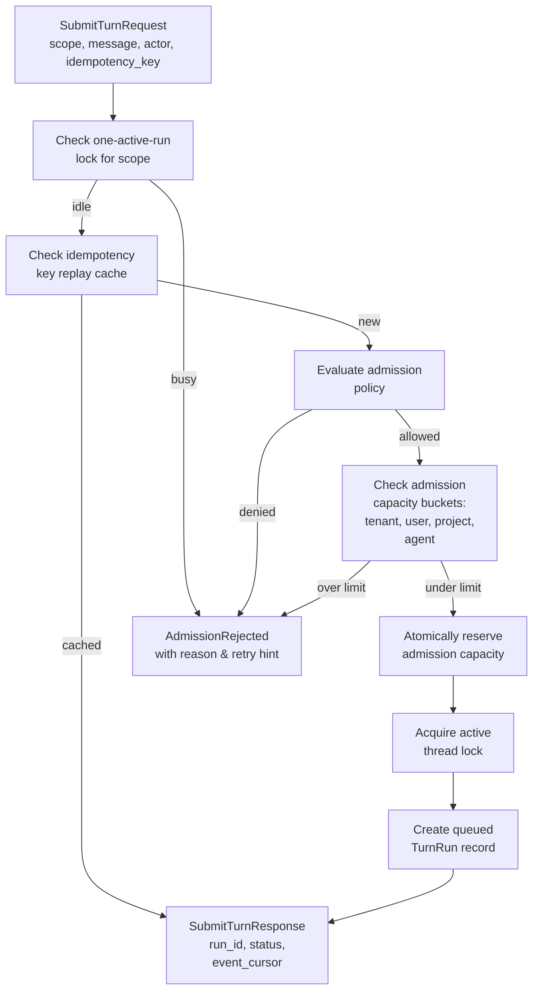
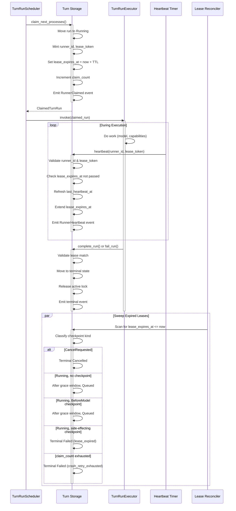
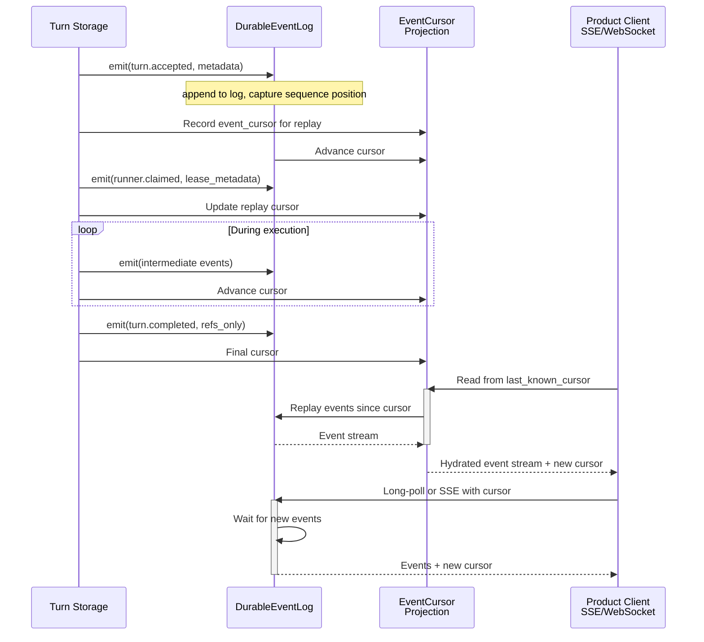

# Turn & Execution Data Flow

This page traces how a user turn enters the Reborn system, flows through the agent loop, processes side effects through the kernel boundary, and produces durable results. The flow demonstrates the separation between product surfaces, userland loop strategy, kernel-mediated coordination and authorization, and substrate primitives.

## End-to-End Flow

```mermaid
sequenceDiagram
    participant Product as Product<br/>CLI/WebUI
    participant TurnCoord as TurnCoordinator<br/>Turn Admission
    participant Runner as TurnRunner<br/>Lease & Scheduling
    participant Loop as AgentLoop<br/>Strategy
    participant CapHost as CapabilityHost<br/>Authorization
    participant Kernel as Kernel<br/>Policy Gates
    participant Substrate as Substrate<br/>Resources

    Product->>TurnCoord: submit_turn(scope, message, idempotency_key)
    activate TurnCoord
    TurnCoord->>TurnCoord: Check one-active-run lock
    TurnCoord->>TurnCoord: Validate admission capacity/policy
    TurnCoord->>Substrate: Create queued TurnRun record
    TurnCoord->>Substrate: Emit turn.accepted event
    deactivate TurnCoord
    TurnCoord-->>Product: SubmitTurnResponse(run_id, status)

    Runner->>TurnCoord: claim_next_processes()
    activate TurnCoord
    TurnCoord->>Substrate: Move run to Running, mint lease
    TurnCoord->>Substrate: Emit runner.claimed event
    deactivate TurnCoord
    TurnCoord-->>Runner: ClaimedTurnRun(run_id, lease_token)

    loop Executor Heartbeats
        Runner->>TurnCoord: heartbeat(run_id, lease_token)
        TurnCoord->>Substrate: Extend lease_expires_at
    end

    Runner->>Loop: invoke_driver(claimed_run, host_ports)
    activate Loop
    Loop->>Loop: Consult LoopFamily strategy
    Loop->>Loop: Assemble prompt from authorized memory
    Loop->>Loop: Call model through host port
    Loop->>CapHost: request_capability(tool_id, args)
    deactivate Loop

    CapHost->>Kernel: Evaluate trust ceiling
    CapHost->>Kernel: Evaluate authorization grants/leases
    CapHost->>Kernel: Check obligations (approval/auth gates)
    CapHost->>Kernel: Reserve resources
    alt Authorization Denied
        CapHost-->>Loop: BlockedAuth or Failed
    else Approval Required
        CapHost-->>Loop: BlockedApproval(gate_ref)
        Loop->>Loop: Checkpoint and return
    else Authorized
        CapHost->>Substrate: Dispatch through RuntimeDispatcher
        Substrate-->>CapHost: SafeSummary or ref
        CapHost-->>Loop: CapabilityOutcome
    end

    Loop->>Loop: Interpret results, decide next step
    alt Loop Complete
        Loop-->>Runner: LoopExit::Completed(refs)
    else Loop Blocked
        Loop-->>Runner: LoopExit::Blocked(checkpoint_id)
    else Loop Failed
        Loop-->>Runner: LoopExit::Failed(reason_kind)
    end

    Runner->>Runner: Validate LoopExit evidence
    Runner->>Substrate: Apply terminal transition
    Runner->>Substrate: Emit turn.completed/failed/cancelled event
    Runner-->>Product: Turn state terminal
```

End-to-end message flow showing turn submission through product surface, kernel admission, runner lease and heartbeat mechanics, loop execution with model and capability calls, authorization pipeline, and terminal event emission.

---

## Turn Admission & Lock Management

```mermaid
stateDiagram-v2
    [*] --> Accepted: submit_turn succeeds

    Accepted --> Queued: queued by admission policy

    Queued --> Running: claim_next_processes\n(runner mints lease)

    Running --> Running: heartbeat renews\nlease_expires_at

    Running --> BlockedApproval: capability blocks on\napproval gate

    Running --> BlockedAuth: capability blocks on\nauth gate

    Running --> BlockedResource: capability blocks on\nresource gate

    Running --> BlockedAwaitDependentRun: parent awaits\nchild completion

    BlockedApproval --> Running: resume_turn\n(gate resolved)

    BlockedAuth --> Running: auth_resume_json\n(auth gate resolved)

    BlockedResource --> Running: resume_turn\n(resource available)

    BlockedAwaitDependentRun --> Running: resume_turn\n(child completed)

    Running --> Completed: LoopExit::Completed\nwith verified refs

    Running --> Failed: LoopExit::Failed\nor validation error

    Running --> Cancelled: LoopExit::Cancelled\nor CancelRequested

    Running --> RecoveryRequired: expired lease,\nside-effecting checkpoint

    RecoveryRequired --> Cancelled: recovery resolves\nto cancellation

    RecoveryRequired --> Failed: recovery resolves\nto failure

    Completed --> [*]
    Failed --> [*]
    Cancelled --> [*]
```

Turn lifecycle state machine showing transitions from submission through execution, blocking gates, resumption, and terminal states. One active run per `(tenant, agent, project, thread)` scope is enforced from Queued through terminal release.

---

## Run Admission & Capacity



Turn admission flow showing the sequence of checks: one-active-run exclusivity, idempotency replay, policy evaluation, and capacity reservation. Admission rejections are deterministic and replayable on idempotent retry.

---

## Runner Lease & Heartbeat Mechanics



Runner lease lifecycle showing claim with lease token minting, continuous heartbeat renewal during execution, terminal transition with lease validation, and background expired-lease reconciliation with safe recovery state transitions.

---

## Loop Execution Pipeline

<!-- openwiki: mermaid parse failed and this diagram was converted to a text fence so it does not break rendering. Fix the diagram source and restore the mermaid fence. Parser error: Heuristic: an unescaped angle bracket inside a label breaks rendering; rephrase the label. -->
```text
flowchart TD
    Start["LoopFamily strategy consulted<br/>by CanonicalAgentLoopExecutor"]

    Input["Input Stage<br/>Drain queued user input,<br/>validate scope & access"]
    
    Prompt["Prompt Assembly Stage<br/>Read authorized memory,<br/>assemble context,<br/>inject safe prompt files"]
    
    Model["Model Call Stage<br/>Call provider through<br/>ModelGateway,<br/>track usage"]
    
    Capability["Capability Request Stage<br/>Interpret model output,<br/>batch tool calls,<br/>request through CapabilityHost"]
    
    Gate["Gate Resolution Stage<br/>Check for approval/auth/resource<br/>gates, checkpoint if needed"]
    
    Reply["Reply Admission Stage<br/>Finalize user-visible reply,<br/>validate output contract,<br/>write reply refs"]
    
    Checkpoint["Checkpoint Stage<br/>Persist resumable executor state"]
    
    Exit["Loop Exit Decision<br/>Return LoopExit::Completed/Blocked/Failed<br/>with durable refs only"]

    Start --> Input
    Input --> Prompt
    Prompt --> Model
    Model --> Capability
    Capability --> Gate
    Gate -->|gate raised| Gate
    Gate -->|gate resolved| Reply
    Reply --> Checkpoint
    Checkpoint --> Exit

    Exit -->|Completed| ExitComplete["LoopExit::Completed<br/>reply_message_refs or result_refs,<br/>final_checkpoint_id"]
    Exit -->|Blocked| ExitBlocked["LoopExit::Blocked<br/>gate_ref, checkpoint_id,<br/>blocked_kind"]
    Exit -->|Failed| ExitFailed["LoopExit::Failed<br/>reason_kind, safe_summary,<br/>checkpoint_id if retryable"]
    Exit -->|Cancelled| ExitCancelled["LoopExit::Cancelled<br/>optional checkpoint_id"]

    ExitComplete --> [*]
    ExitBlocked --> [*]
    ExitFailed --> [*]
    ExitCancelled --> [*]
```

Canonical agent-loop executor pipeline showing ordered stages from input drain through prompt assembly, model invocation, capability dispatch batching, gate resolution, reply finalization, and checkpointing before exit claim.

---

## HostPort Request & Authorization Pipeline

```mermaid
sequenceDiagram
    participant Loop as AgentLoop<br/>Driver
    participant Host as AgentLoopDriverHost<br/>Port Adapter
    participant CapHost as CapabilityHost<br/>Authorization
    participant Trust as TrustAware<br/>Authorization
    participant Approval as Approval<br/>Service
    participant Resource as Resource<br/>Service
    participant Dispatch as RuntimeDispatcher<br/>Execution

    Loop->>Host: request_capability(capability_id, args)
    Host->>Host: Scoped ExecutionContext from run
    Host->>CapHost: invoke_json(context, descriptor, args)

    activate CapHost
    CapHost->>Trust: Evaluate trust ceiling for caller
    alt Trust ceiling denied
        Trust-->>CapHost: Deny(TrustCeiling)
        CapHost-->>Host: Failed
    end

    CapHost->>CapHost: Evaluate authorization grants/leases
    alt No matching grant
        CapHost-->>Host: Failed(MissingGrant)
    else Grant exists but incomplete
        CapHost-->>Host: Failed(PolicyDenied)
    end

    alt Approval gate required
        CapHost->>Approval: Check for active approval lease
        alt Fingerprinted lease found
            CapHost->>CapHost: Claim lease, proceed to dispatch
        else No lease
            CapHost-->>Host: BlockedApproval(gate_ref)
            CapHost->>CapHost: Persist gate record
        end
    end

    alt Auth gate required
        CapHost->>CapHost: Check for auth gate
        CapHost-->>Host: BlockedAuth(gate_ref)
        CapHost->>CapHost: Persist auth gate record
    end

    CapHost->>Resource: Check resource availability
    alt Resource unavailable
        CapHost-->>Host: BlockedResource(gate_ref)
        CapHost->>CapHost: Persist resource gate record
    end

    CapHost->>CapHost: Evaluate obligations
    alt Prepare obligations
        CapHost->>CapHost: Handler::prepare()
    end

    alt Obligation failed
        CapHost-->>Host: Failed(ObligationFailed)
    end

    CapHost->>Dispatch: dispatch_json(Authorized witness, args)
    activate Dispatch
    Dispatch->>Dispatch: Route to bound lane
    Dispatch->>Dispatch: Execute capability
    Dispatch-->>CapHost: SafeSummary or result_ref
    deactivate Dispatch

    CapHost->>CapHost: Handler::complete_dispatch()
    CapHost-->>Host: CapabilityOutcome
    deactivate CapHost

    Host-->>Loop: Interpreted result for model
```

HostPort request flow through authorization pipeline showing trust ceiling evaluation, grant/lease checking, approval/auth/resource gate evaluation, obligation handling, sealed witness minting for dispatch, and result return.

---

## Effect Authorization & Approval Gates

<!-- openwiki: mermaid parse failed and this diagram was converted to a text fence so it does not break rendering. Fix the diagram source and restore the mermaid fence. Parser error: Heuristic: an unescaped angle bracket inside a label breaks rendering; rephrase the label. -->
```text
flowchart TD
    Request["CapabilityHost::invoke_json<br/>or spawn_json"]
    
    TrustEval["Trust Ceiling Gate<br/>Evaluate caller's trust class,<br/>compare to capability trust policy"]
    
    GrantCheck["Grant Check<br/>Match ExecutionContext grants<br/>against capability descriptor"]
    
    LeaseCheck["Lease Check<br/>Load active non-fingerprinted leases<br/>from CapabilityLeaseStore"]
    
    ApprovalGate["Approval Gate?<br/>Does authorization require<br/>fingerprinted lease?"]
    
    AuthGate["Auth Gate?<br/>Does capability require<br/>authentication?"]
    
    ResourceGate["Resource Gate?<br/>Are resources available<br/>to dispatch/spawn?"]
    
    ObligationCheck["Obligation Check<br/>Are all required obligations<br/>satisfiable by handler?"]
    
    Reserve["Reserve Resources<br/>Claim resource budget,<br/>notify resource governor"]
    
    MintWitness["Mint Authorization Witness<br/>Seal Authorized<br/>with descriptor & reservation"]
    
    Dispatch["RuntimeDispatcher::dispatch<br/>Consume witness,<br/>route to bound lane"]
    
    ReplayStore["Replay Payload Store<br/>Persist raw input for<br/>resume after gate"]

    Request --> TrustEval
    TrustEval -->|denied| Deny1["Deny<br/>TrustCeiling"]
    TrustEval -->|allowed| GrantCheck
    
    GrantCheck -->|no match| Deny2["Deny<br/>MissingGrant"]
    GrantCheck -->|match| LeaseCheck
    
    LeaseCheck --> ApprovalGate
    ApprovalGate -->|required| Approve["Require Approval<br/>Return BlockedApproval<br/>Write gate record"]
    ApprovalGate -->|not required| AuthGate
    
    AuthGate -->|required| AuthBlock["Require Auth<br/>Return BlockedAuth<br/>Write gate record"]
    AuthGate -->|not required| ResourceGate
    
    ResourceGate -->|unavailable| ResourceBlock["Require Resource<br/>Return BlockedResource<br/>Write gate record"]
    ResourceGate -->|available| ObligationCheck
    
    Approve --> [*]
    AuthBlock --> [*]
    ResourceBlock --> [*]
    
    ObligationCheck -->|unsupported| ObligFail["Deny<br/>UnsupportedObligations"]
    ObligationCheck -->|prepare failed| ObligFail
    ObligationCheck -->|supported| Reserve
    
    Reserve --> MintWitness
    MintWitness --> ReplayStore
    ReplayStore --> Dispatch
    Dispatch --> [*]
    ObligFail --> [*]
    Deny1 --> [*]
    Deny2 --> [*]
```

Effect authorization flow showing the sequential gates: trust ceiling, grant matching, lease verification, approval requirement, auth gate, resource availability, and obligation handling. Gates raise BlockedApproval/BlockedAuth/BlockedResource; failures deny immediately fail-closed.

---

## Loop Exit Validation & Application

<!-- openwiki: mermaid parse failed and this diagram was converted to a text fence so it does not break rendering. Fix the diagram source and restore the mermaid fence. Parser error: Heuristic: an unescaped angle bracket inside a label breaks rendering; rephrase the label. -->
```text
flowchart TD
    Exit["Driver returns<br/>LoopExit claim<br/>(not trusted)"]
    
    Variant{"Which variant?"}
    
    Completed["LoopExit::Completed<br/>completion_kind,<br/>reply_message_refs,<br/>result_refs"]
    
    Blocked["LoopExit::Blocked<br/>gate_ref,<br/>checkpoint_id,<br/>blocked_kind"]
    
    Failed["LoopExit::Failed<br/>reason_kind,<br/>safe_summary,<br/>explanation_refs,<br/>checkpoint_id"]
    
    Cancelled["LoopExit::Cancelled<br/>optional checkpoint_id"]
    
    ValidateComplete["Verify completion refs<br/>in transcript/result store"]
    
    ValidateBlocked["Verify gate & checkpoint\nrecords in durable storage"]
    
    ValidateFailed["Verify failure safety:\ncheck checkpoint kind,\nverify explanation refs"]
    
    ValidateCancelled["Verify cancellation\nwas observed by host"]
    
    Invalid["Invalid:<br/>refs not found,\nmissing refs,\nunsupported gate kind"]
    
    Mapping["Map to TurnRunnerOutcome<br/>with verified refs/refs only"]
    
    Apply["Apply transition<br/>through ProcessTransitionPort<br/>with durable refs"]
    
    Terminal["Run is now terminal"]
    
    Exit --> Variant
    Variant -->|Completed| ValidateComplete
    Variant -->|Blocked| ValidateBlocked
    Variant -->|Failed| ValidateFailed
    Variant -->|Cancelled| ValidateCancelled
    
    ValidateComplete -->|refs verified| Mapping
    ValidateComplete -->|refs missing/invalid| Invalid
    
    ValidateBlocked -->|gate & checkpoint verified| Mapping
    ValidateBlocked -->|verification failed| Invalid
    
    ValidateFailed -->|safe to terminalize| Mapping
    ValidateFailed -->|side effect uncertain| Invalid
    
    ValidateCancelled -->|cancellation observed| Mapping
    ValidateCancelled -->|no evidence| Invalid
    
    Invalid --> FailTerminal["Map to Failed<br/>with driver_protocol_violation"]
    
    Mapping --> Apply
    FailTerminal --> Apply
    Apply --> Terminal
```

Loop exit validation and application showing how driver claims are validated against durable host-minted evidence before being mapped to trusted runner outcomes and applied through the process transition port.

---

## Event Sourcing & Lifecycle Emission



Event sourcing flow showing turn progression emitting durable lifecycle events to an append-only log. Clients resume from an event cursor for replay and forward-progress subscription.

---

## State Lifecycle: Claimed → Executed → Terminal

### Claimed Run State

When `TurnRunner` claims a queued run:

- **Transition:** Queued → Running
- **Lease minting:** runner_id, lease_token, lease_expires_at (current + TTL)
- **Durable record updates:** run status, lease metadata, claim_count increment
- **Event emission:** RunnerClaimed lifecycle event
- **Lock held:** Active thread lock remains held; no concurrent claim can proceed

### Execution State (Running)

During loop execution:

- **Heartbeats:** Executor sends periodic `heartbeat(runner_id, lease_token)` calls
  - Must match the claimed lease to succeed
  - Refresh `last_heartbeat_at`, extend `lease_expires_at`
  - Once cancellation is requested, heartbeats no longer extend the lease
- **Checkpointing:** Loop driver may request suspension to a checkpoint
  - Transition: Running → Blocked (approval/auth/resource)
  - Checkpoint persisted to durable store with scope isolation
  - Lease cleared; active lock retained
- **Cancellation:** Host may request run cancellation
  - Transition: Running → CancelRequested
  - Blocks further heartbeat lease extension
  - Cancellation propagated to active capabilities

### Terminal States

Terminal transitions release the active thread lock exactly once:

- **Completed:** LoopExit::Completed with durable reply/result refs → run state Completed, lock released
- **Failed:** LoopExit::Failed with validated evidence → run state Failed, lock released
- **Cancelled:** LoopExit::Cancelled or CancelRequested with evidence → run state Cancelled, lock released
- **Recovery:** Expired lease at side-effecting checkpoint (after grace window) → run state Failed (lease_expired), lock released

Once terminal, the run cannot be requeued (except through explicit retry with new run ID).

---

## Turnrunner Lease Expiration Recovery

When lease `lease_expires_at <= now`:

```text
Running, no checkpoint
  → After grace window: Queued (safe, no work to replay)
  → claim_count < max → resumable
  → claim_count >= max → Failed (crash_retry_exhausted)

Running, BeforeModel checkpoint
  → After grace window: Queued (no side effects before model)
  → claim_count < max → resumable
  → claim_count >= max → Failed (crash_retry_exhausted)

Running, BeforeSideEffect checkpoint
  → Terminal Failed (lease_expired)
  → Side-effecting work is never auto-retried

CancelRequested (any checkpoint)
  → Terminal Cancelled (immediately, no grace window)
```

The grace window (one full lease TTL past expiry) ensures an expired-lease scan cannot race a live heartbeat-starved worker. Within the window, a truly live worker renews its lease; outside, the work is unambiguously abandoned.

---

## Turn Idempotency & Replay

**Idempotency key:** Scoped to `(tenant, agent, project, thread)` and unique per adapter caller.

**Idempotency outcomes:**

| Scenario | Response | Durable Effect |
| --- | --- | --- |
| First submit with key K | SubmitTurnResponse (new run created) | turn + run record, admission reserved |
| Duplicate submit with key K | SubmitTurnResponse (same run ID as first) | No new run; replay prior response |
| Same-thread busy (active run) | SubmitThreadBusy transient (not cached) | No turn/run/admission created; not idempotent |
| Admission rejected (policy) | AdmissionRejected (cached replay) | No turn/run; durable rejection recorded |

**Resume idempotency:**

| Scenario | Response | Durable Effect |
| --- | --- | --- |
| First resume with gate resolution R | ResumeTurnResponse | Run resumed from checkpoint |
| Duplicate resume with same R | ResumeTurnResponse (idempotent) | No duplicate resume |
| Resume with wrong gate kind | Precondition mismatch error | Run unchanged |

---

## One-Active-Run Enforcement

The active-thread lock enforces one exclusive executable run per scoped thread:

- **Lock key:** `(tenant_id, agent_id, project_id, thread_id)`
- **Acquired:** When admitting a turn (Queued → Running or on first claim)
- **Held:** While run is Queued, Running, or Blocked
- **Released:** When run reaches terminal state (Completed, Failed, Cancelled)
- **Conflict:** Concurrent submit to same scope is rejected with SubmitThreadBusy (transient, not cached as idempotency outcome)

This ensures model/tool side effects never race. Blocked (approval/auth/resource/dependent-run) states hold the lock; resume returns control to the same run's executor.

---

## Product to Loop to Kernel Flow

### 1. Product Submission (TurnCoordinator)

```
submit_turn(scope, actor, message_ref, idempotency_key)
  → Check one-active-run lock
  → Check idempotency replay cache
  → Evaluate admission policy
  → Reserve admission capacity (tenant/user/project/agent buckets)
  → Create queued TurnRun record in process journal
  → Acquire active thread lock
  → Emit turn.accepted event
  → Return SubmitTurnResponse with run_id + event_cursor
```

**Responsibilities:**
- `ironclaw_turns::TurnCoordinator`: Single turn admission entry point
- `ironclaw_turns::AgentTurnProcessRuntime`: Projection over `ironclaw_processes` journal
- Admits one active run per thread; rejects concurrent submissions

### 2. Scheduler Claim & Lease (TurnRunScheduler)

```
claim_next_processes(runner_id)
  → Query queued runs matching selector
  → Atomically move to Running, mint lease_token, lease_expires_at
  → Increment claim_count
  → Update active-lock version
  → Emit runner.claimed event
  → Return ClaimedTurnRun with lease metadata
```

**Responsibilities:**
- `ironclaw_turn_runner::TurnRunScheduler`: Claim projection over process supervisor
- `ironclaw_processes::ProcessJournalStore`: Durable lease metadata
- Heartbeats must match runner_id + lease_token

### 3. Loop Execution (CanonicalAgentLoopExecutor)

```
execute_family(claimed_run, host_ports)
  → For each stage in DefaultExecutorPipeline:
    - Input: Drain queued messages
    - Prompt: Assemble context from authorized memory
    - Model: Call LLM through ModelGateway
    - Capability: Interpret output, request through CapabilityHost
    - Gate: Check for approval/auth/resource gates
    - Reply: Finalize user-visible reply
    - Checkpoint: Persist resumable state
  → Return LoopExit claim
```

**Responsibilities:**
- `ironclaw_agent_loop::CanonicalAgentLoopExecutor`: Ordered pipeline execution
- `ironclaw_loop_host::AgentLoopDriverHost`: Adapts host-port contracts to kernel services
- Loop family strategy is consulted; sealed strategy composition prevents external access

### 4. Effect Authorization (CapabilityHost)

```
invoke_json(context, descriptor, args)
  → Trust::evaluate_ceiling(caller)
  → Authorization::evaluate_grants(context, descriptor)
  → Approval::check_for_gate_requirement()
  → Auth::evaluate_requirement()
  → Resource::reserve(estimate)
  → Obligation::prepare(obligations)
  → Mint Authorized witness
  → RuntimeDispatcher::dispatch(witness, args)
  → Return SafeSummary or result_ref
```

**Responsibilities:**
- `ironclaw_capabilities::CapabilityHost`: Single authorization entry point
- Five sequential gates before dispatch; each gate can raise BlockedApproval/BlockedAuth/BlockedResource or deny fail-closed
- Only `CapabilityHost` mints the sealed `Authorized` witness

### 5. Loop Exit Validation (LoopExitApplier)

```
apply(claimed, loop_exit, model_usage)
  → Derive validation policy from host-minted durable evidence
  → Validate exit variant:
    - Completed: verify reply/result refs in transcript/result store
    - Blocked: verify gate/checkpoint records exist
    - Failed: verify failure is safe to terminalize
    - Cancelled: verify host cancellation was observed
  → Map to TurnRunnerOutcome
  → Apply transition through ProcessTransitionPort
  → Emit terminal lifecycle event
  → Return updated TurnRunState
```

**Responsibilities:**
- `ironclaw_turns::LoopExitApplier`: Validates driver claims against host evidence
- `ironclaw_turns::LoopExitEvidencePort`: Read-only durable evidence lookups
- Invalid exits always map to Failed with sanitized failure kind

### 6. Terminal Event Emission

```
For terminal run:
  → Emit turn.completed/failed/cancelled lifecycle event
  → Include sanitized reason, retryable checkpoint info
  → Write to DurableEventLog
  → Advance EventCursor projection
  → Release active thread lock
  → Emit admission capacity release event

For blocked run:
  → Emit turn.blocked_approval/blocked_auth/blocked_resource event
  → Include gate_ref, activity metadata
  → Keep active thread lock, keep admission reservation
  → Awaiting resume_turn
```

**Responsibilities:**
- `ironclaw_turns::TurnLifecycleEvent`: Durable event projection
- `ironclaw_event_log::DurableEventLog`: Append-only log of all lifecycle events
- Product clients subscribe from EventCursor for replay and forward-progress

---

## Checkpoint & Resumption

### Checkpoint Creation

During execution, a loop driver may request to pause:

```
LoopExit::Blocked(gate_ref, checkpoint_id, ...)
  → Runner calls block_run(run_id, lease_token, checkpoint_id)
  → Checkpoint record persisted to scoped store
  → Run transitioned to BlockedApproval/BlockedAuth/BlockedResource/BlockedAwaitDependentRun
  → Lease cleared; active lock retained
  → turn.blocked_* lifecycle event emitted
```

### Checkpoint Resumption

When gate is resolved (approval granted, auth completed, resource available, child completed):

```
resume_turn(run_id, gate_resolution_ref, precondition)
  → Verify run is in required blocked state
  → Load checkpoint record
  → Deserialize resumable loop state
  → Invoke driver with ResumeRequest
  → Driver continues from checkpoint
  → Next LoopExit (or recursive block) returned
  → Same active lock remains held
```

### Bounded Checkpoint Payload

- Payload bytes bounded to prevent unbounded state explosion
- Debug-redacted: no raw prompts, tool input, secrets, host paths
- Checkpoints persisted in process journal, keyed by scope + run
- Foreign scope/run reads return empty, preserving tenant/thread isolation

---

## Related Pages

- [/openwiki/architecture/overview.md](/openwiki/architecture/overview.md) — High-level mental model and layers
- [/openwiki/architecture/crates.md](/openwiki/architecture/crates.md) — Detailed crate inventory and responsibilities
- [/openwiki/architecture/kernel.md](/openwiki/architecture/kernel.md) — Kernel boundary services and authority model
