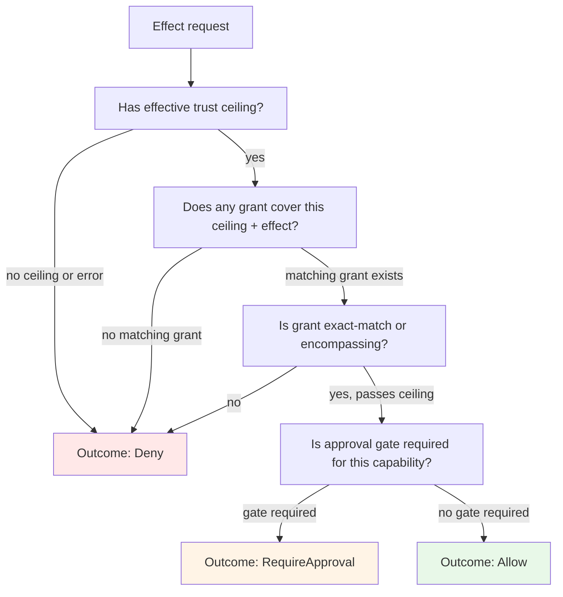

## Overview

The kernel is Reborn's **security perimeter**, not a single crate but a family of nine crates, each owning exactly one stage of a pipeline that every privileged effect must pass through. The perimeter exists to enforce:

- **Scope and ownership**: tenant/agent/project/thread isolation and active-thread locks
- **Trust and authority**: trust-ceiling policy evaluation and grant-based authorization
- **Approval and consent**: require-approval verdicts resolved to fingerprinted leases
- **Resource governance**: cost/quota/capacity reserved before work and reconciled after
- **Durable coordination**: lifecycle authority, process journals, and recovery semantics
- **Policy enforcement**: deployment mode, runtime profiles, and scoped mount/network/secret policy
- **Redacted evidence**: secure side effects under obligation completion and output sanitization

No operation capable of affecting authority, isolation, durable control-plane state, or sensitive data bypasses this boundary. A loop, extension, product surface, or first-party shipped code may request effects only through kernel-mediated ports. Trust class is a *ceiling*, never a *bypass*: even `FirstParty` and `System` trust levels require explicit grants, scoped mounts, leases, resource budget, and obligation handling through the same pipeline every other caller uses.

## Nine-Stage Pipeline and Crate Ownership

The pipeline is **deliberately nine stages**, because each stage is an independently consumed contract with its own fail-closed rule. Merging them would trade compiler-proven stage separation (private mutators invisible outside their crate) for module discipline.

| Stage | Owning crate | Charter |
|---|---|---|
| **Admission** | `ironclaw_turns` | A request becomes durable admitted work — one active run per thread, idempotent submission |
| **Claimed execution** | `ironclaw_processes` | Admitted work is claimed, leased, heartbeat-tracked to a terminal state |
| **Trust ceiling** | `ironclaw_trust` | Requested trust resolves to a host-validated effective ceiling |
| **Authorization** | `ironclaw_authorization` | Ceiling + grants resolve to allow / deny / require-approval |
| **Approval** | `ironclaw_approvals` | Require-approval resolves to a scoped, fingerprinted lease or durable denial |
| **Reservation** | `ironclaw_resources` | Cost/capacity reserved before work, reconciled after |
| **Policy planning** | `ironclaw_runtime_policy` | Deployment/org policy select the lane and enforcement posture |
| **Membrane** | `ironclaw_capabilities` | All prior stages fold into one sealed decision (the `Authorized` witness) |
| **Mediated execution** | `ironclaw_host_runtime` | The witness authorizes exactly one lane call — restricted mounts, staged secrets, scoped egress, redacted evidence |

### Effect Pipeline Flow


Effect pipeline: every privileged operation passes through nine ordered stages in a single fold. Admission and claimed execution bracket the pipeline as durability/lifecycle authorities; the next five stages compose the authorization membrane; the final stage mediates execution.

**No stage skipping**: First-party is a ceiling, not a bypass. Higher trust ceilings still require explicit grants, scoped mounts, leases, budget, and obligation handling through the same pipeline every other caller uses. Nothing shipped by the project and nothing running at elevated trust may reach a privileged effect by any other path.

## Sealed Artifacts and Minting

Four artifacts prove that a stage ran. Each has exactly one sanctioned mint; nothing above the perimeter can fabricate one.

### Authorized Witness

The sealed `Authorized` witness (`ironclaw_host_api::authorized`) proves the entire pipeline executed correctly.

- **Minted only by:** `ironclaw_capabilities::CapabilityHost` — the sole `CapabilityAuthorizer` impl (`src/host/mod.rs:107`)
- **Sealed how:** The `CapabilityAuthorizer` grant trait is implemented only by the kernel, verified by `reborn_authorized_seal_ratchet.rs::capability_authorizer_is_implemented_only_by_the_kernel`
- **Type signature:** `pub struct Authorized<T>` wraps a zero-sized `AuthorizationGrant(())` sealed by the grant-gating machinery in `ironclaw_host_api::authorized`
- **Consumed by:** Only `ironclaw_host_runtime::RuntimeDispatcher` holds the witness and routes it to a bound lane; no witness is created twice

### Effective Trust Ceiling

The sealed `EffectiveTrustClass` proves trust evaluation succeeded.

- **Minted only by:** `ironclaw_trust::TrustPolicy::evaluate` — privileged ceiling variants have no public constructor and no `Deserialize`
- **Sealed how:** Crate-scoped visibility enforces private constructors and per-source mutators; `ironclaw_host_api` wraps it with `#[serde(skip_deserializing)]`
- **Variants:** `Sandbox` (public constructor), `UserTrusted` (public constructor), `FirstParty` (private), `System` (private)
- **Property:** A ceiling grants nothing by itself; authorization must consume both an `EffectiveTrustClass` *and* an explicit grant

### Fingerprinted Approval Lease

The approval lease proves a pending approval was resolved to a decision.

- **Minted by:** `ironclaw_approvals::ApprovalResolver` issues into `ironclaw_authorization`'s lease store
- **Sealed how:** The **decision is persisted before the lease** (`src/lib.rs:240`); minting is public but charter + `BoundaryRule` enforcement keeps the issuing port honest
- **Properties:** Carries `invocation_fingerprint: Option<InvocationFingerprint>` for resume-only authority; leases are single-winner claim-then-consume; an approved request never becomes an ambient grant
- **Durability:** Denial is durable and issues no lease; a caller raises a new request rather than retrying a denied one

### Verified-Inbound Evidence

Verified-inbound evidence proves ingress was validated before kernel consumption.

- **Minted by:** The ingress verifier colocated in `ironclaw_extension_host` (outside `kernel/` but inside the conceptual perimeter)
- **Sealed how:** `reborn_sealed_evidence_mint_ratchet.rs` + `ironclaw_extension_contracts::verified_inbound_seal` via sole-implementor census
- **Consumed by:** The kernel consumes verified evidence as sealed input; extension callers cannot fabricate or bypass verification

## Request Flow: LoopRequest to CapabilityOutcome

A loop requests a capability through a host port. The request enters the membrane, passes through the nine-stage pipeline, and emerges as a sealed `Authorized` witness that only the executor may use.

```mermaid
sequenceDiagram
    participant Loop as AgentLoopDriver
    participant Host as AgentLoopDriverHost
    participant HostPort as Loop capability port
    participant CapHost as CapabilityHost
    participant Trust as Trust policy
    participant Auth as Authorization
    participant Approval as Approvals
    participant Resources as Resources
    participant Policy as Policy planning
    participant Exec as Dispatcher + Lane

    Loop->>Host: invoke_capability(request)
    Host->>HostPort: call loop port
    HostPort->>CapHost: CapabilityHost::invoke(...)
    CapHost->>Trust: evaluate(package_identity, requested_trust)
    Trust-->>CapHost: EffectiveTrustClass
    CapHost->>Auth: decide(ceiling, grants, effect)
    alt authorization allows
        Auth-->>CapHost: Allow or RequireApproval
    else authorization denies
        Auth-->>CapHost: Deny
        CapHost-->>HostPort: AuthError
        HostPort-->>Host: error ref
    end
    alt decision is RequireApproval
        CapHost->>Approval: resolve(pending_approval)
        alt approval resolved
            Approval-->>CapHost: LeaseApproval(lease)
        else approval denied
            Approval-->>CapHost: DenyApproval
            CapHost-->>HostPort: ApprovalDenied
        end
    end
    CapHost->>Resources: reserve(budget_estimate)
    alt reservation succeeds
        Resources-->>CapHost: Reservation
    else reservation fails
        Resources-->>CapHost: ReservationError
        CapHost-->>HostPort: ResourceError
    end
    CapHost->>Policy: plan_capability(resolved_policy)
    Policy-->>CapHost: ExecutionPlan(lane_binding)
    CapHost->>CapHost: mint Authorized witness
    CapHost-->>Exec: Authorized(witness)
    Exec->>Exec: route through RuntimeDispatcher to bound lane
    Exec->>Exec: invoke lane atomically
    Exec-->>CapHost: raw lane output
    CapHost->>CapHost: sanitize output + redact secrets/paths
    CapHost-->>HostPort: CapabilityOutcome(refs, safe_summaries)
    HostPort-->>Host: outcome ref
    Host-->>Loop: outcome ref
```

CapabilityHost orchestrates the pipeline: trust → authorization → approval → reservation → policy planning → sealed witness minting → mediated execution → sanitization.

## Authorization Decision Tree

When authorization evaluates a request, it applies the decision logic shown below.



Authorization decision tree: trust ceiling is required, grants are required, and gate requirements are applied to determine Allow/Deny/RequireApproval.

## Sealed Artifact Minting Ceremony

The minting process is the most security-critical ritual in the kernel.

<!-- openwiki: mermaid parse failed and this diagram was converted to a text fence so it does not break rendering. Fix the diagram source and restore the mermaid fence. Parser error: Heuristic: an unescaped angle bracket inside a label breaks rendering; rephrase the label. -->
```text
flowchart TD
    Request["CapabilityHost::invoke"]
    EvalTrust["TrustPolicy::evaluate<br/>→ EffectiveTrustClass"]
    AuthDecide["Authorization::decide<br/>ceiling + grants<br/>→ Allow/Deny/RequireApproval"]
    CheckApproval["Approval::resolve<br/>pending approval<br/>→ LeaseApproval or DenyApproval"]
    Reserve["Resources::reserve<br/>budget dimension<br/>→ Reservation or error"]
    PlanPolicy["Policy::plan_capability<br/>deployment profile<br/>→ ExecutionPlan"]
    Fold["Fold all decisions"]
    MintWitness["CapabilityHost mints<br/>Authorized witness"]
    Dispatch["RuntimeDispatcher routes<br/>sealed witness → lane<br/>one invocation only"]
    Result["Lane output sanitized<br/>CapabilityOutcome emitted"]

    Request --> EvalTrust
    EvalTrust --> AuthDecide
    AuthDecide -->|Allow or RequireApproval| CheckApproval
    AuthDecide -->|Deny| Fold
    CheckApproval --> Reserve
    Reserve --> PlanPolicy
    PlanPolicy --> Fold
    Fold -->|all decisions in scope| MintWitness
    Fold -->|denial or failure| Result
    MintWitness --> Dispatch
    Dispatch --> Result

    style EvalTrust fill:#fff4e6
    style AuthDecide fill:#fff4e6
    style CheckApproval fill:#fff4e6
    style Reserve fill:#f0e6ff
    style PlanPolicy fill:#f0e6ff
    style MintWitness fill:#ffe6e6
    style Dispatch fill:#ffe6e6
```

Sealed artifact minting ceremony: each stage produces its decision, all fold together, and only then does CapabilityHost mint the witness. Authorization failure or obligation failure stops the entire pipeline before minting.

## Fail-Closed Rules: Default-Deny at Every Stage

Each stage enforces a specific fail-closed rule. A missing prerequisite hides or refuses the capability, never downgrades it.

| Stage | Fail-closed rule | Evidence |
|---|---|---|
| **Admission** | Second submit on an active thread → busy/idempotent replay, never a second run; a `LoopExit` is a claim, validated against host-minted evidence before any durable transition | `ironclaw_turns/src/coordinator.rs`, `loop_exit.rs`; integration tests in `tests/integration/` |
| **Lifecycle** | Terminal status written once — late completions cannot overwrite; result stored before terminal status | `ironclaw_processes/src/journal_store/state.rs:603-661` terminal guards; journal contract suite |
| **Trust** | Privileged ceiling unobtainable outside `TrustPolicy::evaluate`; downgrade publishes synchronously before the lower decision returns; mutation only via `mutate_with` | Compiler visibility + crate tests; `InvalidationBus` synchronous guarantee |
| **Authorization** | No matching grant ⇒ deny; fingerprinted leases are single-winner claim-then-consume, never become ambient grants | `ironclaw_authorization/src/lib.rs:268-291` single-winner claim; crate tests |
| **Approval** | Decision durably persisted **before** lease issuance; denial is durable and issues no lease | `ironclaw_approvals/src/lib.rs:240`; `reborn_origin_gate_matrix_ratchet.rs` freezes which capabilities may skip this stage |
| **Reservation** | Reservation failure — including storage failure — is a denial, never proceed-and-true-up | `ironclaw_resources/tests/resource_governor_contract.rs`; resource tests for failure scenarios |
| **Policy planning** | Invalid `(deployment, profile)` → error, not a silent downgrade; `*Yolo*` profiles require explicit disclosure ack; process effects against `ProcessBackendKind::None` → error | `ironclaw_runtime_policy/src/resolver.rs:129`; planner contract tests |
| **Membrane** | Authorization denial or an unsupported/failed obligation fails **before** dispatch, process start, or lease claim; the witness is minted only by the fold and consumed once | `reborn_authorized_seal_ratchet.rs`; capability tests |
| **Mediated execution** | Unconfigured lane fails closed; credentials attach only over HTTPS or **literal** loopback host; staged secrets are one-shot; no verified tenant sandbox ⇒ process/shell capability hidden and refused, never silently downgraded to host shell | `ironclaw_host_runtime/src/services/tests.rs:511,:611` egress credential tests; `.claude/rules/safety-and-sandbox.md` |

## HostPort Request Patterns and Capability Flows

Loops request effects through scoped host ports. Each host port is a contract that the kernel mediates.

### LoopCapabilityPort: Invoking, Resuming, Spawning

A loop requests a capability invocation, resume after auth/approval, or spawn of a child process. The request passes through `CapabilityHost`, which orchestrates the full pipeline.

**Six workflows** all use the same authorization fold:

- `invoke(request)` — new invocation request
- `resume_after_auth(approval_identity)` — resume a blocked gate with auth decision
- `resume_after_approval(approval_identity)` — resume a blocked gate with user approval
- `spawn_resume(spawn_request)` — start a child process
- `spawn(request)` — spawn a new subagent
- `resume(run_id)` — resume a paused invocation

Each workflow calls `authorize()`, the sole fold that evaluates the full pipeline and mints the witness only if all stages succeed.

### Trust Evaluation Inputs

Trust evaluation takes:
- `PackageIdentity` (bundle/manifest/signer/version)
- `RequestedTrustClass` (what the package declares)
- `HostTrustAssignment` (what host policy allows)

Output: `EffectiveTrustClass` (the validated ceiling that authorization uses).

### Authorization Matching Logic

Authorization matches a request against grants using:
- `EffectiveTrustClass` ceiling (from trust evaluation)
- Explicit grants registered by host policy or admin config
- `CapabilityRequest` specifying the exact effect and scope
- Lease state (if the request is a resume of a previously-approved call)

Match is **exact** or **encompassing**: a grant that covers `pod.exec(image=*)` may authorize `pod.exec(image=specific)`, but not vice versa. Fingerprinted leases are **resume-only**: a lease issued for one exact input can never become a standing permission.

### Approval Gate Logic

Capabilities declare an `origin_gate_matrix` in their manifest, which specifies which are gated by default. Gated capabilities with `Deny` or `RequireApproval` verdicts enter the approval flow.

- `RequireApproval` resolution either:
  - Issues a fingerprinted lease (approved by human or policy)
  - Persists a denial (permanent for that request)
- Gate records are model-visible and durable; models may request re-approval for a changed invocation

### Resource Reservation Lifecycle

Every gated or quota-tracked work reserves capacity before execution:

1. **Reserve**: Estimate cost and acquire reservation; failure aborts the request
2. **Execute**: Perform the work under the reservation
3. **Reconcile**: Update tally with actual cost; release unused budget

Dimensions include: USD cost, input/output tokens, wall-clock time, output bytes, network egress bytes, process count, concurrency slots.

### Secret and Network Policy Staging

Network policies and secrets are staged in a **one-shot, encrypted lease**:

- Host evaluates network policy for the request
- Host stages runtime secrets into a transient secured lease
- Lease is valid only for one invocation
- Lane receives the lease handle and injects values only at their approved destinations
- After invocation, the lease is consumed and destroyed

Secrets never flow through model or user-visible layers.

### Process Execution Authority

The `ProcessHost` is the single lifecycle authority for every piece of host-tracked work:

- Agent turns, capability invocations, and background work all submit as `SubmitProcessRequest`
- Processes are claimed by workers, leased during execution, and heartbeat-tracked
- Terminal status (Completed, Failed, Cancelled) is written once, never overwritten
- Result storage is decoupled from lifecycle state, ensuring observability of completion before terminal transition

Process dependency relationships are tracked in the journal, allowing parent-child recovery semantics.

## Security Gates and Architectural Enforcement

The kernel is held together by gates that are checked at compile-time and at runtime.

### Compile-Time Gates

**Dependency Boundaries** (`reborn_dependency_boundaries.rs`)

- Seven-layer matrix: `contracts < substrates < runtimes < kernel < loops < products < app`
- Zero exceptions (`LAYER_MATRIX_EXCEPTIONS = &[]`)
- Per-crate `BoundaryRule` entries pin the stage order (e.g., `authorization` may not name `approvals`)
- `ironclaw_trust` is a leaf over `ironclaw_host_api` only; no kernel siblings

**Same-Layer Edge Inventory** (`reborn_same_layer_edge_inventory.rs`)

- All 21 kernel→kernel edges are inventoried by name with owner and workstream
- New edges require explicit PR alignment; removed edges must be recorded in the same PR

**Witness Seal Ratchet** (`reborn_authorized_seal_ratchet.rs`)

- `CapabilityAuthorizer` is implemented only by `ironclaw_capabilities`, workspace-wide
- Self-tests ensure the scan cannot silently degrade

**Evidence Mint Ratchet** (`reborn_sealed_evidence_mint_ratchet.rs`)

- Sole-implementor census for mint grant traits
- Retired `host-auth-mint` feature pinned absent across manifests and workflows
- Re-derive test count verified via grep

**Approval Gate Matrix** (`reborn_origin_gate_matrix_ratchet.rs`)

- Freezes which capabilities may skip the approval stage
- Requires well-formed `origin_gate_matrix` on every declared capability

### Runtime Gates

**One-Active-Run-Per-Thread**

Enforced by `TurnCoordinator` via scoped thread lock `(tenant_id, agent_id, project_id?, thread_id)`. Blocks concurrent work before any model/tool side effects.

**Idempotent Submission**

Resubmission of the same turn with the same idempotency key replays the existing run, never spawns a duplicate.

**Lease Claim Protocol**

Fingerprinted leases use atomic compare-and-swap (CAS) with version retry. A lease can be claimed and consumed exactly once.

**Exit Validation**

A `LoopExit` is a claim, not trusted truth. `LoopExitApplier` verifies all referenced evidence (reply refs, checkpoint refs, gate refs) is present and matches host-minted facts before applying the exit.

**Egress Credential Chokepoint**

Credentials attach only over HTTPS **or a literal loopback host** — no DNS resolution. Both the request-side filter (`ironclaw_host_runtime::egress`) and the ingress-side validators (`ironclaw_trace_commons`) share the same predicate, verified by test pairs:
- `host_http_egress_refuses_to_attach_a_credential_over_plaintext_http`
- `host_http_egress_attaches_a_credential_over_literal_loopback_http`

**Staged Secret One-Shot Guarantee**

A staged secret lease is valid for exactly one invocation. After the invocation completes, the lease is consumed and destroyed. The sandbox lane validates each placement target and consumes all handles atomically.

**No Host Shell Without Verified Sandbox**

If the deployment does not include a verified tenant sandbox, the `process/shell` capability is:
- Hidden from the capability surface filter (`surface.rs`)
- Rejected by the policy planner with `ProcessBackendKind::None` → error
- Never silently downgraded to a host process

## Crate Relationships and Dependencies

The kernel family is physically nine crates but logically a perimeter. Every caller (loop, extension, product) reaches privileged effects only through the membrane (`ironclaw_capabilities`), which calls the rest.

<!-- openwiki: mermaid parse failed and this diagram was converted to a text fence so it does not break rendering. Fix the diagram source and restore the mermaid fence. Parser error: Heuristic: an unescaped angle bracket inside a label breaks rendering; rephrase the label. -->
```text
flowchart TD
    Caller["Loop / Extension / Product"]
    Membrane["ironclaw_capabilities<br/>CapabilityHost"]
    Trust["ironclaw_trust"]
    Auth["ironclaw_authorization"]
    Approvals["ironclaw_approvals"]
    Resources["ironclaw_resources"]
    Policy["ironclaw_runtime_policy"]
    Turns["ironclaw_turns"]
    Processes["ironclaw_processes"]
    Runtime["ironclaw_host_runtime"]
    Substrates["ironclaw_filesystem<br/>ironclaw_secrets<br/>ironclaw_network<br/>ironclaw_event_log"]

    Caller -->|only door| Membrane
    Membrane --> Trust
    Membrane --> Auth
    Membrane --> Approvals
    Membrane --> Resources
    Membrane --> Policy
    Membrane --> Processes
    Membrane --> Turns
    Runtime --> Membrane
    Auth --> Trust
    Approvals --> Auth
    Approvals --> Trust
    Processes --> Resources
    Processes --> Substrates
    Runtime --> Substrates
    Runtime --> Processes
    Runtime --> Approvals
    Runtime --> Resources
    Runtime --> Policy

    style Membrane fill:#ffe6e6
    style Caller fill:#e8f4f8
```

Kernel crate relationships: Callers reach the membrane only; the membrane orchestrates the pipeline stages; runtime mediates execution.

### Per-Crate Dependencies

- **`ironclaw_trust`**: leaf crate, depends on `ironclaw_host_api` only
- **`ironclaw_authorization`**: depends on `ironclaw_trust`, `ironclaw_host_api`, `ironclaw_filesystem`
- **`ironclaw_approvals`**: depends on `ironclaw_authorization`, `ironclaw_trust`, `ironclaw_runtime_policy`, `ironclaw_event_log`, `ironclaw_filesystem`, `ironclaw_host_api`
- **`ironclaw_resources`**: depends on `ironclaw_host_api`, `ironclaw_filesystem`
- **`ironclaw_runtime_policy`**: leaf crate, depends on `ironclaw_host_api` only
- **`ironclaw_capabilities`**: depends on the five stage crates, `ironclaw_processes`, `ironclaw_turns`, plus host_api and contracts
- **`ironclaw_processes`**: depends on `ironclaw_resources`, `ironclaw_event_log`, `ironclaw_filesystem`, `ironclaw_host_api`
- **`ironclaw_turns`**: depends on `ironclaw_processes`, `ironclaw_loop_contracts`, `ironclaw_filesystem`, `ironclaw_host_api`
- **`ironclaw_host_runtime`**: the widest consumer (32 deps), depends on all eight kernel siblings, the substrates it mediates, the lanes it adapts, event stores, and domain/record crates

## What Does Not Belong in the Kernel

Each exclusion names where the concern goes instead.

- **Prompt assembly, model strategy, skill selection, channel presentation** → `crates/loop/`, `crates/product/`, `crates/domains/ironclaw_skills`
- **Loop-family behavior and retry/stop/gate decisions** → `crates/loop/` and loop family crates
- **Vendor-specific behavior** → `crates/extensions/packages/*`, `ironclaw_llm` providers
- **Lane execution mechanics** (container/WASM/MCP) → `crates/lanes/`
- **Storage backend implementations** → `crates/substrates/ironclaw_filesystem` / `ironclaw_libsql_runtime` / `crates/events/`
- **Raw payloads in kernel emissions** — no secrets, host paths, backend errors, or unredacted user content in errors, events, snapshots, or logs

## Testing and Validation

Kernel guarantees are validated through multiple tiers:

- **Unit tests in each crate**: `cargo test -p ironclaw_<crate>` validates local invariants and contracts
- **Architecture tests**: `cargo test -p ironclaw_architecture_tests` validates the full gate set, dependency boundaries, witness seals, and edge inventories
- **Integration tests**: `tests/integration/` exercises end-to-end flows: turn submission, loop exit validation, capability invocation, approval gates, and resource reconciliation
- **Security verification**: `.claude/rules/safety-and-sandbox.md` records defensive rules and specific test pairs that verify critical seams (e.g., the egress credential chokepoint)

Key test files:
- `reborn_dependency_boundaries.rs` — layer matrix and per-crate boundary rules
- `reborn_same_layer_edge_inventory.rs` — 21 kernel→kernel edges by name
- `reborn_authorized_seal_ratchet.rs` — witness seal and sole-implementor verification
- `reborn_sealed_evidence_mint_ratchet.rs` — mint grant trait census
- `reborn_origin_gate_matrix_ratchet.rs` — approval gate matrix validation
- `reborn_process_storage_scan_gate.rs` — process journal storage path invariants
- `reborn_persistence_driver_boundary.rs` — DB driver allowlist per crate
- `ironclaw_host_runtime/src/services/tests.rs:511,:611` — egress credential tests
- `tests/integration/` — end-to-end flows and recovery semantics

## Related Documentation

- **Contracts**: `docs/internal/reborn/contracts/kernel-boundary.md`, `capability-access.md`, `capabilities.md`, `approvals.md`, `resources.md`, `host-runtime.md`
- **PROPOSAL**: §6.5.1–§6.5.10 (per-crate contracts), §7 (trust transitions), §8 (dependency model), §11.2 (mechanical enforcement), §12.13 D-R (loopback carve-out) and D-S (lifecycle-authority re-verification)
- **Family spec**: `docs/internal/reborn/target-architecture/families/kernel.md`
- **Security audit**: `docs/internal/reborn/target-architecture/ws12-security-audit.md` (2026-08-05 adversarial re-verification)
- **Safety frame**: `.claude/rules/safety-and-sandbox.md`
- **AGENTS guidance**: `/crates/kernel/AGENTS.md` (stage boundaries, charter, guardrails per crate)
- **Architecture**: `/crates/Architecture.md` (high-level separation, mental model, component map)
- **Related wiki pages**: `/openwiki/architecture/crates.md`, `/openwiki/architecture/data-flow.md`, `/openwiki/architecture/overview.md`
