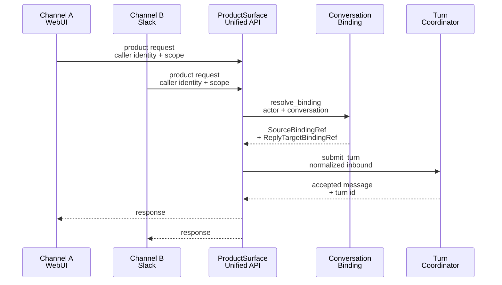

# Channel Adapters & User Interfaces

Channel adapters translate between external messaging platforms (Slack, Telegram, WebUI, CLI) and IronClaw's canonical turn and conversation model. This page documents the adapter architecture, message flow, reply routing, conversation binding, and how to integrate a new channel.

## Architecture Overview

IronClaw's channel system separates concerns across three ownership boundaries:

<!-- openwiki: mermaid parse failed and this diagram was converted to a text fence so it does not break rendering. Fix the diagram source and restore the mermaid fence. Parser error: Heuristic: an unescaped angle bracket inside a label breaks rendering; rephrase the label. -->
```text
flowchart TD
    subgraph External["External Protocol / Native Session"]
        ExternalMsg["Request/Message<br/>from vendor or UI"]
    end
    
    subgraph HostIngress["Host Ingress (Verification & Admission)"]
        Verify["Verify protocol auth<br/>consume secrets"]
        Config["Resolve manifest config<br/>non-secrets only"]
        Admit["Durable admission<br/>idempotency + binding"]
    end
    
    subgraph ChannelAdapterLayer["Channel Adapter<br/>(Protocol-Specific)"]
        Ingress["ChannelIngress<br/>parse vendor payload"]
        Delivery["ChannelDelivery<br/>render and post"]
        ReplySink["ReplySink<br/>stream replies"]
    end
    
    subgraph ProductFlow["ProductSurface & Agent Loop"]
        Turn["Turn submission<br/>normalized message"]
        Loop["Agent execution<br/>model + tools"]
        Outbound["Outbound resolution<br/>reply target selection"]
    end
    
    ExternalMsg -->|host verification| Verify
    Verify -->|host config lookup| Config
    Config -->|ChannelIngress::receive| Ingress
    Ingress -->|ChannelAdapter returns<br/>NormalizedInboundMessage| Admit
    Admit -->|durable turn| Turn
    Turn -->|execution| Loop
    Loop -->|delivery coordination| Outbound
    Outbound -->|ChannelDelivery::deliver| Delivery
    Delivery -->|host transport| ExternalMsg
    Loop -->|streaming reply| ReplySink
```

**Architecture principle:** The channel adapter is a **stateless protocol translator**. The host owns all durable state (secrets, sessions, bindings, delivery records). The adapter owns only protocol parsing and rendering—never authentication decisions, persistence, or delivery authorization.

## Built-In Adapters

IronClaw ships with four primary channels:

| Channel | Package | Ingress | Delivery | Reply Sink | Auth Model |
|---------|---------|---------|----------|-----------|-----------|
| **WebUI** | `ironclaw_webui` | Authenticated session | WebSocket stream | Stream (native session) | OIDC, signed tokens, CLI token |
| **CLI** | `ironclaw_cli` + WebUI | Authenticated session | stdout/WebSocket | Stream (native session) | CLI token bootstrap |
| **Slack** | `slack` extension | Events API (webhook) | `chat.postMessage` | `message` cadence | OAuth workspace + user scope |
| **Telegram** | `telegram` extension | Bot API (webhook) | Bot API methods | `message` cadence | Bot token + user pairing |

### WebUI (Native HTTP Session)

The WebUI is a native host surface—no external protocol layer:

```
HTTP authenticated request
  -> WebuiAuthenticator (session/OIDC/CLI token)
  -> route handler (derive caller identity)
  -> ProductSurface typed descriptors (read/invoke)
  -> WebSocket stream back to frontend
```

**Why not a ChannelAdapter:** Native sessions use host-owned authentication and session tokens, not external protocol verification. The WebUI route handlers are thin HTTP adapters that extract caller identity and delegate to `ProductSurface`, the unified product API layer.

**Key files:**
- `crates/product/ironclaw_webui/src/webui_v2/` — routes and handlers
- `crates/product/ironclaw_webui/src/auth/` — OAuth providers and session auth
- `crates/product/ironclaw_webui/src/session.rs` — session store and validation

### Slack Extension

Slack integrates as an external extension package implementing the full three-way adapter contract:

**Ingress:** `ChannelIngress::receive` parses Events API webhooks (signature verified by host) into `NormalizedInboundMessage`.

**Delivery:** `ChannelDelivery::deliver` renders messages to mrkdwn, splits oversized text, posts via `chat.postMessage` through restricted egress (bot token injected by host).

**Reply Sink:** Streaming replies materialize on the `message` cadence into the same vendor conversation, threading per-message anchors when declared.

**Key files:**
- `crates/extensions/packages/slack/src/channel.rs` — `ChannelIngress` + `ChannelDelivery` implementation
- `crates/extensions/packages/slack/src/reply_sink/` — `ReplySink` implementation
- `crates/extensions/packages/slack/src/payload.rs` — inbound event normalization
- `crates/extensions/packages/slack/src/mrkdwn.rs` — outbound rendering

### Telegram Extension

Telegram integrates similarly to Slack but with different vendor APIs and delivery characteristics:

**Ingress:** `ChannelIngress::receive` parses Bot API webhook updates (shared-secret header verified by host).

**Delivery:** `ChannelDelivery::deliver` renders to plaintext, posts via Bot API methods (`sendMessage`, `editMessageText`) through restricted egress.

**Reply Sink:** Streaming replies materialize on the `message` cadence, with optional topic/thread anchoring in group chats.

**Key files:**
- `crates/extensions/packages/telegram/src/channel.rs` — `ChannelIngress` + `ChannelDelivery` implementation
- `crates/extensions/packages/telegram/src/reply.rs` — `ReplySink` implementation
- `crates/extensions/packages/telegram/src/payload.rs` — inbound event normalization

## Message Flow: Ingress to Agent Loop

```mermaid
sequenceDiagram
    participant Vendor as Slack/Telegram<br/>Webhook
    participant Host as Host Ingress<br/>Router
    participant Verify as Verification<br/>Recipe
    participant Adapter as Channel<br/>Adapter
    participant Bind as Conversation<br/>Binding
    participant Turn as Turn<br/>Coordinator
    participant Loop as Agent<br/>Loop
    
    Vendor->>Host: POST /webhooks/extensions/{id}/{route}
    Host->>Verify: Resolve candidates, verify signature
    Verify-->>Host: VerifiedInstallation {installation_id}
    Host->>Host: Load non-secret config
    Host->>Adapter: ChannelIngress::receive(VerifiedInbound)
    Adapter-->>Host: InboundOutcome::Messages(vec![...])
    Host->>Host: Validate message bounds
    Host->>Bind: Resolve binding<br/>actor + conversation
    Bind-->>Host: ConversationBindingRef
    Host->>Turn: accept_inbound_message<br/>AcceptedMessageRef
    Turn-->>Host: Durable admission
    Host-->>Vendor: 200 OK
    Host->>Turn: submit_turn(accepted_message)
    Turn->>Loop: Run agent loop
    Loop->>Loop: Plan, select tools, execute
```

**Key points:**

1. **Verification happens first:** Signing secrets are resolved and consumed by the host's generic recipe verifier (§ Verification & Admission).
2. **Adapter never sees secrets:** The `VerifiedInbound` contains only the resolved installation id and non-secret config.
3. **Adapter parses, host validates:** The adapter returns a `NormalizedInboundMessage` with untrusted bounds. The host validates against fixed bounds (attachment count, text length, context size).
4. **Conversation binding is atomic:** The host resolves or creates the canonical conversation binding (tenant + adapter + external actor/conversation → canonical thread) before turn submission.
5. **Durable admission commits before 2xx:** The webhook returns 200 only after the message is durably stored and idempotency is recorded. Duplicate vendor retries hit the existing idempotency ledger.

## Verification & Admission

The host ingress router owns protocol verification before the adapter runs:

### Verification Recipe Execution

`ironclaw_extension_contracts::recipe::IngressVerificationRecipe` defines how a webhook request proves it came from the vendor:

```
Verification kinds:
  - HmacSha256: signature header over request body
  - SharedSecretHeader: exact token match in header
  - None: no cryptographic verification (require installation identity only)
  - AuthenticatedSession: trusted by host transport (WebUI only)
```

**Example: Slack HMAC verification**

Slack sends `X-Slack-Request-Timestamp` and `X-Slack-Signature`. The verifier:

1. Resolves candidate installations (there may be multiple Slack workspaces on one route).
2. Reconstructs the signed string: `v0:{timestamp}:{body}`.
3. Computes HMAC-SHA256 with the stored signing secret.
4. Constant-time compares the computed vs. provided signature.
5. Rejects if the timestamp is older than 5 minutes (replay window).
6. Returns exactly one `VerifiedInstallation` or fails with a typed verification failure.

**Key invariants:**
- The host executes verification before calling `ChannelIngress::receive`.
- At most `MAX_VERIFICATION_CANDIDATES` (8) installations are tried per request.
- Exactly one must verify; zero or more than one fails closed (401).
- Consumed headers (signature, timestamp) are stripped before the adapter runs.

### Durable Admission

After the adapter returns a normalized message, the host runs a durable admission transaction:

```
admission key: (installation_id, external_event_id)

1. Check idempotency ledger — if (key) exists with a known outcome, replay it
2. Resolve or create conversation binding
   - External actor + conversation → canonical ThreadId
   - Pairing-aware (OAuth'd user, or operator identity)
3. Dedupe and validate message bounds
4. Accept message in conversation transcript
5. Submit turn to TurnCoordinator
6. Durably mark admission complete
```

**Idempotency:** If a vendor retransmits the same event (same `installation_id` + `external_event_id`), the host replays the original accepted message and turn without duplicating.

**Conversation binding:** Maps channel-specific actor/conversation IDs to canonical IronClaw ThreadIds, enabling multi-channel conversations and routable replies.

## Conversation Binding: Channel Identity to Canonical Threads

Conversation binding resolves external actor and conversation references (e.g., `slack:workspace-id:channel-id`) into canonical IronClaw conversation and thread records.

```mermaid
erDiagram
    "ExternalActorRef" ||--o{ "ActorPairing" : identifies
    "ExternalConversationRef" ||--o{ "ConversationBinding" : identifies
    "ActorPairing" ||--o{ "UserId" : resolves_to
    "ConversationBinding" ||--o{ "ThreadId" : routes_to
    "ConversationBinding" ||--o{ "SourceBindingRef" : contains
    "SourceBindingRef" ||--o{ "ReplyTargetBindingRef" : derives
    
    "ExternalActorRef" : string adapter_kind
    "ExternalActorRef" : string external_actor_id
    "ExternalActorRef" : optional string display_name
    
    "ExternalConversationRef" : optional string space_id
    "ExternalConversationRef" : string conversation_id
    "ExternalConversationRef" : optional string topic_id
    "ExternalConversationRef" : optional string display_name
    
    "ActorPairing" : (tenant, adapter, installation, actor) key
    "ActorPairing" : UserId canonical_user
    "ActorPairing" : enum RouteKind
    
    "ConversationBinding" : (tenant, adapter, installation, space, conversation) key
    "ConversationBinding" : ThreadId canonical_thread
    "ConversationBinding" : enum RouteKind
    
    "SourceBindingRef" : (tenant, thread) identity
    "SourceBindingRef" : ExternalActorRef actor
    "SourceBindingRef" : ExternalConversationRef conversation
    
    "ReplyTargetBindingRef" : SourceBindingRef + thread_anchor
    "ReplyTargetBindingRef" : optional string vendor_message_ref
```

**Route kinds:**

- **Direct:** One-to-one conversation with a single user. Creates one persistent canonical thread per (tenant, actor, adapter) pair.
- **Shared:** Shared conversation (Slack channel, Telegram group chat). Creates one conversation-keyed binding for routing and idempotency, but fresh ephemeral threads per inbound event (keyed by `external_event_id`).

**Key invariants:**

1. **Pairing is scoped:** `(tenant_id, adapter_kind, adapter_installation_id, external_actor_ref)`. A user's pairing on one Slack workspace does not authorize access on another.
2. **No cross-installation merging:** Two users on different Slack workspaces never route to the same thread, even if they are the same underlying user (e.g., same email).
3. **Admission is fail-closed:** Unpaired actors receive a `BindingRequired` error; no message is accepted until pairing is established.
4. **Shared conversation admission:** Messages from shared conversations (channels, group chats) are admitted only if verified-ingress membership is proven (presence-based, not a participant allowlist).

**Life cycle:**

1. **First contact (inbound):** External actor with no stored pairing → resolver checks OAuth (e.g., Slack user lookup) or waits for operator configuration (e.g., Telegram pairing).
2. **Pairing established:** Actor resolves to canonical `UserId`; conversation binding is created and routed to the canonical thread.
3. **Lookup (routable reply):** System retrieves binding and validates the target conversation still exists in the vendor (shared-conversation admission check).
4. **Reset (explicit command):** Conversation atomically rotates to a fresh thread, preserving the old one and revoking the old binding's reply targets.

## Reply Routing and Outbound Delivery

After the agent loop completes, reply messages must route back through the same channel that brought the inbound message in. The outbound system selects, validates, and delivers the reply.

```mermaid
sequenceDiagram
    participant Loop as Agent Loop
    participant Outbound as Outbound<br/>Resolution
    participant Delivery as Channel<br/>Delivery
    participant Vendor as Slack/Telegram<br/>API
    
    Loop->>Loop: Generate reply/progress/approval
    Loop->>Outbound: CommunicationDeliveryResolutionRequest<br/>scope + actor + intent + modality
    Outbound->>Outbound: Resolve target<br/>LiveSourceRoute vs RunScopedTarget
    Outbound-->>Delivery: OutboundEnvelope<br/>target + parts + visibility
    Delivery->>Delivery: Render to protocol<br/>text -> mrkdwn, auth prompt, reactions
    Delivery->>Vendor: API call<br/>chat.postMessage, sendMessage, etc.
    Vendor-->>Delivery: vendor response<br/>message id or error
    Delivery-->>Outbound: DeliveryReport<br/>per-part outcomes
```

**Resolution intent** drives the reply routing decision:

- **LiveSourceRoute:** The run originated from a live inbound message. Use the message's reply target (the conversation + thread anchor that brought it in).
- **RunScopedTarget:** Background run or explicit model delivery. Use a caller-provided target (from notification channels, command catalog, etc.).
- **SystemEvent:** No external delivery needed (metadata only).

**Target validation** happens before rendering:

1. **Ownership:** Target must belong to the current tenant.
2. **Capability:** Target must support the requested modality (text, attachments, reactions, etc.).
3. **Authorization:** Actor must have access (for approval prompts and auth prompts, exact-actor validation).
4. **Channel readiness:** External conversation must still be accessible (shared-conversation admission).

**Delivery outcomes** are recorded separately from reply stream state:

- **Sent:** Part delivered; vendor returned a message id.
- **Retryable:** Transient error (5xx, rate limit); coordinator may retry.
- **Ambiguous:** Request crossed to transport but outcome unknown; coordinator records attempt and never retries blindly.
- **Permanent:** Deterministic failure; no retry.
- **Unauthorized:** Auth token revoked or insufficient scope; coordinator triggers re-auth.

## ChannelAdapter Trait Contract

The `ChannelAdapter` contract is split into three optional halves, allowing adapters to implement only what the manifest declares:

```rust
pub struct ChannelSurfaces {
    pub ingress: Option<Arc<dyn ChannelIngress>>,
    pub reply: Option<Arc<dyn ReplySink>>,
    pub delivery: Option<Arc<dyn ChannelDelivery>>,
}
```

### ChannelIngress

```rust
pub trait ChannelIngress: Send + Sync {
    async fn receive(
        &self,
        request: VerifiedInbound<'_>,
        egress: &dyn RestrictedEgress,
    ) -> Result<InboundOutcome, ChannelError>;
}
```

**Responsibilities:**
- Parse vendor-format inbound messages (event payload, headers).
- Resolve any vendor-side metadata needed (user profile, conversation history) through restricted egress.
- Return normalized `NormalizedInboundMessage` or batch fragments.
- Never interpret the payload beyond parsing; never perform authorization or persistence.

**Receives:**
- `VerifiedInbound::extension_id` — the extension package id.
- `VerifiedInbound::installation_id` — the verified installation (e.g., workspace id or bot instance id).
- `VerifiedInbound::config` — manifest-declared non-secret configuration.
- `VerifiedInbound::body` — request body bytes (bounded by ingress body limit).
- `VerifiedInbound::headers` — forwarded request headers (verification headers already consumed).
- `VerifiedInbound::can_reply_in_threads` — whether the channel supports threaded replies.
- `RestrictedEgress` — host-mediated network access (secrets injected, endpoints validated against manifest).

**Returns:**
- `InboundOutcome::Messages(vec![...])` — one or more normalized messages ready for admission.
- `InboundOutcome::BatchFragment(...)` — partial message pending settlement of a provider batch.
- `InboundOutcome::Respond(ImmediateResponse)` — bounded immediate response (e.g., URL verification challenge).
- `InboundOutcome::Ignore` — authenticated no-op (event type not forwarded).
- `ChannelError` — typed failures (parse, configuration, attachment transfer, etc.).

### ChannelDelivery

```rust
pub trait ChannelDelivery: Send + Sync {
    async fn deliver(
        &self,
        envelope: OutboundEnvelope,
        egress: &dyn RestrictedEgress,
    ) -> Result<DeliveryReport, ChannelError>;
    
    fn supports_private_delivery(&self) -> bool { false }
    
    async fn provision_direct_target(
        &self,
        request: DirectTargetProvisionRequest,
        egress: &dyn RestrictedEgress,
    ) -> Result<Option<ExternalConversationRef>, ChannelError> {
        Err(ChannelError::Unsupported)
    }
}
```

**Responsibilities:**
- Render `OutboundPart`s (text, files, auth prompts, reactions, retractions) to vendor format.
- Split oversized messages according to vendor limits.
- Call vendor APIs through restricted egress (secrets injected, endpoints pre-approved).
- Return per-part delivery outcomes without touching the delivery store.
- Optionally declare private-delivery capability and direct-target provisioning.

**Receives:**
- `OutboundEnvelope::target` — resolved `ExternalConversationRef` (already validated by outbound policy).
- `OutboundEnvelope::parts` — semantic delivery parts (text, attachments, auth prompts, etc.).
- `OutboundEnvelope::visibility` — hint for private delivery (`Public` or `EphemeralTo(actor)`).
- `OutboundEnvelope::registrations` — per-user push subscriptions (for channels with `requires_enrollment`).
- `OutboundEnvelope::reply_context` — opaque context stored at inbound time (for addressing threaded replies).

**Returns:**
- `DeliveryReport::parts` — outcome of each part (sent, retryable, ambiguous, permanent, unauthorized).
- `DeliveryReport::prune_registrations` — registration ids the vendor reported as expired/revoked.

### ReplySink

```rust
pub trait ReplySink: Send + Sync {
    async fn stream(
        &self,
        envelope: OutboundEnvelope,
        egress: &dyn RestrictedEgress,
    ) -> Result<ReplySinkReport, ChannelError>;
    
    async fn message(
        &self,
        envelope: OutboundEnvelope,
        egress: &dyn RestrictedEgress,
    ) -> Result<ReplySinkReport, ChannelError> {
        Err(ChannelError::Unsupported)
    }
}
```

**Responsibilities:**
- Materialize the agent's reply (the terminal response to the triggering message) on the vendor's native reply surface.
- Optionally emit progressive revisions (streaming) or only the final message.
- Return materialization report (vendor reference for threading/editing, outcome).

**Two cadences:**

- **`stream`:** Called multiple times as the reply is refined. Adapter may create a new message on first call and edit it on revisions.
- **`message`:** Called once with the terminal reply. Mandatory; adapters return `Unsupported` only if they do not support terminal replies at all.

## Building a New Channel Integration

### 1. Understand the Adapter Boundary

A channel adapter is a **pure protocol translator**:

```
What the adapter OWNS:
  - Parsing vendor message format
  - Vendor API calls (through restricted egress)
  - Protocol-specific rendering (mrkdwn, plaintext, HTML, etc.)
  - Vendor-specific state (emoji mappings, thread formatting rules)

What the adapter DOES NOT OWN:
  - Authentication (signatures verified by host)
  - Secrets (injected by host at egress time)
  - Durable state (conversations, threads, delivery records)
  - Authorization (who can access what)
  - Approval logic
  - Thread creation (conversation binding creates threads)
  - Pairing (OAuth flow, manual pairing — owned by host)
```

### 2. Use the Existing Implementations as Reference

```bash
# Slack: full three-way adapter (ingress, delivery, reply sink)
crates/extensions/packages/slack/src/channel.rs          # Main adapter
crates/extensions/packages/slack/src/payload.rs          # Inbound parsing
crates/extensions/packages/slack/src/mrkdwn.rs           # Outbound rendering
crates/extensions/packages/slack/src/reply_sink/         # Stream + message

# Telegram: similar shape with different APIs
crates/extensions/packages/telegram/src/channel.rs       # Main adapter
crates/extensions/packages/telegram/src/payload.rs       # Inbound parsing
crates/extensions/packages/telegram/src/render.rs        # Outbound rendering
crates/extensions/packages/telegram/src/reply.rs         # Message-only cadence
```

### 3. Implement ChannelIngress

```rust
pub struct MyChannelAdapter;

#[async_trait]
impl ChannelIngress for MyChannelAdapter {
    async fn receive(
        &self,
        request: VerifiedInbound<'_>,
        egress: &dyn RestrictedEgress,
    ) -> Result<InboundOutcome, ChannelError> {
        // Parse the request body (vendor payload)
        let payload = parse_vendor_payload(request.body)?;
        
        // Optionally fetch vendor state (user profile, history)
        let user_context = fetch_user_context(&payload.user_id, egress).await
            .unwrap_or_default(); // Silent-ok: advisory context
        
        // Return normalized message
        Ok(InboundOutcome::Messages(vec![
            NormalizedInboundMessage {
                actor: ExternalActorRef::new(
                    "my_vendor",
                    payload.user_id,
                    user_context.display_name,
                )?,
                conversation: ExternalConversationRef::new(
                    None,  // space_id (if vendor has spaces/workspaces)
                    payload.conversation_id,
                    None,  // topic_id (if vendor supports topics/threads)
                    None,  // display_name
                )?,
                event_id: ExternalEventId::new(payload.event_id)?,
                text: payload.text,
                trigger: ProductTriggerReason::DirectChat,
                attachments: vec![],  // Fetch and reconcile attachment bytes
                conversation_context: None,
                reply_context: None,  // Optional opaque per-message state
            }
        ]))
    }
}
```

**Checklist:**
- [ ] Parse vendor payload into structured types.
- [ ] Validate actor and conversation refs (non-empty, within bounds).
- [ ] Fetch any required vendor context (user profile, conversation history) through restricted egress.
- [ ] Reconcile attachment metadata with fetched bytes before returning.
- [ ] Classify trigger reason (direct chat, mention, reply to bot, etc.).
- [ ] Return early on parse errors; host drops deterministic failures.

### 4. Implement ChannelDelivery

```rust
#[async_trait]
impl ChannelDelivery for MyChannelAdapter {
    async fn deliver(
        &self,
        envelope: OutboundEnvelope,
        egress: &dyn RestrictedEgress,
    ) -> Result<DeliveryReport, ChannelError> {
        // Render each part to vendor format
        let mut outcomes = Vec::new();
        
        for part in &envelope.parts {
            let outcome = match part {
                OutboundPart::Text(text) => {
                    // Render to vendor format (mrkdwn, markdown, plaintext)
                    let rendered = self.render_text(text);
                    
                    // Call vendor API through restricted egress
                    match egress.post(
                        "https://api.myvendor.com/send",
                        RestrictedEgressRequest {
                            headers: vec![...],
                            body: serde_json::to_vec(&my_request)?,
                            secrets: vec![SecretHandle::new("my_token")?],
                        }
                    ).await {
                        Ok(response) => {
                            if response.status == 200 {
                                let msg_id = extract_message_id(&response.body);
                                PartDeliveryOutcome::Sent { vendor_message_ref: msg_id }
                            } else if response.status >= 500 {
                                PartDeliveryOutcome::Retryable { reason: "server error".into() }
                            } else {
                                PartDeliveryOutcome::Permanent { reason: "client error".into() }
                            }
                        }
                        Err(e) => PartDeliveryOutcome::Retryable { reason: e.to_string() }
                    }
                }
                OutboundPart::File(file) => {
                    // Upload file, return outcome
                    ...
                }
                _ => PartDeliveryOutcome::Unsupported { reason: "not implemented".into() }
            };
            outcomes.push(outcome);
        }
        
        Ok(DeliveryReport::from_parts(outcomes))
    }
}
```

**Checklist:**
- [ ] Render text parts to vendor format (markdown, plaintext, etc.).
- [ ] Handle file uploads through restricted egress.
- [ ] Map semantic auth prompts/reactions to vendor-specific forms.
- [ ] Call vendor APIs with proper error classification (5xx = retryable, 401/403 = unauthorized, others = permanent).
- [ ] Extract vendor message references from responses (for threading/editing).
- [ ] Return per-part outcomes; the host decides retry/failure handling.

### 5. Implement ReplySink (Optional)

```rust
#[async_trait]
impl ReplySink for MyChannelAdapter {
    async fn message(
        &self,
        envelope: OutboundEnvelope,
        egress: &dyn RestrictedEgress,
    ) -> Result<ReplySinkReport, ChannelError> {
        // Render reply to vendor format
        let text = envelope.parts.iter()
            .filter_map(|p| if let OutboundPart::Text(t) = p { Some(t) } else { None })
            .collect::<String>();
        
        // Post through restricted egress
        let response = egress.post(...).await?;
        
        // Return materialization report
        Ok(ReplySinkReport {
            vendor_message_ref: extract_message_id(&response),
            state: ReplySinkState::Materialized,
        })
    }
    
    async fn stream(
        &self,
        envelope: OutboundEnvelope,
        egress: &dyn RestrictedEgress,
    ) -> Result<ReplySinkReport, ChannelError> {
        // Create or edit the message on each call
        Err(ChannelError::Unsupported)  // If streaming not supported
    }
}
```

**Checklist:**
- [ ] Implement `message` (terminal reply) at minimum.
- [ ] Implement `stream` if the channel supports edit/revision.
- [ ] Return opaque vendor reference (message id) for threading/editing.
- [ ] Handle threading anchors (reply in conversation's topic thread if `reply_context` is set).

### 6. Declare the Manifest

Create `manifest.toml` with channel declarations:

```toml
[[channel.ingress]]
name = "my_channel_webhook"
route_suffix = "webhook"
presentation.can_reply_in_threads = true  # or false

[[channel.ingress.verification]]
kind = "hmac_sha256"  # or "shared_secret_header", "none"
header = "X-Signature"
timestamp_header = "X-Timestamp"
timestamp_window_seconds = 300

[[channel.ingress.config]]
name = "my_webhook_url"
secret = false  # Non-secret, stored in config

[[channel.delivery]]
name = "my_channel_delivery"
requires_enrollment = false  # true if using push subscriptions
needs_registration = false   # true if registration recipe required

[[channel.delivery.egress]]
host = "api.myvendor.com"

[[channel.reply]]
name = "my_channel_reply"
transport = "message"  # or "stream"
reconciles_at = "message_materialization"
```

**Checklist:**
- [ ] Declare ingress route and verification recipe.
- [ ] Declare delivery egress hosts (no secrets; they are injected at request time).
- [ ] Declare reply sink and transport cadence.
- [ ] Non-secret configuration is resolved by host and passed to adapter.

### 7. Test the Adapter

```bash
# Unit tests: parsing, rendering, error cases
cargo test -p my_channel_adapter

# Integration tests: full flow with mocked vendor APIs
cargo test -p ironclaw_architecture_tests

# E2E: deploy and test with actual vendor APIs
bash scripts/reborn-e2e-rust.sh
```

**Test checklist:**
- [ ] Malformed inbound payloads are rejected with parse errors.
- [ ] Scope isolation: two installations on the same route never cross over.
- [ ] Duplicate delivery: same `installation_id` + `event_id` replays without duplicating.
- [ ] Denial: unpaired actors receive `BindingRequired`.
- [ ] Retry: transient delivery failures return `Retryable`; vendor should retry.
- [ ] Permanent failure: deterministic failures are classified correctly.

## ProductSurface and Multi-Channel Auth

The `ProductSurface` is the unified product API layer that sits above all channels. It owns conversation binding, turn submission, delivery resolution, and product-visible state.



**Multi-channel auth:** ProductSurface does not distinguish channels; it resolves identity and authorization scopes the same way:

- **Direct routes** (WebUI, CLI, one-to-one Telegram): Actor identity is session + scope. Pairing may involve OAuth (for Telegram) or simple session tokens (for WebUI).
- **Shared routes** (Slack channel, Telegram group): Actor identity is scope + channel membership. Admission checks vendor-provided membership proof.
- **Session tokens:** Temporary bearer tokens that grant access to one user's scope for one session (used by CLI token login).
- **OAuth recipes:** Extension manifests declare OAuth provider and scopes; the host runs the OAuth flow and maps `(tenant, provider, oauth_user_id)` → canonical `UserId`.

## Further Reading

- [`ironclaw_extension_contracts::channel_adapter`](repo://crates/contracts/ironclaw_extension_contracts/src/channel_adapter.rs) — Trait definitions and DTO contracts.
- [`docs/internal/reborn/how-to-port-channel-to-reborn.md`](repo://docs/internal/reborn/how-to-port-channel-to-reborn.md) — Implementation checklist and verification steps.
- [`docs/internal/reborn/contracts/communication-delivery-resolution.md`](repo://docs/internal/reborn/contracts/communication-delivery-resolution.md) — Outbound delivery resolution and reply routing semantics.
- [`docs/internal/reborn/contracts/conversation-binding.md`](repo://docs/internal/reborn/contracts/conversation-binding.md) — Thread creation, actor pairing, and shared-conversation admission.
- [Slack channel implementation](repo://crates/extensions/packages/slack/src/channel.rs) — Reference full-featured adapter.
- [Telegram channel implementation](repo://crates/extensions/packages/telegram/src/channel.rs) — Reference alt-vendor adapter.
