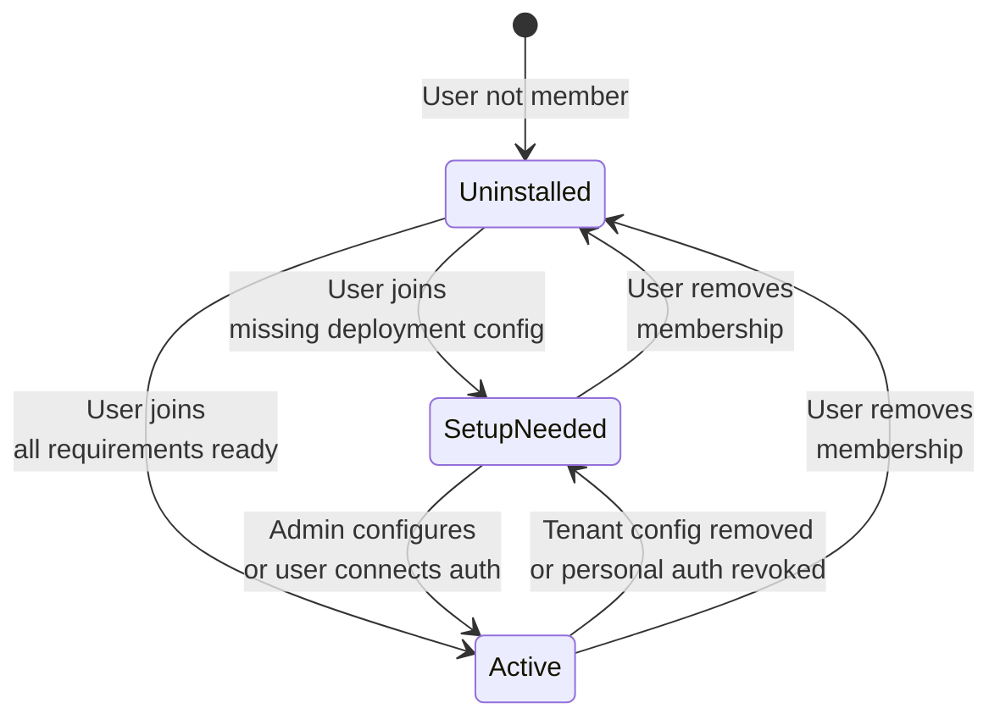
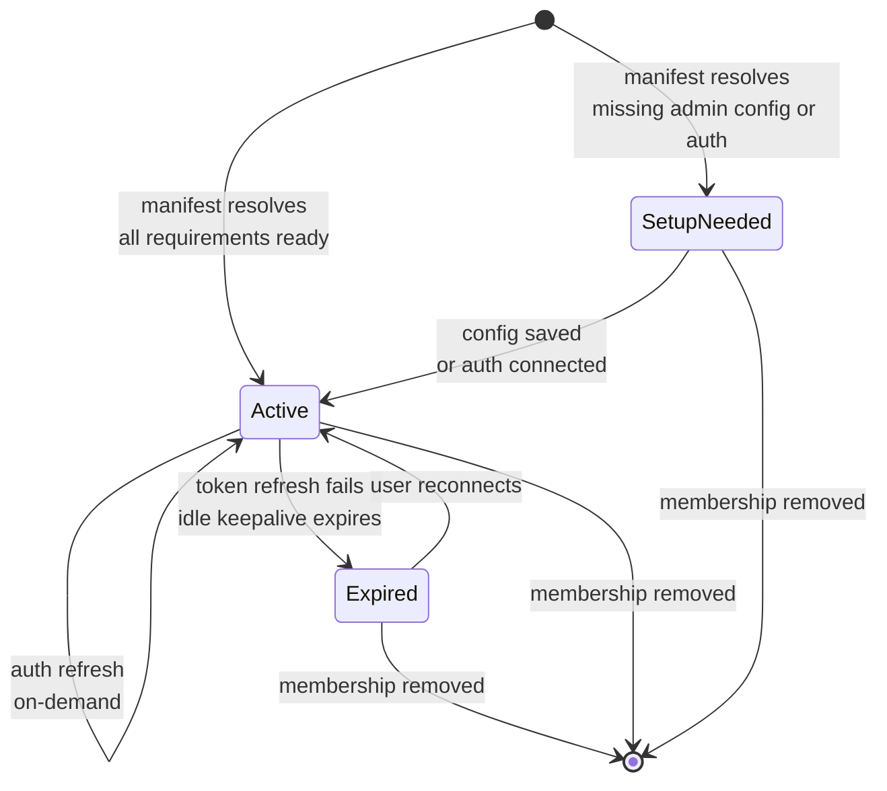
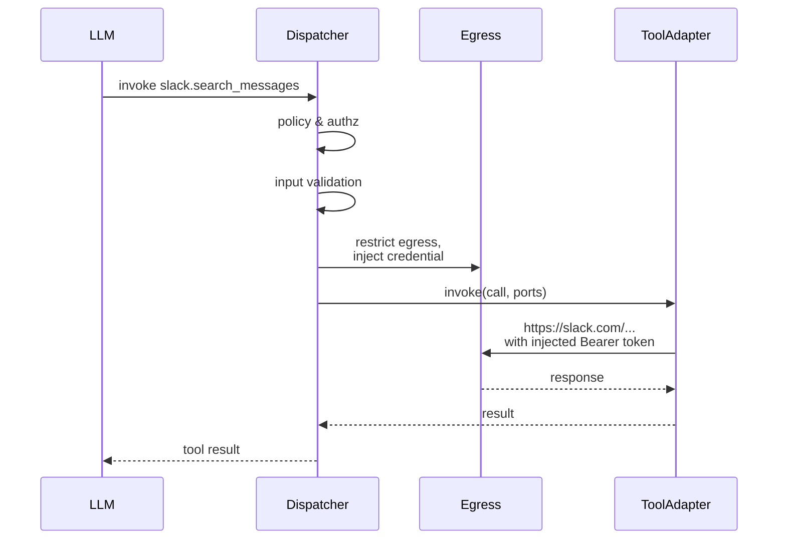
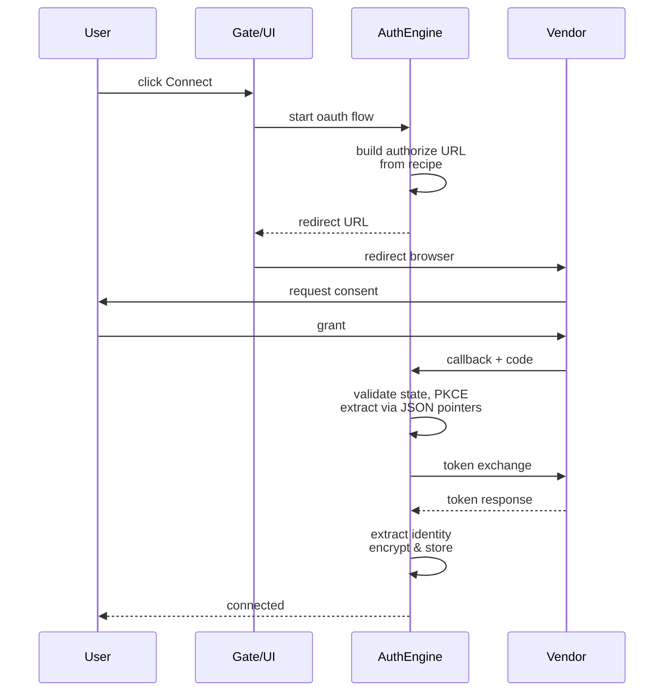

# Extensions & Integrations

The extension system provides a unified, installable interface for external integrations: message channels (Slack, Telegram, web), tool capabilities (GitHub, Gmail, Google services), and memory providers (filesystem-native, mem0). Extensions are the only installable product-facing object; the generic host manages installation, credential binding, deployment setup, and multi-user lifecycle without naming any concrete vendor.

## Quick Start

<!-- openwiki: broken internal link [../architecture/how-to-port-channel.md] file "../architecture/how-to-port-channel.md" does not exist. Fix the href or restore the target, then delete this comment. -->
- **For channel integrations:** see [How to port a channel to Reborn](../architecture/how-to-port-channel.md)
<!-- openwiki: broken internal link [../development/building-a-tool.md] file "../development/building-a-tool.md" does not exist. Fix the href or restore the target, then delete this comment. -->
- **For tool authoring:** see the extension manifest reference and [Building a tool](../development/building-a-tool.md)
- **For understanding the model:** continue to [The unified extension model](#the-unified-extension-model)
- **For package structure:** see [Package organization](#package-organization)

---

## The unified extension model

An **extension** is the sole installable product object. It declares what it offers and what it needs; the generic host handles everything else.

### Core concepts

- **Extension** — top-level installable unit with a stable `ExtensionId` (e.g., `slack`, `github`, `ironclaw.memory`)
- **Capability surfaces** — what an extension exposes. Every surface kind has strict separation:
  - **Tool** — model-callable capability (query or side-effect)
  - **Channel** — message inbound/outbound integration (Slack, Telegram, web)
  - **Auth** — vendor credential acquisition (OAuth2, API key)
  - **Memory provider** — persistent context storage (filesystem, mem0)
- **VendorId** — the external service that issues credentials (e.g., `google`, `slack`, `github`). Different from `ExtensionId`: multiple extensions may share one vendor.
- **Runtime kind** — implementation detail, never taxonomy:
  - `first_party` — native Rust service
  - `wasm` — WebAssembly module
  - `mcp` — hosted Model Context Protocol server

### No vendor names in generic code

No generic crate, function, or module names a concrete vendor. That rule is enforced by architecture gates that run on every commit. "Adding a new integration" means a new package directory and optional extension crate; no generic code changes.

---

## Package organization

Every installable extension is one self-contained directory under `crates/extensions/packages/<id>/`.

### Anatomy

```
packages/<extension_id>/
  manifest.toml              # declarative manifest (required)
  README.md                  # authoring guide
  prompts/                   # model-visible tool documentation
  schemas/                   # input/output JSON schemas for tools
  
  # For native Rust implementations:
  Cargo.toml                 # if this package earns a crate
  src/                       # extension code
  tests/                     # channel conformance + protocol tests
  
  # For WASM implementations:
  wasm/                      # committed compiled WASM modules (built out-of-band)
  wasm-src/                  # guest crate source (builds separately)
  
  # For data-only packages (bundled manifests without code):
  # (no Cargo.toml, src/, or build artifacts)
```

### Rule: Self-containment

A package's manifest, prompts, schemas, code, and any built artifact sources live together in one directory. A package's assets never split across multiple crates or directories. Adding an integration is a new `packages/<id>/` directory plus optional Cargo.toml and crate source.

### Rule: Crates only when needed

A package earns its own crate (linked only by the binary) **if and only if** it:
- implements a channel adapter (Slack, Telegram, web-app)
- implements a memory provider service
- carries a heavy or isolated native dependency (e.g., Telegram's MTProto stack)

Otherwise, it is manifest + assets only; native tool logic lives in the shared `ironclaw_extension_support` crate, registered by the manifest's extension ID.

### Catalog

| Package | Extension ID | Type | Runtime | Code |
|---------|--------------|------|---------|------|
| `slack/` | `slack` | channel + 16 tools | wasm + first_party | crate + wasm |
| `telegram/` | `telegram` | channel + 15 tools | first_party | crate |
| `web-app/` | `web-app` | channel (delivery only) | first_party | crate |
| `github/` | `github` | 49 tools | wasm | data-only |
| `gmail/` | `gmail` | 6 tools | first_party | data-only (executor in `extension_support`) |
| `google-calendar/` | `google-calendar` | 9 tools | first_party | data-only |
| `google-docs/` | `google-docs` | 15 tools | wasm | data-only |
| `google-drive/` | `google-drive` | 12 tools | wasm | data-only |
| `google-sheets/` | `google-sheets` | 11 tools | wasm | data-only |
| `google-slides/` | `google-slides` | 14 tools | wasm | data-only |
| `memory-native/` | `ironclaw.memory` | memory provider | first_party | crate |
| `mem0/` | `mem0.local.memory` | memory provider | first_party | crate |
| `notion-mcp/` | `notion` | tools (hosted MCP) | mcp | data-only |
| `nearai-mcp/` | `nearai` | tools (hosted MCP) | mcp | data-only |
| `web-access/` | `web-access` | 2 tools | first_party | data-only (executor in `extension_support`) |

Data-only packages are embedded into the binary via `include_str!` / `include_bytes!` through the `ironclaw_extension_support` crate's `PACKAGES` inventory.

---

## Manifest schema (v3)

One `manifest.toml` per package, no fragments or imports. The schema version is `reborn.extension_manifest.v3`.

### Basic structure

```toml
schema_version = "reborn.extension_manifest.v3"
id = "slack"                              # stable extension ID
name = "Slack"                            # display name
version = "0.1.0"
description = "..."
trust = "first_party_requested"           # trust profile

[runtime]
kind = "first_party"                      # or "wasm" or "mcp"
service = "slack.extension/v1"            # runtime kind determines format
```

### Extension trust profiles

- `first_party_requested` — IronClaw-maintained integrations; trust is granted
- `third_party` — external integrations; trust is explicitly evaluated

Trust is a manifest **declaration**, not runtime authority. Effective trust comes from composition-owned policy evaluation.

### Deployment configuration

Deployment-owned, tenant-scoped setup independent of user installs:

```toml
[admin_configuration]
group_id = "extension.slack"              # shared by extensions using the same vendor
display_name = "Slack deployment configuration"
description = "..."
fields = [
  { handle = "slack_bot_token", label = "Bot token", secret = true, required = true },
  { handle = "slack_signing_secret", label = "Signing secret", secret = true, required = true },
  # ...
]
```

Admin saving these values does **not** install the extension for anyone. Each user installs independently.

### Tool surfaces

```toml
[[tools]]
id = "slack.search_messages"
description = "Search all Slack messages visible to the connected user."
effects = ["network", "use_secret"]       # permission ceiling
default_permission = "ask"                # model sees this
visibility = "model"                      # or "internal"
input_schema_ref = "schemas/slack/search_messages.input.v1.json"
prompt_doc_ref = "prompts/slack/search_messages.md"

[[tools.credentials]]
handle = "slack_user_token"               # opaque handle; host injects
vendor = "slack"
scopes = ["search:read", "channels:read"]
audience = { scheme = "https", host = "slack.com" }
injection = { type = "header", name = "authorization", prefix = "Bearer " }
```

### Channel surface

At most one per extension:

```toml
[channel]
id = "messages"
display_name = "Slack messages"
conversation_model = "continuous"         # or "isolated"

[channel.ingress]
route_suffix = "events"                   # /webhooks/extensions/slack/events
method = "post"
body_limit_bytes = 1048576

[channel.ingress.verification]
kind = "hmac_sha256"                      # recipe: host verifies
secret_handle = "slack_signing_secret"    # opaque; never reaches adapter
signature_header = "X-Slack-Signature"
signature_prefix = "v0="
signature_encoding = "hex"
timestamp_header = "X-Slack-Request-Timestamp"
max_age_seconds = 300

[[channel.egress]]
scheme = "https"
host = "slack.com"
methods = ["post"]
credential_handle = "slack_bot_token"

[channel.reply]
transport = "message"                     # cadence: host controls reconciliation

[channel.delivery]
transport = "message"

[channel.presentation]
supports_markdown = true
supports_threads = true
can_reply_in_threads = true
```

### Auth surfaces

Recipe data only; the host implements all auth flow:

```toml
[auth.slack]                              # section key = vendor ID
method = "oauth2_code"                    # or "api_key"
display_name = "Slack account"
authorization_endpoint = "https://slack.com/oauth/v2/authorize"
token_endpoint = "https://slack.com/api/oauth.v2.access"
scope_param = "user_scope"                # vendor-specific param name
pkce = "s256"                             # optional PKCE
client_credentials = { 
  client_id_handle = "slack_oauth_client_id",
  client_secret_handle = "slack_oauth_client_secret" 
}

[auth.slack.token_response]
access_token = "/authed_user/access_token"    # RFC 6901 JSON pointer
scope = { path = "/authed_user/scope" }

[auth.slack.identity]
account_id = "/authed_user/id"
team_id = "/team/id"
```

The host's `AuthEngine` implements each auth *method* once. Recipes declare parameters only; flow behavior (state, CSRF, PKCE, token exchange, refresh, revocation) is host-owned and identical for every vendor.

### MCP extensions

Hosted MCP servers declare discovery instead of static tools:

```toml
[mcp]
server = "https://mcp.notion.com/mcp"
namespace = "notion"                      # discovered tools publish as notion.<tool>
max_tools = 256
default_permission = "ask"
effects = ["network", "use_secret"]       # ceiling for discovered tools

[[mcp.credentials]]
handle = "notion_account"
vendor = "notion"
scopes = ["read_content"]
injection = { type = "header", name = "authorization", prefix = "Bearer " }
```

Discovery runs at readiness reconciliation and at explicit refresh. Discovered tools are ordinary tool surfaces thereafter; there is no "MCP" in the dispatch path.

---

## Architecture: How it fits together

<!-- openwiki: mermaid parse failed and this diagram was converted to a text fence so it does not break rendering. Fix the diagram source and restore the mermaid fence. Parser error: Heuristic: an unescaped angle bracket inside a label breaks rendering; rephrase the label. -->
```text
graph TD
    A["Registry & Manifest"] --> B["Extension Host"]
    A --> C["Extension Manager"]
    B --> D["Adapter Loaders"]
    B --> E["Ingress Router"]
    B --> F["Auth Engine"]
    B --> G["Delivery Coordinator"]
    D --> H["ToolAdapter"]
    D --> I["ChannelIngress"]
    D --> J["ReplySink"]
    D --> K["ChannelDelivery"]
    H --> L["First-party / WASM / MCP"]
    C --> M["User-facing lifecycle & catalog"]
    B --> N["Active snapshot<br/>per caller"]
    N --> O["Ready or setup_needed"]
    P["Vendor"] -->|webhook| E
    E -->|verified bounded| I
    I -->|normalized inbound| Q["ProductSurface"]
```

High-level flow: extensions are installed and membership-managed through the registry and manager. The host's generic pipelines own lifecycle, verification, injection, and semantics. Adapters implement only protocol parsing and vendor API calls.

---

## Extension lifecycle



**Install = join membership.** There is no separate Activate action. Membership + tenant configuration + personal auth determine readiness.

### Removal (host-owned)

Removal is a single atomic operation with fixed steps:

1. Remove the caller from membership; reject new work; drain in-flight under bounded deadline
2. Cancel pending auth flows; delete only their grants and accounts (other users unaffected)
3. If members remain, keep shared runtime and vendor wiring
4. Only when last member leaves: unpublish runtime, run idempotent cleanup hooks, drop runtime row
5. Tenant admin configuration persists until explicitly replaced or removed

---

## Adapter contracts

Every extension contributes one narrow call (or none) per pipeline. The host owns semantics, verification, retry, persistence, and crash recovery.

### ToolAdapter

```rust
#[async_trait]
pub trait ToolAdapter: Send + Sync {
    async fn invoke(&self, call: ToolCall, ports: &ToolPorts<'_>) -> Result<ToolResult, ToolError>;
}
```

One method per extension. `ToolCall` carries capability ID, validated input, actor scope, and deadline. `ToolPorts` provides:
- Restricted egress with host-side credential injection
- Scoped key-value state
- Logging

**Discovery is host-owned:** static `[[tools]]` in the manifest or MCP `tools/list` response; the adapter never claims what it can do.

### ChannelIngress

```rust
#[async_trait]
pub trait ChannelIngress: Send + Sync {
    async fn receive(
        &self,
        request: VerifiedInbound<'_>,
        egress: &dyn RestrictedEgress,
    ) -> Result<InboundOutcome, ChannelError>;
}
```

The host verifies the vendor signature (against a manifest recipe), resolves scope, drops verification secrets, then calls `receive` with a bounded, verified payload. The adapter parses and returns a normalized `InboundOutcome`. Vendor handles (Slack file URLs, Telegram file IDs) stay package-internal; the host fetches canonical attachments.

### ReplySink

```rust
#[async_trait]
pub trait ReplySink: Send + Sync {
    async fn reconcile(
        &self,
        request: ReplyReconcileRequest,
        egress: &dyn RestrictedEgress,
    ) -> Result<ReplySinkReport, ChannelError>;
}
```

Converge the channel's presentation of one run's reply document. The host controls reconciliation cadence; the adapter renders and publishes.

### ChannelDelivery

```rust
#[async_trait]
pub trait ChannelDelivery: Send + Sync {
    async fn deliver(
        &self,
        envelope: OutboundEnvelope,
        egress: &dyn RestrictedEgress,
    ) -> Result<DeliveryReport, ChannelError>;
}
```

Render and send via vendor API. Host owns target resolution, attempt persistence, retry, deduplication, and crash recovery. Adapter returns per-part outcomes (sent + vendor ref, retryable, or permanent).

### No auth adapter

Auth has **no** adapter trait. The host implements each auth *method* once (`oauth2_code` with PKCE, `api_key`). Vendors differ in *parameters*, never flow behavior — endpoints, scope names, response fields are recipe data. The `AuthEngine` executes every vendor recipe identically:

- state / CSRF / PKCE / replay / TTL management
- token exchange per recipe
- identity extraction via JSON pointers
- secret encryption and storage
- refresh and revocation
- On-demand injection into restricted egress

No third-party code executes inside an auth flow. Parameter override, state tampering, and token exfiltration vulnerabilities cannot exist.

---

## Registry and installation records

The registry owns:

- **What's installed:** `ExtensionInstallation` records per caller per extension
- **What's available:** `ResolvedExtensionManifest` per installed package
- **Membership:** which callers are members of each extension
- **Credentials:** opaque handles bound to vendors (encrypted, injected at send time, never passed to adapters)
- **Admin configuration:** tenant-scoped deployment setup

### Installation state machine



### Verified-inbound evidence

When the host verifies a vendor signature (webhook, API call), it creates a sealed `VerifiedInbound` that the adapter receives. This is **sealed verified-inbound evidence**: the host owns verification; the adapter cannot forge or bypass it. Adapters receive only bounded, pre-verified payloads.

---

## Core flows

### 1. Tool call

1. **List** — agent loop reads tool surfaces from the active snapshot (manifest data only)
2. **Resolve** — model calls `slack.search_messages`; host looks up the prebound adapter
3. **Policy** — authorization, permission mode, approvals, obligations
4. **Validate** — input checked against manifest schema
5. **Credentials** — host injects grant via restricted egress (adapter never holds bytes)
6. **Invoke** — `adapter.invoke(call, ports)` does the work
7. **Record** — result, events, audit



### 2. Inbound message

1. Vendor posts to `/webhooks/extensions/{ext}/{suffix}`
2. Host matches route, enforces method/body/rate/deadline
3. Host executes verification recipe (HMAC, constant-time, replay window)
4. Host calls `receive(VerifiedInbound, RestrictedEgress)` with bounded payload
5. Adapter parses, fetches context if needed, returns normalized `InboundOutcome`
6. Host validates attachments, sanitizes context, applies policy
7. Host commits durable admission, dedupes, lands attachments
8. Host binds identity and conversation, submits turn to ProductSurface

<!-- openwiki: mermaid parse failed and this diagram was converted to a text fence so it does not break rendering. Fix the diagram source and restore the mermaid fence. Parser error: Heuristic: an unescaped angle bracket inside a label breaks rendering; rephrase the label. -->
```text
sequenceDiagram
    participant V as Vendor
    participant R as Ingress Router
    participant A as ChannelIngress
    participant H as Host
    participant P as ProductSurface
    
    V->>R: POST /webhooks/.../events
    R->>R: match route<br/>enforce limits
    R->>R: execute verification<br/>recipe
    R->>A: receive(verified<br/>bounded, egress)
    A-->>R: normalized Messages
    R->>H: validate, sanitize<br/>attachments
    H->>P: durable admission
    P-->>H: receipt
    H-->>V: 2xx
```

### 3. Outbound delivery

Decouples target resolution and semantics (host) from vendor rendering (adapter):

1. Intent emitted (gate prompt, auth prompt, model invocation, etc.)
2. Host resolves target: reply-context conversation or model-chosen catalog target
3. Host persists attempt (`Prepared` → `Sending`) **before** any network call
4. Host resolves bound adapter from active snapshot
5. `adapter.deliver(envelope, egress)` renders and sends
6. Adapter returns structured per-part report
7. Host records outcome, schedules retries, dedupes

The **sole-writer rule** ensures crash-safety: only the delivery coordinator marks attempts sent or failed. If the process dies after the vendor accepted a message but before the outcome was recorded, the attempt is found in `Sending` state and becomes `Unknown` — never blindly resent.

### 4. Auth flow



For API keys: generic form from recipe fields → optional validation probe → store. Same engine, same encryption.

---

## Crate structure and boundaries

### Family crates

| Crate | Responsibility | Depends on |
|-------|-----------------|-----------|
| `ironclaw_extension_registry` | Manifest schema (v3), durable installation/membership/credential records, resolved-contract digest | contracts + filesystem |
| `ironclaw_extension_host` | Generic lifecycle, loaders, activation, ingress router, auth engine, delivery coordinator, credential injection | contracts + kernel |
| `ironclaw_extension_manager` | Product-facing lifecycle commands, catalog UX, credential views, extension hub | host + registry |
| `ironclaw_extension_support` | Shared native executors for data-only packages (gsuite, web-access, coding, skills), PACKAGES inventory | contracts |
| `packages/{id}` (concrete) | Channel adapters, memory providers | contracts only |

### Forbidden boundaries

- **No vendor names in generic code** (outside `extension_support` module registry and tests)
- **No second dispatcher, ingress router, auth engine, or delivery coordinator**
- **No direct domain-store mutations** around the host's authority operations
- **No package reaching the host directly** (only the binary links concrete packages)
- **The manager calls the host; the host never depends on the manager** (architecture-gated)

---

## How to add an extension

### New tool (data-only WASM)

1. Create `packages/my-tool/`
2. Write `manifest.toml` with `[[tools]]` entries
3. Create `wasm-src/` guest crate (builds out-of-band)
4. Create `schemas/` and `prompts/` directories
5. Commit the compiled WASM artifact to `wasm/`
6. No Rust host code needed; manifest is enough
7. Run `./scripts/build-wasm-extensions.sh --first-party` to build
8. Update `scripts/ci/wasm-src-digests.toml` with the new digest
9. Add module to `ironclaw_extension_support/src/packages/` to embed it

### New tool (first-party native)

1. Create `packages/my-tool/`
2. Write `manifest.toml` with `[[tools]]` entries, `runtime.kind = "first_party"`, `runtime.service = "my_tool.extension/v1"`
3. Create native executor module in `ironclaw_extension_support/src/native_executors/`
4. Register in the factory: `extension_support::native_executors::FACTORY`
5. Create `schemas/` and `prompts/`
6. Add module to `ironclaw_extension_support/src/packages/` to embed manifest and assets

### New channel integration

1. Create `packages/my-channel/` with `Cargo.toml`
2. Write `manifest.toml` with `[channel]`, `[admin_configuration]`, and optional `[auth.*]` recipes
3. Implement `ChannelIngress`, optional `ReplySink`, `ChannelDelivery` in `src/channel.rs`
4. Implement `ToolAdapter` if the channel has associated tools
5. Create conformance tests in `tests/` (reuse `ironclaw_extension_contracts::test_support::conformance`)
6. Link the package crate only in `ironclaw_cli` (via composition)
7. All adapters receive host-injected credentials; never store or inspect secrets

### New memory provider

1. Create `packages/my-memory/` with `Cargo.toml`
2. Implement the `MemoryService` contract from `ironclaw_memory`
3. Write `manifest.toml` declaring the memory provider surface
4. Link the provider crate only in `ironclaw_cli`
5. One memory provider is active per deployment

---

## Key invariants

1. **Surfaces are derived, never stored parallel.** The manifest is the single source of truth; adapters are ephemeral.
2. **No vendor code executes inside auth flows.** Parameters are recipes; the engine is host-owned.
3. **Credentials are opaque handles inside adapters.** Injection happens at egress time; adapters never hold bytes.
4. **Installation authority is membership, not activation toggles.** There is no `activated` or `disabled` state.
5. **Adapters own only their narrow call.** Verification, target resolution, attempt persistence, retry, crash recovery all belong to the host.
6. **One channel per extension.** The wire format allows multiple; today every real extension has at most one.
7. **Data-only packages are self-contained.** Manifest + prompts + schemas + optionally WASM; no split across crates.

---

## Testing

- **Conformance suites:** `ironclaw_extension_contracts` exports reusable test helpers. Every channel package runs them.
- **Auth engine tests:** One suite for state/PKCE/refresh/revoke, table-driven over vendor recipes.
- **Fixture extension:** `acme-messenger` (invented vendor) drives every generic path (admin setup → install → setup_needed → connect → active → inbound → outbound → remove).
- **Architecture gates:** Retired taxonomy, concrete-name scanner, dependency-direction checks, CI build without concrete packages.

Run checks:

```bash
cargo test -p ironclaw_extension_registry      # manifest, registry, records
cargo test -p ironclaw_extension_host          # host lifecycle & pipelines
cargo test -p ironclaw_slack_extension         # conformance + protocol
cargo test -p ironclaw_telegram_extension      # conformance + protocol
cargo test -p ironclaw_architecture_tests      # boundaries & rules
```

---

## See also

<!-- openwiki: broken internal link [./crates.md] file "./crates.md" does not exist. Fix the href or restore the target, then delete this comment. -->
- [Architecture: Crates](./crates.md) — overall crate family structure
<!-- openwiki: broken internal link [./kernel.md] file "./kernel.md" does not exist. Fix the href or restore the target, then delete this comment. -->
- [Architecture: Kernel](./kernel.md) — how the extension host integrates with lanes and events
- `crates/extensions/AGENTS.md` — detailed family working rules
- `docs/internal/reborn/contracts/extensions.md` — registry and manifest contracts
- `docs/internal/reborn/extension-runtime/overview.md` — complete technical design
- `docs/internal/reborn/how-to-port-channel-to-reborn.md` — channel integration guide
- `docs/extensions/building-a-tool.md` — tool authoring guide
