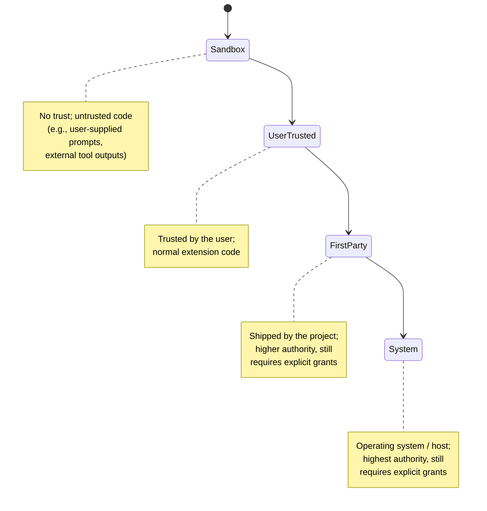
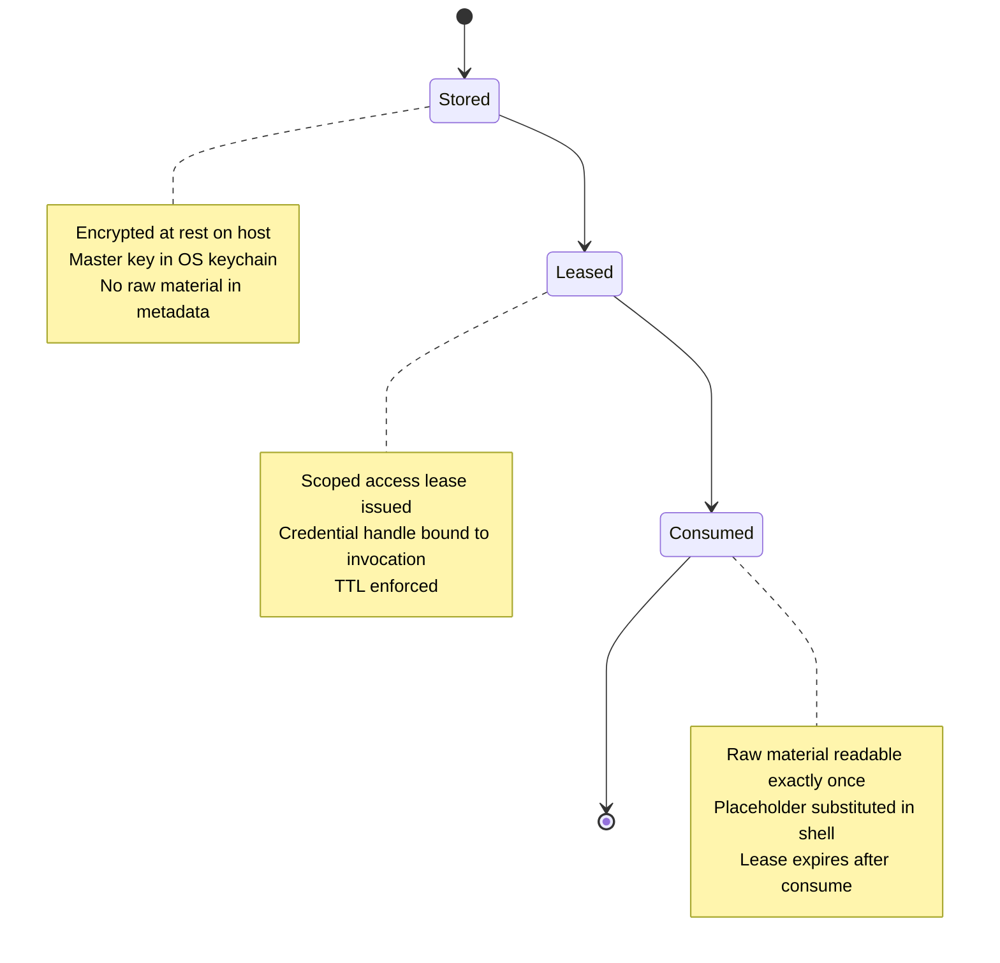

## Overview

IronClaw protects secrets, enforces sandboxing, and prevents prompt injection through a multi-layered architecture. The security perimeter is the nine-stage **kernel boundary**, where every privileged operation is authorized, approved, resourced, and executed under scoped policy and redacted evidence. No operation bypasses this boundary—not loops, not first-party code, not elevated-trust extensions. Trust is a *ceiling*, never a bypass: even `FirstParty` and `System` trust levels require explicit grants, leases, and obligation handling.

## Kernel Boundary: Authorization Pipeline

The kernel is Reborn's security perimeter—a family of nine crates, each owning exactly one stage of a pipeline. Every privileged effect must cross all nine stages in order.

### Nine-Stage Pipeline

<!-- openwiki: mermaid parse failed and this diagram was converted to a text fence so it does not break rendering. Fix the diagram source and restore the mermaid fence. Parser error: Heuristic: an unescaped angle bracket inside a label breaks rendering; rephrase the label. -->
```text
flowchart LR
    Req["Request"]
    Stage1["1. Admission<br/>ironclaw_turns"]
    Stage2["2. Claimed exec<br/>ironclaw_processes"]
    Stage3["3. Trust ceiling<br/>ironclaw_trust"]
    Stage4["4. Authorization<br/>ironclaw_authorization"]
    Stage5["5. Approval<br/>ironclaw_approvals"]
    Stage6["6. Reservation<br/>ironclaw_resources"]
    Stage7["7. Policy plan<br/>ironclaw_runtime_policy"]
    Stage8["8. Membrane<br/>ironclaw_capabilities"]
    Stage9["9. Execution<br/>ironclaw_host_runtime"]
    Result["Effect or deny"]

    Req --> Stage1 --> Stage2 --> Stage3 --> Stage4 --> Stage5 --> Stage6 --> Stage7 --> Stage8 --> Stage9 --> Result
    
    style Stage1 fill:#e8f4f8
    style Stage2 fill:#e8f4f8
    style Stage3 fill:#fff4e6
    style Stage4 fill:#fff4e6
    style Stage5 fill:#fff4e6
    style Stage6 fill:#f0e6ff
    style Stage7 fill:#f0e6ff
    style Stage8 fill:#ffe6e6
    style Stage9 fill:#ffe6e6
```

Kernel authorization pipeline: every privileged operation passes through nine ordered stages. Admission (blue) and claimed execution manage durability; authorization (orange) evaluates trust, grants, and approvals; reservation (purple) governs resources; membrane (red) creates the sealed `Authorized` witness; execution mediates the actual effect with scoped policy.

| Stage | Responsibility | Failure mode |
|---|---|---|
| **Admission** | Request becomes durable, one active run per thread, idempotent | Deny on duplicate or conflict |
| **Claimed execution** | Admitted work claimed and leased to terminal state | Deny on lease conflict; heartbeat manages lifetime |
| **Trust ceiling** | Requested trust evaluates to host-validated effective ceiling | Deny if ceiling is lower than required |
| **Authorization** | Ceiling + grants resolve to allow / deny / require-approval | Default-deny; no matching grant = deny |
| **Approval** | Require-approval resolves to scoped, fingerprinted lease or durable denial | Fail-closed; approval decision persisted before lease issued |
| **Reservation** | Cost/capacity reserved before work, reconciled after completion | Deny if resource limit exceeded or storage fails |
| **Policy planning** | Deployment/org policy select lane and enforcement posture | Fail-closed; invalid profiles rejected, never silently downgraded |
| **Membrane** | All prior stages fold into one sealed `Authorized` witness | Witness produced once; no duplication |
| **Mediated execution** | Witness authorizes exactly one lane call with scoped policy | Restricted mounts, staged credentials, redacted evidence |

### Sealed Artifacts

Four artifacts prove a stage ran. Each has exactly one sanctioned mint:

- **`Authorized` witness** (`ironclaw_host_api::authorized`): Proves the entire pipeline executed. Minted only by `ironclaw_capabilities::CapabilityHost`. Sealed by compiler-visible trait impl gating.
- **`EffectiveTrustClass`** (sealed by `ironclaw_trust`): Privileged variants (`FirstParty`, `System`) have no public constructor and no `Deserialize`. Crate-scoped visibility enforces this.
- **Fingerprinted approval lease**: Proves consent resolved to a decision. Minted by `ironclaw_approvals::ApprovalResolver` into `ironclaw_authorization`'s persistent lease store. Single-winner claim protocol (CAS with retries) prevents race conditions.
- **Resource receipt**: Proves capacity was reserved. Minted by `ironclaw_resources::ResourceGovernor` before work executes.

### Default-Deny Authorization

Authorization is **fail-closed**. A request is denied unless:

1. An explicit grant matches the caller's scope and requested effect.
2. The grant does not exceed the trust ceiling (ceiling is a *filter*, not a *grant*).
3. No approval is required, or an approval lease is held.
4. Resource capacity is available.

No matching grant means deny. There is no implicit fallback, no "close enough" match, and no privilege escalation via trust class alone. Even `FirstParty` and `System` trust levels require explicit grants to match a specific effect.

## Trust Hierarchy and Ceilings

Trust is a **ceiling** evaluated before authorization. The trust policy is immutable within a request.

### Trust Classes (from lowest to highest)



Trust ceiling hierarchy: higher ceilings permit higher-authority effects, but never bypass authorization. A `System` trust extension still requires a matching grant, a lease, and resource budget to call a privileged effect.

### Trust Policy Evaluation

Trust is evaluated in `ironclaw_trust::TrustPolicy::evaluate()`, the only place a privileged ceiling is produced. The policy consumes:

- **Requested trust input** (`TrustPolicyInput`): Package identity, version, provenance source (admin config, bundled registry, dynamic lookup).
- **Effective ceiling** (`EffectiveTrustClass`): The result, either `Sandbox` or `UserTrusted` (public constructors) or `FirstParty` / `System` (private, from evaluation only).

Ceilings are **immutable within a request** and **invalidated on changes**: mutation publishes on `InvalidationBus` synchronously before any subsequent `evaluate()` call.

## Runtime Profile and Policy Resolution

The **runtime profile** determines deployment posture: sandbox kind, network mode, secret handling, approval gate, and audit level. Profiles are resolved by `ironclaw_runtime_policy::resolve()` from:

- **Deployment mode**: `LocalSingleUser`, `HostedMultiTenant`, `EnterpriseDedicated`.
- **Requested profile**: Family-specific (Local: `LocalSafe`, `LocalHost`, `LocalYolo`; Hosted: `HostedSafe`, `HostedDev`, `HostedYoloTenantScoped`; Enterprise: `EnterpriseSafe`, `EnterpriseDev`, `EnterpriseYoloDedicated`).
- **Org policy constraints**: Tenant/org ceiling (`max_profile`) and admin approvals.

### Resolved Policy Attributes

For each resolved profile, the policy specifies:

| Attribute | Examples | Role |
|---|---|---|
| **Filesystem backend** | `ScopedVirtual`, `HostWorkspace`, `TenantWorkspace`, `OrgDedicatedWorkspace` | Scoped mount policy; no host paths in multi-tenant |
| **Process backend** | `None`, `LocalHost`, `UserSandbox` | Shell execution lane; `None` = no processes |
| **Network mode** | `Brokered` (allowlist), `Allowlist` (hostname allowlist), `DirectLogged` (logged but not gated), `Direct` (unrestricted) | Egress control |
| **Secret mode** | `BrokeredHandles`, `TenantBroker`, `InheritedEnv`, `ScrubbedEnv` | Secret injection strategy |
| **Approval policy** | `AskAlways`, `AskWrites`, `AskDestructive`, `Minimal` | When user approval is required |
| **Audit mode** | `LocalMinimal`, `Standard` | Audit trail capture level |

### Monotonic Safety

Policy resolution enforces **monotonic safety**: deployment mode and org policy may *reduce* authority, never increase it. Invalid `(deployment, profile)` pairs fail closed with a typed error, never silently downgrade.

## Secret Leases and Credential Broker

Secrets are stored encrypted on host and injected into runtimes only at execution time, never in config or debug output. The `ironclaw_secrets` substrate provides **one-shot leases**: raw material is readable exactly once per lease.

### Secret Lifecycle



Secret lifecycle: stored encrypted, leased for scoped access with TTL, consumed once, then inaccessible.

### Credential Placeholder and Firewall

Secrets are never passed raw to processes. Instead:

1. **Placeholder generation**: A unique placeholder (e.g., `IRON_CREDENTIAL_xxx_END`) is generated for each secret binding.
2. **Credential firewall**: The kernel staging path holds the real secret; the process receives only the placeholder.
3. **Private proxy replacement**: A per-user proxy container has read-only access to credentials and replaces the placeholder with the real value only for approved upstream hosts.
4. **Never logged or captured**: The placeholder persists in output; the real value never appears in logs, transcripts, or diagnostic dumps.

### Encrypted Storage and Keychain Integration

- **Encryption**: `AES-GCM` authenticated encryption; `HKDF` key derivation with per-secret AAD (additional authenticated data).
- **Master key**: Stored in the OS keychain (`secret-service` on Linux, `security-framework` on macOS). Never touches disk; never serialized.
- **AAD derivation**: Tied to scope (tenant, user, agent, project) and secret metadata; tampering with metadata breaks decryption.

One production implementation uses the filesystem fabric (`ironclaw_filesystem`) for durability.

## Sandboxing Lanes

Every sandboxed execution runs through one of three lanes, each with distinct properties and threat models.

### Process Sandbox Lane (`ironclaw_sandbox`)

Runs OS processes inside Docker containers with credential firewall, container identity, per-tenant CA, and managed egress.

#### Architecture

- **User-scoped container**: One persistent container per `(tenant, user)` pair under `HostedSingleTenantVolumeSandboxed`.
- **Credential firewall**: Credentials are never raw in the process. A private proxy sidecar on a scoped internal Docker network intercepts outbound connections and replaces placeholders.
- **Container identity**: Per-tenant CA root key (never on disk, never serialized) issues unique identities per user/scope.
- **Managed egress**: Dedicated `ironsh/iron-proxy` sidecar container joins the private worker network and a host-shared upstream network. Applies hostname allowlist, rejects private-address destinations, preserves end-to-end TLS with SNI inspection.
- **Audit trail**: Request audit log is drained from the proxy before container removal and stored in a bounded per-proxy file.

#### Typed Plan Contract

Commands are specified as `SandboxProcessPlan` with typed sub-vocabularies:

- **Install plan**: Base image and package manager commands, validated before container creation.
- **Command plan**: Bounded shell invocation with configurable working directory and timeout.
- **Mounts**: Strictly typed (`ScopedVirtual`, `TenantWorkspace`, `TenantWorkspaceAndHome`) with read-only flags; no raw host paths.
- **Network plan**: Hostname allowlist or internal-only.
- **Credential bindings**: Placeholder + scope; never raw values in the plan.

#### Lifecycle and Concurrency

- **Adoption and restart**: Before each invocation, the transport adopts a running compatible container, restarts a stopped one, or recycles if the image or security posture changed.
- **Creation gate**: Concurrent first-calls on one user converge on one container creation via advisory lock.
- **Active-exec accounting**: Prevents idle sweeper from stopping a container while commands run.
- **Idle suspension**: Managed egress removes proxy container and invocation credentials but retains stopped worker's private network and host-side CA/key; inode retention preserves read-only file bind across wake-up.
- **Workspace lock**: Transport acquires advisory owner lock on the Docker workspace root; fails closed if another process holds it (prevents cross-process cleanup races).

### WASM Sandbox Lane (`ironclaw_wasm`)

Runs WASM components under deny-by-default host imports with fuel, epoch, memory, and instance ceilings.

#### Properties

- **Fresh store per call**: Aggregated memory accounting across multi-memory components.
- **Deny-by-default imports**: A component gets exactly the host capabilities composition explicitly wires. No access by omission.
- **Resource limits**: Fuel (computational cost), epoch (timeout), memory (total + per-table), instance (nested instances) ceilings via the shared `ironclaw_wasm_limiter`.
- **Guest diagnostic safety**: Each guest failure code and message is scrubbed and bounded to 4 KiB without splitting UTF-8. Host-runtime applies `MODEL_DIAGNOSTIC_MAX_BYTES` again before tracing.

#### Host-Import Traits

Each trait is deny-by-default with implementations for different policies:

- `WasmHostHttp`: Brokered network access (allowlist, managed proxy).
- `WasmHostWorkspace`: Scoped filesystem access.
- `WasmHostSecrets`: Staged credential handoff; never raw values.
- `WasmHostTools`: Nested tool invocation (controlled composition).
- `WasmHostClock`: System time (immutable per invocation).

### MCP Server Lane (`ironclaw_mcp`)

Runs Model Context Protocol servers as sandboxed processes with the same Docker isolation and credential firewall as the process sandbox.

#### Characteristics

- **Stdin/stdout transport**: Communicates with server over JSON-RPC.
- **Sandbox policy**: Uses the same credential firewall and egress control as process sandbox.
- **Tool discovery**: Server exposes tools via MCP's discovery protocol; kernel validates and filters by caller grant.
- **Staged invocation**: Credential handles are substituted only at tool invocation time.

## Safety Scanning and Prompt Injection Defense

The `ironclaw_safety` substrate detects and redacts prompt injections, credential leaks, and sensitive paths before they cross trust boundaries.

### Scanning Pipeline

<!-- openwiki: mermaid parse failed and this diagram was converted to a text fence so it does not break rendering. Fix the diagram source and restore the mermaid fence. Parser error: Heuristic: an unescaped angle bracket inside a label breaks rendering; rephrase the label. -->
```text
flowchart TD
    Untrusted["Untrusted input<br/>or LLM output"]
    Sanitizer["Sanitizer:<br/>Injection patterns"]
    Validator["Validator:<br/>Size & structure"]
    LeakDetector["Leak Detector:<br/>Credential formats"]
    Redaction["Redaction:<br/>Safe display form"]
    Result["Safe for<br/>model or storage"]
    
    Untrusted --> Sanitizer
    Untrusted --> Validator
    Untrusted --> LeakDetector
    Sanitizer --> Redaction
    Validator --> Redaction
    LeakDetector --> Redaction
    Redaction --> Result
    
    style Untrusted fill:#ffe6e6
    style Sanitizer fill:#fff4e6
    style Validator fill:#fff4e6
    style LeakDetector fill:#fff4e6
    style Redaction fill:#f0e6ff
    style Result fill:#e8f4f8
```

Safety scanning pipeline: untrusted input passes through sanitizer, validator, and leak detector. Redaction applies findings and produces a safe form for model or storage.

### Sanitizer: Injection Detection

The `Sanitizer` detects suspicious patterns before untrusted text is wrapped into model-visible markup:

- **Prompt injection patterns**: Escaped delimiters, instruction-like text following user input, role-play attempts.
- **Linear-time matching**: Bounded regexes (no catastrophic backtracking), `aho-corasick` for efficient multi-pattern matching.
- **Fuzz-guarded**: The `fuzz/` harness tests parsing and pattern matching; ReDoS regression guards allow ~2 s wall-clock budget.

Findings are **typed warnings**, not enforcement. The caller decides whether to block, redact, or flag for review.

### Leak Detector: Credential Scanning

The `LeakDetector` scans for known credential formats before output leaves a trust boundary:

- **Pattern matching**: AWS keys, API tokens, OAuth secrets, SSH keys, database URLs, plaintext passwords with labels.
- **Format detection**: Full single/double/backtick-quoted values, offset-prefixed character dumps (prevent whitespace-injection bypass).
- **Host paths**: Labeled paths like `password: /etc/shadow` detected and flagged.
- **No raw output**: Findings never carry the matched material, only the pattern class and location.

### Model Input Redaction

Before a prompt enters the model, `redact_model_input_text()` applies an infallible, source-independent transform:

- **Credential redaction**: Known formats replaced with `[REDACTED_CREDENTIAL]`.
- **Weak value redaction**: Labeled values like `password: letmein` redacted, even if not formally a credential.
- **Character-dump prevention**: Offset-prefixed whitespace-padded character sequences that reconstruct a labeled value are caught.
- **Host path redaction**: Provider-visible host paths like `/workspace` become `[REDACTED_HOST_PATH]`.
- **Bounded JSON parsing**: Encoded JSON that exceeds a bounded decoder fails closed.

Similarly, `redact_model_input_url()` redacts userinfo and credential query parameters; inline `data:` payloads pass through unchanged to preserve embedded images.

### Structural Validation

The `Validator` enforces size and structure limits:

- **Provider arguments**: Bounded to `PROVIDER_ARGUMENTS_MAX_BYTES` before dispatch (typically 16 KiB).
- **Metadata text**: Bounded to `PROVIDER_METADATA_TEXT_MAX_BYTES` (typically 4 KiB).
- **Tool names**: Bounded to `PROVIDER_TOOL_NAME_MAX_BYTES` (typically 256 bytes).
- **Guest diagnostics**: Error messages and logs from WASM guests bounded to 4 KiB per message.

Overflow fails closed; no truncation or partial transmission.

### Policy and Enforcement

The `Policy` engine decides action based on findings:

- **Severity**: Info, warning, error.
- **Action**: Allow, block, redact, flag-for-review.
- **Source**: Injection patterns, leaked credentials, structural violations.

Enforcement is the **caller's job**. The safety layer detects and redacts; obligation-handlers and membrane decide whether to proceed. This separation keeps detection dependency-light (no process or network deps) while allowing flexible enforcement at higher layers.

## Resource Limits and Quota Governance

The `ironclaw_resources` kernel stage enforces cost, quota, and capacity before work executes. No costed or quota-limited work executes without an active reservation; reservation failure is a denial, never a reason to proceed and true up later.

### Dimensions and Scopes

**Resource dimensions**:

- **Usd**: Cost in dollars.
- **InputTokens** / **OutputTokens**: LLM token consumption.
- **WallClockMs**: Execution time.
- **OutputBytes**: Output data size.
- **NetworkEgressBytes**: Data transferred to external hosts.
- **ProcessCount**: Number of concurrent processes.
- **ConcurrencySlots**: Parallel work capacity.

**Account scopes** (nested):

- Tenant (organization).
- User (within tenant).
- Project (within tenant).
- Agent (within tenant).
- Mission / thread (within agent).

### Governor Implementations

The `ResourceGovernor` trait has three implementations:

- **`InMemoryResourceGovernor`**: Ephemeral, used in tests.
- **`PersistentResourceGovernor`**: Durable, filesystem-backed.
- **`FilesystemResourceGovernor`**: The production implementation, persists reserves/receipts via `ScopedFilesystem`.

### Reserve → Reconcile → Release Protocol

1. **Reserve**: Before work, request a `ResourceReservation`. If budget is exhausted or storage fails, deny immediately.
2. **Execute**: Work runs under the reservation.
3. **Reconcile**: After completion, reconcile actual usage against the reservation and emit a receipt.
4. **Release**: Capacity is released. Over/under-usage is tracked for audit and billing.

Every scope is independent. A user hitting their limit does not block another user; a tenant ceiling does not block another tenant. Nested scopes are respected: a project limit is evaluated within its tenant's ceiling.

## Kernel Boundary as Security Perimeter

The kernel boundary is not a helper; it is the **only path** through which side effects happen.

### No Bypass Paths

- **Loops cannot escape**: Agent-loop code requests effects through host ports; there is no direct dispatcher, no ambient credentials, no privileged APIs.
- **Extensions go through the kernel**: Channel extensions (Slack, Telegram) and shipped first-party code enter the same turn/run contracts as external products.
- **First-party is not a bypass**: Higher trust classes get a higher ceiling, but still require explicit grants, scoped mounts, leases, and resource budget. No shipped code reaches a privileged effect by any other path.

### Scoped Execution Context

Every invocation carries:

- **Scope**: Tenant, user, agent, project, thread identity.
- **Mounts**: Filesystem access restricted to scoped paths; no host-wide access in multi-tenant.
- **Credentials**: Staged via placeholder; real values held in private proxy, never in process memory.
- **Network**: Hostname allowlist or proxy-mediated egress.
- **Obligations**: Secrets and output must be cleaned up even on panic; redaction applied before evidence reaches storage.

## Obligation Handling and Redacted Evidence

After an effect completes, the kernel applies obligations: cleanup and sanitization of secrets and output.

### Obligation Lifecycle

1. **Effect grants**: The `Authorized` witness carries a list of active obligations (e.g., "redact output", "delete temp files", "revoke session").
2. **Effect runs**: The lane completes and returns a result.
3. **Obligation fulfillment**: The host runtime applies each obligation before storing or returning the result.
4. **Panic-safe**: Obligations are tracked in a RAII guard; even on panic, cleanup runs.

### Output Sanitization

Model output is scanned for leaked credentials and redacted before it reaches the transcript or is returned to the caller.

### Secrets Cleanup

Temporary credential files are deleted, session tokens are revoked, and placeholder state is discarded.

## Architecture Documentation

- **Kernel boundary details**: [Kernel Authority & Security Boundary](/openwiki/architecture/kernel.md)
- **Runtime profiles and deployment modes**: `docs/internal/reborn/contracts/runtime-profiles.md`, `docs/internal/reborn/contracts/runtime-selection.md`
- **Capability access and leases**: `docs/internal/reborn/contracts/capability-access.md`
- **Secrets custody**: `docs/internal/reborn/contracts/secrets.md`, `docs/internal/reborn/contracts/storage-placement.md`
- **Safety scanning**: `.claude/rules/safety-and-sandbox.md`
- **Network policy and egress control**: `docs/internal/reborn/contracts/network.md`
- **WebUI security parity**: `docs/internal/reborn/security-parity/`

## Crate Responsibility Summary

| Crate | Layer | Responsibility |
|---|---|---|
| `ironclaw_trust` | Kernel | Trust-ceiling evaluation; immutable within request; invalidation on changes |
| `ironclaw_authorization` | Kernel | Grant matching; lease state; default-deny |
| `ironclaw_approvals` | Kernel | Approval resolution; durable approval/denial records; policy stores |
| `ironclaw_runtime_policy` | Kernel | Profile resolution; deployment/org policy; monotonic safety; fail-closed |
| `ironclaw_resources` | Kernel | Cost/quota/capacity governance; reserve-execute-reconcile protocol |
| `ironclaw_capabilities` | Kernel | Membrane; sealed `Authorized` witness; effect routing |
| `ironclaw_sandbox` | Lanes | Docker container execution; credential firewall; per-tenant CA; managed egress |
| `ironclaw_wasm` | Lanes | WASM component execution; deny-by-default imports; resource limits |
| `ironclaw_mcp` | Lanes | MCP server execution; sandbox isolation; tool filtering |
| `ironclaw_secrets` | Substrates | Secret custody; one-shot leases; encrypted storage; keychain integration |
| `ironclaw_safety` | Substrates | Prompt-injection detection; credential scanning; redaction; structural validation |
| `ironclaw_network` | Substrates | Egress policy; hostname allowlist; private proxy; TLS with SNI inspection |
